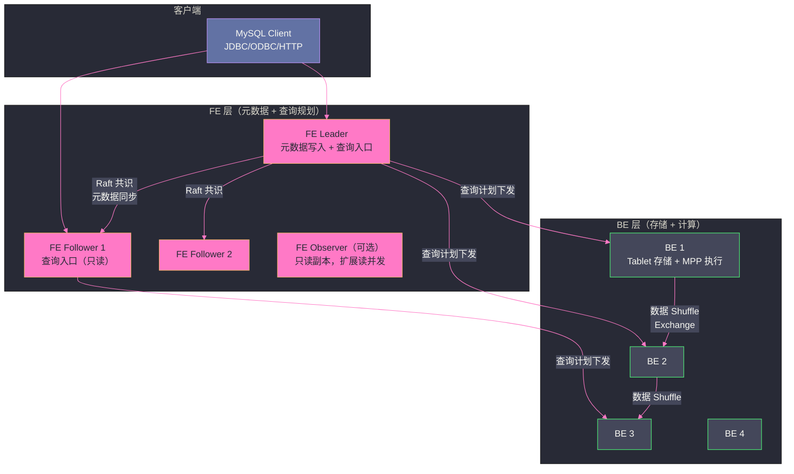

# 01 Doris 全局架构——FE BE 分离与 MPP 执行

## 摘要

Apache Doris（原 Palo，百度开源）是一款面向实时分析场景的 MPP OLAP 数据库，以"兼顾极致性能与易用性"著称。其 FE/BE 两层架构将元数据管理与数据计算彻底分离，BE 节点承担存储与计算的双重职责，通过 MPP 执行引擎实现分布式并行查询。本文从 Doris 诞生的动机出发，深入剖析 FE/BE 的职责边界、查询的完整执行路径、与 [[ClickHouse]]/[[Trino]] 的架构差异，以及 Doris 3.0 存算分离架构的演进方向。

---

## 第 1 章 为什么需要 Doris——OLAP 系统的演进困境

### 1.1 传统 OLAP 方案的代价

在 Doris 出现之前，企业的实时分析通常通过以下方案解决：

**方案一：Hive/Spark + HDFS**：离线数仓，以 T+1 为代价换取大规模数据处理能力。无法满足"当天数据实时查询"的需求。

**方案二：Kylin 预计算**：将常见查询的结果提前在 OLAP Cube 中预计算，查询时直接返回。优点是查询延迟极低，缺点是"Cube 爆炸"——多维组合数量呈指数级增长，不可能预计算所有维度组合；维度变更时需要全量重算 Cube，成本极高。

**方案三：Elasticsearch**：优秀的倒排索引和全文检索，但 ES 的聚合性能不如专业 OLAP 引擎，存储效率低（行存+倒排索引），大规模数据下存储成本高。

**方案四：ClickHouse**：极致的单表聚合性能，但分布式 JOIN 能力弱，数据更新/删除效率低（[[ClickHouse]] 的 Mutation 是重写整个 Part 的异步操作），运维复杂（需要手动管理 Shard/Replica 拓扑）。

Doris 尝试在以上方案之间找到一个更好的平衡点：
- 支持标准 SQL（兼容 MySQL 协议，降低迁移成本）
- 实时数据写入 + 近实时查询（秒级到分钟级延迟，不是 T+1）
- 支持高效的数据更新（Unique Key 模型的 UPSERT）
- 支持复杂多表 JOIN（完整的 CBO 优化器 + Shuffle JOIN）
- 运维简单（相比 ClickHouse 不需要手动管理 CRUSH Map 和副本拓扑）

> [!note] 设计哲学
> Doris 的设计哲学是"可用性优先于极致性能"。它在单表大数据量聚合的性能上可能略逊于 ClickHouse，但在多表关联、数据更新、运维复杂度、SQL 兼容性等方面全面胜出。选择 Doris 还是 ClickHouse，本质上是在"单表极致查询性能"和"全场景均衡能力"之间做权衡。

---

## 第 2 章 FE/BE 两层架构

### 2.1 架构总览

Doris 采用严格的两层架构：**FE（Frontend）** 负责元数据管理和查询规划，**BE（Backend）** 负责数据存储和查询执行。



### 2.2 FE——元数据的大脑

FE 的职责：

**1. 元数据管理**：维护所有数据库/表/分区/Tablet 的元数据，包括：
- 表结构（Schema）、分区信息、Tablet 分布
- 用户权限、查询配额
- 集群拓扑（BE 节点的地址和状态）
- 进行中的 Load Job、Alter 操作的状态

FE 使用**内嵌的 BDB JE（Berkeley DB Java Edition）**存储元数据，并通过 **Raft 协议**在多个 FE 节点间同步（从 Doris 1.2 开始逐步用内置的 Raft 替换了早期的外部 BDB 复制组）。

**2. SQL 解析与优化**：接收客户端 SQL，经过解析（生成 AST）→ 语义分析 → 逻辑优化 → 物理优化（CBO），生成**分布式执行计划**（Fragment 图）。

**3. 查询协调**：将分布式执行计划中的各个 Fragment 分发到对应的 BE 节点，协调多个 BE 并行执行，收集结果并返回给客户端。

FE 是**无状态查询处理 + 有状态元数据管理**的混合体——查询本身是无状态的（任何 FE 节点都可以处理任意查询），但元数据是有状态的（通过 Raft 保证一致性）。

**FE 高可用**：Doris 部署奇数个 FE 节点（通常 3 或 5），其中 1 个 Leader 处理元数据写操作，其余 Follower 可以处理读查询。Leader 故障时，Raft 自动选举新 Leader，FE 集群高可用。

**FE Observer**：可以添加只读的 Observer 节点，扩展读查询的并发处理能力，但 Observer 不参与 Raft 投票，不会成为 Leader。

### 2.3 BE——存储与计算的一体化节点

BE 的职责：

**1. 数据存储**：每个 BE 节点管理本地磁盘上的若干 Tablet（Doris 的最小数据分片单元）。每个 Tablet 内部使用**列式存储格式**（类似 ClickHouse 的 MergeTree，但实现不同），数据按主键排序存储，支持 BloomFilter、ZoneMap（类似 ClickHouse 的 minmax）等索引。

**2. 查询执行**：接收 FE 下发的执行计划 Fragment，执行本地扫描、过滤、聚合等操作，并通过 Exchange 节点与其他 BE 进行数据 Shuffle，完成分布式 JOIN 和聚合。

BE 既是存储节点又是计算节点，没有独立的"计算节点"——这种存算一体的架构在数据本地性方面有优势（计算尽量在数据所在的 BE 上执行，减少网络传输），但扩展灵活性不如存算分离架构（Doris 3.0 解决了这个问题）。

**BE 高可用**：每个 Tablet 有多个副本（通常 3 个），分布在不同的 BE 节点上。某个 BE 节点故障时，FE 感知后将对应 Tablet 的查询路由到存活的副本，同时触发副本补全（在其他 BE 上重建缺失的副本）。

---

## 第 3 章 查询的 MPP 执行路径

### 3.1 Fragment 与 Exchange——分布式执行的基本单元

Doris 的 MPP 执行框架与 [[Trino]] 的 Stage 概念类似，将一个 SQL 查询的执行计划分解为多个 **Fragment**（执行片段），每个 Fragment 在一个 BE 上执行：

```sql
SELECT region, SUM(amount)
FROM orders o JOIN users u ON o.user_id = u.user_id
WHERE o.date > '2024-01-01'
GROUP BY region
ORDER BY SUM(amount) DESC
LIMIT 100
```

这个查询会被分解为以下 Fragment：

```
Fragment 1（Scan）：在所有 BE 上并行扫描 orders 表的 Tablet
   └── 本地过滤 WHERE date > '2024-01-01'
   └── Exchange（Broadcast/Hash Shuffle）→ Fragment 2

Fragment 2（Scan）：在所有 BE 上并行扫描 users 表的 Tablet
   └── Exchange → Fragment 3

Fragment 3（Join + Aggregate）：Hash JOIN（orders × users）
   └── 本地 GROUP BY region 做局部聚合
   └── Exchange（Hash Shuffle on region）→ Fragment 4

Fragment 4（Global Aggregate）：合并各 Fragment 3 的局部聚合结果
   └── 全局 GROUP BY + ORDER BY + LIMIT
   └── 返回结果给 FE
```

**Exchange 节点**负责 Fragment 之间的数据传输，支持两种模式：
- **Broadcast**：将小表的数据广播到所有参与 JOIN 的 BE（适合小表 JOIN 大表）
- **Hash Shuffle**：按 JOIN Key 的哈希值将数据重新分发，确保相同 Key 的数据在同一 BE 上做 JOIN（适合大表 JOIN 大表）

### 3.2 Pipeline 执行引擎（Doris 2.0+）

Doris 2.0 引入了基于 Pipeline 的向量化执行引擎（与 ClickHouse 的 Pipeline 思路相同，详见 [[04 查询执行引擎——向量化与 Pipeline]]），将每个 Fragment 进一步拆分为多个 **Operator**，形成流水线：

```
Scan → Filter → HashJoin(Build) → HashJoin(Probe) → Aggregate → Exchange
```

Pipeline 执行的关键改进：
- **向量化**：每个 Operator 处理一批行（Block，通常 4096 行），而不是逐行处理
- **多线程并行**：同一 Fragment 内多个 Pipeline 实例并行执行（对应 CPU 核心数）
- **内存管理**：统一的 Query Memory Manager 控制单个查询的内存上限，防止 OOM

Doris 2.0 的向量化执行引擎与 StarRocks 共享血缘（StarRocks 是 Doris 的一个 fork，两者的执行引擎演进路径相似）。

---

## 第 4 章 Doris 与同类系统的架构对比

### 4.1 Doris vs ClickHouse

| 维度 | Doris | ClickHouse |
| :--- | :--- | :--- |
| **架构层次** | FE（规划层）+ BE（存储+计算层） | 无专门的规划层，每个节点同质 |
| **分布式 JOIN** | 完整 MPP Shuffle JOIN（大表 × 大表） | 主要是广播 JOIN，大表 JOIN 弱 |
| **数据更新** | Unique Key 模型（高效 UPSERT） | Mutation 异步重写，代价高 |
| **SQL 兼容性** | MySQL 协议兼容，标准 SQL | 大量方言，与标准 SQL 差异多 |
| **运维复杂度** | 中（FE+BE 两种进程，自动副本管理） | 中（需手动管理 Shard/Replica 拓扑） |
| **单表大数据聚合** | 好 | 极好（稀疏索引+SIMD 向量化） |
| **实时数据写入** | 极好（Stream Load 吞吐高） | 好（批量写入，不支持实时更新） |

### 4.2 Doris 3.0：存算分离架构

Doris 2.x 是存算一体架构——BE 既存数据又做计算。这带来的问题：扩容时需要同时扩展存储和计算，灵活性差；计算密集的 Ad-hoc 查询与存储密集的数据导入互相竞争资源。

**Doris 3.0** 引入存算分离架构：
- 数据存储在远端对象存储（S3/HDFS）或共享存储上
- BE 节点只做计算，本地磁盘只作为缓存（Cache）
- 可以独立弹性扩缩容计算节点（BE）和存储层（对象存储）

这种架构与 Snowflake 的 Cloud Service + Virtual Warehouse 模式类似，适合云原生 Kubernetes 部署，是 OLAP 系统的主流演进方向。

---

## 第 5 章 小结

Doris 的核心架构优势在于：

1. **FE/BE 职责清晰**：FE 专注元数据和查询规划，BE 专注存储和执行，分工明确，扩展独立
2. **完整 MPP 执行**：支持完整的 Shuffle JOIN，多表关联查询性能远优于 ClickHouse
3. **MySQL 协议兼容**：降低迁移和使用成本，BI 工具直接对接
4. **自动副本管理**：不需要手动配置 CRUSH Map，BE 故障后 FE 自动触发副本补全

Doris 的定位是"兼顾易用性和性能的 OLAP 数据库"，在实时数据导入、多表关联、数据更新等场景全面优于 ClickHouse，但单表极大数据量的聚合性能略逊。

---

**延伸阅读**：
- [[02 Doris 存储引擎——Tablet、Rowset 与 Compaction]]
- [[04 Doris 数据模型——Duplicate、Aggregate 与 Unique]]
- [[01 ClickHouse 全局架构——列式存储与 MPP 执行引擎]]（对比参考）
