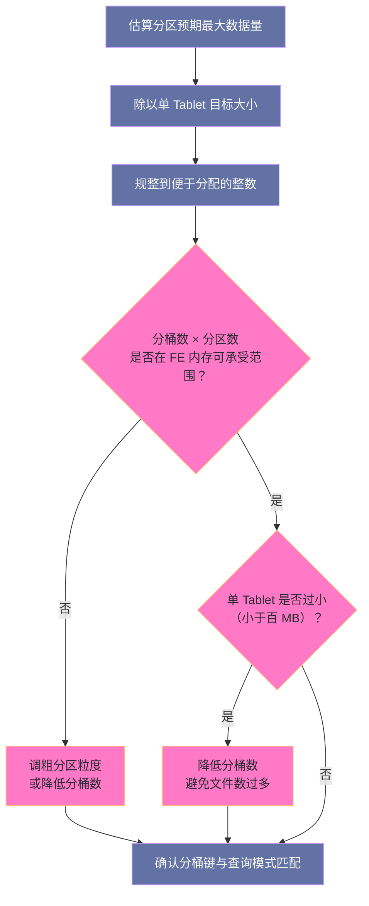
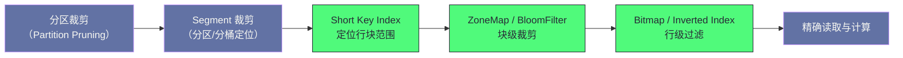
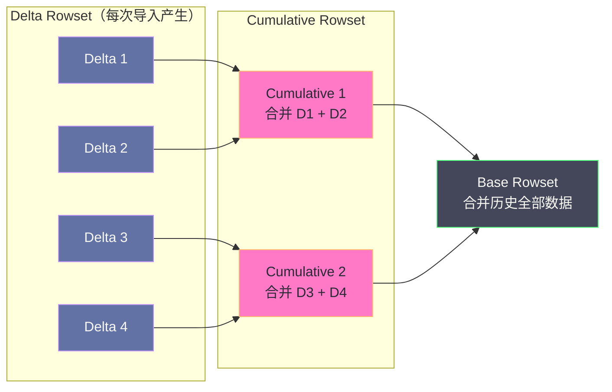

# 02 Doris 存储引擎——Tablet、Rowset 与 Compaction

**摘要：**

Doris 的存储引擎可以概括为"**LSM-Tree 的写入模型 + 列式存储的读取模型**"这两条线的交汇。本文按"数据怎么被切开、怎么写下去、怎么被读出来、怎么被整理"四步展开。第一步讲 Tablet——它既是数据分片的物理单元，也是并行扫描的基本单位，因此它的数量同时决定查询并行度与 FE 的元数据规模。第二步讲 Rowset 与 Segment——每次导入生成一批不可变的列式文件，写入路径只追加不修改，这带来了极高的写吞吐，也带来了"必须持续整理"的义务。第三步讲三级过滤索引（Short Key Index、ZoneMap、BloomFilter）如何形成"从粗到细"的裁剪链，以及它们各自的失效条件——这是理解"为什么同一张表换一种查询写法就慢十倍"的关键。第四步讲 Compaction 的两阶段策略、Score 调度机制，以及积压的成因与处置。最后对照 ClickHouse 的 MergeTree 说明两条路线的取舍，并给出存储设计的边界与反例。

---

## 第 1 章 Tablet：最小数据分片单元

### 1.1 从表到 Tablet 的两层映射

一张 Doris 表的数据通过两层机制落到具体存储位置。

**第一层是分区（Partition）**，把表按时间或业务维度切成独立的数据范围。分区的价值有两条：**查询剪枝**（只扫描相关分区）与**生命周期管理**（按分区做 TTL 删除，而不是逐行删数据）。

**第二层是分桶（Bucket）**，在每个分区内按分桶键的哈希值把数据分成 N 个桶，每个桶对应一个 **Tablet**。

```text
表 orders
 ├── 分区 p202601（按 user_id 哈希分 32 桶）
 │    ├── Bucket 0  → Tablet 10001（3 副本，分布在不同 BE）
 │    ├── Bucket 1  → Tablet 10002
 │    └── ...（共 32 个 Bucket）
 └── 分区 p202602
      ├── Bucket 0  → Tablet 20001
      └── ...
```

因此 **Tablet 总数 = 分区数 × 分桶数 × 副本数**。这个乘法关系是后面所有讨论的基础——它意味着"分区粒度"与"分桶数"这两个看似独立的决策，会被彼此放大。

### 1.2 Tablet 的物理目录结构

在 BE 的磁盘上，每个 Tablet 对应一个目录，目录下按 Rowset 分文件夹，每个 Rowset 内是若干 Segment 文件。

```text
/data/storage/shard_0/
├── 10001.hdr                 Tablet 头文件（Schema 版本、Rowset 列表等元数据）
└── 10001/
    ├── rowset_0/             初始 Rowset（Base Rowset）
    │   ├── 0.dat              Segment 0 的数据文件
    │   ├── 0.idx              Segment 0 的索引文件
    │   └── 1.dat, 1.idx, ...  多个 Segment
    ├── rowset_1/             某次导入产生的 Delta Rowset
    │   └── 0.dat, 0.idx
    └── rowset_2/
        └── ...
```

这里有两处设计值得留意。**其一，Rowset 是目录级的组织单位**——一次导入产生的所有 Segment 被打包在一个 Rowset 目录下，提交与回滚都以 Rowset 为单位，这让"导入原子性"在存储层的实现变得简单。**其二，数据文件与索引文件分离**（`.dat` 与 `.idx`），这使得"只读索引做裁剪、不读数据"成为可能，也便于两者采用不同的缓存策略。

### 1.3 Tablet 数量为什么是元数据问题

Tablet 的数量约束不是磁盘问题，而是 **FE 堆内存问题**。FE 的内存中需要维护每个 Tablet 的元数据（所属分区、分桶键范围、副本位置、版本信息、状态），这些对象常驻内存，且随"分区数 × 分桶数"增长。

举一个具体的量级：一张按天分区、每天 32 桶、保留两年的表会产生 `730 × 32 ≈ 23000` 个 Tablet；如果有几十张这样的表，Tablet 总数会到几十万级；再加上副本数与每个 Tablet 上的 Rowset 版本记录，FE 内存压力会迅速上升。

由此推出两条设计纪律：**分区粒度不要过细**（能用月分区就不用天分区，除非单分区数据量确实过大）；**分桶数不要过大**（够用即可，因为它会被分区数放大）。两条纪律的本质是同一个——在"查询并行度"与"元数据规模"之间找平衡点。

### 1.4 Tablet 与并行度的关系

Tablet 是**并行扫描的基本单元**：同一个 Tablet 的数据只能由一个 BE 扫描，不能跨 BE 并行扫描同一个 Tablet。这条约束推出三条实用结论。

**结论一：Tablet 数少于 BE 数时会有 BE 闲置。** 假设集群有 20 个 BE，但某张表只有 8 个 Tablet，那么同一时刻最多只有 8 个 BE 能参与这张表的扫描。这就是为什么"分桶数不能太少"。

**结论二：Tablet 大小需要落在合理区间。** 太小则单个 Tablet 的文件数多、打开文件的固定开销占比高；太大则单个 BE 处理一个 Tablet 的耗时长，长尾效应明显。生产经验通常把单 Tablet 数据量控制在百 MB 到 GB 之间。

**结论三：Tablet 的分布决定负载是否均衡。** 如果某些 BE 持有过多热点 Tablet，就会出现"部分 BE 忙、部分 BE 闲"的情况。Doris 的均衡机制会自动迁移副本，但迁移本身有成本（占用网络与磁盘 IO）。

### 1.5 分桶数的计算与不可变性

分桶数的计算方法看似简单，但有一个容易被忽略的性质：**它在建表后无法直接修改。**

计算的基本形式是"分区预期数据量除以单 Tablet 目标大小"，例如每月 100 GB 数据、目标单 Tablet 300 MB，则分桶数约为 333，实际取值通常会规整到便于分配的整数。

需要强调的是"**预期最大数据量**"这个口径。按当前数据量计算分桶数会带来一个隐蔽的问题：当前数据量小的时候，看起来分桶数很充足，于是团队把设计当作已验证；等数据涨到十倍，才发现单 Tablet 过大、并行度不足——而此时修改分桶需要重建表并重新导入全部数据，代价极高。



分桶数的两个方向都有代价：**过少则并行度不足、单 Tablet 过大**；**过多则文件数多、FE 元数据开销大**。因此它不是一个"越大越好"或"越小越好"的参数，而是一个需要按数据规模与集群规模共同确定的值。

### 1.6 Tablet 副本与读写一致性

Tablet 的多副本带来一个必须回答的问题：**写入时如何保证多个副本的数据一致？**

Doris 的处理方式与"每次写入都同步所有副本"不同。它采用"**一次写入由一个副本负责落盘，其余副本从该副本拉取**"的模式：导入请求在某个副本上先落盘，然后其他副本通过复制机制同步数据。只有当所有副本都完成同步并确认后，这次导入才算提交成功。

这个模式带来两个性质。**其一，写放大被控制**（一份数据只写一次，其余靠复制），代价是提交延迟取决于最慢的副本——如果某个副本所在 BE 负载高，整批导入的提交时间就被它拖住。**其二，副本数量影响写入延迟**（副本越多，等待最慢副本的概率越大），这也是"三副本是常见默认值"的原因之一——它在可靠性与写入延迟之间取了一个平衡。

读取侧的一致性则靠版本快照保证：查询开始时确定版本，执行期间即使有新数据提交，也不会改变这次查询的结果。**"写入强一致、读取快照一致"** 这个组合，是分析型存储引擎的常见取舍——它牺牲了"读到最新数据"的实时性，换来了查询结果的稳定与可重复。

---

## 第 2 章 Rowset 与 Segment：不可变的写入单元

### 2.1 Rowset 的生命周期

每次数据导入（Load Job）在每个目标 Tablet 上创建一个新的 **Rowset**——由一个或多个 Segment 文件组成。Rowset 一旦创建就**不可变**（Immutable），此后只会被读取或整体删除，不会被修改。

这个"只追加不修改"的模型是 Doris 写吞吐的来源：**写入路径不需要查找旧数据的位置，也不需要原地更新，只需要顺序写一批新文件**。它与 LSM-Tree 的 MemTable 落盘、与 ClickHouse 的 Part 生成是同一类设计。

代价则是读路径的复杂度：查询时可能需要同时读取多个 Rowset 并在内存中合并，Rowset 越多，合并开销越大。**这就是 Compaction 必须持续运行的根本原因——它不是在"优化"，而是在偿还写入模型欠下的读代价。**

### 2.2 Base Rowset 与 Delta Rowset

Doris 把 Rowset 分成两类，它们的语义不同。

| 类型 | 产生方式 | 特征 |
|---|---|---|
| Base Rowset | 由 Base Compaction 生成 | 体量大、代表 Tablet 的历史稳定数据 |
| Delta Rowset | 每次导入生成 | 体量小、数量随导入频率增长 |
| Cumulative Rowset | 由 Cumulative Compaction 生成 | 介于两者之间，由若干 Delta 合并而来 |

三类 Rowset 共同构成 Tablet 的版本链。查询时读取的是"Base + 所有 Cumulative + 所有 Delta"的合并结果，因此**版本链的长度直接决定读取代价**。Compaction 的作用就是把这条链缩短。

### 2.3 Segment 的物理布局

一个 Segment 文件（`.dat`）的内部布局大致如下：

```text
┌──────────────────────────────────────┐
│ Segment Header（Schema 版本、行数等）  │
├──────────────────────────────────────┤
│ Short Key Index（稀疏索引，每 1024 行）│
├──────────────────────────────────────┤
│ Column Data（列式存储，各列独立压缩）  │
│   列 1 的数据块：[v0, v1, ...]        │
│   列 2 的数据块：[v0, v1, ...]        │
├──────────────────────────────────────┤
│ Column Index（列级索引）              │
│   ZoneMap（每块的 min/max）           │
│   BloomFilter（按列按块）             │
│   Bitmap Index（可选，低基数列）       │
├──────────────────────────────────────┤
│ Segment Footer（各部分偏移量）         │
└──────────────────────────────────────┘
```

这个布局的设计意图很清楚：**把"能用于裁剪的信息"集中放在文件内可快速定位的位置**。读取时先读 Footer 拿到各部分的偏移量，再读 Short Key Index 定位行范围，然后读列索引做块级裁剪，最后才读真正需要的数据块。**读取路径的每一步都在做"能不能少读一点"的判断**，而不是"读了再过滤"。

### 2.4 反事实：如果允许原地更新会怎样

设想 Doris 允许原地修改 Segment 中的数据，会带来什么？

**第一，写入会退化为随机 IO。** 修改一行意味着定位到该行所在的列数据块、解压、修改、重新压缩、写回。对于分析型负载（一次导入几十万行），这会比"写一批新文件"慢上数量级。

**第二，并发控制会变得复杂。** 多个导入任务同时修改同一个 Tablet 时，需要锁与版本管理来避免互相覆盖。而"只追加"模型下，每个导入写自己的 Rowset，天然并发安全。

**第三，崩溃恢复会变得脆弱。** 原地修改意味着"写到一半崩溃"会留下损坏的数据块；而"写新文件再原子提交"的模型下，崩溃只会留下一个未提交的 Rowset，直接删除即可。

因此"不可变"不是一个可以随意更换的实现细节，而是**与写入吞吐、并发安全、崩溃恢复三者绑定的结构性选择**。它换来的代价（读时要合并、需要 Compaction）是必须接受的配套成本。

### 2.5 Segment 的大小与切分

一个 Rowset 内的 Segment 数量与大小不是随意的，它受两个约束。

**约束一：单个 Segment 有大小上限。** 超过上限时，一次导入会切分出多个 Segment。这样做的目的是控制裁剪粒度——索引是在 Segment 内组织的，如果一个 Segment 大到几十 GB，基于它的裁剪粒度就会很粗。

**约束二：Segment 数量不宜过多。** 每个 Segment 都要独立打开、独立读索引、独立做裁剪判断。如果一次导入产生上千个很小的 Segment，读取时的文件打开与索引读取开销会显著上升。

这两个约束共同把 Segment 的大小推向一个中间区间：**太大则裁剪粒度粗，太小则固定开销高。** 这与很多存储系统里"块大小"的取舍是同一个逻辑，只是这里的"块"是 Segment。

顺带说明一个相关现象：**同一张表在不同导入批次下产生的 Segment 大小可能差异很大。** 如果某次导入的数据量很小，它产生的 Segment 也会很小。这意味着"小批次导入"的负面影响是双重的——既增加了 Rowset 数量，又产生了大量小 Segment。

---

## 第 3 章 三级过滤索引：从粗到细的裁剪链

### 3.1 Short Key Index：稀疏索引定位行范围

Short Key Index 是 Segment 内的**稀疏索引**：每 1024 行记录一个索引条目，条目内容是这一行的主键前缀（Doris 称之为 short key，长度有限制）。查询时通过二分查找在稀疏索引中定位到可能包含目标行的行块范围，再在行块内精确过滤。

这里的关键词是"**前缀**"——Short Key Index 只索引排序键的前若干列，因此**排序键的列顺序直接决定了哪些查询能利用这个索引**。把高频过滤列放在排序键的最左侧，是让 Short Key Index 生效的前提。

### 3.2 ZoneMap：列级 min/max 裁剪

ZoneMap 为每个行块（1024 行）的每一列记录最小值与最大值，用于快速判断"这个行块是否可能包含满足条件的行"。

```text
查询：WHERE amount > 5000
Block 1: amount ∈ [100, 800]    → max < 5000，跳过
Block 2: amount ∈ [300, 9000]   → 有交集，需要精确读取
Block 3: amount ∈ [1000, 3000]  → max < 5000，跳过
```

ZoneMap 的效果完全依赖数据的**局部有序性**：如果数据按 `amount` 排序存储，相邻行块内的取值接近，ZoneMap 的区间窄、裁剪效果好；如果 `amount` 随机分布，每个行块的区间都很宽（几乎覆盖全量取值域），ZoneMap 就形同虚设。

这条性质解释了一个常见困惑：**同一张表、同一条查询，在不同的数据导入顺序下性能差异巨大。** 如果数据是按时间顺序追加的，那么时间列的 ZoneMap 效果好；如果数据是打乱后导入的，时间列的 ZoneMap 就失效了。

### 3.3 BloomFilter：等值查询的精确否定

BloomFilter 为指定列的每个行块构建一个布隆过滤器，用于等值查询的快速否定判断。

它的语义是单向的：**判断"不在"是确定正确的（零误判），判断"可能在"则有误判率**。因此它的价值在于"用极小的空间代价排除掉绝大多数不可能命中的行块"，剩下的少量误判行块再精确读取。

BloomFilter 的适用条件是**高基数列的等值查询**（如 UUID、请求 ID、用户 ID）。对低基数列（如性别、状态）建 BloomFilter 没有意义——因为每个行块几乎都包含这些取值，过滤器无法排除任何行块。

需要权衡的是它的成本：BloomFilter 会占用额外存储（通常是原列大小的百分之几）并增加写入时的计算开销。因此**只对"确实存在高频等值查询"的高基数列开启**，而不是全表开启。

### 3.4 Bitmap Index 与 Inverted Index

除了上述两种通用索引，Doris 还提供两类面向特定场景的索引。

**Bitmap Index** 适合**低基数列的等值过滤与集合运算**。它把每个不同取值映射为一个位图（哪些行取该值），因此 `WHERE status IN ('a','b')` 这类查询可以直接做位图的或运算。它不适合高基数列——因为每个取值都要一个位图，基数越高位图数量越多，空间与运算开销都不可接受。

**Inverted Index（倒排索引）** 面向**全文检索与字符串匹配**。它让 Doris 在 OLAP 分析之外具备一定的日志检索能力（`MATCH` 语法），从而在部分场景减少对独立搜索引擎的依赖。它的定位需要说清楚：**它能覆盖"按关键词过滤 + 聚合统计"这类查询，但不等价于搜索引擎**——相关性排序、复杂分词策略、以及海量文档检索的工程优化，仍然是搜索引擎的强项。

### 3.5 三级索引的配合与失效条件

把三类索引放在一起看，它们构成一条"从粗到细"的裁剪链：



这条链的每一环都有明确的失效条件，而**绝大多数"查询变慢"都能在其中找到一环失效**。

| 环节 | 生效前提 | 典型失效写法 |
|---|---|---|
| 分区裁剪 | WHERE 条件直接作用在分区列上 | `WHERE YEAR(date) = 2026`（函数包裹分区列） |
| Short Key Index | 过滤列位于排序键前缀 | 过滤列在排序键之外 |
| ZoneMap | 数据在过滤列上局部有序 | 数据打乱导入 |
| BloomFilter | 高基数列的等值查询 | 用在低基数列上 |
| Bitmap Index | 低基数列的等值/集合查询 | 用在高基数列上 |

**这张表最实用的一条是"分区裁剪失效"**：把分区列包在函数里（`YEAR(date) = 2026`）是最常见的写法错误，它会让查询退化为全分区扫描，性能差几个数量级。正确的写法是把条件改写成范围（`date >= '2026-01-01' AND date < '2027-01-01'`）。

### 3.6 索引的存储与写入成本

索引不是免费的，它同时在三个地方产生成本，需要与收益一起权衡。

**成本一：存储空间。** ZoneMap 的空间开销很小（每块两个值），BloomFilter 的开销与配置的位数相关（通常是原列的百分之几），Bitmap Index 在低基数列上开销很小但在高基数列上会爆炸。

**成本二：写入时的计算。** 每写入一批数据，都要为启用了索引的列计算索引结构——计算 min/max、构建布隆过滤器、生成位图。这会让导入的 CPU 开销上升。

**成本三：Compaction 时的重复计算。** 合并 Rowset 时索引要重新生成，因此 Compaction 的代价也随索引数量上升。索引越多的表，Compaction 越重——**这是一个容易被忽略的连锁反应**。

由此得到索引设计的原则：**只对"确实存在高频过滤需求"的列建索引，而不是全表铺开。** 判断方法很直接：看慢查询日志里哪些列频繁出现在 WHERE 条件中，只为这些列建索引。反过来，如果某个索引建了但从未在任何查询中被利用（可以通过 Profile 观察裁剪效果来判断），它就是纯粹的负担。

### 3.7 索引与向量化执行的配合

索引负责"少读一些数据"，向量化执行负责"读到的数据算得快一些"。两者是互补的，但它们的配合方式有一个细节值得说明。

向量化执行以"批"为单位处理数据（通常数千行一批），而索引裁剪以"行块"为单位（通常 1024 行）。**当裁剪粒度与处理粒度对齐时，裁剪掉的块可以整块跳过计算**——这是最高效的情况。如果两者粒度错位，就可能出现"裁剪只去掉了半批数据，但整批仍要走一遍计算流程"的情况，收益被削弱。

由此推出一个实践建议：**在调优时应当同时观察"读取行数"与"计算行数"两个指标**。如果读取行数已经被裁剪得很好，但计算行数仍然很高，说明裁剪的收益没有传导到计算侧；如果两者接近，说明裁剪与计算配合良好。只看"扫描了多少行"是不够的，因为**扫描量小不等于计算量小**。

### 3.8 选择性：判断索引收益的关键量

决定一个索引是否值得建的，是查询条件的**选择性**——即"条件过滤后剩下的行数占总行数的比例"。选择性越高（剩下的行越少），索引的收益越大。

这个量决定了两件事：**索引能否有效裁剪**（选择性低意味着几乎每块都可能命中，ZoneMap 与 BloomFilter 都无法排除）、以及**裁剪的收益是否值得索引的维护成本**。

举两个对照的例子。`WHERE request_id = 'xxx'` 在十亿行表上通常只命中一行，选择性极高，BloomFilter 的价值巨大；`WHERE status = 'success'` 在成功率达九成的表上几乎命中全部行，选择性极低，任何索引都无法提供有效裁剪，查询只能靠全量扫描加向量化计算。

由此得到一条判断纪律：**建索引之前先估算条件的选择性，选择性低于某个量级的列不值得建索引。** 而这个估算不需要精确——只要知道"这个条件的过滤比例是千分之一还是九成"，就足以决定索引的价值。

顺带说明一个常见误判：**"查询慢"不等于"需要加索引"。** 如果一条查询的选择性本来就很低（注定要扫大部分数据），那么它的耗时主要来自扫描与计算量本身，加索引不会有任何帮助——此时正确的方向是优化存储格式（提高压缩率以减少 IO）、优化计算（向量化与并行度）、或者改变数据组织（预聚合成更小的表）。**先判断瓶颈是"读多了"还是"读得慢"，再决定动作。**

---

## 第 4 章 Compaction：持续偿还读代价

### 4.1 为什么需要 Compaction

每次导入都会在每个 Tablet 上生成一个 Delta Rowset。如果写入频繁（例如每分钟一次导入），一个 Tablet 在几小时内就可能积累几十到几百个 Delta Rowset。

查询时需要合并"Base + 所有 Cumulative + 所有 Delta"，Rowset 越多，多路归并的开销越大，查询延迟随之升高。更麻烦的是每个 Rowset 都要单独打开文件、读索引、做裁剪判断，**固定开销随 Rowset 数量线性增长**。

Compaction 的作用就是在后台把多个小 Rowset 合并成大 Rowset，把版本链缩短。它是**读性能的维护性支出**——不产生新的业务价值，但不做就会让读性能持续劣化。

### 4.2 两阶段策略：Cumulative 与 Base

Doris 用两阶段 Compaction 来平衡"频率"与"成本"。

**Cumulative Compaction（增量合并）** 把若干小 Delta Rowset 合并成一个较大的 Cumulative Rowset。它是高频触发的"小清洁"，触发条件是 Delta Rowset 数量超过阈值。它的特点是**单次代价小、执行频繁**，作用是让 Delta 数量维持在一个可控范围。

**Base Compaction（全量合并）** 把 Base Rowset 与所有 Cumulative Rowset 合并，生成新的 Base Rowset。它是低频触发的"深度清洁"，代价高（要读写 Tablet 的全量数据），触发条件是 Cumulative 的总量相对 Base 达到一定比例。它的特点是**单次代价大、执行稀疏**，作用是彻底清理历史版本。



这个两阶段设计的动机与内存分代回收的思路一致：**大部分对象（Delta）生命周期短、回收代价小，用高频轻量操作处理；少数对象（Base）需要完整整理，用低频重量操作处理。** 用一套策略通吃两种场景，要么高频操作太重（浪费资源），要么低频操作太迟（读性能已劣化）。

### 4.3 Score 机制与调度

集群里可能有几十万个 Tablet，而 Compaction 线程数量有限。因此需要一个优先级机制来决定"先合并谁"。

Doris 用 **Compaction Score** 来衡量一个 Tablet 的"碎片化严重程度"：Score 越高，说明该 Tablet 越需要合并。Score 通常综合了 Delta Rowset 数量、数据量比例、以及距上次合并的时间等因素。调度器按 Score 排序，优先处理得分高的 Tablet。

这套机制有一个隐含的公平性问题值得注意：**Score 高的 Tablet 往往集中在写入最频繁的表上**。如果集群里有一张"热点表"持续高频写入，它的 Tablet 会长期占据 Compaction 线程，其他表的合并被推迟。因此在高写入负载的集群里，"提升 Compaction 并发"与"降低写入频率"往往比"调整 Score 权重"更有效。

### 4.4 Compaction 的资源竞争

Compaction 是后台任务，但它消耗的是真实资源：**读旧 Rowset、写新 Rowset，占用磁盘 IO 与 CPU，且与前台查询争抢。**

这个竞争在三种情况下会明显恶化。**其一是导入高峰与查询高峰重叠**（例如白天既有报表查询又有实时导入）；**其二是 Base Compaction 触发**（它要读写全量数据，IO 压力最大）；**其三是磁盘本身接近饱和**（此时任何额外的 IO 都会加剧排队）。

因此 Compaction 的调优不能只看"合并得够不够快"，还要看"合并是否挤占了查询"。可用的手段包括：限制 Compaction 的线程数与 IO 速率、把 Base Compaction 安排在低峰期、以及把导入频率降下来以从源头减少待合并数据。

### 4.5 积压的成因与处置

Compaction 积压是 Doris 生产环境最常见的问题之一，它的成因与处置都值得写清楚。

**成因一：写入频率过高。** 每次导入产生一个 Delta Rowset，导入越频繁，待合并的 Rowset 增长越快。这是最主要的原因。

**成因二：导入批次过小。** 即使导入频率不高，如果每批次的数据量很小（例如每批几千行），单个 Rowset 的数据量就很小，合并的收益低而开销相对高。

**成因三：Compaction 并发不足。** 默认的 Compaction 线程数面向通用场景，在高写入负载下可能不够。

**成因四：磁盘 IO 饱和。** 磁盘本身已经满负荷，Compaction 线程拿不到 IO，进度自然缓慢。

**处置顺序应当是"先降低写入频率，再考虑加并发"。** 因为降低写入频率既减少了待合并数据，又减少了对元数据事务的压力，是唯一能同时缓解多个问题的动作。反过来，一味加大 Compaction 并发会把资源从查询侧夺走，可能让"查询变慢"的问题更严重。

> [!warning] 生产避坑
> 判断"Compaction 是否积压"的正确指标不是"Compaction 线程忙不忙"，而是**待合并 Rowset 的总量与增长趋势**，以及**查询侧 Profile 中单个 Tablet 需要合并的 Segment 数量**。线程很忙但积压持续增长，说明写入速度超过了合并能力；线程不忙但积压不降，说明合并被 IO 或调度卡住了。两种情况的处置完全不同。

### 4.6 Compaction 的观测与调参

Compaction 的可观测性依赖三类信息。

**第一类是 Tablet 级的版本链长度。** 它直接反映"读取代价"——版本链越长，查询时需要合并的 Rowset 越多。可以按 Tablet 查看它的 Rowset 数量与 Compaction 状态。

**第二类是全局的待合并总量与 Compaction 速率。** 前者是"欠账"，后者是"还款能力"。两者对比就能判断趋势：**如果欠账的增长速度持续高于还款速度，积压只是时间问题。**

**第三类是 Compaction 的资源占用。** 包括它消耗的 CPU、磁盘 IO 与内存。这一项用于判断"合并是否在挤占查询"。

调参的方向有三个。**一是提升合并能力**（增加 Compaction 线程数），适用于"欠账增长但资源有余量"的情况；**二是限制合并的资源占用**（限制速率），适用于"合并挤占查询"的情况；**三是降低写入频率**（从源头减少欠账），适用于"合并能力已经拉满但欠账仍在增长"的情况。

这三种情况的判断顺序很重要：**先看资源是否有余量，再看是否挤占查询，最后才考虑改写入模式。** 因为改写入模式需要业务方配合，成本最高，只有在确认"合并能力已达上限"之后才值得推动。

---

## 第 5 章 写入路径：从导入到 Rowset

### 5.1 一次导入在存储侧的动作

把一次导入拆到存储层看，动作序列大致如下。

**第一步，FE 分配事务并规划分发。** FE 为本次导入生成全局事务 ID，确定目标 Tablet 与对应 BE，并把数据分发到这些 BE。

**第二步，各 BE 写临时 Rowset。** 每个 BE 在本地把收到的数据解析、按排序键排序、切成 Segment、写出数据文件与索引文件。此时 Rowset 处于"未提交"状态，查询不可见。

**第三步，提交。** 所有目标 BE 都报告成功后，FE 通知各 BE 把临时 Rowset 标记为已提交。此后查询可以读到这批数据。若任一 BE 失败，FE 通知所有 BE 删除临时 Rowset，不留痕迹。

**第四步，后台合并。** 提交产生的 Delta Rowset 进入 Compaction 的候选队列，由后台线程按 Score 逐步合并。

这个序列体现了"**先落盘、后提交、再整理**"的三段结构。它的好处是每一步的失败都有明确的回滚动作：落盘失败就重试，提交失败就删除，整理失败则下次再来（整理是幂等的、可重复的）。

### 5.2 版本与可见性

Rowset 的提交不是简单地把文件标记为可用，而是引入了**版本（Version）**概念：每个 Tablet 有一个版本序列，每次成功导入产生一个新版本，版本之间形成链。查询时会拿到一个"版本快照"，读取该快照覆盖的所有 Rowset。

版本机制带来两个实用性质。**其一，查询的一致性**：一次查询在开始时确定版本，执行期间即使有新数据导入，也不会影响这次查询的结果（不会出现"查了一半看到新数据"）。**其二，导入的可重试性**：如果某个版本的导入失败，重新导入时版本号可以复用，不会留下空洞。

### 5.3 删除与更新在存储层的表示

分析型存储引擎面对"删除与更新"时的处理方式，是区分它与 OLTP 数据库的关键。Doris 的处理分两种情况。

**整批删除**（如按分区删除、按条件删除）在存储层通常表现为**版本级的标记**：不修改已有 Rowset，而是记录"某版本下某些数据不再可见"。这种方式效率极高，因为它不涉及数据重写。

**逐行更新**（如按主键 UPSERT）则依赖 Delete Bitmap 机制，见第 6 章。它的本质是"写入新版本的行 + 把旧版本的行标记为删除"，查询时通过位图跳过已删除行。

两种情况有一个共同点：**删除都不表现为"物理擦除数据"，而表现为"标记不可见"。** 物理空间的回收被推迟到 Compaction 阶段——这也是为什么"删了数据但磁盘没降"是这类引擎的正常行为。

### 5.4 导入失败与数据质量

分析型系统的导入失败有两种性质完全不同的类型，混为一谈会导致错误的处置。

**类型一：系统性失败。** 网络中断、BE 不可用、磁盘写满这类原因导致整批导入失败。它的特征是"全部数据都没进去"，处置动作是排除环境问题后重试。

**类型二：数据质量失败。** 部分行的格式不符合列定义（如把字符串写进数值列、字段数量不匹配）。这类失败的处理方式取决于配置：可以配置为"整批拒绝"（任一行为错则整批失败），也可以配置为"过滤错误行"（跳过不合格行并记录）。

类型二的处理策略选择是一个需要业务决策的问题。**选择"整批拒绝"更安全**（保证数据完整性，不会静默丢数据），但代价是"一行坏数据会导致整个任务失败"，在高频导入场景下会频繁打断链路；**选择"过滤错误行"更顺畅**，但风险是坏数据被静默丢弃，直到某天发现统计结果不对才被察觉。

一个实用的折中做法是：**开启错误行过滤，但同时对"错误行比例"设置告警**。这样既不会因为个别坏行阻塞链路，又能在坏行比例异常升高时被及时发现——**数据质量的治理原则是"允许个别异常，但必须可观测"。**

### 5.5 攒批纪律：存储模型推出的必然要求

把前几章的分析合起来看，"写入要攒批"这条纪律不是经验之谈，而是存储模型直接推出的结论。

它的推导链是这样的：不可变模型决定了每次导入产生新 Rowset（第 2 章）；Rowset 数量增长会推高读取代价，因此需要 Compaction（第 4 章）；Compaction 的能力有上限，因此 Rowset 的产生速度必须受控（第 4.5 节）；而 Rowset 的产生速度直接等于导入频率。于是"**控制导入频率**"成为维持系统健康的必要条件。

由此可以推出三条具体的量级判断。

**第一条：批次大小应当落在"单个 Rowset 有一定规模"的区间。** 如果每批只有几千行，那么产生的 Rowset 极小，Compaction 的合并收益低而开销相对高。通常建议单批数据量在几十 MB 到 GB 量级。

**第二条：导入间隔应当明显长于单次导入的耗时。** 如果导入耗时 30 秒、间隔也是 30 秒，那么 Compaction 几乎没有喘息时间。合理的间隔应当让系统有足够时间消化上一批数据。

**第三条：写入频率应当与集群的合并能力匹配。** 集群规模不同，能承受的写入频率也不同。**在小集群上照搬大集群的写入频率，是导致 Compaction 积压最常见的原因。**

一个实用的判断方法是观察"**Delta Rowset 数量在一天内的波动**"：如果它在夜间回落到较低水平、白天累积，说明合并能力与写入速度大致匹配；如果它持续单向增长、夜间也不回落，说明合并能力已经跟不上，必须降低写入频率或扩容。

---

## 第 6 章 存储侧的更新语义：Delete Bitmap

### 6.1 列式存储为什么难以更新

列式存储的基本假设是"数据按列连续存放、只追加不修改"。这个假设带来读取效率（只读需要的列、便于向量化），但也带来一个后果：**更新一行的某一列，在物理上会影响到"该列的数据块"，而不同列的数据块彼此独立。**

换句话说，在列式存储里更新一行，不是"改一个位置"，而是"改若干个列各自的一个位置"。再加上压缩（更新后需要重新压缩数据块）与不可变文件（不能原地改），更新的代价被放大到难以接受。

这就是所有列式分析引擎都必须设计一套"更新表示法"的原因——它们不追求"改得快"，而追求"用追加的方式表达更新"。

### 6.2 Delete Bitmap：用位图表达删除

Doris 的方案是用 **Delete Bitmap** 表达"哪些行已经被新版本覆盖"。

一次 UPSERT 的流程是：新数据写入新的 Delta Rowset（追加写）；随后在历史 Rowset 中定位所有相同主键的行，把这些行在对应 Rowset 的 Delete Bitmap 中标记为已删除；查询时读取行之前先查位图，命中则跳过。

这套机制的关键数据结构是 **Roaring Bitmap**——一种自适应压缩的位图。它对稀疏与密集两种情况都有良好的空间效率：稀疏时用有序数组存储置位位置，密集时用常规位图，中间密度用游程编码。

```text
Rowset 1（历史数据）:
  Row 0: user_id=12345, email=old@example.com   ← Delete Bitmap bit[0] = 1（被覆盖）
  Row 1: user_id=99999, email=bob@example.com  ← 正常可见
Rowset 2（新写入）:
  Row 0: user_id=12345, email=new@example.com   ← 最新版本，可见
```

它的空间效率可以用一个例子说明：即使 Tablet 中有十亿行，而只有一百万行被更新，Roaring Bitmap 也只需很小的空间（量级在 MB 级），因为它只记录"置位的位置"，而不是为每一行分配一个 bit 的固定数组。

### 6.3 Merge-on-Read 与 Merge-on-Write

Doris 的更新语义经历过一次重要演进，两种实现的差别值得理解。

**Merge-on-Read（MoR）** 是早期实现：写入时不做去重，新旧版本并存；查询时在读取阶段做多版本合并，只返回最新版本。它的优点是写入快（不需要在写入时查找旧数据），缺点是**查询代价随版本数增长**——如果某一行被更新了几十次，查询时就要合并几十个版本。

**Merge-on-Write（MoW）** 是后来的实现：写入时就标记旧版本为删除（写 Delete Bitmap），查询时只需检查位图、无需做版本合并。它的优点是**查询代价与版本数无关**（位图查找是常数时间），缺点是写入时需要定位并标记旧行，写入代价上升。

这个演进的取舍很清楚：**把代价从"每次查询都付"转移到"每次写入付一次"。** 在分析场景里这个转移是划算的，因为查询次数通常远多于写入次数，且查询延迟比写入延迟更敏感。这也是一个通用的工程规律：**当某类代价可以被"预付"时，把它挪到频率更低、敏感度更低的路径上是合理的。**

### 6.4 更新能力的边界

Delete Bitmap 让 Doris 具备了可用的 UPSERT 能力，但它的边界同样明确。

**边界一：更新代价与历史数据量相关。** 写入时需要定位旧行，定位成本与 Tablet 的历史规模、Rowset 数量相关。因此"及时 Compaction"不仅影响读性能，也影响写性能。

**边界二：不适合超高频点更新。** 每秒十万级的点更新会让元数据事务与位图更新成为瓶颈。这类负载应当交给行式数据库。

**边界三：更新不是"原地修改"。** 它在语义上等价于 UPSERT（按主键覆盖），但不支持"对某行的某一列做自增"这类原地运算——那需要在应用层读改写。

### 6.5 聚合模型在存储层的表示

除了唯一键模型，Doris 还提供聚合模型（Aggregate Key），它在存储层的处理方式与前两者都不同，值得单独说明。

聚合模型的语义是"**相同 Key 的多行在合并时按聚合函数归并**"。因此在存储层，写入时并不立即聚合——新写入的行同样进入新的 Rowset；聚合发生在 **Compaction 阶段**：合并 Rowset 时，遇到相同 Key 的行，按列定义的聚合函数（求和、取最大、取最新等）归并成一行。

这个"延迟聚合"的设计有三个后果。**其一，写入路径与明细模型几乎一致**（都是追加写），因此写吞吐不受影响。**其二，聚合的效果取决于 Compaction 是否发生**——在 Compaction 之前，查询仍可能看到未聚合的原始行，需要在查询时做一次聚合（这与 ClickHouse 的 ReplacingMergeTree 需要 `FINAL` 是同一类问题，只是这里的语义差异对聚合结果通常不影响正确性，因为聚合函数本身满足结合律）。**其三，聚合后的数据无法反推**——一旦按 Key 聚合，明细就永久丢失了。

最后一点是聚合模型最重要的限制：**它是一份"单向的"数据视图。** 聚合维度固定、明细不可恢复，因此它只适合"查询模式已知且固定"的场景。这也解释了为什么它常常与物化视图配合使用——把聚合模型当作物化视图的底层存储，而不是当作主表。

---

## 第 7 章 与 ClickHouse MergeTree 的对照

| 维度 | Doris（Tablet + Rowset） | ClickHouse（MergeTree + Part） |
|---|---|---|
| 不可变单元 | Rowset（可含多个 Segment） | Part（各列独立文件） |
| 稀疏索引 | Short Key Index（按行块） | 主键索引（按 granule） |
| 列级裁剪 | ZoneMap + BloomFilter | minmax 索引 + 跳数索引 |
| 合并策略 | Cumulative 与 Base 两阶段 | 单一 Merge，按 Part 大小选择策略 |
| 更新支持 | 唯一键模型 + Delete Bitmap | ReplacingMergeTree（合并时去重，查询需 FINAL） |
| 查询一致性 | 版本快照，无需特殊语法 | 去重需 `FINAL`，有性能代价 |
| 副本维护 | FE 自动调度补全 | 需要人工规划副本拓扑（或依赖外部方案） |

这张表里最关键的一行是**查询一致性**。ClickHouse 的 `ReplacingMergeTree` 把去重推迟到合并时，因此"查询看到的是否已去重"取决于合并是否已发生，需要 `FINAL` 强制去重（代价高）。Doris 的 Delete Bitmap 让"查询始终看到最新版本"成为默认行为，不需要特殊语法。

这个差别对应用层的影响很大：**前者要求开发者理解"合并时机"这个内部机制并据此调整查询写法，后者则把一致性做成了默认语义。** 这正是"把代价挪到写入侧"带来的收益——它让使用者的心智负担显著降低。

需要补充的是，两条路线的取舍并不存在绝对优劣，它们对应的是不同的使用假设。

**Doris 的假设是"写入相对可控、查询极其频繁且延迟敏感"。** 在这个假设下，把代价放在写入侧是划算的：写入次数少、可以攒批、可以容忍更高的单次延迟；而查询次数多、要求稳定、不能要求使用者理解内部机制。

**ClickHouse 的假设更偏向"写入吞吐优先、查询可接受一定的机制性约束"。** 它的 `ReplacingMergeTree` 把去重推迟到合并时，写入路径因此更轻；代价是查询侧要么接受"可能读到未去重数据"，要么付出 `FINAL` 的代价。对于"写入量极大、去重需求弱"的场景（如原始日志、指标打点），这个取舍是合理的。

因此判断"选哪种"的正确问法是：**我的场景里，写入与查询哪一侧更敏感、更频繁？** 而不是"哪种实现更先进"。这也是理解所有存储引擎差异的通用框架——**每一个设计决策都在回答"把代价放在哪一侧"这个问题。**

---

## 第 8 章 边界与反例

### 8.1 反例一：把高频导入当常规写入模式

每次导入都产生新 Rowset 与元数据事务，高频导入会同时压垮三处：FE 的元数据写入、Compaction 的合并能力、以及查询侧的多版本合并。**Doris 的写入纪律是"攒批"**——批次越大、频率越低，整体效率越高。

### 8.2 反例二：忽略排序键与索引的配合

建表时把排序键设为"看起来像主键"的列，而没有考虑实际查询的过滤模式，结果 Short Key Index 与 ZoneMap 都用不上。**排序键应当服务于高频查询的过滤与排序需求**，而不是照搬业务主键。

### 8.3 反例三：以为"删了数据磁盘就该降"

删除在存储层表现为标记不可见，物理空间由 Compaction 回收。如果删除量很大而 Compaction 不及时，磁盘占用会持续偏高。**容量规划必须把"已删除但未回收"的部分考虑进去**。

### 8.4 反例四：把 Compaction 当纯后台任务而不监控

Compaction 积压的恶化是渐进的：查询延迟缓慢上升、元数据规模缓慢膨胀，直到某个时刻集中爆发。**它必须作为一等公民被监控**（待合并 Rowset 总量与趋势），而不是"出问题才去看"。

### 8.5 反例五：用随机导入顺序破坏 ZoneMap

如果数据导入时不保持任何顺序（例如把多个时间段的数据打乱后一次性导入），那么时间列上的 ZoneMap 会失效，基于时间的范围查询退化为全量扫描。**保持导入的顺序性与分区对齐，是让索引生效的前提条件。**

### 8.6 反例六：在低基数列上建 BloomFilter

BloomFilter 在低基数列上无法排除任何行块（因为每个行块都包含这些取值），只会白白增加存储与写入开销。**索引的选择必须与列的基数、查询模式匹配**，而不是"索引越多越好"。

### 8.7 反例七：把 Compaction 的线程数当作万能旋钮

加大 Compaction 线程数能提升合并能力，但它同时会占用更多 CPU 与磁盘 IO。在"磁盘已经接近饱和"或"查询已经是 IO 瓶颈"的环境里，加大线程数会让前台查询更慢——**表现为"Compaction 进度快了，但业务抱怨更多了"。** 正确顺序是先判断瓶颈在哪一侧，再决定是加能力还是限速率。

### 8.8 反例八：用明细模型承担"事实上的聚合需求"

有些团队为了保留灵活性，所有表都用明细模型（Duplicate Key），把聚合完全交给查询时计算。在小数据量下这没有问题，但数据量增长后，每次查询都要扫描全量明细并现场聚合，CPU 与 IO 开销都远高于预聚合。**明细模型带来的是"查询灵活"，不是"查询免费"**——当某个聚合维度被高频查询时，用聚合模型或物化视图承接它是必要的优化，而不是"过早优化"。

---

## 第 9 章 落点

Doris 的存储引擎可以用一句话概括：**它用"不可变 + 追加写"换取了极高的写吞吐与天然的并发安全，代价是把"维持读性能"变成了一项必须持续投入的后台工作。**

这个结构的每一个组成部分都服务于这条主线：Tablet 的分片决定并行度与元数据规模；Rowset 的不可变性支撑追加写；Segment 的列式布局与三级索引把"少读一点"做成读取路径的默认行为；Compaction 负责偿还读代价；Delete Bitmap 则用位图把更新语义"翻译"成追加写能表达的形式。

理解这条主线之后，很多看似零散的运维经验就能被统一解释：**为什么写入要攒批**（减少 Rowset 与元数据事务）、**为什么排序键很重要**（决定索引能否生效）、**为什么删了数据磁盘不降**（空间回收被推迟）、**为什么 Compaction 要监控**（它是读性能的维护支出）。它们不是彼此独立的最佳实践，而是同一个存储模型在不同侧面的必然推论。

从更抽象的层面看，这个存储引擎体现的是"**列式分析存储的一个根本妥协**"：列式布局让读取高效，但让"修改"变得昂贵；于是系统选择"永不修改"，把修改表达为追加。**所有由此产生的机制（Rowset 版本链、Compaction、Delete Bitmap、延迟聚合），都是为了让"追加"能表达出"修改"的语义。** 理解这一层，就能理解为什么这类系统的调优总是围绕"写入频率"与"合并能力"这两个变量展开——它们是这个妥协的两端。

这也是一个更普遍的工程规律：**当系统选择了一条捷径（追加写）时，它必然在别处欠下一笔债（读取代价），而运维的本质就是持续地偿还这笔债。** 区别只在于债务的形式——在这里，它表现为 Compaction。理解了债务的来源与形式，调优就不再是"照抄参数"，而是"按债务的规模决定还款的节奏"。

---

## 专栏导航

- 上一篇：[[01 Doris 全局架构——FE BE 分离与 MPP 执行]]。
- 下一篇：[[03 Doris 查询引擎——向量化执行与 Pipeline]]。
- 数据模型：[[04 Doris 数据模型——Duplicate、Aggregate 与 Unique]]。
- 实时导入：[[05 Doris 实时数据导入——Stream Load、Routine Load 与 Flink Connector]]。
- 运维与调优：[[06 Doris 运维与调优——分区分桶设计、慢查询与扩缩容]]。
- 返回专栏首页：[[00 专栏导览]]。

---

## 参考资料

1. Apache Doris. 官方文档：数据分区分桶与 Tablet 设计. https://doris.apache.org/zh-CN/docs/table/table-design
2. Apache Doris. 官方文档：Compaction 机制与调优. https://doris.apache.org/zh-CN/docs/admin-manual/maint-monitor/compaction
3. Apache Doris. 官方文档：索引（前缀索引、ZoneMap、BloomFilter、倒排索引）. https://doris.apache.org/zh-CN/docs/table/index
4. Apache Doris. 官方文档：唯一键模型与 Delete Bitmap. https://doris.apache.org/zh-CN/docs/table/unique-model
5. Chambi S, Lemire D, Kaser O, Godin R. Better bitmap performance with Roaring bitmaps. Software: Practice and Experience, 2016.
6. Bloom B H. Space/Time Trade-offs in Hash Coding with Allowable Errors. Communications of the ACM, 1970.
7. O'Neil P, Cheng E, Gawlick D, O'Neil E. The Log-Structured Merge-Tree (LSM-Tree). Acta Informatica, 1996.
8. ClickHouse. MergeTree 引擎与稀疏索引文档. https://clickhouse.com/docs/en/engines/table-engines/mergetree-family/mergetree
9. Apache Doris. 官方文档：数据导入的事务与版本机制. https://doris.apache.org/zh-CN/docs/data-operate/import/import-way

---

> [!note] 思考题
> 1. Tablet 数量同时影响查询并行度与 FE 元数据规模，这两个目标的方向相反。你会用什么标准来定分桶数？
> 2. Rowset 的不可变性换来了写吞吐与并发安全，代价是需要持续 Compaction。如果写入量长期大于合并能力，应当从哪一端解决？
> 3. ZoneMap 的效果依赖数据的局部有序性。为什么"导入顺序"会成为影响查询性能的变量？
> 4. Delete Bitmap 把更新代价从查询侧挪到写入侧。在什么负载特征下这个转移反而不划算？
> 5. 与 ClickHouse 相比，Doris 的更新语义无需 `FINAL` 就能返回最新版本。这个差别对上层应用的设计有什么实际影响？
