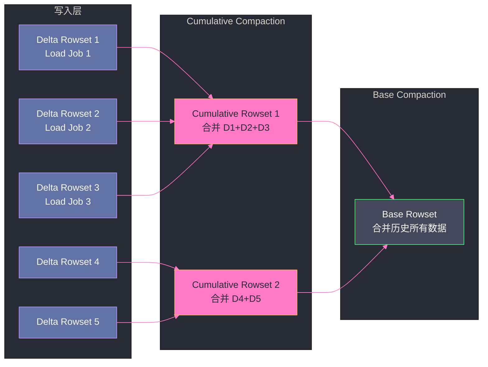

# 02 Doris 存储引擎——Tablet、Rowset 与 Compaction

## 摘要

Doris 的本地存储引擎以 **Tablet** 为核心数据单元，在每个 Tablet 内部实现了类 LSM-Tree 的分层存储结构——写入数据生成不可变的 **Rowset**（Segment 文件集合），后台 **Compaction** 将多个 Rowset 合并。本文深入剖析 Segment 的物理文件格式（列数据 + 索引层次）、ZoneMap/BloomFilter/ShortKey 三级索引的过滤原理、Cumulative Compaction 与 Base Compaction 的策略差异，以及 Doris 与 [[ClickHouse]] MergeTree 存储引擎的设计对比。

---

## 第 1 章 Tablet——Doris 的最小数据分片单元

### 1.1 从表到 Tablet 的映射关系

在 Doris 中，一张表的数据通过两层分片机制映射到具体的存储位置：

**第一层：分区（Partition）**——将表按时间或业务维度划分为多个分区，每个分区是一个独立的数据范围（类似 ClickHouse 的 Partition）。

**第二层：分桶（Bucket）**——每个分区内，按分桶键（Bucket Key）的哈希值将数据划分为 N 个桶（Bucket），每个桶对应一个 **Tablet**。

```
表（Table）
 └── 分区1（Partition: 2024-01）
 │    ├── Bucket 0 → Tablet 10001（3 副本）
 │    ├── Bucket 1 → Tablet 10002（3 副本）
 │    └── ...（共 N 个 Bucket）
 └── 分区2（Partition: 2024-02）
      ├── Bucket 0 → Tablet 20001
      └── ...
```

每个 Tablet 在 3 个 BE 节点上有 3 个副本（默认），FE 维护 Tablet → BE 副本位置的映射关系，并确保副本分布在不同 BE 节点（高可用保障）。

**Tablet 数量的重要性**：
- Tablet 数量 = 分区数 × 每分区 Bucket 数
- 每个 Tablet 是查询并行度的基本单元——同一个 Tablet 的数据只能由一个 BE 扫描（不能跨 BE 并行扫描同一 Tablet）
- Tablet 数量过少：并行度不足，CPU 资源浪费；Tablet 过多：元数据开销大，FE 内存压力高

生产建议：每个 Tablet 的数据量在 100MB-1GB 之间，查询时每个 BE 并行处理的 Tablet 数量在 10-20 个左右。

### 1.2 Tablet 的物理目录结构

每个 Tablet 对应 BE 磁盘上的一个目录：

```
/data/storage/shard_0/10001.hdr  ← Tablet 头文件（元数据：schema 版本、rowset 列表）
/data/storage/shard_0/10001/
├── rowset_0/                    ← 初始 Rowset（Base Rowset）
│   ├── 0.dat                    ← Segment 0 数据文件
│   ├── 0.idx                    ← Segment 0 索引文件
│   └── 1.dat, 1.idx, ...        ← 多个 Segment
├── rowset_1/                    ← 写入产生的 Delta Rowset
│   ├── 0.dat
│   └── 0.idx
└── rowset_2/
    └── ...
```

---

## 第 2 章 Rowset 与 Segment——写入的不可变单元

### 2.1 Rowset 的生命周期

每次数据写入（Load Job），Doris 在每个目标 Tablet 上创建一个新的 **Rowset**（由一个或多个 Segment 文件组成，每个 Segment 最大 256MB）。Rowset 一旦创建就**不可变**（immutable），与 ClickHouse 的 Part 和 LevelDB 的 SSTable 是同类概念。

**Rowset 类型**：
- **Base Rowset**：经过 Base Compaction 合并后的大 Rowset，代表 Tablet 的历史稳定数据
- **Delta Rowset**：每次 Load Job 写入产生的增量 Rowset，相对较小

查询时，Doris 需要同时读取 Base Rowset 和所有 Delta Rowset，在内存中合并（类似 LSM-Tree 的 Read Path）。Delta Rowset 过多会导致读取时合并开销增大，这是 Compaction 需要持续运行的原因。

### 2.2 Segment 的物理文件格式

一个 Segment 文件（`.dat`）的内部布局：

```
┌─────────────────────────────────────┐
│           Segment Header             │
│  (Schema 版本、行数、列定义)            │
├─────────────────────────────────────┤
│           Short Key Index            │
│  (每 1024 行一个稀疏索引条目)           │
│  格式：(short key prefix) → row offset│
├─────────────────────────────────────┤
│     Column Data（列式存储）            │
│  列1的数据块（压缩）: [val0, val1, ...] │
│  列2的数据块（压缩）: [val0, val1, ...] │
│  ...（每列独立存储）                   │
├─────────────────────────────────────┤
│     Column Index（列级索引）           │
│  ZoneMap Index: (min, max) per block │
│  BloomFilter Index: per column block │
│  Bitmap Index（可选，低基数列）         │
├─────────────────────────────────────┤
│           Segment Footer             │
│  (各部分的偏移量，用于快速定位)          │
└─────────────────────────────────────┘
```

**Short Key Index**（稀疏索引）：类似 ClickHouse 的稀疏主键索引，每 1024 行存储一个索引条目，内容是这行的主键前缀（`short key`，最多 36 字节）。查询时通过二分查找定位 Row Block 范围，然后在 Row Block 内精确过滤。

这种两级定位（Short Key Index → Row Block → 精确过滤）与 ClickHouse 的（稀疏索引 → Granule → 精确过滤）是同构的设计思路。

---

## 第 3 章 三级过滤索引

### 3.1 ZoneMap Index——列级 MinMax 过滤

**ZoneMap** 为每个 Row Block（1024 行）记录每列的最小值和最大值，查询时用于快速判断：**如果查询条件的范围与该 Row Block 的 [min, max] 区间没有交集，直接跳过该 Block**。

```sql
-- 查询：WHERE amount > 5000
-- ZoneMap 判断：
-- Block 1: amount 范围 [100, 800]   → max < 5000，跳过 ✓
-- Block 2: amount 范围 [300, 9000]  → 有交集，需要精确读取 ✗
-- Block 3: amount 范围 [1000, 3000] → max < 5000，跳过 ✓
```

ZoneMap 的效果依赖于数据的**局部有序性**——如果数据按 `amount` 排序存储，则相邻 Block 内的 `amount` 值接近，ZoneMap 剪枝效果极好。如果 `amount` 是随机分布的，ZoneMap 效果差（每个 Block 的范围都很宽，无法剪枝）。

这也是 Doris 建议将**高频过滤列放在排序键（Key）最左侧**的原因——排序键决定了数据物理存储顺序，排序键前缀列的 ZoneMap 剪枝效果最好。

### 3.2 BloomFilter Index——等值查询的精确过滤

**BloomFilter** 为指定列的每个 Row Block 构建 Bloom Filter，用于等值查询（`WHERE col = value`）的快速否定判断：

- 如果 Bloom Filter 判断某个值**不在**该 Block 中（确定不在），直接跳过该 Block（0 误判）
- 如果 Bloom Filter 判断某个值**可能在**该 Block 中（有误判率），读取 Block 精确确认

```sql
-- 查询：WHERE request_id = 'abc-12345'（高基数 UUID 类型列）
-- BloomFilter 以 1% 误判率判断：
-- Block 1: 不包含 'abc-12345' → 直接跳过 ✓
-- Block 47: 可能包含 → 读取 Block 精确过滤 ✗
-- Block 99: 不包含 → 直接跳过 ✓
```

BloomFilter 适合高基数列（如 UUID、用户 ID）的等值查询。对于低基数列（如性别、状态），Bitmap Index 更合适。

**开启 BloomFilter 的建议**：仅对明确有高频等值查询的高基数列开启，因为 BloomFilter 会占用额外存储空间（通常为原列大小的 1-5%）并增加写入时的计算开销。

### 3.3 Inverted Index（Doris 2.0+）——全文检索

Doris 2.0 引入了倒排索引（Inverted Index），支持全文检索（类似 [[Elasticsearch]] 的功能）：

```sql
-- 为 log_message 列创建倒排索引
CREATE INDEX idx_log ON table_name(log_message) USING INVERTED
PROPERTIES ("parser" = "english");

-- 全文检索查询
SELECT * FROM table_name WHERE log_message MATCH 'ERROR timeout';
```

这使 Doris 能够在 OLAP 分析的同时，提供基本的日志检索能力，减少对独立 Elasticsearch 集群的依赖。

---

## 第 4 章 Compaction——维持读取性能的持续清洁

### 4.1 为什么需要 Compaction

每次 Load Job 在每个 Tablet 上创建一个新的 Delta Rowset。如果写入频繁（如每分钟一次 Stream Load），一个 Tablet 可能积累数十到数百个 Delta Rowset。

查询时，Doris 的 Segment Compaction 读取路径需要合并 Base Rowset + 所有 Delta Rowset 的数据，Rowset 越多，读取时的合并开销越大（多路归并排序），查询延迟升高。

Compaction 通过后台持续合并 Rowset，将多个小 Rowset 合并成一个大 Rowset，减少读取时的合并工作量。

### 4.2 两种 Compaction 类型

**Cumulative Compaction（增量合并）**：将多个小 Delta Rowset 合并成一个稍大的 Cumulative Rowset。这是高频触发的"小清洁"，每隔几分钟就会触发，保持 Delta Rowset 数量在合理范围内（通常 10-20 个以内）。

触发条件：Tablet 上的 Delta Rowset 数量超过 `cumulative_compaction_num_singleton_deltas`（默认 5）。

**Base Compaction（全量合并）**：将 Base Rowset 与所有 Cumulative Rowset 合并，生成新的 Base Rowset，彻底清理历史增量数据。这是低频触发的"深度清洁"，代价高（需要读写 Tablet 的全量数据），通常在夜间或 Tablet 积累了大量 Cumulative Rowset 时触发。

触发条件：Cumulative Rowset 的总大小超过 Base Rowset 大小的一定比例（`base_compaction_num_cumulative_deltas`）。



### 4.3 Compaction 的 Score 机制

Doris 使用 **Compaction Score** 决定哪个 Tablet 优先被 Compaction：Score 越高，说明该 Tablet 的 Rowset 碎片化越严重，越需要合并。

可以通过以下 SQL 查看 Compaction 状态：

```sql
-- 查看 Tablet 的 Compaction 状态
SHOW TABLET {tablet_id};

-- 或通过 BE 的 HTTP 接口查看
curl "http://be_host:8040/api/compaction/show?tablet_id=xxx"
```

> [!warning] 生产避坑：写入频率过高导致 Compaction 积压
> 如果每分钟写入多次（如 Stream Load 调用间隔 < 1 分钟），每次写入在每个 Tablet 上产生一个 Delta Rowset，Compaction 可能跟不上写入速度，导致 Rowset 积累，查询延迟升高。
> 解决方案：
> 1. 增大 Stream Load 的批次间隔（建议 ≥ 1-2 分钟一次，每批次几十万到几百万行）
> 2. 增大 `cumulative_compaction_thread_num` 参数，提升 Compaction 并发
> 3. 使用 Routine Load（自动批量化，内部管理写入频率）

---

## 第 5 章 Doris vs ClickHouse 存储引擎对比

| 维度 | Doris Tablet+Rowset | ClickHouse MergeTree+Part |
| :--- | :--- | :--- |
| **稀疏索引** | Short Key Index（每 1024 行） | Primary Key Index（每 8192 行） |
| **列级过滤** | ZoneMap（minmax）+ BloomFilter | minmax Index + Bloom Filter（跳数索引） |
| **Compaction** | Cumulative + Base 两阶段 | 单一 Merge 流程（按 Part 大小选择） |
| **数据格式** | Segment（列式，各列独立文件） | Part（各列独立 .bin 文件） |
| **不可变单元** | Rowset | Part |
| **更新支持** | Unique Key 模型（Delete Bitmap） | ReplacingMergeTree（合并时去重） |
| **存储引擎可插拔** | 否（固定 Segment 格式） | 否（MergeTree 系列固定） |

---

## 第 6 章 小结

Doris 的存储引擎围绕 Tablet → Rowset → Segment 的三层结构设计，本质是 LSM-Tree 思想在列式存储中的具体实现。

三级过滤索引（Short Key Index → ZoneMap → BloomFilter）形成了"从粗到细"的过滤链：Short Key Index 定位行范围，ZoneMap 跳过不满足条件的 Row Block，BloomFilter 快速否定等值查询。这三级索引共同决定了 Doris 在不扫描全量数据的情况下高效定位目标行的能力。

Compaction 是保持读性能的关键后台工作——Cumulative Compaction 处理日常增量，Base Compaction 定期做深度整理，两者配合维持 Rowset 碎片化在合理水平。

---

**延伸阅读**：
- [[01 Doris 全局架构——FE BE 分离与 MPP 执行]]
- [[04 Doris 数据模型——Duplicate、Aggregate 与 Unique]]

---

> [!note] 思考题
> 1. Doris 的三种数据模型各有适用场景：Duplicate（保留所有原始数据）、Aggregate（预聚合，相同 Key 的数据自动合并）、Unique（主键去重，保留最新版本）。在用户行为日志场景中（需要保留每条记录但也需要聚合统计），应该选择 Duplicate 还是 Aggregate？如果选择 Duplicate，聚合计算的性能是否会受影响？
> 2. Unique Key 模型支持实时更新——INSERT 新数据时自动替换相同主键的旧数据。底层通过 Merge-on-Read 或 Merge-on-Write 实现。Merge-on-Read 写入快但查询时需要合并——在什么查询模式下 Merge-on-Read 的开销可以接受？Doris 2.0 的 Merge-on-Write 如何在写入时完成合并？
> 3. Aggregate 模型的预聚合在数据导入时自动执行——如 `SUM`、`MAX`、`MIN`、`REPLACE`。但预聚合只对定义的聚合函数生效——如果后续需要计算一个未预定义的聚合（如中位数），就无法利用预聚合数据。这种'提前绑定聚合逻辑'的局限性如何应对？物化视图是否能解决？
