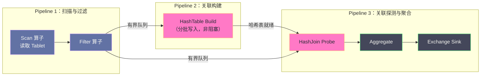
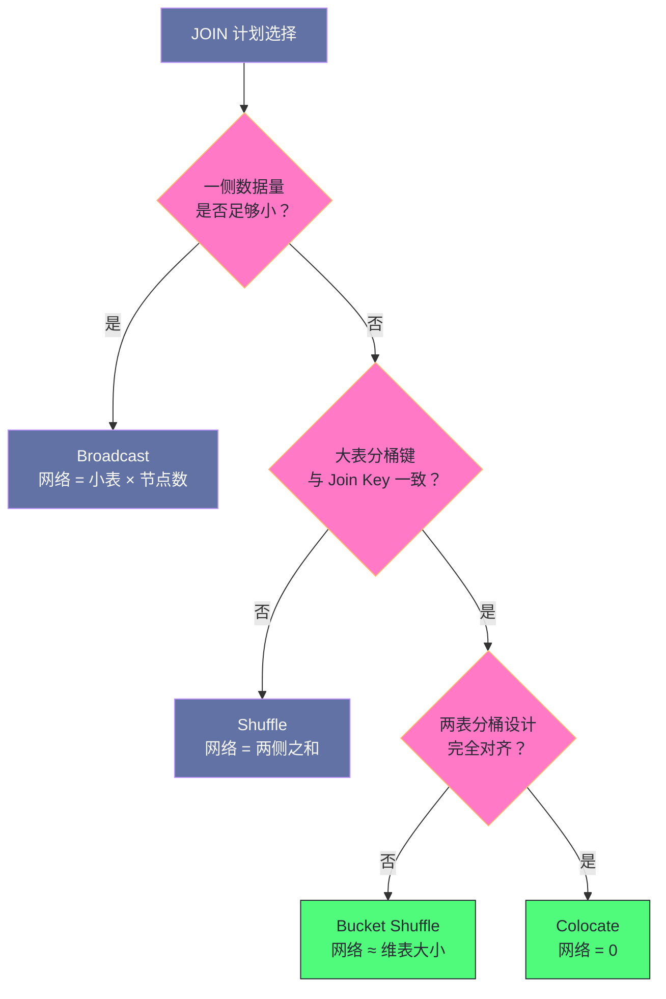

# 03 Doris 查询引擎——向量化执行与 Pipeline

**摘要：**

查询引擎要回答三个层次的问题：**执行计划选得对不对**（优化器）、**算子之间怎么衔接**（执行框架）、**每个算子内部算得快不快**（计算实现）。本文按这三层展开。第一层讲从规则优化器到基于代价优化器的转变——规则优化器只能按预定义模式变换计划，无法回答"三张表该按什么顺序关联"这类问题，而基于代价的优化器用统计信息枚举等价计划并选择代价最低者，代价是它引入了"统计信息质量"这个新的失败来源。第二层讲 Pipeline 执行框架如何把阻塞算子拆成可异步推进的阶段，用有界队列与背压让线程不再因等待而闲置，以及三层并行度（算子内、Fragment 间、查询间）的区分与调优方向。第三层讲向量化执行如何把"每次一行"改为"每次一批"，以及它与索引裁剪的粒度配合问题。之后是 Runtime Filter 的生效条件与代价、四种分布式 JOIN 策略的选择依据，以及一条从 Profile 出发的调优路径。最后给出这套引擎的边界与常见误判。

---

## 第 1 章 从规则优化器到代价优化器

### 1.1 规则优化器的能力边界

早期的查询优化器是**基于规则的（RBO，Rule-Based Optimizer）**：它按一组预定义的变换规则改写查询计划，例如谓词下推（把过滤条件尽可能推到扫描端）、常量折叠（把能在编译期算出的表达式先算掉）、以及投影裁剪（只读需要的列）。

这些规则的价值是确定的、无争议的——无论数据分布如何，"先过滤再关联"总不劣于"先关联再过滤"。但规则优化器有一个根本的能力边界：**它无法回答"哪种方案更好"这类需要量化比较的问题。**

最典型的例子是**多表关联的顺序**。对于 `A JOIN B JOIN C`，规则优化器通常按 SQL 中书写的顺序执行，或者按固定的启发式（如"小表在前"）。但真实的最优顺序取决于三张表的实际大小、关联条件的选择性、以及中间结果的大小。**同一个 SQL，在数据分布不同的两个环境里，最优的关联顺序可能完全不同**——规则优化器对此无能为力。

### 1.2 反事实：JOIN 顺序选错会怎样

用一组假想的量级来说明这个问题。假设有三张表：

```text
orders   （事实表）  10 亿行
users    （用户表）  1 亿行
regions  （地区表）  100 行
```

查询是"统计各地区 VIP 用户的订单总额"。三种关联顺序的中间结果规模差异巨大：

| 关联顺序 | 中间结果规模 | 说明 |
|---|---|---|
| regions → users → orders | 先过滤出 VIP 用户（假设 100 万），再关联 orders | 中间结果最小 |
| orders → users → regions | 先把 10 亿订单与 1 亿用户关联 | 中间结果最大，可能到十亿级 |
| users → orders → regions | 先关联用户与订单 | 中间结果大，且过滤时机偏晚 |

第一种顺序的关键在于**先用小表把大表过滤掉**：把 `regions` 与 `users` 关联得到 VIP 用户集合（100 万行），再用它去过滤 `orders`。这样 10 亿行的扫描可以在扫描阶段就被裁剪掉绝大多数。而第二种顺序会把两张十亿级/亿级的表先做关联，产生巨大的中间结果，网络传输与内存压力都会失控。

**同一个查询，因为关联顺序不同，耗时的差异可能是两个数量级。** 这正是基于代价优化器要解决的问题——它不是"更聪明的规则"，而是"用数据统计来量化比较不同方案"。

### 1.3 Cascades 框架与 Nereids

Doris 2.0 引入了新的基于代价优化器（Nereids），它的核心是 **Cascades 框架**——一种"自顶向下的计划搜索"方法。

Cascades 的基本思路是：把查询表示为一棵逻辑算子树，每个节点代表一种"操作意图"（关联、聚合、排序等）；对每个节点枚举它的**等价实现**（例如关联可以实现为 Hash Join、Merge Join、Nested Loop Join，也可以改变左右顺序），并把这些等价实现组织成"组"；然后用代价模型评估各组合的代价，逐层向上传递最优代价；最后自顶向下按"每层选最优子方案"的方式组装出完整计划。

这个框架的关键性质是**它把"搜索空间"显式化**：关联顺序、关联算法、数据分发方式、聚合实现方式都被纳入同一个搜索空间，由代价模型统一评估。它的代价也很明确——搜索空间随表数量增长很快，因此实现上需要各种剪枝策略（如只保留代价较优的前若干个候选）。

对使用者而言，理解 Cascades 的价值在于理解"**为什么优化器会做出看起来奇怪的选择**"：它的判断依据是统计信息与代价模型，而不是"人的直觉"。当计划明显不合理时，第一反应应当是"统计信息是不是错了"，而不是"优化器有 bug"。

### 1.4 优化器能力的边界

需要说清楚的是，基于代价的优化器不是万能的，它的能力受三处限制。

**限制一：统计信息的准确性。** 代价模型的输入是统计信息，如果统计信息过期或不准确，代价估算就会偏离实际，最优计划也就选不出来。这是实践中最主要的失败来源。

**限制二：代价模型的保真度。** 代价模型是对真实执行代价的近似（用行数、选择率、IO 次数等抽象量估算），它无法完全刻画缓存命中、磁盘排队、网络抖动这些运行时因素。因此"代价最低"不等于"实际最快"。

**限制三：搜索空间的剪枝。** 为了在有限时间内给出计划，优化器会剪枝掉一部分候选。因此它给出的是"在搜索到的候选中最优"，而不是"全局最优"。

理解这三处限制，就能理解为什么"人工写 Hint 强制某个计划"在某些场景下仍然有效——**当优化器因统计信息失真而选错时，人工干预是必要的兜底手段**，而不是"不信任优化器"。

> [!info] 核心概念
> 优化器的演进可以概括为"**从确定性规则到量化权衡**"。规则优化器回答的是"这个变换是否总是安全的"，基于代价的优化器回答的是"在若干安全方案里哪个更便宜"。前者的正确性可以证明，后者的正确性依赖于输入数据的质量。因此引入 CBO 的同时，也引入了"统计信息治理"这项新的运维工作——**能力提升总是伴随着新的依赖。**

---

## 第 2 章 统计信息：代价优化的燃料

### 2.1 需要哪些统计信息

代价模型依赖几类基本统计量。

| 统计量 | 含义 | 主要用途 |
|---|---|---|
| 行数 | 表的行数或分区的行数 | 估算扫描代价与关联中间结果规模 |
| NDV（不同值数量） | 列上不同取值的个数 | 估算分组输出行数与关联的选择率 |
| 直方图 | 列的取值分布 | 估算范围条件的选择率 |
| 空值比例 | 列中空值的占比 | 修正选择率估算 |

这几项里，**NDV 与直方图对计划质量的影响最大**。原因在于：行数只决定"扫描多少"，而 NDV 与直方图决定"过滤之后剩下多少"——后者直接影响关联顺序与关联算法的选择。

一个具体的例子：如果优化器不知道 `segment = 'VIP'` 只占用户的百分之一，它就会认为关联 `users` 与 `orders` 会产生接近全量的结果，从而放弃"先过滤再关联"的方案。**统计信息缺失带来的不是"慢一点"，而是"选了完全不同的计划"。**

### 2.2 收集方式与开销

统计信息的收集有两种途径。

**全量收集**扫描整表计算精确统计，准确性最高，但开销大（对十亿行表可能耗时数分钟并占用大量 IO）。

**抽样收集**只扫描一部分数据（如按比例抽样），开销小得多，准确性略低。实践中的默认策略通常是抽样收集，并允许对关键列做更精细的收集。

这里有一个容易被忽略的权衡：**统计信息本身也有"新鲜度"问题**。全量收集虽然准，但如果数据每天变化，它很快就过期；抽样收集虽然略粗，但可以更频繁地跑。因此选择收集方式时，要同时考虑"准确性"与"可重复的频率"。

### 2.3 统计信息过期：最常见的性能回归原因

在实践中最常见的"查询突然变慢"的原因，就是**统计信息过期**。

典型的触发场景是"大批量数据导入"：如果某次导入了大量新数据但没有更新统计信息，优化器仍按旧的行数估算代价。后果可能是灾难性的——例如把一张实际十亿行的表当作一亿行，于是选择 Broadcast JOIN 把"小表"广播到所有节点，造成网络风暴与内存溢出。

识别这类问题的方法有两条。**其一，观察"计划是否与数据规模明显不匹配"**：如果计划里的广播量或中间结果估算值与实际数据量差一个数量级，基本可以确认是统计信息问题。**其二，对比"同一条查询在统计信息更新前后"的执行计划**：如果计划发生了显著变化且耗时改善明显，说明之前的计划是被过期统计误导的。

### 2.4 收集策略：何时自动、何时手动

统计信息的收集策略需要按数据变化的节奏来设计。

**自动收集**适合"数据持续小幅变化"的场景——它按周期在后台增量更新统计信息，不需要人工干预。它的局限是周期固定，无法响应"某次大批量导入"这类突发事件。

**手动收集**适合"数据发生大批量变化之后"——例如每日全量覆盖导入、或一次历史数据回填之后，应当显式触发一次收集。它的成本是需要在流程里增加一个步骤，收益是避免统计信息长期失真。

**实践中的组合策略是"自动收集打底 + 关键变更后手动触发"**：把自动收集作为常态保障，把手动收集挂在"大批量数据变更"之后。这样既不需要人工频繁干预，又能在关键节点保证统计信息的准确性。

需要提醒的是：**统计信息的收集本身也是一次负载**（要扫描数据）。因此在大批量导入之后立即收集统计信息，可能与导入的 Compaction 叠加，进一步加重系统负担。合理的做法是错开这两个动作，而不是让它们同时发生。

---

### 2.5 统计信息的粒度

统计信息不是只有"表级"一种粒度，它的层次选择直接影响优化器能做多精细的判断。

**表级统计**给出整表的行数与各列的整体分布。它的成本最低，但粒度最粗——如果一张表按时间分区且各分区的数据特征差异很大（例如近期分区活跃用户多、历史分区沉默用户多），表级统计会把它们平均掉，导致针对单个分区的查询得到错误的估算。

**分区级统计**为每个分区单独记录行数与列分布。它让"只查最近一个分区"这类查询得到准确估算，代价是统计信息的体量与维护开销随分区数增长。

**列级直方图**为关键列记录取值分布，用于更精确地估算范围条件的选择率。它的开销最大（要为每一列维护桶结构），因此实践中只对"高频出现在过滤条件中"的列开启。

三者的组合策略通常是"**表级与分区级默认开启，列级直方图按需开启**"。判断"哪些列需要直方图"的依据与索引设计一致——看慢查询日志里哪些列频繁出现在范围条件中。**统计信息与索引服务于同一个目标（让优化器判断更准），因此它们的取舍逻辑是相通的：都不该"全量铺开"，而该"按查询模式定向投入"。**

---

## 第 3 章 执行计划的形态

### 3.1 从逻辑计划到物理计划

一次查询的编译过程大致分三段：**解析**（SQL 文本到语法树）、**逻辑优化**（生成逻辑算子树并按规则改写）、**物理优化**（为每个逻辑算子选择具体实现，并确定数据分发方式）。

第三段是代价优化真正发挥作用的地方。它为逻辑计划中的每个节点选择"物理实现"：关联用 Hash Join 还是 Nested Loop、聚合用排序聚合还是哈希聚合、数据怎么分发、并行度多少。**同一个逻辑计划可能有成百上千种物理实现，代价优化的任务就是从中挑一个。**

### 3.2 Fragment 与算子树的对应

物理计划最终被切成若干 Fragment，每个 Fragment 是一棵算子树（扫描、过滤、关联、聚合、交换等），在一个 BE 上执行。Fragment 之间的边界就是 **Exchange** 节点——它是"数据需要跨节点重分布"的标记。

因此读执行计划时有一个实用的判读方法：**数 Exchange 节点的数量与位置**。Exchange 越多，说明跨节点的数据搬运越多；Exchange 出现在计划树的越上层，说明搬运的数据量越大（因为上层的数据已经过过滤与聚合，通常更小）。**一条"看起来合理但很慢"的计划，问题往往就出在 Exchange 的位置与数量上。**

### 3.3 查看计划与 Profile

Doris 提供了两个层次的观测手段，它们的用途不同。

**执行计划**（通过 `EXPLAIN` 系列语句查看）给出的是"**将要怎么做**"——算子树、关联顺序、关联算法、数据分发方式、是否插入了 Runtime Filter。它用于"事前判断计划是否合理"。

**查询 Profile**（查询执行后生成）给出的是"**实际怎么做的**"——每个算子的实际耗时、实际读取行数、实际内存占用、以及实际的数据量。它用于"事后定位瓶颈在哪一环"。

两者的关系是**预期与实际的对照**：如果计划显示"预计读取一百万行"，而 Profile 显示"实际读取十亿行"，那么问题就在统计信息或过滤条件下推上；如果计划与 Profile 的估算一致但耗时仍然很长，那么问题在算子实现或资源竞争上。**只看其中一个，都无法得出可靠结论。**

---

### 3.4 计划的稳定性与复用

一条 SQL 的执行计划不是每次都从头生成的——Doris 会对"结构相同"的查询复用计划（计划缓存），以减少编译开销。这个机制对分析型负载很重要，因为**编译时间在短查询上可能占比很高**。

但计划复用带来一个需要留意的副作用：**当统计信息更新后，缓存的计划不会立即失效**。也就是说，你可能已经更新了统计信息，但某些查询仍在用旧计划执行，直到缓存过期或被清理。这在排查"为什么更新统计信息后这条查询还是慢"时是一个常见的陷阱。

由此得到一条实用建议：**更新统计信息之后，如果需要立即验证效果，应当确认计划是否被重新生成**（可以通过对比更新前后的执行计划来判断），而不是直接观察耗时。**"改了配置但没生效"这类困惑，多数源于中间的缓存层没有被考虑进去。**

---

## 第 4 章 Pipeline 执行框架

### 4.1 阻塞算子的问题

在执行引擎里，有一类算子天生是**阻塞的**：它必须等到上游数据全部就绪才能开始产出结果。典型的阻塞算子包括哈希关联的构建阶段（必须先把一侧数据全部装入哈希表才能开始探测）、排序聚合（必须等全部数据到齐才能排序）、以及全局排序。

阻塞带来的问题是**等待**：在"一个线程负责一个算子"的模型下，当某个算子处于等待状态时，它对应的线程就是空闲的，CPU 核心被浪费。对于一条包含多个阻塞算子的查询，大量时间消耗在"等待上游完成"上，而不是"实际计算"上。

### 4.2 Pipeline 化：把等待变成推进

Pipeline 执行框架的核心思路是：**把阻塞算子拆成可异步推进的多个阶段，让线程在等待时切换到其他可推进的工作上。**

以哈希关联为例，传统模型是"构建完再探测"；Pipeline 化之后，构建阶段变成"分批读入并写入哈希表"的持续过程，一旦哈希表就绪就立刻启动探测阶段；构建与探测之间通过**有界缓冲队列**传递数据批次。

这里的关键设计是"**有界**"：队列容量有限，因此生产者在队列满时会暂停，消费者取走数据后生产者才继续。这个机制形成了天然的**背压**——快的一方不会无限堆积数据把内存撑爆，慢的一方也不会被淹没。**背压让整条流水线自动收敛到最慢环节的速率。**



### 4.3 三层并行度

Pipeline 之上还有并行度的问题。Doris 的并行度分三层，它们的调优方向完全不同。

**第一层：算子内的并行度。** 一个 Fragment 内可以跑多个 Pipeline 实例，每个实例处理一部分数据，通常对应 CPU 核心数。它决定单节点内的 CPU 利用。

**第二层：Fragment 间的并行度。** 扫描 Fragment 会在所有持有相关 Tablet 的 BE 上并行执行，因此扫描并行度受 Tablet 数与 BE 数共同约束。它决定集群范围的资源利用。

**第三层：查询间的并发。** 多个查询同时执行时争抢同一批 BE 的 CPU 与内存。Doris 通过查询队列与内存上限控制这一层——当并发查询的内存需求超过 BE 上限时，部分查询排队或失败。

**把"查询慢"一律归因到"并行度不够"是常见误判。** 如果是第三层（并发争抢）导致的慢，提高并行度只会让争抢更激烈；如果是第二层（Tablet 太少），加 CPU 也没用。正确的顺序是先判断瓶颈在哪一层，再决定动作。

### 4.4 资源与调度

Pipeline 框架还引入了资源管理的两个机制，值得了解。

**其一是内存管理。** 查询执行过程中，哈希表、排序缓冲、Exchange 缓冲都要占用内存。Doris 对查询设置内存上限，超过时采取的策略可能是"溢写到磁盘"（对部分算子）或"终止查询"。因此**内存不足的表现可能是"查询失败"而不是"查询变慢"**，这一点在排查时需要注意区分。

**其二是查询排队。** 当并发查询数超过 BE 的处理能力时，新查询进入队列等待。这意味着"查询耗时"包含了排队时间——**在监控上看到"查询延迟上升"时，要先区分是"执行变慢"还是"排队变长"**，因为两者的处置完全不同（前者查执行瓶颈，后者查并发控制配置与集群容量）。

---

### 4.5 内存管理与溢写

Pipeline 框架解决了"线程等待"的问题，但没有解决"内存不够"的问题——事实上，让更多任务并行推进反而可能加快内存消耗。因此内存管理是执行框架的另一半。

查询执行中的内存消耗主要来自三处：**哈希表**（关联与聚合的构建侧）、**排序缓冲**（排序与窗口函数）、以及**交换缓冲**（Exchange 的收发队列）。其中哈希表通常是最大的一块，且它的规模与数据倾斜强相关——如果某个 Key 的数据量异常大，对应的哈希表分片就会膨胀。

内存不足时的处理策略有几种，它们的体验差异很大。

**策略一：溢写到磁盘。** 把部分数据写到临时文件，后续再读回处理。它的好处是查询能完成，代价是额外的磁盘 IO 与更长的耗时。**这条路径要求磁盘有足够空间与 IO 余量**，否则会从"内存不足"变成"磁盘也跟不上"。

**策略二：终止查询。** 直接报错返回。它的好处是保护集群不被单条查询拖垮，代价是业务侧需要处理失败重试。

**策略三：降低并行度。** 减少同时推进的任务数，从而降低峰值内存。这条策略不常见，因为它与 Pipeline 的初衷冲突。

**从运维角度看，最需要注意的是"内存不足的表现形式"**：它可能表现为"查询失败"（报错），也可能表现为"查询变慢"（溢写导致），还可能表现为"集群整体变慢"（大量查询同时溢写把磁盘打满）。**因此内存相关的告警不能只看"内存使用率"，还要看溢写次数与临时文件占用。** 这三者共同刻画了内存压力，缺一项就会出现盲区。

---

## 第 5 章 向量化执行

### 5.1 从行式到列式：为什么快

传统执行引擎是**行式**的：一次处理一行数据，逐行调用算子接口。它的开销来自三处：函数调用次数多（每行一次）、CPU 分支预测失败多（每行的处理路径可能不同）、缓存利用率低（一行的多列数据分散在不同内存位置）。

**向量化执行**把"每次一行"改为"每次一批"（Doris 中通常数千行一批）：批内的数据按列连续存放，算子接口一次处理一整批。它带来的收益来自三处：**函数调用次数降低到千分之一量级**、**批内处理路径一致从而分支预测友好**、以及**列数据连续存放从而提高缓存命中率**。

在此之上，编译器还可以对批内的循环做**自动向量化**（生成 SIMD 指令，一条指令处理多个数据），进一步提升计算吞吐。这也是为什么"向量化"这个名字同时指"批处理"与"SIMD"两个层面。

### 5.2 Selection Vector：过滤的表示方式

向量化执行中有一个关键的数据结构：**Selection Vector（选择向量）**。

它的作用是表示"批内哪些行满足条件"——通常是一个位图或一个下标数组。后续算子通过它跳过不满足条件的行，而**不需要物理地删除或移动数据**。

这个设计的好处是"过滤"变得极其廉价：过滤一个批只需要生成一个选择向量，而不是重排数据。它的代价是"选择向量会被逐层传递"——每一层算子都要处理它，因此一条过滤条件很多、批内命中率很低的查询，会有相当一部分开销花在维护选择向量上。**这也是"过滤条件写得越精确越好"的原因之一：它减少了需要维护选择向量的行数。**

### 5.3 表达式与函数的向量化

除了算子，表达式计算（如 `a + b * c`、字符串函数、条件表达式）也需要向量化实现。这里的优化手段包括**函数内联**（把简单函数的逻辑直接嵌入调用处，消除调用开销）与**特化**（为常见的数据类型组合生成专门的实现）。

这一层是"查询引擎性能差异"的重要来源：两个引擎的算子框架可能相似，但表达式求值的实现质量差异会直接体现在计算密集型查询上。**这也是为什么"同一条 SQL 在不同引擎上的耗时差异"很难通过架构分析预测——它取决于大量实现细节。**

### 5.4 向量化的边界

向量化不是万能的，它有三处边界。

**边界一：对短查询收益有限。** 如果一次查询只扫描几百行（如点查），批处理的启动开销可能超过收益。这也是分析引擎不适合点查的原因之一。

**边界二：对复杂控制流的算子收益有限。** 有些算子的逻辑天然难以批处理（如需要递归或复杂状态机的处理），它们的实现可能仍是逐行或半向量化。

**边界三：对"低命中率过滤"收益被削弱。** 如果过滤条件把大部分行都滤掉了，那么后续算子的批内有效行数很少，向量化的效率被摊薄。**此时真正的瓶颈是"读得多"而不是"算得慢"**，优化方向应当转向索引裁剪而不是计算加速。

---

### 5.5 编码与压缩：向量化的前置条件

向量化执行的前提是"批内数据在内存中连续存放"，而这个前提的达成依赖于存储层的**编码与压缩**。

列式存储通常不会原样保存数据，而是先做编码（如字典编码、游程编码、增量编码）与压缩。这样做有两个收益：**减少 IO 量**（读的字节更少）与**提升计算效率**（某些编码可以直接在编码态做运算，例如字典编码的等值比较可以退化为整数比较，无需解码成字符串）。

代价是**解码开销**：读取时需要把编码后的数据还原成可计算的形式。因此编码策略的选择是在"IO 节省"与"解码 CPU"之间权衡——这与 JuiceFS 那类系统里压缩的取舍是同一个逻辑。

对调优的启示是：**当"扫描慢"时，除了看索引裁剪，还要看"读取的字节量"与"解码耗时"**。如果读取的字节量已经很小（裁剪生效、压缩率高）但耗时仍长，瓶颈可能在解码或后续计算；如果读取字节量很大，瓶颈在 IO 与压缩率。**这两条路径的优化手段完全不同：前者调计算，后者调存储格式与索引。**

---

## 第 6 章 Runtime Filter：运行时下推的过滤器

### 6.1 机制：把"小表过滤结果"提前推给大表

Runtime Filter 解决的问题是"**大表关联小表时，大表扫了太多注定匹配不上的数据**"。

考虑一条典型查询：`orders`（十亿行）关联 `users`（一亿行），条件只取 VIP 用户（约占百分之一，即一百万行）。如果没有 Runtime Filter，执行流程是"扫十亿行 orders，逐行去哈希表里探测"，其中绝大多数行的 `user_id` 根本不在 VIP 集合里，探测必然失败——但这些行的读取与探测开销已经付出了。

Runtime Filter 的做法是：**在构建侧（小表）哈希表的同时，提取出一个过滤条件（如 `user_id` 的布隆过滤器或取值范围），把它下推到探测侧（大表）的扫描端**。这样大表在扫描阶段就能跳过不可能命中的行块，把"读取加探测"的开销削减到与命中规模匹配。

它的效果可以用选择性估算：如果 VIP 用户占百分之一，那么理想情况下大表的有效扫描量也降到百分之一——**收益与 JOIN 的选择性成正比**。

### 6.2 三种类型的取舍

Runtime Filter 有几种实现形式，各自的适用条件不同。

| 类型 | 机制 | 适用条件 | 特点 |
|---|---|---|---|
| BloomFilter | 用小表 Join Key 构建布隆过滤器 | 高基数列 | 有误判率，大小与配置相关 |
| MinMax | 传递小表 Join Key 的最小值与最大值 | 列上有序或近似有序 | 空间极小，但只对范围有效 |
| IN 列表 | 直接传递精确取值集合 | 小基数集合 | 无误差，但集合大时内存开销高 |

三者的选择由优化器自动完成，依据是小表的取值分布特征。**从使用者的角度看，需要关心的不是"选了哪一种"，而是"有没有生效"**——这一点可以通过执行计划观察（计划中会出现 Runtime Filter 相关的节点标记）。

### 6.3 生效条件与失效场景

Runtime Filter 的生效有几个前提，任何一条不满足都会让它失效或收益不足。

**前提一：构建侧必须先于探测侧完成。** 如果执行计划里探测侧先启动（例如因为并行度安排导致扫描先跑），那么过滤条件还没准备好，下推就无从谈起。这也是为什么"Runtime Filter 有时生效、有时不生效"会表现为不确定性——它依赖执行时序。

**前提二：Join Key 的类型与列类型匹配。** 如果 Join Key 需要隐式类型转换（例如一边是字符串一边是数值），过滤器可能无法直接应用到列上。

**前提三：选择性足够高。** 如果关联结果几乎包含大表的全部行（低选择性），那么过滤器无法排除任何行块，它的构建与传输成本就成了纯开销。

### 6.4 代价与观测

Runtime Filter 不是免费的：**构建过滤器要读小表的 Join Key 列、传输过滤器要占用网络、应用过滤器要消耗扫描端的 CPU。**

因此它在两种情况下是负收益：**其一，选择性低**（过滤器排不掉行）；**其二，小表的 Join Key 基数极高且数据量不小**（过滤器本身很大，传输与构建成本高）。

观测方法很直接：**在执行计划中确认 Runtime Filter 是否被插入；在 Profile 中对比"扫描端实际读取的行数"与"没有过滤器时预计的行数"。** 如果两者接近，说明过滤器没有起到裁剪作用，应当考虑关闭它（通过会话变量）以避免无谓开销。**"多一个优化不一定更好"在 Runtime Filter 上体现得最明显。**

这里有一个更普遍的教训：**自适应优化（在运行时根据实际数据调整执行方式）的收益是有条件的。** 它依赖"运行时观察到的信息确实能改进决策"，而在观察成本高于收益的场景下，它反而成为负担。因此评估任何自适应机制时，都应当同时问两个问题：**它在什么条件下有收益，以及在其余条件下它的成本是多少。** 只回答前一个问题的机制，会在边缘场景里持续产生隐性损耗。

---

## 第 7 章 分布式 JOIN 策略

### 7.1 Broadcast JOIN：广播小表

把一侧（通常是小表）的全量数据广播到所有参与另一侧扫描的节点上，让每个节点在本地完成关联。

**适用条件**：一侧明显很小（小到广播到所有节点的总网络量与内存开销可接受）。

**代价**：广播量等于"小表大小乘以节点数"。因此节点数越多，广播的绝对开销越大——**这条性质解释了为什么"集群扩容后某条查询反而变慢"**：原本广播开销可接受的查询，在节点数增加后广播成本线性上升。

### 7.2 Shuffle JOIN：按 Key 重分布

把两侧数据都按 Join Key 的哈希值重新分发，使相同 Key 的数据落到同一个节点上，然后本地关联。

**适用条件**：两侧都较大，无法广播。

**代价**：两侧数据都要走网络。因此它的成本与"两侧数据量之和"成正比，是四种策略里网络开销最高的一种。**它的优点是通用性——无论数据多大、分桶设计如何，它都能工作。**

### 7.3 Bucket Shuffle JOIN：利用分桶减少广播

如果大表按某个键分桶，而 Join Key 恰好是这个分桶键，那么"相同 Key 的数据已经在同一个节点上"这个前提就部分成立了。此时只需要把另一侧（维表）的**对应分桶**广播过去，而不是广播全表。

**适用条件**：大表的分桶键与 Join Key 一致。

**代价**：网络量为"维表大小"（而非维表大小乘以节点数），因此它介于 Broadcast 与 Shuffle 之间。**它的关键约束是"建表时的分桶设计"**——如果 Join Key 与分桶键不一致，这个优化就用不上。

### 7.4 Colocate JOIN：零网络传输

如果两张表按相同的分桶键、相同的分桶数分布，并且被声明为同一个 colocate 分组，那么相同 Key 的数据必然在同一节点上，关联时**完全不需要网络传输**。

**适用条件**：建表时就规划好两表的分桶设计完全对齐。

**代价**：它把代价从运行时转移到了**建表设计阶段**——需要提前知道"哪些表会被频繁关联"，并据此统一分桶键与分桶数。**这也带来一个运维约束：一旦某张表的分桶设计需要变更，与之 colocate 的表都要跟着重建。**

### 7.5 选择依据与代价排序

把四种策略按网络代价排序，同时把它们的"前置要求"也列出来，就能看出一个清晰的规律。



规律很清楚：**网络代价越低的策略，对"建表设计"的前置要求越高。** 这不是巧合——运行时可自由选择的策略必然要处理"数据可能不在正确位置"的情况，因此必须付出搬运代价；而零搬运的策略必须靠设计提前保证"数据已经在正确位置"。

由此得到一条实用的设计建议：**在数据建模阶段就识别出"会被频繁关联的表对"，并为它们规划对齐的分桶设计。** 这个动作的收益是长期的（每次关联都省一次网络搬运），成本是一次性的（建表时多花一点心思），但它的前提是"关联模式可预测"——如果关联是临时探索性的，这个优化就用不上。

还有一处与 JOIN 策略相关的细节：**JOIN 的代价不只取决于策略选择，还取决于"关联条件的写法"**。例如在关联条件上做函数变换（如 `ON a.id = CAST(b.id AS BIGINT)`）会让两侧的键无法直接比较，可能迫使执行引擎放弃哈希关联而退化为低效的关联方式。**与索引一样，JOIN 也要求"条件以最朴素的形式书写"**——任何包裹在列上的函数都可能让优化失效。

---

## 第 8 章 查询调优的实践路径

### 8.1 第一步：从 Profile 找最耗时的算子

调优的起点永远是"哪一环最慢"，而 Profile 正是回答这个问题的工具。它按算子树展示每个节点的实际耗时、读取行数、输出行数、内存占用。**第一步动作是找到耗时占比最高的那个算子**，而不是先看 SQL 长什么样。

这一步的价值在于**把"查询慢"这个笼统现象定位到一个具体环节**。常见的定位结果有三类：扫描算子耗时长（问题在读取与裁剪）、关联算子耗时长（问题在关联策略或数据倾斜）、交换算子耗时长（问题在数据分发）。

### 8.2 三类瓶颈的对策

针对上述三类定位结果，对策完全不同。

**扫描慢的对策**：先看"读取行数是否远超预期"——如果是，问题在裁剪（分区剪枝、索引、条件下推）；如果读取行数正常但耗时长，问题在 IO（磁盘吞吐、压缩率、缓存命中）。

**关联慢的对策**：先看"构建侧与探测侧的行数是否符合预期"——如果构建侧远大于预期，说明优化器选错了侧（可用 Hint 干预）；如果两侧都正常但耗时长，检查是否存在数据倾斜（某个 Key 的数据量异常大）。

**交换慢的对策**：看 Exchange 的数据量与实际数据量是否匹配——如果交换量远大于必要，说明 JOIN 策略选择不当（该用 Bucket Shuffle 却用了 Hash Shuffle）；如果交换量正常但耗时长，检查网络带宽是否成为瓶颈。

### 8.3 调优的优先级

把动作按"收益/成本比"排序，得到一条实用的调优顺序。

1. **修正 SQL 写法**（消除函数包裹分区列、消除隐式类型转换、减少 `SELECT *`）。收益大、成本极低，应当最先做。
2. **更新统计信息**（在大批量数据变更后）。收益大、成本低，但容易被忽略。
3. **检查裁剪是否生效**（分区、索引、Runtime Filter）。收益大，成本低。
4. **检查 JOIN 策略**（是否需要 Bucket Shuffle 或 Colocate，是否需要 Hint 干预）。收益中等，成本中等（可能需要改分桶设计）。
5. **调整并行度与资源参数**。收益中等，成本低，但容易被误用。
6. **考虑数据建模层面的重构**（预聚合、物化视图、调整分桶）。收益可能很大，但成本高、周期长。

**这个顺序的核心原则是"先改能改的、再改要设计的"。** 实践中大量"查询慢"的问题，前两步就能解决，但团队往往直接从第五步开始（调参数），因为那看起来最"技术"。

### 8.4 一个常见的调优陷阱

有一类调优动作需要特别警惕：**为了单条查询的最优而损害整体吞吐。**

典型例子是"提高单条查询的并行度上限"——它能让某条大查询更快完成，但代价是它占用了更多并发槽位，其他查询的排队时间变长。在并发负载下，这种"局部最优"往往是全局次优。

判断方法是**同时观察"单条查询耗时"与"整体吞吐"两个指标**。如果单条变快了但整体吞吐下降了，说明资源被过度分配给少数查询。**分析系统的调优目标通常不是"让某条查询最快"，而是"在给定并发下让整体完成时间最短"**——这个目标函数与单查询优化不同，需要显式地意识到。

---

### 8.5 并发场景下的调优

前面的调优路径都围绕"单条查询"展开，而生产环境里更常见的问题是"并发下的整体表现"。这两者的调优目标不同，需要分开对待。

**单查询调优的目标是"这条查询最快完成"**，可用的手段包括提高并行度、调整 JOIN 策略、增加内存配额。

**并发调优的目标是"在给定并发下整体完成时间最短"**，它关注的是资源分配是否公平、队列是否过长、以及是否存在"少数查询吃掉大部分资源"的情况。

后者的关键指标有三个：**队列长度**（有多少查询在等待）、**队列等待时间**（等待占了总耗时的多少）、以及**资源占用的分布**（是否有少数查询占用远超平均的资源）。如果队列等待时间占比很高，说明瓶颈是并发容量而不是单查询效率，此时**提高单查询并行度只会让队列更长**。

一条实用原则是：**先解决"排队"，再解决"执行"。** 当大量查询在排队时，优化执行效率的收益会被排队掩盖；只有把并发容量与队列控制调整到合理范围之后，单查询优化才有意义。这与运维里"先降噪再定位"的思路一致——**在资源严重争抢的状态下做性能分析，得到的结论往往不可靠。**

---

## 第 9 章 边界与反例

### 9.1 反例一：把 Hint 当作首选手段

Hint 强制计划在"统计信息失真"时是有效的兜底，但如果把它当作常规手段，会导致两个后果：**计划僵化**（数据分布变化后 Hint 反而成为负担），以及**掩盖根因**（真正的问题是统计信息没更新）。**Hint 应当是临时措施，而不是长期配置。**

### 9.2 反例二：忽略 SQL 写法对裁剪的影响

把分区列包在函数里、对列做隐式类型转换、或者用 `SELECT *` 读取全部列——这三个写法问题会让裁剪、索引与列裁剪全部失效。它们属于"零成本可修"的问题，却常常被归因到"系统性能不行"。

### 9.3 反例三：用并行度参数解决一切

提高并行度只在"资源有余量且瓶颈是并行度不足"时有效。如果瓶颈在单点倾斜、在 IO 吞吐、在内存容量，提高并行度只会加剧争抢。**"加并行度"是最容易做、也最容易做错的调优动作。**

### 9.4 反例四：把 Runtime Filter 当成必然收益

Runtime Filter 在低选择性关联上是负收益。它需要构建、传输与应用三层成本，而这些成本在"过滤器排不掉行"时无法被抵消。**优化器的自动化不代表它总是对的**，观察实际裁剪效果是必要的。

### 9.5 反例五：期待向量化解决"读得多"的问题

向量化解决的是"算得慢"，不是"读得多"。如果一条查询的问题是扫描了远超必要的行数，那么向量化只能让这些行的处理快一些，无法减少读取量。**判断瓶颈是"读多了"还是"算慢了"，决定了优化方向是索引还是计算。**

### 9.6 反例六：把查询延迟上升一律归因到执行

"查询延迟上升"可能来自三处：执行变慢（算子、IO、网络）、排队变长（并发超限）、以及元数据变慢（FE 的规划或元数据查询变慢）。三者的处置完全不同。**监控上必须把"规划耗时""排队耗时""执行耗时"分开观测**，否则会把并发问题误判成执行问题。

### 9.7 反例七：忽略"查询之间的相互影响"

在并发环境下，单条查询的表现不是独立的——它受其他查询的资源占用影响。因此"同一条 SQL 在测试环境很快、在生产很慢"是常见现象，原因通常是并发争抢而非 SQL 本身。**性能测试必须包含并发场景，否则结论不具代表性。**

---

### 9.8 反例八：把测试环境的性能结论直接搬到生产

测试环境通常没有并发压力、数据量也小得多，因此"测试环境很快"不能推出"生产环境很快"。三类差异最容易造成误判：**并发差异**（生产有资源争抢）、**数据规模差异**（数据量大了之后裁剪效果与 JOIN 策略都会变化）、以及**数据分布差异**（测试数据往往过于均匀，不会暴露倾斜问题）。

因此性能验证的正确做法是"**用生产规模的数据 + 接近生产的并发**"，或者至少在测试中显式构造倾斜数据与并发压力。**用均匀的小数据集得出的性能结论，在真实负载下几乎一定会被推翻。**

---

## 第 10 章 落点

回到开头的三层划分：**优化器决定"选哪条路"，执行框架决定"路上怎么衔接"，计算实现决定"每步走多快"。**

这三层的失败模式各不相同：优化器失败通常表现为"选了一个明显不合理的计划"（根因多在统计信息）；执行框架的失败表现为"资源没被用满"（根因多在并行度与资源竞争）；计算实现的失败表现为"算得慢"（根因多在算子与表达式效率）。**把三者混在一起讨论"查询引擎快不快"，就无法得出任何可执行的结论。**

更值得带走的一条认知是：**查询引擎的能力提升总是伴随着新的依赖。** 从规则优化到代价优化，能力提升的同时引入了"统计信息必须准确"这个新前提；从单线程执行到 Pipeline 并行，能力提升的同时引入了"资源竞争必须被管理"这个新问题；从行式到向量化，能力提升的同时引入了"批处理粒度必须与裁剪粒度配合"这个新约束。

因此调优的正确姿态不是"把能开的优化都打开"，而是**理解每个优化生效的前提条件，并确保这些前提被满足**。当优化不生效时，第一反应应当是"前提是否被破坏"，而不是"这个优化没用"。

把这个判断落到可操作的三句话上：**优化器选错计划时，先查统计信息，再考虑 Hint**；**资源没被用满时，先分清是并行度不足还是资源争抢**；**算子算得慢时，先分清是"读多了"还是"算慢了"**。这三句话覆盖了查询引擎调优的绝大多数场景，也把"看似玄学的查询调优"还原成了"按环节排查"的工程动作。下一篇将转向数据模型，看写入语义这一层如何决定"哪些优化是可能的、哪些是做不到的"。

---

## 专栏导航

- 上一篇：[[02 Doris 存储引擎——Tablet、Rowset 与 Compaction]]。
- 下一篇：[[04 Doris 数据模型——Duplicate、Aggregate 与 Unique]]。
- 全局架构：[[01 Doris 全局架构——FE BE 分离与 MPP 执行]]。
- 实时导入：[[05 Doris 实时数据导入——Stream Load、Routine Load 与 Flink Connector]]。
- 运维与调优：[[06 Doris 运维与调优——分区分桶设计、慢查询与扩缩容]]。
- 返回专栏首页：[[00 专栏导览]]。

---

## 参考资料

1. Apache Doris. 官方文档：查询优化器（Nereids）与统计信息. https://doris.apache.org/zh-CN/docs/query/query-optimization
2. Apache Doris. 官方文档：Runtime Filter 与 JOIN 优化. https://doris.apache.org/zh-CN/docs/query/join-optimization
3. Apache Doris. 官方文档：Pipeline 执行引擎与并行度. https://doris.apache.org/zh-CN/docs/query/pipeline
4. Graefe G. The Cascades Framework for Query Optimization. IEEE Data Engineering Bulletin, 1995.
5. Graefe G. Volcano—An Extensible and Parallel Query Evaluation System. IEEE TKDE, 1994.
6. Neumann T. Efficiently Compiling Efficient Query Plans for Modern Hardware. VLDB, 2011.
7. Boncz P A, Zukowski M, Nes N. MonetDB/X100: Hyper-Pipelining Query Execution. CIDR, 2005.
8. Apache Doris. 官方文档：Query Profile 与慢查询分析. https://doris.apache.org/zh-CN/docs/query/query-profile
9. Apache Doris. 官方文档：会话变量与查询并发控制（并行度、内存上限与队列）. https://doris.apache.org/zh-CN/docs/query/variables
10. Selinger P G, et al. Access Path Selection in a Relational Database Management System. ACM SIGMOD, 1979.

---

> [!note] 思考题
> 1. 基于代价的优化器把"统计信息准确性"变成了计划质量的前提。你会把统计信息的更新挂在流程的哪个位置？
> 2. Pipeline 用有界队列与背压让线程不再闲置。这个机制在什么情况下会让"最慢环节"的影响被放大？
> 3. 四种 JOIN 策略的网络代价与"建表设计要求"成反比。这个规律说明设计前置与运行时灵活之间是什么关系？
> 4. Runtime Filter 在低选择性关联上是负收益。如何判断一条查询属于这种情况？
> 5. "查询延迟上升"可能来自执行、排队或规划三处。你会用哪些指标把三者区分开？


