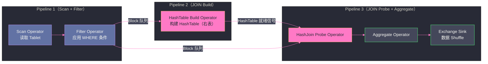

# 03 Doris 查询引擎——向量化执行与 Pipeline

## 摘要

Doris 2.0 完成了从行式执行引擎到向量化 Pipeline 执行引擎的全面重写，查询性能大幅提升（官方测试 TPC-H 性能提升 10x+）。本文深入剖析 Doris 的查询执行栈：CBO 优化器（NEREIDS）如何基于统计信息生成最优执行计划、Pipeline 执行框架如何消除 Blocking 算子提升 CPU 利用率、Runtime Filter 如何在运行时动态减少数据扫描量，以及向量化执行如何利用 SIMD 指令实现批量计算。

---

## 第 1 章 查询优化器——NEREIDS CBO

### 1.1 旧优化器的局限

Doris 2.0 之前使用的是基于规则的优化器（RBO，Rule-Based Optimizer）。RBO 的核心问题是：它只能按照预定义的优化规则变换查询计划（如谓词下推、常量折叠），但**无法根据实际数据分布**做出最优决策。

最典型的问题是 **JOIN 顺序**：对于 `A JOIN B JOIN C`，RBO 按 SQL 中书写的顺序执行，但最优的 JOIN 顺序取决于各表的大小和数据分布——应该先做小表 JOIN，减少中间结果大小，再与大表 JOIN。RBO 对此无能为力。

**NEREIDS**（New Relational Engine Relying on Information Derived System）是 Doris 2.0 引入的全新 CBO 优化器，基于 Cascades 框架（与 Apache Calcite 类似），能够：

- 根据表的行数统计、列的直方图信息估算不同执行计划的代价
- 枚举多种等价的执行计划，选择代价最低的
- 自动推导最优 JOIN 顺序（对于 N 表 JOIN，通过动态规划搜索最优顺序）
- 支持 SubQuery 去关联化（将 IN/EXISTS 子查询转换为 JOIN）

### 1.2 统计信息的收集

CBO 的优化质量依赖统计信息的准确性。Doris 支持自动和手动收集列统计：

```sql
-- 手动收集全表统计信息
ANALYZE TABLE orders;

-- 收集特定列的统计信息（含直方图，更精确）
ANALYZE TABLE orders UPDATE HISTOGRAM ON user_id, region, amount;

-- 查看列的统计信息
SHOW COLUMN STATS orders;

-- 开启自动统计信息收集（后台定期收集）
SET enable_auto_analyze = true;
```

统计信息包括：
- **行数（row count）**：表的总行数
- **NDV（Number of Distinct Values）**：列的不同值数量（用于估算 GROUP BY 的输出行数）
- **直方图（Histogram）**：列的数据分布（用于估算范围查询的选择性）
- **NULL 值比例**：NULL 值数量

> [!warning] 生产避坑：统计信息过期导致执行计划退化
> 在大批量数据导入后，如果没有更新统计信息，CBO 基于过时的统计信息生成的执行计划可能极差（如将 100 亿行的大表误判为小表，错误地选择 Broadcast JOIN）。
> 建议在大批量数据变更（如每日全量 Overwrite）后，手动触发 `ANALYZE TABLE` 更新统计信息，或开启自动统计信息收集。

---

## 第 2 章 Pipeline 执行框架——消除 Blocking 提升 CPU 利用率

### 2.1 旧执行模型的问题：Blocking 算子

在 Doris 2.0 之前的行式执行模型中，某些算子是 **Blocking** 的——必须等待上游数据全部处理完才能开始输出。典型的 Blocking 算子：

- **Aggregation（Sort-based）**：必须先对全部数据排序，才能输出聚合结果
- **Hash JOIN（Build 阶段）**：必须先将小表全部加载到 HashTable，才能开始 Probe 大表
- **Sort（全局排序）**：必须等全部数据才能开始排序

Blocking 算子导致的问题：当某个算子处于等待状态时，对应的线程处于 **空闲**（blocked）状态，CPU 浪费。对于多阶段查询，大量时间消耗在等待 Blocking 算子完成上。

### 2.2 Pipeline 的设计——将 Blocking 改为异步

Pipeline 执行框架的核心思想：**将所有 Blocking 算子拆分为可异步执行的多个 Pipeline Task**。

以 Hash JOIN 为例，传统执行：
```
Build Phase（Blocking）：读取右表全部数据，构建 HashTable
→ 等待 Build 完成
Probe Phase：读取左表数据，逐行查找 HashTable
```

Pipeline 化后：
```
Pipeline 1：读取右表数据，分批写入 HashTable（非 Blocking，异步完成）
Pipeline 2：一旦 HashTable 构建完成，读取左表数据，开始 Probe（流式处理）
```

Pipeline Task 之间通过**有界缓冲队列**（Local Exchange Buffer）传递数据批次（Block），生产者塞满队列则暂停，消费者取出数据则触发生产者继续生产，形成背压（Backpressure）机制。



这种设计使 CPU 线程始终保持忙碌——当某个 Pipeline Task 等待数据时（队列为空），线程自动切换到其他可执行的 Pipeline Task。从宏观上看，CPU 核心几乎 100% 利用率。

### 2.3 向量化算子——批量计算的 SIMD 优化

在 Pipeline 框架内，每个 Operator 每次处理一个**Block**（4096 行的列式数据批）。Block 内每列的数据是连续的内存区域，编译器和 SIMD 指令可以批量处理：

- **Filter（WHERE 条件过滤）**：生成 Selection Vector（位图），标记满足条件的行，后续 Operator 通过位图跳过不满足条件的行，不需要物理删除
- **Hash Aggregate**：4096 行批量计算哈希值（SIMD 加速），批量更新 HashTable
- **String Functions**：批量字符串操作（如 `LIKE`、`SUBSTRING`）使用 SIMD 加速字符串匹配

向量化执行相比旧的行式执行，性能提升 5-10x，主要来源于：SIMD 并行（4-8 倍）+ Cache 友好（批量处理减少 Cache Miss）+ 减少函数调用开销（不再逐行调用 `next()`）。

---

## 第 3 章 Runtime Filter——动态减少数据扫描量

### 3.1 什么是 Runtime Filter

**Runtime Filter** 是 Doris 在运行时动态生成并下推的过滤器，用于在 JOIN 操作中**提前过滤大表（左表/Probe 侧）的数据**，减少需要 Probe HashTable 的行数。

假设查询：
```sql
SELECT o.*, u.user_name
FROM orders o  -- 大表：10 亿行
JOIN users u ON o.user_id = u.user_id  -- 小表：100 万 VIP 用户
WHERE u.segment = 'VIP';
```

没有 Runtime Filter：
1. `orders` 表：全量扫描 10 亿行
2. `users` 表：过滤 `segment = 'VIP'`，得到 100 万用户的 HashTable
3. 将 10 亿行 `orders` 数据逐行与 100 万用户 HashTable 做 JOIN
4. 大量 `orders` 行的 `user_id` 不在 VIP 列表中，JOIN 结果为空，但扫描和传输了大量无效数据

有 Runtime Filter：
1. `users` 表：过滤 `segment = 'VIP'`，构建 100 万用户的 HashTable
2. **同时**，从 HashTable 中提取所有 `user_id` 的 Bloom Filter（运行时生成，下推到 `orders` 的 Scan 阶段）
3. `orders` 表：在 Scan 阶段就应用 Bloom Filter——`user_id` 不在 VIP 列表中的 Row Block 直接跳过，**只扫描可能命中的 Row Block**
4. JOIN：大幅减少需要 Probe 的数据量

**效果**：如果 VIP 用户只占总用户的 1%，理论上 `orders` 的实际扫描量减少 99%，网络传输量减少 99%，查询延迟从分钟级降到秒级。

### 3.2 Runtime Filter 的类型

Doris 支持三种 Runtime Filter 类型，自动根据小表数据分布选择：

**BloomFilter**：适合高基数列（如 `user_id`），误判率低（通常 1%）；大小固定（与 Bloom Filter 大小相关，通常几 MB）。

**MinMax Filter**：适合有序或接近有序的列（如 `order_date`），存储小表中该列的 [min, max]，过滤掉大表中不在此范围内的行；大小极小（只有两个值），但只对连续范围有效。

**IN Filter（小集合）**：适合小基数集合（< 1024 个不同值），直接传递精确的 IN 列表；精确无误判，但集合过大时内存开销大。

Runtime Filter 的生成和传递是**运行时自动完成**的——不需要用户在 SQL 中手动编写，Doris 的优化器自动识别 JOIN 模式并插入 Runtime Filter 节点。

---

## 第 4 章 分布式 JOIN 策略

### 4.1 Broadcast JOIN vs Shuffle JOIN

Doris 支持两种分布式 JOIN 模式，由 CBO 根据表大小自动选择：

**Broadcast JOIN**（广播小表）：将小表（右表）的全量数据广播到所有参与大表（左表）Scan 的 BE 节点，每个 BE 节点本地做 JOIN。
- 适用：右表较小（通常 < 100MB，由 `broadcast_row_count_limit` 控制）
- 优点：无 Shuffle 开销，延迟低
- 缺点：小表在每个 BE 上都有一份副本，内存消耗 = BE 数 × 小表大小

**Shuffle JOIN**（哈希重分布）：将大表和小表按 JOIN Key 的哈希值重新分发（Shuffle），使相同 JOIN Key 的数据落在同一 BE 上，再做本地 JOIN。
- 适用：两表都较大
- 优点：支持任意大小的表 JOIN，内存只需要一份数据
- 缺点：网络 Shuffle 开销大，延迟相对高

**Bucket Shuffle JOIN**（分桶 JOIN 优化）：如果大表和 JOIN 的维表按相同的 Key 分桶，同一分桶的数据天然在同一 BE 上，JOIN 时只需广播维表的对应分桶数据（而不是全表广播），网络传输量 = 全表广播的 1/N（N = 分桶数）。

---

## 第 5 章 小结

Doris 查询引擎的演进路径代表了现代 OLAP 系统的共同方向：

1. **CBO 优化器（NEREIDS）**：基于统计信息枚举等价执行计划，自动选择最优 JOIN 顺序和 JOIN 策略，消除了人工 Hint 的需要
2. **Pipeline 执行**：消除 Blocking 算子，线程始终保持忙碌，CPU 利用率显著提升
3. **向量化计算**：4096 行批量处理 + SIMD 加速，函数计算吞吐提升 5-10x
4. **Runtime Filter**：运行时动态生成并下推过滤器，提前减少大表扫描量，在 JOIN 场景效果显著

这四个层次协同作用，使 Doris 2.0+ 在 TPC-H 基准测试中的性能相比 Doris 1.x 提升了 10 倍以上。

---

**延伸阅读**：
- [[01 Doris 全局架构——FE BE 分离与 MPP 执行]]
- [[04 Doris 数据模型——Duplicate、Aggregate 与 Unique]]

---

> [!note] 思考题
> 1. Doris 的 CBO（Cost-Based Optimizer）使用统计信息（表行数、列基数、直方图）来选择最优执行计划。如果统计信息过期（如大量数据导入后未更新统计），CBO 可能选择错误的 JOIN 顺序或 JOIN 方式。`ANALYZE TABLE` 更新统计的开销有多大？在频繁导入数据的场景中，统计信息应该多久更新一次？
> 2. Doris 支持多种 JOIN 策略：Broadcast Join（小表广播到所有节点）、Shuffle Join（按 JOIN Key 重分布）和 Colocate Join（数据已按 JOIN Key 预分布，无需网络传输）。Colocate Join 的前提是两个表的 Colocate Group 相同——这要求建表时就规划好。在一个 star schema（事实表 + 维度表）中，哪些表适合设置 Colocate？
> 3. Doris 的 Runtime Filter（运行时过滤器）在 JOIN 执行时动态生成过滤条件——例如 Build 端生成 Bloom Filter 推送到 Probe 端，提前过滤不匹配的行。Runtime Filter 在什么场景下效果显著（高选择性 JOIN）？在低选择性 JOIN（几乎所有行都匹配）中，Runtime Filter 的生成和传输开销是否反而拖慢查询？
