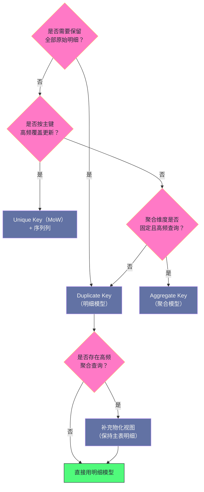

# 04 Doris 数据模型——Duplicate、Aggregate 与 Unique

**摘要：**

数据模型是建表时最重要的决策，因为它决定了"写入语义"这一层——**数据写进来之后，哪些行会被保留、哪些会被合并、哪些会被覆盖。** 本文按"为什么需要三种模型 → 每种模型怎么实现 → 怎么选"的顺序展开。先说明三类业务需求（明细事件、预聚合指标、可更新的业务实体）如何催生出三种模型；再逐一拆解它们的实现：Duplicate 模型把 Key 当纯排序键、Aggregate 模型把聚合推迟到合并阶段、Unique 模型用 Delete Bitmap 把"覆盖写"翻译成"追加写 + 位图标记"。其中 Unique 模型的演进（从合并时去重到写入时标记）体现了一条通用规律——**把代价从高频路径转移到低频路径**。之后讲部分列更新、序列列、物化视图这些配套能力，给出选型决策框架与模型变更的代价，最后是边界与常见误用。全文回答两个问题：三种模型各自把代价放在哪里，以及为什么"选错模型"是事后最难补救的设计错误。

---

## 第 1 章 三种数据模型的由来

### 1.1 三类写入语义需求

分析场景里的数据写入语义，粗分有三类。

**第一类是"明细事件"。** 用户行为埋点、点击流、日志切片——每一条记录代表一次独立发生的事件，事件之间没有"覆盖"关系。查询时既要能看全部明细，也要能按任意维度聚合。**这类需求的关键是"不丢任何一条原始记录"。**

**第二类是"预聚合指标"。** 例如"某地区某天的销售额"，同一天同一地区可能被多次上报（增量累加），业务上这些上报表达的是同一个指标的不同部分。查询时只关心总和，不关心中间过程。**这类需求的关键是"写入时就合并，节省存储与查询代价"。**

**第三类是"可更新的实体"。** 用户资料、订单状态、商品库存——一个实体在时间轴上会经历多次状态变更，查询时只关心最新状态。**这类需求的关键是"按主键覆盖，且查询必须看到最新值"。**

这三类需求对存储引擎的要求互相冲突：第一类要求"只追加不合并"，第二类要求"尽量早合并"，第三类要求"能覆盖旧值"。用一套机制通吃三者，必然在某些场景下表现很差。这就是 Doris 提供三种数据模型的原因。

### 1.2 三种模型的对应关系

| 模型 | Key 列语义 | 写入语义 | 面向的需求 |
|---|---|---|---|
| Duplicate Key | 仅排序键（可重复） | 全部保留 | 明细事件 |
| Aggregate Key | 聚合维度（可重复） | 相同 Key 按聚合函数合并 | 预聚合指标 |
| Unique Key | 唯一主键 | 相同 Key 覆盖（UPSERT） | 可更新实体 |

三者的定义方式很接近，只在 `KEY` 关键字上不同：

```sql
CREATE TABLE events (
    event_date DATE,
    user_id    BIGINT,
    region     VARCHAR(32),
    amount     DECIMAL(10, 2)
) ENGINE = OLAP
DUPLICATE KEY(event_date, user_id)   -- 或 AGGREGATE KEY(...) / UNIQUE KEY(...)
DISTRIBUTED BY HASH(user_id) BUCKETS 32;
```

**这个"只差一个关键字"的表象具有误导性**——三种模型在存储层的实现差异极大，性能特征也完全不同。把它当作"可随时切换的选项"是实践中代价最高的误判之一。

### 1.3 模型选择的不可逆性

需要在一开始就强调的性质是：**数据模型在建表后基本无法更改。**

原因在存储层：三种模型的数据组织方式不同（Duplicate 保留全部行、Aggregate 合并相同 Key、Unique 需要维护删除标记），因此"把一张 Aggregate 表改成 Duplicate 表"不是改一个配置项，而是**重新组织全部历史数据**。可行的路径只有"建新表 + 全量重导 + 切换读取"，而这在数据量大的时候意味着长时间的双写与切换窗口。

由此得到一条实践纪律：**建表时先确定数据模型，再考虑其他设计（分区、分桶、索引）。** 因为其他设计的调整代价虽然也不小（如分桶数需要重建表），但至少不涉及"语义变化"——而模型变化会同时改变查询结果的含义，风险等级完全不同。

### 1.4 Key 列与 Value 列的划分

建表时除了选模型，还要划分"哪些列是 Key 列、哪些是 Value 列"。这个划分在不同模型下的含义不同，值得单独说明。

在 **Duplicate 模型**中，Key 列与 Value 列在存储上没有本质区别——Key 列只参与排序，因此"把某列放进 Key"的效果是"让它在物理上更有序"，从而让基于它的范围查询与裁剪更高效。这个划分因此是**性能导向**的。

在 **Aggregate 模型**中，划分是**语义导向**的：Key 列定义聚合维度，Value 列必须声明聚合函数。此时"把某列放进 Key"意味着"保留它的粒度"，而"把它放进 Value"意味着"它会被聚合掉"。**这个划分决定了数据的粒度，一旦确定就无法回溯。**

在 **Unique 模型**中，Key 列是主键（决定覆盖的唯一性），其余列都是 Value 列。这个划分是**业务导向**的，没有多少选择空间。

三种含义的差异，解释了为什么"照抄一张表的 Key 设计到另一张表"往往行不通——**同一个列名在不同模型下承担的角色完全不同。**

---

### 1.5 写入语义与查询语义的对应

三种模型的设计还有一个更深的共性：**写入语义与查询语义是成对定义的。**

明细模型的写入语义是"全量保留"，对应的查询语义是"必须自行聚合"；聚合模型的写入语义是"相同 Key 合并"，对应的查询语义是"结果已聚合、不可重复聚合"；Unique 模型的写入语义是"主键覆盖"，对应的查询语义是"看到的是最新版本"。

这个对应关系解释了一个常见困惑：**为什么"同一份 SQL 在不同模型上结果不同"。** 因为模型改变的不只是存储方式，还改变了"查询结果的语义"——明细模型上的 `SUM(amount)` 是对原始明细求和，聚合模型上的 `SUM(amount)` 是对已经部分聚合的值再求和（可能重复聚合）。**因此模型变更必须伴随 SQL 复核，这不是谨慎过度，而是语义要求。**

理解了这一点，就能理解为什么"模型选择"必须与"查询形态"一起考虑：**选模型时其实是在同时选择"数据保留成什么"与"查询怎么写"。** 只考虑前者，会在后期发现"查询语义与预期不符"。

## 第 2 章 Duplicate Key 模型

### 2.1 语义：Key 只是排序键

Duplicate Key 模型不做任何去重或聚合。`DUPLICATE KEY` 指定的列**只是排序键**——它决定数据在存储内的物理排列顺序，从而影响索引与裁剪效果，但它不约束唯一性。

```sql
-- 连续写入两行完全相同的数据
INSERT INTO page_views VALUES ('2026-01-01', 1001, 88888, 30);
INSERT INTO page_views VALUES ('2026-01-01', 1001, 88888, 30);

-- 查询返回两行（不去重）
SELECT * FROM page_views WHERE user_id = 88888;
```

这个"不去重"的性质常被误解为缺点，但在明细场景里它恰恰是必须的——**重复出现的相同事件本身就是有效信息**（例如同一用户在同一秒内点击两次）。

### 2.2 排序键与主键的区别

这里需要澄清一个常见混淆：**Doris 的 Key 列不是"主键"**（除 Unique 模型外）。

- 在 Duplicate 模型中，Key 列只影响**物理排序**，进而影响 Short Key Index 与 ZoneMap 的效果。
- 在 Aggregate 模型中，Key 列定义**聚合维度**——相同 Key 的行会被合并。
- 只有 Unique 模型中，Key 列才具备"唯一标识"的含义。

因此"该把哪些列放进 Key"这个问题的答案，在三种模型下是不同的：**Duplicate 模型下应当选"高频用于过滤与排序的列"，Aggregate 模型下应当选"业务上的聚合维度"，Unique 模型下必须是"业务主键"。**

### 2.3 适用场景与代价

Duplicate 模型适合三类场景：**原始事件的完整留存**（埋点、日志）、**需要灵活多维度分析的宽表**（因为明细完整，任意维度都能现场聚合）、以及**作为数据仓库明细层的落地表**。

它的代价有两处。**其一是存储空间最大**（没有预聚合带来的压缩效果，相同 Key 的多行完整保留）。**其二是查询代价最高**（每次查询都要现场聚合，没有预聚合结果可用）。

需要指出的是，"查询代价最高"这个说法要放在对比语境里理解：**它的代价不是"慢"，而是"每次查询都要从头算"。** 在小数据量或低查询频率的场景下，这个代价完全可以接受；只有在"某个聚合维度被高频查询"时，才值得为它单独建预聚合结构。**这就是"过早优化"与"必要优化"的分界线——依据是查询频率，而不是数据量。**

### 2.4 与索引体系的配合

Duplicate 模型与索引体系的关系最直接，因为它的 Key 列就是排序键。

排序键决定了两件事：**Short Key Index 的覆盖范围**（它索引排序键的前缀列）与**ZoneMap 的效果**（数据在排序键上局部有序，因此相邻行块的取值区间窄、裁剪效果好）。

因此对 Duplicate 表来说，"排序键设计"与"索引设计"其实是同一件事。由此得到两条具体建议。

**建议一：把高频范围过滤列放在排序键最左侧。** 典型的是时间列——绝大多数分析查询都带时间范围条件，把时间列放在排序键首位能让 Short Key Index 与 ZoneMap 同时生效。

**建议二：把高频等值过滤的高基数列放在排序键次位，或单独建 BloomFilter。** 排序键的列数有限，不可能把全部过滤列都放进去；超出部分应当用 BloomFilter 等索引补足。

需要提醒的是，**排序键的选择要与"分区列"区分开**：分区列用于粗粒度裁剪（跳过整个分区），排序键用于分区内的细粒度裁剪（跳过行块）。两者是不同层次的裁剪手段，配合使用才能达到最好的效果。

---

## 第 3 章 Aggregate Key 模型

### 3.1 机制：把聚合推迟到合并

Aggregate 模型的语义是"相同 Key 的行按列定义的聚合函数合并"。但这里有一个关键的实现细节：**合并不是在写入时立即发生的，而是发生在 Compaction 阶段。**

写入时，新数据照样进入新的 Rowset（与明细模型一致）；当后台 Compaction 合并 Rowset 时，遇到相同 Key 的行，才按聚合函数归并成一行。因此：

**在 Compaction 发生之前，表里可能同时存在相同 Key 的多行。** 查询时需要对它们再做一次聚合——好在聚合函数（求和、取最大等）通常满足结合律，因此"先在存储层部分聚合、再在查询层完成聚合"不会影响结果正确性。

这个设计带来一个直接好处：**写入路径与明细模型几乎一致**（都是追加写），因此写吞吐不受影响。这也是它相对"写入时立即聚合"方案的关键优势——后者需要在写入路径上做查找与更新，代价高得多。

### 3.2 聚合函数的类型

Aggregate 模型支持多种聚合函数，它们对应不同的业务语义。

| 函数 | 语义 | 典型用途 |
|---|---|---|
| SUM | 累加 | 销售额、计数 |
| MIN / MAX | 取最小/最大值 | 最低价格、峰值 |
| REPLACE | 保留最后写入的值 | 最新状态 |
| REPLACE_IF_NOT_NULL | 非空时覆盖 | 稀疏列的增量更新 |
| HLL_UNION | 基数估计结构合并 | 近似去重计数 |
| BITMAP_UNION | 位图合并 | 精确去重计数 |

其中两个函数值得单独说明。**REPLACE 的语义是"按写入顺序保留最后一个值"**，因此它实际上提供了一种"有限度的更新能力"——但它没有"按主键覆盖任意列"的语义，只能覆盖被定义为 REPLACE 的那一列。**REPLACE_IF_NOT_NULL 则解决了"稀疏更新"问题**：当某次上报只带部分字段时，空值不会把已有值覆盖掉。

**HLL_UNION 与 BITMAP_UNION 服务于去重计数**（如 UV 统计）。它们的价值在于把"去重"这个原本需要保存全部明细的操作，转化为"可合并的中间结构"——**这是预聚合思路在去重场景上的延伸：不保存明细，只保存可合并的摘要。**

### 3.3 维度固定的局限

Aggregate 模型最重要的限制是**聚合维度在建表时固定**。

如果表按 `(日期, 地区)` 聚合，那么数据在存储层就已经被合并到"日期 + 地区"这个粒度，**城市维度的信息永久丢失**。此时想查询"按城市聚合"就无法得到正确结果——不是性能问题，而是数据已经不存在了。

这条限制决定了 Aggregate 模型的适用边界：**它只适合"查询模式已知且固定"的场景**，而不适合需要灵活探索的分析。实践中它更常见的用法是作为**物化视图的底层存储**——把预聚合结果放在物化视图里，而主表保持明细（见第 6 章）。

### 3.4 什么时候该用

判断是否该用 Aggregate 模型，可以问三个问题。

**第一，这个聚合维度是否会被高频查询？** 如果不高频，现场聚合的代价可以接受，不需要预聚合。

**第二，是否需要保留明细？** 如果业务可能需要"回看原始记录"或"临时换个维度分析"，那么聚合模型会永久断掉这条路径。

**第三，聚合逻辑是否稳定？** 如果聚合函数可能变化（例如今天要 SUM、明天要 AVG、后天要中位数），那么预先绑定聚合函数会成为负担。

三个问题的答案都是"是"（高频、不需要明细、逻辑稳定）时，Aggregate 模型才是合适的选择。**任何一个"否"，都意味着应当保持明细并考虑用物化视图承接高频查询**——因为物化视图可以在不牺牲主表明细的前提下提供预聚合能力。

### 3.5 聚合模型的写入幂等性

聚合模型有一个性质容易被忽略：**它的写入是幂等的（对幂等聚合函数而言）。**

以 SUM 为例，同一批数据重复导入两次，结果是"指标被加了两次"——这看起来不幂等。但如果导入时使用了去重标签（如 Stream Load 的 Label），重复的导入会被识别并拒绝，从而保证"同一批数据只生效一次"。**因此幂等性不是聚合函数自带的，而是靠导入侧的标签机制保障的。**

这一点对"数据重放"场景很重要。如果上游数据源需要重新推送（例如修复了一个数据错误后重放），那么正确做法是"**先删除对应范围的数据再重新导入**"，而不是"直接再导一遍"——后者会让 SUM 类指标翻倍。**聚合模型的运维纪律是"重放必须伴随删除"，这条纪律与明细模型完全不同**（明细模型可以直接重放，只是会多出重复行）。

### 3.6 聚合模型的查询行为

最后说明聚合模型在查询时的行为，因为它与使用者的直觉可能有差异。

**查询聚合模型时，返回的结果已经是聚合后的**——不需要（也不应该）在外层再做一次聚合。如果外层再 `SUM` 一次，结果是错误的（重复聚合）。这一点与明细模型相反：明细模型必须在外层聚合，聚合模型不需要。

这个差异带来的实践风险是"**同一份 SQL 在两种模型下结果不同**"。因此在数据模型变更（如从明细改为聚合）时，**所有下游 SQL 都需要逐条复核**——不能假设"改完之后结果一样"。这也是为什么模型变更应当被当作"接口变更"来管理。

---

## 第 4 章 Unique Key 模型

### 4.1 为什么列式存储难以 UPSERT

Unique Key 模型要解决的是"按主键覆盖"的语义，而这件事在列式存储里天然困难。

原因在第 2 篇已经展开：列式存储按列组织数据、以不可变文件为单位、且数据经过压缩。要"更新一行"，在物理上意味着定位到该行在每一列数据块中的位置、解压、修改、重新压缩、写回——这与列式存储的所有设计前提冲突。

因此所有列式分析引擎都必须设计一套"用追加表达更新"的机制。Doris 的方案经历过一次重要演进。

### 4.2 Merge-on-Read：把代价放在查询侧

早期实现是 **Merge-on-Read（MoR）**：写入时不做任何去重，新旧版本并存；查询时读取多个版本，只返回最新的那个。

它的优点是写入路径极简（就是追加），缺点是**查询代价与"某行被更新的次数"成正比**。如果一行数据被更新了几十次，那么每次查询它都要合并几十个版本——这在"高频更新的实体表"上会迅速恶化。

### 4.3 Merge-on-Write 与 Delete Bitmap

后来的实现是 **Merge-on-Write（MoW）**：写入新版本的同时，**把旧版本标记为删除**。查询时只需检查删除标记，无需做版本合并。

具体的写入流程是：新数据写入新的 Rowset（追加）；随后在历史 Rowset 中定位所有相同主键的行，把它们在对应 Rowset 的 **Delete Bitmap** 中置位标记；查询时逐行检查位图，命中则跳过。

```text
Rowset 1（历史数据）:
  Row 0: user_id=12345, email=old@example.com   ← 位图 bit[0]=1（已被覆盖）
  Row 1: user_id=99999, email=bob@example.com  ← 正常可见
Rowset 2（新写入）:
  Row 0: user_id=12345, email=new@example.com   ← 最新版本，可见
```

这个转变的实质是**把代价从查询侧转移到写入侧**：MoR 每次查询都付合并成本，MoW 每次写入付一次标记成本。**在"查询远多于写入"的分析场景里，这个转移是划算的**——这与第 2 篇讲的"延迟聚合"是同一类思路，只是方向相反（一个推迟到合并，一个提前到写入）。

### 4.4 Roaring Bitmap：让删除标记足够便宜

Delete Bitmap 的实现依赖 **Roaring Bitmap**——一种自适应压缩的位图结构。

它的空间效率来自"按密度选择编码"：稀疏区间用有序数组存位置，密集区间用常规位图，中间密度用游程编码。因此即使一个 Tablet 有十亿行，而只有一百万行被覆盖，位图的存储开销也只在 MB 量级——**它只记录"哪些位置被置位"，而不是为每一行固定分配一位。**

这一点对 MoW 的可行性至关重要：如果删除标记的空间开销与总行数成正比，那么在大表上维护它就不可接受；Roaring Bitmap 让它与"被覆盖的行数"成正比，从而使 MoW 在大表上依然经济。

### 4.5 写入代价与它的边界

MoW 把代价移到写入侧之后，写入代价的具体构成是"**定位旧行 + 更新位图**"。定位旧行需要查询历史 Rowset 的索引，因此它的成本与"历史 Rowset 数量"相关——**这又回到了 Compaction 的重要性：及时合并不仅影响读性能，也影响写性能。**

由此得出 Unique Key 模型的边界：**它适合"中低频更新 + 高频查询"的场景**（如业务实体表的同步），**不适合"超高频点更新"**（如每秒十万次的库存扣减）。后者的正确选择是行式数据库——**不是因为它"更先进"，而是因为它的存储结构与"高频点更新"这个负载形态匹配。**

### 4.6 序列列：解决更新顺序问题

MoW 有一个隐含前提：**"最新写入的就是最新的版本"**。但在分布式导入场景下，这个前提可能不成立——两批数据可能因网络或重试而乱序到达，导致"较旧的数据覆盖了较新的数据"。

Doris 提供了**序列列（Sequence Column）**来解决这个问题：指定一个列作为版本判断依据（通常是时间戳或自增版本号），覆盖时按该列的值决定谁更新，而不是按到达顺序。这样即使导入乱序，最终结果也是正确的。

**这个机制在 CDC 同步场景里几乎是必需的**——因为 CDC 的数据流可能因并行消费而乱序。它的代价是"每次写入都要比较序列值"，因此会略微增加写入开销；但相对于"数据被旧版本覆盖"这个后果，这个代价可以接受。

### 4.7 Unique 模型的查询特征

Unique 模型在查询侧的一个重要特征是：**它不需要任何特殊语法就能返回最新版本。**

这一点在对比中才能看出价值。同类系统里，某些实现把"去重"推迟到合并阶段，因此查询时可能看到未去重的多行，需要显式加语法强制去重（代价高）。Doris 的 MoW 把删除标记做在写入侧，于是查询路径与明细模型几乎一致——**没有额外的去重开销，也不需要使用者理解内部机制。**

不过有一处细节需要注意：**如果 Compaction 尚未把删除标记清理掉，查询仍需要读位图做跳过判断。** 因此"标记很多但未合并"的表，查询会有额外的位图检查开销。这也是 Compaction 及时性的又一个影响面——**它不仅影响 Rowset 数量，也影响位图的规模。**

### 4.8 Unique 模型与分区的关系

Unique 模型的主键唯一性有一个容易踩的边界：**唯一性是在"表"级别还是"分区"级别？**

如果表按时间分区，而主键是业务 ID，那么同一个业务 ID 在不同分区里可以各有一行——此时"唯一"只在分区内成立。这在"按天分区 + 按主键去重"的场景下会产生反直觉的结果：**同一个 ID 的历史版本仍留在旧分区里，不会被新分区覆盖。**

因此对 Unique 表来说，**分区设计必须与"主键的生命周期"匹配**：如果业务要求"一个 ID 全表唯一"，那么就不该按时间分区，或者应当在查询时显式限定分区。这是一个在建表阶段就要确认的问题，事后调整代价很高。

---

## 第 5 章 部分列更新与轻量级写入

### 5.1 需求：只更新几列

Unique Key 模型的标准 UPSERT 语义是"**整行覆盖**"：写入的新行必须包含全部列，未提供的列会被置为默认值。这在很多场景下并不适用。

例如用户画像表有几十个字段，其中"最近登录时间"由一个高频任务更新，而其他字段由别的任务更新。如果用整行覆盖，那么更新"最近登录时间"的任务必须先把整行读出来、改一个字段、再写回去——**这既低效，又引入了并发覆盖的风险**（两个任务同时读改写会互相覆盖）。

### 5.2 部分列更新的实现与限制

Doris 在 Unique Key 表上支持**部分列更新**：写入时只提供需要更新的列，未提供的列保持原值。

它的实现方式与整行覆盖不同——需要在写入时读取旧值并合并，因此**写入代价高于整行覆盖**。同时它有几条限制：需要开启特定配置；对写入方式有要求（部分导入方式支持）；且并非所有列类型都能参与。

### 5.3 适用场景与取舍

部分列更新适合**"宽表 + 多来源分别更新不同列"**的场景，典型的如用户画像、商品属性、订单状态的多阶段流转。

它的取舍很清楚：**用更高的单次写入代价，换取"不必读改写"与"避免并发覆盖"。** 判断是否值得，可以看两个信号：**其一是"更新是否只涉及少数列"**（涉及列多则整行覆盖更划算）；**其二是"是否存在多来源并发更新同一行"**（存在则部分列更新的价值显著上升）。

需要提醒的是，部分列更新**不解决"更新顺序"问题**——如果两个任务分别更新同一行的不同列，最终结果是两列的更新都生效（这正是期望的行为）；但如果它们更新的是同一列，仍然需要序列列来保证顺序。**"部分列更新"与"序列列"是两个正交的能力，解决的是不同的问题。**

### 5.4 轻量级写入的边界

把部分列更新与序列列放在一起看，Unique 表的"轻量级写入"能力有三条边界。

**边界一：它降低的是"应用侧的复杂度"，不是"存储侧的代价"。** 部分列更新让应用不必"读改写"，但存储侧仍需读取旧值并合并，因此单次写入的代价高于整行覆盖。**收益在应用侧，代价在存储侧。**

**边界二：它依赖具体的写入方式。** 并非所有导入方式都支持部分列更新，因此在选导入方式时要把这个需求考虑进去，否则会出现"设计时按部分列更新规划，实现时发现所用的导入方式不支持"。

**边界三：它无法绕过 Compaction 的影响。** 频繁的部分列更新会持续产生新的 Rowset 与位图标记，因此它对 Compaction 的压力与普通更新相同。**轻量级写入不等于"可以无限高频"。**

这三条边界的共同含义是：**轻量级写入解决的是"写入语义的粒度"问题，而不是"写入频率"问题。** 混淆这两者会导致"以为用了部分列更新就能高频写"的误判。

---

## 第 6 章 物化视图与 Rollup

### 6.1 为什么需要预聚合结构

明细模型灵活但查询代价高，聚合模型高效但会丢失明细。**物化视图提供了第三条路：主表保持明细，另外维护一份预聚合的副本。**

这样"高频的聚合查询"走物化视图（快），"临时的探索查询"走主表（灵活）。两者的数据由系统自动保持一致——**这是"既要灵活又要快"这个矛盾的标准解法：不在一份数据上兼顾，而是维护两份不同粒度的数据。**

### 6.2 同步与异步物化视图

Doris 提供两类物化视图，它们的机制与适用场景不同。

**同步物化视图**（早期称为 Rollup）与主表强绑定：数据写入主表时同步更新物化视图。它的优点是**数据强一致**（查询物化视图得到的结果与主表完全对应）；缺点是**写入路径变长**（每次写入要更新所有物化视图），因此写放大明显。

**异步物化视图**（较新版本引入）独立刷新：按调度周期从主表读取数据并重建，与主表解耦。它的优点是**写入路径不受影响**、可以支持更复杂的定义（跨表关联、复杂表达式）；缺点是**数据有延迟**（在刷新周期内查询到的是旧数据）。

两者的选择依据是"**对数据新鲜度的要求**"与"**写入吞吐的重要性**"：要求强一致且写入量不大，用同步物化视图；写入量大且能接受分钟级延迟，用异步物化视图。

### 6.3 写放大：同步物化视图的隐性成本

同步物化视图的写放大值得单独强调，因为它常常被低估。

假设主表上建了 5 个同步物化视图，那么每次导入都要：写主表、写 5 个物化视图。这意味着**写入的 CPU、IO 与元数据事务量都放大约 6 倍**，而且 Compaction 的负担也同步放大（物化视图同样需要合并）。

因此同步物化视图的数量应当被严格控制。判断标准是"**这个物化视图是否真的被高频查询使用**"——如果建了但查询很少，它就是纯粹的写入负担。实践中应当定期审计物化视图的使用情况，清理掉长期无人使用的那些。

### 6.4 选择策略

把上述分析收敛成一条选择路径。

**第一步，判断查询频率。** 如果某个聚合查询每天只跑几次，不值得为它建物化视图——直接查主表即可。

**第二步，判断数据新鲜度要求。** 要求强一致且写入量不大 → 同步物化视图；能接受延迟或写入量大 → 异步物化视图。

**第三步，控制数量。** 同步物化视图的数量应当与"查询收益"匹配，而不是"能建就建"。异步物化视图虽然不影响写入路径，但它消耗存储与刷新时的计算资源，同样需要节制。

**第四步，定期审计。** 无论哪种物化视图，都应当定期检查它的使用情况——**"建了但没人用"的物化视图是纯粹的负资产。**

### 6.5 查询改写：物化视图如何被自动使用

物化视图能起作用的前提是**查询被自动改写**——即用户写的 SQL 面向主表，而优化器判断"这份物化视图能回答这个查询"，于是把查询重写为面向物化视图。

这个机制带来一个实践要点：**物化视图的定义方式会影响它能否被命中。** 如果物化视图的聚合粒度、过滤条件与查询的形态差异太大，优化器可能无法完成改写，物化视图就形同虚设。因此定义物化视图时应当**以真实的高频查询为模板**，而不是凭想象设计一个"看起来通用"的聚合表。

验证方法很直接：**用真实查询去测，观察执行计划中是否用到了物化视图**。如果计划里仍然是"扫描主表并现场聚合"，说明改写没有发生，需要调整物化视图的定义。**"建了物化视图但查询没变快"是这个机制最常见的失效形态**，而它的原因往往不在物化视图本身，而在"定义与查询形态不匹配"。

---

### 6.6 Rollup 与物化视图的关系

Doris 早期把"同一张表的另一种聚合粒度"称为 Rollup，后来的版本统一到物化视图的概念下。理解两者的关系有助于读懂老文档。

**Rollup 的本质是"同一份数据的另一种排序与聚合组织"**——它从主表派生，物理上是一份额外的数据副本，查询时优化器可以选择用哪一份。它与主表的绑定非常紧密（同一次写入同时更新）。

**物化视图的概念更宽**：它既可以是从单表派生的聚合视图（等价于 Rollup），也可以是跨表关联、带复杂表达式的派生结果。因此"物化视图"是"Rollup"的超集。

这个演进反映的是一条通用路径：**系统先实现一个具体的优化手段（Rollup），随着需求扩展抽象成更一般的能力（物化视图）。** 对使用者而言，需要注意的实践差异是：Rollup 式的物化视图写入成本与主表同步（写放大明显），而跨表式的物化视图通常只能异步刷新（数据有延迟）。**选择哪种，取决于"能否接受延迟"。**

## 第 7 章 三种模型的选型指南

### 7.1 决策框架

把三种模型的选择收敛成一张决策图。



这张图的核心判断顺序是"**先问要不要明细，再问要不要更新，最后问要不要预聚合**"。这个顺序不能颠倒——因为"要不要明细"决定了后面所有选择的上界（明细一旦丢失就无法恢复）。

### 7.2 典型场景映射

| 场景 | 推荐模型 | 理由 |
|---|---|---|
| 用户行为埋点、点击流 | Duplicate | 事件独立、需完整保留、分析维度多变 |
| 数仓明细层（DWD） | Duplicate | 保留全部明细供下游按需加工 |
| 固定维度的指标宽表 | Aggregate | 维度固定、查询高频、无需明细 |
| 物化视图的底层存储 | Aggregate | 物化视图本身就是预聚合结构 |
| MySQL CDC 实时同步 | Unique（MoW）+ 序列列 | 需要 UPSERT 且要处理乱序 |
| 用户画像、商品属性 | Unique（MoW）+ 部分列更新 | 宽表、多来源分别更新不同列 |
| 订单状态流转 | Unique（MoW）+ 序列列 | 按主键覆盖、需要顺序保证 |

从这张表能看出一个规律：**Unique Key 模型的实际使用场景比"主键去重"这个字面描述要广**——它实际上承担了"所有需要表达'实体最新状态'的场景"，而 CDC 同步是其中最典型的一类。

### 7.3 混合使用的常见模式

实践中很少只用一种模型，常见的组合模式有两种。

**模式一：明细 + 物化视图。** 主表用 Duplicate 保留明细，用物化视图承接高频聚合。这是最通用的组合，适用于"既要灵活又要快"的分析平台。

**模式二：明细 + 聚合（分层）。** 明细层用 Duplicate（供加工），指标层用 Aggregate 或 Unique（供查询）。这是传统数仓的分层思路在 Doris 内的落地，优点是各层职责清晰，缺点是数据有两份、需要维护同步链路。

选择哪种模式，取决于"是否已经有分层的数据链路"——如果上游已经产出了加工后的数据，那么模式二更自然；如果 Doris 是唯一的分析入口，模式一更简单。

### 7.4 模型混用的边界

"混合使用"不等于"可以随意混用"。有两条边界需要明确。

**边界一：不同模型之间的数据一致性不由系统保证。** 如果主表用 Duplicate 而物化视图用 Aggregate，两者的一致性由系统维护（同步物化视图）；但如果是"两张独立的表分别存明细与聚合"，那么两者的一致性完全由应用层负责——**任何一方的写入失败都会导致不一致，而这不会被系统发现。**

**边界二：跨模型查询无法自动改写。** 优化器的改写能力建立在"物化视图与主表有明确对应关系"的基础上。如果聚合数据存在一张独立的表里，优化器无法判断"这份查询能否用那张表回答"，因此改写不会发生——**此时"用聚合表加速查询"这件事必须由应用层显式完成（改写 SQL 指向聚合表）。**

这两条边界的共同含义是：**"混合"应当优先选择系统内置的机制（物化视图），而不是手工维护两张表。** 手工维护的代价不只是"多一份写入逻辑"，还包括"一致性无人保证"与"查询改写无法自动化"这两个隐性成本。

从更一般的角度看，这两条边界揭示了"系统内置能力"与"应用层自建能力"的分工原则：**凡是需要"全局视角"的能力（一致性保证、查询改写），都应当由系统提供；凡是需要"业务语义"的能力（数据加工逻辑、指标定义），才应当由应用层承担。** 把这个分工搞反——让应用层去做一致性保证，让系统去做业务加工——会产生大量难以维护的胶水代码，而这些代码的维护成本会在数据链路变复杂后急剧上升。

---

## 第 8 章 数据模型与 Schema 的变更代价

### 8.1 变更的两类代价

Doris 的 Schema 变更按代价分两类。

**轻量变更**（如增加列、删除列、修改列的可空性）通常可以较快完成——因为这类变更不影响数据的物理组织，只需更新元数据与后续写入的格式。

**重量变更**（如修改列类型、修改排序键、修改分桶）需要重写数据——因为它们改变了数据的物理布局或索引结构。这类变更的耗时与数据量成正比，且在完成前可能影响写入。

### 8.2 数据模型变更：最重的一类

**数据模型的变更属于最重的一类，因为它改变的是语义而不只是布局。** 把 Duplicate 表改成 Unique 表意味着"历史数据需要去重"；把 Aggregate 表改成 Duplicate 表意味着"已聚合的明细无法恢复"（后者实际上不可能做到，因为信息已经丢失）。

因此模型变更的唯一可行路径是"**新建表 + 全量重导 + 切换**"。这条路径的实施要点包括：新表建好并验证；全量数据导入（可能需要数小时到数天）；双写保证增量不丢；切换读取并观察；最后清理旧表。**整个过程需要停机窗口或复杂的双写协调，因此它的成本远高于"建表时想清楚"。**

### 8.3 迁移路径与回滚

如果确实需要变更模型，建议的路径是"**先建新表、双写、双读对照、切换**"（与第 1 篇讲的 HDFS 迁移四步思路一致）。

其中**双读对照**这一步在模型变更场景下尤其重要：因为它要验证的不是"数据能否读到"，而是"**语义是否正确**"——例如 Unique 模型下"同一主键只保留最新一行"，这个语义是否正确需要逐项核对（特别是存在乱序导入的场景）。

回滚方案同样必须准备：**切换后保留旧表一段时间**，如果发现语义错误（例如某类更新没有被正确覆盖），可以切回旧表重新设计。**"语义错误"比"性能问题"严重得多，因为它会静默地产生错误的分析结果。**

---

### 8.4 Schema 变更的运维窗口

无论轻量还是重量变更，都需要考虑运维窗口，因为它们在执行期间会与写入和查询争抢资源。

**重量变更（如改列类型）的本质是"重写数据"**，因此它的资源占用与 Compaction 类似——读旧数据、写新数据。这意味着它应当避开业务高峰，且在执行期间监控磁盘与 IO 水位。**它与 Compaction 叠加时尤其危险**：如果同时有大量待合并 Rowset，重写数据会进一步加剧 IO 压力。

**轻量变更（如加列）通常很快**，但它会改变元数据版本，因此可能影响正在执行的查询计划（计划需要按新的 Schema 重新生成）。实践中影响很小，但在"高并发 + 频繁加列"的环境里值得留意。

一条实用建议是：**把 Schema 变更纳入变更管理流程，与"数据导入"和"版本升级"一起排期**，而不是随手执行。原因在于这三类操作都会影响同一批资源（FE 元数据、BE 磁盘与 IO），把它们放在同一时间窗内执行，会让问题难以归因。

## 第 9 章 边界与反例

### 9.1 反例一：用 Aggregate 模型承担灵活分析

Aggregate 模型丢失明细，因此它无法支持"临时换个维度看数据"这类需求。把它当作通用分析表的后果是"某个维度突然查不了了"——**而这不是性能问题，是数据不存在。** 需要灵活分析时应当保持明细。

### 9.2 反例二：用 Unique 模型承担高频点更新

Unique 模型能 UPSERT，但它不适合"每秒数万到数十万次点更新"。原因是每次写入都要定位旧行并更新位图，成本随历史 Rowset 数量上升。**把高频点更新交给列式分析引擎，是把负载放在了它最不擅长的形态上。**

### 9.3 反例三：忽略序列列导致乱序覆盖

在 CDC 或并行导入场景下，如果没有指定序列列，较旧的数据可能覆盖较新的数据。这个错误的特点是**它不报错、只在数据里静默体现**——表现为"某些记录的字段值是旧的"，很难在监控上发现。**涉及顺序语义的场景必须显式配置序列列。**

### 9.4 反例四：无节制地建同步物化视图

同步物化视图会在写入路径上同步更新，因此每个物化视图都放大写入成本。建五六个之后，写入吞吐可能下降到原来的几分之一，而 Compaction 压力同步上升。**物化视图的数量应当与"被实际使用的查询"匹配。**

### 9.5 反例五：把 Key 列当成"主键"来设计

在 Duplicate 模型中，Key 列只是排序键。把它按"业务主键"来设计（例如用 UUID 作排序键）会导致索引与裁剪效果很差——**因为排序键应当服务于查询模式（高频过滤列），而不是服务于唯一性。**

### 9.6 反例六：以为"部分列更新"能替代序列列

部分列更新解决的是"只更新少数列"，序列列解决的是"更新的先后顺序"。两者是正交的能力。**只配了部分列更新而没有序列列，仍然会在乱序导入时产生错误的覆盖结果。**

### 9.7 反例七：在明细表上"临时"用聚合模型做优化

有些团队为了快速解决某个慢查询，把明细表改建成聚合表，结果下游依赖明细的作业全部失效。**数据模型是上游契约的一部分**——它的变更会沿数据链路向下传播，因此必须当作接口变更来管理。

### 9.8 反例八：把"模型选择"推迟到性能问题出现之后

最常见的做法是"先用明细模型跑起来，等慢了再说"。这个做法在小数据量下没问题，但它有一个陷阱：**当数据量增长到需要预聚合时，往往已经有很多下游依赖明细表**，此时再引入物化视图或聚合表就会牵动多个下游。**更稳妥的做法是在建表时就评估"哪些聚合会被高频查询"，并为它们预留物化视图的设计空间。**

---

### 9.9 反例九：忽略"分区与主键唯一性的关系"

按时间分区的 Unique 表，"唯一"只在分区内成立。如果业务假设"一个 ID 全表唯一"，就会出现"同一个 ID 在多个分区各有一行"的结果。**这个错误的隐蔽性在于它不报错**——查询不带分区条件时会返回多行，而使用者可能误以为"去重没生效"。**Unique 表的分区设计必须与主键的生命周期匹配。**

### 9.10 反例十：把"物化视图"当成"免费的加速"

物化视图确实能加速查询，但它的成本分布在三处：**同步物化视图的写入放大**、**异步物化视图的存储与刷新计算**、以及**两者的元数据与 Compaction 负担**。把它当作"免费的加速"会导致数量失控。**正确的态度是"每一份物化视图都要有明确的查询收益作为对价"。**

## 第 10 章 落点

回到开头的问题：三种模型各自把代价放在哪里？

**Duplicate 模型把代价放在查询侧**（每次都要现场聚合），换来的是完整的明细与最大的灵活性。**Aggregate 模型把代价放在写入与存储侧**（提前聚合），换来的是查询极快，代价是明细不可恢复。**Unique 模型把代价放在写入侧**（定位旧行与维护位图），换来的是"查询无需特殊处理就能看到最新版本"。

这三个选择与第 2 篇讲的存储引擎、第 3 篇讲的查询引擎共享同一个底层逻辑：**系统的每一个设计决策都在回答"把代价放在哪一侧"**。而选型的本质，是判断"我的负载在哪些侧更敏感"。

因此数据模型的选型原则可以总结成一句话：**先确定"数据写进来之后应当保留成什么形态"，再让其他设计（分区、分桶、索引、物化视图）去适配这个形态。** 顺序反了（先考虑性能再考虑语义）就会出现"性能很好但结果不对"这类最难排查的问题——因为前者可以调优，后者只能重建。

把这个原则再往下推一层，可以得到一条更一般的判断：**在数据系统里，"语义"永远优先于"性能"。** 原因很简单——性能问题有明确的度量（延迟、吞吐）和成熟的调优手段（索引、预聚合、并行度），而语义问题往往在数据积累很久之后才被发现，且修复成本随数据量线性上升。因此建表阶段的每一分钟思考，都在为后面省下数小时的迁移与数天的数据核对。这也是"先想清楚再动手"在数据工程里比在软件开发里更重要的原因——代码可以重构，已经聚合掉的数据无法还原。

下一篇将转向"数据怎么进来"，讲三种导入方式各自的原子性保证与适用边界——那是数据模型之外，决定数据链路可靠性的另一个关键环节。数据模型决定"数据写成什么形态"，导入方式决定"数据以什么节奏进来"，两者共同构成了写入侧的完整约束。理解了这两层，才算真正理解了"写入侧"的全貌，也才能理解为什么"导入频率"会成为贯穿这套系统的核心变量。

---

## 专栏导航

- 上一篇：[[03 Doris 查询引擎——向量化执行与 Pipeline]]。
- 下一篇：[[05 Doris 实时数据导入——Stream Load、Routine Load 与 Flink Connector]]。
- 全局架构：[[01 Doris 全局架构——FE BE 分离与 MPP 执行]]。
- 存储引擎：[[02 Doris 存储引擎——Tablet、Rowset 与 Compaction]]。
- 运维与调优：[[06 Doris 运维与调优——分区分桶设计、慢查询与扩缩容]]。
- 返回专栏首页：[[00 专栏导览]]。

---

## 参考资料

1. Apache Doris. 官方文档：数据模型（Duplicate / Aggregate / Unique）. https://doris.apache.org/zh-CN/docs/table/data-model
2. Apache Doris. 官方文档：唯一键模型的 Merge-on-Write 与部分列更新. https://doris.apache.org/zh-CN/docs/table/unique-model
3. Apache Doris. 官方文档：物化视图（同步与异步）. https://doris.apache.org/zh-CN/docs/query/materialized-view
4. Chambi S, Lemire D, Kaser O, Godin R. Better bitmap performance with Roaring bitmaps. Software: Practice and Experience, 2016.
5. Apache Doris. 官方文档：Schema Change 与轻量级变更. https://doris.apache.org/zh-CN/docs/sql-manual/sql-statements/table-and-view/table/ALTER-TABLE-COLUMN
6. Kleppmann M. Designing Data-Intensive Applications. O'Reilly, 2017（关于派生数据与预聚合的讨论）.
7. Gupta A, Mumick I S. Maintenance of Materialized Views: Problems, Techniques, and Applications. IEEE Data Engineering Bulletin, 1995.
8. Apache Doris. 官方文档：Rollup 与物化视图的演进说明. https://doris.apache.org/zh-CN/docs/query/rollup
9. Gray J, et al. Data Cube: A Relational Aggregation Operator Generalizing Group-By, Cross-Tab, and Sub-Totals. Data Mining and Knowledge Discovery, 1997.
10. Apache Doris. 官方文档：部分列更新与序列列（Sequence Column）配置说明. https://doris.apache.org/zh-CN/docs/data-operate/update/partial-column-update
11. Apache Doris. 官方文档：数据导入的事务语义与标签去重机制. https://doris.apache.org/zh-CN/docs/data-operate/import/load-manual

---

> [!note] 思考题
> 1. 三种数据模型的 Key 列含义完全不同。为什么"该把哪些列放进 Key"这个问题在三种模型下的答案不一样？
> 2. Unique 模型把代价从查询侧移到写入侧。在什么负载特征下这个转移反而不划算？
> 3. 聚合模型把聚合推迟到 Compaction 阶段。为什么"查询时可能看到未聚合的行"不会影响结果正确性？
> 4. 序列列解决乱序覆盖问题。如果 CDC 数据流的乱序是常态，序列列的开销是否值得？
> 5. 同步物化视图的写放大与它的数量成正比。你会用什么标准来决定"要不要为某个查询建物化视图"？
