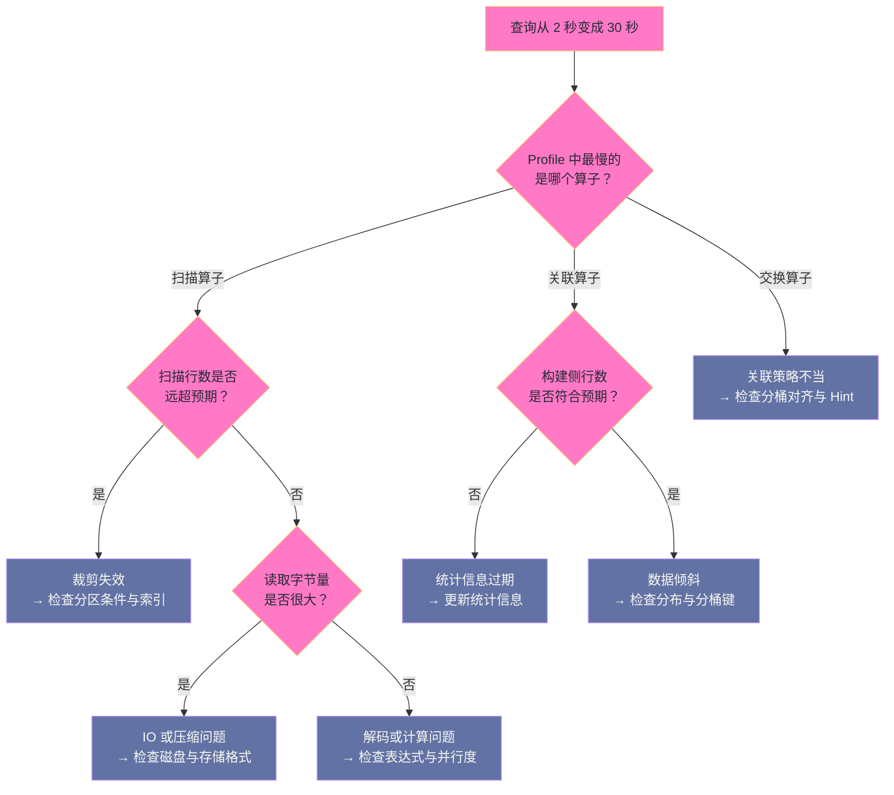

# 06 Doris 运维与调优——分区分桶设计、慢查询与扩缩容

**摘要：**

Doris 的运维可以收敛成三个问题：**建表设计是否合理**（分区与分桶）、**查询为什么慢**（诊断路径）、以及**集群变更是否安全**（扩缩容与升级）。本文按这三条线展开。第一条线讲分区与分桶的设计方法——分区决定"数据怎么被切开、怎么被淘汰"，分桶决定"数据怎么分布、查询能有多少并行度"；两者的共同特征是"事后修改代价极高"，因此设计阶段必须一次做对，尤其是分桶数按预期最大数据量计算这条纪律。第二条线给出一条从 Profile 到 audit_log 的慢查询诊断路径，并把常见慢查询归纳为三类模式（裁剪失效、关联策略不当、Compaction 积压），每类给出明确的判据。第三条线讲 BE 与 FE 的扩缩容流程、数据均衡的限速、副本修复机制，以及版本升级的顺序与回滚边界。最后是监控体系、告警分级、以及这套运维体系的边界与反例。

---

## 第 1 章 运维的三个核心问题

### 1.1 三类问题的划分

Doris 的日常运维工作，绝大多数可以归到三类问题里。

**第一类是"设计问题"**：表怎么建（分区、分桶、排序键、索引、数据模型）。它的特点是**决策一次、影响长期**，且事后修改代价高。

**第二类是"诊断问题"**：某条查询为什么慢、某个导入为什么失败、某个指标为什么异常。它的特点是**需要按路径排查**，而不是凭直觉调参。

**第三类是"变更问题"**：扩缩容、版本升级、参数调整、Schema 变更。它的特点是**影响面大、需要协调**，因此必须有流程与回滚预案。

### 1.2 为什么这三类问题值得分开

把三类问题分开的意义在于：**它们的处置逻辑完全不同。**

设计问题的正确答案是"在建表时想清楚"，而不是"出问题后补救"——因为分桶数与数据模型都是不可逆的。

诊断问题的正确答案是"按路径排查"——先定位到环节，再决定动作，而不是同时调整所有参数。

变更问题的正确答案是"流程化"——影响面评估、回滚方案、验证方式三件事缺一不可。

**混淆这三类问题的典型表现是"用调参解决设计问题"**：明明分桶数不合理，却不断调整并行度参数；明明是数据模型选错，却在查询侧反复改写 SQL。**这类尝试的共同特征是"投入越来越大、收益越来越小"，因为方向从一开始就错了。**

### 1.3 运维能力的三个层次

把运维能力分层，有助于判断团队当前处于哪一级、下一步该补什么。

**第一层：能恢复服务。** 知道节点在哪、怎么重启、怎么查看状态。这一层解决"出问题能不能快速恢复"。

**第二层：能定位根因。** 有分层监控、有诊断路径、有基线数据，能在故障时判断问题在哪一环。这一层解决"同样的问题会不会反复发生"。

**第三层：能预防问题。** 有容量趋势预测、有变更影响评估流程、有定期的巡检与演练。这一层解决"故障发生前能不能提前干预"。

三层的差距不在工具，而在**是否把运维从"被动响应"变成了"主动经营"**。Doris 的多数问题（Compaction 积压、元数据膨胀、副本异常）都是渐进式恶化而非突发崩溃，只有主动经营才能提前发现——**而渐进式问题的特征是"发现得越晚，修复成本越高"。**

### 1.4 为什么"设计问题"最贵

三类问题里，设计问题的代价最高，原因有三层。

**第一层：不可逆。** 分桶数与数据模型无法低成本修改，而诊断问题与变更问题都有明确的回退路径。

**第二层：影响面随规模放大。** 一个"分桶数偏小"的设计在数据量小时看不出问题，数据量增长后表现为"查询并行度不足"——**而此时修改的成本已经随数据量同步放大。**

**第三层：它会被误诊为其他问题。** 设计不合理往往表现为"查询慢"，于是团队沿着诊断路径去查，最终发现所有环节都正常——**因为瓶颈不在任何单条查询上，而在整体布局上。** 这类问题的特征是"单条查询优化有效但整体无改善"。

因此一条实用判断是：**如果"优化单条查询"能见效但整体性能上不去，问题多半在设计层面。** 此时应当回到建表设计重新审视分区、分桶与排序键，而不是继续在查询侧投入。

---

## 第 2 章 分区设计

### 2.1 分区的两个作用

分区在 Doris 里承担两个职责，理解它们的区别很重要。

**职责一：查询剪枝。** 查询条件落在分区列上时，可以跳过无关分区，只扫描相关分区。这是分区对**性能**的贡献。

**职责二：生命周期管理。** 数据可以按分区整体删除（TTL），而不需要逐行删除。这是分区对**运维**的贡献——它让"删除过期数据"这个高频运维动作变得极其廉价。

两个职责对分区粒度的要求方向相反：**从剪枝角度，粒度越细越好**（跳过更多数据）；**从元数据角度，粒度越粗越好**（分区数与分桶数的乘积不能太大）。因此分区粒度的选择，本质上是这两个方向的平衡。

### 2.2 分区粒度的选择

实践中的选择依据是"单分区的数据量"与"数据保留周期"。

| 单日数据量 | 建议粒度 | 理由 |
|---|---|---|
| 较小（千万行以内） | 按月分区 | 分区内数据量适中，分区总数可控 |
| 中等（千万到亿级） | 按周分区 | 平衡分区数量与分区内数据量 |
| 较大（亿级以上） | 按天分区 | 单分区数据量需要被限制 |

一个常见的错误是"为了细粒度剪枝而把分区切得过细"（例如按小时分区）。后果是分区数急剧膨胀，进而 Tablet 总数膨胀、FE 元数据压力上升、Compaction 线程分散——**而剪枝带来的收益远不足以抵消这些代价。**

### 2.3 动态分区：把生命周期管理自动化

生产中的最佳实践是启用**动态分区**：由系统自动创建未来分区、自动删除过期分区。

它解决两个具体问题。**其一，防止"未来数据无处可写"**——如果分区需要手工创建，一旦忘记，新数据就会导入失败。**其二，让数据 TTL 自动化**——过期数据由系统按配置自动删除，不需要人工干预。

配置的核心参数是"保留范围"（保留过去多久的数据）与"提前创建范围"（提前创建未来多久的分区）。两者都应当按业务的数据保留策略设定，并留出余量——**提前创建范围过小会导致跨零点时导入失败，这是最容易踩的一个坑。**

### 2.4 分区设计的常见错误

三类错误在实践中反复出现。

**错误一：分区列与查询条件不匹配。** 如果分区列是"数据写入时间"而查询条件用的是"业务发生时间"，那么剪枝就不会生效。**分区列必须与高频查询条件一致**，而不是与"数据怎么进来"一致。

**错误二：查询条件包裹了分区列。** 把分区列包在函数里（如 `YEAR(date) = 2026`）会让剪枝失效。**任何包裹在分区列上的函数都会破坏剪枝**，应当改写成范围条件。

**错误三：分区数与分桶数的乘积失控。** 这两者相乘决定 Tablet 总数，因此它们不能各自独立地"往细里调"。**设计时必须把乘积算出来，并与 FE 的内存容量对照。**

### 2.5 分区列与排序键的配合

分区列与排序键是两个层次的裁剪手段，它们的配合方式决定了索引的整体效果。

**分区列负责"粗粒度裁剪"**：跳过整个分区，代价为零（不需要读取数据）。**排序键负责"细粒度裁剪"**：在分区内跳过行块，依赖 Short Key Index 与 ZoneMap。

因此理想的设计是"**分区列也是排序键的第一列**"——这样"按时间范围查询"会先被分区裁剪掉大部分数据，剩下的再由排序键在分区内裁剪。两层裁剪叠加，效果最好。

如果两者不一致（例如分区按写入时间、排序键按业务 ID），那么查询可能只能享受其中一层裁剪。**判断是否需要调整的方法很直接：看高频查询的过滤条件，它作用在哪一列上。** 如果它作用在分区列上，那么分区裁剪生效；如果作用在排序键前缀上，那么索引裁剪生效；**如果它既不作用于分区列、也不在排序键前缀上，那么这条查询就只能靠全分区扫描加块级过滤。**

### 2.6 分区与冷热数据分层

分区还有一个常被低估的用途：**它是数据分层的天然边界。**

分析场景里，数据的访问热度极不均匀——最近几天或几周的数据被高频查询，更早的数据只在偶尔的历史对比中被访问。这种分布意味着"**用同一套存储与计算资源承载全部数据是浪费的**"。

分区提供了分层的抓手：**近期分区可以被更高频地缓存、更快地查询；历史分区可以被压缩得更狠、甚至可以下沉到更便宜的存储上。** 因为分区是独立的数据范围，系统可以按分区做差异化的处理。

这个思路的实践要点是"**先明确冷热分界**"——通常按时间确定（如"近 30 天为热数据"），并且这个分界应当与业务的查询模式对齐。如果业务经常查询半年前的数据，那么"近 30 天为热"这个假设就不成立。**冷热分界定错，会让分层策略反而增加复杂度而没有收益。**

---

## 第 3 章 分桶设计

### 3.1 分桶键的选择

分桶键决定了数据在 BE 之间的分布，因此它同时影响两件事：**查询的并行度**（数据分散得越均匀，并行度越高）与**关联的效率**（分桶键与关联键一致时可以省掉网络搬运）。

选择原则有三条：**优先选高频出现在关联条件中的列**（以获得 Bucket Shuffle 或 Colocate 的可能）；**必须选基数足够高且分布均匀的列**（否则会产生倾斜）；**应当选高频出现在过滤条件中的列**（让分桶同时服务于过滤）。

三条原则冲突时的优先级是：**关联需求优先于过滤需求**。因为关联效率的差距可能是数倍的网络传输量，而过滤的效率还可以用索引弥补。

### 3.2 分桶数的计算

分桶数的基本公式是"分区预期数据量除以单 Tablet 目标大小"，实际取值通常会规整到便于分配的整数。

有两条纪律必须遵守。**纪律一：按预期最大数据量计算，而不是当前数据量。** 因为分桶数事后不可直接修改。**纪律二：算出的结果要与分区数相乘，检查 Tablet 总数是否超出 FE 的承载能力。**

还有一个容易忽略的检查项：**单 Tablet 不能过小。** 如果分桶数算得过大，单 Tablet 只有几十 MB，那么每个 Tablet 的文件数虽少但总数多，打开文件的固定开销占比上升。**"分桶数越多并行度越高"是一个常见的误判——它只在"单 Tablet 仍有一定规模"的前提下成立。**

### 3.3 不可变性带来的设计纪律

分桶数不可直接修改这个性质，需要被反复强调，因为它带来两个后果。

**后果一：设计错误无法低成本修正。** 修改分桶需要重建表并重新导入全部数据，这在数据量大时意味着长时间的双写与切换。

**后果二：数据增长会逐渐侵蚀设计余量。** 即使当初算得合理，数据量增长后单 Tablet 也会变大。因此设计时应当留出增长余量，而不是"刚好够用"。

**这两条后果共同指向一个实践建议：把分桶设计当作"容量规划的一部分"来做**，即先预测未来一到两年的数据规模，再据此定分桶数。**把它当作"建表时顺手填的一个参数"，是这类问题最主要的成因。**

### 3.4 Colocate 的规划

Colocate JOIN 能消除关联时的网络传输，但它的前提是"两表的分桶键、分桶数完全对齐"。因此它必须在**数据建模阶段统一规划**，而不能事后追加。

规划的步骤是：**先识别出"会被频繁关联的表对"**（通常来自高频查询的分析）；**再为这些表对确定统一的分桶键**（取它们共同的关联键）；**最后统一分桶数**（取两者数据量对应的较大值）。

规划时要评估一个风险：**Colocate 把多张表绑定在一起，因此任何一张表的分桶变更都会牵动其他表。** 如果表对之间的关联关系可能变化（例如未来会与第三张表关联），那么过度使用 Colocate 会让后续的建模自由度下降。**因此 Colocate 应当用于"关联关系稳定的核心表对"，而不是"所有可能关联的表"。**

### 3.5 分桶与查询并行度的关系

分桶与并行度的关系值得单独梳理，因为它容易被简化成"分桶越多越快"。

**扫描并行度受 Tablet 数约束**：一个 Tablet 只能由一个 BE 扫描，因此某张表在某一时刻最多有"涉及的分区数 × 分桶数"个扫描单元。**如果这个数量少于 BE 数，就会有 BE 闲置。**

**但并行度不是越高越好。** 分桶数增加会带来三处成本：**Tablet 总数增加**（FE 元数据压力）、**单 Tablet 变小**（文件打开与索引读取的固定开销占比上升）、**小文件增多**（Compaction 的合并单元变小、效率下降）。

因此正确的判断方式不是"分桶数够不够多"，而是"**在单 Tablet 仍保持合理规模的前提下，分桶数是否足以让所有 BE 参与**"。这个判断需要同时知道集群的 BE 数与数据的规模——**这也是为什么分桶数不能照搬别人的配置：它取决于你自己的集群规模。**

---

## 第 4 章 慢查询诊断

### 4.1 Profile：从"哪一环慢"开始

诊断的起点是找到"耗时占比最高的算子"。查询执行后生成的 Profile 会按算子树展示每个节点的实际耗时、读取行数、输出行数与内存占用。

**读 Profile 的正确顺序是"先看最慢的节点，再看它的数据量是否符合预期"。** 两个问题分别对应两类根因：**如果数据量符合预期但耗时很长**，问题在算子实现或资源竞争；**如果数据量远超预期**，问题在裁剪（分区剪枝、索引、条件下推）或统计信息。

这个顺序的价值在于避免"一上来就看 SQL"。**SQL 写得再漂亮，如果裁剪没生效，性能也不会好**；反之，一条朴素的 SQL 如果裁剪充分，往往表现优异。

### 4.2 audit_log 与慢查询日志

除了单次查询的 Profile，还需要一个"历史视角"来发现系统性问题。

慢查询日志（或审计日志）记录所有查询的执行信息：用户、库表、耗时、扫描行数、扫描字节数、以及原始语句。它回答的问题是"**哪些查询在长期拖慢系统**"——这是单次 Profile 无法回答的。

使用它的方法通常是"按耗时排序取前若干条，观察它们的共同特征"：是否都访问同一张大表、是否都缺少分区条件、是否都做了全表关联。**发现共同特征，就能从"优化单条查询"升级为"修复一类问题"。**

### 4.3 三类慢查询模式

把常见慢查询归纳成三类，每类有明确的判据与对策。

**模式一：裁剪失效。** 判据是 Profile 中扫描行数远超预期。常见原因包括：分区列被函数包裹、隐式类型转换导致条件无法下推、过滤列不在排序键前缀且没有索引。**对策是改写 SQL 或补充索引。**

**模式二：关联策略不当。** 判据是 Profile 中交换（Exchange）阶段的数据量远大于必要。常见原因是关联两侧的数据量估算错误（统计信息问题）或分桶设计未对齐（无法使用更省网络的关联方式）。**对策是更新统计信息或调整分桶设计。**

**模式三：Compaction 积压。** 判据是扫描算子的耗时中包含了大量"合并多个 Rowset"的开销，且该表的待合并 Rowset 数量异常。**对策是从源头降低写入频率或提升合并能力**（细节见第 2 篇）。

三类模式的判据各不相同，但它们的共同点是"**都能从 Profile 中读出明确证据**"。这提示了一条诊断纪律：**不要在没有证据的情况下调整参数**——因为调整的收益无法验证，而副作用会立刻产生。

### 4.4 诊断的优先级

把诊断动作按"收益/成本比"排序，得到一条实用顺序。

1. **确认 SQL 写法没有破坏裁剪**（零成本，收益可能极大）。
2. **确认统计信息是最新的**（低成本，收益大）。
3. **确认执行计划里的关联策略与数据量估算合理**（低成本，收益中等）。
4. **确认表的 Compaction 状态健康**（低成本，收益可能大）。
5. **调整并行度与资源参数**（成本低，但收益不确定）。
6. **考虑数据建模层面的调整**（成本高，收益可能很大）。

**前四步都是"确认"而不是"调整"**，这是刻意的——**多数慢查询的根因是"某个前提被破坏"，而不是"参数不够激进"。** 把确认放在调整之前，可以避免大量无效调参。

### 4.5 一次慢查询诊断的完整推演

把诊断路径串成一个完整案例，比罗列判据更容易记住。

这个推演的价值在于展示"**每一步都在缩小范围**"。假设最终的判据是"扫描行数远超预期"，那么问题就锁定在裁剪上，接下来只需检查三件事：分区条件是否被函数包裹、过滤列是否在排序键前缀或索引覆盖范围内、以及类型是否匹配。**三件事都是"确认"，不需要试错。**

需要特别指出一种容易误判的情形：**如果 Profile 显示各项都正常但耗时仍长，那么瓶颈可能在"资源竞争"上**——即查询本身没有问题，只是它执行时恰好与导入、Compaction 或均衡任务争抢资源。**此时正确的动作是"错峰"或"限速其他任务"，而不是优化这条查询。** 这个判断只能通过对比"不同时段执行同一查询"的耗时来确认。

### 4.6 慢查询治理的组织面

慢查询治理不只是技术工作，它还有一面是"组织"的。

**第一，慢查询的判据需要被统一。** "多慢算慢"在不同团队的理解不同：业务方按体验判断，平台方按分位数判断。没有统一判据，就会出现"业务方认为慢、平台方认为正常"的扯皮。**统一判据的方法是把 SLO 显式化**（例如"P95 查询在 X 秒内完成"），并以此作为治理的靶子。

**第二，慢查询的责任需要被划分。** 有些慢查询的根因在 SQL 写法（业务侧可改），有些在建表设计（平台侧可改），有些在数据模型（需双方协商）。**不划分责任，治理就会退化为"互相要求对方改"。**

**第三，治理的收益需要被度量。** 如果治理动作没有对应的指标改善，就无法判断投入是否值得。**可度量的方式是把"慢查询数量"与"P95 延迟"作为治理前后的对照指标。**

这三点听起来像管理问题而非技术问题，但实践中**它们往往比技术手段更决定治理的成效**——因为技术手段是有限的、已知的，而"谁来做、按什么标准做、如何验收"才是决定这些事情是否真正落地的因素。

---

## 第 5 章 扩缩容

### 5.1 BE 扩容与数据均衡

扩容 BE 的流程是：在新节点上部署并启动 BE；在 FE 上注册新节点；随后系统自动开始数据均衡（把已有 Tablet 的副本迁移到新节点）。

**数据均衡是自动的，但可能持续较长时间**，且它占用网络带宽与磁盘 IO。因此有三个要点。

**要点一：均衡必须限速。** 大规模均衡会与查询争抢资源。应当通过参数限制迁移速率，把均衡的影响控制在可接受范围。

**要点二：均衡进度需要可观测。** 需要能回答"还剩多少待迁移的副本"这个问题，否则无法判断均衡是否卡住。

**要点三：扩容不是"立刻提速"。** 在新节点完成数据均衡之前，它承担不了多少查询负载。**因此扩容的效果有延迟**——这一点在"查询压力突增"时尤其重要：扩容无法立刻解决问题，紧急情况下应当先限流或降低查询并发。

### 5.2 BE 缩容与安全下线

缩容（下线节点）比扩容危险得多，因为它涉及"数据是否有其他副本"这个正确性问题。

正确的流程是：**先把节点标记为"下线中"**（触发副本迁移），**等待其上的副本全部迁移完成**，**确认无剩余数据后再物理移除**。

这里有一条绝对不能跳过的纪律：**不要直接强制删除节点。** 强制删除不等待数据迁移，如果该节点上有某些副本的唯一副本，会导致数据永久丢失。**"确认副本充足"这个前提在紧急操作时最容易被忽略，而它一旦出错就不可恢复。**

### 5.3 FE 扩缩容

FE 的扩缩容相对简单，但有两点需要理解。

**新增 Follower 或 Observer 时会同步全量元数据**（通过检查点加增量日志），这个过程可能耗时较长，且在同步期间新节点无法服务。

**扩容 FE 只扩展读能力，不扩展元数据写入能力。** 因此当瓶颈是"元数据写入"（导入提交、DDL）时，加 FE 是无效的。**判断瓶颈在哪一侧，是 FE 扩容决策的前提。**

### 5.4 变更的限速与窗口

所有集群变更（扩缩容、版本升级、Schema 变更、大批量导入）都会消耗同一批资源，因此它们需要统一排期。

排期的三条原则：**避开业务高峰**；**同类操作不要并发**（例如同时扩容与大批量导入会互相加剧）；**每次只做一类变更**（便于归因）。

**"每次只做一类变更"这条原则的价值在故障时体现得最明显**：如果同时做了三件事然后系统异常，就无法判断是哪一件引起的。**在运维里，"能归因"比"能快速"更重要。**

### 5.5 扩容的容量规划

扩容不是"数据满了就加机器"，它需要先判断"哪一类资源先耗尽"。

**如果磁盘先耗尽**，扩容是必要的，但要注意"扩容同时增加了磁盘与计算"，因此对计算资源过剩而磁盘紧张的集群，扩容并不经济——这类情况更适合先做数据治理（清理过期数据、提高压缩率）。

**如果计算资源（CPU 或 IO）先耗尽**，扩容同样有效，但应当先确认瓶颈确实在计算侧而非查询写法侧。**一个常见的误判是"查询慢就加机器"，而实际瓶颈是裁剪失效**——此时加机器只会让所有机器都做无效扫描。

**如果元数据规模先到上限**（FE 内存不足），扩容 BE 无效，因为瓶颈在 FE 侧。此时的动作是**调整分区粒度或降低分桶数**（需要重建表），或者扩容 FE 的内存。

**判断顺序应当是"先确认哪一类资源接近上限，再决定加什么"**——这与第 1.3 节讲的"分层定位"是同一个思路：**先定位，再动作。**

### 5.6 缩容的反向约束

缩容比扩容更需要谨慎，因为它引入了一个扩容时不存在的约束：**副本是否充足。**

扩容时数据只会变多副本，不存在丢失风险；缩容时每下线一个节点，就意味着"该节点上的副本必须能在别处找到"。因此缩容的正确姿势是"**先确认副本充足，再开始迁移**"，而不是"先下线再看情况"。

三条具体纪律如下。**纪律一：缩容前确认所有 Tablet 的可用副本数都在安全线以上。** 如果存在可用副本数过低的 Tablet，必须先修复再缩容。**纪律二：缩容期间不并发执行其他高负载任务**（如大批量导入），因为迁移本身已经占用大量资源。**纪律三：缩容必须等待迁移完成**，不能因为"看起来快了"就提前物理移除节点。

**缩容的风险等级高于扩容，因此它应当被视为"高风险变更"**——需要影响面评估、回滚方案（如果迁移卡住能否取消）、以及验证方式（迁移完成后核对副本状态）。

---

## 第 6 章 监控体系

### 6.1 FE 监控

FE 侧需要关注的指标可以分成三组。

**资源组**：JVM 堆内存使用率、GC 时间、线程数。FE 的元数据常驻内存，因此堆内存是最关键的资源。

**负载组**：查询 QPS、查询延迟分位数、元数据事务速率、连接数。

**状态组**：Leader 是否发生切换、元数据对象数量（表、分区、Tablet）、以及是否有异常的悬空事务。

**其中"元数据对象数量"这一项最容易被忽略。** 它直接反映 FE 内存压力的来源——如果这个数字在持续增长而业务量没变，说明有分区或 Tablet 在异常累积（例如动态分区配置不当导致分区数膨胀）。

### 6.2 BE 监控

BE 侧的指标同样分三组。

**资源组**：磁盘使用率与 IO 饱和度、CPU 使用率、内存使用率。

**负载组**：查询扫描行数与字节数、导入速率、Compaction 速率与待合并量。

**状态组**：Tablet 与副本数量、副本的健康状态（是否有缺失或异常副本）、以及节点是否被标记为下线中。

**"磁盘使用率"这一项需要特别说明**：它不只是容量问题，还是性能问题——磁盘接近写满时，写入性能会显著下降（因为可用空间碎片化）。因此磁盘告警阈值应当留出充足余量，而不是等到 95% 才告警。

### 6.3 告警分级

告警应当按"是否影响业务"分级，而不是按"指标是否超标"分级。

| 级别 | 典型条件 | 处置 |
|---|---|---|
| 提示 | 磁盘使用率缓升、缓存命中率下降 | 记录趋势，不打断值班 |
| 警告 | 查询延迟分位数上升、导入延迟上升、待合并量增长 | 值班介入排查 |
| 严重 | 有 BE 不可用、副本异常、FE 无 Leader、查询失败率上升 | 立即介入 |

一个常见的设计错误是"把所有指标都设为严重"，结果是告警疲劳——**当值班人员对告警麻木时，真正的严重告警也会被忽略。** 因此"资源水位类"指标应当设为提示或警告（它们是趋势指标），只有"业务受影响类"指标才设为严重。

### 6.4 仪表盘设计

仪表盘应当服务于"快速定位"，因此建议按三个视图组织。

**视图一：业务健康。** 只放查询延迟分位数、查询失败率、导入成功率。它回答"现在业务是否正常"。

**视图二：分层定位。** 把 FE 与 BE 的关键指标并列，并在 BE 侧突出"磁盘 IO 饱和度"与"Compaction 待合并量"。它回答"如果不正常，问题在哪一层"。

**视图三：容量与趋势。** 磁盘增长趋势、元数据对象数量趋势、待合并量趋势。它回答"还能撑多久、什么时候该扩容"。

**三个视图的共同设计原则是"每个视图回答一个问题"**，而不是"把所有指标堆在一起"。后者看起来信息齐全，实际使用时却需要人脑做筛选——**在故障压力下，人脑的筛选能力是最先失效的。**

### 6.5 监控的两个误区

**误区一：只监控组件，不监控业务感知。** 组件指标（CPU、内存、磁盘）反映"资源是否紧张"，业务指标（查询延迟分位数、失败率、导入成功率）反映"用户是否受影响"。两者不可互相替代——**资源紧张但业务正常是常态，资源宽松但业务异常同样会发生**（例如瓶颈在元数据链路或网络）。

**误区二：告警阈值从别处照搬。** 不同环境的合理阈值差异极大（集群规模、磁盘型号、数据分布都会影响）。阈值应当从本环境的基线推导——**用别人的阈值告警自己的集群，结果通常是"该响的不响、不该响的天天响"。**

两个误区的共同根源是"**把监控当成指标的堆砌，而不是判断依据的建设**"。监控的最终目的是"让值班人员在五分钟内定位到问题在哪一环"，因此它的设计应当从"排查路径"反推，而不是从"有哪些指标可用"正推。

### 6.6 巡检清单

把日常巡检项列成清单，可以让巡检不依赖个人记忆。

| 巡检项 | 检查内容 | 不正常的表现 |
|---|---|---|
| FE 元数据规模 | 表/分区/Tablet 数量趋势 | 持续增长而业务量未变 |
| FE 堆内存 | 使用率与 GC 时间 | 使用率持续高于阈值 |
| BE 磁盘 | 使用率与 IO 饱和度 | 使用率高，或 IO 长期饱和 |
| Compaction | 待合并量与增长趋势 | 持续单向增长 |
| 副本状态 | 异常副本数与低可用副本 Tablet | 数量增长或存在低可用副本 |
| 导入健康度 | 导入成功率与延迟 | 成功率下降或延迟上升 |
| 查询健康度 | P95/P99 延迟与失败率 | 延迟抬升或失败率上升 |
| 变更任务 | 均衡与修复任务的进度 | 长期无进展 |

**这份清单的价值在于"每一项都有明确的判据"**，而不是"看一眼觉得还行"。巡检最容易退化为"形式化动作"——而形式化的巡检与不巡检的差别很小。**给每一项配上可量化的判据，是让巡检保持有效的前提。**

---

## 第 7 章 副本管理与数据修复

### 7.1 副本状态

每个 Tablet 的副本有若干状态，理解它们有助于判断"是否需要干预"。

**正常**：副本数据完整、可服务查询。

**版本落后**：副本的数据版本落后于最新版本（通常是同步延迟），系统会自行追赶。

**缺失或损坏**：副本不可用或数据校验失败，需要从其他副本重建。

**需要关注的是最后一类**，因为它意味着"该 Tablet 的可用副本数减少"。如果某个 Tablet 的可用副本数降到 1，它就处于高风险状态——**任何一次节点故障都会导致该 Tablet 不可用。**

### 7.2 副本修复机制

Doris 的副本修复是**自动的**：FE 检测到副本异常后，会调度在健康的 BE 上重建副本。

这个自动化带来两个实用性质。**其一，运维人员不需要手工编排副本位置**，只需要保证"集群里有足够的健康节点可供调度"。**其二，副本修复会消耗资源**（复制数据），因此大量副本同时修复会与查询争抢带宽——**这与数据均衡是同一类负载，需要同样限速。**

### 7.3 数据均衡的触发与影响

数据均衡在三种情况下被触发：**节点扩容**（把数据分散到新节点）、**节点故障后恢复**（把副本重新分布）、以及**长期运行后的负载不均**（系统主动调整）。

均衡的影响面是"集群范围内的资源占用"。因此它的运维要点与扩容一致：**限速、可观测、避开高峰。**

有一条容易被忽略的细节：**均衡与 Compaction 会叠加。** 均衡要搬运数据（读加写），Compaction 也要读写数据，两者同时进行会把磁盘 IO 推向饱和。**因此在大规模均衡期间，应当考虑适当降低 Compaction 的速率或导入频率。**

### 7.4 副本巡检项

副本的健康度需要定期巡检，而不是等故障时才看。建议的巡检项有四项。

**第一项：副本异常的数量与趋势。** 少量异常副本是正常的（节点重启、磁盘瞬时错误都会产生），但**数量持续增长说明有系统性问题**（如某批节点磁盘老化）。

**第二项：是否存在"可用副本数过低"的 Tablet。** 这是最高风险的信号——可用副本数为 1 的 Tablet 经不起任何一次节点故障。这类 Tablet 应当被优先修复。

**第三项：副本修复与均衡任务的进度。** 如果修复任务长期没有进展，说明可能存在"没有足够的健康节点可供调度"，需要先扩容。

**第四项：是否存在被标记为下线中但长期未完成的节点。** 这类节点会持续占用均衡资源，需要确认是数据量太大（正常）还是迁移卡住（异常）。

**四项巡检的共同特征是"都是趋势性指标"**——单次快照看不出问题，只有连续观察才能发现异常。**因此它们应当被纳入常规巡检，而不是"出事时查一下"。**

---

## 第 8 章 版本升级与回滚

### 8.1 升级顺序

Doris 的版本升级通常按"先 BE、后 FE"的顺序进行。

**先升级 BE（数据面）**：BE 之间互相独立，可以逐节点滚动升级，每次升级后观察该节点上的查询与导入是否正常。

**再升级 FE（控制面）**：FE 涉及元数据一致性，升级时需要注意 Leader 与 Follower 的升级顺序，以及升级期间的元数据可用性。

**这个顺序的理由是"先让数据面就绪，再让控制面使用新能力"**——如果反过来，新版本 FE 可能依赖新版本 BE 的能力，导致升级期间功能异常。

### 8.2 兼容性与元数据升级

版本升级中最需要谨慎的是**元数据格式的兼容性**。

元数据在升级时可能需要转换（新版本引入新的元数据字段或结构）。这个转换通常是**单向的**——升级后无法直接降级回旧版本（除非使用升级前备份的元数据快照）。因此**升级前的元数据备份是硬性要求**，而不是可选项。

**"升级前备份元数据"这条纪律与第 1 篇讲 JuiceFS 时提到的"元数据备份优先于数据备份"是同一个逻辑**：元数据是唯一的、不可重建的；而数据（Tablet 内容）通常有多个副本，且可以从上游重新导入。**因此升级前的备份重点在元数据。**

### 8.3 回滚的边界

回滚的可行性取决于"升级改变了什么"。

**如果只升级了程序版本而元数据格式未变**，回滚通常是可行的（把程序换回旧版本即可）。

**如果元数据格式已转换**，回滚需要恢复升级前的元数据快照，而这意味着"升级后写入的数据会丢失"。因此这类回滚必须评估数据损失。

**因此升级决策的关键问题是"能否接受回滚时的数据损失"。** 如果答案是"不能"，那么升级就必须在业务低峰期进行，并准备好"不回滚而是向前修复"的预案。**"必须有回滚方案"与"回滚方案必须可用"是两件事**——后者要求方案经过验证，而不是纸面上的。

### 8.4 升级前的检查清单

把升级前的准备工作列成清单，可以避免遗漏。

**检查一：元数据备份已完成且可恢复。** 不只要"备份了"，还要"验证过能恢复"——**没验证过的备份不算备份。**

**检查二：集群当前状态健康。** 如果有大量待合并 Rowset、有未修复的异常副本、或正在做数据均衡，应当先让集群回到稳态再升级。**在亚健康状态下升级，会把两类问题混在一起，难以归因。**

**检查三：升级路径与版本兼容性已确认。** 跨大版本升级通常有推荐路径（例如需要经过中间版本），直接跨版本可能不被支持。

**检查四：业务侧已知晓维护窗口。** 升级期间可能出现短暂的写入或查询异常，业务侧需要提前准备重试逻辑或降级方案。

**检查五：升级后的验证项已明确。** 包括查询能否正常执行、导入能否正常提交、以及关键指标是否回到基线水平。**没有明确验证项的升级，等于"升级完就不管了"。**

这五项检查的共同特征是"**它们都不是技术操作，而是准备工作**"。升级失败的案例里，多数不是因为技术操作出错，而是因为准备工作缺失——**这也印证了第 10 章要讲的那条判断：变更的风险不在于"做错了"，而在于"做得没准备"。**

---

## 第 9 章 边界与反例

### 9.1 反例一：用调参解决设计问题

分桶数不合理、数据模型选错、分区列与查询条件不匹配——这些是设计问题，无法通过调整参数解决。**投入越来越大、收益越来越小，是"用调参解决设计问题"的典型信号。**

### 9.2 反例二：分区切得过细

为了细粒度剪枝而按小时分区，会导致分区数与 Tablet 总数膨胀、FE 元数据压力上升、Compaction 线程分散。**剪枝的收益远不足以抵消这些代价。**

### 9.3 反例三：强制删除 BE 节点

不等待数据迁移就强制删除节点，可能导致唯一副本丢失。**这是"不可恢复"的一类错误**，因此在任何紧急操作中都应当先确认副本充足。

### 9.4 反例四：忽略"扩容不能立刻提速"

扩容后需要等待数据均衡完成，新节点才能真正承担负载。在查询压力突增时，扩容不是立即生效的手段——**紧急情况下应当先限流。**

### 9.5 反例五：升级前不备份元数据

元数据格式升级通常是单向的，没有备份就无法回滚。**把"升级前备份元数据"当作可选项，是把整个集群置于不可恢复的风险中。**

### 9.6 反例六：同时执行多类变更

同时扩容、升级与大批量导入，会在出现异常时无法归因。**"每次只做一类变更"是运维的基本纪律。**

### 9.7 反例七：只监控资源水位，不监控业务指标

磁盘使用率、CPU、内存这些指标反映的是"资源是否紧张"，而查询延迟与失败率反映的是"用户是否受影响"。**两者不可互相替代**——资源紧张但业务正常是常态，资源宽松但业务异常同样会发生（瓶颈在链路而非资源）。

### 9.8 反例八：把慢查询日志当成"事后工具"

慢查询日志的价值在于"发现一类问题"，而不是"排查某次故障"。如果只在出故障时才去看它，就浪费了它"提前发现系统性问题"的能力。**定期分析慢查询日志，应当成为常态化的巡检项。**

### 9.9 反例九：把"扩容"当成解决性能问题的第一手段

扩容解决的是"资源不足"，不解决"使用效率低"。如果查询慢的原因是裁剪失效（读了很多不必要的数据），那么扩容只会让更多机器一起做无效工作。**判断"该不该扩容"的前提是确认瓶颈在资源侧，而不是效率侧。**

### 9.10 反例十：在亚健康状态下执行变更

如果集群本身已经存在待合并积压、异常副本或正在均衡，此时执行升级或缩容会把两类问题混在一起，导致异常难以归因。**变更前先让集群回到稳态，是变更管理的基本前提。**

---

## 第 10 章 落点

把三条线合起来看，Doris 的运维可以概括为一句判断：**"设计决定上限，诊断决定恢复速度，变更决定长期稳定性。"**

**设计决定上限**，因为分区、分桶、数据模型这些决策一旦定下就很难更改，它们决定了这套系统能承载多大的数据量与查询压力。**诊断决定恢复速度**，因为多数性能问题都有明确的证据链，按路径排查比凭直觉调参快得多。**变更决定长期稳定性**，因为扩缩容、升级、Schema 变更这些操作的风险不在于"做错了"，而在于"做得没准备"。

再往前推一层，这三条线背后是同一个认知：**Doris 的运维对象不是"一套软件"，而是"一份数据布局 + 一条查询链路 + 一组变更流程"。** 软件本身是稳定的（版本不变时行为一致），而变化的是数据布局（数据在增长）、查询链路（业务在变化）、以及变更流程（集群在演进）。**因此运维的核心能力不是"熟悉参数"，而是"理解数据布局与查询模式之间的匹配关系"。**

这也是为什么本专栏从架构讲起、经过存储与查询、再到数据模型与导入、最后落到运维——**因为运维的所有判断依据，都来自前几篇建立的模型。** 理解了 Rowset 与 Compaction 的关系，就能理解"为什么要攒批"；理解了 Tablet 与并行度的关系，就能理解"为什么分桶数重要"；理解了优化器与统计信息的关系，就能理解"为什么查询会突然变慢"。**运维不是一套独立的知识，而是这些模型的实践投射。**

再补一层更抽象的认知：**Doris 的运维难度，本质上来自"它是一个写入代价高、读取代价低的系统"。** 这个取向让它在分析场景里表现出色，同时把压力集中到了"写入侧的管理"上——攒批纪律、Compaction 监控、导入限速，全都是为了不让写入侧拖垮读取侧。**理解了这条主线，运维就不再是"记住一堆参数和命令"，而是"判断当前写入压力与集群消化能力之间的差距"。**

这也解释了为什么本专栏反复出现同一个建议："降低导入频率、增大单批数据量"。它不是一条孤立的经验，而是这个存储模型对写入方提出的核心要求——**而运维的大部分工作，就是把这条要求翻译成业务方能接受、能执行的接入规范。**

把这六篇的落点串起来，可以看到一条完整的主线：**架构决定了"规划与执行分离"这个前提**；**存储引擎决定了"追加写 + 持续合并"这个写入模型**；**查询引擎决定了"以代价优化为核心、以向量化为加速手段"的计算模型**；**数据模型决定了写入与查询的语义契约**；**导入方式决定了数据进入系统的节奏与可靠性边界**；**而运维则是在长期尺度上维持这五层协同不失效。** 任何一层的理解缺失，都会在某一类具体问题上表现出来——这也正是本专栏按这个顺序展开的原因。读完之后，再看任何一条 Doris 的告警或慢查询，都能把它归到某一层上，从而知道该往哪个方向查。

---

## 专栏导航

- 上一篇：[[05 Doris 实时数据导入——Stream Load、Routine Load 与 Flink Connector]]。
- 全局架构：[[01 Doris 全局架构——FE BE 分离与 MPP 执行]]。
- 存储引擎：[[02 Doris 存储引擎——Tablet、Rowset 与 Compaction]]。
- 查询引擎：[[03 Doris 查询引擎——向量化执行与 Pipeline]]。
- 数据模型：[[04 Doris 数据模型——Duplicate、Aggregate 与 Unique]]。
- 返回专栏首页：[[00 专栏导览]]。

---

## 参考资料

1. Apache Doris. 官方文档：分区分桶设计与动态分区. https://doris.apache.org/zh-CN/docs/table/table-design
2. Apache Doris. 官方文档：Colocate Join 与分桶对齐规划. https://doris.apache.org/zh-CN/docs/query/join-optimization/colocation-join
3. Apache Doris. 官方文档：集群扩缩容与副本管理. https://doris.apache.org/zh-CN/docs/admin-manual/cluster-management/expand-and-shrink
4. Apache Doris. 官方文档：监控指标与告警配置. https://doris.apache.org/zh-CN/docs/admin-manual/maint-monitor/monitor-metrics
5. Apache Doris. 官方文档：版本升级与元数据兼容性说明. https://doris.apache.org/zh-CN/docs/admin-manual/cluster-management/upgrade
6. Apache Doris. 官方文档：Query Profile 与慢查询日志分析. https://doris.apache.org/zh-CN/docs/query/query-profile
7. Beyer B, Jones C, Petoff J, Murphy N R. Site Reliability Engineering. O'Reilly, 2016.
8. Dean J, Barroso L A. The Tail at Scale. Communications of the ACM, 2013.

---

> [!note] 思考题
> 1. 分区粒度的选择在"剪枝效果"与"元数据规模"之间取平衡。你会用什么量化的标准来定这个粒度？
> 2. 分桶数不可直接修改，因此必须按预期最大数据量计算。这个纪律对"建表流程"提出了什么要求？
> 3. Colocate JOIN 把多张表绑定在一起。这个绑定关系会给后续的建模自由度带来什么限制？
> 4. 三类慢查询模式的判据各不相同。你会如何把它们写进值班手册，让排查不依赖个人经验？
> 5. 为什么"升级前备份元数据"比"备份数据"更关键？这个判断的依据是什么？
