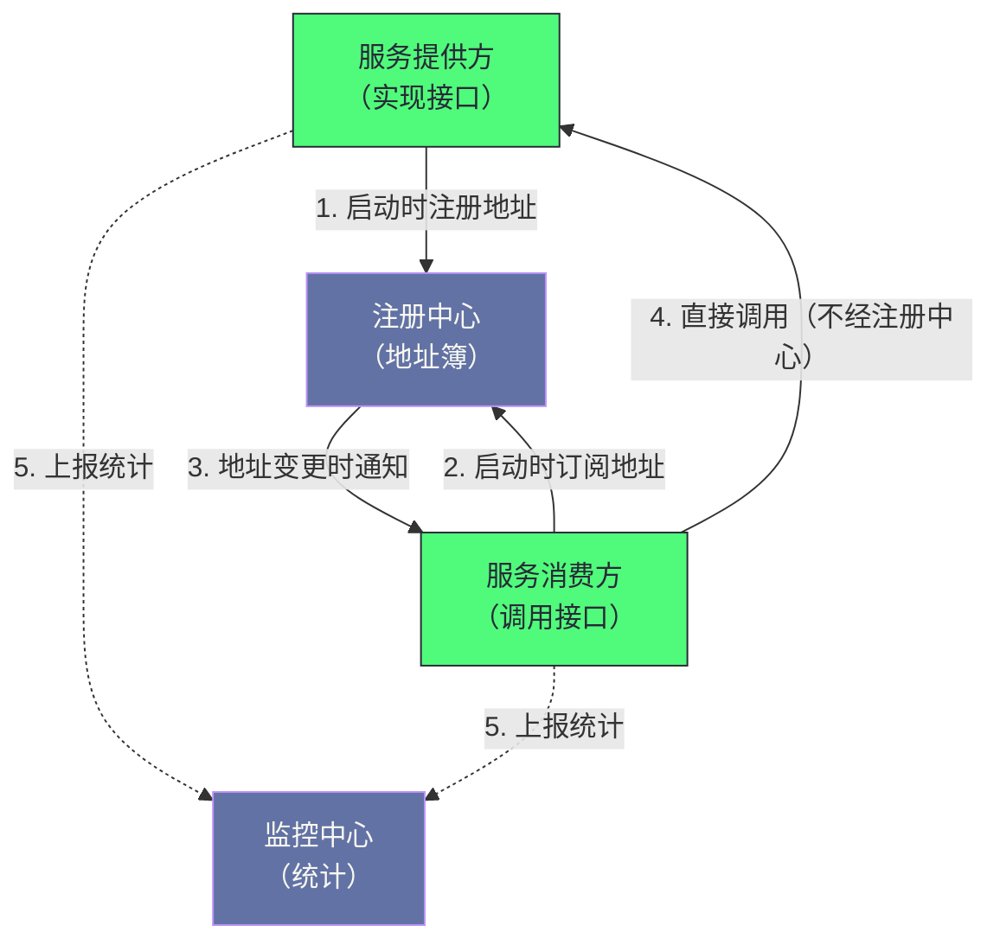
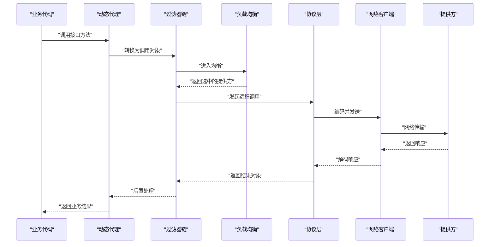

# 01 Dubbo 全局架构——服务注册、发现与调用链路

**摘要：**

Dubbo 要解决的问题是"**让远程调用看起来像本地调用**"——而"看起来像"这四个字背后，是五类复杂性：**网络通信、服务发现、负载均衡、容错处理、监控治理。** 它的架构用三个决定回应了这些复杂性：**"注册中心只做服务发现、不转发流量"**（因此"调用是点对点的"）、**"十层分层、每层通过扩展机制可替换"**（因此"每个组件都可以换"）、**"用统一的调用抽象贯穿所有层次"**（因此"过滤器、路由、负载均衡可以自由组合"）。本文按"为什么需要框架 → 四个角色 → 十层架构 → 贯穿全层的抽象 → 导出与引用 → 调用链路 → 扩展机制 → 统一数据载体"展开。先说明远程调用引入的五类复杂性与框架的价值边界；再讲四个角色的分工、全景图与"注册中心不在调用链路上"这处设计的好处与代价。然后拆解十层的划分依据与分层本身的代价、贯穿全层的核心抽象在各层的含义、服务导出与引用的完整流程。之后是调用链路的六步与每环职责、扩展机制的三大增强特性与它的地位、统一数据载体的作用与性能争议。最后是边界反例与落点。

---

## 第 1 章 为什么需要 RPC 框架

### 1.1 从本地调用到远程调用

**在单体应用里，模块间的交互是"方法调用"**——**它的开销"可以忽略"，因为"参数与返回值都在同一块内存里传递"。**

**而当模块被拆成独立进程后，"方法调用"变成了"远程调用"**——**而这一步跨越了"内存边界"与"网络边界"。**

**跨越这两条边界的后果是"原本免费的东西开始收费"**：**"参数传递"从"传引用"变成"序列化加传输"**，**"调用失败"从"抛异常"变成"可能超时、可能丢包、可能对端已死"**，**"找到目标"从"编译期确定"变成"运行期查地址"。**

**因此"远程调用"不是"本地调用加网络"，而是"一类新的问题"**——**而框架的价值就在于"把这批新问题统一处理掉"。**

### 1.2 远程调用引入的五类复杂性

**这五类复杂性可以按"它们出现在调用链的哪一环"来划分。**

**第一类是"通信"**：**选什么协议、如何序列化、连接如何复用与管理。** **它出现在"传输"这一环。**

**第二类是"发现"**：**消费方如何知道"提供方现在在哪"**，**以及"提供方扩缩容时如何通知"。** **它出现在"调用之前"。**

**第三类是"负载均衡"**：**有多个提供方时"如何分配请求"。** **它出现在"选定目标"这一环。**

**第四类是"容错"**：**超时、宕机、返回错误时"如何处置"。** **它出现在"调用之后"。**

**第五类是"治理"**：**如何追踪"每次调用的耗时与成功率"**，**以及"如何按需限流、熔断、降级"。** **它横跨"整条链路"。**

**五类的共同特征是"它们都不是业务逻辑，而是'调用基础设施'"**——**因此"如果每个团队各写一套"，就会"既重复又难以统一治理"。**

**因此"五类复杂性的归属"恰好对应了后面要讲的十层里的若干层**：**通信对应"传输与序列化"，发现对应"注册层"，负载均衡与容错对应"集群层"，治理对应"监控层与过滤器链"。** **因此"先看清五类复杂性，再读分层设计"会比"直接读十层"更容易理解"每层为什么存在"。**

### 1.3 框架的价值在哪

**框架的价值可以概括为"把共性能力收敛成一份，并让业务代码只表达业务"。**

**具体来说**：**业务代码"像调用本地方法一样调用远程服务"**——**而"网络、发现、均衡、容错、治理"这五件事"由框架在背后完成"。**

**这条价值的准确含义值得说明**：**它不是说"远程调用变成了本地调用"**（因为"延迟与失败仍然存在"），**而是说"调用方不需要为这些差异写额外代码"。**

**因此"框架的收益"是"代码量的减少与治理的统一"**，**而不是"延迟的消除"。** **这条区分很重要**：**因为"误以为'框架让远程调用变快'会带来'性能预期错位'"**——**而"远程调用的延迟下限由网络决定，框架无法改变"。**

### 1.4 一个类比：从"自己开车"到"叫车服务"

**把这套框架类比成"叫车服务"会更容易理解它的价值。**

**"自己开车"对应"业务自己实现网络通信"**——**你得"懂路线、懂车况、懂加油"，**而**"这些与'你要去办的事'无关"。**

**"叫车服务"对应"框架"**——**你"只说目的地（业务逻辑）"，而"路线、车况、司机"由服务方解决。**

**"车况不好时换一辆"对应"负载均衡"**——**"多个司机"意味着"可以挑一个"。**

**"路堵了就绕行或改期"对应"容错与降级"。**

**"行程记录与费用统计"对应"监控治理"。**

**"服务方临时调度不到车"对应"注册中心宕机"**——**而"你手机上已有的司机联系方式仍然能用"对应"本地缓存的地址列表"。** **这正是"注册中心不在调用链路上"的类比形态。**

**这个类比的用处在于"它把'框架解决什么'与'框架解决不了什么'分开了"**：**叫车服务能"解决'怎么去'"，但不能"让路程变短"**——**同理，框架能"解决'怎么调用'"，但不能"让网络变快"。**

### 1.5 演进史与它揭示的判断

**这套框架的演进经历过三个阶段，而每个阶段"解决的是不同层面的问题"。**

**第一阶段是"能力补齐"**：**它"把 RPC 所需的基础能力做齐"**——**也就是"通信、发现、均衡、容错、监控"。** **这个阶段的目标是"能用"。**

**第二阶段是"治理增强"**：**它"重构治理能力、引入异步调用"**——**因此"它能应对'更复杂的生产场景'"**（例如"高并发下的线程模型问题"）。** 这个阶段的目标是"好用"。

**第三阶段是"云原生适配"**：**它"引入新协议与应用级服务发现，向'网格化'演进"**——**因此"它能融入'云原生基础设施'"**（例如"服务网格"）。** 这个阶段的目标是"能融入"。**

**三个阶段揭示了一条判断**：**框架的演进"不是'功能越加越多'，而是'逐个解决当前环境下的主要矛盾'"**——**第一阶段的矛盾是"有没有"，第二阶段是"扛不扛得住"，第三阶段是"融不融得进"。**

**因此"评估一个框架是否适合当前场景"时，应当问"当前的主要矛盾在哪个阶段"**——**而不是"它的版本号有多新"。**

---

## 第 2 章 四大角色

### 2.1 四个角色各自做什么

**Dubbo 的架构由四个角色构成。**

**第一个是"服务提供方"**：**它"实现某个接口"**，**并在启动时"把自己的地址与配置注册到注册中心"。**

**第二个是"服务消费方"**：**它"订阅所需的服务"**，**拿到地址列表后"直接与提供方通信"。**

**第三个是"注册中心"**：**它是"地址簿"**——**它"维护提供方的实时地址列表"，并在"列表变更时通知订阅者"。**

**第四个是"监控中心"**：**它"收集调用统计"**——**包括"调用次数、耗时、成功率"。**

**四个角色的分工是"提供方声明、消费方查询、注册中心维护、监控中心观察"**——**而"四者中只有前两个参与实际调用"。**

**"只有前两个参与调用"这一点是本架构最关键的性质**——**它决定了"后两个的可用性要求可以更低"**（第 2.3 节展开）。

### 2.2 全景图示

**图中最值得注意的是"第 4 步直接连接'消费方'与'提供方'"**：**注册中心"只参与第 1 到第 3 步"，而"不参与第 4 步"。**

**而"第 5 步是虚线"这一点也值得留意**：**它表示"上报是异步的、且失败不影响调用"**——**因此"监控中心的可用性要求可以最低"。**

**这张图给出的判断顺序是"先看谁在实线上、再看谁在虚线上"**——**因为"实线上的角色"决定"调用的可用性"，而"虚线上的角色"只影响"可观测性"。**

### 2.3 "注册中心不在调用链路上"的深意

**这处设计决策值得单独说明，因为它是整个架构里最关键的一处取舍。**

**它的含义是"调用是点对点的"**——**也就是"消费方拿到地址后，直接与提供方建立连接并通信"。**

**这与"所有流量经过中心节点"的模式（例如"企业服务总线"）不同**——**而两者的差别在三处。**

**第一处差别是"瓶颈位置"**：**点对点模式下"中心不承载流量"，因此"它不会成为吞吐瓶颈"**；**而中心化模式下"所有流量经过中心"，因此"中心的容量决定了整体上限"。**

**第二处差别是"延迟"**：**点对点模式下"没有中间跳转"**；**而中心化模式下"每次调用多一跳"。**

**第三处差别是"可用性依赖"**：**点对点模式下"中心宕机不影响已有调用"**（因为"消费方本地缓存了地址"）；**而中心化模式下"中心宕机等于全系统不可用"。**

**三处差别的共同特征是"它们都源于'流量是否经过中心'"**——**而"不经过中心"这个选择的收益是"消除瓶颈、降低延迟、容忍中心故障"。**

### 2.4 这处设计的代价

**这处设计也有代价，而代价落在三处。**

**第一处是"消费方需要自己维护地址列表"**——**因为"中心不转发流量"，所以"每个消费方都要'拿到并维护一份地址'"。** **因此"地址变更的通知机制"变得重要**（因为"消费方依赖它更新本地列表"）。

**第二处是"治理能力受限"**——**因为"流量不经过中心"，所以"中心无法'在链路上做拦截'"**——**因此"限流、熔断这类治理"需要"在消费方或提供方本地实现"。**

**第三处是"地址列表的规模问题"**：**因为"每个消费方都持有一份完整地址列表"，所以"实例数量很大时'列表会很大'"**——**而"这会影响'通知的开销与内存占用'"。** **这正是"较新版本引入'应用级服务发现'"的动机**（第 9.3 节展开）。

**三处代价的共同特征是"它们都是'去中心化'的对价"**：**去中心化消除瓶颈，代价是"每个节点都要维护一份状态"。** **而"状态的一致性"与"状态的规模"就成了新的问题**——**这与"分布式系统里的通用取舍"是同一形态。**

### 2.5 四处可用性要求的排序

**把四个角色的可用性要求排一下序，可以看出这套架构的"容错层次"。**

**要求最高的是"提供方"**——**因为它"一旦不可用，服务就不可用"。** **因此"提供方需要'多实例部署'"**（这正是"负载均衡存在的前提"）。

**其次是"消费方"**——**因为它"是调用发起方"，而"它不可用则业务中断"。**

**再次是"注册中心"**：**它"宕机时'已有调用仍能继续'，但'新实例无法被发现'"**——**因此"它的故障影响是'滞后显现的'"**。

**最低的是"监控中心"**：**它"宕机只影响'可观测性'，不影响'调用本身'"**。

**四处排序的依据是"故障后果的即时性与范围"**：**"即时且全局"的要求最高，"滞后且局部"的要求最低。** **而"这个排序"决定了"各组件的部署规格与容灾投入"。** 这条排序也解释了"为什么'注册中心可以降级为单节点'"这类做法在特定场景下是可接受的。

**这条排序的实用价值在于"它给出了'容灾预算该怎么分配'"**——**而"把预算平均分配"是常见的错误**（因为"监控中心宕机"与"提供方宕机"的后果完全不同）。

---

## 第 3 章 分层架构

### 3.1 十层的划分

**Dubbo 内部被划分为十层，而它们的划分依据是"职责的性质"。**

| 层次 | 职责 |
|---|---|
| 业务层 | 用户编写的接口与实现 |
| 配置层 | 封装配置对象，是 API 入口 |
| 代理层 | 生成消费方的动态代理与提供方的可调用对象 |
| 注册层 | 服务的注册与订阅 |
| 集群层 | 多提供方场景下的负载均衡、容错、路由 |
| 监控层 | 统计调用次数与耗时 |
| 远程调用层 | 协议封装与可调用对象的生命周期 |
| 信息交换层 | 请求响应模型的封装与同步异步转换 |
| 网络传输层 | 传输抽象 |
| 数据序列化层 | 序列化与反序列化 |

**十层的划分依据可以归为三类**：**"面向用户"（业务层、配置层）、"面向治理"（注册层、集群层、监控层）、"面向通信"（远程调用层、信息交换层、传输层、序列化层）。**

**而"代理层"是"用户与治理之间的桥"**——**因为"它把'接口调用'转换成'可调用对象'"，**因此**"上层的治理与通信都能以它为操作对象"。**

### 3.2 分层的价值

**分层的价值在两处。**

**第一处是"每层可以独立替换"**：**因为"每层都定义了抽象接口"，所以"替换'传输实现'不影响上层"，"替换'协议'不影响下层"。**

**第二处是"每层的实现可以独立演进"**：**因为"接口是稳定的"，所以"某一层的内部实现可以优化而不影响其他层"。**

**两处价值的共同特征是"它们都来自'接口与实现分离'"**——**而"分离"的收益是"变化被局限在单层之内"。** **这与第 1 篇讲的"存储引擎接口"是同一手法**：**"用一层抽象隔离实现与使用"。**

### 3.3 分层的代价

**分层也有代价，而代价落在两处。**

**第一处是"调用链变长"**：**因为"一次调用要穿过十层"，所以"每层都有'接口调用与参数传递'的开销"。** **而这些开销"叠加起来"是"可观"的**——**尤其在高频调用场景下。**

**第二处是"理解成本"**：**因为"十层的边界需要理解才能定位问题"，所以"排查问题时'知道现象在哪一层'"需要一定的熟悉度。** **而"不熟悉分层"会导致"在错误的层次上找原因"。**

**两处代价的共同特征是"它们是'抽象'的通用对价"**：**抽象让"变化被隔离"，代价是"多一层间接"。** **这与第 18 篇讲的"抽象的收益与代价"是同一规律。**

**而"该不该分层"的判断依据是"变化是否频繁"**：**如果"某一部分会频繁变化"，那么"把它隔离成一层是值得的"**——**而"Dubbo 的十层里，通信与序列化确实变化频繁"**（因为"协议与序列化方式在持续演进"），**因此"分层是划算的"。**

### 3.4 一处关于"层次边界"的观察

**十层的"边界画在哪里"值得留意，因为它决定了"改动的传播范围"。**

**一个观察是"边界大致沿'变化的原因'划分"**：**"协议会变"是一类原因，"序列化会变"是另一类，"负载均衡策略会变"是第三类**——**而"每类原因对应一层"。**

**这条划分方式的意义在于"改动被限制在单层内"**：**因为"同一类变化只影响一层"，所以"改协议不会波及负载均衡"。**

**因此"分层设计"的一条实用原则是"按变化原因分层，而不是按功能分层"**——**而"按功能分层"会导致"一类变化横跨多层"，**因此**"改动的传播范围反而更大"。**

**这条原则与第 1 篇讲的"架构分界线画在哪里"是同一类问题**：**"边界的依据"决定了"改动的影响范围"**——**而"按变化原因划分"是"让影响范围最小"的通用手段。**

---

## 第 4 章 贯穿全层的核心抽象

### 4.1 它是什么

**Dubbo 里贯穿所有层次的核心抽象是"可调用对象"。**

**它的定义很简洁**：**"获取接口类型"与"执行调用并返回结果"两个方法。**

**而"调用"这个动作的输入是"封装了方法名、参数类型、参数值的对象"**，**输出是"封装了返回值或异常的对象"。**

**这个抽象的简洁性值得留意**：**它"只表达'可被调用'这一件事"**——**因此"任何'能被执行的东西'都可以被适配成它"。**

### 4.2 它在不同层次的含义

**同一个抽象在不同层次上"指向不同的东西"，而这一点是理解这套架构的关键。**

**在提供方侧**：**它是"业务实现类的包装"**——**因此"调用它"等于"调用本地业务方法"。**

**在消费方侧**：**它是"一次远程调用的封装"**——**因此"调用它"等于"发起一次网络请求"。**

**在集群层**：**它是"多个提供方的合并"**——**因此"调用它"等于"先选一个提供方、再调用、并按容错策略处置失败"。**

**三处含义的共同特征是"它们的'接口相同'而'语义不同'"**——**而"接口相同"正是"它们可以自由组合"的前提。**

### 4.3 为什么统一抽象重要

**"统一抽象"的重要性体现在三处。**

**第一处是"过滤器可以通用"**：**因为"过滤器操作的是这个抽象"，所以"它既能'在消费方生效'，也能'在提供方生效'"**——**而"不需要写两份"。**

**第二处是"路由与负载均衡可以自由组合"**：**因为它们"都以这个抽象为操作对象"**——**因此"先路由筛选、再负载均衡"这种组合"是自然的"。**

**第三处是"协议与集群可以解耦"**：**因为"集群层与协议层都围绕这个抽象"，所以"换协议不影响集群逻辑"，"换集群策略不影响协议"。**

**三处重要性的共同特征是"它们都来自'操作对象的统一'"**——**而"操作对象统一"让"横切能力的复用"成为可能。** **这与第 4 篇讲的"用统一的状态标记位避免昂贵的链表操作"是同一思路的另一种形态**：**"统一"降低了"组合的成本"。**

### 4.4 统一抽象的边界

**统一抽象也有边界，而它值得说明。**

**边界是"抽象只覆盖'调用'这件事，不覆盖'调用的元信息'"**——**也就是说"它不表达'超时多久''用哪个协议''失败重试几次'"**。

**而这些元信息由"统一数据载体"（URL）承载**（第 9 章展开）——**因此"这套架构实际由两个抽象支撑"**：**"可调用对象"表达"做什么"，"统一数据载体"表达"怎么做"。**

**这条区分解释了"为什么改配置能影响'调用行为'"**：**因为"配置进入统一数据载体，而各层从它读取自己的参数"。**

**而"两个抽象的分工"也带来一处代价**：**"元信息的载体是字符串格式"，因此"读取它需要解析"**——**而"高频读取时的解析开销"正是"较新版本重构它的动机"。**

### 4.5 一处关于"统一抽象"的经验

**"统一抽象"这件事的经验值得收敛一下，因为它是这套架构的核心手法。**

**"统一抽象"的收益总是三处**：**"横切能力可以复用"**（写一份过滤器、两处生效）、**"组合变得自然"**（路由与均衡可以串联）、**"替换变得局部"**（换实现不影响调用方）。

**而它的代价总是两处**：**"抽象需要覆盖足够多的场景"**（否则"总有情况无法表达"）、**"抽象的语义在不同实现下可能不一致"**（因此"理解抽象不等于理解行为"）。

**因此"设计统一抽象"的关键动作是"确认它覆盖的场景是否足够"**——**而本机制的做法是"用两个抽象分工"**：**一个表达"做什么"，一个表达"怎么做"。**

**这条经验的实用价值在于"它提醒'一个抽象可能不够'"**——**因为"当'做什么'与'怎么做'都需要表达时，把它们塞进一个抽象会导致'语义混杂'"**——**而"拆成两个"是更清晰的选择。**

---

## 第 5 章 服务导出

### 5.1 五步流程

**提供方启动时的"服务导出"分五步。**

**第一步：容器启动并解析注解。** **它"把注解里的配置收集起来"。**

**第二步：创建配置对象。** **它"封装接口信息与配置"。**

**第三步：通过代理工厂"把业务实现包装成可调用对象"。**

**第四步：通过协议"把可调用对象导出为对外服务"**——**而"这一步会'在本地端口启动网络服务端'，等待消费方连接"。**

**第五步：通过注册协议"把服务信息注册到注册中心"**——**而"注册的内容是一个统一数据载体的字符串"。**

**五步里"第四步"是"导出"的实质**——**因为"它'让服务真正可被访问'"**；**而"第五步"是"让服务可被发现"**——**两者"缺一不可"**：**"只导出不注册"则"别人找不到"，"只注册不导出"则"找到了也连不上"。**

### 5.2 两次"包装"的区别

**导出流程里有两次"包装"，而它们的用途不同。**

**第一次是"代理工厂把业务实现包装成可调用对象"**——**它的作用是"让业务实现'符合统一的调用接口'"**。

**第二次是"注册协议把'协议导出的结果'包装起来"**——**它的作用是"在导出之后'追加注册动作'"**。

**两次包装的区别在于"它们解决的层次不同"**：**前者解决"业务与框架的接口差异"，后者解决"导出与注册的先后顺序"。**

**而"第二次包装"的实现方式是"装饰器"**——**也就是"一个实现同样接口、但内部持有真实实现的类"。** **这类"装饰器"在框架里很常见**（第 8 章展开它的机制）。

### 5.3 导出的关键点

**导出的关键点有三处。**

**第一处是"端口与协议的关系"**：**因为"协议决定了'用什么格式通信'"，所以"不同协议'监听不同端口'"**——**因此"一个应用可以同时导出多种协议的服务"。**

**第二处是"服务的标识"**：**因为"同一个接口可能有多个版本或分组"，所以"服务信息里必须包含'版本与分组'"**——**否则"消费方无法区分'要调哪一个"。**

**第三处是"注册的内容是'配置的集合'"**：**因为"注册的是统一数据载体"，所以"它包含了'消费方需要的全部参数'"**——**而"这解释了'为什么消费方拿到地址后就能直接调用'"**（因为"调用所需的配置已经随地址一起拿到了"）。

### 5.4 一处关于"启动阶段"的观察

**"导出"这件事"发生在启动阶段"，而这一点带来两处后果。**

**后果一是"重量级动作被前移"**：**因为"启动时'建立网络服务端、注册地址'"，所以"调用时'不需要任何重量级动作'"**——**而"这正是'调用延迟能做到很低'的前提"**（第 6.2 节已展开"三处缓存"）。

**后果二是"启动失败会暴露问题"**：**因为"导出失败（例如端口被占用）会导致启动失败"，所以"配置错误会在'启动时'而非'调用时'暴露"**——**而"这是好事"**（因为"早失败优于晚失败"）。

**两处后果的共同特征是"它们都源于'把准备工作放在启动阶段'"**——**而"这类设计"的收益是"让'热路径'尽量干净"。** **这与第 4 篇讲的"缓冲池在启动时分配"、第 8 篇讲的"双写区在启动时定位"是同一手法**：**"把'一次性成本'前移到启动，让'运行时路径'更短"。**

---

## 第 6 章 服务引用

### 6.1 七步流程

**消费方启动时的"服务引用"分七步。**

**第一步：容器启动并解析注解。**

**第二步：创建配置对象。**

**第三步：通过注册协议"向注册中心订阅服务"。**

**第四步：注册中心返回"匹配的地址列表"，并在本地缓存。**

**第五步：为"每个地址"创建"对应的可调用对象"**——**而"每个对象内部维护一个到该提供方的连接"。**

**第六步：集群层"把多个可调用对象合并为一个"**——**而"合并的结果'封装了负载均衡与容错'"。**

**第七步：代理工厂"为合并后的对象生成动态代理"**——**而"这个代理就是业务代码持有的那个接口实例"。**

**七步里"第五步与第六步"是"引用的实质"**：**前者"建立到每个提供方的连接"，后者"把多连接包装成一个入口"。**

### 6.2 引用路径上的三处缓存

**引用路径上有三处"缓存"，而它们的作用不同。**

**第一处是"地址列表的本地缓存"**——**它让"注册中心宕机后仍能调用"**（因为"列表已在本地"）。

**第二处是"连接的复用"**——**因为"可调用对象内部维护连接"，所以"每次调用'不需要重新建立连接'"**——**因此"它实际上是'连接池'的一种形态"。**

**第三处是"动态代理的缓存"**——**因为"代理对象'创建一次、复用多次'"，所以"调用时'没有代理创建的开销'"。**

**三处缓存的共同作用是"让'调用路径上没有'重量级动作'"**——**而"这正是'远程调用能做到低延迟'的前提"。** **因此"框架的性能优化"的一个方向就是"把重量级动作'前移到启动阶段'"**。

### 6.3 与导出的对称性

**引用与导出在结构上是"对称的"，而这条对称性有助于理解整套流程。**

**导出是"业务实现 → 可调用对象 → 协议导出 → 注册"**；**引用是"订阅 → 地址列表 → 逐地址创建可调用对象 → 集群合并 → 动态代理"。**

**两者的对称之处在于"都经过'代理工厂'与'协议'两处"**——**而"方向相反"**：**导出是"从业务到网络"，引用是"从网络到业务"。**

**而"不对称之处"在于"引用多了一步'集群合并'"**——**因为"提供方是单点，而消费方面对的是'多个提供方'"。** **因此"集群逻辑只存在于消费方"**——**这条不对称"决定了'负载均衡与容错的位置'"（它们只在消费方生效）。

### 6.4 一处关于"地址变更"的说明

**"地址变更时消费方如何更新"这件事值得单独说明，因为它是"去中心化"之后的主要复杂度。**

**流程是"注册中心感知变更 → 通知订阅的消费方 → 消费方更新本地列表 → 按新列表重建连接"。**

**其中"重建连接"这一步是"有成本的"**：**因为"新实例需要'建立连接'，而下线实例需要'关闭连接'"**——**因此"实例频繁变动会导致'连接频繁重建'"。**

**因此"地址变更的频率"会影响"消费方的稳定性"**——**而"这解释了一条实践建议：'避免实例频繁上下线'"**（例如"避免'频繁重启'或'频繁扩缩容'"）。

**另一处相关机制是"通知的合并"**：**因为"短时间内多次变更'可能触发多次通知'"，所以"消费方通常'对变更做去抖处理'"**——**而"这样能减少'连接重建的次数'"。**

**这条说明的通用性在于"它揭示了'去中心化'之后'变更传播'成为主要复杂度"**——**而"这类问题的处置方式通常是'减少变更频率'或'合并变更通知'"。**

---

## 第 7 章 调用链路

### 7.1 六步路径

**一次调用的路径分六步。**

**第一步：动态代理拦截。** **它"把'方法调用'转换成'调用对象'"。**

**第二步：过滤器链执行。** **它"在调用前后插入横切逻辑"**——**例如"日志、超时控制、限流、鉴权"。**

**第三步：负载均衡。** **它"从地址列表里选一个提供方"。**

**第四步：协议编码并发送。** **它"把调用对象序列化为协议格式的二进制帧"，并通过网络发送。**

**第五步：提供方处理。** **它"接收、解码、投递到业务线程池、执行、编码响应"。**

**第六步：结果返回。** **它"接收响应、解码、唤醒等待的业务线程、返回结果"。**

**六步里"第二步与第三步"是"治理逻辑所在"**——**而"第四到第六步"是"通信逻辑所在"。** **因此"排查问题时'先判断现象在治理侧还是通信侧'是一条高效的二分"**。

### 7.2 调用时序

**图中最值得留意的是"过滤器链'包住'了负载均衡与协议层"**：**因此"过滤器'能看到选中的提供方'，也能'看到调用结果'。"** **这解释了"为什么限流与熔断可以做成过滤器"**——**因为它们"需要看到'调用前后的状态'"。

**另一处值得留意的是"这条时序是同步的"**——**也就是说"业务线程'在发出请求后一直等待'"。** **因此"同步调用的吞吐上限"受"线程数与单次延迟"限制**——**而"异步调用"正是为"打破这条限制"而引入的**（第 10.4 节展开）。

### 7.3 每一环的职责边界

**六步里每一环的"职责边界"值得明确，因为它决定了"问题该在哪一环排查"。**

**代理层的职责是"接口转换"**——**因此"它的问题表现为'方法签名或参数不对'"。**

**过滤器链的职责是"横切逻辑"**——**因此"它的问题表现为'调用被拒绝、被限流、或超时行为异常'"。**

**负载均衡的职责是"选目标"**——**因此"它的问题表现为'流量分布不均'或'总是打到同一个实例'"。**

**协议层的职责是"编解码"**——**因此"它的问题表现为'序列化失败'或'字段丢失'"。**

**网络层的职责是"传输"**——**因此"它的问题表现为'连接超时、连接断开'"。**

**提供方的职责是"执行"**——**因此"它的问题表现为'业务异常'或'线程池打满'"。**

**六处边界的共同特征是"它们各自对应一类现象"**——**而"按现象定位层次"比"通读代码"高效得多。** **这与第 1 篇讲的"按分层定位"是同一方法。**

### 7.4 同步调用的阻塞点

**同步调用有一处"阻塞点"值得单独说明。**

**阻塞点是"业务线程在发出请求后'阻塞等待响应'"**——**因此"每个并发请求都需要一个线程"。**

**这条约束的后果是"并发上限受'线程数'限制"**——**而"线程数不能无限增加"**（因为"线程有内存开销与调度开销"）。** 因此"同步调用的吞吐上限"是"线程数除以单次延迟"。

**而"单次延迟"由"网络与提供方处理时间"决定**——**因此"提供方变慢会'连锁地'降低消费方的吞吐"**（因为"线程被占住更久"）。

**这条连锁效应解释了"为什么'提供方慢'会让'消费方整体变慢'"**——**而"这也是'熔断与超时'这类机制存在的理由"**（它们"把'慢'限制在局部，避免连锁"）。

### 7.5 一次"调用变慢"的排查推演

把"调用变慢"这类问题串成一次推演。

假设现象是"某服务的调用延迟上升，而提供方的 CPU 与磁盘都不紧张"。

**第一步，确认"变慢在消费方还是提供方"。** **因为"链路两端都有耗时"，所以"先测量'消费方记录的耗时'与'提供方记录的耗时'"**——**如果"两者差异大，那么'网络或消费方本地'是方向"**；**如果"两者接近，那么'提供方处理'是方向"。**

**第二步，如果"在消费方本地"，检查"过滤器链"与"负载均衡"。** **因为"过滤器可能执行了耗时操作"**（例如"同步的日志或鉴权"），**而"负载均衡可能'选中了较慢的实例'"。**

**第三步，如果"在网络"，检查"连接状态与序列化"。** **因为"连接断开后重建'会带来额外延迟'"**，**而"序列化'大对象'会消耗可观的时间"。**

**第四步，如果"在提供方处理"，检查"业务线程池"。** **因为"线程池排队'会让'提供方记录的耗时'包含等待时间"**——**因此"看'排队时间'与'执行时间'的比值"能定位问题。**

**第五步，如果"以上都正常"，检查"是否有个别实例拖慢整体"。** **因为"平均延迟上升'可能是'少数慢实例'造成的"**——**而"分实例观察"能发现它。**

**五步的价值在于"它按'链路分段'来分解'慢'"**——**而"分段依据"正是第 7.1 节的六步路径。** **因此"理解调用链路的构成"，也就"得到了这类问题的排查框架"。**

---

## 第 8 章 扩展机制

### 8.1 为什么要自己实现

**JDK 自带的扩展机制有两个问题，因此 Dubbo 自己实现了一套。**

**问题一是"全量加载"**：**标准机制"会加载并实例化所有实现"**——**因此"即使只用其中一个，其他也会被创建"。** **而对于"有几十种扩展点、每种有多种实现"的框架，这会造成"启动延迟与内存浪费"。**

**问题二是"不支持依赖注入"**：**标准机制"创建的实例没有容器支持"**——**因此"它无法注入其他框架组件"。**

**两个问题的共同特征是"它们都源于'机制的设计目标不同'"**：**标准机制"面向'简单的服务发现'"**，**而框架需要"面向'可组合、可注入的插件体系'"**。** 因此"自己实现"是必要的。

### 8.2 三大增强特性

**这套机制有三处增强，而它们分别解决一类问题。**

**特性一：按需加载。** **它"只在'第一次按名称取用'时才实例化"**——**因此"启动性能不受'扩展数量'影响"。** **它解决的是"全量加载"这个问题。**

**特性二：自适应扩展。** **它"在运行时根据'配置参数'动态选择实现"**——**而"实现方式是'生成一个代理类，代理类从配置里读参数并转发给对应实现'"。** **它解决的是"同一接口需要多种实现并存"这个问题。**

**特性三：装饰器链。** **它"自动检测'实现了同样接口且构造方法接收同类型参数'的类"，并"把它们依次包裹在真实实现外"。** **它解决的是"横切逻辑的透明叠加"这个问题。**

**三处增强的共同特征是"它们都在'把复杂度从使用者转移到框架'"**：**使用者"只按名称取用、只按参数配置"，而"加载、选择、包裹"由框架完成。**

### 8.3 它的地位

**这套扩展机制的地位可以概括为"它是整个框架的骨架"。**

**因为"十层里每一层的接口都是通过它加载实现的"**——**因此"每一层都可以被替换"**：**序列化方式、注册中心实现、负载均衡算法、容错策略、甚至网络层。**

**这条性质的含义是"框架既是'可用的完整产品'，也是'可定制的扩展平台'"**——**而"这两个身份"正是"它被广泛采用的原因之一"**（因为"不同团队的需求差异很大"）。

**而"可替换"这一点也解释了一处常见现象**：**"同一个框架在不同团队里的行为差异很大"**——**因为"他们替换了不同层的实现"。** **因此"排查问题时'先确认用了哪些扩展'"是一条必要的步骤。**

### 8.4 扩展机制的代价

**扩展机制也有代价，而代价落在三处。**

**第一处是"理解成本"**：**因为"很多行为由'加载了哪个扩展'决定"，所以"排查时需要'先确认扩展配置'"。**

**第二处是"行为的不确定性"**：**因为"装饰器链的组装顺序'由框架决定'"，所以"多个扩展叠加时'执行顺序可能不符合直觉'"。**

**第三处是"调试难度"**：**因为"自适应扩展是'运行时生成的代理类'"，所以"调用栈里会出现'生成的类名'"**——**而"这让'阅读调用栈'变得不直观"。**

**三处代价的共同特征是"它们是'动态性的对价'"**：**动态性带来"灵活性"，代价是"行为'在运行时才确定'"**——**而"运行时确定"意味着"静态阅读代码无法完全推断行为"。** **这与第 6 篇讲的"自适应机制的不可控性"是同一类问题。**

### 8.5 一处关于"扩展点设计"的经验

**"扩展点该设在哪里"这个问题值得单独说明，因为它决定了"框架的可定制程度"。**

**本机制的做法是"每一层的接口都是扩展点"**——**因此"从序列化到网络层都可以替换"。**

**这样做的收益是"极致的可定制"**——**而它的代价是"扩展点数量很多，因此'需要理解哪些是可换的'"。**

**因此"扩展点的设计"存在一处取舍**：**"扩展点越多，可定制性越强，但'理解与维护成本越高'"。**

**而"判断某个扩展点是否该存在"的依据是"它对应的部分是否'会变化'"**：**"序列化方式会变"（因此"值得成为扩展点"），**而**"调用抽象的核心语义'不会变'"（因此"不需要成为扩展点"）。**

**这条经验的实用价值在于"它把'扩展点设计'从'多多益善'变成了'按变化频率决定'"**——**而"这个判据可以推广到'所有需要设计扩展点的系统'"。**

---

## 第 9 章 统一数据载体

### 9.1 它的模型

**Dubbo 用"统一数据载体"在各层之间传递配置**——**而它的格式是"协议加地址加接口名，再加上一组参数"。**

**因此"一次调用所需的全部配置"都在这个字符串里**——**包括"协议类型、地址、接口名、版本、分组、方法列表、超时、重试次数、负载均衡策略"。**

**"全部配置集中在一个字符串里"这一点是这套设计的核心**：**因为"它让'配置可以随地址一起传递'"**——**因此"消费方拿到地址就拿到了调用所需的全部信息"。**

### 9.2 它贯穿各层的作用

**它在四处的用途值得列出。**

**在服务导出时**：**提供方"把自己的全部配置打包进去"，然后注册**——**因此"注册的内容'就是一份完整的调用说明'"。**

**在服务发现时**：**消费方"从注册中心拿到它，解析出地址与配置"。**

**在自适应扩展时**：**框架"从它的'协议参数'决定用哪个实现"**——**因此"配置决定了'走哪条实现路径'"。**

**在过滤器链中**：**过滤器"读取它的参数来控制行为"**——**例如"读超时参数来决定等待多久"**。

**四处用途的共同特征是"它们都在'从同一个载体里取自己需要的部分'"**——**而"这正是'统一载体'的价值"**：**"一份数据、多方读取、无需额外传递"。**

### 9.3 它的性能争议

**这处设计有一处性能争议，而它值得说明。**

**争议是"它是字符串格式"**——**因此"大量使用'字符串拼接与解析'"**，**而"在高并发场景下有明显的 CPU 与内存开销"。**

**这个问题的严重程度与"调用的频率"相关**：**如果"调用链上'每次都解析它'"，那么"开销会累加"**——**因此"框架的优化方向是'减少解析次数'"**（例如"把它重构为结构化对象"）。

**而另一处相关的改进是"把服务元数据从注册中心分离"**——**因为"每个地址都带一份完整配置"会让"注册中心的数据量很大"**（第 2.4 节已展开这个规模问题）。

**两处改进的共同特征是"它们都在'减少字符串的重复'与'减少数据的重复'"**——**而"重复"正是"统一载体'简单实现'的代价"。**

**这条争议的通用性在于"它体现了'简单实现'与'性能'之间的常见张力'"**：**"字符串格式'简单且通用'，代价是'解析成本'"**——**而"结构化格式'更快'，代价是'灵活性与可读性下降'"。** **这与第 10 篇讲的"统一格式与专用格式的取舍"是同一形态。**

### 9.4 一处关于"统一载体"的经验

**"用统一载体传递配置"这件事的经验值得收敛一下。**

**它的收益是"配置可以随数据一起流动"**——**因此"消费方拿到地址就拿到了全部信息"，而"不需要额外的配置同步"。**

**而它的代价是"每份数据都带一份完整配置"**——**因此"数据量被放大"，而"读取时需要解析"。**

**因此"统一载体"的取舍可以概括为"用'数据冗余'换'信息自包含'"**——**而"这两者哪个更划算"取决于"数据量"与"读取频率"。**

**本机制的演进方向说明了这笔账的变化**：**"把元数据从注册中心分离"是'减少冗余'"**，**而"把它重构为结构化对象"是'降低解析成本'"**——**两者都在"削减统一载体的代价"。**

**这条经验的实用价值在于"它给出了'统一载体是否该保留'的判据"**：**"如果'信息自包含'的价值大于'冗余与解析'的代价，那么保留"**——**而"随着规模增长，这笔账会翻转"，因此"演进是必然的"。**

---

## 第 10 章 边界与反例

### 10.1 反例一：把"框架"当作"让远程调用变快"

框架"解决的是'怎么调用'，而不是'让网络变快'"（第 1.3 节）。

### 10.2 反例二：把"注册中心"当作"必须在调用链路上"

"注册中心宕机不影响已有调用"，因为"地址已缓存"（第 2.3 节）。

### 10.3 反例三：把"分层"当作"只有好处"

它"让调用链变长、理解成本上升"（第 3.3 节）。

### 10.4 反例四：把"同步调用"当作"唯一方式"

同步调用"每个请求占一个线程"，因此"吞吐受线程数限制"（第 7.4 节）。

### 10.5 反例五：把"可扩展"当作"总是要扩展"

"过度扩展"会带来"理解与调试成本"（第 8.4 节）。

### 10.6 反例六：把"注册的内容"当作"只是一个地址"

它"是一份完整的调用说明"（第 9.1 节）。

### 10.7 反例七：把"现象"直接归因到"业务代码"

"先按现象定位到层次"比"通读代码"高效（第 7.3 节）。

---

## 第 11 章 落点

回到开头：**"让远程调用看起来像本地调用"这句话，难点在哪？**

**难点不在"语法上像"，而在"把五类复杂性都收进框架"**——**而框架的做法是"用三个决定回应它们"**：**"注册中心不转发流量"消除了瓶颈与中心依赖**，**"十层分层加可替换"让每类复杂性都有独立的归属**，**"统一调用抽象"让横切能力可以自由组合。**

**而这套架构最值得记住的一处取舍是"去中心化"**：**它的收益是"消除瓶颈、降低延迟、容忍中心故障"，代价是"每个节点都要维护一份状态"**——**而"状态的规模与一致性"就成了新的问题。** **因此"这套架构的后续演进"（例如"应用级服务发现"）本质上都在'解决去中心化带来的状态问题'"。**

**最后一条判断值得留下：框架的价值是"收敛共性能力、统一治理"，而不是"消除远程调用的固有代价"。** **因为"延迟由网络决定、失败由分布式决定"**——**而"框架能做的是'让这些代价可被管理'"**（超时、重试、熔断、降级）。** 理解这处边界，才能"对框架建立正确的预期"。**

**而这套架构里最值得学习的一处手法是"把复杂度前移到启动阶段"**：**导出时"建立网络服务端、注册地址"，引用时"建立连接、生成代理"**——**而"调用路径上'没有任何重量级动作'"。** **这条手法在本专栏里反复出现**（第 4 篇的"启动时分配缓冲池"、第 8 篇的"启动时定位双写区"），**而它的通用形态是"把'一次性成本'与'热路径'分离"。**

**还有一处判断值得记住：这套架构的"后续演进"始终围绕"去中心化带来的状态问题"。** **因为"每个消费方都持有一份地址列表"，所以"列表的规模与更新"成了主要复杂度**——**而"应用级服务发现"正是"削减这份状态"的尝试。** **因此"读这套专栏时"，可以把'每一次演进'都理解为'对某处代价的削减'"——而这也是理解任何长期演进系统的通用视角。**

---

## 专栏导航

- 下一篇：[[02 Dubbo SPI——微内核与插件化架构]]。
- 返回专栏首页：[[00 专栏导览]]。

---

## 参考资料

1. Apache Dubbo 源码：`dubbo-common`、`dubbo-rpc`、`dubbo-cluster`、`dubbo-registry`、`dubbo-remoting`、`dubbo-config` 模块。
2. Apache Dubbo. 官方文档：架构概览与分层设计. https://dubbo.apache.org/zh/docs/
3. Apache Dubbo. 官方文档：服务导出与引用流程. https://dubbo.apache.org/zh/docs/advanced/
4. Apache Dubbo. 官方文档：SPI 扩展机制. https://dubbo.apache.org/zh/docs/advanced/spi/
5. Apache Dubbo. 官方文档：URL 与配置模型. https://dubbo.apache.org/zh/docs/advanced/config/
6. Apache Dubbo. 官方文档：3.x 版本的应用级服务发现与 Triple 协议. https://dubbo.apache.org/zh/docs3-v2/
7. Apache Dubbo. GitHub 仓库与发布说明. https://github.com/apache/dubbo
8. Apache Dubbo. 官方文档：服务提供方与消费方的配置参考. https://dubbo.apache.org/zh/docs/references/
9. Apache Dubbo. 官方文档：异步调用与线程模型. https://dubbo.apache.org/zh/docs/advanced/async-call/
10. Apache Dubbo. 官方文档：服务治理与可观测性. https://dubbo.apache.org/zh/docs/advanced/governance/

---

> [!note] 思考题
> 1. "注册中心只做服务发现、不转发流量"这处设计，与"所有流量经过中心节点"相比，收益与代价分别是什么？
> 2. 十层架构里"每一层都可替换"的价值是什么？它带来了哪两处代价？
> 3. "统一调用抽象"与"统一数据载体"这两个抽象各自表达什么？为什么需要两个？
> 4. 同步调用的"每个请求占一个线程"这条约束，如何解释"提供方变慢会让消费方整体变慢"？
> 5. 为什么说"框架的价值是收敛共性能力，而不是消除远程调用的固有代价"？
