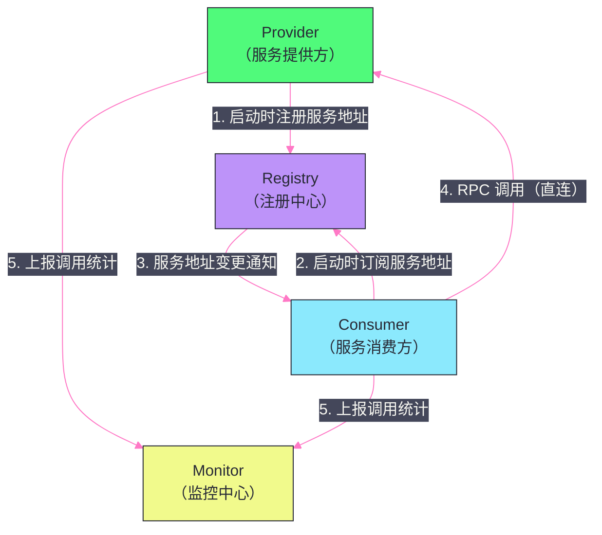
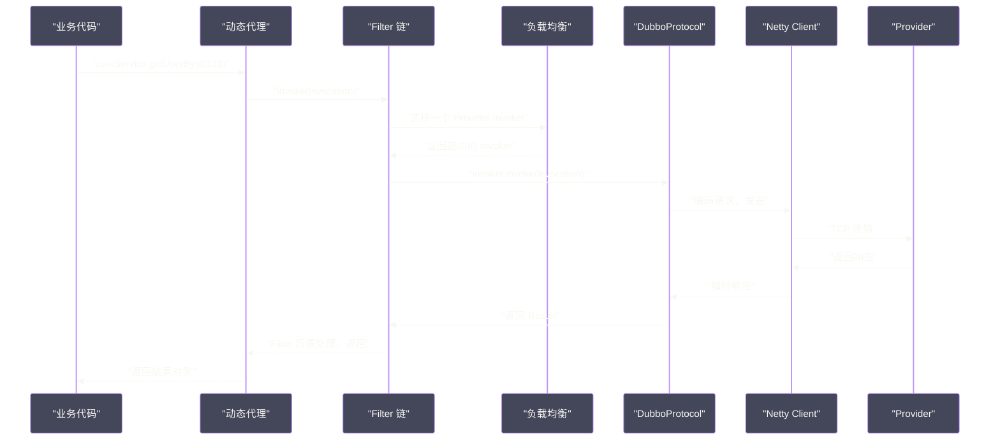

# 01 Dubbo 全局架构——服务注册、发现与调用链路

## 摘要

Dubbo 是 Java 生态中最成熟的 RPC 框架，经历了从阿里内部系统到 Apache 顶级项目的演进。理解 Dubbo 的整体架构，是读懂其所有技术细节的前提。本文围绕 Dubbo 的四大核心角色（Provider、Consumer、Registry、Monitor），梳理一次 RPC 调用从"服务注册"到"结果返回"的完整链路，并介绍 Dubbo 分层架构中各层的职责划分，以及 SPI 扩展机制作为整个框架"微内核"的核心地位。

---

## 第 1 章 Dubbo 的诞生背景：为什么需要 RPC 框架

### 1.1 从单体到微服务的痛点

在单体应用时代，所有模块运行在同一个 JVM 进程中，模块间通过方法调用交互，调用开销可以忽略不计。当系统规模扩大，单体应用拆分为多个微服务时，模块间的通信变成了跨进程、跨网络的**远程调用（Remote Procedure Call，RPC）**。

RPC 引入了一系列新的复杂性：
- **网络通信**：选择哪种协议（TCP/HTTP）？如何序列化/反序列化参数？如何处理连接的复用与管理？
- **服务发现**：服务消费方如何知道服务提供方当前的 IP 和端口？提供方扩容/缩容时如何通知消费方？
- **负载均衡**：当有多个提供方实例时，如何分配请求？
- **容错处理**：网络超时、提供方宕机时，消费方如何处理？
- **监控治理**：如何追踪每次调用的耗时、成功率？

如果每个业务团队都自己实现这些基础设施，既低效又难以统一治理。Dubbo 的价值在于：**将 RPC 通信、服务发现、负载均衡、容错等共性能力抽象为一个统一框架，让业务开发者专注于业务逻辑，像调用本地方法一样调用远程服务。**

### 1.2 Dubbo 的演进历史

Dubbo 最初由阿里巴巴在 2008 年开发，用于解决淘宝商城的服务化问题。2011 年开源，很快成为国内 Java 微服务的事实标准。2014 年，由于阿里内部转向 HSF，Dubbo 维护一度停滞，社区出现了多个分支（当当网的 DubboX 等）。2017 年，阿里重新启动 Dubbo 维护，2019 年捐赠给 Apache 基金会，成为 Apache 顶级项目。

**关键版本节点：**
- **Dubbo 2.7**：重构了服务治理能力，引入异步 RPC 支持（Reactive API）；
- **Dubbo 3.0**：引入 Triple 协议（基于 HTTP/2 + Protobuf，与 gRPC 互通）、应用级服务发现，向云原生架构演进；
- **Dubbo 3.x 持续演进**：Mesh 化支持（Proxyless 和 Sidecar 两种模式）、多语言 SDK。

本专栏覆盖 Dubbo 2.7/3.x 的核心机制，重点关注在生产中广泛使用的核心特性。

---

## 第 2 章 四大角色与整体架构

### 2.1 核心角色

Dubbo 架构中有四个核心角色：



**Provider（服务提供方）**：实现了某个服务接口的应用节点。Provider 在启动时，将自己的服务信息（接口名、版本、协议、IP:Port 等）注册到注册中心。

**Consumer（服务消费方）**：调用远程服务的应用节点。Consumer 在启动时，从注册中心订阅所需的服务信息，获取 Provider 的地址列表，然后在调用时直接与 Provider 通信（注意：实际 RPC 调用不经过注册中心，是 Consumer 直连 Provider）。

**Registry（注册中心）**：服务的"电话簿"，维护 Provider 的实时地址列表，并在列表变更时主动通知订阅的 Consumer。注册中心是服务发现的核心，但**不参与 RPC 调用链路**——注册中心宕机，已建立连接的 Consumer 仍可正常调用（因为 Consumer 本地缓存了 Provider 地址）。常用实现：[[Zookeeper]]、Nacos、ETCD。

**Monitor（监控中心）**：收集 RPC 调用的统计数据（调用次数、耗时、成功/失败率），用于可观测性和服务治理。Monitor 也是**可选组件**，其宕机不影响 RPC 调用。

### 2.2 注册中心不在调用链路上的深意

一个关键设计决策：**RPC 调用直接在 Consumer 和 Provider 之间进行，不经过注册中心**。

这与早期的中心化代理模式（如 ESB，所有调用都经过总线）不同。Dubbo 选择"注册中心只做服务发现，不做流量转发"，好处是：
- **消除单点瓶颈**：注册中心不承载调用流量，不会成为吞吐量瓶颈；
- **低延迟**：Consumer 直连 Provider，无中间跳转；
- **注册中心宕机可容忍**：Consumer 本地缓存了 Provider 地址，注册中心宕机不影响已有调用，只影响新节点的发现。

---

## 第 3 章 Dubbo 的分层架构

### 3.1 十层架构的设计

Dubbo 内部被划分为 10 层（从上到下）：

| 层次 | 名称 | 职责 |
|:---|:---|:---|
| **Service** | 业务层 | 用户编写的接口和实现（@DubboService, @DubboReference） |
| **Config** | 配置层 | 封装 ServiceConfig、ReferenceConfig，是 API 入口 |
| **Proxy** | 服务代理层 | 生成 Consumer 的动态代理（隐藏远程调用细节），生成 Provider 的 Invoker |
| **Registry** | 注册层 | 服务注册与发现，向注册中心注册/订阅服务 |
| **Cluster** | 集群层 | 封装多 Provider 场景：负载均衡、集群容错、路由规则 |
| **Monitor** | 监控层 | 统计调用次数和耗时，上报 Monitor 中心 |
| **Protocol** | 远程调用层 | RPC 协议的封装（Dubbo 协议、Triple 协议等），管理 Invoker 的生命周期 |
| **Exchange** | 信息交换层 | 封装请求-响应模型（Request/Response），处理同步/异步转换 |
| **Transport** | 网络传输层 | 网络传输的抽象（基于 [[Netty]] 的 NettyTransporter） |
| **Serialize** | 数据序列化层 | 序列化/反序列化（Hessian2、FastJSON、Protobuf 等） |

**分层的价值**：每一层都定义了清晰的抽象接口，通过 Dubbo SPI 提供多种实现，且各层的实现可以独立替换。例如，可以将 Transport 层从 Netty 替换为 Mina，而不影响上层的业务逻辑；可以将 Protocol 从 Dubbo 协议换为 Triple 协议，而不影响下层的传输实现。

### 3.2 Invoker：Dubbo 的核心抽象

在 Dubbo 的所有层次中，贯穿始终的核心抽象是 **Invoker**。

`Invoker` 是 Dubbo 对"可调用对象"的统一抽象：

```java
public interface Invoker<T> extends Node {
    // 获取服务接口类型
    Class<T> getInterface();
    
    // 执行调用，返回结果
    Result invoke(Invocation invocation) throws RpcException;
}
```

`Invocation` 封装了调用的参数（方法名、参数类型、参数值），`Result` 封装了调用结果（返回值或异常）。

**Invoker 在不同层次的含义：**
- **Provider 侧**：`Invoker` 是对业务实现的包装——`ProxyFactory` 将业务实现类包装为 `Invoker`；
- **Consumer 侧**：`Invoker` 是对远程调用的封装——通过 `Protocol.refer()` 创建的 `Invoker` 代表"向某个 Provider 发起调用"；
- **Cluster 层**：将多个 Provider 的 `Invoker` 封装为一个 `ClusterInvoker`，内部处理负载均衡和容错。

所有 Dubbo 的扩展点（Filter、Router、LoadBalance）都以 `Invoker` 为操作对象，这种统一抽象使得 Filter 链、路由、负载均衡的组合变得自然——每个环节只需处理 `Invoker`，无需关心具体实现。

---

## 第 4 章 一次完整的 RPC 调用链路

### 4.1 Provider 侧：服务导出

Provider 启动时（以 `@DubboService` 注解为例），经历以下步骤：

```
1. Spring 容器启动，解析 @DubboService 注解
   ↓
2. 创建 ServiceConfig，封装接口信息和配置
   ↓
3. 通过 ProxyFactory（JDK 动态代理或 Javassist）
   将业务实现类包装为 Invoker
   ↓
4. 通过 Protocol（DubboProtocol）将 Invoker 导出为 Exporter
   即：在本地 TCP 端口（默认 20880）启动 Netty Server，
   等待 Consumer 连接
   ↓
5. 通过 RegistryProtocol 将服务信息注册到注册中心
   （URL 格式：dubbo://192.168.1.1:20880/com.example.UserService?...）
```

### 4.2 Consumer 侧：服务引用

Consumer 启动时（以 `@DubboReference` 注解为例）：

```
1. Spring 容器启动，解析 @DubboReference 注解
   ↓
2. 创建 ReferenceConfig，封装接口信息和配置
   ↓
3. 通过 RegistryProtocol 向注册中心订阅服务
   ↓
4. 注册中心返回所有匹配的 Provider 地址列表
   并在本地缓存（directory 目录）
   ↓
5. 为每个 Provider 地址通过 Protocol.refer() 创建对应的 Invoker
   （每个 Invoker 内部维护一个到 Provider 的 Netty 连接）
   ↓
6. Cluster 层将多个 Invoker 合并为一个 ClusterInvoker
   （封装负载均衡和容错逻辑）
   ↓
7. ProxyFactory 为 ClusterInvoker 生成动态代理
   暴露给业务代码，业务代码像调用本地方法一样调用此代理
```

### 4.3 调用阶段：从业务代码到网络

当业务代码调用 `userService.getUserById(123)` 时，实际执行路径：



**关键步骤详解：**

1. **动态代理拦截**：业务代码调用的接口实际上是动态代理对象，代理内部将方法调用转化为 `Invocation` 对象（包含方法名、参数类型、参数值）；

2. **Filter 链执行**：`Invocation` 经过一系列 Filter（日志记录、超时控制、限流、鉴权等），每个 Filter 可以在调用前后插入逻辑；

3. **负载均衡**：`ClusterInvoker` 根据负载均衡策略（Random/RoundRobin/LeastActive 等）从 Provider 列表中选择一个 `Invoker`；

4. **协议编码与发送**：`DubboProtocol` 将 `Invocation` 序列化为 Dubbo 协议的二进制帧，通过 `Netty Channel` 发送给 Provider；

5. **Provider 处理**：Provider 侧的 Netty Server 接收请求，解码，通过 Dispatcher 将任务投递到业务线程池，执行业务实现，将结果编码后响应；

6. **结果返回**：Consumer 侧 Netty 接收响应，解码，通过 Future 机制唤醒等待的业务线程，返回结果。

---

## 第 5 章 SPI 扩展机制：微内核的骨架

### 5.1 为什么 Dubbo 需要自己实现 SPI

JDK 提供了标准的 SPI（Service Provider Interface）机制，通过 `ServiceLoader` 加载 `META-INF/services/` 下的配置文件来发现实现类。但 JDK SPI 有两个主要问题：

1. **全量加载**：`ServiceLoader.load()` 会加载并实例化所有的实现类，即使你只需要其中一个。对于 Dubbo 这样有几十种扩展点、每个扩展点有多种实现的框架，全量加载会造成严重的启动延迟和内存浪费；

2. **不支持依赖注入**：JDK SPI 创建的扩展实例没有 IoC 容器的支持，无法注入其他 Dubbo 组件。

Dubbo 基于 JDK SPI 的思想，自己实现了一套增强版 SPI，解决了上述问题，同时增加了 Adaptive（自适应扩展）和 Wrapper（装饰器）等高级特性。

### 5.2 Dubbo SPI 的基本用法

**定义扩展接口**（必须标注 `@SPI`）：

```java
@SPI("dubbo")  // 默认扩展名为 "dubbo"
public interface Protocol {
    int getDefaultPort();
    
    <T> Exporter<T> export(Invoker<T> invoker) throws RpcException;
    
    <T> Invoker<T> refer(Class<T> type, URL url) throws RpcException;
}
```

**在配置文件中注册实现**（`META-INF/dubbo/org.apache.dubbo.rpc.Protocol`）：

```
dubbo=org.apache.dubbo.rpc.protocol.dubbo.DubboProtocol
http=org.apache.dubbo.rpc.protocol.http.HttpProtocol
grpc=org.apache.dubbo.rpc.protocol.grpc.GrpcProtocol
```

**按需加载指定实现**：

```java
// 按名称加载，不加载其他实现
Protocol protocol = ExtensionLoader.getExtensionLoader(Protocol.class)
                                   .getExtension("dubbo");
```

### 5.3 Dubbo SPI 的三大增强特性

**特性一：按名称按需加载（Lazy Loading）**

`ExtensionLoader` 只在第一次调用 `getExtension("name")` 时才实例化对应的扩展类，其他扩展类保持未加载状态。这使得 Dubbo 的启动性能不受扩展数量影响。

**特性二：Adaptive 自适应扩展**

Dubbo 需要在运行时根据 URL 中的参数（如 `protocol=dubbo` 或 `protocol=triple`）动态选择扩展实现。`@Adaptive` 注解实现了这一机制：

```java
@SPI("dubbo")
public interface Protocol {
    // @Adaptive 标注的方法，运行时根据 URL 中的 "protocol" 参数选择实现
    @Adaptive
    <T> Exporter<T> export(Invoker<T> invoker) throws RpcException;
}
```

`ExtensionLoader` 会自动生成一个 `Protocol$Adaptive` 代理类，该类的 `export()` 方法从 `Invoker` 的 URL 中读取 `protocol` 参数，再调用对应实现的 `export()`。这是 Dubbo 能够同时支持多种协议（Dubbo/Triple/HTTP）的核心机制。

**特性三：Wrapper 装饰器链**

在 SPI 配置文件中，可以定义"Wrapper 类"——实现了扩展接口，且构造方法接收同类型的参数（装饰器模式）：

```java
public class ProtocolFilterWrapper implements Protocol {
    private final Protocol protocol;  // 被包装的真实实现
    
    public ProtocolFilterWrapper(Protocol protocol) {
        this.protocol = protocol;
    }
    
    @Override
    public <T> Exporter<T> export(Invoker<T> invoker) throws RpcException {
        // 在真实 export 前后添加 Filter 链逻辑
        return protocol.export(buildInvokerChain(invoker, ...));
    }
}
```

`ExtensionLoader` 自动检测 Wrapper 类（通过构造方法签名），在返回真实扩展实例前，将所有 Wrapper 类依次包裹在外面，形成装饰器链。这使得 Filter 链的组装完全透明——业务代码只关心 `Protocol` 接口，Wrapper 在框架层自动叠加。

> [!note] 设计哲学
> Dubbo 的 SPI 机制是整个框架的"骨架"——10 层架构中，每一层的接口都是通过 SPI 定义和加载实现的。这意味着 Dubbo 的每个组件都可以被替换（序列化方式、注册中心实现、负载均衡算法、集群容错策略），甚至可以通过自定义 SPI 实现将整个网络层替换。这种设计使 Dubbo 既是一个可以直接使用的完整框架，也是一个可以针对特定场景高度定制的扩展平台。

---

## 第 6 章 URL：Dubbo 的统一数据总线

### 6.1 URL 模型

Dubbo 使用 **URL** 作为各层之间的统一数据载体。一个 Dubbo URL 的格式：

```
dubbo://192.168.1.1:20880/com.example.UserService
  ?application=user-provider
  &version=1.0.0
  &group=default
  &methods=getUserById,createUser
  &timeout=1000
  &retries=2
  &loadbalance=random
```

URL 包含了一次 RPC 调用所需的所有配置信息：协议类型、Provider 地址、接口名、版本、调用参数配置等。

**URL 贯穿各层的作用：**
- **服务导出时**：Provider 将自己的所有配置信息打包进 URL，注册到注册中心；
- **服务发现时**：Consumer 从注册中心获取 Provider 的 URL，解析出地址和配置；
- **Adaptive 扩展时**：`Protocol$Adaptive` 从 URL 的 `protocol` 参数决定使用哪个 Protocol 实现；
- **Filter 链中**：Filter 可以读取 URL 中的配置参数（如 `timeout`）来控制行为。

### 6.2 URL 的性能争议

Dubbo 的 URL-driven 设计虽然统一了数据模型，但也带来了性能问题：URL 是字符串格式，大量使用字符串拼接和解析，在高并发场景下有明显的 CPU 和内存开销。

Dubbo 3.x 在内部将 URL 重构为结构化对象（避免频繁字符串解析），同时引入了应用级服务发现（将服务元数据从注册中心的 URL 中分离，减少注册中心的数据量），显著改善了这一问题。

---

## 小结

本文梳理了 Dubbo 的整体架构：

- **四大角色**：Provider（注册服务）、Consumer（订阅服务 + 直连调用）、Registry（服务发现）、Monitor（监控）；注册中心不在调用链路上，宕机不影响已有调用；
- **十层分层架构**：每层职责清晰，通过 SPI 实现可替换；`Invoker` 是贯穿所有层次的核心抽象；
- **完整调用链路**：从 `@DubboService` 注解 → 服务导出 → 注册中心注册，到 `@DubboReference` → 服务引用 → 动态代理，到业务调用时的 Filter 链 → 负载均衡 → 协议编解码 → Netty 传输；
- **Dubbo SPI**：微内核骨架，支持按名称按需加载、Adaptive 自适应扩展、Wrapper 装饰器链，是 Dubbo 高度可扩展性的基础。

下一篇文章将深入 Dubbo SPI 的实现细节：`ExtensionLoader` 的加载机制、Adaptive 代理的代码生成，以及 Wrapper 装饰器链的组装原理。
