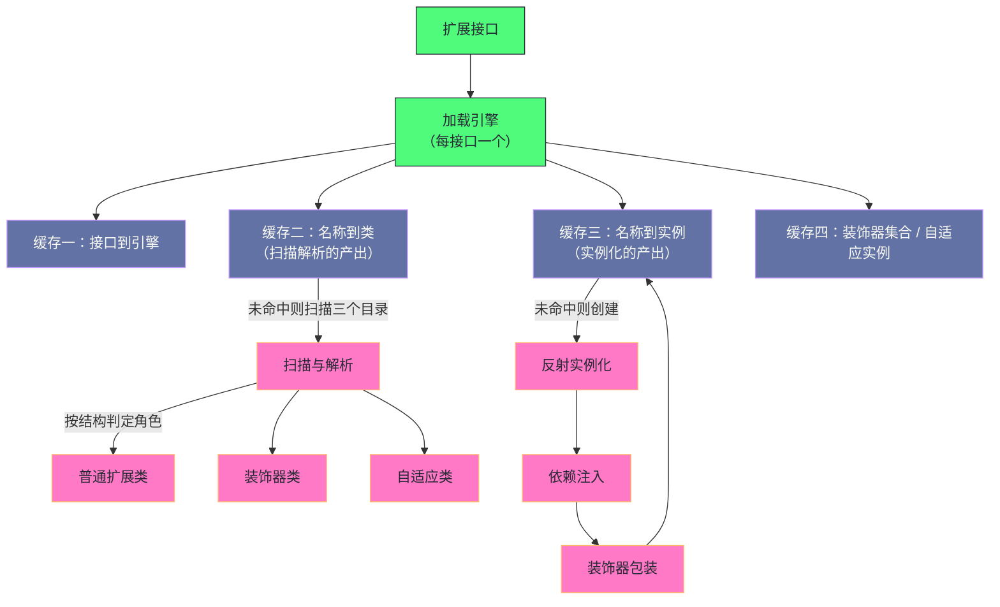

# 02 Dubbo SPI——微内核与插件化架构

**摘要：**

上一篇讲到"Dubbo 的十层里每一层都可替换"——而**"可替换"这件事需要一个机制来支撑**，这个机制就是本篇要讲的扩展机制。它**没有直接使用 Java 标准库自带的那个**，因为标准机制有三个缺陷：**全量实例化、无法按名称取用、不支持依赖注入。** 而框架需要的是"**按需加载、按名取用、能注入依赖**"——因此它自己实现了一套，并在此之上加了两个更关键的能力：**自适应扩展**（运行时按配置动态选择实现）与**装饰器链**（横切逻辑的透明叠加）。本文按"为什么自己实现 → 加载引擎的设计 → 按需加载的流程 → 依赖注入 → 自适应扩展 → 装饰器链 → 三者如何配合"展开。先说明标准机制的三个缺陷与"保留什么、改造什么"；再拆解三个扫描目录的优先级、配置格式里"显式名称"的意义、四级缓存的分工。然后走完一次按需加载的完整流程（含并发保护与三个后处理步骤）、依赖注入为何注入"自适应扩展"而非具体实现。之后是自适应扩展的两种实现方式与生成代理的解析、装饰器链的识别规则与组装方式、以及三者的配合方式。最后是边界反例与落点。

---

## 第 1 章 为什么需要一个自己的扩展机制

### 1.1 标准机制的三个缺陷

**Java 标准库自带的扩展机制有三个缺陷，而它们都"与框架的需求不匹配"。**

**缺陷一：全量实例化。** **标准机制"在遍历时会逐一实例化所有实现"**——**而框架的某个接口可能有"十几种实现"，但运行时通常只用一种。** **因此"全量实例化会浪费内存与启动时间"。**

**缺陷二：无法按名称取用。** **标准机制"只能遍历，不能按名称精确取用"**——**而框架需要"根据运行时参数选择实现"。** **因此"要按名称取用，只能自己遍历匹配"**——**而"代码繁琐且低效"。**

**缺陷三：不支持依赖注入。** **标准机制"通过无参构造创建实例"**——**因此"无法注入其他组件"。** **而框架内部"很多扩展需要依赖其他扩展"**（例如"注册实现需要用到集群与代理工厂"）。

**三个缺陷的共同特征是"它们都源于'机制的设计目标不同'"**：**标准机制"面向'简单的服务发现'"，**而**框架需要"面向'可组合、可注入的插件体系'"。** **因此"自己实现"是必然的。**

**而这处"自己实现"的取舍值得留意**：**它"用'一套自定义机制'替代'标准机制加补丁'"**——**而"自定义"的收益是"能力完整且行为一致"，代价是"使用者需要学习一套新的约定"。**

### 1.2 保留什么、改造什么

**这套机制的做法是"保留核心思想，改造三处"。**

**保留的是"通过配置文件发现实现"**——**因为"这个思想让'接口与实现解耦'"**，**而"解耦"正是"可替换"的前提。**

**改造的第一处是"加入显式名称"**——**也就是"配置格式从'每行一个实现类'改成'名称等于实现类'"。** **这条改造让"按名称取用"成为可能。**

**改造的第二处是"改为按需实例化"**——**也就是"只在'第一次按名称取用'时才创建实例"。** **这条改造解决了"全量实例化"。**

**改造的第三处是"加入依赖注入"**——**也就是"实例化之后'遍历它的 setter 方法，把依赖注入进去'"。** **这条改造解决了"组件之间无法组合"的问题。**

**三处改造的关系是"第一处是前提，后两处是能力"**：**"有了名称"才能"按名称按需加载"**，**而"注入"则让"扩展之间可以组合"。**

### 1.3 一个类比：从"按目录找书"到"按索引查书"

**把这套机制类比成"图书馆的检索方式"会更容易理解它的改造。**

**"标准机制"相当于"按目录逐本翻看"**——**你"只能一本本翻过去，且'每翻一本就要把它从库房调出来'"**——**而"这正是'全量实例化'的类比形态"。**

**"改造后的机制"相当于"有书名索引"**——**你"报出书名（扩展名）"，管理员"只调出那一本"。**

**"依赖注入"相当于"这本书附带了一串'相关书目'"**——**而"管理员会'顺手把这些书也调出来'"**。

**"自适应扩展"相当于"你只说'要一本讲历史的书'"**——**而"管理员'根据你的需求描述'去挑一本具体的"。**

**"装饰器链"相当于"给书'加一层书皮'"**——**而"多个书皮可以叠加，且'读者只关心内容，不关心书皮'"。**

**这个类比的用处在于"它把三个能力的作用区分开了"**：**"名称索引"解决"找得到"，"自适应"解决"选得对"，"装饰器"解决"用得透明"。**

### 1.4 扩展机制的代价

**这套机制有四处代价。**

**其一：多一层间接。** **因为"调用者持有的是'自适应代理'"，所以"实际执行的是'代理转发后的实现'"**——**因此"调用栈里多了一层"。**

**其二：行为在运行时确定。** **因为"选择哪个实现由配置决定"，所以"静态阅读代码'无法完全推断行为'"**——**而"这增加了排查难度"。

**其三：装饰器顺序由框架决定。** **因为"装饰器链的组装顺序'不由使用者控制'"，所以"多个装饰器叠加时'执行顺序可能不符合直觉'"。**

**其四：配置分散。** **因为"很多行为由配置文件决定"，所以"排查时需要'先确认配置'"**——**而"配置与代码分离'让问题的定位多一步'"。**

**四处代价的共同特征是"它们是'动态性的对价'"**：**动态性带来"可替换"，代价是"行为在运行时才确定"。** **而"运行时确定"意味着"静态分析无法覆盖全部情况"**——**这是所有"插件化架构"的共同代价。**

### 1.5 五个能力的关系

**这套机制一共提供五个能力，而它们之间有明确的依赖关系。**

**第一个是"按需加载"**——**它解决"何时创建"。**

**第二个是"按名称取用"**——**它解决"取哪一个"。**

**第三个是"依赖注入"**——**它解决"扩展之间如何组合"。**

**第四个是"自适应扩展"**——**它解决"运行时如何决定取哪一个"。**

**第五个是"装饰器链"**——**它解决"如何透明地叠加横切逻辑"。**

**五者的依赖关系是**：**"按名称取用"依赖"显式名称"**；**"自适应扩展"依赖"按名称取用"**（因为"它最终要按名称去取"）；**"装饰器链"依赖"实例化"**（因为"它包装的是实例"）；**"依赖注入"也依赖"实例化"**（因为"它注入的是已创建的实例"）。

**因此"五者不是并列的，而是一棵依赖树"**——**而"根"是"显式名称"。** **这条关系解释了"为什么'名称'这个看似简单的设计是整套机制的基础"**——**因为"它上面长出了其余四个能力"。**

### 1.6 一处关于"微内核"的辨析

**"微内核"这个词容易被误用，因此值得先做一处澄清。**

**准确的含义是"核心只提供'机制'，而不提供'策略'"**——**也就是说"核心知道'如何加载扩展'，但不知道'用哪个扩展'"。** **因此"策略由配置决定，而核心只负责'按配置执行'"。**

**这条辨析的意义在于"它区分了'机制'与'策略'的归属"**：**本机制里，"名称解析、按需加载、注入、包装"是机制**，**而"用哪个协议、哪个负载均衡算法"是策略。**

**而"机制与策略分离"的收益是"核心不必随策略变化"**：**"新增一种协议'不需要改核心'"**——**因此"核心可以保持稳定"。**

**这条辨析的实用价值在于"它给出了'什么该放进核心'的判据"**：**"机制放核心，策略放扩展"**——**而"把策略写进核心'会让核心随业务变化'"，**因此**"违背了微内核的初衷"。**

---

## 第 2 章 加载引擎的整体设计

### 2.1 三个扫描目录与优先级

**配置文件可以放在三个目录下，而它们有明确的优先级。**

**第一个是"框架内置目录"**——**它存放"框架自带的扩展"**，**优先级最高。**

**第二个是"用户自定义目录"**——**它存放"用户写的扩展"**，**是推荐的位置。**

**第三个是"兼容目录"**——**它兼容"标准机制的格式"**，**优先级最低。**

**三个目录的分工是"框架自己、用户自己、以及兼容层"**——**而"优先级的设计意图"是"让框架内置的实现可以被覆盖"**（因为"用户目录的优先级低于内置目录"）**——**而"兼容目录最低"则保证"它只在'没有其他来源'时生效"。

**这条优先级设计说明一个通用规律**：**"多来源的配置需要一个明确的优先级"**——**否则"同名配置'谁生效'就是不确定的"。** **而"确定性"在"可替换架构"里尤其重要**（因为"不确定的行为'无法排查'"）。

**一处值得留意的细节是"内置目录的优先级最高"**——**这条设计与"用户目录优先"的常见直觉相反**。** 它的理由是"内置实现'是框架行为的基础'"**——**因此"不允许被意外覆盖"**（否则"框架的默认行为会被破坏"）。

**而"用户要覆盖内置实现"的正规方式"不是'放同名配置'"**——**而是"用不同的名称'并在配置里显式引用它'"。** **这条约束的实践含义是"扩展命名'应当避免与内置实现重名'"**——**而"重名会导致'静默不生效'"，**因此**"它是'约定类错误'的一种"。**

### 2.2 配置文件格式与"显式名称"的意义

**配置格式是"名称等于实现类"，而"名称"这个设计值得单独说明。**

**"名称"的作用有三处**：**它让"按名称取用"成为可能**，**它让"配置里引用扩展"成为可能**（例如"配置里写'用哪个实现'"），**它让"自适应扩展有可用的候选集合"**（因为"它要'按名称去取'"）。

**因此"名称"不只是一个"标识"，而是"整个动态机制的基础"**——**因为"没有名称，就无法'在运行时按配置选择'"。**

**这条设计的意义在于"它把'实现'变成了'可被配置引用的对象'"**——**而"可被引用"是"可替换"的前提。** **这与第 1 篇讲的"统一数据载体让配置随地址传递"是同一思路**：**"让'配置'能引用'实现'，是动态性的基础"。**

### 2.3 多级缓存

**加载引擎内部维护四级缓存，而它们分别缓存"不同阶段的结果"。**

**第一级是"接口到加载引擎的映射"**——**它保证"每个接口只有一个加载引擎"。**

**第二级是"扩展名到扩展类的映射"**——**它缓存"扫描解析的结果"，也就是"类对象"。**

**第三级是"扩展名到实例的映射"**——**它缓存"实例化的结果"，也就是"单例"。**

**第四级是"装饰器类的集合"与"自适应实例"**——**它们分别缓存"装饰器列表"与"自适应代理"。**

**四级缓存的分工是"从'接口'到'类'到'实例'再到'特殊产物'"**——**而"每一级都对应'一个阶段的产出'"。**

**"四级"这个数量说明"加载过程有四个阶段"**——**而"缓存'每阶段的产出'"的意义是"避免重复计算"。** **因此"看一个框架的缓存设计，就能推断它的'计算阶段划分'"**——**而这是一条"读源码时的高效线索"。**

### 2.4 缓存的分工与并发

**缓存的并发保护方式值得说明，因为它体现了"哪些阶段需要互斥"。**

**"接口到引擎的映射"用"并发容器"保护**——**因为"它只做'一次写入、多次读取'"**，**因此"并发容器足够"。**

**"扩展名到类"与"装饰器集合"用"一次性加载的容器"保护**——**因为"它们'要么全没加载，要么全部加载完'"**，**因此"用一次性语义的容器即可"。**

**"扩展名到实例"用"双重检查加锁"保护**——**因为"实例化'有副作用且需要互斥'"**，**因此"需要显式的锁"。**

**三种保护方式的分工说明一条规律**：**"并发的保护强度'由'写入的复杂度'决定"**——**"只写一次"的用并发容器，"有副作用"的用显式锁。** **这与第 7 篇讲的"无锁设计的适用边界"是同一判断**：**"各写各的可以无锁，改变全局结构的需要互斥"。**

### 2.5 加载引擎的整体结构

把加载引擎的缓存与流程画在一起，能看清"一次取用经过哪些阶段"。

**图中最值得注意的是"缓存二与缓存三分别对应'两个不同阶段'"**：**前者缓存"扫描解析的结果"，后者缓存"实例化的结果"。** **因此"它们的失效时机不同"**——**而"这解释了'为什么有些配置改了需要重启'"**（因为"它影响'缓存二的产出'"）。

**另一处值得注意的是"三个角色由'同一份扫描'产出"**：**因此"扫描只需做一次"，而"角色判定'在解析阶段完成'"。**

**这张图的实用价值在于"它把'一次取用'分解成'查缓存与走流程'两类动作"**——**而"绝大多数取用'只做查缓存'"**，**因此"性能的关键在于'缓存是否命中'"。**

---

## 第 3 章 按需加载的完整流程

### 3.1 四步流程

**按名称取用一个扩展，流程分四步。**

**第一步：检查实例缓存。** **命中则直接返回**，**未命中则进入创建流程。**

**第二步：并发保护。** **用双重检查加锁，防止"并发重复创建"。**

**第三步：创建实例。** **这一步内部又分四个小步**（第 3.3 与 3.4 节展开）。

**第四步：写入缓存并返回。**

**四步里"第一步与第二步"是"性能与正确性的保障"**——**而"第三步"是"实质工作"。**

**这条流程的形态与第 4 篇讲的"页分配的乐观路径"是同一类**：**"先查缓存（乐观），未命中才做昂贵动作（悲观）"。** **而"缓存命中率"决定了"这条路径的实际成本"。**

### 3.2 并发保护的位置

**"并发保护只覆盖创建阶段"这一点值得留意。**

**也就是说**：**"缓存检查"不需要加锁**（因为它"用并发容器，读取是安全的"），**而"创建过程"需要加锁**（因为"实例化有副作用"）。

**这条设计的收益是"绝大多数取用'不进入临界区'"**——**因为"实例创建一次之后就一直在缓存里"。** **因此"锁只在'首次取用'时生效"。**

**这条性质解释了一个现象**：**"扩展的取用成本'在启动阶段较高，而在运行阶段极低'"**——**因为"首次创建之后'都是缓存命中'"。** **而"这与第 1 篇讲的'把重量级动作前移到启动阶段'是同一手法"。**

### 3.3 类扫描与解析

**"类扫描"这一步的产出有三类，而它们分别对应三种角色。**

**第一类是"普通扩展类"**——**它们进入"扩展名到类"的缓存。**

**第二类是"装饰器类"**——**它们进入"装饰器集合"**（判定依据是"构造方法接收同类型的参数"）。

**第三类是"自适应类"**——**它们进入"自适应缓存"**（判定依据是"类上有自适应标记"）。

**三类产出的共同特征是"它们由'同一份配置'解析而来，但'角色不同'"**——**而"角色的判定依据是'类的结构'"**（"有没有特殊构造方法""有没有特殊标记"）。

**这条"按结构判定角色"的做法说明一个通用手法**：**"用'约定的结构'表达'角色的差异'"**——**因此"不需要额外的配置来声明角色"。** **它的收益是"配置简洁"，代价是"约定不直观"**（因为"看配置看不出'哪个是装饰器'"）。

### 3.4 实例化的三个后处理步骤

**实例化之后有三个后处理步骤，而它们的顺序有意义。**

**第一步是"反射实例化"**——**它"创建出一个'未注入依赖'的实例"。**

**第二步是"依赖注入"**——**它"遍历 setter 方法，把'扩展类型的依赖'注入进去"。**

**第三步是"装饰器包装"**——**它"把实例依次包裹进装饰器"。**

**三步的顺序有意义**：**"注入"必须在"包装"之前**——**因为"装饰器本身也需要依赖注入"**，**而"如果先包装，那么'注入会作用于装饰器而非真实实例'"。**

**这条顺序关系说明一个通用规律**：**"当'多个后处理步骤'作用于同一对象时，顺序由'依赖关系'决定"**——**而"依赖关系"通常表现为"'某一步的输入需要'另一步先完成'"。** **这与第 15 篇讲的"恢复四阶段的顺序必然性"是同一推理。**

### 3.5 一处关于"缓存设计"的经验

**这套四级缓存的设计值得收敛一下，因为"看缓存就能推断阶段划分"是一条高效的读源码方法。**

**观察是"每个缓存'对应一个阶段的产出'"**：**"接口到引擎"对应"引擎的创建阶段"**，**"名称到类"对应"扫描解析阶段"**，**"名称到实例"对应"实例化阶段"**，**"装饰器与自适应"对应"特殊产物的生成阶段"。**

**因此"数一数缓存有几级，就能推断'实现被划分成了几个阶段'"**——**而"这条推断"能"在没有文档时快速建立对源码结构的理解"。

**这条经验的另一面是"缓存的粒度反映'阶段的重用价值'"**：**"某个阶段的产出'越贵'，就越值得缓存"**——**因此"如果某个阶段没有缓存，通常说明'它很便宜'或'它只做一次'"。**

**这条方法的通用性在于"它适用于所有'有明确阶段划分的系统'"**——**而"缓存设计"是"阶段划分"最直接的外在表现。** **这与第 10 篇讲的"看页的头部字段就能推断页的功能"是同一类方法**：**"从'结构的痕迹'反推'设计的意图'"。**

### 3.6 一处关于"懒加载"的观察

**"按需加载"这处设计的收益与代价值得再展开一层。**

**它的收益是"启动时间与扩展数量无关"**——**因为"未取用的扩展'不被实例化'"**——**因此"扩展数量增长'不增加启动成本'"。**

**而它的代价是"首次取用有延迟"**——**因为"第一次取用时'要做扫描、解析、实例化'"**——**而"如果某个扩展'恰好在'高频调用的路径上被首次取用'"，那么"这一次调用会明显变慢"。**

**因此"懒加载的取舍是'把成本从启动转移到首次使用'"**——**而"该不该懒加载"取决于"启动时间是否敏感"与"首次使用是否可容忍"。

**本机制的选择是"懒加载"，而"配套的缓解措施是'预热'"**——**也就是说"可以在启动阶段'主动取用一次'，从而把成本前移"。** **这条"预热"的做法在"延迟敏感的场景"下值得采用**——**而它的本质是"用一次显式的调用换取'消除首次使用的抖动'"。**

---

## 第 4 章 依赖注入

### 4.1 注入机制

**注入机制是"模仿 setter 注入"，而它的实现很直接。**

**流程是"遍历实例的所有公开 setter 方法"**——**而"如果'某个 setter 的参数类型是扩展接口'，则'注入该接口的实例'"。**

**因此"注入的判据是'参数类型是否标注了扩展标记'"**——**也就是"这个类型'是否是一个扩展点'"。**

**这条机制的关键在于"它不依赖外部容器"**——**因此"扩展实例的依赖关系'由框架自己解决'"。** **这解决了标准机制的第三个缺陷。**

### 4.2 为什么注入"自适应扩展"而不是具体实现

**这处设计值得单独说明，因为它是"保持动态性"的关键。**

**具体来说**：**注入的是"自适应代理"，而不是"某个具体实现"。**

**这样做的收益是"依赖的选择被推迟到调用时"**：**因为"自适应代理'在每次调用时根据配置选择实现'"，所以"被注入的组件'在被调用时才决定用哪个实现'"。**

**而"如果注入具体实现"，那么"选择就被固定在注入时"**——**因此"后续的配置变化'不会影响已注入的依赖'"。

**这条设计的意义在于"它让'动态性'贯穿到依赖关系里"**——**而"否则动态性只停留在'顶层组件'"。** **这与第 1 篇讲的"注册中心不转发流量从而让动态性不被中心限制"是同一思路**：**"让动态性'尽量少被固定下来'"。**

### 4.3 这处设计的后果

**这处设计带来两处后果。**

**后果一是"配置变更可以生效"**：**因为"依赖是代理"，所以"配置变更后'下次调用就生效'"**——**而"不需要重建组件"。**

**后果二是"排查时需要'追两层'"**：**因为"调用先经过代理，再经过真实实现"，所以"排查时'需要确认代理选了哪个实现'"。** **而"这一步'在日志里通常有痕迹'"，**因此**"知道这处设计能加快定位"。**

**两处后果的共同特征是"它们是'延迟绑定'的对价"**：**延迟绑定带来"配置灵活"，代价是"调用链多一层、定位多一步"。** **这与第 6 篇讲的"自适应哈希索引的收益与代价"是同一形态。**

### 4.4 注入机制的边界

**注入机制有三处边界值得说明。**

**边界一：只支持"扩展类型的依赖"**——**也就是说"注入只针对'扩展接口参数'"，而"普通类型（例如字符串、数字）不会被注入"。**

**边界二：只支持"setter 注入"**——**因此"构造方法注入'不被支持'"**（因为"构造注入'与'无参构造创建实例'冲突"）。

**边界三：不支持"可选注入"的显式声明**——**因此"如果'某个 setter 的类型是扩展点'，那么'框架一定会尝试注入'"**——**而"这可能导致'意料之外的注入'"。

**三处边界的共同特征是"它们是'机制简化'的结果"**：**"只支持扩展类型、只支持 setter、不做可选声明"**——**而"简化"的收益是"实现简单且行为可预测"。**

**因此"使用这套机制时"应当"确认'哪些 setter 会被注入'"**——**因为"被注入的 setter '可能不符合预期'"。** **这类"隐式行为"是"约定优于配置"的常见代价。**

### 4.5 一处关于"注入粒度"的观察

**"注入的是'自适应代理'而非具体实现"这处设计，还可以从'粒度'的角度再看一层。**

**观察是"它把'依赖关系'与'实现选择'解耦了"**：**依赖关系"在注入时确定"**，**而实现选择"在调用时确定"。**

**这条解耦的收益是"两者可以各自独立变化"**：**"换实现'不影响依赖关系'"，**而**"调整依赖'不影响实现选择'"。**

**而它的代价是"调用路径上多一次'选择'"**——**因此"每次调用都要'读配置并取实现'"**（虽然"取实现有缓存"）。

**因此"这处设计的取舍是'用一次调用的开销换'两处独立变化的能力'"**——**而在"配置变更频繁"或"多种实现并存"的场景下，这笔交换是划算的。**

**这条观察的通用价值在于"它给出了'延迟绑定是否值得'的判据"**：**"如果'绑定的目标会变化'，那么延迟绑定划算"**——**而"如果'目标固定'，那么延迟绑定只是纯开销"。**

### 4.6 一处关于"自定义容器"的辨析

**"为什么不直接用外部容器"这个问题值得回答，因为它关系到"框架与容器的边界"。**

**答案有三层**：**其一，"框架需要'在没有容器时也能工作'"**（因为"框架可以独立使用"）；**其二，"容器管理的是'业务对象'，而框架管理的是'组件'"**（两者的生命周期与可见性不同）；**其三，"框架内部的组件'数量大、依赖关系固定'，用一套更轻的机制更合适"。**

**三层答案的共同特征是"它们都在划'职责边界'"**：**"业务对象的组装交给容器，而框架组件的组装'由框架自己完成'"。**

**这条边界的重要性在于"它避免了'框架对容器的强依赖'"**——**而"强依赖会限制框架的适用范围"**（因为"不同的项目用不同的容器"）。

**因此"设计框架时"应当"明确'哪些部分依赖外部容器、哪些部分自给自足'"**——**而"把'核心组件的组装'做成自给自足的"，能"显著提升框架的适用面"。**

---

## 第 5 章 自适应扩展

### 5.1 为什么需要它

**自适应扩展解决的是"同一接口需要多种实现并存"这个问题。**

**具体场景是**：**同一个接口"可以用不同协议暴露"**——**因此"消费方发起调用时，需要'根据目标提供方的配置'选择对应的协议实现"。**

**而"如果没有这层机制"，每次调用前都要"手动判断类型、手动取用实现"**——**而"这类判断'与框架代码深度耦合'"。**

**因此自适应扩展的作用是"把这层判断'封装进一个代理'"**——**而"调用方'只需要持有接口引用'"。**

**这条动机的形态与第 1 篇讲的"框架把共性能力收敛"是同一思路**：**"把'反复出现的判断逻辑'收进框架"。**

### 5.2 两种实现方式

**自适应扩展有两种实现方式，而选择依据是"适配逻辑的复杂度"。**

**方式一是"手动编写自适应类"**——**它适用于"适配逻辑比较复杂、无法用'简单的配置参数'决定"的场景。** **例如"某个接口的实现选择'取决于全局配置而非调用参数'"**——**因此"它需要自己写判断逻辑"。**

**方式二是"标注方法、自动生成代理"**——**这是更常见的方式**，**而它适用于"适配逻辑'就是'从调用参数里读一个键'"的场景。**

**两种方式的差别在于"判断逻辑写在哪里"**：**前者"写在手写的类里"，后者"由框架生成的代理完成"。** **而"自动生成"的收益是"不用写样板代码"，代价是"逻辑不够灵活"。**

### 5.3 自动生成的代理解析

**自动生成的代理做三件事。**

**第一件是"参数校验"**——**它"检查调用参数是否为空"，并"从中取出统一数据载体"。**

**第二件是"读取扩展名"**——**它"从载体里读取'指定的键'"，**而**"如果没读到，则使用'接口的默认实现名'"。**

**第三件是"按名称取用并转发"**——**它"按取到的名称'取用实现'（这一步带缓存），然后'把调用转发过去'"。**

**三件事的共同特征是"它们都是'薄薄的转发逻辑'"**——**而"代理本身'不包含业务逻辑'"。** **因此"生成的代理'很轻'"**，**而"它的开销'主要来自'读取参数与取用实现'"。

**一处细节值得留意**：**"没有标注自适应标记的方法'在代理里会抛异常'"**——**因此"标注'决定了'哪些方法支持动态路由'"。** **这条约束的含义是"动态路由'需要显式声明'"**——**而"这避免了'所有方法都被隐式代理'"。

### 5.4 参数名与默认值

**"参数名"与"默认值"这两处细节值得说明。**

**参数名的作用是"指定从载体里读哪个键"**——**而"如果不指定，则'按接口名推导'"。** **这条"默认推导"的设计意图是"让常见情况'不用显式配置'"。**

**而默认值的作用是"当'载体里没有该键'时用哪个实现"**——**而"默认值来自接口上的标记"。** **因此"接口上的标记'提供了兜底'"**——**而"这让'没有配置时也能工作'"。

**两处细节的共同作用是"减少必须显式配置的内容"**——**而"减少配置"的收益是"上手更容易"。** **而它的代价是"隐式规则'需要理解才能排查'"**——**因为"不写参数名'不代表没有参数名'"。

**这条"默认推导"的机制还带来一处实践含义**：**"接口名的驼峰形式'就是默认的键名'"**——**因此"配置里写的键'必须与这个推导一致'"**（除非显式指定）。

**而"不一致"的后果是"取不到扩展名，于是回退到默认实现"**——**也就是"静默地用了默认实现，而不是报错"。** **这类"静默回退"是"约定类问题"的典型形态**——**而它的排查方式只能是"核对推导规则"。**

### 5.5 自适应扩展的代价

**自适应扩展有三处代价。**

**第一处是"调用链多一层"**——**因为"每次调用都要'读参数、取实现、再转发'"**——**因此"它比'直接调用实现'多几步。**

**第二处是"生成类的调试不直观"**——**因为"代理类是'运行时生成的'"，所以"调用栈里'出现生成类名'"**——**而"这让'阅读调用栈'变难"。

**第三处是"行为依赖配置"**——**因为"选哪个实现'由配置决定'"，所以"同一个接口在不同配置下'行为不同'"**——**而"这让'代码与行为'的对应关系变弱"。

**三处代价的共同特征是"它们是'动态路由'的对价"**：**动态路由带来"配置灵活"，代价是"多一层、难调试、行为依赖配置"。** **而"这三处代价"在"排查问题时'都需要被考虑进去'"。

### 5.6 一处关于"生成代理"的观察

**"运行时生成代理类"这个做法值得单独说明，因为它体现了一类通用的"代码生成"手法。**

**它的做法是"在运行时'根据接口的标注'生成一个实现类"**——**因此"不需要'为每种接口手写代理'"。**

**这类手法的收益是"消除样板代码"**：**因为"代理逻辑'高度重复'"**（都是"读参数、取实现、转发"），**因此"生成比手写更省事且更不易错"。**

**而它的代价是"生成物'不可静态阅读'"**：**因为"代理类'在运行时才存在'"，所以"IDE 无法跳转、调用栈里出现生成类名"**——**而"这让'调试体验变差'"。**

**因此"代码生成"的取舍是"用'可读性与可调试性'换'减少样板代码'"**——**而"该不该用"取决于"重复程度"与"调试频率"**：**"重复度极高且调试不频繁"时，生成是划算的。**

**这条手法的通用性在于"它适用于所有'逻辑高度重复但接口多样'的场景"**——**而"代价也总是'可读性与可调试性'"。**

---

## 第 6 章 装饰器链

### 6.1 识别规则

**装饰器的识别规则很简洁：实现扩展接口，且构造方法接收同类型的参数。**

**这条规则的设计意图是"用结构表达角色"**——**因此"不需要额外声明'哪个类是装饰器'"。**

**而"判定依据是构造方法的签名"这一点值得留意**：**因为"它'不看类名、不看注解'"，**因此**"命名不会影响识别"。** **这条设计的好处是"使用者'不必遵循特定的命名约定'"。

**而它的代价是"识别的依据不直观"**——**因为"看配置文件'无法判断哪个是装饰器'"**——**因此"需要'打开类看构造方法'"。

### 6.2 组装方式

**组装方式是"在返回真实实例之前，把装饰器依次包裹在外面"。**

**具体过程是"遍历装饰器集合，对每个装饰器'用真实实例构造它'，然后'把结果作为新的真实实例'"**——**因此"最终返回的是'最外层装饰器'"。**

**这条组装方式的结果是"调用会'先进入最外层装饰器，逐层向内，最后到达真实实现'"**——**因此"装饰器链的顺序'由集合的遍历顺序决定'"。

**而"遍历顺序"通常"由配置里的声明顺序或集合的实现决定"**——**因此"顺序'不完全由使用者控制'"**——**这正是"装饰器顺序不可控"这处代价的来源。

**这条"顺序由集合决定"的性质带来一处实践含义**：**"如果两个装饰器'必须按特定顺序执行'，那么'不能依赖声明顺序'"**——**而"正确的做法是'把它们合并成一个装饰器'"，从而'在内部显式控制顺序'"。**

**这条做法与"多个写入点需要显式确定顺序"是同一思路**：**"顺序'不能依赖偶然因素'"**——**而"合并成一个单元'是消除顺序不确定性的通用手段"。**

### 6.3 它解决什么问题

**装饰器链解决的是"横切逻辑的透明叠加"。**

**具体来说**：**"过滤器链"这类横切逻辑"需要在'调用前后'插入处理"**——**而"如果每个实现都自己写一遍，就会'重复且难以统一'"。**

**而装饰器链的做法是"把这类逻辑'做成一个装饰器'"，**因此**"它对'所有实现'都生效，而'实现本身不需要改动'"。**

**这条收益的关键在于"透明"**：**"真实实现'不知道自己被装饰'"**，**而"调用方'也不知道'"**——**因此"装饰逻辑'可以自由增删而不影响两端'"。

**这与第 17 篇讲的"用统一抽象让横切能力复用"是同一手法**：**"把横切逻辑'挂在一个统一的位置'"，**因此**"它自动覆盖所有实现"。**

### 6.4 装饰器链的边界

**装饰器链有三处边界。**

**边界一：顺序不可控**——**因此"如果'多个装饰器之间有依赖'（例如'A 必须在 B 之内'），那么'顺序问题会成为隐患'"。

**边界二：装饰器"无法被按名称取用"**——**因为它"不属于'普通扩展'"，**因此**"它'总是在取用真实实现时自动叠加'"**——**而"这意味'无法'只取真实实现而不加装饰'"。

**边界三：多个装饰器的叠加"会增加调用深度"**——**因此"装饰器过多时'调用栈会变深'"**。

**三处边界的共同特征是"它们是'自动叠加'的对价"**：**自动叠加带来"透明与省事"，代价是"顺序不可控、无法绕过、深度增加"。** **而"这类代价"在"装饰器数量少"时"可以忽略"，**因此**"装饰器的设计原则是'少而精'"。**

### 6.5 一处关于"自动叠加"的观察

**"自动叠加"这个做法值得再看一层，因为它是"框架代替使用者做决定"的典型形态。**

**它的做法是"框架在'返回实例之前'自动完成组装"**——**因此"使用者'不需要知道装饰器的存在'"。**

**这条设计的收益是"横切逻辑'不可能被遗漏'"**：**因为"叠加是自动的"，所以"每个实现都会经过装饰器"**——**而"如果靠使用者手动组装，总会有'忘记加'的情况"。**

**而它的代价是"使用者'失去了对组装的可见性'"**：**因为"叠加不可见"，所以"排查时'需要主动去查'有没有装饰器"。**

**因此"自动叠加"的取舍是"用'可见性'换'不会遗漏'"**——**而"该不该自动"取决于"遗漏的后果有多严重"**：**"安全、限流这类逻辑'遗漏后果严重'，因此适合自动"**；**而"业务增强类逻辑'遗漏影响小'，因此可以手动"。**

**这条判据的通用性在于"它把'该不该自动化'变成了'遗漏的后果有多严重'"**——**而"后果严重"的逻辑"值得自动施加"。**

### 6.6 一处关于"装饰器与过滤器"的辨析

**"装饰器"与"过滤器"这两个概念在本机制里容易混淆，因此值得辨析一下。**

**"装饰器"是"加载机制层面的概念"**——**它"在'取用扩展'时自动叠加"，因此"它对'所有方法'生效"。**

**"过滤器"是"调用层面的概念"**——**它"在'每次调用'时执行"，因此"它可以'按调用参数'决定是否生效"。**

**两者的差别可以概括为"作用范围与粒度"**：**装饰器"包住整个对象"，过滤器"作用于单次调用"。**

**而两者的关系是"框架通常'用一个装饰器来承载过滤器链'"**——**也就是说"装饰器'负责组装过滤器链'"，而"过滤器'负责单次调用的处理"。**

**这条辨析的意义在于"它解释了'为什么过滤器能拿到调用参数而装饰器不能'"**——**因为"装饰器'在取用时组装'，那时'还没有调用参数'"。** **因此"需要调用参数才能决定的行为'只能做成过滤器，而不能做成装饰器"。**

---

## 第 7 章 三者的配合

### 7.1 三者的分工

**按需加载、自适应扩展、装饰器链三者的分工可以概括为三句话。**

**"按需加载"解决"何时创建"**——**它"把创建推迟到'首次取用'"。**

**"自适应扩展"解决"创建谁"**——**它"根据配置'决定用哪个实现'"。**

**"装饰器链"解决"创建后如何组装"**——**它"在真实实现外'自动叠加横切逻辑'"。**

**三者的分工覆盖了"创建过程的三个阶段"**：**"时机、目标、组装"。** **因此"三者不是并列的能力，而是'一条流水线上的三步'"。**

**这条"流水线"的视角有助于理解一处常见困惑**：**"为什么'自定义扩展不生效'与'自定义扩展被重复包装'看起来是两类问题，实际却可能同源"**——**因为"它们都出在'流水线的某一环上'"**（前者是"取用环"，后者是"组装环"）。** 因此"按流水线的顺序检查'哪一环出问题'，比'按现象猜测'更可靠"。**

### 7.2 一次取用的完整路径

**把三者串起来，一次取用的路径是"先按名称取用（按需加载）→ 由自适应代理决定名称（自适应扩展）→ 实例化后叠加装饰器（装饰器链）"。**

**而"实际调用时"的路径是"调用自适应代理 → 代理读配置选实现 → 进入装饰器链 → 到达真实实现"。**

**两条路径的区别值得留意**：**"取用阶段'确定了'哪些东西存在'"**，**而"调用阶段'确定了'用哪一个"。** **因此"取用是'一次性'的，而选择是'每次调用都做'的"。**

**这条区分解释了一处常见困惑**：**"为什么改了配置'有时立刻生效、有时需要重启'"**——**因为"影响'选择'的配置'立刻生效'"，而"影响'取用范围'的配置'需要重启'"。

### 7.3 配合产生的复杂度

**三者配合带来两处复杂度。**

**第一处是"排查路径变长"**：**因为"一次调用'经过代理、装饰器、真实实现'三层"，所以"定位问题时'需要逐层确认'"。**

**第二处是"行为由'代码加配置'共同决定"**：**因为"选择与组装'都由配置影响'"，所以"只看代码'无法完全推断行为'"。**

**两处复杂度的共同特征是"它们是'插件化架构'的固有代价"**——**而"处置方式"是"把'配置'纳入排查材料"**（也就是"排查时'先确认配置'"）。

**这条处置方式给出一条实践纪律**：**"排查这类框架的问题时，第一份材料应当是'当前生效的配置'"**——**因为"配置'决定了'代码的哪一部分被激活'"。** **这与第 1 篇讲的"排查时先确认用了哪些扩展"是同一建议。**

### 7.4 一次"扩展不生效"的排查推演

把"自定义扩展不生效"这类问题串成一次推演。

假设现象是"写了一个自定义的过滤器（或负载均衡），但'运行时看不到它的效果'"。

**第一步，确认"配置文件是否放在正确目录、且格式正确"。** **因为"配置格式是'名称等于实现类'"，而"格式错误会导致'解析时被忽略'"**——**因此"先看配置文件本身"是最快的检查。**

**第二步，确认"是否被'更高优先级的同名配置'覆盖"。** **因为"三个目录有优先级"，所以"内置目录里的同名配置'会覆盖用户目录'"。**

**第三步，确认"扩展是否被取用"。** **因为"自适应扩展'按名称取用'"，所以"如果'配置里指定的名称不是你的扩展名'，那么'你的扩展不会被取用'"。**

**第四步，如果是"装饰器类型"的扩展，确认"它是否被识别为装饰器"。** **因为"识别依据是'构造方法接收同类型参数'"**——**因此"构造方法签名不对'就不会被识别'"。**

**第五步，确认"是否需要重启"。** **因为"影响'取用范围'的配置'需要重启'"**（第 7.2 节）。

**五步的价值在于"它按'配置、优先级、取用、识别、重启'的顺序排查"**——**而"这五处恰好是'扩展生效的必经环节'"。** **因此"理解'扩展从配置到生效的链路'"，也就"得到了这类问题的排查框架"。**

**这条推演的形态值得留意**：**它的第一步是"看配置文件"，而不是"看代码"**——**而这与"常规的排查习惯"相反**（因为"通常先看代码"）。

**之所以要反过来，是因为"这套机制的入口是配置"**：**"没有正确的配置，代码'根本不会被加载'"**——**因此"配置是'必要条件'，而代码是'充分条件'"。**

**这条顺序的通用性在于"它适用于所有'配置驱动的系统'"**——**而"判断该先看什么"的判据是"'哪一环是入口'"。** **这与第 1 篇讲的"排查时先确认用了哪些扩展"是同一建议的具体化。**

---

## 第 8 章 边界与反例

### 8.1 反例一：把"扩展机制"当作"只在需要定制时才有用"

它"是框架内部运作的基础"，**因此"理解它才能理解框架的行为"**（第 1 章）。

### 8.2 反例二：把"注入的是具体实现"

注入的是"自适应代理"，**因此"依赖的选择被推迟到调用时"**（第 4.2 节）。

### 8.3 反例三：把"改配置立刻生效"当作"总是如此"

"影响选择的配置立刻生效，影响取用范围的配置需要重启"（第 7.2 节）。

### 8.4 反例四：把"装饰器顺序"当作"可以随意控制"

它"由框架决定"（第 6.4 节）。

### 8.5 反例五：把"没有标注自适应标记的方法"当作"也能动态路由"

未标注的方法"在代理里会抛异常"（第 5.3 节）。

### 8.6 反例六：把"setter 注入"当作"可选的"

"只要 setter 的类型是扩展点，框架就会尝试注入"（第 4.4 节）。

### 8.7 反例七：把"装饰器"当作"越多越好"

装饰器"增加调用深度"，**因此"设计原则是少而精"**（第 6.4 节）。

---

## 第 9 章 落点

回到开头：**"每一层都可替换"这件事需要什么支撑？**

**需要一个扩展机制**——**而它的三个能力分别解决三个问题**：**按需加载解决"何时创建"，自适应扩展解决"创建谁"，装饰器链解决"如何组装"。** **三者串起来，才让"配置驱动的动态选择"成为可能。**

**而这套机制最值得记住的一处设计是"用结构表达角色"**：**"有没有特殊构造方法"决定"是不是装饰器"，"有没有特殊标记"决定"是不是自适应类"。** **因此"配置里'不需要声明角色'"**——**而这条设计的收益是"配置简洁"，代价是"角色判定不直观"。**

**最后一条判断值得留下：插件化架构的代价是"行为在运行时才确定"。** **因此"排查这类框架的问题时，配置是第一份材料"**——**因为"代码只描述了'有哪些可能'，而配置决定了'哪一个被激活'"。** **理解这一点，才能"把'代码阅读'与'配置确认'结合起来定位问题"。**

**而这套机制最值得学习的一处手法是"把'策略'从'核心'里移出去"**：**核心只提供"名称解析、按需加载、注入、包装"这些机制**，**而"用哪个协议、哪个算法"全部由配置决定。** **因此"新增能力'不需要改核心'"**——**而这条手法是"框架能长期演进而不失控"的关键。**

**还有一处判断值得记住：这套机制里"最容易出错的地方是'约定'"**——**因为"角色判定依赖'构造方法签名'、依赖注入依赖'setter 命名'、自适应依赖'参数名推导'"**——**而这些"约定'都不会报错'"**，**它们只会"静默地不生效"。** **因此"排查这类问题时，'确认约定是否满足'比'阅读业务代码'更重要"。**

**最后，本篇与第 1 篇的关系值得点明**：**第 1 篇讲"框架有哪些层次与角色"**（也就是"结构"），**而本篇讲"这些层次如何被组装起来"**（也就是"机制"）。**两者合起来，才是"理解框架行为"的完整基础**——**而"后续几篇讲的导出、引用、注册、通信、容错"，都建立在这套机制之上。**

---

## 专栏导航

- 上一篇：[[01 Dubbo 全局架构——服务注册、发现与调用链路]]。
- 下一篇：[[03 服务导出与服务引用——从 @DubboService 到网络监听]]。
- 返回专栏首页：[[00 专栏导览]]。

---

## 参考资料

1. Apache Dubbo 源码：`dubbo-common/src/main/java/org/apache/dubbo/common/extension/ExtensionLoader.java`、`ExtensionFactory.java`、`Adaptive.java`、`SPI.java`。
2. Apache Dubbo. 官方文档：SPI 扩展机制与实现原理. https://dubbo.apache.org/zh/docs/advanced/spi/
3. Apache Dubbo. 官方文档：扩展点加载与依赖注入. https://dubbo.apache.org/zh/docs/references/spi/
4. Apache Dubbo. 官方文档：自适应扩展与 Wrapper 机制. https://dubbo.apache.org/zh/docs/advanced/adaptive/
5. Apache Dubbo. 官方文档：自定义扩展的实践方式. https://dubbo.apache.org/zh/docs/advanced/customize/
6. Java Platform SE. ServiceLoader 的语义与限制. https://docs.oracle.com/en/java/javase/17/docs/api/java.base/java/util/ServiceLoader.html
7. Apache Dubbo. GitHub 仓库与源码说明. https://github.com/apache/dubbo
8. Apache Dubbo. 官方文档：扩展点加载器与缓存机制. https://dubbo.apache.org/zh/docs/advanced/extension-loader/
9. Apache Dubbo. 官方文档：Wrapper 与 Filter 的组装关系. https://dubbo.apache.org/zh/docs/advanced/filter/
10. Apache Dubbo. 官方文档：扩展点列表与默认实现. https://dubbo.apache.org/zh/docs/references/spi/

---

> [!note] 思考题
> 1. 标准扩展机制的三处缺陷分别是什么？为什么"加入显式名称"是另外两处改造的前提？
> 2. 依赖注入为什么注入"自适应代理"而不是"具体实现"？这处设计带来哪两处后果？
> 3. 实例化的三个后处理步骤为什么"注入必须在包装之前"？
> 4. 装饰器链的识别规则"用结构表达角色"，它的收益与代价分别是什么？
> 5. 为什么说"排查这类框架的问题时，配置是第一份材料"？
