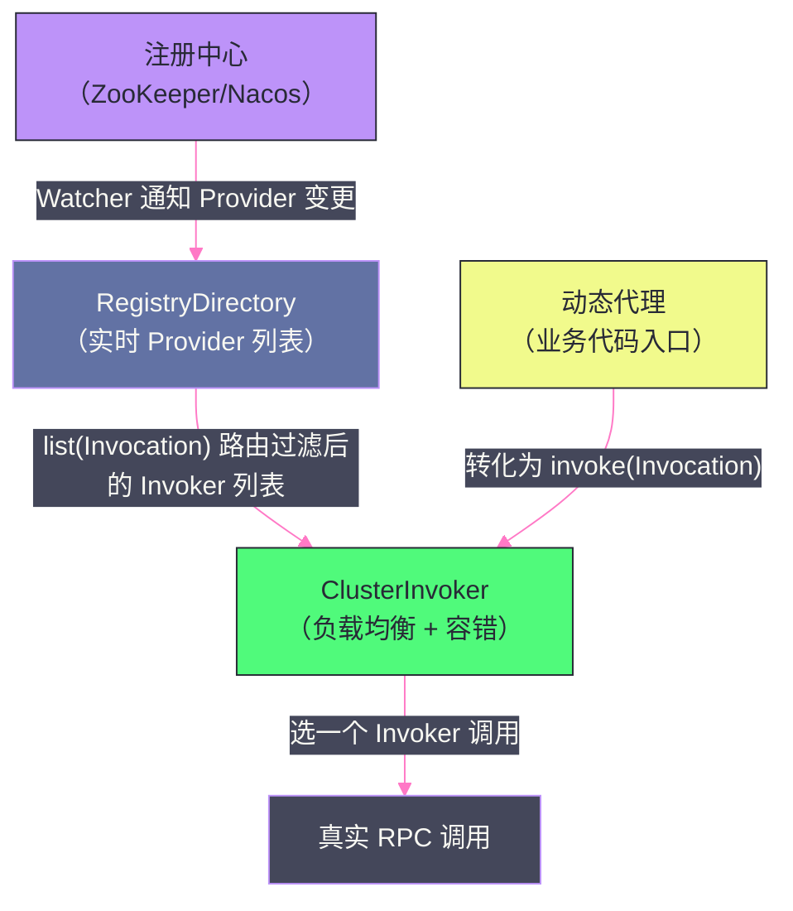

# 03 服务导出与服务引用——从 @DubboService 到网络监听

## 摘要

Dubbo 的服务导出与服务引用是 Provider 和 Consumer 启动时最核心的初始化流程。服务导出完成了从"业务实现类"到"可被远程调用的 TCP 端口"的转换；服务引用完成了从"接口声明"到"可透明调用远程服务的动态代理对象"的转换。这两个流程涉及多层抽象的协同：Config 层的参数解析、Proxy 层的 Invoker 创建、Protocol 层的 Exporter/Invoker 管理、Registry 层的注册与订阅、Transport 层的 Netty Server/Client 初始化。本文沿着源码的主干路径，逐层拆解这两个流程的关键步骤，重点解释每一步"为什么这样设计"。

---

## 第 1 章 服务导出全流程

### 1.1 触发时机：Spring 生命周期的钩子

当使用 Spring Boot 集成 Dubbo 时，`@DubboService` 注解的类由 `ServiceAnnotationPostProcessor`（Dubbo 3.x）解析，最终每个服务都会创建一个 `ServiceConfig` 对象。

服务导出的触发时机是 **Spring 容器刷新完成（`ContextRefreshedEvent`）** 之后：Dubbo 监听 Spring 的 `ContextRefreshedEvent` 事件，在所有 Bean 初始化完成后才开始导出服务。这个设计的原因是：服务实现类（Provider Bean）可能依赖其他 Spring Bean（如 DAO、Cache），必须等所有依赖都初始化完毕，Provider 才能正确地处理请求。

如果在 Spring Bean 初始化未完成时就开放了网络端口，Consumer 可能在 Provider 还没准备好时就发送请求，导致 NPE 或逻辑错误。这就是**服务导出必须在 Spring 容器就绪后**的根本原因。

### 1.2 ServiceConfig.export()：导出的入口

`ServiceConfig.export()` 是服务导出的核心方法，主要逻辑：

```
ServiceConfig.export()
  ├── 1. 参数校验与配置合并
  │      将 @DubboService 注解参数 + dubbo.provider.* 全局配置
  │      + application.yaml 中的 dubbo.* 配置合并为最终配置
  │
  ├── 2. 延迟导出判断
  │      如果配置了 delay > 0，启动定时任务在 delay 毫秒后执行 doExport()
  │
  └── 3. 调用 doExport() → doExportUrls()
```

### 1.3 doExportUrls()：多协议多注册中心

Dubbo 支持同一个服务同时用多个协议导出、注册到多个注册中心。`doExportUrls()` 遍历所有协议和注册中心的组合：

```java
private void doExportUrls() {
    // 构建注册中心 URL 列表（如 zookeeper://127.0.0.1:2181）
    List<URL> registryURLs = ConfigValidationUtils.loadRegistries(this, true);
    
    // 遍历所有配置的协议（dubbo, triple, http...）
    for (ProtocolConfig protocolConfig : protocols) {
        // 构建服务的基础路径（接口名 + 版本 + 分组）
        String pathKey = buildPathKey(protocolConfig);
        
        // 核心：对每个协议 + 每个注册中心，执行一次导出
        doExportUrlsFor1Protocol(protocolConfig, registryURLs);
    }
}
```

**多协议导出的工程意义：** 在迁移场景中，可以让同一个服务同时支持旧版 Dubbo 协议和新版 Triple 协议，新旧客户端都能调用，平滑过渡。

### 1.4 doExportUrlsFor1Protocol()：核心导出逻辑

这个方法完成了从"配置"到"网络监听"的关键转换，分为三个阶段：

**阶段一：构建 Provider URL**

将所有配置信息（接口名、版本、分组、超时、重试次数、序列化方式等）编码为一个 URL 对象：

```
dubbo://192.168.1.1:20880/com.example.UserService
  ?application=user-provider
  &interface=com.example.UserService
  &version=1.0.0
  &group=default
  &timeout=3000
  &retries=2
  &serialization=hessian2
  &methods=getUserById,createUser
  &side=provider
  &timestamp=1709000000000
```

**阶段二：创建 Invoker（将业务实现包装为可调用对象）**

```java
// ref 是 @DubboService 注解的业务实现类实例
// interfaceClass 是服务接口的 Class
// registryURL 是注册中心地址
Invoker<?> invoker = proxyFactory.getInvoker(ref, interfaceClass, registryURL);
```

`ProxyFactory`（默认 `JavassistProxyFactory`）通过字节码生成一个 `AbstractProxyInvoker`，其 `invoke(Invocation invocation)` 方法内部通过反射或直接字节码调用 `ref` 对象的对应方法。

这一步将"业务实现类"抽象为了 `Invoker`——后续无论是 Filter 链处理、还是 Protocol 层导出，都只操作 `Invoker` 接口，与具体业务实现解耦。

**阶段三：通过 Protocol 导出为 Exporter**

```java
// registryURL 类似：registry://127.0.0.1:2181?registry=zookeeper&...
// 在此 URL 上叠加 export 参数（Provider 的真实地址）
URL registryURL = registryURL.addParameterAndEncoded(
    Constants.EXPORT_KEY,
    url.toFullString()  // Provider 的完整 URL
);

// 调用 protocol.export()，实际上是调用 RegistryProtocol.export()
// （因为 URL 的 protocol 是 "registry"，Adaptive 会路由到 RegistryProtocol）
Exporter<?> exporter = protocol.export(wrapperInvoker);
```

### 1.5 RegistryProtocol.export()：注册中心协议的两件事

`RegistryProtocol.export()` 做了两件事：

**第一件事：启动真正的服务端（DubboProtocol.export）**

```java
// 从 registryURL 中取出 Provider 的真实 URL（export 参数）
URL providerUrl = getProviderUrl(originInvoker);
// 用真实协议（dubbo/triple）导出，此时启动 Netty Server
final ExporterChangeableWrapper<T> exporter = doLocalExport(originInvoker, providerUrl);
```

`doLocalExport()` 调用了 `DubboProtocol.export()`（或 `TripleProtocol.export()`），这一步**真正启动了 Netty Server**，开始监听 TCP 端口（默认 20880），等待 Consumer 连接。

**第二件事：注册到注册中心**

```java
// 获取注册中心实现（ZooKeeper / Nacos / ETCD）
final Registry registry = getRegistry(registryURL);
// 获取要注册的 URL（简化版的 Provider URL，去掉无需注册的参数）
final URL registeredProviderUrl = getUrlToRegistry(providerUrl, registryURL);
// 注册：将 Provider URL 写入注册中心
// 对 ZooKeeper：在 /dubbo/{接口名}/providers/ 下创建临时节点
registry.register(registeredProviderUrl);
```

同时，订阅注册中心的 configurators 路径（监听动态配置变更，如超时时间、权重的运行时修改）：

```java
registry.subscribe(overrideSubscribeUrl, overrideSubscribeListener);
```

至此，服务导出完成：
- Netty Server 已启动，可以接受 TCP 连接；
- Provider 地址已注册到注册中心，Consumer 可以发现它。

---

## 第 2 章 延迟暴露与服务预热

### 2.1 延迟暴露（Delay Export）

**是什么：** 通过配置 `delay` 参数，让服务在启动后等待一定时间再对外暴露（注册到注册中心）：

```yaml
dubbo:
  provider:
    delay: 5000  # 5 秒后才注册到注册中心
```

**为什么需要：** 某些场景下，服务启动后需要一段"预热时间"——比如需要加载大型本地缓存（如从数据库加载数百万条记录到内存），或需要建立连接池、预热 JIT 编译。如果在这些初始化完成前就注册到注册中心，Consumer 可能将请求路由到尚未就绪的 Provider，导致超时或错误。

**注意：** 延迟暴露只是延迟"注册到注册中心"（即对 Consumer 可见）的时机，并不延迟"启动 Netty Server"。Netty Server 在延迟期内已经在监听端口，只是 Consumer 还不知道这个 Provider 的存在。

### 2.2 服务预热（Warmup）

**是什么：** 服务预热是针对负载均衡的权重控制机制。当一个 Provider 刚启动时，其权重从 0 逐渐增加到配置的正常权重，经过 `warmup`（默认 10 分钟）时间后才达到完整权重。

**为什么需要：** JVM 有 JIT（Just-In-Time）编译——一段代码被执行足够多次后，JVM 会将其编译为高效的本机代码。刚启动的 JVM 实例，所有代码都在解释执行，性能比预热后的 JVM 低 1~5 倍。如果 Consumer 一启动就将大量请求发往新 Provider（与其他节点权重相同），新 Provider 因为解释执行速度慢，可能出现大量超时。

服务预热的权重计算（`RoundRobinLoadBalance` 的权重计算逻辑）：

```java
int warmup = invoker.getUrl().getParameter("warmup", DEFAULT_WARMUP); // 默认 10 分钟
int weight = invoker.getUrl().getParameter("weight", DEFAULT_WEIGHT); // 默认 100
long timestamp = invoker.getUrl().getParameter("timestamp", 0L);      // Provider 启动时间戳

int uptime = (int)(System.currentTimeMillis() - timestamp);
if (uptime > 0 && uptime < warmup) {
    // 线性插值：启动时间越长，权重越大
    weight = (int)((float)uptime / ((float)warmup / (float)weight));
}
// uptime >= warmup 后，使用完整的 weight
```

这样，刚启动的节点权重极低（接近 0），随着运行时间增加，权重线性增长，10 分钟后达到完整权重，承担与其他节点相同比例的流量。

---

## 第 3 章 服务引用全流程

### 3.1 触发时机与 ReferenceConfig

`@DubboReference` 注解的字段由 `ReferenceAnnotationBeanPostProcessor` 处理，在 Bean 初始化时通过 `ReferenceConfig.get()` 获取代理对象并注入。

`ReferenceConfig` 是服务引用的核心配置对象，封装了：
- 接口类型（`interface`）
- 版本和分组（`version`、`group`）
- 注册中心地址（从全局配置继承）
- 调用配置（`timeout`、`retries`、`loadbalance`、`cluster`）

### 3.2 ReferenceConfig.init()：引用初始化

`ReferenceConfig.init()` 的主要流程：

```
1. 参数合并：将 @DubboReference 注解参数 + 全局配置合并
   ↓
2. 检查接口类型合法性（必须是 interface 而非 class）
   ↓
3. 根据配置决定引用模式：
   ├── 直连模式（url 参数指定 Provider 地址）→ 跳过注册中心，直接引用
   └── 注册中心模式（通过注册中心发现 Provider）→ 主流程
   ↓
4. 调用 createProxy(map)，创建并返回代理对象
```

### 3.3 createProxy()：代理创建的核心路径

**步骤一：构建注册中心 URL，通过 RegistryProtocol.refer() 创建 ClusterInvoker**

```java
// 对每个注册中心 URL，通过 protocol.refer() 创建 Invoker
// URL 的 protocol 是 "registry"，Adaptive 路由到 RegistryProtocol
Invoker<?> invoker = REF_PROTOCOL.refer(interfaceClass, url);
```

`RegistryProtocol.refer()` 内部：

```java
public <T> Invoker<T> refer(Class<T> type, URL url) throws RpcException {
    // 1. 从 registry 参数获取真正的注册中心类型（zookeeper/nacos）
    url = getRegistryUrl(url);
    
    // 2. 获取注册中心实例
    Registry registry = registryFactory.getRegistry(url);
    
    // 3. 构建 RegistryDirectory（持有从注册中心获取的 Invoker 列表）
    RegistryDirectory<T> directory = new RegistryDirectory<>(type, url);
    
    // 4. 向注册中心订阅服务（providers/configurators/routers 三个路径）
    // 订阅完成后，directory 内部已有所有 Provider 的 Invoker
    directory.subscribe(toSubscribeUrl(subscribeUrl));
    
    // 5. 通过 Cluster（默认 FailoverCluster）将 directory 封装为 ClusterInvoker
    // ClusterInvoker 内部实现负载均衡和容错策略
    return cluster.join(directory);
}
```

**步骤二：多注册中心时，合并多个 ClusterInvoker**

如果配置了多个注册中心，每个注册中心都会产生一个 `ClusterInvoker`，再由 `StaticDirectory` + `Cluster` 合并为一个统一的 `ClusterInvoker`。

**步骤三：通过 ProxyFactory 生成动态代理**

```java
// ClusterInvoker 封装了所有的负载均衡和容错逻辑
// ProxyFactory 为其生成动态代理，暴露给业务代码
return (T) proxyFactory.getProxy(invoker);
```

`JavassistProxyFactory.getProxy()` 通过字节码生成代理类，代理类的每个方法调用都会转化为 `invoker.invoke(invocation)` 调用。

### 3.4 RegistryDirectory：动态服务列表

`RegistryDirectory` 是服务引用中最关键的数据结构——它是 Consumer 侧 Provider 列表的实时视图：

- **持有 Provider 列表**：内部维护一个 `Map<String, Invoker<?>>` 缓存，key 是 Provider URL，value 是对应的 `Invoker`；
- **实时更新**：通过注册中心的 Watcher，当 Provider 列表变化（新 Provider 上线、旧 Provider 下线、Provider 配置变更），`RegistryDirectory` 收到通知，刷新内部 Invoker 列表；
- **路由过滤**：提供 `list(Invocation)` 方法，根据路由规则（标签路由、条件路由）过滤并返回合适的 Invoker 列表，供负载均衡选择。



---

## 第 4 章 Netty Server 的初始化细节

### 4.1 DubboProtocol.export() 如何启动 Netty Server

`DubboProtocol.export()` 是真正启动 TCP 监听端口的地方：

```java
public <T> Exporter<T> export(Invoker<T> invoker) throws RpcException {
    URL url = invoker.getUrl();
    
    // 服务标识：接口名:版本:端口
    String key = serviceKey(url);
    DubboExporter<T> exporter = new DubboExporter<T>(invoker, key, exporterMap);
    exporterMap.put(key, exporter);  // 注册到 Exporter 映射表（用于请求路由）
    
    // 启动 Netty Server（如果该端口尚未监听）
    openServer(url);
    
    // 初始化序列化优化（Kryo/FST 等需要预先注册类）
    optimizeSerialization(url);
    
    return exporter;
}

private void openServer(URL url) {
    String key = url.getAddress();  // "192.168.1.1:20880"
    
    // 同一端口只启动一次 Netty Server（多个服务可以共用同一端口）
    ExchangeServer server = serverMap.get(key);
    if (server == null) {
        synchronized (this) {
            server = serverMap.get(key);
            if (server == null) {
                server = createServer(url);
                serverMap.put(key, server);
            }
        }
    }
}
```

注意：**多个服务接口可以共用同一个 Netty Server（同一端口）**。`exporterMap` 按服务标识路由请求——Netty Server 收到请求后，根据请求中的服务名/版本/分组从 `exporterMap` 中找到对应的 `Exporter`，再调用其 `Invoker`。

### 4.2 Netty Server 的线程模型

Dubbo 的 Netty Server 采用 [[Netty]] 的 Reactor 线程模型：

```
连接建立：Boss EventLoopGroup（通常 1 个线程）
         处理 accept，将连接注册到 Worker EventLoopGroup
         
数据读写：Worker EventLoopGroup（默认 CPU 核心数 × 2 个线程）
         处理 I/O 事件（读取请求、写入响应）
         
业务处理：Dubbo 业务线程池（默认 FixedThreadPool，200 个线程）
         Worker 线程收到完整请求后，将任务投递到业务线程池
         业务线程调用 Invoker 执行业务逻辑
         结果写回 Channel（可在业务线程或 I/O 线程中写，取决于 Dispatcher）
```

**Dispatcher 的作用：** 控制消息处理在哪个线程中执行：

| Dispatcher | 含义 |
|:---|:---|
| `all`（默认）| 所有消息（请求/响应/连接/断开/心跳）都派发到业务线程池处理 |
| `direct` | 所有消息直接在 I/O 线程（Worker）中处理（不建议，阻塞 I/O 线程） |
| `message` | 只有请求/响应派发到业务线程池，其他（心跳/连接/断开）在 I/O 线程处理 |
| `execution` | 只有请求（收到的消息）派发，响应（回复的消息）在 I/O 线程处理 |
| `connection` | 连接/断开事件在单独的有序线程中处理（保证事件顺序），其他在业务线程池 |

生产中推荐 `all`（默认）或 `message`，避免业务逻辑阻塞 I/O 线程。

> [!warning] 生产避坑
> **业务线程池的大小（`threads` 参数，默认 200）是 Dubbo 调优的关键参数**。如果业务处理时间长（如有数据库查询），200 个线程可能很快被占满，导致后续请求在队列中等待或被拒绝。观察 `threadpool.active_count` 和 `threadpool.queue_size` 监控指标，适当调整线程池大小。但也不要无限增大——线程过多会增加 CPU 上下文切换开销。通常将线程池大小设置为 QPS × 平均响应时间（秒）的 2~3 倍作为初始值。

---

## 第 5 章 本地缓存容灾：注册中心宕机不影响服务

### 5.1 Provider 地址的本地缓存

Consumer 在订阅注册中心获取 Provider 列表后，会将 Provider URL 列表**持久化到本地文件**（默认 `~/.dubbo/dubbo-registry-{application}-{host}.cache`）。

当注册中心宕机后，如果 Consumer 重启，会首先尝试从本地缓存文件加载 Provider 列表，即使注册中心不可用，也能正常发现 Provider 并建立连接。

本地缓存文件的格式：

```properties
# Dubbo Registry Cache
# Generated by Dubbo, DO NOT modify!
com.example.UserService\:1.0.0=\
  dubbo://192.168.1.1\:20880/com.example.UserService?...\
  dubbo://192.168.1.2\:20880/com.example.UserService?...
```

### 5.2 内存中的 Provider 列表

除了本地文件缓存，`RegistryDirectory` 在内存中也维护了当前的 Provider Invoker 列表。注册中心宕机后，内存中的 Provider 列表不受影响，已建立连接的 Consumer 可以继续正常调用。

这就是为什么说"注册中心宕机不影响已有调用"：
- **已在线的 Consumer**：内存中有 Provider 列表，可以继续调用；
- **重启的 Consumer**：从本地缓存文件恢复 Provider 列表，可以正常工作；
- **唯一受影响的**：新上线的 Provider 无法被 Consumer 发现，因为注册中心不可用，Provider 的注册通知无法推送给 Consumer。

---

## 小结

本文沿着服务导出和服务引用的源码主干路径，梳理了两个流程的关键步骤：

**服务导出链路：**
`@DubboService` → `ServiceConfig.export()` → `doExportUrlsFor1Protocol()` → `ProxyFactory.getInvoker()`（业务实现包装为 Invoker）→ `RegistryProtocol.export()` → `DubboProtocol.export()`（启动 Netty Server）→ `Registry.register()`（注册到注册中心）

**服务引用链路：**
`@DubboReference` → `ReferenceConfig.init()` → `createProxy()` → `RegistryProtocol.refer()` → `Registry.subscribe()`（订阅 Provider 列表）→ `RegistryDirectory`（实时 Provider 视图）→ `Cluster.join(directory)`（封装为 ClusterInvoker）→ `ProxyFactory.getProxy()`（生成动态代理）

两个关键的工程设计值得特别记忆：
1. **延迟暴露**在 Spring 容器就绪后才注册，防止 Provider 未准备好就接收流量；
2. **本地缓存**使得注册中心宕机不影响已有 Consumer 的调用，大幅提升了整体系统的可用性。

下一篇文章将深入注册中心的实现细节——ZooKeeper 和 Nacos 在 Dubbo 中的节点结构差异，以及 Dubbo 3.x 应用级服务发现的演进背景与实现。

---

> [!note] 思考题
> 1. Dubbo 内置的负载均衡策略包括：Random（加权随机）、RoundRobin（加权轮询）、LeastActive（最少活跃调用）和 ConsistentHash（一致性哈希）。LeastActive 将请求发往当前活跃调用数最少的 Provider——适合处理能力不均匀的场景。但 LeastActive 需要实时统计活跃数——在高并发下统计的延迟是否会导致多个 Consumer 同时选择同一个 Provider（'羊群效应'）？
> 2. 一致性哈希（ConsistentHash）将相同参数的请求路由到同一个 Provider——适合有状态缓存的场景。但当 Provider 扩缩容时，一致性哈希只迁移部分请求。在什么场景下 ConsistentHash 负载均衡可能导致热点问题（某个 Provider 承受不均匀的负载）？虚拟节点如何缓解？
> 3. Dubbo 3.x 引入了自适应负载均衡——基于 Provider 的实时响应时间和成功率动态调整权重。响应慢或错误多的 Provider 自动降权。这种策略在 Provider 短暂变慢（如 GC 暂停）时是否会过度惩罚？恢复后权重如何快速回升？
