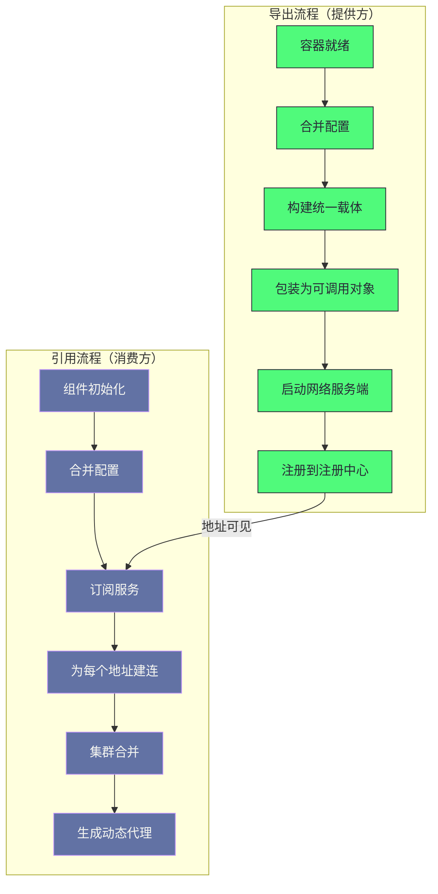

# 03 服务导出与服务引用——从 @DubboService 到网络监听

**摘要：**

导出与引用是框架启动时最关键的两个流程：**导出把"业务实现类"变成"可被远程调用的网络端口"**，**引用把"接口声明"变成"可透明调用远程服务的代理对象"。** 两条流程的骨架相同（都经过"配置、代理、协议、注册"四层），但方向相反；而它们有一处关键的不对称：**引用比导出多一步"集群合并"**（因为"提供方是单点，而消费方面对的是多个提供方"）。本文按"两个流程的定位 → 导出的触发时机 → 导出的主干路径 → 注册协议做的两件事 → 延迟暴露与预热 → 引用的主干路径 → 动态服务列表"展开。先说明两条流程各自完成什么、它们的对称与不对称、以及"为什么导出必须等容器就绪"。然后逐层拆解导出的三阶段（构建统一载体、包装为可调用对象、导出为对外服务）与注册协议的两件事（启动服务端、注册地址）及它们的顺序意义。之后讲"延迟暴露"与"服务预热"这两处"让新实例不被流量打死"的机制、以及它们延迟的是"哪一步"。接着是引用的三步、动态服务列表的实时更新与路由过滤、以及它的一致性模型。最后是生产落地、排查推演与边界反例。

---

## 第 1 章 两个流程与它们的位置

### 1.1 导出完成什么

**"服务导出"完成的转换是"从业务实现类到可被远程调用的网络端口"。**

**它包含三件事**：**其一，"把业务实现包装成统一的调用对象"**（因此"后续的治理与通信都能以它为操作对象"）；**其二，"在本地端口启动网络服务端"**（因此"服务真正可被访问"）；**其三，"把服务信息注册到注册中心"**（因此"服务可被发现"）。

**三件事的顺序有意义**：**"包装"必须在"导出"之前**（因为"导出需要它"），**而"注册"应当在"导出"之后**（因为"注册意味着'对外宣告可用'"，而"如果还没启动服务端，宣告就是错的"）。

### 1.2 引用完成什么

**"服务引用"完成的转换是"从接口声明到可透明调用远程服务的代理对象"。**

**它也包含三件事**：**其一，"向注册中心订阅服务，拿到地址列表"**；**其二，"为每个地址建立到提供方的连接"**；**其三，"把多个连接合并成一个入口并生成代理"。**

**三件事的关系是"逐层收敛"**：**"订阅"产出"地址列表"**，**"建连"产出"多个可调用对象"**，**"合并与代理"产出"一个入口"。** **因此"引用过程的实质是'把多个目标收敛成一个接口实例'"。**

### 1.3 两条流程的对称与不对称

**两条流程在结构上是对称的，但有一处关键的不对称。**

**对称之处在于"都经过配置层、代理层、协议层、注册层"**——**而"方向相反"**：**导出是"从业务到网络"，引用是"从网络到业务"。**

**不对称之处在于"引用多了一步'集群合并'"**——**因为"提供方是单点，而消费方面对的是'多个提供方'"。** **因此"负载均衡与容错'只存在于消费方"**——**这条不对称决定了"治理逻辑的位置"。**

**这条不对称的实践含义是"排查'流量分配'与'失败重试'类问题时，方向在消费方"**——**而"排查'服务不可用'类问题时，方向在提供方"。** **因此"知道这处不对称"，就"知道了两类问题的方向"。**

### 1.4 一个类比：店铺开业与顾客找店

**把两条流程类比成"店铺开业与顾客找店"会更容易理解它们。**

**"店铺装修完成、货架摆好"对应"业务实现准备好"**——**而"装修没完成就开门迎客"对应"容器未就绪就开放端口"。**

**"挂上招牌并开门"对应"启动网络服务端"。**

**"到商业协会登记'本店地址与营业时间'"对应"注册到注册中心"。**

**"顾客先查协会名录、记下地址，然后直接去店里"对应"订阅地址后直连"**——**而"协会临时关门不影响'已经记下地址的顾客'"对应"注册中心宕机不影响已有调用"。**

**"顾客手上可能有好几家分店的地址，挑一家去"对应"负载均衡"**——**而"第一家没开门就换第二家"对应"容错重试"。**

**"新开的店先'慢慢放客'"对应"服务预热"**——**因为"新店的伙计还没熟练"。**

**这个类比的用处在于"它把'导出与引用的不对称'说清楚了"**：**"开店"是"一家一家开"，而"找店"是"从名录里挑一家"**——**因此"挑的逻辑（负载均衡）只在顾客侧存在"。**

### 1.5 一条贯穿两个流程的原则

**有一条原则贯穿两个流程，而它值得单独提出。**

**这条原则是"不要在真正可用之前宣告可用"**——**而它体现为三处**：**"导出等容器就绪"**（第 2 章）、**"先启动服务端再注册"**（第 4.3 节）、**"延迟暴露"**（第 5.1 节）。

**三处的共同特征是"它们都在保证'对外状态'与'实际状态'一致"**——**而"一致"的判据分别是"容器事件""动作顺序""显式等待"。**

**这条原则的价值在于"它解释了'为什么启动流程有那么多看似冗余的步骤'"**：**因为"每一步都在'防止一种不一致'"**——**而"如果去掉任何一步，都会出现'宣告可用但实际不可用'的窗口"。**

**而"这类窗口"的后果是"调用失败"**——**因此"这类'看似冗余'的步骤"实际上是"可用性的保障"。** **这与第 2 篇讲的"自动叠加防止遗漏"是同一类设计**：**"用框架的强制动作'替代使用者的自觉'"。**

### 1.6 两个流程的时序关系

**把两个流程的时序画出来，能看清"它们各自依赖什么"。**

**图中最值得注意的是"两条流程通过'注册中心'间接相连"**：**导出的最后一步'让地址可见'，而引用的第三步'订阅地址'**——**而"两者之间'没有直接依赖'"。**

**这条"间接相连"的性质解释了一处重要特性**：**"两个流程'可以在时间上完全错开'"**——**也就是说"提供方可以先注册，消费方'稍后再订阅'"**，**反之"消费方先启动、提供方后上线'也能自动发现'"。

**而"这种时序上的松耦合"正是"服务发现机制的价值"**——**因为它让"上下游的部署顺序'不再需要严格协调'"。** **因此"这张图里最关键的边'不是任何一条实线，而是那条连接两条流程的虚线'"。**

---

## 第 2 章 导出的触发时机

### 2.1 为什么等容器就绪

**导出的触发时机是"容器刷新完成之后"，而这处时机的选择有明确理由。**

**理由是"业务实现'可能依赖其他组件'"**：**例如"它可能依赖数据访问对象或缓存组件"**——**因此"必须等这些依赖都初始化完毕，它才能正确处理请求"。**

**而"如果在依赖未就绪时就开放端口"，后果是"消费方可能'在提供方还没准备好时'发来请求"**——**而"结果是空指针或逻辑错误"。**

**因此"等容器就绪"这条约束的实质是"保证'对外宣告可用'与'实际可用'一致"**——**而"这两者不一致"是"启动阶段最容易出问题的地方"。**

### 2.2 触发机制

**触发机制是"监听容器的刷新完成事件"。**

**它的做法是"在容器初始化完成后'才开始导出'"**——**因此"导出'发生在所有业务组件就绪之后"。**

**这条机制的意义在于"它把'时机'交给了容器"**——**也就是说"框架'不需要自己判断'依赖是否就绪'"，**而**"容器'最清楚这件事'"。**

**这与第 4 篇讲的"用哨兵简化边界判断"是不同层面的手法**：**这里关注的是"把判断责任交给'最清楚的一方'"**——**而"这类分工"能"避免框架重复实现容器的逻辑"。**

### 2.3 这处时机的代价

**"等容器就绪"这处时机也有代价，而代价落在两处。**

**第一处是"启动时间变长"**：**因为"导出必须等'所有业务组件就绪'"，所以"启动时间'包含'所有组件的初始化时间'"**——**而"如果某个组件初始化很慢，导出会被推迟"。**

**第二处是"依赖链的问题会延迟暴露"**：**因为"导出在最后"，所以"某个业务组件的初始化失败'会表现为'服务没起来'"**——**而"这类现象的根因'不在服务本身'"**。

**两处代价的共同特征是"它们是'把导出放在最后'的对价"**：**"放在最后"保证了"宣告可用即真的可用"，代价是"启动更慢、根因更远"。** **而"这两处代价"在"排查'服务未注册'类问题时'都需要被考虑进去'"。**

### 2.4 一处关于"时机选择"的经验

**"把导出放在容器就绪之后"这处时机选择，体现了一条更一般的经验。**

**这条经验是"让'时机的判断'由'最清楚情况的一方'负责"**——**也就是说"框架'不必自己实现依赖检查'"，**而**"容器'最清楚'哪些组件已就绪'"。**

**这条经验的收益是"避免重复实现"**：**因为"依赖检查'是容器的职责'"**，**而"框架重复实现'会带来'两套判断可能不一致'的问题"。

**因此"设计'需要等待某个条件'的功能时，应当先问'谁最清楚这个条件是否满足'"**——**而"把等待交给那一方'往往比自己实现更可靠'"。

**这条经验的通用性在于"它把'时序问题'转化成了'职责划分问题'"**——**而"这类转化'能让实现更简单且更可靠'"。** **这与第 1 篇讲的"框架与容器的职责边界"是同一类判断**：**"划清边界'比'各自实现'更有效'"。**

---

## 第 3 章 导出的主干路径

### 3.1 入口与三步

**导出的入口方法做三件事。**

**第一件是"参数校验与配置合并"**——**它"把注解参数、全局配置、配置文件里的配置'合并为最终配置'"。**

**第二件是"延迟判断"**——**它"如果配置了延迟，则'在延迟之后才执行真正的导出'"。**

**第三件是"执行真正的导出"**。

**三件事里"第二件"是"可选路径"**——**而"第一件"是"所有导出都要走的前置步骤"。** **因此"配置合并的结果'决定了后续所有行为'"**——**这也是"配置是排查第一份材料"的又一处体现**（第 2 篇已展开这条判断）。

### 3.2 多协议多注册中心的组合

**导出支持"多协议乘多注册中心"的组合，而这处设计有明确的用途。**

**用途是"迁移场景下的平滑过渡"**：**让"同一个服务'同时支持旧协议与新协议'"**——**因此"新旧客户端都能调用"。**

**这条能力的实现方式是"遍历协议与注册中心的组合，对每组执行一次导出"**——**因此"一个服务可以'被多次导出'"**（对应"多个协议"）与"被注册到多处"（对应"多个注册中心"）。

**这处设计的收益是"迁移不需要停机"**——**而"它的代价是'导出次数的乘积增长'"**（协议数乘注册中心数）。** **因此"该不该用多协议"取决于"是否真的需要'同时支持两类客户端'"**。

**这条能力的形态与第 13 篇讲的"渐进式过渡"是同一类**：**"用'同时支持两种'替代'一次性切换'"**——**而"这类做法"在"客户端升级缓慢"的环境里"往往是必需的"。**

**一处值得留意的细节是"多协议导出'需要不同的端口'"**：**因为"每个协议'监听自己的端口'"**，**所以"多协议'意味着多端口监听'"**——**而"这带来'端口规划'的问题"**（例如"需要确保'防火墙放行所有端口'"）。

**这条细节的实践含义是"多协议导出的运维成本'不只在代码侧'"**——**它还包括"端口规划、防火墙规则、监控配置"**——**因此"该不该用多协议"应当"把运维成本也计入"。**

### 3.3 阶段一：构建统一载体

**导出的第一阶段是"把所有配置编码成一个统一载体"。**

**编码的内容包括**：**协议类型、地址、接口名、版本、分组、超时、重试次数、序列化方式、方法列表、以及"这是提供方侧"。**

**因此"这个载体'就是一份完整的调用说明'"**——**而"消费方拿到它'就能直接调用'"**（第 1 篇已展开这处设计）。

**一处细节值得留意**：**载体里包含"启动时间戳"**——**而"它正是'服务预热'的输入"**（第 5.3 节展开）。** 因此"一个看似无关的字段'承载着一处治理能力'"**——**而"这类'字段的多重用途'在长期演进的系统里很常见"。

### 3.4 阶段二：包装为可调用对象

**第二阶段是"把业务实现包装成统一的可调用对象"。**

**包装的方式是"通过代理工厂生成一个对象，它的调用方法'内部转发到业务实现'"**——**而"转发方式'可以是反射，也可以是直接生成的字节码调用'"。**

**这一步的意义在于"后续所有环节'只操作这个统一对象'"**——**因此"过滤器链、协议导出、注册'都不需要知道具体业务实现"。**

**这与第 1 篇讲的"统一调用抽象"是同一件事**——**而本篇补充的是"它'在导出的哪一步被创建'"。** **因此"导出的第二阶段'就是统一抽象的诞生点'"。**

### 3.5 阶段三：导出为对外服务

**第三阶段是"通过协议把可调用对象导出为对外服务"。**

**而"这一步的实际执行者'不是协议本身，而是注册协议"**——**因为"导出时用的载体是'注册中心的地址'"，**因此**"自适应扩展'会把它路由到注册协议'"。**

**注册协议在这里的角色是"一个包装者"**：**它"在导出之前'先做两件事'"，然后"才把请求转给真正的协议"。**

**这处设计的巧妙之处在于"它让'注册'与'导出'对使用者透明"**——**也就是说"使用者只调用一次导出，而框架内部'完成了启动服务端与注册两件事'"。**

**这与第 2 篇讲的"装饰器自动叠加"是同一手法**：**"用装饰器'把额外动作挂到主流程上'"，**因此**"使用者不需要知道它的存在"。**

### 3.6 一处关于"配置合并"的观察

**"配置合并"这处前置步骤值得单独说明，因为它决定了"后续所有行为"。**

**合并的来源有三处**：**"注解上的参数""全局配置""配置文件里的配置"**——**而"合并的规则是'就近覆盖'"**（也就是"越具体的来源优先级越高"）。

**这条规则的意义在于"它让'全局默认值'与'个别覆盖'可以共存"**：**因此"公共配置可以写在全局"，而"个别服务可以覆盖它"。**

**而"合并结果的可见性"是排查的关键**：**因为"最终生效的是合并后的值"，所以"只看某一处配置'可能得出错误结论'"**——**因此"排查时应当'看合并后的结果'，而不是'看某一处配置'"。

**这条观察给出一条实践纪律**：**"当配置来源有多个时，排查的第一步是'确认最终生效值'"**——**而"这一步"能"避免'在错误的配置上分析问题'"。** **这与第 2 篇讲的"配置是第一份材料"是同一建议的细化**：**"不仅要看配置，还要看'合并后的配置'"。**

---

## 第 4 章 注册协议做的两件事

### 4.1 启动真正的服务端

**注册协议做的第一件事是"用真实协议启动服务端"。**

**具体过程是"从载体里取出'提供方的真实地址'，然后用真实协议导出"**——**而"这一步'真正启动了网络服务端，开始监听端口'"。**

**"真正"这个词在这里很重要**：**它区分了"逻辑上的导出"与"物理上的监听"**——**也就是说"前面的步骤'都只是准备'"，而"这一步才让'服务可被连接'"。**

**这条区分的实践含义是"排查'端口未监听'类问题时，方向在'这一步是否执行成功'"**——**而"常见原因包括'端口被占用'与'协议配置错误'"。

### 4.2 注册到注册中心

**第二件事是"把服务信息注册到注册中心"。**

**具体过程是"先获取注册中心实现，再把'简化后的服务信息'写入注册中心"**——**而"简化"的含义是"去掉'无需注册的参数'"**（因为"注册的目的是'让消费方能找到并调用'"，而"有些参数'消费方自己会补上'"）。

**而"注册"这个动作的具体形态"取决于注册中心的实现"**——**例如"在某种注册中心里是'创建一个临时节点'"**，**而在另一种里是"写入一条记录"。**

**"临时节点"这个形态值得留意**：**它意味着"节点'与提供方的会话绑定'"，**因此**"提供方异常退出时'节点会自动消失'"**——**而"这正是'服务下线能被自动感知'的机制来源"。

### 4.3 顺序的意义

**"先启动服务端、再注册"这个顺序值得说明。**

**因为"注册意味着'对外宣告可用'"**——**而"如果'先注册、后启动'，那么在'启动完成之前'，消费方可能'已经拿到地址并发起调用'"**——**而"调用会失败"。**

**因此"这个顺序保证了'宣告可用时'服务'确实已经可用'"**——**而"这条保证"与"等容器就绪"是同一条原则的两处体现**：**"不要'在真正可用之前'宣告可用"。**

**这条原则的通用性在于"它适用于所有'发布与注册'的场景"**（例如"服务注册""域名解析""路由发布"）——**而"违反它会导致'短暂的不可用窗口'"。** **这与第 1 篇讲的"注册中心不在调用链路上"是不同层面的设计**：**那里关注"可用性依赖"，这里关注"发布顺序"。**

**一处值得留意的细节是"这个顺序'在分布式场景下需要额外的保证'"**：**因为"注册中心'可能先收到注册、后收到服务端就绪的通知'"**（如果"两者的顺序在网络层面被重排"），**所以"某些实现会'在注册前做一次本地自检'"。

**这条细节的实践含义是"发布顺序的保证'不只是'代码里的调用顺序'"**——**它还包括"网络与注册中心的语义保证"**——**因此"排查'短暂不可用'类问题时，'发布顺序'只是其中一个方向"。**

### 4.4 两件事的失败处置

**两件事的失败处置方式不同，而这处差别值得说明。**

**"启动服务端失败"（例如端口被占用）会导致"导出失败"**——**因此"整个服务'起不来'"**——**而"这是'快速失败'，有利于'在启动阶段发现问题'"。**

**而"注册失败"的处置更复杂**：**因为"服务端已经起来了"，所以"服务'本地可用'但'对外不可见'"**——**因此"它的现象是'服务没被注册'，而不是'服务起不来'"。

**两类失败的差别说明一条实践含义**：**"看到'服务起不来'时查'端口与协议'，看到'服务起来了但找不到'时查'注册中心连接与权限'"**——**而"这两类问题的方向完全不同"。**

**这条区分的价值在于"它把'启动失败'细分成了两类"**——**而"细分的依据"是"失败发生在'两件事中的哪一件'"。

### 4.5 一处关于"临时节点"的观察

**"临时节点"这个注册形态值得单独说明，因为它是"服务下线自动感知"的机制来源。**

**它的含义是"注册的节点'与提供方的会话绑定'"**——**因此"会话断开时'节点自动消失'"。** **而"会话断开"恰好是"提供方异常退出"的典型表现**——**因此"异常退出'会被自动感知'"。

**这条机制的收益是"不需要'额外的健康检查'"**：**因为"节点存在与否'本身就反映了'会话是否存活'"**——**而"这比'主动探测'更及时、成本更低"。

**而它的边界是"它只能感知'会话级'的存活"**：**也就是说"如果'提供方进程活着但业务逻辑卡死'"，那么"会话仍然存活，节点仍然存在'"**——**因此"这类'僵尸状态'不会被这套机制发现"**——**而"这解释了'为什么仍然需要应用层的健康检查'"。

**这条观察的通用性在于"它区分了'连接存活'与'服务可用'"**——**而"两者'不能互相替代'"。**

### 4.6 一处关于"包装者"的观察

**"注册协议充当包装者"这个设计值得再展开一层，因为它体现了一类"分层叠加"的通用手法。**

**它的形态是"一个实现'在把请求转给真实实现之前，先做自己的事'"**——**而"使用者'只与最外层交互'"。

**这类手法的收益是"附加动作'与主流程解耦'"**：**因为"附加动作'写在包装者里'"，所以"主流程'不需要知道它'"——**因此"增删附加动作'不需要改主流程'"。

**而它的代价是"调用链变长、定位变复杂"**：**因为"包装者'不可见'"，所以"排查时'需要主动去找'有哪些包装者'"。

**因此"这类手法的取舍是'用'可见性'换'解耦'"**——**而"该不该用"取决于"附加动作的数量与稳定性"**：**"数量少且稳定时，直接写在主流程里更直观"**；**而"数量多或需要按场景增删时，包装者更合适"。

**这条观察与第 2 篇讲的"装饰器链"是同一手法的两种形态**：**那里是"框架自动叠加"，这里是"通过配置路由到包装者"**——**而"两者的收益与代价都一致"。**

---

## 第 5 章 延迟暴露与预热

### 5.1 延迟暴露

**"延迟暴露"是指"让服务在启动后'等待一段时间再注册到注册中心'"。**

**它的用途是"给服务留出'预热时间'"**：**例如"需要加载大型本地缓存"或"需要建立连接池"。**

**而"如果没有这段等待"，后果是"消费方'把请求路由到尚未就绪的提供方'"**——**因此"出现超时或错误"。

**这条机制的设计意图与"等容器就绪"是一致的**：**"不要在真正可用之前宣告可用"**——**而"区别在于'判断依据'"**：**前者"依赖容器的就绪事件"，后者"依赖一个显式配置的等待时间"。**

### 5.2 延迟的是哪一步

**"延迟暴露延迟的是哪一步"这个问题值得明确，因为它容易被误解。**

**它延迟的是"注册到注册中心"**——**也就是"对消费方可见的时机"。**

**而"它不延迟'启动网络服务端'"**——**也就是说"在延迟期内'端口已经在监听'"，**只是**"消费方'还不知道这个提供方的存在'"。

**这条区分的实践含义是"延迟期内'已建立的连接仍可正常调用'"**——**因为"服务端是活的"。** **因此"延迟暴露不是'让服务不可用'，而是'让它暂时不被选中'"**——**而"这处区别"决定了"它不会影响'已有的调用关系'"。

### 5.3 服务预热

**"服务预热"解决的是"新实例性能偏低"这个问题。**

**问题的来源是"即时编译"**：**因为"一段代码'被执行足够多次后才会被编译为高效的本机代码'"**，**所以"刚启动的实例'大部分代码仍在解释执行'"，**而**"它的性能'可能比预热后低数倍'"。**

**而"如果消费方'一启动就把大量请求发给新实例'"**（因为"它的权重与其他节点相同"），**那么"新实例'因为执行慢而大量超时'"**。

**因此"服务预热"的做法是"让新实例的权重'从零逐渐增长'，经过一段时间后达到完整权重"。**

**这条机制的收益是"新实例'不会被流量打死'"**——**而"它的输入正是'载体里的启动时间戳'"**（第 3.3 节）。

### 5.4 两者的区别与配合

**"延迟暴露"与"服务预热"解决的是"同一类问题的两个阶段"，而它们的分工值得说清。**

**"延迟暴露"解决的是"完全不可用"这个阶段**：**也就是"缓存还没加载完、连接池还没建立"的时期**——**此时"实例'根本不能处理请求'"。**

**"服务预热"解决的是"性能偏低"这个阶段**：**也就是"能处理请求但'速度较慢'"的时期。**

**两者的配合是"先延迟暴露（跳过完全不可用期），再用预热（平滑性能爬升期）"**——**因此"两者'不是替代关系，而是接力关系'"。

**这条分工的形态与第 5 篇讲的"刷脏的三种策略层层兜底"是同一类**：**"不同阶段用不同机制"**——**而"配合起来才能覆盖'从启动到成熟'的全过程"。**

### 5.5 预热公式的解读

**预热权重的计算方式值得解读一下，因为它体现了"线性插值"这个简单而有效的思路。**

**计算方式是"用'已运行时间'相对于'预热时长'的比例，去缩放'完整权重'"**——**因此"刚启动时权重接近零，预热结束时达到完整值"。

**"线性"这个选择值得留意**：**它"不是最优的曲线"**（因为"性能爬升通常不是线性的"），**但它"简单、可预测、且不需要额外信息"。**

**因此"线性插值"的取舍是"用'简单可预测'换'精确度'"**——**而"这类取舍在'治理参数'上很常见"**（因为"参数的精确性'不如'可预测性重要'"）。

**这条解读的实践含义是"预热时长应当'按实际情况设置'"**：**因为"线性曲线的斜率'由预热时长决定'"**——**而"时长过短则'权重爬升太快、保护不足'"，"过长则'新实例长期只承担少量流量、资源闲置'"。**

### 5.6 一处关于"渐进放量"的经验

**"延迟暴露加预热"这套组合体现了一条更一般的经验：渐进放量。**

**这条经验的形态是"新实例'不一开始就承担完整流量'，而是'逐步增加'"**——**而"它的收益是'给实例'适应的时间'"。

**这条经验适用的前提是"实例的性能'会随运行时间提升'"**——**而"这个前提在'有即时编译或需要预热缓存'的系统里成立"。

**而"如果实例性能'不随运行时间变化'"**（例如"纯计算型且无编译优化的服务"），**那么"预热'没有收益，只是'浪费了实例的容量'"**——**因此"该不该预热'取决于'性能是否随时间提升'"。

**这条判据的实用价值在于"它把'预热配置'从'惯例'变成了'有条件的决策'"**——**而"无条件的照搬'会导致'资源闲置'"。** **这与第 6 篇讲的"过时优化的判断"是同一类**：**"一项优化是否值得，取决于'它依赖的假设是否成立'"。**

---

## 第 6 章 引用的主干路径

### 6.1 触发时机

**引用的触发时机是"业务组件初始化时"**——**也就是"框架在注入'标注了引用注解的字段'时，创建代理并注入"。**

**这处时机与导出不同**：**导出"等所有组件就绪"，而引用"在组件初始化时进行"**——**而"这处差异的原因是'方向不同'"**：**提供方"需要依赖就绪才能对外服务"，而消费方"需要代理就绪才能注入"。**

**而两者的共同点是"都发生在启动阶段"**——**因此"重量级动作'都被前移到了启动'"**（第 1 篇已展开这条手法）。

### 6.2 引用的三步

**引用的主干路径分三步。**

**第一步是"参数合并与模式判断"**——**它"合并配置，并'判断是直连模式还是注册中心模式'"。**

**第二步是"通过注册协议创建可调用对象"**——**而"这一步内部'完成订阅与建连'"。**

**第三步是"生成动态代理并返回"。**

**三步里"第一步的模式判断"值得留意**：**"直连模式'跳过注册中心'"，**而**"注册中心模式'走主流程'"。** **因此"直连模式'是排查问题时的有用手段'"**（因为它"绕过了注册中心，能快速判断'问题是否在注册中心侧'"）。

### 6.3 订阅的产出

**订阅的产出是"一个动态的服务列表对象"，而它做了四件事。**

**第一件是"获取注册中心实例"。**

**第二件是"创建一个持有提供方列表的目录对象"。**

**第三件是"向注册中心订阅'服务地址、动态配置、路由规则'三类路径'"**——**而"订阅完成后'目录内部已有所有提供方的可调用对象'"。**

**第四件是"通过集群策略把目录封装为一个统一的可调用对象"**——**而"这个对象'内部实现了负载均衡与容错'"。**

**四件事里"第三件"最值得留意**：**它说明"订阅的不只是地址"**——**而是"地址、配置、路由三类信息"**。** 因此"治理能力的下发'与地址发现共用同一条通道'"**——**而"这处设计"让"动态调整超时、权重、路由'不需要额外的通道'"。

### 6.4 合并与代理

**"多注册中心时'先各自创建，再合并'"这处设计值得说明。**

**它的做法是"每个注册中心产生一个可调用对象，再用一个静态目录把它们合并"**——**因此"最终'仍然只有一个入口'"。

**这处设计的意义是"对上层透明"**：**因为"合并之后'结构相同'"，所以"动态代理'不需要知道有几个注册中心'"。

**而"这处设计也带来一处代价"**：**"合并后的对象'需要处理'多个来源的地址'"**——**因此"地址去重与优先级'成为需要处理的问题'"。** **而"这类问题"是"多来源配置"的通用代价**（第 2 篇已展开"多来源需要明确优先级"）。

### 6.5 一处关于"订阅三类信息"的观察

**"订阅的不只是地址"这一点值得再展开一层，因为它决定了"治理能力的下发方式"。**

**订阅的三类是"服务地址、动态配置、路由规则"**——**而"三类共用同一条通道"**——**因此"调整超时、权重、路由'不需要额外的通信机制'"。

**这条设计的收益是"治理能力的下发'与'服务发现'复用同一套基础设施"**——**因此"新增一种治理能力'只需要新增一类订阅'"。

**而它的代价是"通道的负载变重"**：**因为"三类信息都要通过它下发"，所以"变更通知的开销'比'只下发地址'更大'"。

**因此"这处设计的取舍是'用'通道负载'换'治理能力下发的便利'"**——**而"在'变更不频繁'的场景下，这笔交换是划算的"。

**这条观察的通用价值在于"它揭示了'复用一个通道'的常见形态"**：**"把'同类的下发需求'合并到一条通道上"**——**而"代价总是'通道负载与'变更隔离性的下降'"**（因为"一类变更可能影响另一类的通知"）。

### 6.6 一处关于"直连模式"的观察

**"直连模式"这处设计值得单独说明，因为它是一处"排障用的捷径"。**

**它的形态是"在配置里'直接指定提供方地址'，从而'跳过注册中心'"**——**因此"调用路径上'不依赖任何注册中心'"。

**这条设计的收益是"它能'快速切分问题'"**：**"如果'直连能通而正常调用不通'，那么'问题在注册中心侧'"**；**"如果'两者都不通'，那么'问题在服务本身或网络'"。

**而它的代价是"它'失去了服务发现与负载均衡'"**——**因此"它只能用于'排障或临时处置'，而不适合长期使用"。

**这条观察的实用价值在于"它给出了'注册中心相关问题的二分手段'"**——**而"这类'二分手段'的价值在于'它能把'两类可能原因'一次分开'"。** **这与第 1 篇讲的"用两种读的差异做二分"是同一手法**：**"用机制差异'把排查范围一次缩小一半'"。**

---

## 第 7 章 动态服务列表

### 7.1 它是什么

**"动态服务列表"是消费方侧"提供方列表的实时视图"。**

**它的内容有三部分**：**"提供方地址到可调用对象的映射"**、**"动态配置"**、**"路由规则"。**

**而"实时视图"这个定位意味着"它会'随注册中心的变更而更新'"**——**因此"它'不是一份快照，而是一条持续更新的视图'"。

**这条定位的实践含义是"消费方'不需要主动刷新'"**——**因为"变更'由注册中心推过来'"**。** 因此"消费方的正确性'依赖'推送通道的可靠性'"**——**而"这正是'注册中心可用性'的实际影响面"（第 1 篇已展开"它宕机影响'新节点发现'但不影响'已有调用'"）。

### 7.2 实时更新

**实时更新的机制是"订阅变更通知，收到通知后重建内部列表"。**

**"重建"这个动作值得留意**：**它"不是'增量修改'，而是'按新列表重新构建'"**——**因此"它会'关闭不再存在的连接、建立新的连接'"。

**"重建"这个选择的好处是"逻辑简单、不会遗漏"**——**而"代价是'变更时'会有连接重建的开销'"。** **因此"变更频繁时'重建的开销会累积'"**（第 1 篇已展开"地址变更频率影响稳定性"）。

**这条取舍的形态与第 5 篇讲的"全量重建优于增量更新"是同一类**：**"全量'简单可靠但开销大'，增量'开销小但容易遗漏'"**——**而"在'变更不频繁'的场景下，全量的收益更大"。**

**一处值得留意的细节是"重建时'旧连接的处理'"**：**因为"重建'会关闭不再存在的连接'"，**而**"关闭连接'可能影响'正在进行中的请求'"**——**因此"某些实现会'延迟关闭'（也就是'等在途请求完成后再关'）"。

**这条细节的实践含义是"变更期间'可能出现'少量请求失败'"**——**而"这类失败'由容错机制兜底'"（第 7.4 节已展开）。** **因此"重建策略与容错策略'是配套的"**——**"只做其中一个"会导致"变更期间出现可见的失败"。**

### 7.3 路由过滤

**"路由过滤"是列表对外提供的核心能力。**

**它的作用是"根据路由规则'筛选出'适合本次调用的提供方列表'"**——**而"筛选之后'才交给负载均衡'。"

**因此"调用路径上的顺序是'路由筛选、负载均衡、容错'"**——**而"这个顺序有意义"**：**"先筛掉不合适的，再从剩下的里挑，最后处理失败"**——**而"如果顺序颠倒（先挑再筛），就会'选出不合规的目标'"。

**这条顺序的实践含义是"排查'请求打到了不该打的实例'时，方向在路由规则"**——**而"排查'流量分布不均'时，方向在负载均衡"。** **两类问题的方向不同，而"区分依据"就是"这一处顺序"。

**这条顺序的通用性在于"它体现了'先约束再优化'的一般结构"**：**"约束'缩小可行集合'，优化'在可行集合里挑最好的'"**——**而"顺序颠倒会'挑出不合约束的结果'"。**

### 7.4 它的一致性模型

**"动态服务列表"的一致性模型值得说明，因为它是"最终一致"而非"强一致"。**

**具体来说**：**"不同消费方'收到变更通知的时机不同'"，**因此**"在'变更传播完成之前'，不同消费方的视图'可能不同'"。

**这条性质意味着"变更期间'请求可能被路由到已下线的实例'"**——**而"这类失败'由容错机制兜底'"**（也就是"重试到其他实例"）。

**因此"这套机制的一致性策略是'最终一致加容错兜底'"**——**而"这处策略"与"注册中心不在调用链路上"是配套的**：**因为"中心不转发流量"，所以"它无法'在链路上保证一致'"**——**因此"只能靠'最终一致加容错'"。

**这条一致性策略的通用性在于"它体现了'去中心化的必然代价'"**：**"每个节点各自维护状态'就必然存在'视图不一致的窗口'"**——**而"处置方式'通常是'容忍窗口加兜底'"。** **这与第 1 篇讲的"去中心化的代价是每个节点维护一份状态"是同一处的延伸。**

### 7.5 一处关于"最终一致"的经验

**"最终一致加容错兜底"这套组合值得再展开一层，因为它是"分布式场景下的通用应对"。**

**它的形态是"接受'短暂的不一致窗口'，同时'用兜底机制处理窗口内的失败'"**——**而"这两者'缺一不可'"**：**"只有最终一致而无兜底'会让窗口内的请求失败"，"只有兜底而无最终一致'则状态永远不会收敛"。

**这套组合适用的前提是"业务'能容忍'窗口内的失败'"**——**而"在'不能容忍'的场景下（例如'资金操作'），就必须'用强一致机制替代它'"。

**因此"该不该接受最终一致"这个问题的答案取决于"业务对'窗口内失败'的容忍度"**——**而"这个判断'与技术方案无关，而与业务语义相关"。

**这条经验的实用价值在于"它把'一致性方案的选择'拉回到'业务容忍度'"**——**而"这比'从技术方案出发'更接近问题的本质"。** **这与第 14 篇讲的"降低一致性要求是最有效的优化"是同一判断**：**"明确'哪些数据真的需要强一致'是价值最高的一步"。**

---

## 第 8 章 生产落地

### 8.1 常见问题与它的层次归属

**这一侧的问题可以按"层次归属"分类，而分类有助于定位。**

**"服务起不来"属于"启动阶段"**——**方向是"端口、协议、依赖就绪"。**

**"服务起来了但找不到"属于"注册阶段"**——**方向是"注册中心连接、权限、命名"。**

**"能调用但偶发失败"属于"列表与容错阶段"**——**方向是"变更传播窗口与重试配置"。**

**"新实例被打死"属于"治理阶段"**——**方向是"延迟暴露与预热配置"。**

**四类归属的共同特征是"它们对应启动流程的四个阶段"**——**而"按阶段定位"比"按现象猜测"更高效。** **这与第 1 篇讲的"按分层定位"是同一方法。**

**而这四类里"新实例被打死"最容易被忽略**——**因为"它的现象'在扩容后才出现'"，**而**"扩容常被当作'纯运维动作'"**——**因此"这类问题'在扩容流程里缺少检查项'"。**

**一条实用的做法是"把'延迟暴露与预热'纳入扩容清单"**——**也就是"每次扩容时确认'新实例是否配置了保护'"**——**而"这一步'成本极低，但能避免'扩容反而导致抖动'"。**

**这条做法的通用性在于"它把'治理配置'从'一次性设置'变成了'流程中的检查项'"**——**而"检查项'比'记忆'可靠"，**因此**"它适合'在流程层面固化治理要求'"。**

### 8.2 一次"新实例被打死"的排查推演

把"新实例启动后被流量打死"这类问题串成一次推演。

假设现象是"某服务扩容后，新实例'启动后不久就出现大量超时'，而'运行一段时间后恢复正常'"。

**第一步，确认"是否配置了延迟暴露"。** **因为"如果'缓存或连接池尚未就绪'就对外可见，那么'请求会立刻打过来'"**——**而"这是最常见的原因"。**

**第二步，确认"是否配置了预热时长"。** **因为"如果'没有预热'或'预热过短'"，那么"新实例'一开始就承担完整比例的流量'"**——**而"它'因为即时编译未完成而处理不过来'"。

**第三步，确认"实例'重启频率'"。** **因为"频繁重启'会让实例'长期处于未预热状态'"**——**而"这类问题'表现为'持续的性能问题'而非'启动期的抖动'"。

**第四步，确认"负载均衡策略是否'对新实例不友好'"**。** 因为"某些策略'按权重分配'，而'权重正是预热的输出'"**——**因此"如果'策略忽略了权重'，那么'预热不会生效'"。

**第五步，确认"实例规格是否一致"**。** 因为"新实例'规格低于其他实例'时，即使预热完成'也扛不住同等流量'"。

**五步的价值在于"它把'新实例被打死'分解成'暴露时机、预热、重启频率、策略、规格'五处"**——**而"前两处是配置问题，后三处是环境或策略问题"。** **因此"按这五处检查，能快速区分'该调配置还是该调环境'"。

**这条推演的结构值得留意**：**它把"一个现象"分解成了"五处可能原因"**——**而这五处的依据是"新实例'从启动到承担完整流量'所经过的环节"**。** 因此"理解'实例的启动过程'，就得到了'这类问题的排查维度'"。**

---

## 第 9 章 边界与反例

### 9.1 反例一：把"注册成功"当作"服务可用"

注册发生在"启动服务端之后"，**因此"注册成功意味着'可连接'"**——**但"可连接不等于'业务逻辑正确'"**（第 4.3 节）。

### 9.2 反例二：把"延迟暴露"当作"延迟启动"

它"延迟的是'对消费方可见'，而不是'启动服务端'"（第 5.2 节）。

### 9.3 反例三：把"预热"当作"可以省掉"

"即时编译未完成时性能可能低数倍"，**因此"预热是'新实例不被流量打死'的保障"**（第 5.3 节）。

### 9.4 反例四：把"服务起不来"与"服务找不到"当作同一类问题

前者查"端口与协议"，后者查"注册中心"（第 4.4 节）。

### 9.5 反例五：把"动态列表"当作"强一致视图"

它是"最终一致"的，**因此"变更期间存在'视图不一致的窗口'"**（第 7.4 节）。

### 9.6 反例六：把"路由"与"负载均衡"的顺序当作可以互换

"先筛选再挑选"（第 7.3 节）。

### 9.7 反例七：把"多协议导出"当作"没有代价"

它的代价是"导出次数'按协议与注册中心的乘积增长'"（第 3.2 节）。

---

## 第 10 章 落点

回到开头：**导出与引用各自完成什么转换？**

**导出把"业务实现"变成"可被远程调用的端口"**，**引用把"接口声明"变成"可透明调用的代理"。** 而两条流程的骨架相同、方向相反，**唯一的不对称是"引用多一步集群合并"**——**因为"提供方是单点，而消费方面对多个提供方"。**

**而这两个流程里最值得记住的一条原则是"不要在真正可用之前宣告可用"**：**它体现为"等容器就绪"、"先启动服务端再注册"、"延迟暴露"三处**——**而三处的区别只是"判断'真正可用'的依据不同"**（容器事件、注册动作的顺序、显式等待时间）。

**还有一条机制值得记住：让"新实例不被流量打死"需要两处配合**——**"延迟暴露"跳过"完全不可用期"，"预热"平滑"性能爬升期"。** **两者不是替代关系而是接力关系**——**而"只做其中一个"会导致"保护不足"。**

**最后一条判断值得留下：消费方侧"动态服务列表"的一致性模型是"最终一致加容错兜底"。** **这是"去中心化"的必然结果**——**因为"每个消费方各自维护状态"，所以"必然存在视图不一致的窗口"。** **理解这一点，就能理解"为什么容错重试'不是可选项，而是配套必需'"。**

**还有一处判断值得记住：两个流程"通过注册中心间接相连"，因此"部署顺序可以松耦合"**。** 这是"服务发现机制"的核心价值**——**因为它让"上下游'不再需要严格协调部署顺序'"**——**而"这类松耦合'是微服务架构能独立演进的前提之一"。

**最后，本篇与第 1、2 篇的关系值得点明**：**第 1 篇讲"框架的结构"，第 2 篇讲"结构如何被组装"，而本篇讲"启动时如何把结构实例化并接入网络"。** **三者合起来，才是"从静态架构到运行实例"的完整过程**——**而"后续几篇讲的注册中心实现、通信层、负载均衡与容错"，都是'在这套启动流程之上运行的机制'"。**

---

## 专栏导航

- 上一篇：[[02 Dubbo SPI——微内核与插件化架构]]。
- 下一篇：[[04 注册中心——ZooKeeper、Nacos 与服务发现模型]]。
- 返回专栏首页：[[00 专栏导览]]。

---

## 参考资料

1. Apache Dubbo 源码：`dubbo-config/dubbo-config-api/.../config/ServiceConfig.java`、`ReferenceConfig.java`、`dubbo-registry/dubbo-registry-api/.../integration/RegistryProtocol.java`、`RegistryDirectory.java`。
2. Apache Dubbo. 官方文档：服务导出与引用流程. https://dubbo.apache.org/zh/docs/advanced/
3. Apache Dubbo. 官方文档：延迟暴露与预热参数. https://dubbo.apache.org/zh/docs/references/xml/dubbo-service/
4. Apache Dubbo. 官方文档：注册中心实现与订阅模型. https://dubbo.apache.org/zh/docs/references/registry/
5. Apache Dubbo. 官方文档：路由规则与条件路由. https://dubbo.apache.org/zh/docs/advanced/routing-rule/
6. Apache Dubbo. 官方文档：动态配置与治理规则下发. https://dubbo.apache.org/zh/docs/advanced/config-rule/
7. Apache Dubbo. GitHub 仓库与源码说明. https://github.com/apache/dubbo
8. Apache Dubbo. 官方文档：负载均衡与权重计算（含预热）. https://dubbo.apache.org/zh/docs/advanced/loadbalance/
9. Apache Dubbo. 官方文档：集群容错策略. https://dubbo.apache.org/zh/docs/advanced/fault-tolerance/
10. Apache Dubbo. 官方文档：服务分组与版本管理. https://dubbo.apache.org/zh/docs/advanced/group-service/

---

> [!note] 思考题
> 1. 导出与引用"骨架相同、方向相反"，唯一的不对称是"引用多一步集群合并"——这处不对称决定了什么？
> 2. "不要在真正可用之前宣告可用"这条原则体现为哪三处？它们的判断依据分别是什么？
> 3. "延迟暴露"延迟的是哪一步？为什么它不影响"已建立的调用关系"？
> 4. "延迟暴露"与"服务预热"是替代关系还是接力关系？分别覆盖哪个阶段？
> 5. 为什么"动态服务列表"的一致性模型是"最终一致加容错兜底"？这处策略与"注册中心不在调用链路上"如何配套？
