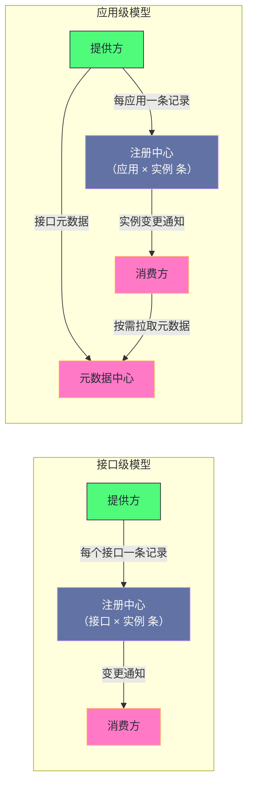

# 04 注册中心——ZooKeeper、Nacos 与服务发现模型

**摘要：**

注册中心要回答的问题是"**消费方如何知道提供方现在在哪**"——而它有一个容易被忽略的选择：**"以什么为粒度记录服务"**。这个选择在中小规模下无所谓，但在大规模下会成为瓶颈：**以"接口"为粒度时，注册中心的数据量是"接口数乘实例数"**，**而"一次发布"会引发"推送次数按接口数乘实例数再乘订阅者数放大"的风暴。** 因此较新版本把粒度从"接口"提到了"应用"，**把数据量从"接口乘实例"降到"应用乘实例"**，并把"接口级元数据"转移到"元数据中心"。本文按"服务发现要解决什么 → 接口级模型 → 它的规模问题 → 两种注册中心的模型差异 → 应用级模型 → 它的挑战 → 容灾设计"展开。先说明两种粒度的本质差别与四条设计原则、四处代价；再讲接口级模型的数据结构与注册订阅流程、以及"数据量爆炸"与"推送风暴"的共同根源。然后对比两种注册中心在六个维度上的差异与"推与拉"的取舍、长轮询的设计。之后是应用级模型的核心思想、元数据中心的位置与发现流程、以及"双注册双订阅"与"映射重建"两处挑战。接着是容灾的三级机制与"宕机期间用客户端重试兜底"这处权衡。最后是生产落地、排查推演与边界反例。

---

## 第 1 章 服务发现要解决什么

### 1.1 三个问题

**服务发现要回答三个问题。**

**问题一：提供方"如何声明自己的存在"**——**也就是"注册"。**

**问题二：消费方"如何得知有哪些提供方"**——**也就是"订阅"。**

**问题三：提供方"变化时如何通知"**——**也就是"变更传播"。** **而这处通知的粒度'与注册的粒度是同一个选择'**——**因此"它同样会受到粒度的影响"。**

**三个问题的答案构成了"服务发现模型"**——**而"模型的核心选择"是"以什么为粒度记录与传播"。** **因此"理解任何服务发现方案"的第一步是"看它的粒度"。**

### 1.2 两种粒度的差别

**粒度有两种，而它们的差别可以用"记录条数"表达。**

**"接口级"的记录条数是"接口数乘实例数"**——**因为"每个接口的每个实例'都是一条独立记录"。**

**"应用级"的记录条数是"应用数乘实例数"**——**因为"一个应用'只有一条记录（不论它暴露多少个接口）"。**

**因此"两种粒度的比值就是'每个应用平均暴露多少接口'"**——**而在"微服务拆分较细"的系统里，这个比值"可能达到几十倍"。**

**这条比值的意义在于"它量化了'粒度选择'的收益"**——**而"收益的大小'取决于'拆分粒度'"**：**"拆分越细，接口级模型的代价越大"。**

**一处值得留意的推论是"这处收益'会随时间变化'"**：**因为"微服务的拆分趋势'通常是'越拆越细'"**——**因此"接口级模型的代价'会随业务演进持续增长'"。** **这解释了"为什么'改粒度'是'迟早要做'的事，而不是'规模特别大才要做'的事"。**

### 1.3 一个类比：按菜品登记还是按餐厅登记

**把这处选择类比成"餐厅指南的登记方式"会更容易理解。**

**"按菜品登记"对应"接口级"**——**指南上"每道菜都单独列一条'由哪家餐厅在哪供应'"**——**因此"一家餐厅有三十道菜'就要登记三十条"**。

**"按餐厅登记"对应"应用级"**——**指南上"只登记餐厅的地址与营业时间"**——**而"这家餐厅有哪些菜'记在另一份菜单手册里"**。

**"餐厅换地址"对应"实例变更"**：**按菜品登记时"要改三十条"，按餐厅登记时"只改一条"。**

**"餐厅新增一道菜"对应"接口变更"**：**按菜品登记时"要新增一条"，按餐厅登记时"菜单手册改一处即可"。**

**这个类比的用处在于"它把两类变更的成本区分开了"**：**"地址变更频繁'而'菜单变更少'"**——**因此"把'地址'与'菜单'分开存'能让频繁的那一类更便宜'"。** **这正是"应用级加元数据中心"这处设计的动机。**

### 1.4 四条设计原则

**服务发现模型遵循四条设计原则。**

**原则一：粒度尽量粗。** **在"能表达清楚"的前提下，粒度越粗越好**——**因为"粒度越粗，记录数越少"。** **这条原则'是整篇演进的主线'。**

**原则二：区分"高频变更"与"低频变更"。** **把两者分开存储**——**因此"高频的那一类'变更成本更低"。**

**原则三：客户端缓存。** **消费方"在本地保存一份列表"**——**因此"注册中心不可用时'调用仍能继续"。** **这条原则'把可用性从服务端转移到了客户端'。**

**原则四：容忍最终一致。** **变更传播"不要求瞬间完成"**——**因为"窗口内的失败'由容错机制兜底"**（第 3 篇已展开这条判断）。** 这条原则'把一致性要求降低到了可实现的范围'。**

**四条原则的关系是"前两条决定'数据模型'，后两条决定'可用性策略'"**——**而"四者的组合"构成了"这套机制的完整形态"。**

### 1.5 四处代价

**这套机制有四处代价。**

**其一：变更传播的窗口。** **因为"容忍最终一致"，所以"存在'视图不一致的窗口'"**——**而"窗口内的失败'需要兜底"。**

**其二：客户端的状态维护。** **因为"每个消费方都持有一份列表"，所以"列表的规模与更新'成为客户端的负担"**（第 1 篇已展开这处代价）。

**其三：元数据的额外一跳。** **因为"接口元数据被转移到元数据中心"，所以"消费方'可能需要多一次查询'"**——**因此"多了一处依赖"。**

**其四：兼容期的双份成本。** **因为"迁移期需要'同时支持两种粒度'"，所以"注册中心要存两份"**——**因此"迁移期的负载反而更高"。**

**四处代价的共同特征是"它们是'粒度与分离'的对价"**：**粗粒度带来"兼容成本"，分离带来"额外一跳与额外依赖"。** **因此"这套模型的演进"始终在"规模与复杂度之间取平衡"。**

### 1.6 一条贯穿全篇的判断

**有一条判断贯穿全篇，而它值得先提出来。**

**这条判断是"设计的有效性依赖'规模假设'，而规模假设会随业务增长被打破"。**

**它的第一处体现是"接口级模型"**：**它"在中小规模下是优点，在大规模下是缺点"**（第 2.3 节）。

**它的第二处体现是"通知不含内容"**：**它"在低频变更下省流量，在'发布风暴'下放大拉取"**（第 3.2 节）。

**它的第三处体现是"长轮询"**：**它"在订阅者可控时实现简单，在订阅者很多时占用大量连接"**（第 4.3 节）。

**三处体现的共同特征是"优点与缺点'是同一个性质的两面'"**——**而"哪一面显现'取决于规模"。**

**这条判断的实用价值在于"它给出了'评估设计时的提问方式'"**：**"这个设计的优点'在什么规模下会反转'"**——**而"能回答这个问题的设计，才是'可预期的设计'"。** **这与第 8 篇讲的"机制的价值取决于它依赖的代价差"是同一类提问方式。**

---

## 第 2 章 接口级服务发现

### 2.1 数据模型

**接口级模型以"接口"为粒度组织数据，而它的结构是一棵树。**

**树的根是"统一前缀"**，**下一层是"接口名"**，**再下一层是四类目录**：**提供方、消费方、动态配置、路由规则。**

**而"提供方目录下'每个实例一个节点'"**——**节点名是"编码后的服务信息"，节点数据为空**（因为"信息全在路径里"）。

**"信息全在路径里"这处设计值得留意**：**它"用'节点名'承载了全部配置"**——**因此"读取一个节点'就拿到了完整的调用说明"**（第 1 篇已展开"统一数据载体"）。

**而它的代价是"节点名很长"**（因为"它编码了一份完整配置"）——**因此"数据量被放大"**（第 3.1 节展开）。

### 2.2 注册与订阅流程

**注册的流程是"在提供方目录下'创建一个临时节点'"**——**而"临时"的含义是"节点'与提供方的会话绑定'"**（第 3 篇已展开这处设计）。

**因此"提供方宕机时'节点自动删除'"**——**而"这'天然契合'提供方的生命周期管理'"**。

**订阅的流程分三步**：**其一，"获取当前所有提供方节点的列表"**；**其二，"注册监听器'监听子节点变化'"**；**其三，"收到变化通知后'重新获取列表并刷新本地缓存'"**。

**三步里"第三步的'重新获取'"值得留意**：**它说明"通知'不携带变更内容'，而只'告知发生了变化'"**——**因此"消费方需要'再拉一次'才能拿到新列表"。

**这条"通知不含内容"的设计带来一处代价**：**"变更频繁时'拉取次数会很多'"**——**而这正是"推送风暴"的另一面**（第 3.2 节）。

### 2.3 它为什么有效

**接口级模型在中小规模下"工作良好"，而它的有效性来自三处。**

**第一处是"临时节点与生命周期天然契合"**：**因为"节点存活与否'就等于'实例存活与否'"**——**因此"不需要额外的健康检查机制"。**

**第二处是"通知机制简单"**：**因为"只告知变化、不携带内容"**——**因此"服务端的实现简单"。**

**第三处是"读取即完整"**：**因为"节点名承载了全部配置"**——**因此"消费方拿到地址'就拿到了调用所需的全部信息"。**

**三处有效性在"规模不大"时都成立**——**而"规模变大"时，第二处与第三处会"从优点变成缺点"**：**"通知不含内容"导致"拉取次数放大"，"读取即完整"导致"数据量放大"。**

**这条"优点在规模下变成缺点"的形态值得记住**：**它说明"设计的有效性'依赖规模假设'"**——**而"当规模超出假设时'原本的优点会反转'"。** **这与第 2 篇讲的"机制的价值取决于它依赖的假设"是同一规律。**

### 2.4 一处关于"四类目录"的观察

**"接口名之下有四类目录"这处设计值得留意，因为它说明"服务发现不只下发地址"。**

**四类目录是**：**提供方、消费方、动态配置、路由规则**。

**而"消费方目录是可选的"**——**也就是说"有些实现会登记消费方，有些不会"**——**而"登记的意义是'让治理端能看到'谁在调用谁'"。

**"动态配置与路由规则"这两类目录的意义在于"它们让'治理能力'与'地址发现'共用同一条通道"**（第 3 篇已展开这处设计）。

**因此"四类目录的分工是'两类面向发现、两类面向治理'"**——**而"它们共用一棵树'意味着'治理的下发与发现的下发'在同一个体系里"。

**这处设计的收益是"运维只需要维护一套注册中心"**——**而它的代价是"两类信息的变更'会互相影响通知'"**（因为"它们在同一棵树上"）。**

### 2.5 一处关于"节点名承载信息"的观察

**"节点名承载全部信息"这处设计值得再展开一层，因为它体现了一类"把数据放进标识"的手法。**

**这类手法的形态是"不把内容存在节点的数据区，而是'编码进节点的名字'"**——**因此"读取一个节点的名字'就等价于'读取它的全部内容'"。

**它的收益是"读取路径更短"**：**因为"获取子节点列表'就会返回所有名字'"**——**因此"一次调用'就能拿到全部信息"，而不需要"逐个读取数据区"。

**而它的代价是"标识变长、且不可变"**：**因为"标识承载了全部内容"，所以"内容变化'必须'删除旧节点并创建新节点'"**——**而"这解释了'为什么一次发布'会产生'两次节点变更'"**（删除加创建，第 3.2 节）。

**因此"这处手法的取舍是'用'变更成本'换'读取效率'"**——**而"在'读取远多于变更'的场景下，这笔交换是划算的"。

**这条观察的价值在于"它把'推送风暴里为什么有乘二'这处细节解释清楚了"**——**而"理解细节'才能'准确估算推送量'"（第 8.3 节的容量规划需要这个数字）。**

---

## 第 3 章 接口级的规模问题

### 3.1 数据量爆炸

**第一个问题是"数据量按'接口数乘实例数'增长"。**

**具体来说**：**"一个服务'每暴露一个接口'就'多一组节点'"**——**因此"接口数量'直接乘在数据量上'"。

**而这个问题的严重程度"取决于注册中心的存储特性"**：**如果"注册中心把数据全放内存"**（例如"基于树形节点的实现"），**那么"数据量直接消耗内存"**——**而"内存是有限的"。**

**因此"数据量爆炸"的后果是"注册中心的内存成为瓶颈"**——**而"它的表现是'注册中心不稳定或拒绝写入'"**。

### 3.2 推送风暴

**第二个问题是"推送次数被多次放大"，而它的放大链条值得拆解。**

**链条是**：**"一次发布'重启了多个实例' → 每个实例'触发两次节点变更'（删除加创建）→ 每次变更'触发所有订阅该接口的消费方' → 而'每个消费方都注册了监听器'"。**

**因此"推送次数等于'接口数乘实例数乘二乘订阅者数'"**——**而这个乘积"在规模下会达到百万量级"。**

**"百万量级的推送"的后果是"注册中心与网络被瞬间压垮"**——**而"它的表现是'发布期间整个注册中心变慢或不可用'"**。

**这条放大链条的关键在于"两个乘数"**：**"接口数"**（因为"每个接口独立订阅"）与**"订阅者数"**（因为"每个订阅者都要被通知"）。** 而"应用级模型正是'削掉了第一个乘数'"**（第 5.1 节）。

### 3.3 两个问题的共同根源

**两个问题有共同的根源，而识别这个根源有助于理解"为什么解法是'改粒度'"。**

**根源是"以接口为粒度'导致接口数成为乘数'"**——**而"接口数'在微服务拆分的趋势下不断增长"**（因为"拆分越细，接口越多"）。

**因此"两个问题'不是两个独立的缺陷，而是同一个选择的两处后果'"**——**而"解法也只能是'改掉那个选择'"**（也就是"改粒度"）。

**这条"共同根源"的识别价值在于"它避免了'头痛医头'"**：**如果只针对"数据量"优化（例如"压缩节点名"），那么"推送风暴"仍然存在**；**而只针对"推送"优化（例如"合并通知"），那么"数据量"仍然存在。**

**因此"找到共同根源'能让解法一次覆盖多个问题'"**——**而"这比'逐个问题优化'更彻底"。** **这与第 16 篇讲的"根治优于修补"是同一判断。**

### 3.4 一处关于"规模假设"的观察

**"接口级模型在中小规模下工作良好"这句话里的"中小规模"，值得量化一下。**

**量化的方式有两种**：**其一是"数据量是否超出'注册中心的承载能力'"**；**其二是"推送次数是否超出'注册中心与网络的承载能力'"。

**而"两条判据的阈值不同"**：**"数据量"的阈值取决于"存储容量"**（因此"可能到数 GB 才出问题"）；**而"推送次数"的阈值取决于"单位时间的处理能力"**（因此"可能到数十万次就出问题"）。

**因此"推送风暴'往往比'数据量'更早出现"**——**而"这解释了'为什么很多系统的注册中心问题是'在'一次发布时'暴露的'"，**而**"不是在'日常运行时'暴露的"。

**这条量化的意义在于"它给出了'何时该考虑改粒度'的判据"**——**而"判据'不是'服务数量'，而是'接口数乘实例数乘订阅者数'"。**

### 3.5 一处关于"为什么是发布时暴露"的观察

**"问题在发布时暴露"这处现象值得单独说明，因为它给出了"排查的时间窗口线索"。**

**原因是"推送量'正比于'变更次数'"**——**而"日常运行时'变更次数少'"，**因此**"推送量在承载范围内"；**而**"发布时'变更次数骤增'"，**因此**"推送量瞬间超出承载能力"。

**因此"这类问题的表现形态是'周期性或事件性的'"**——**而"它的触发条件是'发布'或'扩缩容'"**——**因此"排查时应当'把现象时间点与变更事件对齐'"。

**这条观察的实用价值在于"它把'偶发的注册中心变慢'与'变更事件'关联起来了"**——**而"这个关联'能快速排除'日常容量不足'这个方向'"。

**这条观察的通用性在于"它适用于所有'由变更驱动的负载'"**——**而"识别方式'是把'负载峰值'与'变更事件'对齐"**。** 这与第 13 篇讲的"延迟高与发布事件的关联"是同一类排查思路。**

---

## 第 4 章 两种注册中心的模型差异

### 4.1 六个维度对比

**两种常见实现在六个维度上有差异。**

| 维度 | 基于树形节点的实现 | 基于实例表的实现 |
|---|---|---|
| 数据存储 | 树形节点，数据在内存 | 实例表，支持持久化 |
| 健康检测 | 依赖会话超时（临时节点自动删除） | 主动心跳，服务端探活 |
| 通知机制 | 监听事件推送（一次性，需重注册） | 长轮询（有变化立即返回） |
| 感知延迟 | 会话超时（数秒到数十秒） | 心跳超时（可配置） |
| 持久化实例 | 不支持（随会话失效） | 支持 |
| 一致性模型 | 强一致（共识协议） | 可选强一致或最终一致 |

**这张表里最值得留意的是"健康检测"与"一致性模型"两行**：**前者决定"服务下线的感知方式"**，**后者决定"注册中心在分区时的行为"。**

**而这两处差异"不是实现细节，而是设计取向"**：**前者"用会话代表存活"，后者"用心跳代表存活"**；**前者"优先一致"，后者"允许选择"。**

### 4.2 推与拉的差别

**"推"与"拉"的差别值得单独说明，因为它决定了"客户端与服务端的职责划分"。**

**"纯推"模式下"服务端负责'在变化时通知客户端'"**——**因此"客户端只需'等着被通知'"**——**而"服务端需要'维护订阅关系并保证通知送达'"。

**"长轮询"模式下"客户端负责'发起请求并等待'"**——**因此"服务端只需'在变化时'唤醒挂起的请求'"**——**而"客户端需要'在超时后重新发起'"。

**两者的职责划分差别在于"谁维护'订阅关系'"**：**纯推"由服务端维护"**，**长轮询"由客户端的'重新发起'隐式维护"。**

**这条差别的后果是"长轮询的服务端更简单"**——**因为"它不需要维护'谁订阅了什么'"**——**而"代价是'客户端要处理超时与重连'"。

### 4.3 长轮询的取舍

**长轮询的取舍值得展开，因为它是"推与拉之间的折中"。**

**它的形态是"客户端发起请求并'保持连接'，服务端'在变化时立即响应'，'无变化则等到超时'"。**

**它的收益是"感知延迟低"**（因为"有变化时几乎立即返回"）——**而"服务端的实现比纯推简单"**（因为"不需要维护订阅关系"）。

**而它的代价是"连接数等于订阅者数"**：**因为"每个订阅者'持有一个挂起的请求'"**——**因此"订阅者很多时'服务端要维护大量挂起连接'"。

**因此"长轮询的取舍是'用'服务端的连接数'换'实现的简单与延迟的低'"**——**而"在'订阅者数量可控'的场景下，这笔交换是划算的"。**

**这条取舍的通用性在于"它体现了'推拉折中'的常见形态"**——**而"折中的代价总是'某一方的资源占用'"**。** 这与第 2 篇讲的"复用一个通道的代价"是同一类观察。**

### 4.4 两种模型的适用场景

**两种模型各有适用场景，而判据是"是否需要'持久化实例'"与"一致性要求"。**

**"基于树形节点的实现"适合"临时实例为主、且要求强一致"的场景**——**因为"临时节点与会话绑定'天然契合'进程生命周期"。

**"基于实例表的实现"适合"需要'混合实例类型'的场景"**——**例如"既要有'随进程存活'的实例，也要有'长期固定的实例'"**（例如"手工登记的中间件地址"）。

**而"一致性模型的选择"取决于"分区时的取舍"**：**"优先一致'则'分区时少数派不可用'"**；**"优先可用'则'可能返回过期数据'"**（第 14 篇已展开这处经典取舍）。

**因此"选哪种实现"的答案取决于"业务更看重哪一边"**——**而"两种实现的差异'恰好覆盖了不同的取舍点"。**

### 4.5 一处关于"健康检测"的观察

**"会话超时"与"主动心跳"这两种健康检测方式，值得再展开一层。**

**"会话超时"的判据是"连接是否存活"**——**因此"它的检测延迟'等于超时配置'"**——**而"它的成本是'零额外流量'"**（因为"心跳'是长连接协议自带的"）。

**"主动心跳"的判据是"服务端是否收到心跳"**——**因此"它的检测延迟'可以配置得更短'"**——**而"它的成本是'每个实例定期发一次心跳'"**。

**两者的差别可以概括为"检测延迟与额外流量的取舍"**：**"会话超时'省流量但延迟长"，"主动心跳'延迟短但多流量"。

**而"主动心跳"还带来一处额外的能力**：**它"可以携带'实例的元数据'"**——**因此"元数据的更新'可以搭心跳的车'"**（而不需要"额外的接口"）。

**这条观察的通用性在于"它把'健康检测'归结为'延迟与流量的取舍'"**——**而"选哪种'取决于'对检测延迟的要求'"**。** 这与第 9 篇讲的"心跳与业务共享链路"是不同层面**：**那里关注"心跳被业务影响"，这里关注"心跳本身的设计取舍"。**

### 4.6 一处关于"数据表示"的观察

**"两种实现在'数据表示'上的差异"值得单独说明，因为它直接影响数据量。**

**第一种实现"把全部信息编码进节点名"**——**因此"一条记录'就是一份完整配置'"。

**第二种实现"把信息拆成'实例字段加元数据字段'"**——**因此"一条记录'只包含'地址与一组键值对'"。

**两者的差别在于"表示是否紧凑"**：**前者"用字符串编码'导致体积膨胀'"**（因为"编码会放大字符数"）；**后者"用结构化字段'体积更小"。

**因此"两种实现的'数据量差异'不只在粒度上，还在'表示方式'上"**——**而"这解释了'为什么换成第二种实现'也能带来数据量下降"。

**这条观察的实践含义是"评估数据量时'应当把表示方式也算进去'"**——**而"只算条数'会低估'第一种实现'的实际占用"。** **这与第 1 篇讲的"统一数据载体的性能争议"是同一处**：**"字符串格式'的代价'体现在'体积与解析'两处"。**

---

## 第 5 章 应用级服务发现

### 5.1 核心思想

**应用级模型的核心思想是"把粒度从'接口'提到'应用'"。**

**具体来说**：**"注册中心'只记录应用与实例的对应关系'"**——**而"一个应用'不论暴露多少接口'都只有一条记录"**（因为"记录里只有'应用名加地址'"）。

**这处改动"削掉了'接口数'这个乘数"**——**因此"数据量与推送次数都'与接口数无关'"**。

**而这处改动的代价是"注册中心不再包含'接口信息'"**——**因此"需要另一处存放它"**（第 5.3 节）。

### 5.2 数据量的变化

**数据量的变化可以用"比值"表达。**

**"接口级"的数据量是"接口数乘实例数"**；**"应用级"的数据量是"应用数乘实例数"。**

**因此"两者的比值'就是'每个应用平均暴露的接口数'"**——**而"这个比值'在'拆分较细'的系统里可能达到几十倍"。**

**而"推送次数的变化更显著"**：**因为"一次发布'现在只触发'应用级的变更'"**——**因此"推送次数'从'接口数乘实例数乘订阅者数'降为'实例数乘订阅者数'"。

**这条"推送次数削掉一个乘数"的收益值得强调**：**因为"推送次数'是原问题的平方级放大'"**——**因此"削掉一个乘数'带来的改善'不是线性的，而是数量级的"。**

### 5.3 元数据中心的位置

**"接口元数据"被转移到"元数据中心"，而它的位置值得说明。**

**它的内容是"每个接口的完整元数据"**——**包括"接口名、版本、方法列表、超时配置"等。**

**而"它'可以是与注册中心同一套实现，也可以是另一套'"**——**因此"两处的选型可以独立"。**

**这处分离的意义在于"两类数据的变更频率不同"**：**"实例信息'变更频繁'"**（因为"扩缩容与重启"），**而"接口元数据'变更少'"**（因为"它只在'接口定义或配置变化时'才变"）。

**因此"分离的收益是'让高频变更的那一类更便宜'"**——**而"这正是第 1.4 节讲的'区分高频与低频变更'原则的落地"。**

### 5.4 发现流程

**应用级模式下的发现流程分四步。**

**第一步：从注册中心订阅"应用的实例列表"**——**而"列表里只有'地址'"。

**第二步：从元数据中心拉取"该应用的接口元数据"**——**而"这一步'通常有本地缓存'"。

**第三步：把"实例信息"与"接口元数据"合并，重建出"可调用对象列表"**——**而"这一步'是为了'兼容原有的调用模型'"。

**第四步：当实例增减时"只更新实例部分"**——**因为"接口元数据'通常不变'"。

**四步里"第三步的重建"值得留意**：**它说明"应用级模型'只是'存储与传播层面'的改动'"**——**而"运行时'仍然是'接口级的可调用对象列表'"**。** 因此"这处改动'对上层是透明的'"。

### 5.5 一处关于"透明改动"的观察

**"对上层透明"这处性质值得再展开一层，因为它是"这类重构能落地"的关键。**

**具体来说**：**"应用级模型'改了存储与传播'，但'运行时的结构没变'"**——**因此"上层的负载均衡、容错、路由'都不需要改"。

**这条透明性的收益是"改动的影响面被限制在'注册与订阅这两层'"**——**而"这大幅降低了'重构的风险'"。

**而它的实现方式值得留意**：**"重建"这一步'把新的数据模型'翻译回'旧的结构'"**——**因此"上层'感知不到差异'"。

**这条手法的通用性在于"它适用于所有'需要改变底层模型'的重构"**：**"在边界处做一次翻译'，就能'让上层保持不变'"**——**而"翻译的成本'远低于'让上层适配新模型'"。** **这与第 16 篇讲的"用一层抽象隔离实现与使用"是同一手法**：**"用'一层翻译'换取'上层不动'"。**
### 5.6 应用级与接口级的整体对照

把两种粒度放在一张图上，能看清"数据流向的差别"。

**图中最值得注意的是"应用级模型多了一条'元数据上报'的边"**：**也就是说"它把'一份数据'拆成了'两份、存到两处'"。**

**这条拆分带来两处后果**：**其一是"注册中心的数据量下降"**（因为"接口信息不再存在那里"）；**其二是"消费方可能需要多一次查询"**（因为"接口信息在另一处"）。

**而"按需拉取加本地缓存"这处设计的作用是'把第二处后果压到最小'"**：**因为"接口元数据'通常不变'"，所以"大多数情况下'不需要访问元数据中心'"。

**这张图的实用价值在于"它把'改粒度'的收益与代价同时呈现出来了"**——**而"收益在'注册中心侧'，代价在'消费方侧'"**——**而"这解释了为什么'这处改动'需要用'缓存'来补代价"。**

---

## 第 6 章 应用级的挑战

### 6.1 双注册双订阅

**第一处挑战是"迁移期的共存"，而解法是"双注册双订阅"。**

**具体来说**：**提供方"同时注册'接口级与应用级'两条记录"**，**而消费方"同时订阅两种格式"**——**因此"它能'根据对方的版本'选择对应的发现模式"。**

**这处解法的收益是"迁移不需要'一步到位'"**——**而"它的代价是'迁移期注册中心要存两份'"**——**因此"迁移期的负载反而比迁移前更高"。

**这条代价的形态值得留意**：**它说明"迁移的中间态'可能比两端都差'"**——**而"这类'中间态更差'的迁移方案'需要'有明确的退出计划'"**（也就是"迁移完成后必须关掉双份"）。

**这与第 3 篇讲的"多协议导出"是同一类**：**"同时支持两种'能换来平滑过渡'"**——**而"代价是'过渡期的资源占用翻倍'"。

### 6.2 映射重建

**第二处挑战是"消费方如何知道'某个应用提供了哪些接口'"。**

**问题的来源是"应用级模型下'注册中心不含接口信息'"**——**因此"消费方'需要从元数据中心获取'这层映射"。

**而"每次都去元数据中心查"会带来两处问题**：**其一是"多一次网络往返"**；**其二是"元数据中心成为'调用路径上的依赖'"**——**而"这削弱了'注册中心不在调用链路上'这处设计的收益"**（第 1 篇已展开那处设计）。

**因此"需要一处机制'减少查询次数'"**——**而它的做法是"在实例信息里带一个'版本标识'，消费方先查本地缓存'有没有这个版本'"。

### 6.3 按需拉取与本地缓存

**"按需拉取加本地缓存"这处设计的机制值得说明。**

**机制是**：**"提供方'把它的接口列表算出一个版本标识'，并把'这个标识'放进实例信息里"**；**而"消费方订阅实例时'看到这个标识'，先检查'本地缓存里有没有它对应的接口元数据'"**——**"有则直接用，无则去元数据中心拉取并缓存"。

**这处设计的巧妙之处在于"它用'一个短标识'替代了'长元数据'"**：**因为"标识很短"，所以"实例信息的体积不受'接口数量'影响"**——**因此"它同时解决了'数据量'与'查询次数'两个问题"。

**而它的正确性依赖"标识与内容的一一对应"**：**也就是说"内容变化时标识必须变化"**——**否则"消费方会用'过期的缓存'"。

**这条"用摘要标识内容"的手法在本专栏里出现过多次**：**第 5 篇讲的"变更缓冲用行哈希标识行"**、**第 13 篇讲的"按行并行用行哈希判断冲突"**。**它们的共同特征是"用'短摘要'替代'长内容'进行比较与判断"。**

### 6.4 一处关于"映射重建"的观察

**"映射重建"这处挑战值得再展开一层，因为它体现了"拆分的代价如何被补回来"。**

**挑战的来源是"数据被拆到两处"**——**因此"消费方需要'把两处合起来'才能重建'可调用的对象列表'"。

**而"补代价的方式"有两层**：**第一层是"用短标识替代长内容"**（第 6.3 节），**第二层是"本地缓存"**（因为"标识不变时不需要重新拉取"）。

**两层配合的效果是"绝大多数情况下'不需要访问元数据中心'"**——**因此"拆分带来的额外一跳'被压到了极少数情况"。

**这条"拆分加缓存"的组合值得记住**：**它说明"拆分数据'不一定带来'持续的额外开销'"**——**而"只要'变化的频率低'，就可以'用缓存把开销摊薄"。

**因此"判断'某处拆分是否值得'时，应当问'被拆出去的那部分'变更频率有多高'"**——**"频率低'则拆分的收益大于代价"。** **这与第 1.4 节讲的"区分高频与低频变更"是同一条原则的量化。**

### 6.5 一处关于"兼容期"的经验

**"兼容期"这件事值得收敛一下，因为它是"所有迁移方案都要面对的"。**

**兼容期的形态是"系统'同时支持新旧两种形态'"**——**而它的收益是"迁移可以'逐步推进'"**——**而它的代价是"兼容期的资源占用与逻辑复杂度都上升"。

**因此"兼容期的设计要点有三处"**：**其一是"必须能'同时读两种格式'"**；**其二是"必须有'明确的退出条件'"**（例如"所有实例都升级完成后关闭双份"）；**其三是"必须能'监控双份的比例'"**（因为"不知道比例就无法判断何时能退出"）。

**三点里"退出条件"最容易被忽略**——**而"没有退出条件的兼容'会永久存在'"**——**因此"它从'过渡手段'变成了'长期负担'"。

**这条经验的实践含义是"设计迁移方案时，'退出条件'应当与'迁移方案'同时确定"**——**而不是"等以后再想"。** **这与第 16 篇讲的"技术债的偿还"是同一类判断**：**"过渡方案'如果不设终点，就会变成债务"。**

---

## 第 7 章 容灾的三级机制

### 7.1 三级机制

**针对注册中心不可用，设计了三处容灾，而它们"依次兜底"。**

**第一级是"内存缓存"**：**消费方"在内存里维护当前列表"**——**因此"注册中心宕机'不影响已有调用'"。** 而"这一级的有效性'完全依赖'消费方进程存活'"。

**第二级是"本地文件缓存"**：**每次收到更新"都把列表写入本地文件"**——**因此"消费方重启时'即使注册中心不可用'也能加载列表"。

**第三级是"失败重试队列"**：**失败的注册与订阅"被加入队列并周期重试"**——**因此"注册中心恢复后'状态自动复原"。

**三级的顺序是"内存、文件、重试"**——**而它们分别覆盖"运行时、重启时、恢复时"三个阶段**。** 这与第 3 篇讲的"延迟暴露与预热的接力关系"是同一结构**：**"不同阶段用不同机制，配合起来覆盖全过程"。**

### 7.2 宕机期间的一致性问题

**三级容灾解决了"可用性"，但没有解决"一致性"，而后者值得说清。**

**具体问题**：**"注册中心宕机期间，如果某个提供方下线，消费方'无法感知'"**——**因为"下线通知'需要通过注册中心推送'"。

**因此"消费方的列表里'可能包含已下线的提供方'"**——**而"发往这些提供方的请求会'连接失败'"。

**这条不一致的后果"由容错机制兜底"**：**也就是"失败后'重试到其他实例'"。** **因此"这处不一致'表现为'偶发的额外延迟'，而不是'请求失败'"。

### 7.3 这处权衡的合理性

**"用客户端重试兜底"这处权衡值得评估一下，因为它体现了"可用性与一致性之间的选择"。**

**权衡的两端是**：**"及时感知下线'需要'注册中心始终可用'"**，**而"容忍'列表暂时过期'则'注册中心可以宕机'"。

**而"选后者"的理由是"注册中心成为单点故障的代价'远大于'偶发重试的代价'"**——**因为"前者是'全系统不可用'，后者是'毫秒级的额外延迟'"。

**因此这处权衡的合理性来自"两类代价的量级差"**——**而"判断这类权衡"的通用方法是"比较两端代价的量级"**。** 这与第 14 篇讲的"多数派确认换来不丢数据"是同一类判断**：**"用较小的代价换取较大的保证"。**

**一处值得留意的边界是"如果'提供方下线后其地址被别的进程复用'，那么'重试可能打到错误的服务'"**——**因此"这处权衡'在'地址会被复用'的环境下需要额外的保护"**（例如"服务标识校验"）。

### 7.4 一处关于"三级兜底"的经验

**"三级兜底"这套结构值得收敛一下，因为它在别处也反复出现。**

**它的结构是"同一件事'在三个时间尺度上各有一份副本'"**：**"内存副本'覆盖'运行时"，"文件副本'覆盖'重启时"，"重试队列'覆盖'恢复时'"。

**这套结构的收益是"覆盖了'所有可能的中断点'"**——**而"缺任何一级'都会留下一段'无法覆盖的窗口'"**：**"缺内存副本'则'宕机时调用立即失败'"，"缺文件副本'则'重启后无法服务'"，"缺重试'则'恢复后需要人工干预'"。

**因此"设计兜底机制时的检查方法是'列出所有中断点，确认每一处都有对应的副本或重试'"**——**而"这类检查'比'逐个机制地评估'更不容易遗漏'"。

**这条经验的通用性在于"它把'容灾设计'变成了'中断点的枚举问题'"**——**而"枚举'比'想象'更可靠"。** **这与第 15 篇讲的"按恢复四阶段归因不一致"是同一类方法**：**"用'阶段枚举'替代'现象猜测'"。**

---

## 第 8 章 生产落地

### 8.1 监控要点

**注册中心侧可观测的信息有四类。**

**第一类是"注册中心自身的健康"**：**包括"节点状态、内存占用、连接数"**——**它回答"注册中心是否稳定"。**

**第二类是"注册数据量"**：**包括"节点数或实例数"**——**而"它的增长趋势'能预示'数据量问题'"。

**第三类是"变更频率"**：**包括"单位时间内的变更次数"**——**它回答"是否有'频繁上下线'的情况"。**

**第四类是"客户端侧的列表状态"**：**包括"列表大小与最近更新时间"**——**它回答"消费方的视图是否新鲜"。**

**四类信息的层次是"从服务端到客户端"**：**前三类在注册中心侧，第四类在消费方侧。** **而"两侧对照"能快速定位"问题在服务端还是客户端"。**

**一处值得留意的观测细节是"变更频率'应当分维度统计'"**：**也就是"把'扩缩容'与'发布'分开计数"**——**因为"两类变更的规模不同"**（"一次发布'变更的实例数'可能远大于'一次常规扩缩容'"）。** 因此"合并统计'会掩盖'发布时的尖峰'"。**

### 8.2 一次"服务调用大量失败"的排查推演

把"注册中心相关的大量失败"串成一次推演。

假设现象是"某服务'大量调用失败'，而'提供方本身健康'"。

**第一步，确认"消费方的列表是否新鲜"。** **因为"如果列表过期'可能指向已下线的地址'"**——**因此"先看'最近更新时间'"。

**第二步，确认"注册中心是否可用"。** **因为"列表不更新'可能是因为'注册中心不可用'"**——**而"这处现象'表现为'列表长期不变'"。

**第三步，如果是"注册中心不可用"，确认"是否有'大量重试'"。** **因为"重试队列'在恢复时会'集中执行'"**——**而"这可能造成'恢复瞬间的负载尖峰'"。

**第四步，如果"注册中心正常"，确认"是否'数据量过大'"。** **因为"数据量过大会'拖慢读取与推送'"**——**而"这处现象'表现为'变更传播延迟变大'"。

**第五步，如果"以上都正常"，确认"是否'推送风暴'"。** **因为"一次发布'可能触发海量推送'"**——**而"这处现象'表现为'发布期间注册中心变慢'"。

**五步的价值在于"它按'客户端视图、服务端可用性、重试、数据量、推送'的顺序排查"**——**而"这五处恰好是'服务发现的各个环节'"。** **因此"理解服务发现的链路"，也就"得到了这类问题的排查框架"。**

### 8.3 一处关于"注册中心容量规划"的经验

**注册中心的容量规划值得单独说明，因为"它常被当作'不需要规划的基础设施'"。**

**规划的输入有三个**：**"接口数（或应用数）、实例数、订阅者数"**——**而"这三者'决定了数据量与推送量'"。

**因此"容量规划的第一步是'算出这三个数的乘积'"**——**而"这个乘积'是判断'是否需要改粒度'的直接依据"**（第 3.4 节）。

**而"规划时容易被忽略的一项是'发布频率'"**：**因为"推送风暴'只在'发布时'发生"，所以"如果'发布频繁'，那么'风暴的频率也高'"**——**因此"发布频率'是容量规划里必须考虑的一项"。

**这条经验的实践含义是"注册中心的容量'应当按'最坏情况'规划"**——**也就是"按'一次全量发布'的推送量规划"**——**而不是按"日常平均"。

**这与第 1 篇讲的"容灾预算按'故障后果'分配"是同一类思路**：**"按'最坏情况'而非'平均情况'规划"**——**因为"系统的可用性'由最坏情况决定'"。**

---

## 第 9 章 边界与反例

### 9.1 反例一：把"注册中心宕机"当作"调用会失败"

"内存与文件缓存"让"已有调用继续"（第 7.1 节）。

### 9.2 反例二：把"数据量问题"当作"可以靠压缩解决"

"推送风暴"与"数据量"有共同根源，**只解决一个不够**（第 3.3 节）。

### 9.3 反例三：把"应用级模型"当作"没有代价"

它"引入元数据中心这处额外依赖"（第 1.5 节）。

### 9.4 反例四：把"双注册"当作"可以长期保留"

"迁移期负载反而更高"，**因此必须有退出计划**（第 6.1 节）。

### 9.5 反例五：把"长轮询"当作"没有成本"

它的成本是"服务端维护大量挂起连接"（第 4.3 节）。

### 9.6 反例六：把"临时节点"当作"能感知所有故障"

它"只能感知会话级存活"，**而"进程活着但业务卡死'不会被发现"**（第 3 篇已展开）。

### 9.7 反例七：把"版本标识"当作"可以随便算"

它"必须与内容一一对应"，**否则缓存会过期**（第 6.3 节）。

---

## 第 10 章 落点

回到开头：**"服务发现"的核心选择是什么？**

**是"粒度"**——**而"接口级"与"应用级"的差别，本质上是"把哪个数乘进数据量"**：**前者"乘接口数"，后者"乘应用数"。** 而"接口数在微服务拆分的趋势下不断增长"，**因此"改粒度"是必然的方向。**

**而这处改动最值得记住的一条判断是"两个规模问题有共同根源"**：**"数据量爆炸"与"推送风暴"都源于"接口数成为乘数"**——**因此"只优化其中一个不够"，而"改粒度能一次覆盖两者"。** **这条"找共同根源"的方法，比"逐个优化"更彻底。**

**另一条判断是"优点在规模下会反转"**：**"通知不含内容"与"读取即完整"在中小规模下是优点**，**而在大规模下"分别变成'拉取次数放大'与'数据量放大'"**。** 因此"评估一个设计时，应当问'它依赖的规模假设是什么'"。

**最后，容灾的三级机制体现了一条通用结构**：**"内存、文件、重试"分别覆盖"运行时、重启时、恢复时"三个阶段**——**而"它们不是替代关系，而是接力关系"。** **理解这一点，就能理解"为什么三级缺一不可"。**

**而本篇最值得带走的一条提问方式是"这个设计的优点，在什么规模下会反转"**：**"接口级模型""通知不含内容""长轮询"三处都在规模变大后从优点变成缺点**——**而"能回答这个问题的设计，才是可预期的设计"**。** 因此"读任何服务发现方案时，先问它的规模假设"**——**而"这比'记住它的优缺点'更有用"。

**还有一条判断值得记住："两个规模问题有共同根源"**。** "数据量爆炸"与"推送风暴"都源于"接口数成为乘数"**——**因此"改粒度能一次覆盖两者"**，**而"逐个优化只能缓解"**。** 这类"找共同根源"的方法，能"避免'在错误的方向上持续投入'"。

**最后，本篇与第 1、3 篇的关系值得点明**：**第 1 篇讲"注册中心不在调用链路上"，第 3 篇讲"订阅与列表更新"，而本篇讲"注册中心内部的数据模型与规模问题"。** **三者合起来，才是"服务发现"的完整图景**——**而"下一篇讲的通信层与协议"，则是'发现之后如何真正把请求发出去'"。**

---

## 专栏导航

- 上一篇：[[03 服务导出与服务引用——从 @DubboService 到网络监听]]。
- 下一篇：[[05 通信层——Netty 传输与 Dubbo 协议]]。
- 返回专栏首页：[[00 专栏导览]]。

---

## 参考资料

1. Apache Dubbo 源码：`dubbo-registry/dubbo-registry-api/src/main/java/org/apache/dubbo/registry/support/FailbackRegistry.java`、`dubbo-registry-zookeeper/.../ZookeeperRegistry.java`、`dubbo-registry-nacos/.../NacosRegistry.java`、`dubbo-metadata/`。
2. Apache Dubbo. 官方文档：注册中心实现与选型. https://dubbo.apache.org/zh/docs/references/registry/
3. Apache Dubbo. 官方文档：应用级服务发现与元数据中心. https://dubbo.apache.org/zh/docs/advanced/service-discovery/
4. Apache Dubbo. 官方文档：接口级与应用级的迁移（register-mode）. https://dubbo.apache.org/zh/docs/advanced/migration/
5. Apache Dubbo. 官方文档：本地缓存与容灾机制. https://dubbo.apache.org/zh/docs/advanced/local-cache/
6. Nacos. 官方文档：服务发现的数据模型与长轮询. https://nacos.io/zh-cn/docs/
7. Apache Dubbo. GitHub 仓库与源码说明. https://github.com/apache/dubbo

---

> [!note] 思考题
> 1. "接口级"与"应用级"的记录条数分别是"接口乘实例"与"应用乘实例"——两者的比值是什么？它取决于什么？
> 2. "数据量爆炸"与"推送风暴"的共同根源是什么？为什么只优化其中一个不够？
> 3. "通知不含内容"与"读取即完整"这两处设计，为什么在规模变大后会从优点变成缺点？
> 4. "按需拉取加本地缓存"这处设计，为什么能同时解决"数据量"与"查询次数"两个问题？
> 5. 容灾的三级机制分别覆盖哪个阶段？为什么它们不是替代关系？
