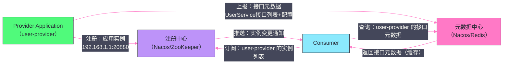

# 04 注册中心——ZooKeeper、Nacos 与服务发现模型

## 摘要

注册中心是 Dubbo 服务发现的核心基础设施，但"服务发现"这个需求本身经历了深刻的演进。Dubbo 2.x 的接口级服务发现模型在大规模集群下暴露出严重的性能问题，推动了 Dubbo 3.x 应用级服务发现模型的诞生。本文深入分析 ZooKeeper 和 Nacos 两种注册中心在 Dubbo 中的节点结构与推拉模型差异，剖析接口级 vs 应用级服务发现的本质区别，以及当注册中心宕机时 Dubbo 的容灾策略。

---

## 第 1 章 接口级服务发现：Dubbo 2.x 的经典模型

### 1.1 接口级服务发现的数据模型

在 Dubbo 2.x 中，注册中心以**服务接口（Interface）**为粒度管理服务信息。每个 Dubbo 服务接口对应注册中心中的一组节点，[[Zookeeper]] 中的路径结构如下：

```
/dubbo
  /{接口全限定名}                      ← 持久节点（接口命名空间）
    /providers                         ← 持久节点（提供者目录）
      /dubbo://192.168.1.1:20880/...   ← 临时节点（每个 Provider 实例）
      /dubbo://192.168.1.2:20880/...   ← 临时节点（每个 Provider 实例）
    /consumers                         ← 持久节点（消费者目录）
      /consumer://192.168.1.5/...      ← 临时节点（Consumer 注册，可选）
    /configurators                     ← 持久节点（动态配置）
    /routers                           ← 持久节点（路由规则）
```

**一个真实的 Provider URL 示例（ZooKeeper 中的节点路径）：**

```
/dubbo/com.example.UserService/providers/
  dubbo%3A%2F%2F192.168.1.1%3A20880%2Fcom.example.UserService
  %3Fapplication%3Duser-provider
  %26interface%3Dcom.example.UserService
  %26version%3D1.0.0
  %26group%3Ddefault
  %26methods%3DgetUserById%2CcreateUser
  %26timeout%3D3000
  %26retries%3D2
  ...
```

URL 经过 `URLEncoder` 编码后作为 ZooKeeper 节点的路径名，节点数据为空（路径即信息）。

### 1.2 接口级服务发现的工作流程

**Provider 注册：**

1. Provider 启动，在 `/dubbo/{接口名}/providers/` 下创建**临时节点**，节点路径为 URL 编码后的 Provider URL；
2. Provider 宕机 → ZooKeeper Session 超时 → 临时节点自动删除 → Consumer 收到通知 → 刷新 Provider 列表。

**Consumer 订阅：**

1. Consumer 启动，通过 `getChildren("/dubbo/{接口名}/providers/")` 获取当前所有 Provider URL 列表；
2. 注册 Watcher，监听 `/providers/` 目录的子节点变化（`NodeChildrenChanged`）；
3. 收到变化通知 → 重新 `getChildren` 获取最新列表 → 刷新 `RegistryDirectory` 中的 Invoker 列表。

同时，Consumer 还会订阅 `/configurators/` 和 `/routers/` 目录，用于接收动态配置变更和路由规则更新。

### 1.3 接口级服务发现的规模问题

接口级服务发现在中小规模集群下工作良好，但在大规模微服务场景下有严重的规模问题：

**问题一：注册中心数据量爆炸**

假设一个服务有 100 个接口、50 个实例，且每个 Provider URL 包含全量参数（通常 1~3 KB 的 URL 字符串），则：
- 注册中心需要存储 100 × 50 = 5,000 个节点；
- 每个节点 URL 约 2KB，总数据量 5,000 × 2KB = 10MB。

这对于 ZooKeeper（所有数据存在内存中）来说，还可以接受。但一个大型电商平台可能有 1,000+ 服务应用、每个应用 100+ 接口，整个集群就有 10 万+ 接口，50+ 实例，总节点数达到 500 万，数据量达到数 GB——ZooKeeper 的内存吃不消。

**问题二：推送风暴（Push Storm）**

当一个服务应用（比如有 100 个接口）发布更新，重启了 50 个实例时：
- 每个实例重启触发一次 ZooKeeper 节点变更（先删除旧节点，再创建新节点）；
- 每个接口有订阅了该接口的所有 Consumer，每个 Consumer 注册了 Watcher；
- 100 接口 × 50 实例 × 2（删除+创建）= 10,000 次节点变更；
- 每次变更触发所有订阅了该接口的 Consumer 的 Watcher 通知。

如果有 200 个 Consumer 订阅了这些接口，就会产生 10,000 × 200 = 200 万次 Watcher 通知推送！ZooKeeper 和网络会被这种"推送风暴"瞬间压垮。

这就是 Dubbo 3.x 推出**应用级服务发现**的直接动机。

---

## 第 2 章 ZooKeeper 注册中心的实现细节

### 2.1 ZookeeperRegistry 的订阅实现

`ZookeeperRegistry` 使用 Apache Curator 客户端与 ZooKeeper 交互。Consumer 订阅服务时：

```java
public class ZookeeperRegistry extends FailbackRegistry {
    
    @Override
    public void doSubscribe(URL url, NotifyListener listener) {
        // 获取该接口需要订阅的所有路径（providers/configurators/routers）
        List<String> toCacheUrls = toSubscribedPaths(url);
        
        for (String path : toCacheUrls) {
            // 使用 Curator 的 PathChildrenCache 监听子节点变化
            // PathChildrenCache 会维护子节点的本地缓存，并在变化时回调
            PathChildrenCache childListener = new PathChildrenCache(client, path, true);
            childListener.getListenable().addListener((curatorClient, event) -> {
                // 子节点变化时，重新获取所有子节点，转换为 URL 列表，通知 listener
                List<URL> urls = toUrlsWithEmpty(url, path, client.getChildren().forPath(path));
                ZookeeperRegistry.this.notify(url, listener, urls);
            });
            childListener.start();
            zkListeners.put(url, childListener);
        }
        
        // 初始化通知：立即获取当前子节点列表
        List<URL> urls = fetchUrlsFromRegistry(url);
        notify(url, listener, urls);
    }
}
```

### 2.2 FailbackRegistry：自动重试机制

`ZookeeperRegistry` 继承了 `FailbackRegistry`，`FailbackRegistry` 提供了注册/订阅失败时的**自动重试**机制：

- 如果 `register()` 或 `subscribe()` 失败（如 ZooKeeper 暂时不可用），操作会被加入失败队列；
- 后台重试线程（默认每 5 秒）定期尝试重新执行队列中的失败操作；
- 重新连接到 ZooKeeper 后，会自动重新注册所有 Provider URL 和重新订阅所有 Consumer。

这保证了：即使 ZooKeeper 发生短暂抖动（如 Leader 选举期间的几秒不可用），服务的注册和订阅状态最终都能恢复正确。

---

## 第 3 章 Nacos 注册中心：推拉结合的服务发现

### 3.1 Nacos 与 ZooKeeper 的服务发现模型差异

Nacos 是阿里巴巴开源的服务注册与配置中心，在 Dubbo 生态中逐渐成为 ZooKeeper 的替代选择。两者在服务发现模型上有显著差异：

| 维度 | ZooKeeper | Nacos |
|:---|:---|:---|
| **数据存储** | 树形节点（ZNode），数据在内存 | 内部数据库（服务实例表），支持持久化 |
| **健康检测** | 依赖 Session 超时（临时节点自动删除） | 主动心跳（HTTP 或 TCP），服务端探活 |
| **通知机制** | Watch 事件推送（一次性，客户端重注册） | 长轮询（客户端定期拉取，有变化立即返回） |
| **服务健康感知延迟** | Session 超时（4~30 秒） | 心跳超时（默认 15 秒） |
| **支持持久化实例** | ❌ 临时节点随 Session 失效 | ✅ 支持持久化实例（不随客户端宕机删除） |
| **集群模式** | ZAB 协议（强一致） | 支持 CP 模式（Raft）和 AP 模式（Distro） |

**推拉结合模型：**

Nacos 的服务发现不是纯推模式，而是**长轮询（Long Polling）**：
- Consumer 向 Nacos 发起请求："给我 `com.example.UserService` 的 Provider 列表，如果有变化立即返回，最多等 30 秒"；
- 如果 30 秒内没有变化，Nacos 返回空（Consumer 重新发起请求，形成轮询）；
- 如果有变化（Provider 上下线），Nacos 立即将请求唤醒，返回最新列表。

这种方式在降低了对实时 Push 架构要求的同时，也保证了较低的发现延迟（有变化时几乎立即感知）。

### 3.2 Nacos 中的 Dubbo 服务结构

在 Nacos 中，Dubbo 服务以**服务名（Service Name）**和**分组（Group）**组织。接口级服务发现时，Nacos 的服务名格式为 `providers:{接口全限定名}:{版本}:{分组}`：

```
服务名：providers:com.example.UserService:1.0.0:default
分组：DEFAULT_GROUP

实例列表：
  - ip: 192.168.1.1, port: 20880
    元数据（metadata）：
      dubbo.application: user-provider
      dubbo.interface: com.example.UserService
      dubbo.version: 1.0.0
      dubbo.timeout: 3000
      dubbo.methods: getUserById,createUser
      ...
  - ip: 192.168.1.2, port: 20880
    元数据：...
```

与 ZooKeeper 将 URL 全量信息编码在路径名中不同，Nacos 将 Provider URL 拆分为：
- **实例信息**（ip + port）：存在 Nacos 的实例表中；
- **元数据（Metadata）**：存在实例的 metadata 字段中。

这种拆分使得 Nacos 的实例列表更紧凑，注册中心的数据量和推送量都比 ZooKeeper 更小。

---

## 第 4 章 Dubbo 3.x：应用级服务发现

### 4.1 应用级服务发现的核心思想

Dubbo 3.x 引入了**应用级服务发现（Application-Level Service Discovery）**，将服务注册的粒度从"接口"提升到"应用（Application）"：

**接口级（Dubbo 2.x）：**
- 注册中心中，每个接口 × 每个实例 = 一条记录
- 100 个接口 × 50 个实例 = 5,000 条记录

**应用级（Dubbo 3.x）：**
- 注册中心中，每个应用 × 每个实例 = 一条记录
- 1 个应用 × 50 个实例 = 50 条记录

数据量减少了**接口数量倍**（从 5,000 条降到 50 条），极大地缓解了注册中心的存储和推送压力。

### 4.2 元数据中心：接口信息的归宿

应用级服务发现将实例信息（IP + Port）存在注册中心，但**接口级的元数据**（每个接口的 Timeout、Retries、Methods 等配置）存在哪里？

答案是**元数据中心（Metadata Center）**：

- **注册中心**（如 Nacos/ZooKeeper）：只存应用实例信息（IP + Port + 应用名），不存接口详情；
- **元数据中心**（可以是 Nacos、Redis、ZooKeeper 等）：存储每个接口的完整元数据（接口名、版本、方法列表、超时配置等）。



**Consumer 的服务发现流程（应用级）：**

1. 从注册中心订阅 `user-provider` 应用的**实例列表**（只含 IP + Port）；
2. 从元数据中心拉取 `user-provider` 的**接口元数据**（可以按需拉取，有本地缓存）；
3. 将实例信息和接口元数据合并，重建出传统的 Invoker 列表；
4. 当 Provider 实例增减时，只更新实例部分，接口元数据通常不变（除非发布新版本）。

### 4.3 应用级服务发现的挑战与兼容性

**挑战：Dubbo 2.x 和 3.x 混用**

在从 Dubbo 2.x 迁移到 3.x 的过渡期，同一套系统中可能同时存在 2.x Consumer 和 3.x Provider（或反之）。为此，Dubbo 3.x 支持**双注册、双订阅**：Provider 同时向注册中心注册接口级和应用级记录，Consumer 也同时订阅两种格式，根据对方的 Dubbo 版本选择对应的发现模式。

**配置：**

```yaml
dubbo:
  registry:
    address: nacos://localhost:8848
  provider:
    register-mode: all       # instance（应用级）/ interface（接口级）/ all（双注册）
  consumer:
    register-mode: all       # 同上
```

**挑战：Consumer 端的映射重建**

在应用级模式下，Consumer 只知道"要调用 `com.example.UserService`，而 `user-provider` 应用提供了这个接口"，但如何知道 `user-provider` 提供了哪些接口？这依赖元数据中心的接口映射数据。

Dubbo 通过在注册中心的实例 metadata 中存储"这个应用暴露的接口列表（revision hash）"来快速判断：Consumer 订阅 Provider 实例时，看到 `metadata.revision=abc123`，先检查本地缓存中是否有 `abc123` 对应的接口元数据，如果没有再去元数据中心拉取。这种按需拉取 + 本地缓存的设计，在绝大多数时候（接口元数据未变更时）无需访问元数据中心。

---

## 第 5 章 注册中心宕机的容灾设计

### 5.1 三级容灾机制

Dubbo 针对注册中心宕机设计了三级容灾：

**第一级：内存缓存**

`RegistryDirectory` 在内存中维护当前 Provider 列表。注册中心宕机不影响内存中的 Provider 列表，已建立连接的 Consumer 可以继续正常调用。

**第二级：本地文件缓存**

每次收到注册中心的 Provider 列表更新，Dubbo 都会将最新的 URL 列表序列化到本地文件（默认 `~/.dubbo/` 目录）。Consumer 重启时，若注册中心不可用，从本地文件加载 Provider 列表，确保服务可用。

**第三级：FailbackRegistry 重试**

注册中心宕机期间，失败的 register/subscribe 操作被记录到失败队列，每隔 5 秒重试。注册中心恢复后，所有操作自动完成，服务发现状态恢复正常，无需人工干预。

### 5.2 注册中心宕机时的一致性问题

注册中心宕机期间，如果有 Provider 下线（宕机），Consumer 无法感知——因为 Provider 下线的通知需要通过注册中心推送给 Consumer，但注册中心不可用了。

这意味着 Consumer 的 Provider 列表可能包含已经下线的 Provider。Consumer 发送请求到下线 Provider，会收到连接失败，触发 Dubbo 的容错机制（如 FailoverCluster 自动重试其他节点）。

因此，注册中心宕机期间，**Dubbo 的高可用通过"客户端重试"来保证**，而不是通过及时的服务发现感知。这个权衡是合理的：对于大多数业务场景，偶发的一次重试带来的额外延迟（通常 < 10ms）远比注册中心成为 SPoF（单点故障）更可接受。

---

## 小结

本文从接口级服务发现到应用级服务发现的演进脉络，梳理了 Dubbo 注册中心的核心机制：

- **接口级服务发现（Dubbo 2.x）**：ZooKeeper 临时节点天然契合 Provider 的生命周期管理，但在大规模集群（数千接口 × 数十实例）下面临数据量爆炸和推送风暴问题；
- **ZooKeeper vs Nacos**：ZooKeeper 基于 Watch 事件的纯推模式，Nacos 基于长轮询的推拉结合模式；Nacos 对持久化实例和主动健康检测的支持更灵活；
- **应用级服务发现（Dubbo 3.x）**：将注册中心数据量从"接口×实例"减少为"应用×实例"，接口元数据转移到元数据中心；解决了规模问题，但引入了元数据映射重建的复杂性；
- **容灾**：内存缓存 + 本地文件缓存 + FailbackRegistry 三级机制，使注册中心宕机不影响已有调用，保证了服务的高可用。

下一篇文章将深入 Dubbo 的通信层——Dubbo 协议的报文格式、Netty 的 Channel 管理与心跳，以及 Exchange 层的请求-响应关联机制。

---

> [!note] 思考题
> 1. Dubbo 的 Cluster 容错策略包括：Failover（失败自动切换重试）、Failfast（快速失败）、Failsafe（失败安全忽略异常）和 Failback（失败自动恢复后台重试）。在支付场景中应该使用 Failfast（避免重复支付）还是 Failover（保证成功率）？如果接口不是幂等的，Failover 重试会导致什么问题？
> 2. Dubbo 3.x 集成了 Sentinel 实现限流和熔断。熔断器的三种状态（Closed→Open→Half-Open）如何协作？当熔断打开时所有请求快速失败——这对调用方意味着什么？调用方是否需要有自己的降级逻辑（如返回缓存数据或默认值）？
> 3. 服务降级是在 Provider 不可用时 Consumer 端返回兜底数据。Dubbo 支持 `mock` 机制——在 `@DubboReference(mock="return null")` 中配置 mock 返回值。但静态 mock 值可能不满足业务需求——在什么场景下你需要实现自定义的 Mock 类？Mock 逻辑是否应该包含业务判断？
