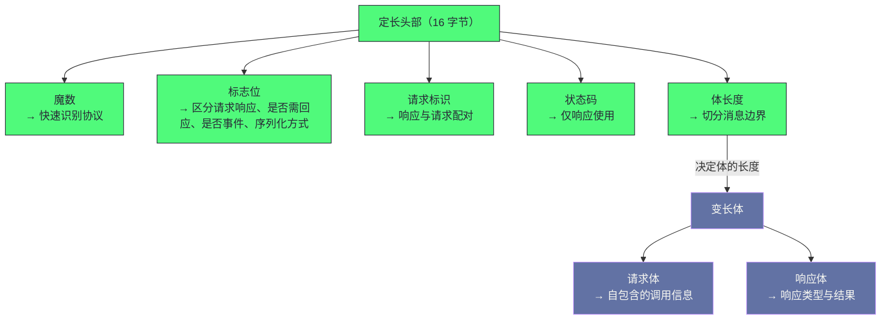

# 05 通信层——Netty 传输与 Dubbo 协议

**摘要：**

通信层是最贴近网络的一层，它要回答三个问题：**"请求如何被编码成字节""字节如何在连接上传输""接收端如何还原成方法调用"。** 而这三个问题的答案，构成了"协议加传输加关联"三段结构。其中有两处设计特别值得留意：**第一处是"自定义二进制协议"**——它用"更小的报文、更快的解析、以及同连接上的并发请求"换来了性能，代价是"失去了通用协议的生态与可调试性"；**第二处是"请求响应关联"**——它用"一个全局的请求标识到等待者的映射"，把"全双工的网络通信"包装成了"同步调用"的语义。本文按"通信层要解决什么 → 为什么自定义协议 → 报文格式 → 粘包拆包 → 连接管理 → 心跳 → 请求响应关联 → 异步调用 → 序列化"展开。先说明三个问题、三条设计原则与四处代价；再讲自定义协议的三个动机与它的代价、报文的定长头与变长体、标志位的位域设计。然后剖析粘包拆包的解法、连接复用的依据（多路复用）、心跳的两个机制与间隔的取舍。之后是请求响应关联的解法与调用流程、异步调用的实现与两种形态、序列化的多种实现与取舍维度、以及反序列化的安全风险。最后是边界反例与落点。

---

## 第 1 章 通信层要解决什么

### 1.1 三个问题

**通信层要回答三个问题。**

**问题一："请求如何被编码成字节"**——**也就是"报文的格式"。**

**问题二："字节如何在连接上传输"**——**也就是"连接的管理与复用"。**

**问题三："接收端如何还原成方法调用"**——**也就是"编解码与请求响应的关联"。** **而"关联"这一步'是同步调用语义的来源'**——**因此"它是'把网络通信包装成方法调用'的关键一步"。**

**三个问题的答案分别对应"协议、传输、交换"三层**——**而"三层的关系是'协议定义格式、传输负责搬运、交换负责配对'"。

**因此"理解通信层"的第一步是"把这三层分开看"**——**因为"很多问题'看起来是通信问题'，实际只出在其中一层"。

### 1.2 三条设计原则

**通信层遵循三条设计原则。**

**原则一：报文尽量小。** **因为"网络传输的开销'与字节数正相关'"**——**因此"减少报文体积'能直接降低开销"。** **这条原则'在小请求场景下收益最大'。**

**原则二：解析尽量快。** **因为"每个报文都要被解析"**——**因此"解析方式'直接影响'单位时间能处理多少请求'"。** **这条原则'在高频场景下与报文体积同等重要'。**

**原则三：连接尽量复用。** **因为"建立连接的成本很高"**（"包括握手与状态维护"）——**因此"复用连接'能摊薄'连接成本'"。** **而"复用的前提'是'能检测连接是否仍然可用'"**——**因此"复用必然伴随健康检测"。**

**三条原则的关系是"前两条决定'协议设计'，第三条决定'传输设计'"**——**而"三条的共同目标是'让单位连接能承载更多请求'"。** **因此"三条原则'最终都服务于吞吐"。**

### 1.3 四处代价

**通信层有四处代价。**

**其一：自定义协议失去通用性。** **因为"自定义协议'只有自己的客户端能解析'"，**因此"它'不能被通用工具直接分析'"**（例如"浏览器或标准的抓包工具'只能看到二进制"）。

**其二：多路复用带来状态维护。** **因为"同一连接上有多个并发请求"**——**因此"需要'请求标识与等待者的映射'"**——**而"这个映射'需要被正确维护与清理"。

**其三：心跳的固定开销。** **因为"要检测连接是否存活"**——**因此"需要周期性发送心跳"**——**而"心跳'占用带宽与服务端处理能力'"。** **而"它的特点是'与业务量无关、恒定存在'"。**

**其四：序列化的兼容性负担。** **因为"序列化方式'与'类的结构'绑定"**——**因此"改类结构'可能影响兼容性"**——**而"多种序列化方式并存'增加了'兼容性维护的成本'"。

**四处代价的共同特征是"它们是'性能与专用性'的对价"**：**"专用"带来"性能"，代价是"通用性"；"复用"带来"吞吐"，代价是"状态维护"。** **因此"通信层的优化"始终在"性能与复杂度之间取平衡"。**

### 1.4 一个类比：专线电话与信件

**把这套机制类比成"专线电话"会更容易理解它的结构。**

**"每次打电话都要重新拨号接通"对应"每请求建立新连接"**——**而"这太慢"，因此"要复用"。

**"一条线上同时说多件事"对应"多路复用"**——**而"为了区分'哪句回应哪句'，需要'给每句话编号'"**——**这正是"请求标识"的类比形态。

**"每隔一段时间说一句'还在吗'"对应"心跳"**——**而"如果很久没听到回应，就认为对方走了"**对应"超时检测"。

**"双方说同一种方言"对应"使用同一种协议"**——**而"方言比通用语言'更简短高效'"**，代价是"外人听不懂"。

**"说话内容要压缩成约定格式"对应"序列化"**——**而"不同格式'压缩率与解析速度不同'"。

**这个类比的用处在于"它把四处代价变成了可感知的日常经验"**：**方言外人听不懂（失去通用性）、要记编号（状态维护）、要定期确认（心跳开销）、格式要约定（兼容性负担）。**

### 1.5 三层与它们各自的故障形态

**把三层分开看，能快速定位"问题出在哪一层"。**

**协议层的问题表现为"解析失败或数据错乱"**——**因为"它负责格式，所以格式不匹配时'要么解析不出来，要么解析出错误的内容'"。

**传输层的问题表现为"连接超时、连接断开、连接建立失败"**——**因为"它负责搬运，所以搬运不成功时'表现为连接层面的事件"。

**交换层的问题表现为"请求超时但没有连接错误"**——**因为"它负责配对，所以配对不上时'请求会一直等不到响应'"。

**三处表现的分工说明一条判据**：**"看到连接错误'方向在传输层"，"看到解析错误'方向在协议层"，"看到请求超时而连接正常'方向在交换层"**。

**这条判据的实用价值在于"它把'通信问题'一次分成三类"**——**而"分类'能大幅缩小排查范围"**。** 这与第 3 篇讲的"按分层定位现象"是同一方法的细化。**

**一处补充是"三类问题'可能叠加'"**：**例如"连接不稳定'会'同时造成连接错误与请求超时'"**——**因此"看到两类现象同时出现时，应当'先查更底层的那一类'"。**

---

## 第 2 章 为什么用自定义二进制协议

### 2.1 三个动机

**自定义协议有三个动机，而它们都与"性能"相关。**

**动机一：报文更小。** **因为"通用文本协议的头部'动辄数百字节'"**——**而"自定义二进制协议的头部'可以只有十几个字节'"**——**因此"小请求的传输开销'显著降低'"。

**动机二：解析更快。** **因为"二进制格式'可以直接按固定偏移读取字段'"**——**而"文本格式'需要逐字符解析'"**——**因此"单位时间的解析量'显著提升'"。

**动机三：支持同连接并发。** **因为"通用协议的早期版本'是'一个连接同时只有一个请求在途'"**——**而"自定义协议'通过请求标识'支持'同连接上多个请求在途'"**——**因此"连接利用率更高"。

**三个动机的共同特征是"它们都在'降低单位请求的开销'"**——**而"在'高频小请求'的场景下，这些开销'占比很高'"。

### 2.2 与通用协议的对比

**"自定义"与"通用"的差别可以按四个维度对比。**

| 维度 | 自定义二进制协议 | 通用文本协议 |
|---|---|---|
| 头部体积 | 很小 | 较大 |
| 解析速度 | 快（按偏移读取） | 慢（需解析文本） |
| 同连接并发 | 支持 | 早期版本不支持 |
| 生态与工具 | 专用 | 通用 |
| 可调试性 | 差（二进制） | 好（可读文本） |
| 跨语言 | 需专用客户端 | 天然支持 |

**这张表里最值得留意的是"最后三行"**：**它们都是"自定义协议的代价"**——**也就是"生态、可调试性、跨语言"。**

**而"这三处代价"在不同场景下的严重程度不同**：**在"内部服务间调用"的场景下，"跨语言与生态"的需求低**——**因此"自定义协议是划算的"**；**而在"需要被外部系统调用"的场景下，通用协议更合适**。

### 2.3 自定义协议的代价

**自定义协议的三处代价值得展开。**

**第一处是"调试困难"**：**因为"二进制格式'不能被直接阅读'"**——**因此"排查时'需要专用工具或代码来解码"**——**而"这增加了'排查的门槛'"。

**第二处是"生态缺失"**：**因为"通用协议'有大量现成的工具"**（例如"网关、负载均衡、监控"）——**而"自定义协议'需要'每一处都专门支持'"**——**因此"接入新基础设施的成本更高"。

**第三处是"演进约束"**：**因为"协议是双方的约定"**——**因此"改协议'需要'双方同时支持'"**——**而"在'客户端升级缓慢'的环境里，这个约束很硬"**（第 2 篇已展开"生态升级慢"这处约束）。

**三处代价的共同特征是"它们是'专用性'的必然结果"**——**而"这解释了'为什么较新版本要引入基于通用协议的方案'"**（第 11 章展开这处演进）。

### 2.4 一处关于"协议演进"的观察

**"自定义协议"与"通用协议"的关系值得再展开一层，因为它体现了"专用与通用"的长期演化规律。**

**演化规律是"专用方案'先出现（因为它性能好），通用方案'后出现（因为它生态好）"**——**而"最终的形态'往往是'两者并存'"**。

**并存的形态通常是**：**"内部高频调用'用专用方案"，"对外或跨语言调用'用通用方案"**——**而"两种方案'共存于同一个框架里"。

**这处并存的收益是"按场景取用各自的优势"**——**而它的代价是"框架需要维护两套通信实现"**——**因此"维护成本上升"。

**这条演化规律的通用性在于"它适用于所有'性能与生态的取舍'"**（例如"存储引擎的专用格式与通用格式"）——**而"并存的判断依据'是'场景是否可分'"**。** 这与第 18 篇讲的"两个维度而非替代关系"是同一类判断。**

---

## 第 3 章 报文格式

### 3.1 定长头加变长体

**报文的整体结构是"固定长度的头部加可变长度的体"。**

**"定长头"的意义是"解析时可以'直接按偏移读取'"**——**因此"解析'不需要'先判断头有多长'"**——**而"这消除了'解析头本身需要递归'的问题"。

**"变长体"的意义是"内容长度不受限制"**——**而"它的长度'由头部里的长度字段给出'"。

**这处结构的通用性很强**：**它出现在"几乎所有的二进制协议里"**——**而"原因是'定长头让解析有确定的起点'"。** **这与第 2 篇讲的"日志块有定长头"、第 10 篇讲的"页有固定头部"是同一手法**：**"用'定长前缀'让'解析可定位'"。**

### 3.2 五个字段的作用

**头部包含五个字段，而它们各自承担一处判断。**

**第一个是"魔数"**——**它"用于'快速判断这是不是本协议的报文'"**——**因此"可以'直接丢弃非本协议的数据'"。

**第二个是"标志位"**——**它"表达'这是请求还是响应、是否需要回应、是不是事件报文、以及用哪种序列化'"。

**第三个是"请求标识"**——**它"用于'把响应与请求配对'"**——**而"它是多路复用的关键"。

**第四个是"状态码"**——**它"只在响应里使用"**——**因此"请求报文里这个字段是空的"。

**第五个是"体长度"**——**它"用于'切分消息边界'"**——**因此"它解决了'粘包拆包'"。

**五个字段的共同特征是"它们都是'判断所需的最小信息'"**——**而"设计报文时'只放'接收方必须知道的东西'"**是一条通用原则。

### 3.3 标志位的位域设计

**"标志位用一个字节表达四种信息"这处设计值得单独说明。**

**它的做法是"把一个字节分成四段"**：**最高位是"请求还是响应"**，**次高位是"是否需要回应"**，**第三高位是"是不是事件报文"**，**而"剩下的五位'是序列化方式标识'"。

**这处设计的收益是"用一个字节表达了四种信息"**——**因此"头部体积被压到最小"。

**而它的代价是"可扩展性受限"**：**因为"五种信息'分完了八个位'"**——**因此"再加一种信息'就需要'扩大标志位'"**——**而"这属于'协议变更'，需要双方支持"。

**这条取舍的形态值得留意**：**"位域'是'极致压缩'的典型手法"**——**而"它的代价总是'扩展性'"。** **这与第 5 篇讲的"位图的编码'用一位表达三种状态'"是同一类**：**"压缩'与'扩展性'之间存在张力"。**

### 3.4 请求体与响应体

**请求体与响应体的内容不同，而它们的差异反映了"两端的职责不同"。**

**请求体的内容是"版本、接口名、接口版本、方法名、参数类型描述、参数值、附加参数"**——**而"它'包含了一次调用所需的全部信息'"。

**响应体的内容是"响应类型（正常、异常、空值）与'响应值或异常对象'"**——**而"响应类型'区分了'三种结果形态'"。

**两者的差异在于"请求体'必须自包含'"**（因为"提供方'可能不记得之前的上下文'"）——**而"响应体'只需要表达结果'"**（因为"它'是对某个请求的回答'"）。

**这处差异的通用性在于"它体现了'请求与响应的信息不对称'"**——**而"这类不对称'在所有'请求响应式协议'里都存在"。**

### 3.5 报文结构的整体视图

把报文的字段与它们的用途画在一起，能看清"每个字段解决了哪个问题"。

**图中最值得注意的是"体长度指向变长体"这条边**：**它说明"头部与体之间'有一个显式的引用关系'"**——**而"正是这条引用'让粘包拆包成为可解决的问题'"。

**另一处值得注意的是"五个字段各解决一个独立问题"**：**识别协议、区分类型、配对请求、表达结果、切分边界**——**而"这五件事'恰好是接收方必须知道的最小信息集'"。

**这张图的实用价值在于"它把'为什么头部是 16 字节'这处设计解释清楚了"**——**因为"五个字段各自有不可替代的用途"**，**因此"任何一个都不能省"。**

### 3.6 一处关于"状态码"的观察

**"状态码'只在响应里使用"这处细节值得说明，因为它体现了一处"信息归属"的设计。**

**它的含义是"错误的分类'由'提供方或客户端'在响应时给出"**——**而"请求报文里'不需要这个字段'"。

**这处设计的收益是"请求报文更小"**——**因为"它省掉了一个字节"**——**而在"高频小请求"的场景下，"每个字节都值得省"。

**而它的代价是"请求与响应的头部'不完全对称'"**——**因此"编解码逻辑'需要区分两种情形"**——**而"这类不对称'增加了实现的复杂度"。

**这处取舍的形态值得留意**：**"省一个字节"与"增加一处分支"之间"选择了前者"**——**而"这个选择'反映了'协议设计对体积的重视程度'"。

**这条观察的实用价值在于"它说明了'协议设计里的每一处取舍都被认真衡量过'"**——**而"理解这些取舍'才能理解'为什么协议是这个样子'"。** **这与第 3 篇讲的"报文的每个字段都不可省"是同一视角。**

---

## 第 4 章 粘包与拆包

### 4.1 为什么需要处理

**"粘包与拆包"这个问题的根源是"流式协议没有消息边界"。**

**具体来说**：**"网络传输的是字节流"**——**因此"一次读取'可能读到'半个报文'，也可能读到'一个半报文'"**——**而"应用层'需要'知道'一条消息到哪里结束'"。

**这个问题的普遍性值得强调**：**"所有基于流的协议'都要解决它"**——**而"不同的解法'只是'边界标记的方式不同'"。** **因此"看到'粘包拆包'这个词时，应当想到的是'如何标记消息边界'，而不是'网络出了问题'"。**

### 4.2 解法

**这套机制的解法是"用头部里的长度字段"**——**而"解码器'按长度字段切分'"。

**具体过程是**：**"先读取固定长度的头部"**——**"从头部里取出体长度"**——**"然后'等待体长度个字节到齐'"**——**"到齐后'把'头加体'作为一个完整消息交给业务处理器"。

**这处解法的关键是"长度字段的位置固定"**——**因此"解码器'知道'从哪里取长度'"**——**而"这正是'定长头'的价值所在"**（第 3.1 节）。

**一处实现细节是"长度字段的偏移与大小需要配置"**——**而"配置错误'会导致'解码失败或消息错位'"**——**因此"这类问题'表现为'无法解析或解析出乱码'"。

### 4.3 这处设计的通用性

**"用长度字段标记边界"这处设计的通用性值得说明。**

**它的形态是"在消息前部放一个'表示消息有多长'的字段"**——**而"接收方'先读长度、再读内容'"。

**这处设计在本专栏里出现过多次**：**第 2 篇讲的"协议用长度字段标记边界"**、**第 7 篇讲的"日志块用数据长度字段"**。**它们的共同特征是"用'自描述的长度'替代'外部的边界标记'"。

**而它的代价是"需要信任长度字段"**：**因为"如果长度字段被篡改或损坏，接收方会'读到错误的内容'"**——**因此"需要额外的校验"（例如"魔数校验"或"校验和"）。

**这条"自描述长度加校验"的组合是"所有可靠二进制协议的基础"**——**而"理解它'就能理解'为什么协议设计里'总有一个魔数和一个校验值'"。**

### 4.4 一处关于"消息边界"的观察

**"消息边界"这个问题值得再展开一层，因为它是"所有流式协议的基础问题"。**

**问题的本质是"流'没有天然的分段'"**——**而"分段'必须由'应用层的约定'提供"。

**而"约定的方式'有三类"**：**其一是"长度前缀"**（也就是"先声明有多长"）；**其二是"分隔符"**（也就是"用特殊字节序列标记结束"）；**其三是"固定长度"**（也就是"每条消息长度相同"）。

**三类的取舍是**：**"长度前缀'能承载任意内容，但'需要能定位长度字段'"**；**"分隔符'实现简单，但'内容里不能出现分隔符'"**（否则需要转义）；**"固定长度'解析最快，但'只能表达等长消息"。

**因此"二进制协议'通常选长度前缀'"**——**因为"它'不受内容限制'，且'配合定长头能确定长度字段的位置'"。

**这条观察的通用性在于"它把'协议设计'归结为'边界标记方式的选择'"**——**而"看到'粘包拆包'时'应当先问'这个协议用哪种方式标记边界'"。**

### 4.5 一处关于"解码器配置"的观察

**"解码器的配置"这处实现细节值得说明，因为它是"容易配错且不易察觉"的一处。**

**它的配置包含三个参数**：**"长度字段的偏移"**、**"长度字段的大小"**、**以及"跳过多少字节后才是真正的消息体"**。

**三个参数里"偏移"最关键**——**因为"它必须与协议的头部布局一致"**——**而"不一致'会导致'把别的字段当成长度'"**——**而"后果是'读到错误的消息长度，从而解析出乱码或阻塞'"。

**因此"这类配置错误的形态是'解析异常或消息错位'"**——**而"它的特点是'不会在启动时报错，只在收到数据时暴露'"**——**因此"它属于'运行期才暴露的配置问题'"。

**这条观察的实践含义是"改协议头部时'必须同步改解码器配置'"**——**而"两者的对应关系'应当被显式记录在文档里'"**——**因为"它们是'分散在两处的同一个约定'"。** **这与第 3 篇讲的"多写入点需要同时维护"是同一类**：**"同一个约定的两处实现'必须同步"。**

---

## 第 5 章 连接管理与复用

### 5.1 默认一个连接

**默认情况下，消费方对每个提供方实例"维护一个长连接"。**

**"一个"这个默认值值得说明**：**它成立的前提是"协议支持多路复用"**——**也就是说"同一连接上'可以并发多个请求在途'"。

**而"多路复用"的实现依赖"请求标识"**：**因为"响应可以乱序返回"，所以"必须'能区分哪个响应属于哪个请求'"**（第 7 章展开）。

**因此"默认一个连接"与"多路复用"是配套的**：**"没有多路复用'就必须用'连接数'来提升并发"，**而**"有了多路复用'一个连接就够'"。

### 5.2 为什么一个够

**"一个连接就够"这处判断可以量化一下，而量化能解释"为什么这个默认值是合理的"。**

**量化的方式是"用'网络带宽'除以'单请求大小'，再乘以'并发数'"**——**而"这个结果'就是'一个连接需要承载的请求数'"。

**具体来说**：**"一条连接的带宽'通常远大于'单个请求的大小'"**——**因此"即使每秒数千次请求'也远未打满连接'"。

**因此"一个连接够'的前提是'请求不大且不需要'长连接上的流式传输'"**——**而"当'请求很大'（例如传文件）或'需要'长时间的流式响应'"时，**"一个连接会成为瓶颈"。

### 5.3 何时需要多个

**"需要多个连接"的场景有两类。**

**第一类是"单请求很大"**：**因为"大请求'会占用连接较长时间'"**——**因此"同一连接上的其他请求'被阻塞'"。

**第二类是"请求量极高"**：**因为"即使多路复用，'单连接的处理能力'也有上限'"**（例如"服务端的单连接读取线程"）。

**两类场景的共同特征是"它们都让'单连接成为瓶颈'"**——**而"判断依据'是'连接是否被某个请求长时间占用'"。

**一处值得留意的细节是"增加连接数'不是免费的'"**：**因为"每个连接'在两端都占用资源'"**（包括"内存、文件描述符、以及服务端的连接管理"）——**因此"连接数应当'按需要增加'，而不是'越多越好'"。

**这与第 4 篇讲的"长轮询的连接数代价"是同一类**：**"连接数'是一种需要被管理的资源'"。**

### 5.4 一处关于"连接复用"的经验

**"连接复用"这件事的经验值得收敛一下，因为它是"所有网络系统的基础优化"。**

**它的收益有两处**：**"省掉建连的握手成本"**（因为"握手需要多次往返"）与**"省掉连接建立期的慢启动"**（因为"传输层有拥塞控制，新连接的初期速率较低"）。

**而它的代价是"需要维护连接状态"**：**因为"复用意味着连接长期存在"**——**因此"需要检测连接是否仍然可用"**（也就是心跳，第 6 章）。

**因此"复用与心跳是配套的"**：**"复用'带来收益，心跳'是它的必要成本'"**——**而"两者缺一不可"**（"不复用则无收益，不心跳则'可能用到已死的连接'"）。

**这条经验的通用性在于"它把连接复用与健康检测绑成了一对"**——**而"看到连接池时'应当同时问'它如何检测连接是否可用'"。** **这与第 4 篇讲的"临时节点与会话绑定"是同一类**：**"复用状态'必然需要失效检测'"。**

---

## 第 6 章 心跳

### 6.1 两个机制

**心跳由两个机制配合实现。**

**机制一是"定时发送心跳包"**——**它"按固定间隔'向对端发送一个特殊报文'"**——**而"这个报文的标志位标记为事件报文"**，因此"它'不携带业务数据'"。**

**机制二是"超时检测"**——**它"按固定间隔'检查最近一次收到消息的时间'"**——**而"如果超过阈值'没有收到任何消息'"**，**则"认为连接空闲或已死"**——**而"处置方式'是重连或关闭'"。**

**两个机制的分工是"一个负责主动探测，一个负责被动判断"**——**而"两者缺一不可"**：**"只有探测而无检测'则'探测结果无人使用'"**；**"只有检测而无探测'则'长时间没有业务流量时无法判断连接状态'"。**

### 6.2 心跳的开销计算

**心跳的开销可以算一下，因为"它决定了间隔该取多大"。**

**计算方式是"用'连接数除以间隔'得到'单位时间的心跳次数'"**——**而"心跳次数乘以'集群规模'"**，**就是"整个集群每秒的心跳量"。**

**这个量级的含义值得说明**：**"心跳量'与服务端处理能力'相比'通常很小'"**——**但"它的特点是恒定存在"**（无论"业务流量多少"）——**因此"在'业务流量很低'的时段，心跳'可能成为主要流量'"。**

**这条性质解释了一处实践含义**：**"心跳间隔过短'会让'空闲时段的服务端负载'明显上升'"**——**而"这类负载'容易被误判为异常'"。** 因此"调整心跳间隔时'应当考虑'空闲时段的基线负载'"。**

### 6.3 间隔的取舍

**心跳间隔的取值存在一处取舍。**

**间隔越短，"感知连接断开越快"**——**而"代价是'心跳量越大'"。**

**间隔越长，"心跳量越小"**——**而"代价是'断开感知更慢'"。**

**因此"间隔的合理取值'取决于'两端的容忍度'"**：**"如果'连接断开后需要快速恢复'"**，**那么"间隔应当短"**；**"如果'断开后可以由业务层重试兜底'"**，**那么"间隔可以长"。**

**一处值得留意的边界是"间隔应当小于'对端的超时阈值'"**——**否则"自己还没发心跳，对端就已经判定超时'"**——**因此"两端的配置需要匹配"**。** 这与第 14 篇讲的"驱逐超时与心跳间隔需要配合"是同一类。**

### 6.4 心跳与业务共享链路

**"心跳与业务共享同一条连接"这处设计值得说明，因为它带来一处耦合。**

**耦合的表现是"业务流量拥堵时，心跳的响应也会变慢"**——**因此"心跳可能'误判连接已死'"**——**而"误判的后果是重连"**——**而"重连'会加剧拥堵'"**（因为"重连需要握手，且正在传输的请求可能失败"）。

**因此"心跳超时的阈值'应当留出余量'"**——**"不能'刚好等于'心跳间隔的若干倍"**——**因为"业务流量的波动'会让心跳响应延迟超过这个倍数'"。**

**这条耦合的形态与第 14 篇讲的"大事务阻塞心跳"是同一类**：**"控制面与数据面共享资源'会让'健康判断被业务流量影响'"。** **而"缓解方式"也一致**：**"给心跳留出余量"或"给心跳更高优先级"。**

### 6.5 一处关于"心跳与超时"的观察

**"心跳"与"业务超时"这两个概念容易混淆，因此值得辨析。**

**"心跳超时"的判据是"连接是否还活着"**——**它的处置是"重连"**——**而"它关心的是连接层面"。

**"业务超时"的判据是"某个请求是否按时完成"**——**它的处置是"重试或失败"**——**而"它关心的是请求层面"。

**两者的关系是"连接活着'不代表'请求能按时完成'"**——**因为"请求可能因为'提供方处理慢或线程池排队'而超时"**——**而"此时连接是健康的"。

**因此"两类超时'需要分别监控"**：**"心跳超时率高'说明'连接层不稳定'"**，**"业务超时率高'说明'处理能力或网络延迟有问题'"**——**而"两者的排查方向完全不同"。

**这条辨析的实用价值在于"它把'超时'这个笼统的现象'分成了两类'"**——**而"分类'是定位问题的前提"。** **这与第 1.5 节讲的"按三层分故障形态"是同一方法的另一处应用。**

---

## 第 7 章 请求响应关联

### 7.1 问题

**"请求响应关联"要解决的问题是"收到响应后，如何知道它对应哪个请求"。**

**问题的来源是全双工通信**：**因为"消费方可以连续发送多个请求"**——**而"提供方'处理快的先响应'"**——**因此"响应'可能乱序到达'"。**

**而"乱序"意味着"不能'按顺序配对'"**——**因此"必须'有一个标识来配对'"。** **这就是"请求标识"存在的理由**（第 3.2 节）。

### 7.2 解法

**解法是"用一个全局的映射，把'请求标识'对应到'等待者'"。**

**具体机制是**：**"发送请求时'创建一个等待者对象'，并'以请求标识为键存入映射'"**；**"收到响应时'用响应里的标识'从映射中取出等待者'"**——**"设置结果并唤醒它'"。**

**这处解法的关键是"标识的全局唯一性"**——**因为"映射是全局的"**——**因此"不同连接的请求'也必须有不同的标识'"。**

**一处实现细节是"等待者'必须在超时或完成后'从映射中移除'"**——**否则"映射会持续增长"**——**而"这类'只增不减的映射'是内存泄漏的常见来源"。**

### 7.3 调用流程

**同步调用的流程分两段，而两段"由不同的线程执行"。**

**第一段是业务线程**：**"构建请求、生成标识、创建等待者、存入映射、发送请求、然后'阻塞等待'"**。

**第二段是网络线程**：**"收到响应、解析出标识、从映射取出等待者、设置结果、唤醒业务线程"**。

**两段的分工是"业务线程发起并等待，网络线程接收并唤醒"**——**而"两段之间'通过等待者对象与条件变量通信'"。**

**这处分工的关键是"等待者对象'是两段之间的唯一接口'"**——**因此"它'必须线程安全'"。** **这也是"等待者内部需要锁"的原因**（因为"结果可能在任何时刻被设置"）。

### 7.4 这处设计的通用性

**"用标识加映射实现请求响应关联"这处设计的通用性值得说明。**

**它的形态是"为每个请求分配一个标识，并用一张表记录'谁在等这个标识'"**——**而"响应到达时'用标识查表'"。**

**这处设计在本专栏里出现过多次**：**第 2 篇讲的"协议用序列号配对请求与响应"**、**第 12 篇讲的"用事务标识判断可见性"**。**它们的共同特征是"用'单调或唯一的标识'替代'顺序假设'"。**

**而它的代价是"需要维护一张表"**——**因此"表的容量与清理'成为需要管理的问题"**（第 7.2 节已展开"只增不减的映射"这处风险）。

**这条取舍的通用性在于"它体现了'用空间换顺序无关性'"**——**因为"有了标识，响应可以乱序返回"**——**而"乱序'正是并发的前提'"。** **因此"这张表'是并发能力的代价"。**

### 7.5 一处关于"超时"的观察

**"超时"这件事在通信层值得单独说明，因为"它不只是一种错误，还是一种状态判定"。**

**超时的含义是"在给定时间内没有收到响应"**——**而"它'不能区分'以下三种情况"**：**"请求没发出去"**、**"对端没处理"**、**"响应在路上丢了"**。

**因此"超时'是'信息不足时的保守判断'"**——**而"它的处置方式'取决于'业务语义'"**：**"幂等的操作'可以重试"**，**"非幂等的操作'不能盲目重试'"。

**这条性质解释了"为什么超时时间'不能设得太短"**：**因为"过短会让'正常但较慢的请求'被判定为超时'"**——**而"后果是'不必要的重试或失败'"。

**而"也不能设得太长"**：**因为"过长会让'真正失败的请求'占用资源更久'"**——**而"后果是'线程被占用时间变长'"**（第 8.1 节已展开这处连锁）。

**因此"超时时间的设置'是在'误判率'与'资源占用'之间取平衡'"**——**而"这类平衡的判断依据'是'单次延迟的分布'"**（例如"取分位数而非平均值"）。

### 7.6 一处关于"映射容量"的观察

**"请求映射的容量"值得单独说明，因为它是"并发能力的直接约束"。**

**它的约束关系是"在途请求数'不能超过映射能承载的规模'"**——**而"在途请求数'由'并发量乘以延迟'决定"。

**因此"高并发加高延迟'会'让在途请求数很大'"**——**而"映射的每一项'都持有'一个等待者对象与请求信息'"**——**因此"它的内存占用'与在途请求数成正比"。

**这条约束的实践含义是"并发提升'需要同时考虑'映射的内存占用'"**——**而"忽略这一点'会导致'并发上去后出现内存问题'"。

**这条观察的通用性在于"它说明'并发能力不是无限的'"**——**而"限制它的'不只是线程或连接，还包括'为了支持并发而必须维护的状态'"。** **这与第 7.2 节讲的"映射必须清理"是同一处的两个侧面**：**"容量'与'清理'共同决定了'这张表能否支撑目标并发'"。**

---

## 第 8 章 异步调用

### 8.1 同步的代价

**同步调用的代价在第 1 篇已展开，而这里补充"它在通信层的体现"。**

**体现是"业务线程在等待期间'占用一个线程'"**——**因此"并发上限'等于线程数'"。**

**而"线程数'受内存与调度开销限制'"**——**因此"同步调用的吞吐上限'是可计算的'"**（"线程数除以单次延迟"）。

**这条约束的通信层含义是"网络往返时间'直接占用线程资源'"**——**因此"降低网络延迟'能线性提升吞吐'"。** **而"异步调用'则'把线程从等待中解放出来'"**——**因此"它的吞吐上限'不受线程数限制'"。**

### 8.2 异步的实现

**异步调用的实现是"业务线程不阻塞等待，而是'立即返回并保留一个凭据'"。**

**具体机制是**：**"调用后'立即返回一个占位结果'"**——**而"真正的结果'通过一个可等待的对象提供'"**——**而"业务代码'稍后通过这个对象获取结果'"。**

**这处机制的关键是"等待者对象'同时承担了同步等待与异步回调两种用法'"**——**因此"同步与异步'共用同一套底层机制'"。** **这与第 2 篇讲的"装饰器与过滤器共用统一抽象"是同一手法**：**"共用底层'让两种用法可以无缝切换"。**

### 8.3 异步的两种形态

**异步有两种形态，而它们的差别在于"是否提供链式处理"。**

**第一种是手动获取结果**：**业务代码"先发起调用，再做别的事，最后手动获取结果"**——**而"它的写法'偏向命令式'"。**

**第二种是链式处理**：**业务代码"发起调用后'直接注册回调'"**——**而"回调'在结果到达时执行'"**——**而"这种写法'偏向声明式'"。**

**两种形态的共同特征是"它们都'不阻塞业务线程'"**——**而"差别在代码组织方式"**。** 而"链式处理'更适合'多个异步操作串联'的场景'"**（因为"它避免了嵌套回调"）。

**这条差别的实践含义是"异步改造'不只是换个 API'，还需要'改代码组织方式'"**——**因此"它的改造范围'往往超出预期'"。** **这也是"为什么异步改造'常被低估工作量"的原因。**

### 8.4 一处关于"异步收益"的观察

**异步的收益值得量化一下，因为它决定了"该不该做异步改造"。**

**收益的量级是"并发能力的上限提升"**：**同步调用下"上限等于线程数"**，**而异步调用下"上限等于'连接与内存能承载的在途请求数'"**。

**而"这个比值'通常在'数十倍到数百倍'"**——**因为"线程数是有限的（受内存限制）"，而"在途请求数'只受内存与连接限制'"。

**因此"异步的收益'在高延迟场景下更明显"**：**因为"延迟越长，同步调用占住线程的时间越长"**——**因此"并发上限越低"**——**而"异步的收益'是'延迟越长收益越大'"。

**这条量化的实用含义是"异步改造'应当优先用在'高延迟且高并发'的接口上"**——**而不是"全面铺开"**——**因为"低延迟接口的收益小，而改造的成本与风险相同"。

**这条判断的通用性在于"它把'优化选择'归结为'收益量级的比较'"**——**而"优先做收益量级大的'是资源分配的基本原则"。** **这与第 1 篇讲的"容灾预算按后果分配"是同一类。**

---

## 第 9 章 序列化

### 9.1 多种实现

**序列化通过扩展机制支持多种实现，而它们的差别集中在"速度、体积、兼容性、跨语言"四处。**

| 实现 | 速度 | 体积 | 跨语言 | 兼容性 |
|---|---|---|---|---|
| 文本类 | 慢 | 大 | 好 | 好（可读） |
| 二进制通用类 | 中 | 中 | 差 | 好 |
| 高性能二进制类 | 快 | 小 | 差 | 差（需注册类） |
| 结构化二进制类 | 快 | 最小 | 好 | 好（有模式定义） |

**这张表里最值得留意的是"兼容性与速度的反相关"**：**"速度越快的实现'往往'兼容性越差'"**——**因为"快'依赖'省略类型信息'"**，**而"类型信息'正是兼容性的基础'"。**

**因此"序列化的选择'是在性能与兼容性之间取平衡'"**——**而在"需要长期演进的接口上'应当优先兼容性'"。**

### 9.2 取舍维度

**取舍的维度可以归纳为四问。**

**第一问是"是否需要跨语言"**——**如果需要，那么"只有带模式定义的方案可选"。**

**第二问是"是否需要长期兼容"**——**如果需要，那么"应当避免依赖类注册的方案'"**（因为"类结构变化会破坏兼容性"）。

**第三问是"性能是否关键"**——**而"关键的程度'取决于请求频率与体积'"。**

**第四问是"是否有现成的模式定义"**——**因为"结构化方案'需要预先定义模式'"**——**而"如果接口已经用接口定义语言描述过，那么它的成本很低"。**

**四问的共同特征是"它们都在缩小候选范围"**——**而"按顺序回答'就能'快速定位'该用哪种"。**

### 9.3 一处关于"序列化演进"的观察

**序列化的演进方向值得说明，因为它体现了"性能与兼容性的长期博弈"。**

**演进的第一阶段是"通用二进制"**——**它"兼容性好、跨版本稳定"**，**代价是"速度与体积都不占优"。**

**演进的第二阶段是"高性能二进制"**——**它"速度与体积都大幅改善"**，**代价是"需要注册类，因此兼容性差"。**

**演进的第三阶段是"带模式定义的结构化二进制"**——**它"同时满足速度、体积、跨语言与兼容性"**，**代价是"需要预先定义模式"。**

**三阶段的共同特征是"后一阶段'吸收了前一阶段的教训'"**：**第一阶段"忽视性能"，第二阶段"忽视兼容性"，第三阶段"试图两者兼顾"。**

**而"第三阶段的代价'是'前期投入'"**——**因为"定义模式'需要在开发阶段完成"**——**因此"它的成本'在开发期'，而收益'在运行期与演进期'"。

**这条演进规律的实用价值在于"它给出了'该选哪个阶段'的判据"**：**"如果接口'需要长期演进'且'有跨语言需求'，那么第三阶段的收益最大"。** **这与第 3 篇讲的"渐进式过渡"是同一类判断**：**"演进方向'总是'在保留已有优势的同时补上短板'"。**

### 9.4 反序列化安全

**序列化有一处安全风险值得单独说明，而它是"这类协议最严重的风险之一"。**

**风险是"反序列化可能执行任意代码"**：**因为"某些序列化机制'在反序列化时会实例化类并调用其方法'"**——**因此"构造一个恶意的序列化流'可能触发危险代码"。

**因此"服务端'不应当无限制地反序列化来自任意来源的数据'"**——**而"防护方式有两类"**：**"限制可反序列化的类"**（也就是白名单）与**"在反序列化之前做校验"**。

**这条风险的严重性在于"它'绕过了一切业务层的校验'"**：**因为"反序列化'发生在业务逻辑之前'"**——**因此"它'不受任何应用层防护的保护'"。

**这条风险给出一条实践纪律**：**"对'能被外部访问的 RPC 端点'，应当'启用类白名单'"**——**而"这类配置'在'内网环境'下容易被忽略'"**——**而"内网被突破后'它就成为横向移动的入口'"。**
---

## 第 10 章 边界与反例

### 10.1 反例一：把"粘包拆包"当作"网络故障"

它的根源是"流式协议没有消息边界"，**而解法是"用长度字段标记边界"**（第 4.1 节）。

### 10.2 反例二：把"自定义协议"当作"只有好处"

它"失去通用性、可调试性与跨语言能力"（第 2.3 节）。

### 10.3 反例三：把"一个连接"当作"永远够用"

"大请求或流式响应"时它会成为瓶颈（第 5.3 节）。

### 10.4 反例四：把"心跳间隔"当作"越短越好"

它"在空闲时段成为主要流量"（第 6.2 节）。

### 10.5 反例五：把"心跳超时"当作"可以刚好等于间隔的若干倍"

业务流量波动会让心跳响应延迟超过阈值（第 6.4 节）。

### 10.6 反例六：把"请求映射"当作"不需要清理"

"只增不减的映射"是内存泄漏的常见来源（第 7.2 节）。

### 10.7 反例七：把"序列化"当作"只与性能相关"

它还有"兼容性与安全"两处维度（第 9.2、9.3 节）。

---

## 第 11 章 落点

回到开头：**通信层要回答的三个问题，答案分别是什么？**

**"请求如何被编码"的答案是"定长头加变长体，用长度字段标记边界"**；**"字节如何传输"的答案是"复用连接加多路复用"**；**"接收端如何还原"的答案是"用请求标识配对响应"**。

**而这套机制最值得记住的一处取舍是"专用与通用的对立"**：**"自定义协议"带来"更小的报文、更快的解析、更强的并发能力"**，**代价是"失去生态、可调试性与跨语言能力"。** **因此"该不该自定义协议"取决于"是否需要被外部系统调用"**——**而"较新版本引入基于通用协议的方案"，正是"为了补上这三处代价"**（第 11 篇展开）。

**另一条判断是"并发能力'需要一张表来支撑'"**：**因为"响应可以乱序返回"**，**所以"必须'用标识加映射来配对'"**——**而"这张表'是并发的代价"。** **理解这一点，就能理解"为什么'映射的清理'是'正确性的一部分'，而不是'可选的优化'"。

**最后一条判断值得留下：控制面与数据面共享资源，会让健康判断被业务流量影响。** **"心跳与业务共享连接"就是这处耦合的体现**——**而"缓解方式'是'给控制面留出余量'"。** **这条判断'在分布式系统里反复出现'"**（第 14 篇的"大事务阻塞心跳"是同一形态）。

**还有一条辨析值得带走："心跳超时"与"业务超时"是两类问题**——**前者说明连接层不稳定，后者说明处理能力或网络延迟有问题**——**而"两者的排查方向完全不同"。** **因此"看到超时率高时，第一步是区分是哪一类"。

**最后，本篇最值得记住的一处手法是"用定长头让解析可定位"**：**"定长头"解决了"解析从哪里开始"，"长度字段"解决了"消息到哪里结束"**——**而"这两个问题'是所有流式协议的基础问题"。** **它们在本专栏里反复出现**（"日志块的定长头""页的固定头部"），**而"共同特征是'用定长前缀换取解析的确定性'"。

**本篇与前后篇的关系值得点明**：**第 4 篇讲"如何找到提供方"，本篇讲"找到之后如何把请求发出去"，而下一篇讲"有多个提供方时选哪个、失败了怎么办"。** **三者合起来，才是"一次调用从发现到完成的完整链路"。**

---

## 专栏导航

- 上一篇：[[04 注册中心——ZooKeeper、Nacos 与服务发现模型]]。
- 下一篇：[[06 负载均衡与集群容错]]。
- 返回专栏首页：[[00 专栏导览]]。

---

## 参考资料

1. Apache Dubbo 源码：`dubbo-remoting/dubbo-remoting-api/src/main/java/org/apache/dubbo/remoting/exchange/`、`dubbo-remoting-netty4/`、`dubbo-rpc/dubbo-rpc-dubbo/.../DubboCodec.java`、`dubbo-serialization/`。
2. Apache Dubbo. 官方文档：通信协议与报文格式. https://dubbo.apache.org/zh/docs/references/protocol/
3. Apache Dubbo. 官方文档：连接管理与心跳配置. https://dubbo.apache.org/zh/docs/references/xml/dubbo-protocol/
4. Apache Dubbo. 官方文档：异步调用与线程模型. https://dubbo.apache.org/zh/docs/advanced/async-call/
5. Apache Dubbo. 官方文档：序列化扩展与安全建议. https://dubbo.apache.org/zh/docs/advanced/serialization/
6. Netty. 官方文档：粘包拆包与编解码器. https://netty.io/wiki/user-guide-for-4.x.html
7. Apache Dubbo. GitHub 仓库与源码说明. https://github.com/apache/dubbo

---

> [!note] 思考题
> 1. 自定义二进制协议的三处代价是什么？它们在什么场景下最严重？
> 2. "定长头加变长体"这处结构，为什么能同时解决"解析定位"与"消息边界"两个问题？
> 3. 为什么"默认一个连接"成立的前提是"协议支持多路复用"？
> 4. 心跳与业务共享连接会带来什么耦合？缓解方式是什么？
> 5. 为什么说"请求映射的清理是正确性的一部分，而不是可选的优化"？
