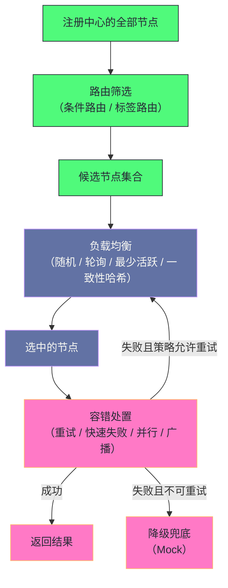

# 06 负载均衡与集群容错

**摘要：**

当服务有多个提供方实例时，集群层要回答两个问题：**"选哪个节点发请求"与"调用失败时怎么办"。** 而在这两个问题之前，还有一个更容易被忽略的环节：**"哪些节点有资格成为候选"**——也就是路由。因此集群层的完整顺序是**"路由筛选、负载均衡挑选、容错处置"**，而**顺序不能颠倒**（因为"先挑再筛"会选出不合规的目标）。本文按"集群层要解决什么 → 四种负载均衡算法 → 权重的来源 → 六种容错策略 → 失败重试的细节 → 路由 → 降级"展开。先说明两个问题、三层顺序与四条设计原则、四处代价；再逐一剖析四种负载均衡算法（加权随机、平滑加权轮询、最少活跃数、一致性哈希）的原理与各自的适用边界、以及"权重从哪来"（静态配置与动态预热）。然后对比六种容错策略的代价与适用场景，并展开失败重试的三处关键细节（只重试非业务异常、避开已失败节点、重试的放大效应）与"幂等性约束"。之后是条件路由与标签路由（灰度发布的核心工具）、路由的"强制与降级"配置、以及 Mock 降级机制与它的触发时机。最后是边界反例与落点。

---

## 第 1 章 集群层要解决什么

### 1.1 两个问题

**集群层要回答两个问题。**

**问题一："选哪个节点"**——**也就是负载均衡。**

**问题二："失败怎么办"**——**也就是容错。**

**而这两个问题之前还有一个前置问题："哪些节点有资格"**——**也就是路由。**

**三个问题构成了一条流水线**：**路由"缩小候选集合"，均衡"在候选里挑一个"，容错"处理挑选之后的失败"。** **因此"理解集群层"的第一步是"看清这三步的顺序"。**

### 1.2 三层顺序为什么不能颠倒

**"路由、均衡、容错"的顺序不能颠倒，而理由值得说清。**

**"路由必须在均衡之前"**：**因为"均衡是'从候选里挑一个'"，**而**"如果先挑再筛，那么'挑出的可能是不合规的节点'"**——**因此"筛选必须先完成"。**

**"容错必须在均衡之后"**：**因为"容错是'对某次挑选的结果做处置'"，**而**"没有挑选'就没有需要处置的对象"。**

**因此"三层的顺序是由'各自的输入依赖'决定的"**——**而"这类顺序必然性"在本专栏里反复出现**（第 3 篇的"注入必须在包装之前"、第 15 篇的"恢复四阶段的顺序"）。

**这条顺序的实践含义是"排查'请求打到了不该打的实例'时方向在路由"**——**而"排查'流量分布不均'时方向在均衡"，**"排查'失败没有重试'时方向在容错"**。** 这与第 3 篇讲的"按环节定位"是同一方法。

### 1.3 四条设计原则

**集群层遵循四条设计原则。**

**原则一：候选先约束，再挑选。** **因此"路由先于均衡"。**

**原则二：选择依据尽量简单且可预测。** **因为"均衡'在每次调用时都要执行'"**——**因此"它的计算开销'会乘在调用量上'"。** **这条原则解释了"为什么默认算法是随机"**（因为它"最简单"）。

**原则三：失败处置要与业务语义匹配。** **因为"不同的操作'对重复执行的容忍度不同'"**——**因此"容错策略'不能'全局统一设置'"。

**原则四：降级要区分故障类型。** **因为"业务异常'与'基础设施故障'的处置方式不同"**——**因此"降级'只在基础设施故障时触发'"。

**四条原则的关系是"前两条决定'如何选'，后两条决定'失败与降级如何处理'"**——**而"四者的组合"构成了"集群层的完整形态"。

### 1.4 四处代价

**集群层有四处代价。**

**其一：均衡的每调用开销。** **因为"每次调用都要选一次"**——**因此"算法复杂度'直接乘在调用量上"**——**而"这是'为什么默认算法最简单'的原因"。

**其二：重试的放大效应。** **因为"重试'会把一次失败变成多次请求'"**——**因此"故障期间'实际请求量可能数倍于正常'"**——**而"这会'加剧故障'"。

**而"这处放大的方向与治理机制的作用方向正好相反"**——**因此"它是熔断机制存在的直接理由"。**

**其三：一致性哈希的热点问题。** **因为"相同参数'始终路由到同一节点'"**——**因此"热点参数'会让某个节点过载"**——**而"这类过载'无法靠均衡自动分散'"。

**其四：路由规则的维护成本。** **因为"路由规则'是'外置的配置'"**——**因此"规则数量增长后'它的正确性难以保证'"**——**而"规则错误'会让流量'走错方向'"。

**四处代价的共同特征是"它们是'选择与处置'的对价"**：**"选择"带来"每调用开销"，"处置"带来"放大与热点"。** **因此"集群层的优化"始终在"简单与精确之间取平衡"。

### 1.5 一个类比：分诊、选医生与复诊

**把这三层类比成"医院就诊流程"会更容易理解它们的分工。**

**"先按科室分诊"对应"路由"**——**而"分诊决定了'你有可能见到哪些医生'"。

**"在候选医生里挑一位"对应"负载均衡"**——**而"挑选方式可以是'随机''按号轮流''挑最闲的'或'固定找同一位'"。

**"这次没看成，换一位再看"对应"容错重试"**——**而"有些情况'不能重看'（例如'手术已经开始了'）"**——**这正是"写操作不能盲目重试"的类比形态。

**"医生都排满了，先给个初步建议"对应"降级"**——**而"降级给出的是'兜底答案'，不是'真实结果'"。

**"同一位患者'每次都找同一位医生'"对应"一致性哈希"**——**而"好处是'医生熟悉病史'（缓存亲和）"，坏处是"这位医生成了热点"。

**这个类比的用处在于"它把四处代价变成了可感知的场景"**：**分诊规则要维护、挑选有开销、重看可能重复、固定医生会形成热点。**

### 1.6 一条贯穿全篇的判断

**有一条判断贯穿全篇，而它值得先提出来。**

**这条判断是"集群层的每个选择，都会在调用量上被放大"。**

**它的第一处体现是"均衡算法的开销"**：**因为"每次调用都要选一次"**，**所以"算法复杂度'乘以调用量'就是'总开销'"。

**它的第二处体现是"重试的放大"**：**因为"一次失败'会变成多次请求'"**，**所以"故障期间'请求量数倍于正常'"。

**它的第三处体现是"并行调用与广播的放大"**：**因为"它们'把一次调用变成多份'"**，**所以"它们'用资源换延迟或覆盖面'"。

**三处体现的共同特征是"它们都在'放大'这个维度上"**——**而"理解'放大'能让'容量规划与故障分析'更准确'"。

**这条判断的实用价值在于"它给出了'评估集群配置时的提问方式'"**：**"这个配置'在调用量上会被放大多少倍'"**——**而"能回答这个问题的配置'才是可预期的配置"。** **这与第 4 篇讲的"设计的有效性依赖规模假设"是同一类提问方式。**

### 1.7 一处关于"配置分层"的观察

**"集群层的配置'可以分成三层"这处结构值得说明。**

**第一层是"作用于全部调用的"**——**例如"负载均衡算法"**——**它"对所有接口生效"。

**第二层是"作用于单个接口或方法的"**——**例如"容错策略与重试次数"**——**它"按接口或方法配置"。

**第三层是"作用于单次调用的"**——**例如"标签与超时"**——**它"由调用方在运行时指定"。

**三层的关系是"越靠下'优先级越高'"**——**也就是"单次调用'可以覆盖'接口级配置'，而'接口级配置'可以覆盖'全局配置'"。** **这与第 3 篇讲的"配置合并的就近覆盖"是同一规则**。

**这条分层结构的实用价值在于"它给出了'配置应当放在哪一层'的判据'"**：**"通用且稳定的'放全局"，"因接口而异的'放接口级"，"因调用而异的'放运行时"。** **而"把'因接口而异'的配置放在全局'会导致'某些接口的行为错误'"**（第 4.6 节已展开这处风险）。

---

## 第 2 章 四种负载均衡算法

### 2.1 加权随机

**加权随机的做法是"按权重划分区间，然后'生成随机数落在哪个区间就选哪个'"。**

**它的机制是"把权重累加成区间端点"**——**因此"权重越大，区间越宽，被选中的概率越高"。

**一处实现优化值得留意**：**"当所有权重相同时，退化为'直接均匀随机'"**——**因为"此时不需要'计算区间与遍历'"**——**因此"它避免了'无意义的计算'"。

**这条优化的意义在于"它让'最常见的情况'最省开销"**——**而在"权重通常都相同"的场景下，**这条优化"覆盖了绝大多数调用"。** **这与第 5 篇讲的"权限判定把最可能满足的条件排在前面"是同一思路。**

**它的适用场景是"无状态的通用服务"**——**因为"随机在大量请求下'会趋向均匀分布'"（大数定律）。** **而它的边界是"短期内可能不均匀"**——**因此"它不适合'需要严格均匀'的场景"。

### 2.2 平滑加权轮询

**平滑加权轮询解决的是"朴素轮询在权重不均时'出现突刺'"这个问题。**

**问题的形态是**：**"权重为五比一时，朴素轮询的序列是'连续五次 A、然后一次 B'"**——**因此"短时间内 A 承受了五倍流量"，**而**"这类突刺'对 A 不友好'"。

**平滑的解法是"引入一个动态权重"**——**它的规则是**：**"每次选择前'给所有节点的动态权重加上各自的配置权重'"**，**"选出动态权重最大的"**，**"然后'把它减去总权重'"。

**这条规则的效果是"高权重节点'被选中后会被'扣分'，从而'让出下一次机会'"**——**因此"选择序列'变得交错而非集中'"。

**这处算法的通用性在于"它用一个'动态调整量'把'长期比例'与'短期平滑'同时满足"**——**而"这类'记账式'的手法在别处也出现"**（例如"流量整形"）。** 它的代价是"需要维护每个节点的动态权重"**——**因此"多了一处状态"。

**一处补充是"为什么朴素轮询的突刺是问题"**：**因为"连续承受多倍流量'会让'该节点的延迟上升'"**——**而"延迟上升'又会让'它的在途数累积'"**——**因此"突刺'可能引发'短时的正反馈'"。** **而"平滑轮询'正是'通过打散顺序来避免这处反馈'"。**

### 2.3 最少活跃数

**最少活跃数的做法是"优先发给'当前在途请求最少'的节点"。**

**它的机制是"每个节点维护一个在途请求计数器"**——**"发出请求时加一，收到响应时减一"**——**而"选择时'取计数最小的'"。

**这处算法的巧妙之处在于"它用'在途数'间接反映了'处理速度'"**：**"响应快的节点'在途数很快降下来'，因此'获得更多请求'"**；**而"响应慢的节点'在途数持续累积'，因此'被自动减少请求'"。

**而"这处间接性带来的另一处好处是它对节点异构天然友好"**——**因为"异构节点的处理速度差异会直接体现在在途数上"**，**而"不需要预先配置权重来体现这种差异"。**

**而"它的代价是权重对它失效"**——**因此"在需要按容量分配的场景下，最少活跃数'不能替代'权重配置"。**

**因此"选择最少活跃数时，应当先确认'是否还需要按容量分配流量'"。**

**因此"它'不需要'测量响应时间'就能实现'按处理能力分配'"**——**而"这类'用间接指标替代直接测量'的手法"很常见。** **这与第 5 篇讲的"用变更缓冲的行哈希间接判断冲突"是同一类。

**一处重要边界值得强调**：**"这个计数器'是消费方本地维护的'"**——**也就是说"它反映的是'这个消费方自己发出去还没回来的请求数'，而不是'提供方的全局在途数'"。** **因此"多个消费方的视图'是独立的'"**——**而"这处边界'决定了它的适用性"**（第 2.5 节）。

### 2.4 一致性哈希

**一致性哈希的做法是"按请求参数的哈希值选节点"**——**因此"相同参数'始终路由到同一节点'"。

**"为什么不用普通哈希"这处问题值得说清**：**因为"普通哈希在'节点数变化时'几乎会改变所有请求的路由"**——**而"一致性哈希通过'虚拟节点加哈希环'，让'节点增减只影响少量请求'"。

**它的机制是"为每个节点创建多个虚拟节点，均匀分布在环上"**——**而"请求'按参数哈希定位到环上某点，顺时针找最近的虚拟节点'"。

**它的适用场景有两类**：**"有状态服务"**（需要"同一用户的请求始终到同一节点"）与**"缓存亲和"**（需要"相同商品 ID 的请求命中同一节点的本地缓存"）。

**而它的缺陷是"热点无法自动分散"**：**因为"相同参数'必然路由到同一节点'"**——**因此"热点参数'会让某个节点过载'"**——**而"处置方式'只能靠'把热点的虚拟节点分散到多个节点'"（也就是"人为干预"）。**
### 2.5 四种算法的对比与选择

**四种算法的取舍可以按四个维度并列。**

| 算法 | 依据 | 状态需求 | 适用场景 | 主要边界 |
|---|---|---|---|---|
| 加权随机 | 权重概率 | 无 | 无状态通用服务 | 短期不均匀 |
| 平滑加权轮询 | 权重比例 | 每节点动态权重 | 需要严格均匀 | 需维护状态 |
| 最少活跃数 | 在途请求数 | 每节点计数器 | 节点能力不均 | 视图仅本地 |
| 一致性哈希 | 参数哈希 | 哈希环与虚拟节点 | 有状态、缓存亲和 | 热点无法分散 |

**这张表里最值得留意的是"状态需求"这一列**：**它说明"越精确的算法'需要的状态越多'"**——**而"状态'意味着'每调用都要读写的共享数据'"**——**因此"它的并发开销也更高"。

**而"依据"这一列揭示了另一条线索**：**四种算法的依据分别是"配置""比例""实测""参数"**——**也就是"从'静态配置'逐步走向'运行时观测'与'业务语义'"。

**因此"选择算法"的判据可以归纳为三问**：**"是否有状态要求"**（有则一致性哈希）、**"节点能力是否均等"**（不均则最少活跃数）、**"是否需要严格均匀"**（需要则平滑轮询）——**而"三问都不满足时，用默认的加权随机即可"。**

### 2.6 集群层的整体结构

把路由、均衡、容错三者的关系画在一起，能看清"每一步的作用范围"。

**图中最值得注意的是"从容错回到负载均衡的那条回流边"**：**它说明"重试'实际上是'再选一次'"**——**而"这解释了'为什么重试必须避开已失败的节点'"**（否则"会再选到同一个"）。

**另一处值得注意的是"降级是一条独立的出口"**：**它"不经过负载均衡"，而是"直接从容错进入兜底"**——**而"这解释了'为什么降级只在基础设施故障时触发'"**（第 7.2 节）。

**这张图的实用价值在于"它把三层的输入输出标清楚了"**——**而"排查时只要判断现象出现在哪条边上，就能定位到对应的层"。**

### 2.7 一处关于"最少活跃数"的观察

**"最少活跃数"这处算法值得再展开一层，因为它体现了"用间接指标替代直接测量"的手法。**

**它的形态是"不测量'响应时间'，而测量'在途请求数'"**——**而"在途数'恰好是'响应时间的累积效果'"。

**这处替代的收益是"测量成本极低"**：**因为"在途数'只是一个计数器'"**——**因此"它的读写开销'远低于'记录响应时间分布'"。

**而它的代价是"指标滞后"**：**因为"在途数'反映的是'过去的响应速度'"**——**因此"当某个节点'刚开始变慢'时，它的在途数'需要一段时间才能累积起来'"——**而"这段时间内'它仍会被分配请求'"。

**因此"这处替代的取舍是'用准确性换测量成本'"**——**而"在'节点性能变化不剧烈'的场景下，这笔交换是划算的"。

**这条观察的通用性在于"它揭示了'间接指标的共同特征'"**：**"廉价但滞后"**——**而"选择间接指标时'应当评估'滞后是否可接受'"。** **这与第 5 篇讲的"用行哈希间接判断冲突"是同一类**：**"间接指标'总在'成本与及时性'之间取舍"。**

---

## 第 3 章 权重的来源

### 3.1 静态权重

**权重最直接的来源是"配置"。**

**它的形态是"在提供方的配置里'指定一个数值'"**——**而"这个数值'表达'该节点应当承担的相对流量比例'"。

**静态权重的用途是"按容量分配流量"**：**"规格更高的节点'配置更大的权重'"**——**因此"它能承担更多请求"。** **而"这条用法'在'混合部署不同规格机器'的环境里很常见"。

### 3.2 动态权重

**权重的第二个来源是"运行时计算"，而它解决的是"新实例性能偏低"这个问题。**

**问题的来源在第 3 篇已展开**（"即时编译未完成时性能可能低数倍"）——**而"权重的动态计算'正是'服务预热'的落地方式"**：**"新实例的权重'从零开始，随运行时间增长，直到达到配置值'"。

**因此"动态权重'让'预热'与'负载均衡'衔接起来了"**：**"预热'产出一个权重'，而'均衡算法'消费它'"**——**而"两者'通过'权重'这个接口解耦"。

**这处衔接的设计值得留意**：**"治理能力'通过'一个数值'接入均衡算法"**——**因此"均衡算法'不需要知道'为什么这个权重是这样'"。** **这与第 1 篇讲的"统一数据载体承载配置"是同一手法**：**"用'一个中性的载体'让'生产者与消费者解耦'"。

### 3.3 权重与算法的配合

**"权重与算法的配合"有一处边界值得说明。**

**边界是"并非所有算法都使用权重"**：**"一致性哈希'按参数定位，因此'权重对它无效'"**——**而"最少活跃数'只在'计数相同时'才按权重随机"**。

**因此"配置了权重'不代表'它一定生效'"**——**而"它的生效'取决于'所选算法是否使用权重'"。** **这条边界解释了"为什么'调了权重但流量没变'"这类困惑"**——**因为"算法'没有消费这个权重'"。

**而"这类问题的排查方式只能是核对算法与配置的对应关系"**——**因为"它不会报错，也不会在日志里留下痕迹"。**

**一处实践建议是"选择算法时应当先确认它是否使用权重"**——**因为"如果算法不使用权重，那么后续的权重调优都是无效劳动"。**

**这条边界的实践含义是"调整权重前'先确认算法是否使用它'"**——**而"这类'配置与算法不匹配'的问题'不会报错，只会静默不生效"**（第 2 篇已展开"约定类问题"的形态）。

### 3.4 一处关于"权重来源"的观察

**"权重的两个来源"值得再展开一层，因为它们代表了两类不同的信息。**

**"静态配置"代表"设计意图"**——**也就是"我们希望这个节点承担多少流量"。

**"动态计算"代表"当前状态"**——**也就是"这个节点现在能承担多少流量"。

**两类信息的差别在于"变化频率"**：**"设计意图'变化很少'"**（只在"扩容或调整规格时"变），**而"当前状态'持续变化'"**（"随运行时间增长"）。

**因此"两者叠加时'需要明确'谁优先'"**——**而"本机制的做法是'动态值'在预热期内'覆盖'静态值'"**——**因此"预热期结束后'回到静态配置"。

**这条观察的通用性在于"它区分了'意图'与'状态'两类信息"**——**而"把两者混在一个参数里'会让'排查时无法判断'当前值来自哪一侧'"。** **这与第 3 篇讲的"配置合并要看合并后的结果"是同一类**：**"多来源的同一个值'必须能追溯来源"。**

### 3.5 一处关于"权重调整"的实践建议

**"权重怎么调"这件事有一条实用建议值得说明。**

**建议是"权重调整'应当'小步且可观测'"**——**因为"权重的效果'是统计性的'"**——**因此"它的影响'需要一段时间才能体现'"**——**而"大幅调整后'如果方向错了，影响面很大"。

**而"可观测"的含义是"调整后'应当有'按节点观察流量分布的手段'"**——**否则"调整的效果'无法验证'"**——**而"无法验证的调整'只能靠猜'"。

**这条建议的实践含义是"权重'不是'一次性设对的参数'，而是'需要持续观察与微调的参数'"**——**而"把它当作'一次性配置'会让'分布长期偏离预期'"。

**这条建议的通用性在于"它适用于所有'统计性的参数'"**（例如"采样率""超时时间"）——**而"统计性参数'都需要'小步调整加观测验证'"。** **这与第 5 篇讲的"超时时间按分位数设置"是同一类**：**"参数应当'基于观测'而不是'凭直觉'"。**

---

## 第 4 章 集群容错的六种策略

### 4.1 失败重试

**失败重试是默认策略，而它的做法是"失败后'换一个节点重试'"。**

**它的适用场景是"读操作"**——**因为"读操作'通常是幂等的'"**——**因此"重试'不会产生副作用"。

**而它的代价有两处**：**"重试会增加延迟"**（因为"要等第一次失败"）与**"重试会放大请求量"**（第 5.3 节展开）。

**因此"失败重试的取舍是'用延迟与请求放大'换'成功率'"**——**而"这笔交换'只在'读操作'上划算"。

### 4.2 快速失败与安全失败

**"快速失败"的做法是"失败后立即抛出异常，不重试"。**

**它的适用场景是"写操作"与"对延迟敏感的场景"**——**因为"写操作'不能重复执行'"**——**因此"重试'可能造成重复写入"。

**"安全失败"的做法是"失败时忽略异常，返回空结果"。**

**它的适用场景是"非核心功能的调用"**——**例如"日志上报与埋点统计"**——**因为"这类调用的失败'不影响主流程'"。

**两者的共同特征是"它们都'不做任何恢复动作'"**——**而"差别在'结果如何返回'"**：**"一个抛异常（让调用方知道失败），一个返回空（静默降级）"。

**这条差别的重要性在于"它决定了'失败是否可见'"**——**而"不可见的失败'会'让问题被掩盖'"**——**因此"使用安全失败时'应当有'独立的监控手段'"（否则"失败会完全无声"）。

### 4.3 失败恢复

**"失败恢复"的做法是"把失败请求记入队列，由后台线程定时重试"。**

**它的适用场景是"消息通知与异步补偿"**——**也就是"对'最终一致'要求高，但'不要求实时成功'的场景"。

**而它的代价是"队列可能积压"**：**因为"如果失败持续存在，队列会不断增长'"**——**因此"需要'限制队列大小并设定丢弃策略'"。

**"队列无界"这处风险值得强调**：**它"从'功能正常'逐步演变为'内存耗尽'"**——**而"这类'渐进式故障'的排查难度'高于'立即失败'"**。** 这与第 5 篇讲的"只增不减的映射是内存泄漏的常见来源"是同一类风险。

### 4.4 并行与广播

**"并行调用"的做法是"同时调用多个节点，谁先返回用谁"。**

**它的适用场景是"对响应时间极敏感"**——**因为"它能'消除尾部延迟'"**（"只要有一个节点快，就能快速返回"）。

**而它的代价是"请求量放大数倍"**：**因为"每次调用'都会产生多份请求'"**——**因此"它'用资源换延迟'"。** **因此"它只在'能承受额外负载'的场景下可用"。

**"广播调用"的做法是"依次调用所有节点，全部成功才算成功"。**

**它的适用场景是"通知所有节点做某件事"**——**例如"刷新本地缓存或配置"**——**因为"这类操作'需要覆盖所有节点'"。

**两者的共同特征是"它们都'不追求'单个节点的成功'"**——**而"差别在'结果的合并方式'"**：**"一个'取最先成功的'，一个'要求全部成功'"。

### 4.5 六种策略的对比

**六种策略可以按"是否重试""是否放大请求""适用操作类型"三列对比。**

| 策略 | 是否重试 | 请求是否放大 | 适用操作 |
|---|---|---|---|
| 失败重试 | 是（换节点） | 是（最多重试次数倍） | 读操作 |
| 快速失败 | 否 | 否 | 写操作、延迟敏感 |
| 安全失败 | 否 | 否 | 非核心功能 |
| 失败恢复 | 是（后台） | 是（延迟放大） | 异步补偿 |
| 并行调用 | 否（但多发） | 是（并行份数倍） | 延迟极敏感 |
| 广播调用 | 否 | 是（等于节点数倍） | 通知类 |

**这张表里最值得留意的是"请求是否放大"这一列**：**"六种里只有'快速失败'与'安全失败'不放大请求"**——**因此"在'故障期间'，只有这两种策略'不会加剧故障'"。

**这条观察的实践含义是"故障期间'应当优先使用不放大请求的策略"**——**而"这也是'熔断机制存在的理由'"**（它"在故障时'主动停止发送请求'"）。** 熔断与容错的配合'在第 7 篇展开。**

**一处补充是"不放大请求的策略'也有代价"**：**"快速失败'会让'调用方直接看到错误'"**，**而"安全失败'会让'错误被静默'"**——**因此"它们'用'降低请求量'换'成功率或可见性'"**——**而"该选哪个'取决于'业务对'失败可见性'的要求'"。**

### 4.6 一处关于"容错策略选择"的经验

**"容错策略如何选择"这件事值得收敛一下，因为它是"集群层最容易配错的地方"。**

**选择的核心判据是"操作是否幂等"**：**幂等'则可重试'"**，**"不幂等'则必须用'不重试的策略'"。

**而"第二条判据是'失败是否需要可见'"**：**需要可见'则'不能让失败静默'"**（因此"安全失败不适用"）。

**第三条判据是"能否承受请求放大"**：**"不能承受'则'只能用不放大请求的策略'"。

**三条判据的共同特征是"它们按'硬约束'排列"**：**"幂等性'是硬约束（不满足则不能重试）"，"可见性'是次硬约束"，"资源'是最软的约束"。** **因此"按这个顺序判断'能快速排除不可用的策略'"。

**这条经验的实践含义是"容错策略'应当'按接口逐个配置'，而不是'全局统一'"**——**因为"同一个应用里'读接口与写接口的幂等性不同'"**——**而"全局统一'必然在某些接口上出错"。** **这与第 3 篇讲的"最小权限按用途反推"是同一类**：**"配置应当'按对象的实际语义'确定"。**

### 4.7 一处关于"容错与熔断"的分工

**"容错与熔断"的分工值得说明，因为它们常被混淆。**

**容错的职责是"这次失败怎么办"**——**也就是"换一个节点重试，或立即失败，或降级"。

**熔断的职责是"这段时间内还要不要发请求"**——**也就是"如果失败率过高，就'主动停止发送'"。

**两者的差别在于"时间尺度"**：**容错'处理单次调用'"**，**熔断'处理一段时间内的整体失败率'"。

**而两者的配合方式很关键**：**"熔断打开时'容错不会被执行'"**——**因为"请求'根本没发出去'"**——**因此"熔断'实际上'抑制了重试的放大效应'"（第 5.3 节）。

**这条分工的实践含义是"只有容错而无熔断'会让'故障期间请求量放大'"**——**而"只有熔断而无容错'会让'偶发失败直接暴露给调用方'"**——**因此"两者需要配合使用"。** **这与第 5 篇讲的"复用与心跳配套"是同一结构**：**"两个机制'各自覆盖不同时间尺度'，配合起来才完整"。**

---

## 第 5 章 失败重试的细节

### 5.1 只重试非业务异常

**"只重试非业务异常"这处细节很重要，因为它"区分了两类失败"。**

**区分的依据是"异常是否由业务逻辑产生"**：**"业务异常'说明'提供方正常处理了请求并返回了错误'"**——**因此"它'不是需要重试的情况'"。

**而"网络异常与超时'说明'不知道对端是否处理了请求'"**——**因此"这类失败'才值得重试'"。

**这处区分的意义在于"它避免了'对业务错误做无意义的重试'"**——**而"如果重试业务异常，那么'它会连续失败三次，白白增加延迟'"。

**因此"这处区分'同时节省了延迟与请求量'"。**

**而"这类避免无意义动作的优化往往比优化动作本身更有效"**——**因为"它直接消除了开销"，而"优化动作只能降低开销"。**

**这条细节的通用性在于"它体现了'失败分类'的重要性"**——**而"分类的依据'是'重试是否能改变结果'"**。** 这与第 5 篇讲的"超时不能区分三种情况"是同一类**：**"失败的信息不足'会影响处置决策'"。

### 5.2 避开已失败节点

**"重试时避开已失败节点"这处细节的机制值得说明。**

**机制是"用一个列表记录本次调用已尝试过的节点"**——**而"重试选择时'把已尝试的排除'"**。

**这处细节的必要性在于"如果重试'又选中同一个节点'"**——**那么"重试'必然再次失败'"**——**因此"它'白白浪费一次尝试'"。

**而"这处机制'需要'在每次重试前重新获取候选列表'"**——**因为"节点列表'可能已经变化'"**（例如"失败的节点已被剔除"）。** 因此"重试逻辑'比'简单循环'复杂一些"。

### 5.3 重试的放大效应

**"重试的放大效应"值得量化，因为它是"故障期间最常见的次生问题"。**

**放大的量级是"每个请求最多产生'重试次数加一'份请求"**——**而"在'故障期间'，'失败率上升'会让'更多请求进入重试路径'"**——**因此"实际请求量'可能数倍于正常'"。

**而"请求量放大'会'加剧故障'"**：**因为"提供方'已经因为某些原因处理不过来'"**——**而"更多请求'让它更处理不过来'"**——**因此"形成正反馈"。

**这条正反馈的形态值得记住**：**它是"故障放大"的典型机制**——**而"处置方式'是'在故障期间减少请求'"**（例如"熔断"或"快速失败"）。** **这与第 3 篇讲的"重连会加剧拥堵"是同一形态**：**"恢复动作本身'可能加剧问题'"。

### 5.4 幂等性约束

**"重试的前提是幂等"这条约束值得单独说明，因为它是"容错策略选择的硬条件"。**

**约束的内容是"只有'重复执行不产生额外副作用'的操作'才能安全重试'"。

**而"幂等性的判断'需要看业务语义'"**：**"查询'天然幂等'"**，**而"创建与更新'取决于'是否使用了唯一标识'"**——**例如"用'客户端生成的唯一 ID'创建'是幂等的'"**，**而"用'自增 ID'创建'不是"。

**因此"这条约束的实践含义是'写操作要么关闭重试，要么先实现幂等'"**——**而"两类处置的成本不同"**：**"关闭重试'损失成功率'"**，**"实现幂等'增加开发成本"**。

**而"幂等实现'的常见方式是'用业务唯一键去重'"**——**例如"订单号"或"请求标识"。** **这与第 5 篇讲的"请求标识"是同一手法的不同用途**：**"那里用它配对响应，这里用它去重"。**

### 5.5 一处关于"重试与超时"的观察

**"重试与超时的关系"值得单独说明，因为两者的配置会互相影响。**

**影响的形态是"每次重试'都要重新计一次超时'"**——**因此"总耗时'最长可达'超时时间乘以尝试次数'"**——**而"这是'为什么重试会显著增加延迟'"。

**因此"重试次数与超时时间'需要一起考虑"**：**"重试三次、每次超时三秒'意味着'最长九秒才返回失败'"**——**而"这'可能已经超出'上游的容忍范围'"。

**这条影响的实践含义是"重试配置'应当'与上游的超时对齐'"**——**也就是"保证'本服务的总耗时'小于'上游的等待时间'"**——**否则"上游会先超时，而本服务的重试'变成无用功'"。

**这条观察的通用性在于"它揭示了嵌套超时的约束"**——**而"这类约束'在多层调用链里会被逐层放大'"。** **这与第 5 篇讲的"超时时间的平衡"是同一类**：**"超时'不是单个服务的参数，而是整条链路的参数"。**

---

## 第 6 章 路由

### 6.1 路由与均衡的层级

**"路由决定候选集合，均衡从候选里挑一个"**——**而"两者的关系是'先约束、后优化'"（第 1.2 节）。

**这条层级关系的实践含义是"路由的粒度为'集合级'，均衡的粒度为'单次'"**——**因此"路由的变更'影响面更大'"**——**而"这也是'路由规则需要谨慎维护'的原因"**（第 1.4 节）。

### 6.2 条件路由

**条件路由的规则格式是"消费方条件'指向'提供方条件"。**

**它的用途有三类**：**"把特定来源的请求路由到特定节点"**（例如"开发人员直连测试节点"）、**"按请求参数分级"**（例如"非特定参数不走专用节点"）、**"按调用方应用限制访问范围"。

**三类用途的共同特征是"它们都在'按某种属性划分流量'"**——**而"属性'可以是'来源、参数、或调用方'"。

**一处配置细节值得留意**：**"当没有匹配的提供方时'由'强制标记'决定行为"**——**"强制则抛异常，不强制则忽略该规则'"。** **这处配置的意义在于"它让'路由规则的严格程度可选'"**——**而"严格'能避免'流量走错'"**，**"宽松'能避免'规则导致服务不可用'"。

**这处取舍的形态与第 6.4 节讲的"标签路由的强制标记"是同一处**：**"路由规则的'强制性'是一个需要在'正确性与可用性之间取舍'的配置"**。

### 6.3 标签路由

**标签路由是"灰度发布"的核心工具，而它的机制是"用标签划分节点与请求"。**

**机制是**：**"提供方'被打上标签'"**，**"请求'可以携带标签'"**——**而"路由时'带标签的请求只去同标签的节点'"。

**这条机制的效果是"精确的流量隔离"**：**因为"只有'显式携带标签的请求'才会走新版本'"**——**因此"灰度范围'完全可控"。

**而"灰度发布'的完整流程"包含三处**：**"给新版本节点打标签"**、**"让'内部测试账号或特定用户'携带标签"**、**"验证后'逐步扩大携带标签的范围'"。

**三处流程的共同特征是"它们把'放量'变成了'可控的开关'"**——**而"这正是'灰度发布'相对'全量发布'的核心优势'"。** **这与第 3 篇讲的"多协议导出支持平滑迁移"是同一类手法**：**"用'可控的中间态'替代'一次性切换'"。

### 6.4 路由的强制与降级

**"强制标记"这处配置值得单独说明，因为它决定了"路由失败时的行为"。**

**两种行为的差别是**：**"强制'在'没有匹配节点时抛异常'"**；**"不强制'则'忽略该规则，回退到全部节点'"。

**两种行为的适用场景不同**：**"强制'适合'必须隔离的场景'"**（例如"测试流量'绝不能打到生产节点'"）；**"不强制'适合'尽力而为的场景'"**（例如"优先走某组节点，没有则不限"）。

**因此"选择哪种'取决于'路由规则的目的是'隔离'还是'偏好'"**——**而"把'偏好'误配成'强制'"会导致"服务在'目标节点缺失时直接不可用'"**。** **这类"配置语义误用"是'路由规则最常见的问题'。

### 6.5 一处关于"路由与灰度"的观察

**"路由与灰度发布"的关系值得再展开一层，因为它是"路由最主要的实际用途"。**

**灰度发布要解决的问题是"让新版本'先接受少量流量'，验证后再放量"**——**而"路由'正是实现这处控制的机制"。

**而"灰度的粒度'取决于'路由依据的选择"**：**"按标签'则粒度是'请求来源'"**，**"按参数'则粒度是'业务维度'"**（例如"特定用户"）。

**因此"灰度方案的设计'实际上是'路由依据的设计"**——**而"依据选得好'能让灰度'更精准且更易回退'"。

**一条实用经验是"灰度应当'可独立回退'"**：**也就是"一旦发现问题'能立刻停止'把流量导向新版本'"**——**而"实现方式'是'让灰度依据'掌握在'可控的开关'上'"（例如"请求头里的一个标记"）。

**这条经验的实践含义是"灰度方案'在'设计阶段'就要考虑'回退路径'"**——**而不是"等出问题再想办法"。** **这与第 3 篇讲的"兼容期必须有退出条件"是同一类**：**"任何过渡方案'都应当预设终点与回退方式"。**

---

## 第 7 章 降级

### 7.1 Mock 机制

**降级的机制是"在调用失败时'返回一个预设的兜底结果'，而不是抛出异常"。**

**它有两种形态**：**"返回固定值"**（例如"返回空"）与**"调用自定义的兜底实现"**（例如"返回缓存数据或默认对象"）。

**两种形态的差别在于"兜底结果的来源"**：**"前者'由配置直接给出'"**，**"后者'由一段代码计算'"。

**因此"自定义兜底'的灵活性更高'"**——**而"它的代价是'需要维护一段额外代码'"。

### 7.2 触发时机

**"降级的触发时机"这处细节很重要，因为"它决定了'降级是否会掩盖问题'"。**

**触发条件是"基础设施故障"**——**也就是"网络异常或找不到可用节点"**——**而"业务异常'不会触发降级"。

**这处设计的意图是"让降级'只发生在'调用方无法从提供方获得结果'的场景'"**——**因此"它'不会掩盖'提供方的业务逻辑错误'"。

**这条边界的价值在于"它保证了'降级与业务错误的边界清晰'"**——**而"如果降级也覆盖业务异常，那么'真实的业务问题会被兜底结果掩盖'"**——**而"这类掩盖'会让问题'长期不被发现'"。

### 7.3 降级的边界

**降级有三处边界值得说明。**

**边界一：降级结果"不代表真实状态"**——**因此"使用它'需要业务能接受'看到旧数据或默认值'"。

**边界二：降级"不解决根因"**——**它只是"让调用方不至于失败'"**——**因此"降级期间'必须同时有'告警'"**（否则"降级会长期存在而无人处理"）。

**边界三：降级"可能引发数据不一致"**——**例如"写操作降级为'返回成功但实际未执行'"**——**因此"写操作的降级'需要格外谨慎'"。

**三处边界的共同特征是"它们是'兜底手段的固有代价'"**——**而"兜底'的价值在于'争取时间'，而不是'替代修复'"。** **这与第 8 篇讲的"保护机制应当按其覆盖的风险评估"是同一类判断。**

### 7.4 一次"流量分布不均"的排查推演

把"流量分布不均"这类问题串成一次推演。

假设现象是"某服务的实例'负载差异很大'，而'配置看起来完全一致'"。

**第一步，确认"是否有路由规则在起作用"。** **因为"路由'会主动限制候选集合'"**——**因此"如果某组规则'把流量导向特定节点'，那么不均就是预期的"。

**第二步，确认"使用的负载均衡算法"。** **因为"一致性哈希'按参数定位'"**——**而"如果某个参数是热点，那么不均就是算法的固有结果"。

**第三步，确认"各节点的权重是否相同"。** **因为"权重不同'会主动造成不均'"**——**而"如果某节点'刚重启过'，那么'预热会让它的权重暂时偏低'"。

**第四步，确认"是否配置了标签或其他按节点区分的属性"。** **因为"标签路由'会让'不同标签的请求去不同节点'"。

**第五步，确认"客户端侧的视图是否一致"。** **因为"如果'某个消费方的列表不同步'，那么'它可能只往部分节点发请求'"。

**五步的价值在于"它把'负载不均'分解成'路由、算法、权重、标签、视图'五处"**——**而"前三处是配置问题，后两处是状态问题"。** **因此"按这五处检查'能快速区分'该调配置还是查状态'"。**

**这条推演的结构值得留意**：**它把"一个现象"分解成了"五处可能原因"**——**而这五处的依据是"流量从'全部节点'到'某个节点'所经过的环节"**。** 因此"理解'流量筛选的链路'，就得到了'这类问题的排查维度'"。**

---

## 第 8 章 边界与反例

### 8.1 反例一：把"负载均衡"当作"唯一需要配置的"

路由在它之前，**而"路由错误'会让均衡'选错范围'"**（第 1.2 节）。

### 8.2 反例二：把"写操作"也用失败重试

"超时意味着请求可能已执行"，**重试会造成重复写入**（第 5.4 节）。

### 8.3 反例三：把"调了权重"当作"一定会生效"

"并非所有算法都使用权重"（第 3.3 节）。

### 8.4 反例四：把"安全失败"当作"没有代价"

"失败不可见'会让问题被掩盖"（第 4.2 节）。

### 8.5 反例五：把"失败恢复的队列"当作"可以无界"

"队列积压'会从功能问题演变为内存问题"（第 4.3 节）。

### 8.6 反例六：把"一致性哈希"当作"能处理热点"

"相同参数始终到同一节点，热点无法自动分散"（第 2.4 节）。

### 8.7 反例七：把"偏好"误配成"强制"

"强制'会让'目标节点缺失时服务直接不可用'"（第 6.4 节）。

### 8.8 反例八：把"降级"当作"修复"

"降级只争取时间，且期间必须有告警"（第 7.3 节）。

---

## 第 9 章 落点

回到开头：**集群层要回答的两个问题，答案分别是什么？**

**"选哪个节点"的答案是"先路由筛选、再按算法挑选"**；**"失败怎么办"的答案是"按业务语义选一种容错策略"**——**而"两者的共同前提是'认清操作是否幂等'"。

**而这套机制最值得记住的一处判断是"六种容错策略里只有两种不放大请求"**——**因此"故障期间'放大请求的策略会加剧故障'"**——**而"这正是'熔断机制存在的理由'"。** **理解这一点，就能理解"为什么容错需要与熔断配合"。

**另一条判断是"权重'是一个中性的接口'"**：**"预热'产出它，"均衡'消费它"**——**而"两者'不需要互相知道'"。** **这条"用中性载体解耦生产者与消费者"的手法，在本专栏里反复出现**（第 1 篇的"统一数据载体"、第 2 篇的"显式名称"）。

**最后一条判断值得留下：降级是"争取时间"而不是"替代修复"。** **因此"降级期间必须有告警"**——**而"没有告警的降级'会让'兜底状态长期存在而不被发现'"。** **这条判断的通用性在于"它适用于所有'兜底机制'"**——**而"兜底'的配套条件'是'让兜底状态可见'"。

**还有一条分工值得记住：容错与熔断覆盖不同时间尺度**——**"容错处理单次调用，熔断处理一段时间内的失败率"**——**而"熔断打开时容错不会被执行"，因此"它抑制了重试的放大效应"。** **因此"两者需要配合使用，而不是二选一"。**

**而本篇最值得带走的一条判断是"集群层的每个选择都会在调用量上被放大"**：**"均衡算法的开销乘以调用量""重试把一次失败变成多次请求""并行与广播把一次调用变成多份"**——**而"理解放大'能让'容量规划与故障分析'更准确"。**

**本篇与前后篇的关系值得点明**：**第 5 篇讲"如何把请求发出去"，本篇讲"有多个节点时选哪个、失败了怎么办"，而下一篇讲"在请求量超出承载能力或下游持续失败时如何保护自己"。** **三者合起来，才是"一次调用的完整处置链路"。**

---

## 专栏导航

- 上一篇：[[05 通信层——Netty 传输与 Dubbo 协议]]。
- 下一篇：[[07 服务治理——限流、熔断与优雅停机]]。
- 返回专栏首页：[[00 专栏导览]]。

---

## 参考资料

1. Apache Dubbo 源码：`dubbo-cluster/src/main/java/org/apache/dubbo/rpc/cluster/loadbalance/`、`.../cluster/support/FailoverClusterInvoker.java`、`.../cluster/router/`、`.../cluster/directory/`。
2. Apache Dubbo. 官方文档：负载均衡策略与权重配置. https://dubbo.apache.org/zh/docs/advanced/loadbalance/
3. Apache Dubbo. 官方文档：集群容错策略与适用场景. https://dubbo.apache.org/zh/docs/advanced/fault-tolerance/
4. Apache Dubbo. 官方文档：路由规则（条件路由与标签路由）. https://dubbo.apache.org/zh/docs/advanced/routing-rule/
5. Apache Dubbo. 官方文档：标签路由与灰度发布. https://dubbo.apache.org/zh/docs/advanced/tag-router/
6. Apache Dubbo. 官方文档：服务降级与 Mock 机制. https://dubbo.apache.org/zh/docs/advanced/local-mock/
7. Apache Dubbo. 官方文档：一致性哈希与虚拟节点. https://dubbo.apache.org/zh/docs/advanced/consistent-hash/
8. Apache Dubbo. GitHub 仓库与源码说明. https://github.com/apache/dubbo

---

> [!note] 思考题
> 1. "路由、均衡、容错"的顺序为什么不能颠倒？颠倒之后会出现什么现象？
> 2. 六种容错策略里，只有两种不放大请求——这处观察为什么重要？
> 3. "最少活跃数"用"在途请求数"间接反映处理速度，它的边界是什么？
> 4. 为什么"配置了权重不一定生效"？这处问题的表现形态是什么？
> 5. 为什么说"降级是争取时间而不是替代修复"？它必须配套什么？
