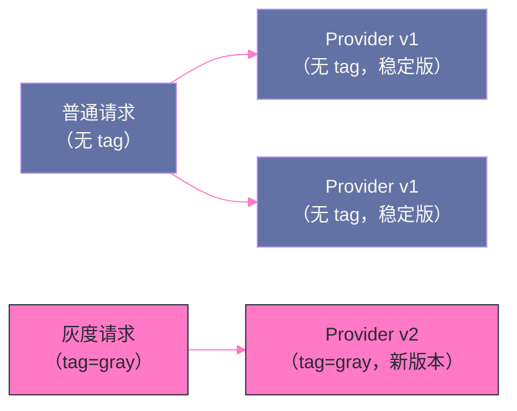

# 06 负载均衡与集群容错

## 摘要

当一个服务接口有多个 Provider 实例时，Dubbo 的集群层需要回答两个问题：**选哪个节点发送请求**（负载均衡），以及**调用失败时怎么办**（集群容错）。本文深入剖析 Dubbo 四种负载均衡算法的实现原理与权重计算细节（不只是"随机"这么简单），分析六种集群容错策略的适用场景与代价，以及路由规则如何在负载均衡之前对 Provider 列表进行过滤，从而实现灰度发布、金丝雀测试等高级流量控制。

---

## 第 1 章 负载均衡：在多个 Provider 间分配请求

### 1.1 带权重的随机负载均衡（RandomLoadBalance）

**RandomLoadBalance** 是 Dubbo 的默认负载均衡策略。名字叫"随机"，但实际上是**加权随机（Weighted Random）**——每个 Provider 有一个权重（默认 100），权重越高，被选中的概率越大。

**实现原理：**

假设有三个 Provider，权重分别为 A=1, B=2, C=3（总权重 = 6）：
- 构造一个虚拟的"权重段"：A 占 [0, 1)，B 占 [1, 3)，C 占 [3, 6)；
- 生成 [0, 6) 的随机数，落在哪个区间就选哪个 Provider；
- 期望：A 被选中概率 1/6，B 为 2/6，C 为 3/6。

**源码核心逻辑（简化）：**

```java
@Override
protected <T> Invoker<T> doSelect(List<Invoker<T>> invokers, URL url, Invocation invocation) {
    int length = invokers.size();
    boolean sameWeight = true;
    int[] weights = new int[length];
    int totalWeight = 0;
    
    // 计算每个 Invoker 的权重（含服务预热的动态权重）
    for (int i = 0; i < length; i++) {
        int weight = getWeight(invokers.get(i), invocation);
        totalWeight += weight;
        weights[i] = totalWeight;  // 累积权重
        if (sameWeight && i > 0 && weight != weights[i-1] - weights[i-2]) {
            sameWeight = false;
        }
    }
    
    // 如果权重不完全相同，按权重随机选
    if (totalWeight > 0 && !sameWeight) {
        int offset = ThreadLocalRandom.current().nextInt(totalWeight);
        for (int i = 0; i < length; i++) {
            if (offset < weights[i]) {
                return invokers.get(i);
            }
        }
    }
    
    // 所有权重相同，直接均匀随机
    return invokers.get(ThreadLocalRandom.current().nextInt(length));
}
```

**RandomLoadBalance 的适用场景：** 大多数无状态服务的通用场景。随机策略在大量请求下会自动趋向均匀分布（大数定律），且实现简单，计算开销最低。

**缺陷：** 短期内可能出现不均匀（小样本时随机性明显）；对有状态服务（需要会话亲和的场景）不适用。

### 1.2 平滑轮询负载均衡（RoundRobinLoadBalance）

**RoundRobinLoadBalance** 是严格的轮询——按顺序依次选择 Provider，也支持权重（权重大的 Provider 在一轮中被选中的次数更多）。

Dubbo 2.7.x 之前的轮询实现有一个问题：在权重不均等时（如 A=5, B=1），选择序列为 `AAAAABAAAAABAAAAAB...`——A 连续被选 5 次，然后 B 被选 1 次。这会导致 A 短时间承受 5 倍的 B 的流量，对 A 不友好。

Dubbo 2.7.x+ 实现了 **Nginx 风格的平滑加权轮询（Smooth Weighted Round Robin）**：

**算法原理：**
- 每个 Provider 维护一个动态权重（`current_weight`），初始为 0；
- 每次选择：
  1. 所有 Provider 的 `current_weight += weight`（加上配置的权重）；
  2. 选择 `current_weight` 最大的 Provider；
  3. 被选中的 Provider 的 `current_weight -= total_weight`（减去总权重）；
- 这样，A(权重 5)、B(权重 1)，总权重 6，选择序列为：`A B A A A B A`——分布更均匀。

**平滑轮询的适用场景：** 需要严格均匀分配流量的场景；同时希望在权重不等时，流量分配仍然平滑，不出现"突刺"。

### 1.3 最少活跃调用数（LeastActiveLoadBalance）

**LeastActiveLoadBalance** 将请求优先发送给**当前正在处理中请求数最少**的 Provider——响应快的 Provider 活跃数少，会获得更多请求；响应慢的 Provider 积压多，自动少分配请求。

**实现：** 每个 Invoker 内部维护一个原子计数器 `active`：
- 发出请求时：`active.incrementAndGet()`；
- 收到响应（成功或失败）时：`active.decrementAndGet()`。

选择时：遍历所有 Invoker，选择 `active` 最小的；如果多个 Invoker 的 `active` 相同，则在这些 Invoker 中按权重随机选。

**LeastActive 的适用场景：** 各 Provider 处理能力不均等（如配置不同、有热点 Key 导致某台响应慢）的场景，能自动适应节点性能差异，避免慢节点成为瓶颈。

**注意：** `active` 计数器是 Consumer 本地维护的，反映的是"这个 Consumer 自己发出去还未收到响应的请求数"，不是 Provider 全局的在途请求数。多个 Consumer 之间的视图是独立的。

### 1.4 一致性哈希（ConsistentHashLoadBalance）

**ConsistentHashLoadBalance** 根据请求参数的哈希值选择 Provider，相同参数的请求始终路由到同一个 Provider。

**为什么用一致性哈希而不是普通哈希：**

普通哈希（`hash(param) % n`）在 Provider 数量 n 变化时，几乎所有请求的路由都会改变（影响 `(n-1)/n` 的请求）。一致性哈希通过虚拟节点技术，在 Provider 增减时，只影响少量请求的路由。

**Dubbo 的一致性哈希实现：**

默认对每个 Provider 创建 160 个虚拟节点，均匀分布在哈希环上。哈希值计算：对请求的第一个参数（可配置）使用 MD5 + 取模，映射到哈希环上的某个位置，顺时针找最近的虚拟节点，即为目标 Provider。

**一致性哈希的适用场景：**
- **有状态服务**（如将用户的会话数据缓存在 Provider 内存中），需要同一用户的请求始终路由到同一节点；
- **缓存友好的服务**（如根据商品 ID 查询，相同商品 ID 路由到同一节点，Provider 本地缓存命中率高）。

**一致性哈希的缺陷：** 当某个 Provider 压力特别大时（热点 Key），一致性哈希无法自动分散到其他节点，需要额外的热点处理机制（如将热点 Key 的 160 个虚拟节点分散到多个 Provider）。

---

## 第 2 章 集群容错：调用失败时的处理策略

### 2.1 Failover（失败自动切换，默认策略）

**FailoverClusterInvoker** 在调用失败时，自动重试其他 Provider，默认重试 **2 次**（加上第一次共 3 次尝试）：

```java
@Override
public Result doInvoke(Invocation invocation, final List<Invoker<T>> invokers, LoadBalance loadbalance) {
    List<Invoker<T>> copyInvokers = invokers;
    int len = getUrl().getMethodParameter(methodName, RETRIES_KEY, DEFAULT_RETRIES) + 1;
    // len = retries + 1 = 3（默认）
    
    List<Invoker<T>> invoked = new ArrayList<>(copyInvokers.size());
    Set<String> providers = new HashSet<>(len);
    
    for (int i = 0; i < len; i++) {
        if (i > 0) {
            // 重试时，重新检查可用 Invoker 列表（Provider 可能已变化）
            checkWhetherDestroyed();
            copyInvokers = list(invocation);
            checkInvokers(copyInvokers, invocation);
        }
        // 负载均衡选择 Invoker，排除已尝试过的节点
        Invoker<T> invoker = select(loadbalance, invocation, copyInvokers, invoked);
        invoked.add(invoker);
        RpcContext.getServiceContext().setInvokers((List) invoked);
        try {
            Result result = invoker.invoke(invocation);
            // ...（记录重试日志）
            return result;
        } catch (RpcException e) {
            if (e.isBiz()) {
                // 业务异常（BizException）不重试，直接抛出
                throw e;
            }
            // 网络或超时异常，继续重试
            le = e;
        }
    }
    throw new RpcException("Failed to invoke after " + len + " times");
}
```

**Failover 的关键细节：**

1. **只重试非业务异常**：如果 Provider 抛出了业务异常（`BizException`），说明 Provider 正确地处理了请求并返回了错误，这不是网络问题，不需要重试；
2. **重试时避开已失败的节点**：通过 `invoked` 列表记录已尝试过的 Invoker，下次选择时排除；
3. **重试会增加负载**：如果多个请求同时触发重试（如 Provider 故障），实际发送的请求数可能是 3n（每个请求重试 3 次），对 Provider 集群有额外压力。

**Failover 的适用场景：** 读操作（幂等查询）；对超时不敏感的场景（重试会增加延迟）。**不适合写操作**——如果写操作因网络超时触发重试，可能导致重复写入。

> [!warning] 生产避坑
> **写接口（Create/Update/Delete）必须关闭重试（retries=0）或使用 Failfast**。Dubbo 的 Failover 会对所有 `RpcException`（包括超时）重试，超时意味着"请求已发出，不知道是否成功"，重试可能导致重复写入。如果写操作不能保证幂等，一定要设置 `retries=0`。

### 2.2 Failfast（快速失败）

调用失败后**立即抛出异常**，不重试：

```yaml
dubbo:
  consumer:
    cluster: failfast
```

**适用场景：** 写操作（如创建订单）、对延迟敏感的场景（不希望重试增加延迟）。

### 2.3 Failsafe（安全失败）

调用失败时**忽略异常**，返回空结果：

**适用场景：** 非核心功能的调用（如记录访问日志、埋点统计），调用失败不影响主流程，故障时静默降级。

### 2.4 Failback（失败自动恢复）

调用失败后，将失败请求**记录到失败队列**，后台线程定时重试，直到成功：

**适用场景：** 消息通知、异步补偿等对最终一致性要求高、但不需要实时成功的场景。注意：大量失败请求积压可能导致内存溢出，需要限制队列大小。

### 2.5 Forking（并行调用）

**同时调用多个 Provider**，只要有一个返回成功就立即返回，其余调用的结果被丢弃：

```yaml
dubbo:
  consumer:
    cluster: forking
    forks: 2  # 并行调用 2 个 Provider
```

**适用场景：** 对响应时间极为敏感（不能接受重试延迟）、且 Provider 资源充足（能承担额外的并行调用开销）。例如：实时价格查询，2 个节点并行，哪个先返回用哪个。

**代价：** 每次请求会产生 `forks` 倍的 Provider 调用量，Provider 集群负载增加。

### 2.6 Broadcast（广播调用）

**依次调用所有 Provider**，任何一个失败就报错，全部成功才算成功：

**适用场景：** 需要通知所有节点更新本地缓存（如刷新配置缓存、清除本地缓存）的场景。

---

## 第 3 章 路由规则：在负载均衡之前过滤 Provider

### 3.1 路由的层级关系

路由（Router）发生在**负载均衡之前**：负载均衡是从一组候选 Provider 中选一个；而路由是决定哪些 Provider 构成候选集。

```
完整调用链：
注册中心的 Provider 全量列表
  → 路由规则过滤（Router Chain）
  → 候选 Provider 列表
  → 负载均衡（LoadBalance）
  → 选中的 Invoker
  → 容错处理（Cluster）
```

### 3.2 条件路由（Condition Router）

条件路由通过配置规则，将特定的 Consumer 路由到特定的 Provider 子集。规则格式：

```
{Consumer 条件} => {Provider 条件}
```

**示例 1：将来自特定 IP 的请求路由到测试节点**

```
host = 192.168.1.100 => host = 192.168.1.200
```
含义：来自 IP `192.168.1.100` 的 Consumer，只能调用 IP `192.168.1.200` 的 Provider。适用于开发/测试人员直连测试环境，不影响生产流量。

**示例 2：将非 VIP 用户的请求路由到普通节点**

```
arguments[0] != 'VIP' => host != 192.168.1.100
```
含义：第一个参数不是 'VIP' 的请求，不路由到 IP `192.168.1.100`（VIP 专用节点）。实现了简单的请求分级。

**示例 3：只允许特定应用访问某服务**

```
application = order-service => host = 192.168.2.0/24
```
含义：只有来自 `order-service` 应用的请求，才能访问 `192.168.2.0/24` 网段的 Provider。其他应用的请求会被路由到其他 Provider（如果没有匹配的 Provider，根据 `force` 配置决定是抛出异常还是忽略规则）。

### 3.3 标签路由（Tag Router）：灰度发布的利器

**标签路由**通过给 Provider 打标签（Tag），结合请求中的标签（通过 Attachment 传递），实现灵活的流量隔离：

**配置 Provider 标签：**

```yaml
dubbo:
  provider:
    tag: gray  # 将这个 Provider 节点标记为 "gray"（灰度环境）
```

**Consumer 发起带标签的请求：**

```java
// 通过 RpcContext 传递标签
RpcContext.getServiceContext().setAttachment("dubbo.tag", "gray");
userService.getUserById(123);  // 此请求只路由到 tag=gray 的 Provider
```

**标签路由的工作机制：**

1. 如果请求中携带了 `dubbo.tag=gray`，TagRouter 会从 Provider 列表中过滤出 `tag=gray` 的节点；
2. 如果没有 `tag=gray` 的节点，根据配置（`dubbo.force.tag`）决定：
   - `force=true`（默认）：抛出异常（No provider available for tag: gray）；
   - `force=false`：降级到无 tag 的节点。

**灰度发布场景：**



只有携带 `tag=gray` 的请求（如内部测试账号、特定用户 ID）会路由到新版 Provider，其他请求仍走稳定版，实现**精准的灰度发布**。

### 3.4 服务降级：Mock 规则

Dubbo 的路由规则还支持 Mock 降级——当 Provider 全部不可用时，返回一个预设的 Mock 结果，而不是抛出异常：

**方式一：返回空（return null）**

```java
// 在 @DubboReference 中配置 mock
@DubboReference(mock = "return null")
private UserService userService;
```

**方式二：自定义 Mock 实现**

```java
// 创建 Mock 类，命名规范：{接口名}Mock
public class UserServiceMock implements UserService {
    public User getUserById(Long id) {
        // 返回降级数据（如默认用户、缓存数据、错误提示）
        return new User(-1L, "系统繁忙，请稍后重试");
    }
}

// 配置
@DubboReference(mock = "true")  // 自动找 UserServiceMock 类
private UserService userService;
```

**Mock 的触发时机：** Mock 只在 `RpcException`（网络异常或找不到 Provider）时触发，不在业务异常时触发。这确保了降级只发生在基础设施故障场景，而不会掩盖业务逻辑错误。

---

## 小结

本文系统梳理了 Dubbo 集群层的核心机制：

**负载均衡四种算法：**
- **RandomLoadBalance**（默认）：加权随机，适合无状态服务的通用场景；
- **RoundRobinLoadBalance**：平滑加权轮询（Nginx 风格），流量分布更均匀；
- **LeastActiveLoadBalance**：最少活跃数，自动适应节点性能差异；
- **ConsistentHashLoadBalance**：一致性哈希，适合有状态服务和缓存亲和场景。

**集群容错六种策略：**
- **Failover**（默认）：重试其他节点，适合读操作，写操作必须关闭重试；
- **Failfast**：立即失败，适合写操作；
- **Failsafe**：忽略异常，适合非核心功能；
- **Failback**：后台重试，适合最终一致性场景；
- **Forking**：并行调用多节点，降低延迟；
- **Broadcast**：广播通知所有节点。

**路由规则：** 条件路由实现 IP/应用级的流量隔离；标签路由（Tag Router）是灰度发布的核心工具；Mock 降级在 Provider 不可用时提供兜底。

下一篇文章将转向 Dubbo 的服务治理能力——限流、熔断（Sentinel 集成）与优雅停机的完整机制。
