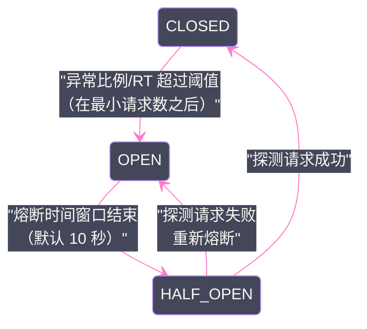

# 07 服务治理——限流、熔断与优雅停机

## 摘要

服务治理是 RPC 框架在生产环境中稳定运行的保障体系。Dubbo 内置了基础的限流（TPS 限制、并发控制）和超时机制，并通过与 Sentinel 的深度集成提供了更完整的熔断降级能力。本文深入剖析 Dubbo 的并发控制与 TPS 限流的实现原理，Sentinel 的滑动窗口计数与熔断状态机，以及优雅停机中"注销-等待-关闭"三阶段的必要性与实现细节，最后梳理服务版本与分组的灰度发布模型。

---

## 第 1 章 Dubbo 内置限流：并发控制与 TPS 限制

### 1.1 为什么需要在 Provider 侧限流

限流的核心目标是**保护 Provider 不被超出其处理能力的流量压垮**。一个典型的事故场景：

上游 Consumer 因 bug 导致调用频率异常飙升（如死循环调用），或者大促活动流量突增，Provider 的线程池满载，请求排队，响应时间急剧增加，最终整个服务雪崩。

没有限流的 Provider 就像一台没有保险丝的电器——电流过大时，没有任何保护，只能被烧毁。限流是"保险丝"，在流量超限时主动拒绝部分请求，保留足够的处理能力应对正常请求，而不是让所有请求都慢下来（甚至都失败）。

### 1.2 ExecuteLimitFilter：Provider 侧的并发控制

**ExecuteLimitFilter** 是 Dubbo Provider 侧内置的并发控制 Filter，通过限制**同一方法正在处理中的并发请求数**来保护 Provider：

```yaml
dubbo:
  provider:
    executes: 100  # 每个方法最多同时处理 100 个请求（全局）
```

也可以精细到方法级别：

```java
@DubboService
public class UserServiceImpl implements UserService {
    
    // 此方法最多同时处理 10 个并发请求
    @Method(executes = 10)
    public User getUserById(Long id) { ... }
    
    // 此方法最多同时处理 200 个并发请求
    @Method(executes = 200)
    public List<User> listUsers(UserQuery query) { ... }
}
```

**实现原理（核心逻辑）：**

`ExecuteLimitFilter` 在内部为每个方法维护一个 `AtomicInteger` 计数器，表示该方法当前正在处理中的请求数：

```java
@Activate(group = CommonConstants.PROVIDER)
public class ExecuteLimitFilter implements ClusterFilter, Filter.Listener {

    @Override
    public Result invoke(Invoker<?> invoker, Invocation invocation) throws RpcException {
        URL url = invoker.getUrl();
        String methodName = invocation.getMethodName();
        int max = url.getMethodParameter(methodName, EXECUTES_KEY, 0);
        
        if (max > 0) {
            RpcStatus count = RpcStatus.getStatus(url, methodName);
            // 尝试原子增加计数，如果超过上限则拒绝
            if (!RpcStatus.beginCount(url, methodName, max)) {
                throw new RpcException(RpcException.LIMIT_EXCEEDED_EXCEPTION,
                    "Failed to invoke method " + methodName + " in provider " + url 
                    + ", cause: The service using threads greater than <" + max + ">");
            }
        }
        
        try {
            return invoker.invoke(invocation);
        } catch (Throwable t) {
            throw t;
        } finally {
            if (max > 0) {
                // 无论成功或失败，处理完成后减少计数
                RpcStatus.endCount(url, methodName, System.currentTimeMillis() - startTime, succeeded);
            }
        }
    }
}
```

`RpcStatus.beginCount()` 内部使用 `AtomicInteger.compareAndSet()` 保证线程安全：只有在计数 < max 时才增加，如果已经达到 max 则返回 false，触发限流拒绝。

### 1.3 TpsLimitFilter：Provider 侧的 TPS 限制

**TpsLimitFilter** 通过计数器限制每秒允许处理的请求总数（TPS）：

```yaml
dubbo:
  provider:
    tps: 1000       # 每秒最多 1000 个请求
    tps.interval: 1000  # 计数窗口大小（毫秒），默认 1000ms = 1秒
```

**实现原理（固定窗口计数）：**

`TpsLimitFilter` 内部维护一个计数器和一个时间窗口起始时间：
- 每收到一个请求，检查当前时间窗口内的请求数是否超过 `tps`；
- 如果超过，拒绝当前请求；
- 如果当前时间超出了窗口范围（`interval` 毫秒），重置计数器和窗口起始时间。

**固定窗口的缺陷：** 在窗口边界处，可能在 2 × interval 时间内处理 2 × tps 个请求——例如 `tps=1000, interval=1000ms`，在第 999ms 处理了 1000 个请求，第 1001ms 窗口重置，又可以处理 1000 个请求，即在 2ms 内处理了 2000 个请求，实际 TPS 瞬间达到 100 万。这是固定窗口计数的固有问题，需要 Sentinel 的滑动窗口来解决（见第 2 章）。

### 1.4 ActiveLimitFilter：Consumer 侧的并发控制

与 `ExecuteLimitFilter`（Provider 侧）对应，**ActiveLimitFilter** 在 Consumer 侧限制对某个 Provider 方法的并发调用数：

```yaml
dubbo:
  consumer:
    actives: 50  # 每个 Consumer 对每个方法的最大并发调用数
```

当并发数达到上限时，Consumer 会等待（阻塞 `timeout` 毫秒），而不是立即拒绝——如果在超时时间内有调用完成（释放了并发数），等待中的请求会被唤醒继续执行；如果超时还没有释放，才抛出 `RpcException`。

这与 `ExecuteLimitFilter` 的"超限直接拒绝"不同——`ActiveLimitFilter` 更"温和"，在超限时先等待，适合流量突刺场景（短暂超限后快速恢复）。

---

## 第 2 章 Sentinel 集成：熔断降级的完整能力

### 2.1 Dubbo 内置限流的局限

Dubbo 的 `ExecuteLimitFilter` 和 `TpsLimitFilter` 提供了基础限流，但有明显局限：

- **只能限流，不能熔断**：当下游服务响应时间飙升（不超时，但很慢），内置限流无法感知服务质量恶化；
- **固定窗口计数有边界突刺问题**；
- **没有自动恢复**：限流只是拒绝超出部分，不能在服务恢复后自动调整限流策略；
- **没有黑白名单、系统级保护等高级特性**。

这就是为什么生产中通常会引入 **Sentinel**（Alibaba 开源的流量控制框架）与 Dubbo 配合使用。

### 2.2 Sentinel 与 Dubbo 的集成方式

引入 `dubbo-sentinel-adapter` 依赖后，Sentinel 自动通过 Dubbo SPI 机制（`@Activate` Filter）接入 Dubbo 的调用链：

- **Provider 侧**：`SentinelDubboProviderFilter` 在 Provider 收到请求时，将调用封装为 Sentinel Entry，进行流量控制；
- **Consumer 侧**：`SentinelDubboConsumerFilter` 在 Consumer 发出请求时，将调用封装为 Sentinel Entry，进行降级处理。

资源名的格式：`{接口名}:{方法名}(参数类型...)`，例如：
```
com.example.UserService:getUserById(java.lang.Long)
```

### 2.3 Sentinel 的滑动窗口计数

Sentinel 使用**滑动窗口（Sliding Window）**来统计 QPS，解决了固定窗口的边界突刺问题。

**滑动窗口的原理：**

将时间轴划分为若干个小窗口（`sample`），默认将 1 秒划分为 2 个 500ms 的小窗口（可配置）。当前的统计窗口是最近 N 个小窗口的合计值：

```
时间轴：  [0ms-500ms] [500ms-1000ms] [1000ms-1500ms] [1500ms-2000ms]
请求数：      300           400             200               150

当时刻为 1800ms 时，"最近 1 秒"的窗口范围是 [800ms-1800ms]：
  [500ms-1000ms] 中 [800ms-1000ms] 这部分 = 400 × (200/500) ≈ 160
  [1000ms-1500ms] 的完整窗口 = 200
  [1500ms-2000ms] 中 [1500ms-1800ms] 这部分 = 150 × (300/500) = 90
  合计 ≈ 450 QPS
```

Sentinel 的实际实现稍作简化（以 bucket 整数为单位），但核心思想一致——通过多个小窗口的加权统计，使 QPS 统计在时间轴上是连续的，避免边界突刺。

### 2.4 Sentinel 的熔断状态机

Sentinel 的熔断器有三种状态：



**CLOSED（关闭状态）**：正常放行所有请求，持续统计错误率/响应时间；

**OPEN（开路状态）**：熔断器打开，拒绝所有请求，直接返回降级结果（抛出 `DegradeException` 或执行 Fallback）；

**HALF_OPEN（半开状态）**：熔断时间窗口结束后，允许一个"探测请求"通过。如果探测请求成功，熔断器恢复到 CLOSED 状态；如果失败，重新开启熔断（回到 OPEN 状态，等待下一个时间窗口）。

### 2.5 Sentinel 的三种熔断策略

**策略一：慢调用比例（SLOW_REQUEST_RATIO）**

统计窗口内响应时间超过阈值（`maxAllowedRt`）的请求占比，超过设定的比例则熔断：

```java
DegradeRule rule = new DegradeRule("com.example.UserService:getUserById");
rule.setGrade(DegradeRuleConstant.DEGRADE_GRADE_RT);
rule.setCount(200);        // 慢调用阈值：响应时间 > 200ms 视为慢调用
rule.setSlowRatioThreshold(0.5);  // 慢调用比例 > 50% 时熔断
rule.setMinRequestAmount(10);     // 最小请求数：至少 10 个请求才触发熔断判断
rule.setStatIntervalMs(10000);    // 统计窗口 10 秒
rule.setTimeWindow(5);   // 熔断时间窗口 5 秒
```

**策略二：异常比例（ERROR_RATIO）**

统计窗口内异常请求占比超过阈值则熔断：

```java
rule.setGrade(DegradeRuleConstant.DEGRADE_GRADE_EXCEPTION_RATIO);
rule.setCount(0.3);  // 异常比例 > 30% 时熔断
```

**策略三：异常数（ERROR_COUNT）**

统计窗口内异常总数超过阈值则熔断：

```java
rule.setGrade(DegradeRuleConstant.DEGRADE_GRADE_EXCEPTION_COUNT);
rule.setCount(10);  // 异常数 > 10 次时熔断
```

### 2.6 Sentinel 的 Fallback 配置

当熔断器打开（或限流触发）时，可以配置 Fallback 方法处理降级逻辑：

```java
@DubboReference
private UserService userService;

// Sentinel 的 @SentinelResource 注解
// blockHandler：被限流或熔断时调用
// fallback：抛出任何异常时的降级（包括业务异常）
@SentinelResource(value = "getUserById", 
                  blockHandler = "handleBlock",
                  fallback = "handleFallback")
public User getUserById(Long id) {
    return userService.getUserById(id);
}

// 被限流时的处理（参数和原方法一致 + BlockException）
public User handleBlock(Long id, BlockException ex) {
    log.warn("getUserById blocked by Sentinel, id={}", id);
    return new User(-1L, "服务繁忙");
}

// 异常降级处理
public User handleFallback(Long id, Throwable t) {
    log.error("getUserById failed, id={}", id, t);
    return new User(-1L, "系统异常");
}
```

---

## 第 3 章 优雅停机：避免流量中断的关闭流程

### 3.1 为什么普通关闭会有问题

直接 `kill -9` 一个 Dubbo Provider 节点会发生什么？

1. JVM 进程立即终止，所有正在处理中的请求失败（Consumer 收到连接中断异常）；
2. 注册中心依赖 Session 超时（默认 30 秒以上）才能感知节点下线，这段时间内 Consumer 仍会将请求发送到已停止的节点，导致大量调用失败；
3. Consumer 的 Failover 重试机制会缓解部分问题，但仍有短暂的错误窗口。

这就是为什么需要**优雅停机（Graceful Shutdown）**——让 Provider 在停止前有序地完成清理工作，最大程度减少对 Consumer 的影响。

### 3.2 Dubbo 优雅停机的三个阶段

Dubbo 的优雅停机通过 JVM ShutdownHook 实现（在 `DubboShutdownHook` 类中注册），分三个阶段：

**阶段一：注销服务（Deregister）**

```
1. 向注册中心发送"注销"请求，删除 Provider URL（告知 Consumer 此节点即将停止）
2. 注册中心将变更推送给所有订阅的 Consumer
3. Consumer 收到通知，从本地 Provider 列表中移除该节点
4. 等待 Consumer 更新完成的传播时间（默认 3 秒）
   ← 此阶段结束后，新的请求不会再路由到此节点
```

**阶段二：等待在途请求完成（Wait for In-flight Requests）**

```
5. 节点此时可能仍有正在处理中的请求（在阶段一的 3 秒传播时间内收到的）
6. 等待所有在途请求处理完成
   等待超时配置：dubbo.service.shutdown.wait（默认 10000ms = 10 秒）
   如果超时仍有请求未完成，强制关闭
```

**阶段三：关闭资源（Close Resources）**

```
7. 关闭所有 Netty Server（停止接受新连接）
8. 关闭所有 Netty Client（与其他 Provider 的连接）
9. 关闭业务线程池（等待已提交的任务完成）
10. 断开注册中心连接
11. JVM 退出
```

### 3.3 优雅停机的配置

```yaml
dubbo:
  service:
    shutdown:
      wait: 10000  # 等待在途请求完成的超时时间（毫秒）
  provider:
    shutdown:
      timeout: 20000  # Provider 整体关闭超时（毫秒）
```

**Kubernetes 环境中的优雅停机：**

在 Kubernetes 中，Pod 被删除时，k8s 会先发送 `SIGTERM` 信号，JVM 的 ShutdownHook 收到信号后开始优雅关闭。k8s 会等待 `terminationGracePeriodSeconds`（默认 30 秒），如果 Pod 还未退出才发送 `SIGKILL` 强制终止。

因此，Dubbo 的优雅关闭总时间（注销等待 3 秒 + 在途请求等待 10 秒 = 13 秒）必须小于 k8s 的 `terminationGracePeriodSeconds`，否则会被 `SIGKILL` 强制终止，导致优雅停机不完整：

```yaml
# kubernetes deployment
spec:
  template:
    spec:
      terminationGracePeriodSeconds: 60  # 给 Dubbo 足够的关闭时间
```

> [!warning] 生产避坑
> **不要用 `kill -9` 停止 Dubbo 服务**。`SIGKILL` 会绕过 JVM 的 ShutdownHook，导致 Dubbo 无法执行优雅停机。应使用 `kill -15`（SIGTERM）或 `dubbo-admin` 的"下线"功能。在 systemd 管理的服务中，`systemctl stop` 默认发送 SIGTERM，是正确的操作方式。

### 3.4 注销传播时间与流量无损

阶段一等待的 3 秒，是为了等待"注册中心通知 → Consumer 收到通知 → Consumer 更新本地 Provider 列表"这个链路的传播时延。但 3 秒只是经验值，不能保证所有 Consumer 都已更新——如果某个 Consumer 因 GC 或网络抖动在 3 秒内没有处理完通知，仍然可能向已下线的 Provider 发送请求。

**完全流量无损的做法（更严格）：**

1. 在注销服务之前，先在 Dubbo Admin 或注册中心控制台将节点标记为"禁用"（修改节点的 `enabled=false` 参数）；
2. 观察监控，确认该节点的 QPS 降到 0；
3. 再执行停机操作。

这种手动确认方式适用于对可用性要求极高的场景（如金融交易系统），大多数互联网业务直接依赖 Dubbo 的自动优雅停机已经足够。

---

## 第 4 章 版本与分组：多环境共存的灰度模型

### 4.1 版本（version）：API 兼容性管理

Dubbo 的 `version` 参数用于**同一接口的不同版本共存**，通常用于不兼容的 API 升级场景：

**场景：`getUserById` 的返回值从 `User` 变为 `UserDTO`（不兼容变更）**

```java
// 旧版 Provider（version=1.0.0）
@DubboService(version = "1.0.0")
public class UserServiceImplV1 implements UserService {
    public User getUserById(Long id) { ... }
}

// 新版 Provider（version=2.0.0）
@DubboService(version = "2.0.0")
public class UserServiceImplV2 implements UserService {
    public User getUserById(Long id) { ... }
}

// 旧版 Consumer（仍使用 1.0.0）
@DubboReference(version = "1.0.0")
private UserService userService;

// 新版 Consumer（迁移到 2.0.0）
@DubboReference(version = "2.0.0")
private UserService userService;
```

在注册中心中，不同版本的 Provider URL 中包含 `version=1.0.0` 或 `version=2.0.0` 参数，Consumer 在订阅时会根据版本过滤，只获取匹配版本的 Provider。这使得不同版本的 Consumer 可以同时运行，逐步迁移，而无需全量同时切换。

`version="*"` 是通配符——Consumer 配置为 `*` 时，可以调用任意版本的 Provider（适用于测试场景）。

### 4.2 分组（group）：业务隔离

`group` 参数用于**同一接口的不同实现隔离**，通常用于业务隔离而非 API 版本管理：

**场景：同一 `PaymentService` 接口有"支付宝支付"和"微信支付"两种实现**

```java
@DubboService(group = "alipay")
public class AlipayPaymentService implements PaymentService { ... }

@DubboService(group = "wechat")
public class WechatPaymentService implements PaymentService { ... }

// Consumer 根据业务逻辑选择分组
@DubboReference(group = "alipay")
private PaymentService alipayService;

@DubboReference(group = "wechat")
private PaymentService wechatService;
```

`group="*"` 同样是通配符，Consumer 会从所有分组的 Provider 中按负载均衡选择（通常不这样用，因为不同分组的行为可能完全不同）。

### 4.3 version + group 的组合使用

`version` 和 `group` 的组合，可以实现精细的服务隔离矩阵，适合大型企业中多租户、多环境（dev/staging/prod 同一注册中心）的复杂场景：

```java
@DubboReference(group = "production", version = "2.1.0")
private UserService userService;

// vs

@DubboReference(group = "staging", version = "2.2.0-SNAPSHOT")
private UserService testUserService;
```

---

## 小结

本文系统梳理了 Dubbo 的服务治理三大核心能力：

**限流：**
- `ExecuteLimitFilter`（Provider 侧并发控制）：通过原子计数器限制方法的最大并发请求数，超限直接拒绝；
- `TpsLimitFilter`（Provider 侧 TPS 限制）：固定窗口计数，有边界突刺问题；
- `ActiveLimitFilter`（Consumer 侧并发控制）：超限时等待而非立即拒绝，更适合流量突刺场景；
- Sentinel 集成：滑动窗口计数解决边界突刺，熔断状态机（CLOSED→OPEN→HALF_OPEN）实现自动熔断恢复。

**优雅停机：**
- 三阶段：注销服务（Consumer 停止路由到此节点）→ 等待在途请求完成 → 关闭资源；
- 在 Kubernetes 中，`terminationGracePeriodSeconds` 必须大于 Dubbo 的总关闭时间；
- 生产中应使用 `kill -15`（SIGTERM），不要用 `kill -9`。

**版本与分组：**
- `version` 用于同一接口的不兼容 API 版本共存，支持逐步迁移；
- `group` 用于同一接口的不同业务实现隔离；
- 两者组合可构建多维度的服务隔离矩阵。

下一篇文章将梳理 Dubbo 3.x 的核心新特性——Triple 协议与应用级服务发现的深度实现，以及 Mesh 化的 Proxyless 模式。
