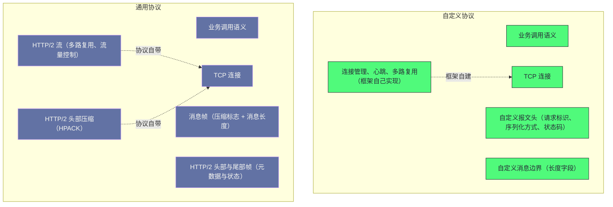

# 08 Dubbo 3.x 新特性——Triple 协议与应用级服务发现

**摘要：**

较新版本的两个核心变化，都指向同一个目标：**"让框架融入云原生基础设施"**——而它们分别从"协议"与"发现"两个方向切入。**协议方向的变化是"从自定义二进制协议转向基于通用协议的方案"**，动机是"基础设施层对通用协议有原生支持，而对自定义协议只能做连接级的粗粒度处理"；**发现方向的变化是"把注册粒度从接口提到应用"**（第 4 篇已展开），动机是"规模"。本文按"新版本要解决什么 → 为什么转向通用协议 → 帧结构 → 流式调用 → 接口到应用的映射 → 迁移兼容 → 网格化的两种模式"展开。先说明两个方向、三条设计原则与四处代价；再讲网格化对协议的要求（为什么自定义协议在网格下"不透明"）、通用协议的三处关键特性（多路复用、头部压缩、流量控制）、以及转向的代价。然后剖析消息帧格式、元数据在头部与尾部帧中的位置、状态码的承载方式。之后是四种流式调用模式与它们的适用场景、接口到应用映射的两种方案与元数据的版本标识。接着是"双注册双订阅"的迁移兼容与合并逻辑、网格化的两种接入模式（边车与无边车）与它们的代价对比、以及控制面协议的作用。最后是边界反例、落点与整个专栏的总结。

---

## 第 1 章 新版本要解决什么

### 1.1 两个方向

**较新版本的两个核心变化，分别解决两个不同的问题。**

**第一个方向是"协议"**：**它把通信协议从"自定义二进制"换成"基于通用协议的方案"**——**而它解决的是"基础设施层无法理解自定义协议"这个问题。**

**第二个方向是"发现"**：**它把注册粒度从"接口"提到"应用"**——**而它解决的是"规模问题"**（第 4 篇已展开）。

**两个方向的共同目标是"让框架融入云原生环境"**——**而"两个方向解决的是不同层面的障碍"**：**"协议方向解决'基础设施能否理解流量'"，"发现方向解决'基础设施能否承载规模'"。**

### 1.2 三条设计原则

**较新版本遵循三条设计原则。**

**原则一：向通用标准靠拢。** **在"性能损失可接受"的前提下，优先采用通用标准**——**因为"通用标准'有现成的生态支持'"。

**原则二：保持对上层透明。** **底层的协议与发现模型变化"不改变上层的编程模型"**——**因为"上层改动'会带来巨大的迁移成本'"。

**一处补充是"透明的实现方式"**：**它"在'底层模型变化处'做一次翻译'"**——**因此"上层的结构'保持不变'"。** **而"这处翻译'的成本'远低于'让上层适配新模型'"。**

**原则三：支持渐进迁移。** **新旧两套机制"可以长期并存"**——**因为"一次性迁移'在'大规模系统里不可行'"。

**三条原则的关系是"第一条决定'换成什么'，后两条决定'如何换得动'"**——**而"后两条正是'这类大改动能落地'的关键"。**

### 1.3 四处代价

**较新版本的改动有四处代价。**

**其一：通用协议的性能损失。** **因为"通用协议的头部与帧结构'比自定义协议更复杂'"**——**因此"它的单位开销'略高于自定义协议'"**——**而"这处损失'换来了'基础设施的理解能力'"。

**一处补充是"损失集中在头部而非数据"**：**因为"业务数据的大小'与协议无关'"**——**因此"损失'只体现在'每条消息的固定开销'上'"**——**而"这'在小消息高频的场景下'占比最高'"。**

**其二：协议转换期的双份维护。** **因为"迁移期需要同时支持两种协议"**——**因此"框架要维护两套通信实现'"**——**而"维护成本上升"。

**而"这处代价的规模与新旧两套机制的重叠度成正比"**——**因此"重叠越少，迁移越轻"。**

**而"这处代价'的持续时间'取决于'迁移的推进速度'"**——**因此"尽快完成迁移'能'缩短双份维护期'"。**

**一处补充是"双份维护的具体内容"**：**它"包括'两套编解码、两套治理接入点、两套测试用例'"**——**而"这意味着'新功能的开发需要'在两套实现上各做一遍'"。**

**其三：映射关系引入额外一跳。** **因为"接口到应用的映射'存在另一处'"**——**因此"消费方'可能需要多一次查询'"**（第 4 篇已展开这处代价）。

**而"这处代价'的严重程度'取决于'缓存的命中率'"**——**因此"缓存设计'是'这处代价能否被接受'的关键'"。**

**因此"衡量这处代价时，应当先测量缓存的命中率，而不是直接评估链路长度"。**

**一处补充是"额外一跳被缓存摊薄"**：**因为"映射关系'变化很少'"**，**所以"它'只在'首次或变更时'访问'"**——**因此"日常调用的路径上'没有这一跳'"。**

**其四：无边车模式对应用的要求。** **因为"无边车模式'把治理逻辑放回应用进程'"**——**因此"应用'需要'承担'与控制面通信的职责'"**——**而"这'增加了应用的复杂度'"。

**四处代价的共同特征是"它们是'融入云原生的对价'"**：**"融入"带来"生态与规模能力"，代价是"性能、维护、额外一跳、应用复杂度"。** **因此"该不该升级"取决于"当前是否真的需要'云原生能力'"。

### 1.4 一个类比：从方言到普通话

**把这处演进类比成"从方言到普通话"会更容易理解它的动机。**

**"团队内部说方言"对应"自定义协议"**——**内部效率高、表达精准**，**但"外人听不懂"。

**"改用普通话"对应"基于通用协议"**——**"外部工具与基础设施'都能理解'"**，**代价是"表达上'稍微啰嗦一些'"。

**"双语并行一段时间"对应"双注册双订阅"**——**因为"不能要求所有人'同时切换'"。

**"既懂普通话、又能直接与外部机构沟通"对应"无边车模式"**——**而"请一个翻译'对应'边车模式'"**——**翻译准确但多一道环节与开销。

**这个类比的用处在于"它把四处代价变成了可感知的经验"**：普通话略啰嗦（性能损失）、双语期要维护两套（双份维护）、要查对照表（映射一跳）、自己学外语要花功夫（应用复杂度）。**

### 1.5 一条贯穿全篇的判断

**有一条判断贯穿全篇，而它值得先提出来。**

**这条判断是"向标准靠拢，是用'部分自主权'换取'生态与互操作性'"。**

**它的第一处体现是"协议"**：**"采用通用协议'换来'基础设施的理解能力'"**，**"代价是'不能单方面扩展协议'"。

**它的第二处体现是"发现模型"**：**"采用通用的粒度模型'换来'与生态一致'"**，**"代价是'需要额外的映射与元数据机制'"。

**它的第三处体现是"治理"**：**"采用标准的控制面协议'换来'与网格基础设施互通'"**，**"代价是'治理逻辑的实现方式被标准化'"。

**三处体现的共同特征是"它们都在'自主权与互操作性'的维度上"**——**而"理解这处取舍'能让'云原生改造'从'技术潮流'变成'可评估的决策'"。

**这条判断的实用价值在于"它给出了'该不该改造的提问方式'"**：**"改造换来的生态能力'当前是否真的需要'"**——**而"能回答这个问题的改造'才是必要的改造"**。** 这与第 6 篇讲的"是否需要分布式事务"、第 7 篇讲的"是否需要引入治理组件"是同一类提问方式。**

---

## 第 2 章 为什么从自定义协议转向通用协议

### 2.1 网格化的协议要求

**网格化对协议的要求，是"基础设施层能够理解并操作流量"。**

**具体来说**：**基础设施层'需要'按请求内容做负载均衡'"**（而不是"只按连接"）、**"按请求头做路由'"**、**"理解健康检查协议'"**、**"以及'做协议转换'"。

**而"自定义二进制协议'对基础设施层是不透明的"**——**因此"它只能做'连接级的粗粒度处理'"**——**而"这'让服务'无法享受'基础设施的全部治理能力'"。

**因此"协议方向的动机是'让流量对基础设施可见'"**——**而"这处可见性'是'享受网格治理能力的前提'"。

### 2.2 通用协议的三处关键特性

**通用协议有三处关键特性，而它们"恰好满足了网格化的需求"。**

**第一处是"多路复用"**：**它"允许同一连接上并发多个请求"**——**因此"基础设施可以'按流做负载均衡'"**（而不是"按连接"）。** 这与第 5 篇讲的"自定义协议也用请求标识实现多路复用"是同一能力**——**但"通用协议'让这处能力'对基础设施可见'"。

**第二处是"头部压缩"**：**它"用静态表与动态表'减少重复头部的传输'"**——**因此"在'大量相同接口的重复调用'场景下'开销显著降低'"。** **这处特性'弥补了通用协议头部较大的缺陷"。

**第三处是"流量控制"**：**它"有连接级与流级两层控制'"**——**因此"大流量的请求'不会饿死小流量的请求'"。** **这处特性'在多路复用下尤为重要'"**（因为"多个请求共享一条连接"）。

**一处补充是"流量控制解决了'共享连接的公平性'"**：**因为"多个请求共享一条连接'"**，**所以"如果'没有流级控制'，那么'一个大请求会'阻塞其他请求'"。** **因此"它'是'多路复用能真正可用'的前提'"。**

**三处特性的共同特征是"它们都'让通用协议在 RPC 场景下可用'"**——**而"第二、三处'正是'为解决'通用协议的原生缺陷'而设计的'"。

### 2.3 转向的代价

**转向的代价可以分两处说。**

**第一处是"性能"**：**因为"通用协议的帧结构与头部'比自定义协议复杂'"**——**因此"单位请求的字节数与解析开销'略高'"。** **而这处代价'在'小请求高频'的场景下最明显"**（因为"此时头部占比高"）。

**第二处是"协议演进的主导权"**：**因为"协议'由外部标准决定'"**——**因此"框架'不能'单方面'扩展协议'"**——**而"只能'在标准允许的范围内'扩展"**（例如"用自定义头部承载框架特有的语义"）。

**两处代价的共同特征是"它们是'采用标准'的必然对价"**——**而"这处对价'换取的是'生态与互操作性'"。** **因此"采用标准"的实质是"用'部分自主权'换'生态支持'"**——**而"这笔交换'在'需要融入外部基础设施'时是划算的"。
### 2.4 一处关于"协议可见性"的观察

**"协议可见性"这处概念值得展开，因为它解释了"为什么协议选择会影响治理能力"。**

**可见性的含义是"基础设施层能否'理解流量的语义'"**——**而"理解的前提'是'协议有'结构化的元数据'"。

**具体来说**：**"按请求内容负载均衡'需要'能读到方法名或路径'"**，**"按头部路由'需要'能读到自定义头部'"**，**"健康检查'需要'能识别健康检查的请求"。

**而"自定义二进制协议'把这一切都编码在'不透明的字节流'里'"**——**因此"基础设施'只能看到'字节与连接'，看不到'请求与语义'"。

**因此"协议选择的实质是'是否愿意把语义暴露给基础设施'"**——**而"暴露'换来'治理能力'"**，**"不暴露'保留'内部效率与专有扩展的自由'"。

**这条观察的通用性在于"它把'协议选择'归结为'可见性取舍'"**——**而"任何'需要外部工具理解'的场景'都需要'可见性'"。** **这与第 5 篇讲的"自定义协议的代价是失去通用性"是同一处**：**"可见性'就是'通用性'的一种具体表现"。**

### 2.5 一处关于"标准扩展"的观察

**"在标准之上扩展"这处手法值得单独说明，因为它是"兼容与能力兼得"的关键。**

**手法的形态是"不修改标准语义，而是'在标准允许的扩展位置'放框架特有的信息'"**——**例如"用自定义头部承载服务版本与分组'"。

**这处手法的收益是"标准客户端'可以忽略不认识的头部'"**——**因此"互操作性'不受影响'"**——**而"框架客户端'能读到扩展信息，从而保留完整能力'"。

**而它的代价是"扩展的表达能力受限于'标准允许的扩展位置'"**——**例如"自定义头部'只能承载'键值对'"**——**因此"复杂的结构化信息'需要'自行编码'"。

**因此"采用标准时的扩展策略是'尽量把信息压进标准允许的载体里'"**——**而"这处策略的收益'是'双向兼容'"**——**"框架客户端拿到全部能力，标准客户端至少能正常通信'"。

**这条手法的通用性在于"它适用于所有'需要兼容标准又要扩展'的场景'"**——**而"扩展位置的选择'决定了'兼容性的上限'"。** **这与第 2 篇讲的"用不同的扩展名避免冲突"是同一思路**：**"扩展'应当'放在不影响标准语义的位置'"。

### 2.6 一处关于"性能损失"的观察

**"性能损失"这处代价值得量化一下，因为它决定了"该不该迁移"。**

**损失的量级取决于"请求的大小与频率"**：**"请求越大'则头部占比越低'"**（因此"损失越小"）；**"请求越小越频繁'则头部占比越高'"**（因此"损失越大"）。

**而"头部压缩'能显著降低这处损失"**（第 2.2 节）——**因为"它'把重复头部压到几十字节'"**——**因此"在'相同接口的重复调用'场景下'损失被大幅抵消'"。

**因此"性能损失的判断依据是'实际负载下的头部占比与压缩效果'"**——**而"不能用'理论上的头部大小'直接比较'"。

**这条观察的实践含义是"迁移前'应当做'基于真实流量的对比测试'"**——**而不是"只看协议规范的理论差异"。** **这与第 6 篇讲的"权重调整应当小步且可观测"是同一类**：**"性能判断'应当基于实测而非推测"。**

---

## 第 3 章 帧结构

### 3.1 消息帧格式

**消息帧的格式很简洁，而它"只用两个字段描述一条消息"。**

**第一个字段是"压缩标志"**——**它"表示'这条消息是否被压缩'"**——**而"压缩算法'在头部协商'"。

**第二个字段是"消息长度"**——**它"给出'消息体的字节数'"**——**因此"接收方'按长度读取'"。

**一处补充是"两个字段都不需要'协商'"**：**"压缩标志'指示是否压缩'"**，**而"压缩算法'在'连接建立时或首次请求时'协商一次'"——**因此"每条消息'只需一个标志位'"。** **这处设计'让'每条消息的额外开销'降到最低'"。**

**两个字段的共同特征是"它们解决了'压缩与边界'两个问题"**——**而"这'与第 5 篇讲的'长度字段解决边界'"是同一手法**：**"用'自描述的长度'替代'外部标记'"。

**一处差别值得留意**：**"消息帧'承载在协议的数据帧之上'"**——**因此"它不是'独立的一层协议'，而是'对通用协议数据帧内容的约定'"。** **这处设计的收益是"它'复用了通用协议的全部机制'"**（多路复用、流量控制、头部压缩）——**而"这正是'转向通用协议'的核心价值'"。

### 3.2 元数据的承载

**元数据的承载方式值得说明，因为它"体现了'在标准之上扩展'的手法"。**

**承载方式分两处**：**"请求的元数据'放在请求头部'"**（例如"方法路径、超时、内容类型"）**——**而"框架特有的语义'也放在头部'"**（例如"服务版本与服务分组"）。

**"把框架特有语义放在头部"这处做法很关键**：**它"用'标准允许的自定义头部'承载'框架专有的信息'"**——**因此"它既'保持了与标准的兼容'，又'不丢失框架的能力'"。

**这处手法的收益是"标准客户端'可以忽略不认识的头部'"**——**因此"互操作性'不受影响'"。** **而"这处收益'正是'兼容性设计的目标'"。** **这与第 2 篇讲的"用不同的扩展名避免冲突"是同一思路**：**"扩展'应当'放在'不影响标准语义的位置'"。

### 3.3 状态码的位置

**"状态码放在哪里"这处设计值得单独说明，因为它"区分了这类协议与普通 HTTP 接口"。**

**具体做法是"协议层面的状态码'始终表示'传输成功'"**——**而"真正的业务状态'放在'尾部帧'里'"。

**这处设计的意义在于"它把'传输结果'与'业务结果'分开'"**：**"传输成功'但业务失败'是一种正常情况'"**——**因此"不能用传输层的状态码表达它"。

**而"放在尾部帧"这处选择也有理由**：**因为"结果'只有在'消息处理完成之后'才能确定'"**——**因此"它'不能在'响应的初始头部里给出'"。

**这条设计的通用性在于"它区分了'两层状态'"**——**而"把两层混在一起'会导致'调用方无法区分'传输问题与业务问题'"。** **这与第 5 篇讲的"心跳超时与业务超时是两类问题"是同一类辨析**：**"不同层次的状态'必须分开表达'"。
### 3.4 两种协议的层次对照

把自定义协议与通用协议的层次结构画在一起，能看清"哪些机制被复用了"。

**图中最值得注意的是"自定义协议里'连接管理、心跳、多路复用'都是框架自己实现的"**——**而"通用协议里'这几项由协议自带'"**。

**这处差别正是"转向通用协议"的核心收益**：**因为"这些机制'由协议提供'"，**所以**"基础设施层'也能理解它们'"**——**而"框架自建的实现'只有框架自己懂'"。

**另一处值得注意的是"通用协议多了一层'头部与尾部帧'"**——**它"承载元数据与状态'"**——**而"这层'是'标准与框架语义的结合点'"（第 3.2 节）。

**这张图的实用价值在于"它把'哪些是自己造的、哪些是复用的'标清楚了"**——**而"复用的部分越多，意味着'框架的自定义代码越少、与生态的兼容性越好'"。**
---

## 第 4 章 流式调用

### 4.1 四种模式

**通用协议带来的一处新能力是"流式调用"，而它有四种模式。**

| 模式 | 请求侧 | 响应侧 | 适用场景 |
|---|---|---|---|
| 一元 | 一次 | 一次 | 标准调用 |
| 服务端流式 | 一次 | 多次 | 事件推送、大数据分批返回 |
| 客户端流式 | 多次 | 一次 | 批量上传、聚合提交 |
| 双向流式 | 多次 | 多次 | 实时双向通信 |

**这张表里最值得留意的是"后三种都需要'长连接上的多次交互'"**——**而"这正是'自定义协议难以表达的能力'"**（因为"它'一次请求对应一次响应'"）。

**因此"流式调用'是'转向通用协议带来的一处能力增量'"**——**而"它不是'迁移的目的'，而是'迁移的附带收益'"。** **这条区分很重要**：**因为"为了流式而迁移"与"为了云原生而迁移"是两种不同的动机**——**而"后者的收益面更广"。

### 4.2 流式与一元调用的差别

**流式与一元调用的差别体现在三处。**

**第一处是"连接占用时间"**：**一元调用'连接占用时间等于单次耗时'"**，**而"流式调用'会'长时间占用一个流'"**——**因此"流式调用'对'连接数的占用更持久'"。

**第二处是"背压处理"**：**一元调用'不需要背压'"**（因为"一问一答"），**而"流式调用'必须处理'生产快于消费'"**——**因此"它'需要'协议层的流量控制'"（第 2.2 节）。

**第三处是"错误语义"**：**一元调用'失败就是失败'"**，**而"流式调用'可能'部分成功'"**——**因此"它'需要'明确'流中的失败如何表达'"。

**一处补充是"部分成功的表达方式"**：**流式调用中'已推送的部分无法回滚'"**——**因此"错误语义'只能是'中止剩余部分并说明原因'"**——**而"调用方'需要'自行处理已收到的部分数据'"。**

**三处差别的共同特征是"它们都源于'交互的持续性'"**——**而"持续性'带来'状态与背压'两处新问题"。** **这与第 5 篇讲的"长连接需要心跳"是同一类**：**"长期存在的交互'必然需要'额外的状态管理'"。

### 4.3 流式的适用场景

**流式调用的适用场景需要谨慎判断，因为它"带来复杂度"。**

**它真正适用的场景是"数据的产生与消费'天然是流式'"**——**例如"事件订阅、实时协作、大文件传输"。

**而"它不适用的场景是'本质上一问一答的操作'"**——**因为"用流式表达它们'只会增加复杂度'"。

**因此"判断该不该用流式"的判据是"业务的数据形态是否真的是流"**——**而不是"技术上能不能用流式"。** **这与第 6 篇讲的"是否需要分布式事务"是同一类判断**：**"先确认'业务是否真的需要'，再引入机制'"。

**一处实践提醒是"流式调用'需要'客户端与服务端都正确处理'取消与超时'"**——**因为"流式交互'可能持续很久'"**——**而"如果'取消处理不当'，那么'流的资源不会被释放'"**——**而"这类资源泄漏'在'长时间运行'后才会显现'"。
### 4.4 一处关于"流式与资源"的观察

**"流式调用与资源占用"的关系值得说明，因为它容易被低估。**

**占用的形态是"一个活跃的流'会'长期占用'连接上的一份配额'"**——**而"协议层的流量控制'正是'按流分配配额'"**——**因此"流越多'每条流能用的配额越少"。

**因此"流式调用'会'改变连接的资源分配模型"**：**"一元调用下'连接是'共享的管道'"**，**"流式调用下'连接被'划分成多条并行的通道'"。

**这条性质解释了一处实践风险**：**"如果'流没有被正确关闭'"**，**那么"它会'持续占用配额'"**——**而"配额被占满后'新请求会被阻塞'"——**因此"这类问题'表现为'连接可用但请求发不出去'"。

**因此"流式调用'必须'配套'严格的流的生命周期管理'"**——**包括"取消处理、超时处理、以及异常时的关闭'"。

**这条观察的通用性在于"它说明'新能力往往带来新的资源维度'"**——**而"引入新能力时'必须同时考虑'它新增的资源约束'"。** **这与第 5 篇讲的"映射容量是并发能力的约束"是同一类**：**"每种能力'都有它对应的资源上限"。

### 4.5 一处关于"兼容性"的观察

**"流式调用与旧客户端的兼容"这处问题值得说明。**

**问题的来源是"旧客户端'不认识流式语义'"**——**因此"如果'同一个接口同时暴露一元与流式方法'，那么'旧客户端调用流式方法会失败'"。

**因此"引入流式能力'需要'考虑客户端的升级节奏'"**——**而"常见做法是'用独立的接口或方法名'区分流式与一元调用'"——**而"这样'旧客户端'不会误调用流式方法'"。

**这条约束的形态与第 5 篇讲的"协议演进受客户端升级节奏约束"是同一类**：**"新能力'的引入'必须'与'客户端的升级能力'匹配"**——**而"在'客户端升级缓慢'的环境里'这处约束很硬'"。

---

## 第 5 章 接口到应用的映射

### 5.1 映射问题

**应用级服务发现引入了一处新问题：消费方"知道接口名，但需要知道'哪个应用提供它'"。**

**问题的来源是"注册中心'只存应用与实例的对应'"**——**因此"接口信息'需要另一处存储'"（第 4 篇已展开）。

**因此"消费方的发现流程'多了一步'：先查映射，再订阅实例'"**——**而"这处多出来的步骤'就是'额外一跳'这处代价的来源"。

### 5.2 两种方案

**映射的存储有两种方案，而它们的取舍不同。**

**第一种是"把映射存在元数据中心"**：**它"直接存'接口名到应用名'的对应'"**——**因此"消费方'先查映射、再订阅实例'"**——**而"它的结构最直观"。

**第二种是"在实例信息里携带'该实例暴露的接口列表摘要'"**：**它"把接口信息'压缩成一个版本标识'放进实例记录'"**——**因此"消费方'收到实例后'用标识去取接口详情'"**。

**两种方案的差别在于"映射信息'存在哪一侧'"**：**"第一种'把映射独立存'"**，**"第二种'把摘要随实例传递'"。

**而"第二种方案的优势在于'它同时解决了两个问题'"**：**因为"摘要很短'"**，**所以"实例信息的体积'不受接口数量影响'"**（解决"数据量"）**——**而"标识不变时'不需要重新拉取'"**（解决"查询次数"）。** 这正是第 4 篇讲过的"用摘要标识内容"这处手法。
### 5.3 一处关于"发现链路"的观察

**"发现链路的构成"值得梳理一下，因为它决定了"可用性依赖的层次"。**

**链路的构成是"消费方 → 映射查询 → 注册中心订阅 → 元数据拉取（按需）"**——**而"每一段'都有对应的可用性依赖'"。

**而"各段的访问频率不同"**：**"注册中心订阅'是持续的'"**（因为"要接收变更通知"），**"元数据拉取'是极低频的'"**（因为"版本标识不变时不需要拉取"）。

**因此"各段的可用性要求也不同"**：**"注册中心'必须长期可用'"**，**"元数据中心'可以容忍短时不可用'"**（因为"有缓存兜底"）。

**这条梳理的实践含义是"容灾设计'应当'按各段的访问频率与缓存情况'分别考虑'"**——**而不是"把整条链路当作一个整体"。

**这条观察的通用性在于"它把'可用性要求'按'访问频率'分层"**——**而"低频且可缓存的依赖'可用性要求可以更低'"。** **这与第 4 篇讲的"注册中心与监控中心的可用性要求不同"是同一类**：**"可用性要求'应当'按'故障影响'分层确定'"。
### 5.4 一处关于"元数据存储"的观察

**"元数据存在哪一侧"这处选择值得展开，因为它影响"发现链路的可靠性"。**

**如果"元数据存在'独立的元数据中心'"**，那么"它'成为'发现链路上的一个新依赖'"——**因此"它不可用时'消费方'无法获取接口定义'"——**而"这'削弱了'注册中心宕机不影响已有调用'这处设计"。

**如果"元数据'由提供方通过注册中心下发'"**（也就是"随实例记录一起"），**那么"它'不引入新的依赖'"**——**但"注册中心的数据量'会上升'"。

**因此"这处选择的实质是'把依赖放在哪一侧'"**——**而"放在注册中心'则数据量上升'"**，**"放在独立中心'则多一处依赖"。

**本机制的选择是"摘要放注册中心、详情放元数据中心，并用缓存把详情访问降到极低"**——**因此"它'用'摘要加缓存'同时缓解了'数据量'与'依赖'两处问题"。

**这条观察的通用性在于"它说明'拆分数据必然要在某处引入依赖'"**——**而"缓解方式是'用缓存降低依赖的访问频率'"。** **这与第 4 篇讲的"拆分加缓存"是同一手法**：**"拆分'的代价'可以用'缓存'摊薄"。

### 5.5 元数据的内容与版本标识

**元数据的内容与"版本标识"的作用值得说明。**

**元数据的内容包括**：**应用名、版本标识、以及"每个接口的完整定义"**——**而"接口定义里'包含方法列表、参数类型、以及各类参数'"。

**而"版本标识'是这份元数据内容的哈希值'"**——**因此"内容变化'则标识变化'"。

**这处设计的效果是"它把'内容比较'变成了'标识比较'"**：**因为"标识很短'"**，**所以"比较标识'比'比较内容'便宜得多'"。

**而"标识不变时'消费方可以直接使用缓存的元数据'"**——**因此"滚动重启（代码未变）'不会触发元数据拉取'"**——**而"这'大幅减少了'服务发现的开销'"。

**这条设计的通用性在于"它把'内容'与'内容的指纹'分开'"**——**而"用指纹做'变更判断'是'内容寻址'的核心手法"。** **这与第 4 篇讲的"用摘要标识内容"、第 13 篇讲的"用行哈希判断冲突"是同一手法**：**"用短指纹替代长内容进行比较"。

---

## 第 6 章 迁移兼容

### 6.1 双注册双订阅

**"双注册双订阅"是迁移兼容的核心机制。**

**双注册的含义是"提供方'同时注册两种粒度的记录'"**——**因此"它'对两类消费方都可见'"。

**双订阅的含义是"消费方'同时订阅两种格式'"**——**因此"它'能发现两类提供方'"。

**两处的共同特征是"它们'让新旧两套机制'在同一套基础设施上共存'"**——**而"共存'是'渐进迁移'的前提"。

### 6.2 合并两个来源

**"合并两个来源"这处逻辑值得说明。**

**合并的做法是"把接口级订阅与实例级订阅的结果'合并成一份可调用对象列表'"**——**而"合并后'上层看到的仍然是'统一的结构'"。

**这处合并的意义在于"它让'迁移对上层透明'"**——**因为"负载均衡、容错、路由'都不需要知道'列表来自哪种粒度'"。** **这与第 4 篇讲的"应用级模型的透明改动"是同一手法**：**"在边界处做一次翻译，让上层保持不变"。

**一处需要注意的细节是"去重"**：**因为"如果'同一个实例既被接口级发现、又被应用级发现'，那么'它会在列表里出现两次'"**——**而"重复的实例'会让'流量分配偏向它'"。** **因此"合并逻辑'必须包含去重"**——**而"这类'多来源合并'的通用要求'就是去重与优先级"**（第 2 篇已展开"多来源配置需要明确优先级"）。

### 6.3 迁移的边界

**迁移有三处边界值得说明。**

**边界一：迁移期负载更高。** **因为"注册中心要存两份记录'"**——**因此"迁移期的注册中心压力'大于迁移前后'"**。

**边界二：必须有退出条件。** **因为"双份机制'如果没有终点'会永久存在'"**——**因此"它'从过渡手段变成长期负担'"**（第 4 篇已展开）。

**边界三：迁移应"按应用粒度"推进。** **因为"一次性全量切换'风险太大'"**——**因此"逐步迁移'能让'每一步都保持可用'"。

**一处补充是"粒度选择的依据"**：**"应用粒度'合适'"**——**因为"一个应用内的接口'通常一起演进'"**——**而"更细的粒度'会让'协调成本'超过'迁移风险'的降低'"。**

**三处边界的共同特征是"它们是'兼容机制的通有代价'"**——**而"处置方式'是'明确退出条件并按粒度推进'"。** **这与第 3 篇讲的"多协议导出的迁移"是同一类**：**"兼容机制'都必须'有终点与节奏'"。
### 6.4 一处关于"迁移节奏"的观察

**"迁移节奏"这处问题值得说明，因为它决定了"迁移的风险与时长"。**

**节奏的选择有两处维度**：**"按应用推进还是按接口推进'"**与**"先改提供方还是先改消费方"。

**"按应用推进"的好处是"粒度合适"**——**因为"一个应用内部的接口通常一起演进'"**——**因此"不必逐接口协调"。

**"先改提供方"的好处是"向后兼容"**：**因为"新提供方'能同时被新旧消费方发现'"**（因为"它双注册"）——**因此"消费方可以'按自己的节奏跟进'"。

**因此"常见的迁移顺序是'先提供方双注册，再消费方双订阅，最后关闭双份"**——**而"这处顺序'保证了'每一步都有回退空间'"。

**这条顺序的通用性在于"它体现了'先扩展后收缩'的迁移模式"**：**"先让新旧共存'"**，**"再逐步收敛到新的一侧"**——**而"这比'直接切换'安全得多"。** **这与第 3 篇讲的"多协议导出的渐进过渡"是同一模式**：**"扩展与收缩分离'是'大改造的通用节奏'"。

---

## 第 7 章 网格化的两种模式

### 7.1 边车模式

**边车模式的做法是"在每个应用实例旁'部署一个代理进程'，所有流量都经过它"。**

**它的收益是"应用无需改造"**——**因为"治理逻辑'在代理里实现'"**——**因此"任何协议、任何语言的应用'都能接入'"。

**而它的代价有三处**：**"每次调用多两跳本地转发'"**（因此"延迟增加"）、**"每个实例多一个进程'"**（因此"内存开销上升"）、**"代理与应用之间'需要传递上下文'"**（例如"框架特有的请求属性"）——**而"这处传递'需要额外的协议转换'"。

**三处代价的共同特征是"它们是'代理模式'的固有开销"**——**而"代理'带来'通用性'，代价是'额外的进程与转发'"。

### 7.2 无边车模式

**无边车模式的做法是"应用直接与控制面通信'，自己实现治理逻辑'"。**

**它的收益是"没有额外的进程与转发"**——**因此"延迟与内存开销'都更低'"。

**而它的代价是"应用'需要承担'与控制面通信的职责'"**——**因此"它'依赖'框架或应用'实现'控制面协议的客户端'"。

**这处代价的实质是"它把'代理的职责'搬回了应用进程'"**——**因此"它'以'应用复杂度'换取'性能'"。** **这与第 1.3 节讲的"无边车模式对应用的要求"是同一处代价。

**因此"两种模式的选择'取决于'是否愿意在应用中承担治理逻辑'"**——**"愿意'则无边车更高效"**，**"不愿意'则边车更省事"。

### 7.3 两者的对比

**两种模式的对比可以按五个维度并列。**

| 维度 | 边车模式 | 无边车模式 |
|---|---|---|
| 额外进程 | 有 | 无 |
| 额外转发 | 两跳本地 | 无 |
| 应用改造 | 不需要 | 需要 |
| 协议支持 | 任意（代理解析） | 需框架支持 |
| 治理逻辑位置 | 代理进程 | 应用进程 |
### 7.4 一次"网格化改造后行为变化"的排查推演

把"接入网格后服务行为变化"这类问题串成一次推演。

假设现象是"接入网格后'某些调用的路由行为'与之前不同"。

**第一步，确认"治理逻辑来自哪一侧"。** **因为"网格化后'治理可能来自应用框架或来自网格控制面'"**——**而"两者同时存在时'需要明确'谁生效'"。

**第二步，确认"路由规则的来源"。** **因为"控制面的路由规则'与应用内的路由规则'可能冲突'"**——**因此"需要确认'规则的合并顺序'"。

**第三步，确认"负载均衡策略是否被覆盖"。** **因为"网格的负载均衡'与'应用的负载均衡'可能同时生效'"**——**而"叠加后的实际策略'可能不是任一侧配置的"。

**第四步，确认"超时与重试是否被重复配置"。** **因为"两处都配置时'实际的超时是两者中的较小值'"**——**而"重试'可能被叠加成'乘积'"——**因此"需要确认'最终生效值'"。

**第五步，确认"协议转换是否引入语义损失"。** **因为"边车模式下的协议转换'可能丢失'框架特有的元数据'"**——**而"这会让'某些治理能力失效'"。

**五步的价值在于"它把'行为变化'分解成'治理来源、路由来源、均衡叠加、超时重试叠加、协议转换'五处"**——**而"这五处恰好是'两套治理体系交汇的地方'"。** **因此"理解'两套体系各自的职责'，也就得到了这类问题的排查框架"。

**这张表里最值得留意的是"治理逻辑位置"这一行**：**它是"两种模式的根本差别"**——**而"其他几行'都是这处差别的推论"。

**因此"选择模式'实际上是在选'治理逻辑放在哪里'"**——**而"这处选择'与第 19 篇讲的'协调者位置'是同一类问题**：**"把逻辑放在哪里'决定了'成本落在哪里'"。

### 7.5 控制面协议

**控制面协议的作用值得说明，因为它是"无边车模式的技术基础"。**

**它的作用是"把'服务端点与流量规则'从控制面'下发到数据面'"**——**而"它包含四类信息"**：**"端点列表、集群配置、路由规则、监听配置"。

**四类信息的分工是"端点列表'对应服务发现'"**，**"集群配置'对应负载均衡与熔断'"**，**"路由规则'对应流量管理'"**，**"监听配置'对应入流量的处置"。

**因此"控制面协议'实际上是'把第 4 到第 7 篇讲的机制'标准化成了一套协议'"**——**而"框架'从'自己实现这些机制'转向'消费这套标准协议'"**——**这正是"融入云原生"的实质。

**这条观察的实用价值在于"它把'云原生改造'与'前几篇的机制'连起来了"**：**"服务发现、负载均衡、熔断、路由'并没有消失'"**——**而"它们'只是'换成了'由标准协议下发'"。** **因此"理解前几篇的机制'，是理解云原生改造的前提"。
### 7.6 一处关于"两种模式选择"的观察

**"两种模式如何选择"这件事值得收敛一下，因为它常被当作"技术先进性"之争。**

**实际的选择依据是"团队的运维与研发能力分布"**：**如果"运维团队强、希望'应用零改造'"**，那么"边车模式更合适"**；**如果"研发团队强、希望'极致的性能与资源效率'"**，那么"无边车模式更合适"。

**因此"两种模式没有绝对的优劣"**——**而"它们的差别'在于'把复杂度放在哪里'"**——**"放在'代理进程'还是'应用进程'"。

**这条判断的形态与第 19 篇讲的"协调者位置"、第 7.3 节讲的"治理逻辑位置"是同一类**：**"把逻辑放在哪里'决定了'成本落在哪里'"**——**而"选择依据'是'哪一侧更擅长承担这类复杂度'"。

**一条实践提醒是"两种模式可以共存"**：**因为"它们'解决的是'不同应用的接入问题'"**——**因此"不必'全公司统一一种模式'"。** **这与第 19 篇讲的"三种分布式事务路线可以共存"是同一判断**：**"逐层或逐场景选择'比'全局选一个'更符合实际"。

---

## 第 8 章 边界与反例

### 8.1 反例一：把"转向通用协议"当作"没有性能损失"

"单位开销略高于自定义协议"（第 2.3 节）。

### 8.2 反例二：把"状态码"当作"可以直接用传输层状态"

"传输成功但业务失败是正常情况"（第 3.3 节）。

### 8.3 反例三：把"流式调用"当作"技术上能用就该用"

"它增加复杂度，只适用于数据形态真的是流的场景"（第 4.3 节）。

### 8.4 反例四：把"合并两个来源"当作"不需要去重"

"重复实例会让流量分配偏向它"（第 6.2 节）。

### 8.5 反例五：把"双注册"当作"可以长期保留"

"迁移期负载反而更高，必须有退出条件"（第 6.3 节）。

### 8.6 反例六：把"无边车模式"当作"只有好处"

"它把治理逻辑搬回应用进程，增加了应用复杂度"（第 7.2 节）。

### 8.7 反例七：把"云原生改造"当作"推翻前面的机制"

"服务发现、负载均衡、熔断、路由并没有消失，只是换成了标准协议下发"（第 7.4 节）。

---

## 第 9 章 落点

回到开头：**两个方向的核心变化，共同点是什么？**

**共同点是"它们都在'向标准靠拢'"**——**"协议方向'采用通用协议'"**，**"发现方向'采用'业界通用的粒度模型'"**——**而"靠拢的收益'是'融入生态'"**，**"代价'是'部分自主权与性能'"。

**而这套改造最值得记住的一条判断是"保持对上层透明"**：**"协议与发现模型的变化'不改变编程模型'"**——**因此"负载均衡、容错、路由'都不需要改"**——**而"这处透明性'是'大改造能落地'的关键"。** **它在本专栏里反复出现**（第 4 篇的"重建可调用对象列表"、第 6 篇的"合并两个来源"）。

**另一条判断是"兼容机制必须有终点"**：**"双注册双订阅'是过渡手段'"**——**而"没有退出条件的兼容'会从过渡手段变成长期负担'"**。** 因此"设计迁移方案时，退出条件应当与方案同时确定"。

**最后一条判断值得留下：云原生改造并没有推翻前面的机制，而是把它们的下发方式标准化了。** **"服务发现、负载均衡、熔断、路由'依然存在"**——**而"它们只是'从'框架自己实现'变成'消费标准协议'"。** **因此"理解前面的机制'，是理解这次改造的前提'"——而"这也是本篇放在最后的原因"。
### 9.1 一处关于"升级决策"的观察

**"该不该升级"这处决策值得收敛一下，因为它常被"版本潮流"影响。**

**决策的三个输入是**：**"是否需要'与网格基础设施互通'"**、**"是否需要'支撑万级实例规模'"**、**"是否需要'流式调用'等新能力"。

**三个输入的共同特征是"它们都是'能力需求'而非'技术先进性'"**——**因此"三个都不需要时'升级的收益有限'"**——**而"升级的代价'（性能、双份维护、应用复杂度）却是确定的"。

**因此"升级决策的实质是'能力需求与迁移代价的比较'"**——**而"这处比较'应当基于'当前的实际痛点'"**——**而不是"基于'版本号的新旧'"。

**这条观察的通用性在于"它适用于所有'基础框架的版本升级'"**——**而"升级的收益'总是'能力'"**，**"代价'总是'迁移与维护'"。** **这与第 6 篇讲的"是否需要分布式事务"、第 7 篇讲的"是否需要引入治理组件"是同一类决策框架。**

---

## 第 10 章 专栏总结

**本篇是这组笔记的收束，因此值得回顾整条线索。**

**这八篇覆盖了"从架构到机制到治理到演进"的完整链路**：**第 1 篇讲"整体架构与调用链路"**，**第 2 篇讲"扩展机制"**（也就是"结构如何被组装"），**第 3 篇讲"启动流程"**（导出与引用），**第 4 篇讲"服务发现"**，**第 5 篇讲"通信层"**，**第 6 篇讲"选择与容错"**，**第 7 篇讲"治理"**，**而第 8 篇讲"向云原生的演进"**。

**而这条链路里反复出现的判断方式有五条**，它们比具体机制更值得记住：

**第一条是"找到'责任或逻辑放在哪里'，就能推出成本落在哪里"**——**它适用于"协调者位置"（第 19 篇）、"治理逻辑位置"（第 7.3 节）、"控制面与数据面"（第 5 篇）。

**第二条是"用'中性载体'解耦生产者与消费者"**——**它适用于"显式名称"（第 2 篇）、"统一数据载体"（第 1 篇）、"权重"（第 6 篇）。

**第三条是"用'短指纹'替代'长内容'进行比较"**——**它适用于"版本标识"（第 8 篇）、"行哈希"（第 13 篇）、"变更缓冲的位图"（第 5 篇）。

**第四条是"顺序由输入依赖决定，而顺序本身是正确性的一部分"**——**它适用于"路由、均衡、容错"（第 6 篇）、"注入与包装"（第 2 篇）、"恢复四阶段"（第 15 篇）。

**第五条是"任何机制都有'保护范围'与'误伤范围'，而配置的实质是在两者之间取舍"**——**它适用于"限流阈值""熔断条件""停机等待"（第 7 篇）、"重试次数"（第 6 篇）、"超时时间"（第 5 篇）。

**五条判断方式的价值在于"它们可以跨机制复用"**——**因为"具体机制会随版本变化，而判断方式不会"。** **因此"读这套笔记的目的"，不是"记住八个机制"，而是"获得一套分析 RPC 框架的判断方式"。**

**最后一句话值得作为这组笔记的收束：这套框架里"几乎没有'纯粹的好设计'，只有'与约束匹配的设计'"**——**因为"每个机制都在回答'某个具体的约束'"，**而**"约束变了，机制就该变"。** **因此"理解约束"比"记住机制"更接近本质**——**而"云原生改造'正是'约束变化后的一次机制调整'"。

---

## 专栏导航

- 上一篇：[[07 服务治理——限流、熔断与优雅停机]]。
- 返回专栏首页：[[00 专栏导览]]。

---

## 参考资料

1. Apache Dubbo 源码：`dubbo-rpc/dubbo-rpc-triple/`、`dubbo-metadata/`、`dubbo-registry/`、`dubbo-xds/`。
2. Apache Dubbo. 官方文档：Triple 协议与 gRPC 互通. https://dubbo.apache.org/zh/docs3-v2/java-sdk/reference-manual/protocol/triple/
3. Apache Dubbo. 官方文档：应用级服务发现与元数据中心. https://dubbo.apache.org/zh/docs3-v2/java-sdk/reference-manual/registry/
4. Apache Dubbo. 官方文档：2.x 到 3.x 的迁移与双注册. https://dubbo.apache.org/zh/docs3-v2/java-sdk/upgrades-and-compatibility/
5. Apache Dubbo. 官方文档：Proxyless Mesh 与 xDS 集成. https://dubbo.apache.org/zh/docs3-v2/java-sdk/reference-manual/proxyless/
6. gRPC. 官方文档：HTTP/2 协议与流式调用. https://grpc.io/docs/what-is-grpc/core-concepts/
7. Envoy. 官方文档：xDS 协议与流量管理. https://www.envoyproxy.io/docs/envoy/latest/
8. RFC 9113. HTTP/2 规范（多路复用、HPACK、流量控制）. https://www.rfc-editor.org/rfc/rfc9113
9. Apache Dubbo. GitHub 仓库与源码说明. https://github.com/apache/dubbo

---

> [!note] 思考题
> 1. 网格化对协议的要求是什么？为什么自定义协议在网格下"不透明"？
> 2. "状态码放在尾部帧"这处设计，把哪两层状态分开了？为什么要分开？
> 3. "用版本标识替代内容比较"这处手法，为什么能同时解决"数据量"与"查询次数"两个问题？
> 4. "双注册双订阅"为什么必须有退出条件？没有退出条件会怎样？
> 5. 为什么说"云原生改造并没有推翻前面的机制，而是把它们的下发方式标准化了"？
