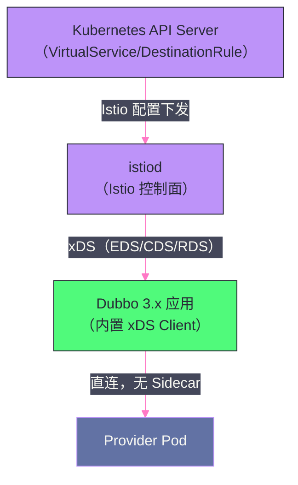

# 08 Dubbo 3.x 新特性——Triple 协议与应用级服务发现

## 摘要

Dubbo 3.x 是 Dubbo 向云原生架构演进的里程碑版本，核心变化集中在两个方向：**Triple 协议**（用 HTTP/2 + Protobuf 替代自定义二进制协议，实现与 gRPC 生态的互通）和**应用级服务发现**（降低注册中心压力，支持万级实例规模）。本文深入剖析 Triple 协议的技术实现细节（HTTP/2 流帧映射、流式调用模型）、应用级服务发现的元数据中心架构，以及 Dubbo Mesh 化的 Proxyless 模式——这是 Dubbo 在 Service Mesh 浪潮中的独特技术路线。

---

## 第 1 章 Triple 协议：云原生 RPC 的技术基础

### 1.1 从自定义协议到 HTTP/2 的动机

在云原生架构中，微服务间的通信协议不再只是"应用层"的问题——**服务网格（Service Mesh）的基础设施层**（Envoy、Istio）对通信协议有强依赖。

Envoy 对 HTTP/2 和 gRPC 有原生的、深度优化的支持：
- 内置 gRPC 转码（gRPC-HTTP/1.1 互转）；
- 内置 gRPC 健康检查协议支持；
- 基于 HTTP/2 流的精细化负载均衡（per-stream LB，而非 per-connection LB）；
- 基于 HTTP 头的请求路由（`x-version`、`x-env` 等标头驱动的流量管理）。

而 Dubbo 原有的自定义二进制协议对 Envoy 来说是不透明的 TCP 流——Envoy 只能在连接级别做简单的 L4 负载均衡，无法做到基于请求内容的 L7 流量管理。这使得 Dubbo 服务在 Service Mesh 场景下无法享受 Istio/Envoy 的全部流量治理能力。

**Triple 协议的定位：** 基于 HTTP/2，完整兼容 gRPC 协议规范，同时在 HTTP/2 之上扩展了 Dubbo 特有的服务治理语义（服务版本、分组、接口级路由等通过 HTTP/2 Header 传递）。

### 1.2 HTTP/2 的关键特性回顾

理解 Triple 协议，需要先理解 HTTP/2 相比 HTTP/1.1 的核心改进：

**多路复用（Multiplexing）：**

HTTP/1.1 的一个连接同一时刻只能有一个在途请求（需要多个连接并行发请求）。HTTP/2 通过**流（Stream）**实现多路复用：一个 TCP 连接上可以同时有多个 Stream，每个 Stream 代表一个独立的请求-响应交互，互不阻塞。

每个 Stream 有唯一的 **Stream ID**（奇数为 Client 发起，偶数为 Server Push），帧（Frame）携带 Stream ID，接收方按 Stream ID 重组。

**头部压缩（HPACK）：**

HTTP/1.1 的 Header 是纯文本，且通常每个请求都携带大量重复的 Header（如 `Content-Type: application/grpc`、`te: trailers`）。HTTP/2 使用 **HPACK** 算法压缩 Header：
- 静态表：常见 Header 字段预先编码（61 个条目，如 `content-type: application/grpc` 对应 index 26）；
- 动态表：对于当前连接中已经传输过的 Header，后续只传输其在动态表中的索引，无需重复传输完整字符串。

对于 RPC 场景（大量相同接口的重复调用），HPACK 可以将每次请求的 Header 压缩到几十字节（vs HTTP/1.1 的数百字节），显著减少网络开销。

**流量控制（Flow Control）：**

HTTP/2 有连接级和流（Stream）级两层流量控制，通过 `WINDOW_UPDATE` 帧协商发送速率，防止发送方淹没接收方（特别是当多个 Stream 共享同一连接时，大流量的 Stream 不应该饿死小流量的 Stream）。

### 1.3 Triple 协议的帧结构

Triple 在 HTTP/2 之上遵循 gRPC 的消息帧格式：

```
HTTP/2 DATA 帧的 Payload 格式：
┌─────────┬───────────────────────────────────────┐
│  1 字节  │              4 字节                   │
│ 压缩标志 │            消息长度（big-endian）        │
├─────────┴───────────────────────────────────────┤
│                  消息体（Protobuf 序列化）         │
└──────────────────────────────────────────────────┘
```

- **压缩标志**：0 = 未压缩，1 = 使用协商的压缩算法（如 gzip）；
- **消息长度**：消息体的字节数（4 字节 unsigned int，最大支持 4GB 的单条消息）；
- **消息体**：序列化后的业务数据（Protobuf 默认，Triple 也支持 Hessian2/JSON）。

HTTP/2 的 Header 帧（HEADERS Frame）携带 RPC 元数据：

**Request HEADERS：**
```
:method = POST
:scheme = http
:path = /com.example.UserService/getUserById
:authority = user-provider:50051
content-type = application/grpc+proto
grpc-timeout = 3000m                          ← 超时（单位：m=毫秒，H=小时）
dubbo-version = 3.1.0                         ← Dubbo 扩展 Header
tri-service-version = 1.0.0                   ← 服务版本（Dubbo 特有）
tri-service-group = default                   ← 服务分组（Dubbo 特有）
```

**Response HEADERS（初始元数据）+ TRAILERS（结束元数据）：**
```
初始 HEADERS：
  :status = 200
  content-type = application/grpc+proto

TRAILERS（请求结束后）：
  grpc-status = 0                              ← 0=OK, 非0=错误
  grpc-message =                               ← 错误消息（可选）
```

gRPC 协议使用 HTTP/2 的 TRAILERS（尾部帧）传递 gRPC Status，而不是 HTTP Status Code（HTTP Status 始终为 200），这是 gRPC 区别于普通 REST API 的特殊设计。Triple 完全遵循这个设计，因此与 gRPC 客户端/服务端完全互通。

### 1.4 Triple 的流式调用模型

gRPC（和 Triple）支持四种调用模式：

| 模式 | Client 行为 | Server 行为 | 适用场景 |
|:---|:---|:---|:---|
| **Unary（一元）** | 发送 1 个请求 | 返回 1 个响应 | 标准 RPC 调用 |
| **Server Streaming** | 发送 1 个请求 | 返回多个响应（流） | 大量数据推送（如 subscribe 事件流） |
| **Client Streaming** | 发送多个请求（流） | 返回 1 个响应 | 批量上传（如日志聚合） |
| **Bidirectional Streaming** | 发送多个请求（流） | 返回多个响应（流） | 实时双向通信（如 chat、实时协作） |

**Triple 中的流式调用（Java API）：**

使用 Protobuf 的 `.proto` 文件定义：

```protobuf
service UserService {
  // 一元调用
  rpc GetUserById (GetUserRequest) returns (User);
  
  // 服务端流式
  rpc WatchUserChanges (WatchRequest) returns (stream UserChange);
  
  // 双向流式
  rpc Chat (stream ChatMessage) returns (stream ChatMessage);
}
```

在 Dubbo 3.x 中，也可以通过 Java API（无 `.proto`）使用流式调用：

```java
@DubboService
public class UserServiceImpl extends UserServiceImplBase {
    
    // 服务端流式：返回 StreamObserver 让服务端主动推送
    @Override
    public StreamObserver<GetUserRequest> watchUserChanges(StreamObserver<UserChange> responseObserver) {
        // 返回一个 StreamObserver，接收客户端的流数据
        return new StreamObserver<GetUserRequest>() {
            @Override
            public void onNext(GetUserRequest request) {
                // 每次收到 Client 的请求，推送一批变更事件
                UserChange change = fetchChanges(request.getUserId());
                responseObserver.onNext(change);
            }
            
            @Override
            public void onCompleted() {
                responseObserver.onCompleted();
            }
        };
    }
}
```

---

## 第 2 章 应用级服务发现的深度实现

### 2.1 接口到应用的映射问题

应用级服务发现（Dubbo 3.x）将注册中心的粒度从"接口"提升到"应用"，但 Consumer 调用时指定的是接口名（`com.example.UserService`），如何知道哪个应用提供了这个接口？

这个映射关系（接口名 → 应用名）需要存储在某处。Dubbo 3.x 的解决方案：

**方案一：元数据中心存储（默认）**

Provider 启动时，在元数据中心（默认复用注册中心，如 Nacos）写入接口到应用的映射：

```
/dubbo/metadata/mapping/com.example.UserService = user-provider
/dubbo/metadata/mapping/com.example.OrderService = order-provider
```

Consumer 启动时，先查询元数据中心，找到 `com.example.UserService` 对应的应用名 `user-provider`，再向注册中心订阅 `user-provider` 应用的实例列表。

**方案二：注册中心中的实例元数据（轻量方案）**

Provider 注册到注册中心时，在实例的 metadata 中携带该实例暴露的接口列表（以 revision hash 形式）：

```
instance metadata:
  dubbo.metadata.revision = abc123def456
  dubbo.metadata.storage-type = remote  # 元数据存在远端
```

Consumer 收到实例列表后，用 `revision` 从元数据中心批量拉取接口详情。相同 `revision`（即代码未变化）的实例共享同一份元数据，不需要每个实例都单独存储。

### 2.2 元数据的内容与格式

每个 Provider 应用在元数据中心存储的完整元数据包含：

```json
{
  "app": "user-provider",
  "revision": "abc123def456",
  "services": {
    "com.example.UserService:1.0.0:default": {
      "name": "com.example.UserService",
      "version": "1.0.0",
      "group": "default",
      "protocol": "dubbo",
      "protocols": ["dubbo", "triple"],
      "methods": [
        {
          "name": "getUserById",
          "parameterTypes": ["java.lang.Long"],
          "returnType": "com.example.User",
          "parameters": {
            "timeout": "3000",
            "retries": "2"
          }
        }
      ],
      "params": {
        "serialization": "hessian2",
        "timeout": "3000"
      }
    }
  }
}
```

`revision` 是这份元数据内容的 MD5 哈希值。当 Provider 发布新版本（接口或配置变更），`revision` 会随之变化，Consumer 能感知并重新拉取最新元数据。如果 Provider 只是滚动重启（代码未变），`revision` 不变，Consumer 直接使用缓存的元数据，无需访问元数据中心，大幅减少服务发现的开销。

### 2.3 双注册双订阅：2.x 到 3.x 的迁移兼容

在从 Dubbo 2.x 迁移到 3.x 的过渡期，系统中可能同时存在 2.x 和 3.x 的 Provider/Consumer。Dubbo 3.x 支持**双注册（Provider）和双订阅（Consumer）**：

**双注册 Provider（3.x）：**
- 同时向注册中心注册接口级 URL（兼容 2.x Consumer）；
- 同时注册应用级实例（兼容 3.x Consumer）。

**双订阅 Consumer（3.x）：**
- 同时订阅接口级 URL（发现 2.x Provider）；
- 同时订阅应用级实例（发现 3.x Provider）；
- 合并两个来源的 Provider 列表，统一放入 `RegistryDirectory`。

这使得 2.x 和 3.x 可以在同一套注册中心下平滑共存，迁移时不需要全量同时升级，可以应用粒度逐步迁移。

---

## 第 3 章 Dubbo Mesh 化：Proxyless 模式的技术路线

### 3.1 Service Mesh 的两种接入模式

**Service Mesh** 的核心理念是将服务治理逻辑（流量管理、熔断限流、可观测性）从应用代码中剥离，下沉到基础设施层（Sidecar Proxy）。Istio + Envoy 是最主流的 Service Mesh 实现。

服务接入 Service Mesh 有两种模式：

**Sidecar 模式（传统 Proxy 模式）：**

在每个 Pod 中注入一个 Envoy Sidecar，所有出入流量都经过 Sidecar 代理。服务治理逻辑在 Sidecar 中实现，应用代码无需改造（使用任何协议都可以）。

**代价：**
- 每次 RPC 调用增加 2 次（出 → Sidecar → 入 Sidecar → 目标）本地 loopback 网络跳转，延迟增加 0.5~2ms；
- 每个 Pod 多运行一个 Envoy 进程，额外消耗 50~200MB 内存；
- Sidecar 本身是 C++ 实现，与 Java 应用的配合（如传递 Dubbo 的 Attachment）需要额外的协议转换。

**Proxyless 模式（Dubbo 3.x 的特色）：**

应用不注入 Sidecar，**Dubbo SDK 直接与 Istio 的控制面（istiod）通信**，自己实现流量管理逻辑，功能上等效于 Sidecar 模式，但无额外的网络跳转开销。

### 3.2 Proxyless 的实现原理

Proxyless 模式的核心是 **xDS 协议**（Envoy 的控制面 API，包括 EDS/CDS/RDS/LDS 等）：

- **EDS（Endpoint Discovery Service）**：提供服务端点（IP + Port）列表，等效于注册中心的服务发现；
- **CDS（Cluster Discovery Service）**：集群配置（负载均衡策略、熔断配置、健康检查）；
- **RDS（Route Discovery Service）**：HTTP 路由规则（流量权重、Header 匹配路由）；
- **LDS（Listener Discovery Service）**：监听器配置（入流量规则）。

在 Proxyless 模式下，Dubbo 3.x 直接实现了一个 **xDS Client**，向 Istio 的 istiod 发起 gRPC 长连接，通过 xDS 协议订阅服务端点和流量规则：



**流量治理规则的统一：**

在 Proxyless 模式下，运维人员可以通过 Istio 的 `VirtualService` 和 `DestinationRule` 来配置 Dubbo 服务的流量规则（权重路由、故障注入、熔断等），与其他 Service Mesh 服务使用统一的控制面——这是 Proxyless 模式最大的运维价值。

### 3.3 Sidecar vs Proxyless 的选型

| 维度 | Sidecar 模式 | Proxyless 模式 |
|:---|:---|:---|
| **延迟** | 增加 0.5~2ms（loopback 网络） | 无额外延迟 |
| **内存开销** | 每 Pod +50~200MB（Envoy） | 无额外开销 |
| **语言支持** | 任意语言（Sidecar 透明代理） | 需要语言 SDK 支持（目前主要 Java） |
| **应用侵入性** | 无侵入（应用无需改造） | 有侵入（需要升级到 Dubbo 3.x） |
| **控制面功能完整性** | 完整（Envoy 支持所有 Istio 特性） | 部分（xDS 功能逐步支持中） |
| **协议灵活性** | 任意协议（Envoy 透明代理） | 需要 Triple/HTTP/2 协议 |

**选型建议：**

- **新建服务，对延迟敏感（金融、游戏）**：Proxyless 模式，避免 Sidecar 的 0.5~2ms 额外延迟；
- **存量服务，异构语言（Java + Go + Python）**：Sidecar 模式，无需各语言 SDK 都实现 xDS Client；
- **对 Mesh 功能完整性要求高**：Sidecar 模式，Envoy 支持所有 Istio 特性；
- **对资源敏感的大规模部署（数千 Pod）**：Proxyless 模式，节省 Envoy Sidecar 的内存开销。

---

## 第 4 章 Dubbo 3.x 的升级路径与注意事项

### 4.1 从 Dubbo 2.7 到 3.x 的核心变化

| 特性 | Dubbo 2.7 | Dubbo 3.x |
|:---|:---|:---|
| **默认服务发现** | 接口级（ZooKeeper） | 应用级（Nacos/ZooKeeper） |
| **默认协议** | Dubbo 自定义二进制 | Dubbo（兼容）/ Triple（推荐） |
| **Spring Boot 集成** | 独立 Starter | 官方 `dubbo-spring-boot-starter` |
| **异步调用** | `RpcContext.getContext().getCompletableFuture()` | 原生 `CompletableFuture` 返回值 |
| **Service Mesh** | 不支持 | xDS Proxyless 模式 |
| **多语言** | Java 为主 | Triple + Protobuf 实现跨语言 |

### 4.2 升级的关键注意点

**注意点一：序列化安全升级**

Dubbo 3.x 默认开启了序列化安全检查（白名单机制），如果 DTO 类在白名单外，反序列化会失败。升级后需要将自定义 DTO 类加入白名单：

```yaml
dubbo:
  application:
    serialize-check-status: WARN  # 先用警告模式，观察日志
    # 之后改为 STRICT 严格模式
```

**注意点二：Triple 协议与 Dubbo 协议混用**

升级到 3.x 后，如果需要逐步迁移协议，可以 Provider 同时暴露两种协议：

```yaml
dubbo:
  protocols:
    - name: dubbo
      port: 20880
    - name: tri
      port: 50051
```

2.x Consumer 通过端口 20880（Dubbo 协议）调用，3.x Consumer 通过端口 50051（Triple 协议）调用，实现平滑过渡。

**注意点三：应用级服务发现与注册中心版本**

应用级服务发现依赖注册中心支持按应用名订阅，Nacos 2.x 对此支持最好（原生支持应用级注册和实例级元数据）；ZooKeeper 的应用级服务发现通过额外的路径约定实现，性能略低于 Nacos。

建议 Dubbo 3.x 配合 **Nacos 2.x** 使用，充分利用 Nacos 2.x 的长连接推送和应用级服务发现优化。

### 4.3 Dubbo 的长期演进方向

**多语言生态：** Triple 协议 + Protobuf 为 Dubbo 建立了跨语言通信的基础，Go SDK（`dubbogo`）、Python SDK、Rust SDK 都在持续发展中，未来 Dubbo 不再是纯 Java 框架。

**与 AI 基础设施的融合：** 随着大模型服务的兴起，流式调用（Server Streaming）场景激增（LLM 的 Token 流式输出天然适合 gRPC/Triple 的 Server Streaming 模式）。Dubbo 3.x 的 Triple 协议正好能覆盖这个场景，成为 AI 微服务通信的候选方案。

**控制面统一：** Proxyless 模式使 Dubbo 能够接入 Istio 控制面，但 Dubbo 也在探索自己的轻量级控制面（`dubbo-admin` 的演进），为不使用 Istio 的场景提供完整的服务治理能力。

---

## 小结

本文系统梳理了 Dubbo 3.x 的两大核心技术演进：

**Triple 协议：**
- 基于 HTTP/2，遵循 gRPC 协议规范，完全兼容 gRPC 客户端/服务端互调；
- HTTP/2 的多路复用、HPACK 头部压缩、流量控制使其在高并发 RPC 场景优于 HTTP/1.1；
- 支持四种调用模式（Unary/Server Streaming/Client Streaming/Bidirectional Streaming），天然适配 AI 流式输出场景；
- Triple 对 Dubbo 扩展的服务版本、分组通过自定义 HTTP Header 传递，在不破坏 gRPC 兼容性的前提下保留了 Dubbo 的服务治理语义。

**应用级服务发现：**
- 注册中心粒度从"接口×实例"变为"应用×实例"，数据量减少"接口数量"倍；
- 接口元数据（方法列表、超时配置）迁移到元数据中心；
- `revision` 哈希机制使得代码未变化的实例共享元数据缓存，大幅减少元数据中心的访问频率；
- 双注册双订阅保证 2.x 和 3.x 平滑共存迁移。

**Proxyless 模式：**
- Dubbo SDK 直接实现 xDS 客户端，与 Istio 控制面集成，实现无 Sidecar 的 Service Mesh；
- 相比 Sidecar 模式，消除额外网络跳转延迟，节省 Envoy 内存，但需要应用升级到 Dubbo 3.x 且使用 Triple 协议。

至此，Dubbo 专栏全部 8 篇文章完成，构建了从 SPI 微内核（01-02）、服务生命周期（03-04）、通信层（05）、集群治理（06-07）到 3.x 云原生演进（08）的完整知识体系。

---

> [!note] 思考题
> 1. Dubbo 3.x 支持 Kubernetes 原生服务发现——使用 K8s Service 替代 ZooKeeper/Nacos。Pod 的 IP 直接作为 Provider 地址。这种方式省去了独立注册中心的运维——但 K8s Service 的服务发现机制（DNS 或 Endpoints API）与 Dubbo 的推模型有什么差异？延迟和及时性如何？
> 2. Service Mesh（如 Istio + Envoy）通过 Sidecar 代理实现服务治理——将负载均衡、熔断、路由等逻辑从应用代码移到基础设施层。Dubbo 本身已经内置了这些能力——引入 Service Mesh 后是否存在功能重叠？在'Dubbo SDK 模式'和'Mesh Sidecar 模式'之间如何选择？
> 3. Dubbo Proxyless Mesh 方案让应用直接通过 xDS 协议与 Istio 控制平面通信——获取路由规则和服务配置——而不需要 Envoy Sidecar。这避免了 Sidecar 的额外延迟和资源消耗。Proxyless 方案的局限是什么？它是否只适用于 Java 应用？
