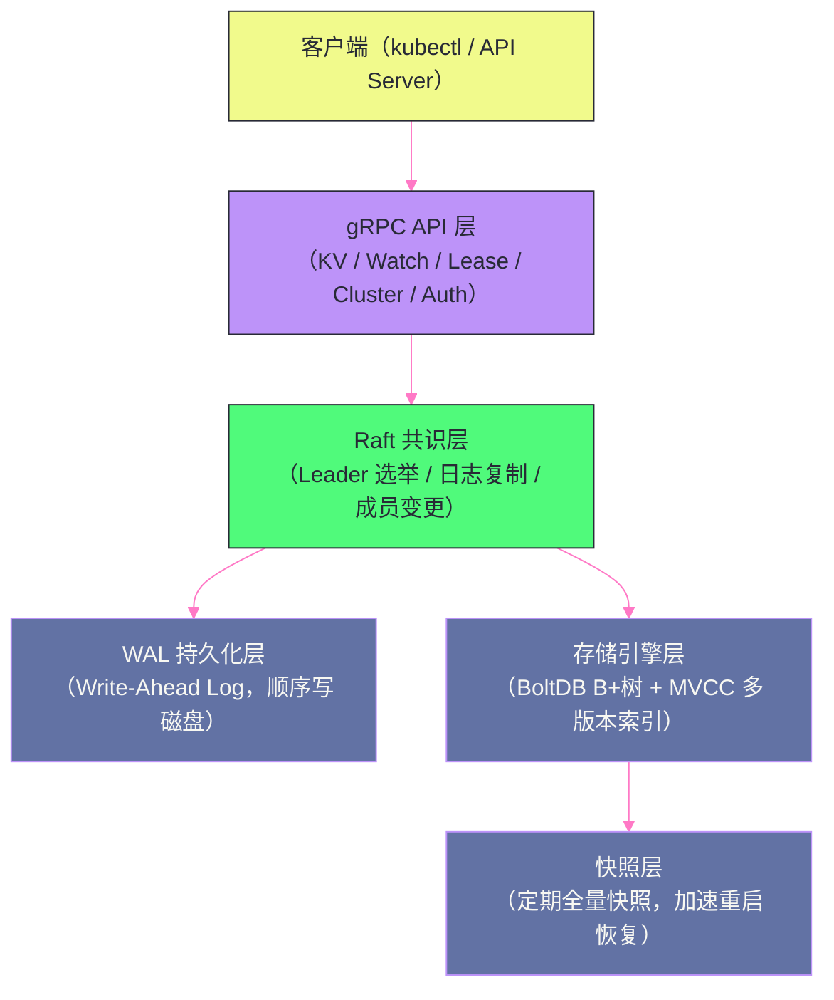
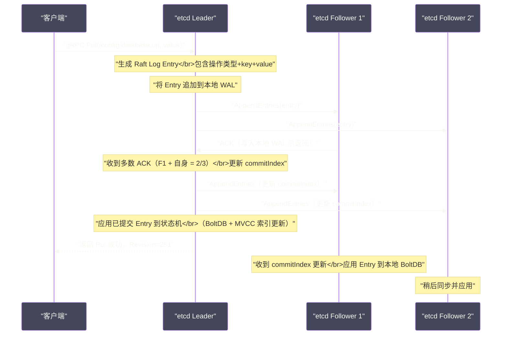

# 01 etcd 全局架构——Raft 共识与 MVCC 存储

## 摘要

etcd 是 CoreOS 于 2013 年开源的分布式键值存储，以 Go 语言编写，基于 Raft 共识协议保证强一致性。它是 [[Kubernetes]] 的"大脑"——集群中所有资源对象（Pod、Service、ConfigMap、Secret、RBAC 规则等）的状态全部持久化于 etcd。理解 etcd 的架构，是理解 Kubernetes 高可用、故障恢复和性能瓶颈的基础。本文以一次写请求的完整链路为主线，串联 etcd 的各个层次：gRPC API 层、Raft 共识层、WAL 持久化层、BoltDB 存储层和 MVCC 多版本语义，建立整体认知框架。

---

## 第 1 章 etcd 在 Kubernetes 生态中的地位

### 1.1 Kubernetes 为什么选择 etcd

Kubernetes 在 2014 年设计时，需要一个集中存储集群状态的组件，要求：
1. **强一致性**：所有 API Server 实例读取的集群状态必须一致（etcd 的线性一致性保证了这一点）；
2. **Watch 支持**：Controller Manager 需要监听资源变化并响应（etcd 的 Watch 机制提供了事件流推送）；
3. **高可用**：etcd 集群应能容忍部分节点故障（Raft 的多数派机制保证）；
4. **轻量级**：不需要关系型数据库的复杂查询能力，键值存储足够；
5. **Go 语言**：与 Kubernetes 的技术栈一致，维护成本低。

etcd 恰好满足上述所有要求。[[Zookeeper]] 是当时唯一可比的竞争对手，但 ZooKeeper 的 Java 实现（JVM GC 问题）、复杂的 ZAB 协议和较差的跨语言客户端，让 Kubernetes 团队最终选择了 etcd。

### 1.2 etcd 存储了哪些 Kubernetes 数据

以一个典型的 Kubernetes 集群为例，etcd 中存储的 key 格式为 `/registry/{resource-type}/{namespace}/{name}`：

```
/registry/pods/default/nginx-deployment-6d4b9c9c4-abc12
/registry/services/default/my-service
/registry/configmaps/kube-system/kube-dns
/registry/secrets/default/db-password
/registry/deployments/default/nginx-deployment
/registry/nodes/node-1
/registry/namespaces/default
...
```

每个 key 对应的 value 是对应 Kubernetes 对象的 **Protobuf 序列化**（Kubernetes 1.6+ 默认使用 Protobuf 序列化存储到 etcd，比 JSON 体积小约 30%）。

对于一个中型 Kubernetes 集群（100 个节点，1000 个 Pod），etcd 中大约有 10,000~100,000 个 key，总数据量通常在 100MB~2GB 范围内。

### 1.3 etcd 的集群规模

etcd 生产集群通常部署 **3 节点或 5 节点**：
- **3 节点**：quorum = 2，可容忍 1 节点故障；
- **5 节点**：quorum = 3，可容忍 2 节点故障；
- **7 节点**：理论上可容忍 3 节点故障，但写操作需要 4 个节点确认，延迟增加，实际生产中很少使用。

> [!warning] 生产避坑
> etcd 集群**不应该超过 7 个节点**。每次写入需要超过半数节点确认，节点越多写延迟越大（需要更多网络往返）。如果需要扩展读吞吐量，应通过 API Server 的缓存层（informer 机制）来减少对 etcd 的直接读取，而不是增加 etcd 节点数。

---

## 第 2 章 etcd 的分层架构

### 2.1 五层架构概览

etcd 的内部架构分为五层（从上到下）：



**gRPC API 层**：etcd 对外暴露基于 gRPC（HTTP/2）的 API，主要服务：
- `KV`：Put/Get/Delete/Txn（事务）；
- `Watch`：基于 Revision 的事件流订阅；
- `Lease`：TTL 租约管理（GrantLease/KeepAlive/Revoke）；
- `Cluster`：成员管理（MemberAdd/MemberRemove）；
- `Maintenance`：运维操作（Snapshot/Defragment/Alarm）。

同时，etcd 也通过 HTTP/1.1 提供了 v3 API 的 JSON 网关（grpc-gateway），方便调试。

**Raft 共识层**：实现 Raft 协议，保证集群内所有节点的数据一致性。所有写请求必须经过 Raft Leader，被 quorum 确认后才能提交。

**WAL 持久化层**：Write-Ahead Log，在 Raft Entry（日志条目）被应用到状态机之前，先追加写入磁盘文件。WAL 保证了即使节点崩溃，重启后可以通过重放日志恢复状态。

**存储引擎层**：以 BoltDB（嵌入式 B+ Tree 数据库）作为持久化存储引擎，在 BoltDB 之上构建了 MVCC（多版本并发控制）索引，实现历史版本查询和 Watch 的事件溯源。

**快照层**：定期将 BoltDB 的完整状态序列化为快照文件，用于新节点加入时的全量同步，以及重启时的快速数据恢复（避免重放所有 WAL）。

---

## 第 3 章 MVCC：etcd 多版本存储的核心设计

### 3.1 什么是 MVCC，为什么需要它

MVCC（Multi-Version Concurrency Control，多版本并发控制）是 etcd 存储层最重要的设计。在普通的键值存储中，每次 Put 会覆盖旧值，只保留最新版本。etcd 的 MVCC 则**保留每个 key 的所有历史版本**。

**为什么保留历史版本？**

etcd 的 Watch 机制需要历史版本：客户端可以订阅"从 Revision 100 开始的所有变更事件"。如果没有历史版本，当客户端因网络断开重连时，就无法获取断线期间的变更，会遗漏事件。

Kubernetes 的 Controller 机制依赖这个特性——每个 Controller（Deployment Controller、Service Controller 等）通过 `resourceVersion` 断点续传，确保每一次资源变更都被处理到，不会因为 Controller 重启或 List-Watch 重连而遗漏事件。

### 3.2 Revision 与 ModRevision

etcd 有两个核心版本号概念：

**Revision（全局递增版本号）：**

etcd 维护一个**全局单调递增**的 `Revision` 计数器，每次成功的写操作（Put/Delete/Txn）都会使 `Revision` 加 1。`Revision` 是整个 etcd 集群的"逻辑时钟"——它反映了从 etcd 创建以来一共发生了多少次写操作。

**ModRevision（Key 的最后修改版本）：**

每个 key 有自己的 `ModRevision`（最近一次修改时的全局 Revision）、`CreateRevision`（创建时的 Revision）、`Version`（该 key 自创建以来被修改的次数）：

```
Key: /registry/pods/default/nginx
  CreateRevision = 100   ← 在 Revision=100 时创建
  ModRevision = 250      ← 最后一次修改是在 Revision=250
  Version = 5            ← 被修改了 5 次（从创建到现在）
  Value = <Protobuf>
```

### 3.3 MVCC 的内部存储结构

etcd 的 MVCC 由两部分组成：

**B-Tree 内存索引（treeIndex）：**

用一个内存中的 B-Tree（Go 标准库 `btree`）维护 `key → keyIndex` 的映射，`keyIndex` 记录该 key 的所有历史版本：

```go
type keyIndex struct {
    key         []byte           // key 的字节表示
    modified     revision         // 最后一次修改的 Revision
    generations  []generation     // 每个 generation 是 key 从创建到删除的一段生命周期
}

type generation struct {
    ver    int64        // 该 generation 的版本计数
    created revision   // 该 generation 开始的 Revision（创建或上次删除后重建）
    revs   []revision  // 该 generation 中所有修改的 Revision 列表
}
```

**BoltDB 持久化存储：**

以 `{main_revision, sub_revision}` 为 key，存储对应版本的 key-value 数据：

```
BoltDB key: {Revision=250, Sub=0} → value: {key: /registry/pods/..., value: <Protobuf>}
BoltDB key: {Revision=249, Sub=0} → value: {key: /registry/services/..., value: <Protobuf>}
```

**查询某个 key 的最新值的流程：**
1. 在 treeIndex（内存 B-Tree）中查找 `/registry/pods/default/nginx`，找到其最新的 ModRevision = 250；
2. 在 BoltDB 中查找 key = `{250, 0}`，取出对应的 value。

**查询某个 key 在历史 Revision 100 的值：**
1. 在 treeIndex 中找到 `/registry/pods/default/nginx` 的所有历史 Revision；
2. 找到 ≤ 100 的最大 Revision（如 CreateRevision=100）；
3. 在 BoltDB 中查找 key = `{100, 0}`，取出历史值。

---

## 第 4 章 一次写请求的完整链路

### 4.1 从 gRPC 到 Raft

当客户端（如 kubectl）执行 `etcdctl put /config/database.url "jdbc:mysql://...` 时：



**关键步骤详解：**

**步骤 1：客户端连接 Leader**

etcd 客户端（`go.etcd.io/etcd/client/v3`）会自动发现 Leader——如果连接到 Follower，Follower 会返回 `NOT_LEADER` 错误并附上 Leader 的地址，客户端自动重连到 Leader。

**步骤 2：Leader 生成 Raft Log Entry**

Leader 将写请求封装为 Raft Log Entry（包含操作类型、key、value、客户端 ID 等），分配一个递增的 `Index`（日志索引，不同于 MVCC 的 Revision）。

**步骤 3：WAL 持久化**

在发送 `AppendEntries` 给 Follower 之前，Leader 先将 Entry 追加写入本地 WAL 文件（fsync，确保落盘）。

**步骤 4：Follower 确认**

Follower 收到 `AppendEntries` 后，将 Entry 写入本地 WAL（fsync），返回 ACK。

**步骤 5：提交（Commit）**

Leader 收到超过半数（quorum）的 ACK 后，将 `commitIndex` 更新为该 Entry 的 Index，通过下一次 `AppendEntries` 将 `commitIndex` 通知给 Follower。

**步骤 6：应用（Apply）**

Leader 的 apply 协程将 `commitIndex` 以下所有已提交但未应用的 Entry，按顺序应用到状态机（BoltDB + MVCC treeIndex 更新）。MVCC 的全局 `Revision` 在此时递增，新的 key-value 存入 BoltDB。

**步骤 7：响应客户端**

Entry 应用完成后，Leader 向客户端返回成功响应，携带新的 `Revision`（如 251）。

### 4.2 读请求的一致性保证

etcd 支持两种读模式，在一致性和性能之间权衡：

**线性化读（Linearizable Read，默认）：**

保证读到最新的已提交数据。实现方式是 **ReadIndex**：
1. Leader 收到读请求时，记录当前的 `commitIndex`；
2. Leader 向所有 Follower 发送心跳（确认自己仍然是合法的 Leader，防止网络分区后脑裂 Leader 读到旧数据）；
3. 等待状态机的 `appliedIndex` 追上 `commitIndex`；
4. 此时从状态机读取数据返回给客户端。

代价：每次读需要一次心跳往返（约等于半个网络 RTT），相比不保证线性化的读，延迟略高。

**串行化读（Serializable Read）：**

直接从本地状态机读取，不经过 Raft，延迟极低，但可能读到稍旧的数据（Follower 的 apply 进度可能落后 Leader）。适合对数据新鲜度要求不严格的场景（如监控仪表盘的背景刷新）。

客户端控制：

```go
// 线性化读（默认）
resp, err := client.Get(ctx, "/config/key")

// 串行化读（指定选项）
resp, err := client.Get(ctx, "/config/key", clientv3.WithSerializable())
```

---

## 第 5 章 etcd 的数据模型与 API

### 5.1 Key-Value 的完整结构

etcd 的每个键值对不只有 key 和 value，还包含丰富的元数据：

```protobuf
message KeyValue {
  bytes key = 1;              // 键
  int64 create_revision = 2; // 创建时的全局 Revision
  int64 mod_revision = 3;    // 最后修改时的全局 Revision
  int64 version = 4;         // 该 key 被修改的次数（从 1 开始，删除后重建归零重新计数）
  bytes value = 5;           // 值
  int64 lease = 6;           // 关联的 Lease ID（0 = 无 Lease）
}
```

### 5.2 Txn：Mini 事务

etcd 支持一种有限但非常实用的**原子事务（Txn）**，格式为 `if-then-else`：

```go
txnResp, err := client.Txn(ctx).
    If(
        // 条件：/locks/my-lock 的 createRevision == 0（即不存在）
        clientv3.Compare(clientv3.CreateRevision("/locks/my-lock"), "=", 0),
    ).
    Then(
        // 如果条件成立：创建临时节点（关联 Lease）
        clientv3.OpPut("/locks/my-lock", leaseID, clientv3.WithLease(leaseID)),
    ).
    Else(
        // 如果条件不成立：获取当前值
        clientv3.OpGet("/locks/my-lock"),
    ).
    Commit()

if txnResp.Succeeded {
    // 成功获得锁
} else {
    // 锁已被其他节点持有
    currentHolder := txnResp.Responses[0].GetResponseRange().Kvs[0]
}
```

这个 `if (CreateRevision == 0) then Put` 的原子操作，是 etcd 实现分布式锁的基础——只有 `CreateRevision == 0`（key 不存在）时才能成功 Put，且整个过程原子，无并发竞争问题。

### 5.3 Prefix Scan：前缀查询

etcd 的 key 是字节序列，可以利用词典序做前缀范围查询：

```go
// 获取所有 /registry/pods/ 下的 key（Kubernetes 查询所有 Pod）
resp, err := client.Get(ctx, "/registry/pods/", clientv3.WithPrefix())

// 等价于范围查询：key >= "/registry/pods/" && key < "/registry/pods0"
// （'/' 的 ASCII 码是 47，'0' 是 48，所以 "/registry/pods0" 是 "/registry/pods/" 的后继边界）
```

Kubernetes API Server 通过前缀查询高效地获取某类资源的所有对象列表，而无需全表扫描。

---

## 小结

本文建立了对 etcd 架构的整体认知：

- **etcd 在 Kubernetes 中的角色**：所有集群状态（Pod/Service/ConfigMap 等）的持久化存储，是 Kubernetes 控制面的"真相单一来源"；
- **五层架构**：gRPC API → Raft 共识 → WAL 持久化 → BoltDB 存储 → 快照；每层职责清晰，组合保证了强一致性和持久性；
- **MVCC 多版本存储**：全局递增 `Revision` 是 etcd 的"逻辑时钟"，BoltDB 以 `Revision` 为 key 存储所有历史版本，内存 B-Tree 索引提供 key → RevisionList 的快速查找；
- **一次写请求链路**：Client → Leader gRPC → Raft AppendEntries（WAL fsync）→ Majority ACK → commitIndex 更新 → apply 到 BoltDB → 响应 Client；
- **读一致性**：线性化读（默认）通过 ReadIndex 保证读到最新数据；串行化读直接从本地状态机读，延迟更低但可能稍旧。

下一篇文章将深入 Raft 协议的核心机制——Leader 选举的随机超时、日志复制的 AppendEntries 协议，以及 Raft 的安全性保证（已提交的日志不会被覆盖）。

---

> [!note] 思考题
> 1. etcd 使用 Raft 协议实现一致性，所有写操作必须经过 Leader 节点。在一个 3 节点的 etcd 集群中，写操作需要 2 个节点确认（quorum）才算成功。如果 Leader 和一个 Follower 之间的网络延迟为 100ms，写操作的最低延迟是多少？在跨数据中心部署 etcd 时（节点分布在不同城市），Raft 的延迟如何影响 Kubernetes 的 API 响应时间？
> 2. etcd 的数据存储在 BoltDB（一个嵌入式 B+ 树 KV 存储）中。BoltDB 使用 mmap 将文件映射到内存，读操作直接从内存中读取。但 BoltDB 的写操作需要获取全局写锁——这意味着写操作是串行的。在高写入负载场景中，etcd 的写吞吐量瓶颈在哪里？bbolt（BoltDB 的 fork）做了哪些改进？
> 3. etcd 被 Kubernetes 用作唯一的存储后端——所有集群状态（Pod、Service、ConfigMap 等）都存储在 etcd 中。如果 etcd 不可用，Kubernetes 控制平面完全无法工作。在生产环境中，你如何保证 etcd 的高可用？etcd 节点应该部署在专用机器上还是与 K8s Master 共享？
