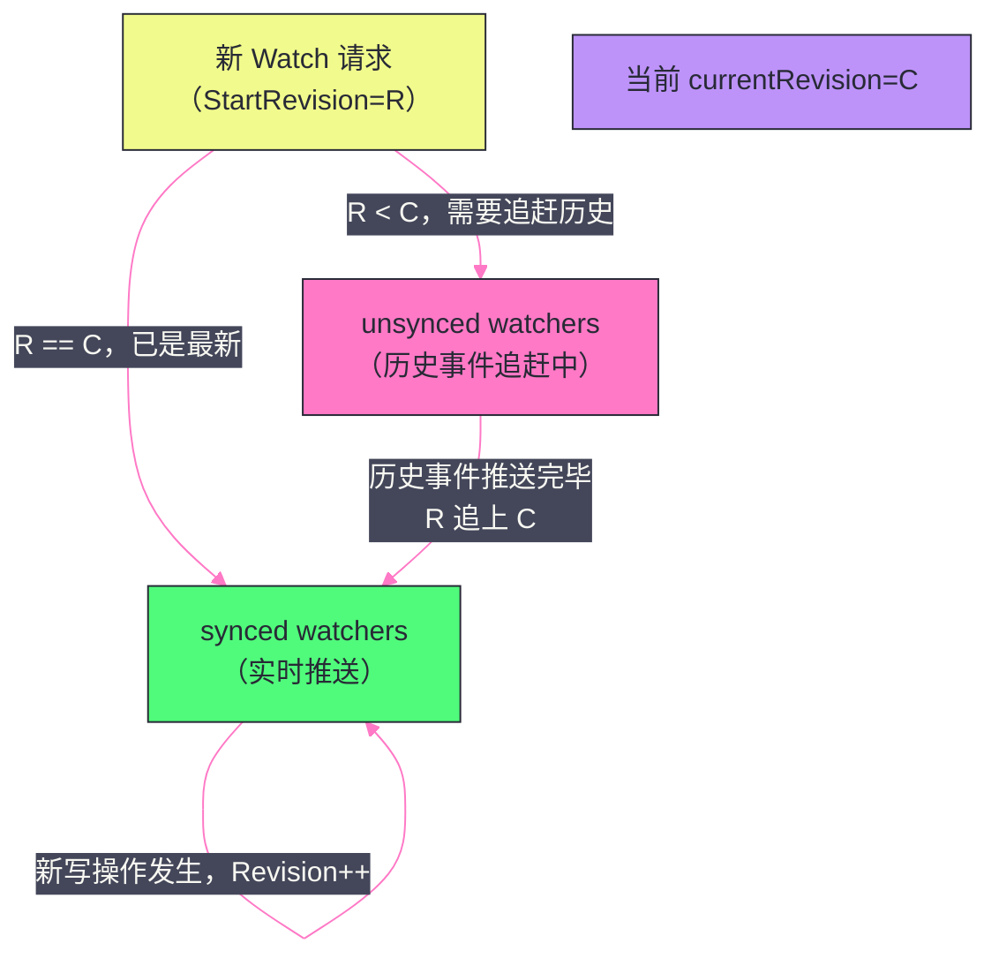

# 04 Watch 与 Lease 机制

## 摘要

Watch 和 Lease 是 etcd 区别于普通键值存储的两大核心特性，也是 [[Kubernetes]] 控制平面架构的基础设施。Watch 提供了基于 Revision 的**持久化事件流**——客户端可以从任意历史 Revision 开始订阅，不遗漏任何变更；Lease 提供了**TTL 自动过期**机制——绑定了 Lease 的 key 在租约到期后自动删除，是服务发现（Provider 心跳）和分布式锁（持有者宕机自动释放）的基础。本文深入剖析 Watch 的流式推送实现（EventHistory + WatchStore 的分层设计）、Lease 的 TTL 续约机制，以及两者在实际工程场景中的使用模式与边界。

---

## 第 1 章 Watch 机制：不止于"监听变化"

### 1.1 Watch 的设计目标

etcd 的 Watch 与 [[Zookeeper]] 的 Watcher 有本质区别，理解这个区别是理解 etcd Watch 设计动机的关键：

**ZooKeeper Watcher 的问题：**
- **一次性**：Watcher 触发一次后自动失效，客户端必须重新注册 Watcher；
- **无历史事件**：Watcher 只通知"有变化发生"，不携带具体的变更内容，客户端需要主动 Get 获取最新值；
- **可能遗漏事件**：在 Watcher 失效（触发后）到客户端重新注册 Watcher 之间，如果 key 又发生了变化，客户端会错过这些中间事件。

这对 Kubernetes 的控制器（Controller）模式是致命缺陷——Controller 需要感知每一次资源变更（包括 Controller 宕机期间的变更），不能遗漏任何事件，否则集群状态可能不一致。

**etcd Watch 的设计目标：**
1. **持久化**：一次注册，持续收到所有后续变更，无需重复注册；
2. **携带事件内容**：每个 Watch 事件包含完整的 KeyValue（变更前后的值），客户端无需额外 Get；
3. **历史追溯**：客户端可以指定从某个 `StartRevision` 开始 Watch，获取该 Revision 之后的所有历史事件——即使 Controller 断线重连，只需提供断线前的最后一个 `Revision`，就能从断点续传，不遗漏任何事件。

### 1.2 Watch 的 gRPC 流式 API

etcd 的 Watch 使用 gRPC 的**双向流式 RPC（Bidirectional Streaming）**：

```protobuf
service Watch {
  // 双向流：客户端发送 WatchRequest，服务端推送 WatchResponse
  rpc Watch(stream WatchRequest) returns (stream WatchResponse);
}
```

一个 gRPC 流连接上，客户端可以复用（multiplex）多个 Watch，每个 Watch 有唯一的 `watch_id`：

```go
// 创建 Watch 流
watchClient := clientv3.NewWatcher(client)

// 在一个 gRPC 流上创建多个独立的 Watch
wch1 := watchClient.Watch(ctx, "/registry/pods/", clientv3.WithPrefix())
wch2 := watchClient.Watch(ctx, "/registry/services/", clientv3.WithPrefix(), 
                          clientv3.WithRev(1000))  // 从 Revision 1000 开始

// 处理事件
go func() {
    for wresp := range wch1 {
        for _, ev := range wresp.Events {
            fmt.Printf("Pod 事件: %s %q : %q\n", ev.Type, ev.Kv.Key, ev.Kv.Value)
        }
    }
}()
```

`WithRev(1000)` 是断点续传的关键：客户端在重连时，将上次处理到的最后一个 Revision 传入，etcd 会从该 Revision + 1 开始推送事件，确保不遗漏。

---

## 第 2 章 Watch 的内部实现

### 2.1 事件的存储：EventHistory

etcd 的 MVCC 层维护了一个 **EventHistory**（也称 Watch Buffer 或 WatchableStore 的事件缓冲），用于存储最近的写操作事件：

每次写操作（Put/Delete）成功 apply 到 BoltDB 后，同时在内存中生成一个 `Event` 记录：

```go
type Event struct {
    Type   EventType  // PUT 或 DELETE
    Kv     *KeyValue  // 变更后的 KeyValue（包含新值、ModRevision 等）
    PrevKv *KeyValue  // 变更前的 KeyValue（如果请求了 WithPrevKV 选项）
}
```

这些 Event 按 Revision 顺序存储在内存循环缓冲（默认大小约 1000 个 Event，通过 `--max-watcher-buffer-size` 控制）。

**为什么 EventHistory 是有限的？**

如果将所有历史 Event 保存在内存中，内存会无限增长。EventHistory 是有限大小的循环缓冲，只保留最近的事件。对于 Watch 请求中指定的 `StartRevision` 非常古老（比 EventHistory 最早的 Revision 还要旧）的情况，etcd 会**回退到 BoltDB**，通过扫描历史版本来重放事件。

### 2.2 WatchStore：Watch 的分发引擎

etcd 内部的 `watchableStore` 维护两类 watcher：

**`synced` watchers（已同步的 Watcher）：**

表示已经"追上"了当前最新 Revision 的 Watcher——这些 Watcher 的 `StartRevision` 不超过当前 `currentRevision`，它们等待未来的新事件实时推送。

**`unsynced` watchers（未同步的 Watcher）：**

表示指定了历史 `StartRevision`（小于当前 `currentRevision`）的 Watcher，需要先将历史事件追赶推送给客户端，再转移到 `synced` 状态。



### 2.3 历史事件的追赶（Catching Up）

后台 goroutine 定期处理 `unsynced` watchers：

1. 取出一批 `unsynced` watchers（按 `StartRevision` 排序）；
2. 在 BoltDB 中对这些 watchers 感兴趣的 key 范围做历史扫描（从 `StartRevision` 到 `currentRevision`）；
3. 将扫描到的历史 Event 发送给对应的 watcher；
4. 当 watcher 的当前推送 Revision 追上 `currentRevision` 时，将其移入 `synced` 集合。

**追赶期间的并发处理：**

当 `unsynced` watcher 还在追赶历史事件时，新的写操作仍在持续发生（`currentRevision` 继续增加）。etcd 保证：追赶过程严格按 Revision 顺序推送，新事件缓存在 watcher 的发送队列中，等追赶完成后按序推送，不会乱序或遗漏。

### 2.4 Watch 的流量控制

单个 Watch 流的发送速率由 gRPC 的**背压（Backpressure）**机制控制：

- 服务端的 gRPC 发送缓冲区（默认 32 KB per stream）满时，服务端停止发送，等待客户端消费；
- 如果客户端消费速度过慢，导致服务端的 watcher 队列（`pendingCh`，默认大小 128）积压满，etcd 会关闭该 Watch（发送 `WatchResponse{Canceled: true}`），客户端需要重新建立 Watch。

这是 etcd Watch 的一个重要行为：**消费太慢可能导致 Watch 被强制取消**，应用层必须处理 Watch 取消的情况（重建 Watch 并带上最后收到的 Revision 做断点续传）。

---

## 第 3 章 Lease：TTL 自动过期的核心机制

### 3.1 Lease 是什么，为什么需要它

**Lease（租约）** 是一个有生命周期（TTL，Time-To-Live）的令牌。任何 key 都可以绑定到一个 Lease，当 Lease 到期（TTL 耗尽）时，所有绑定该 Lease 的 key **自动被删除**。

**为什么需要 Lease？核心场景是"活跃性检测（Liveness Detection）"：**

在分布式系统中，如何判断一个服务节点是否存活？最直接的方法是节点定期发送心跳。但如果不使用 Lease，心跳机制需要自己实现：
- 节点每隔 T 秒向 etcd Put 一个"心跳 key"（如 `/heartbeat/{nodeID}`），更新时间戳；
- 监控方定期扫描所有"心跳 key"，检查时间戳是否超时；
- 问题：定期扫描有延迟，且 etcd 需要承担大量频繁的 Put 写入（每个节点每 T 秒一次）。

Lease 优雅地解决了这个问题：
- 节点在启动时 `GrantLease(TTL=30s)`，获得 Lease ID；
- 将服务注册 key 绑定到这个 Lease：`Put("/services/user-node1", addr, WithLease(leaseID))`；
- 节点定期（如每 10 秒）调用 `KeepAlive(leaseID)` 续约（重置 TTL）；
- 节点宕机 → 续约停止 → Lease TTL 耗尽（30 秒后）→ `/services/user-node1` 自动被 etcd 删除 → 所有 Watch 该路径的监听者收到 DELETE 事件。

与手动心跳相比：
- 续约（`KeepAlive`）只传输 Lease ID（一个 int64），而不是完整的 key-value，开销极小；
- TTL 过期由 etcd 服务端保证，无需监控方主动扫描；
- 宕机感知时间 ≈ TTL（可精确控制），无轮询延迟。

### 3.2 Lease 的内部存储

etcd 将所有活跃 Lease 存储在 BoltDB 的 `lease` Bucket 中（持久化，防止 etcd 重启后 Lease 丢失），并在内存中维护一个 `leaseMap`：

```go
type Lease struct {
    ID       LeaseID         // int64 类型的 Lease ID
    TTL      int64           // 租约 TTL（秒）
    RemainingTTL int64       // 剩余 TTL（秒）
    expiry   time.Time       // 过期的绝对时间（本地时间）
    itemSet  map[LeaseItem]struct{}  // 绑定到此 Lease 的所有 key
}
```

Lease 到期的检测由后台的 `revokeExpiredLeases` goroutine 负责（默认每 500ms 扫描一次 `leaseMap`，找出已过期的 Lease 执行 Revoke）。

**Revoke（撤销）的执行流程：**

Revoke 一个 Lease 等同于删除所有绑定该 Lease 的 key——etcd 将 Revoke 操作封装为一个 Raft 提案（与普通的 Delete 操作相同），经过 Raft 多数确认后，所有绑定的 key 被原子删除，对应的 Watch 事件被推送给所有订阅者。

**为什么 Revoke 要走 Raft，而不是直接删除？**

因为 Lease 到期是由 Leader 的本地时钟触发的，而 Leader 的时钟可能与其他节点有偏差。如果直接在 Leader 上删除，Follower 不知道这些 key 已被删除，数据不一致。通过 Raft 提案，所有节点在相同的 Raft Log Index 处执行删除，保证一致性。

### 3.3 KeepAlive：续约的实现

`KeepAlive` 是 Lease 续约的 API，使用 gRPC 流式 RPC：

```protobuf
service Lease {
  rpc LeaseKeepAlive(stream LeaseKeepAliveRequest) 
      returns (stream LeaseKeepAliveResponse);
}
```

客户端与 etcd 之间保持一个长连接的 gRPC 流，客户端定期发送 `LeaseKeepAliveRequest{ID: leaseID}`，etcd 回复剩余 TTL：

```go
// etcd 客户端的 KeepAlive 使用内部自动续约机制
ka, err := client.KeepAlive(ctx, leaseID)
// ka 是一个 channel，每次续约成功会发送 KeepAliveResponse
go func() {
    for resp := range ka {
        fmt.Printf("Lease 续约成功，剩余 TTL = %d 秒\n", resp.TTL)
    }
    // channel 关闭意味着续约失败（连接断开或 Lease 已过期）
    fmt.Println("KeepAlive 结束，需要重新申请 Lease")
}()
```

**续约频率与 TTL 的关系：**

etcd Go 客户端默认在 `TTL / 3` 时间间隔发送续约请求（如 TTL=30s，则每 10s 续约一次）。这样即使某次续约请求因网络抖动失败，还有 2/3 的 TTL 时间窗口来重试，大幅降低了因单次续约失败导致 Lease 过期的概率。

### 3.4 Lease 的时钟安全问题

Lease 的 TTL 计算依赖 Leader 的本地时钟。如果 Leader 的时钟跳变（如 NTP 时间跳跃），可能导致 Lease 提前或延迟过期。

etcd 使用**单调时钟（`time.Now().UnixNano()` in Go 使用 CLOCK_REALTIME，但 etcd 也依赖 `time.Since()` 用 CLOCK_MONOTONIC 防止系统时间回拨的影响）**，减少时钟跳变的影响。

但即便如此，etcd 的 Lease 本质上是一个"宽松的 TTL"——实际过期时间可能比设定的 TTL 略长（最多多几秒，取决于 Revoke 检测周期和 Raft 提交延迟）。这意味着：

> [!warning] 生产避坑
> **不要依赖 etcd Lease 来实现精确的 TTL（如"精确在第 30.0 秒释放锁"）**。Lease 的过期是"最终一致的"——某个持有者的 Lease 过期到新持有者能够 Put 成功，中间有 O(TTL) 级别的不确定性。在需要精确 Fencing 的场景（如分布式锁），应结合 Revision-based Compare-And-Swap（CAS，即 Txn 操作）来保证操作的唯一性，而不是仅依赖 Lease TTL。

---

## 第 4 章 Lease 的工程应用：服务发现与分布式锁

### 4.1 基于 Lease 的服务注册与发现

**Provider 注册（服务注册）：**

```go
// 1. 申请 Lease（TTL = 30 秒）
lease, err := client.Grant(ctx, 30)
leaseID := lease.ID

// 2. 启动 KeepAlive（自动续约）
keepAliveCh, err := client.KeepAlive(ctx, leaseID)
go consumeKeepAlive(keepAliveCh)  // 处理续约响应

// 3. 将服务地址注册为绑定 Lease 的 key
_, err = client.Put(ctx, "/services/user-provider/"+nodeID, 
                    addr, 
                    clientv3.WithLease(leaseID))
// Provider 宕机 → KeepAlive 停止 → 30 秒后 Lease 过期 → key 自动删除
```

**Consumer 发现（服务订阅）：**

```go
// 1. 获取当前所有 Provider
resp, err := client.Get(ctx, "/services/user-provider/", clientv3.WithPrefix())
providers := make(map[string]string)
for _, kv := range resp.Kvs {
    providers[string(kv.Key)] = string(kv.Value)
}
currentRev := resp.Header.Revision  // 记录当前 Revision，用于 Watch 断点续传

// 2. 从当前 Revision 开始 Watch，实时感知变化
wch := client.Watch(ctx, "/services/user-provider/", 
                    clientv3.WithPrefix(), 
                    clientv3.WithRev(currentRev+1))

for wresp := range wch {
    for _, ev := range wresp.Events {
        switch ev.Type {
        case mvccpb.PUT:
            // 新 Provider 上线
            providers[string(ev.Kv.Key)] = string(ev.Kv.Value)
        case mvccpb.DELETE:
            // Provider 下线（Lease 过期自动触发）
            delete(providers, string(ev.Kv.Key))
        }
    }
    updateLoadBalancer(providers)
}
```

**Get + Watch 的 Revision 对齐是关键**：先 Get 获取初始状态并记录 `Revision`，再从 `Revision + 1` 开始 Watch，确保 Get 之后发生的事件不被遗漏。如果先 Watch 再 Get，可能遗漏 Watch 建立到 Get 执行之间的事件。

### 4.2 基于 Lease 的分布式锁

etcd 的官方分布式锁库（`go.etcd.io/etcd/client/v3/concurrency`）实现了一个基于 Lease + Txn 的锁：

**Lock 的实现逻辑（简化）：**

```go
func (m *Mutex) Lock(ctx context.Context) error {
    // 1. 创建 Lease（锁的 TTL，防止持有者宕机后锁永远不释放）
    s, _ := concurrency.NewSession(client, concurrency.WithTTL(30))
    
    // 2. 将锁 key 绑定到 Lease，key 使用前缀 + Lease ID 形成唯一 key
    // 例如：/locks/my-lock/{leaseID}
    lockKey := m.pfx + fmt.Sprintf("%016x", s.Lease())
    
    // 3. 尝试创建 key（使用 Txn CAS：只有 CreateRevision == 0 才创建）
    txnResp, _ := client.Txn(ctx).
        If(clientv3.Compare(clientv3.CreateRevision(lockKey), "=", 0)).
        Then(clientv3.OpPut(lockKey, "", clientv3.WithLease(s.Lease()))).
        Else(clientv3.OpGet(lockKey)).
        Commit()
    
    if txnResp.Succeeded {
        // 创建成功，即持有锁（当前没有其他持有者）
        // 检查是否是 /locks/my-lock/ 前缀下最小 Revision 的 key
        // 如果是，则成功获取锁
    }
    
    // 4. 如果不是最小 Revision，监听前一个 key 的删除事件
    // 使用类似 ZooKeeper 顺序节点的"等待前任"机制
    // 等待前一个 key 的 Lease 过期（DELETE 事件），再尝试获取锁
}
```

**基于 Revision 的公平锁（与 ZooKeeper 顺序节点类似）：**

所有竞争锁的节点都在 `/locks/my-lock/` 前缀下创建一个绑定 Lease 的 key，key 的 `CreateRevision` 自然递增（先创建的 Revision 小）。锁的规则是：`CreateRevision` 最小的节点持有锁，其他节点监听"前一个 Revision 对应的 key"的删除事件，形成**公平的等待队列**（FIFO）。

这与 ZooKeeper 顺序节点的分布式锁逻辑完全一致，但 etcd 的 Lease 在 TTL 过期处理上更可靠（直接 Revoke 所有绑定 key，不需要 Session 超时机制）。

---

## 第 5 章 Watch 与 Lease 在 Kubernetes 中的协作

### 5.1 Kubernetes Informer 机制

Kubernetes 的 Controller（如 Deployment Controller、ReplicaSet Controller）通过 **Informer** 来监听资源变化，Informer 底层是 Watch + List：

```
Informer 启动流程：
1. List：从 API Server 获取当前所有该类型资源的快照
          记录返回的 ResourceVersion（对应 etcd 的 Revision）
2. Watch：从 ResourceVersion+1 开始 Watch，接收后续所有变更事件
3. 事件分发：Put → Added/Updated handler
              Delete → Deleted handler
4. 断线重连：自动重建 Watch（携带最后收到的 ResourceVersion 做断点续传）
5. 本地缓存（Store）：在内存中维护所有资源对象的最新状态，
                      使 Controller 无需每次都从 etcd 读取（减轻 etcd 压力）
```

这正是 etcd Watch 的 `WithRev()` 特性在 Kubernetes 中的直接应用——**断点续传保证 Controller 不遗漏任何事件**，这对于保证集群状态收敛是至关重要的。

### 5.2 Kubernetes 节点心跳与 etcd Lease

Kubernetes 1.17+ 中，Node 的心跳机制使用了 etcd Lease：

- kubelet 在 API Server 为每个 Node 创建一个 `Lease` 对象（存储在 `kube-node-lease` Namespace）；
- kubelet 每 10 秒续约（`renewTime`）自己 Node 对应的 Lease；
- Node Controller 检查 Lease 的 `renewTime` 是否超过 `nodeMonitorGracePeriod`（默认 40 秒），超过则认为节点不健康；
- 与旧版本的"直接修改 Node 的 `status.conditions`"相比，Lease 机制**大幅降低了 etcd 的写压力**——更新 Lease 的 `renewTime` 只需修改一个小对象（几十字节），而不是完整的 Node 状态（可能有几 KB）。

在 1000 节点的集群中，旧机制每 10 秒产生 1000 次大对象写入（总写入 ~MB 级别），新 Lease 机制每 10 秒产生 1000 次小对象写入（总写入 ~KB 级别），etcd 的写入压力降低了约 90%。

---

## 小结

本文深入剖析了 etcd 的两大差异化特性：

**Watch 机制：**
- 使用 gRPC 双向流，一次注册持续推送，不是 ZooKeeper 的一次性 Watcher；
- 分 `synced`（实时推送）和 `unsynced`（历史追赶）两类 watcher，通过 BoltDB 历史扫描实现从任意 Revision 的断点续传；
- 消费速度过慢时，Watch 会被服务端强制取消，应用层必须处理重建逻辑；
- Kubernetes Informer 的 `List-Watch` + `ResourceVersion` 断点续传机制，是 etcd Watch `WithRev()` 特性的直接工程落地。

**Lease 机制：**
- Lease 是 TTL 自动过期令牌，绑定了 Lease 的 key 在租约到期后被 etcd 自动（通过 Raft 提案）删除；
- `KeepAlive` 使用 gRPC 流，客户端在 `TTL/3` 间隔续约，有足够重试窗口；
- Lease 是 etcd 实现服务发现（Provider 宕机自动注销）和分布式锁（持有者宕机自动释放锁）的核心机制；
- Kubernetes 1.17+ 的节点心跳改用 Lease，将 etcd 写压力降低了约 90%。

下一篇文章将对比 etcd 与 ZooKeeper 的设计哲学差异——Raft vs ZAB、Watch vs Watcher、线性一致性读 vs 顺序一致性，以及在不同工程场景下的选型建议。

---

> [!note] 思考题
> 1. etcd 的事务（Transaction）支持原子的 `If-Then-Else` 操作——如 `If(key1.version == 5) Then Put(key1, value) Else Get(key1)`。这种乐观锁机制用于实现分布式锁和 Leader 选举。与 ZooKeeper 的临时节点（Ephemeral Node）实现分布式锁相比，etcd 的事务方式有什么优劣？
> 2. etcd 的 MVCC 使用 BoltDB 存储所有历史版本——每个 Key 的每次修改都会创建一个新版本。这意味着 etcd 的磁盘使用量会持续增长。Compaction 删除旧版本以回收空间——但 Compaction 后 BoltDB 的文件大小不会缩小（因为 BoltDB 不释放页面给 OS）。`defrag` 操作如何真正回收磁盘空间？defrag 期间 etcd 是否可用？
> 3. etcd 的 Lease 机制为 Key 设置 TTL——Lease 过期后所有关联的 Key 自动删除。Kubernetes 的 Node Lease（`kube-node-lease` namespace）用于检测节点心跳。Lease 的续约（KeepAlive）需要定期发送请求到 etcd。如果网络抖动导致续约延迟，Lease 可能被误删——这会导致什么问题？如何设置合理的 Lease TTL？
