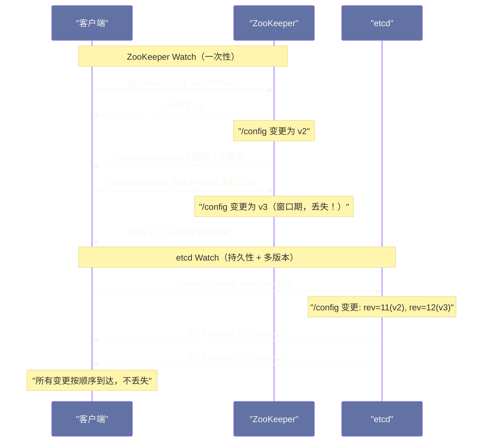

# 05 etcd vs ZooKeeper——设计哲学与选型对比

## 摘要

etcd 与 ZooKeeper 是分布式系统领域最具代表性的两款协调服务。两者都以强一致性为核心承诺，但在协议设计、数据模型、API 风格和适用场景上存在根本性差异。本文从第一性原理出发，分析两者各自解决了什么问题、为何如此设计，通过一致性语义、Watch 机制、性能特征、运维复杂度等多个维度的深度对比，揭示"何时选择 etcd、何时选择 ZooKeeper"的判断逻辑，并梳理当前云原生生态中去 ZooKeeper 化的现实动因。

---

## 第 1 章 两个时代的产物

### 1.1 ZooKeeper：大数据时代的基础设施

要理解 ZooKeeper，必须把时钟拨回到 2007 年。

那是 [[Hadoop]] 生态的草创期。[[Kafka]] 还没诞生，[[Dubbo]] 刚在阿里内部孵化，分布式系统的工程师们面临一个反复出现的困境：每个系统都需要实现自己的"协调"逻辑——分布式锁、Leader 选举、配置管理、服务注册。而这些逻辑天然涉及一致性问题，在多节点环境下极难正确实现。Yahoo! 的工程师们观察到这一共性需求后，设计了 ZooKeeper——一个专门提供协调原语的分布式服务。

ZooKeeper 的设计哲学是**"提供原语，而非解决方案"**。它不直接提供分布式锁的 API，而是暴露 ZNode 树、Watcher、临时节点等原语，让调用方自行组合出所需的协调语义。这种设计产生了一个重要的副作用：API 的表达能力极强，但理解和正确使用的门槛很高。用临时有序节点实现公平锁是 ZooKeeper 的经典用法，但这种用法并不直观——你需要理解节点的创建顺序和 Watcher 链，才能写出不产生"惊群效应"的正确实现。

在共识协议上，ZooKeeper 采用了 **ZAB**（ZooKeeper Atomic Broadcast）。ZAB 是 Paxos 的工程化变体，针对**主备复制**模型优化：Leader 接收所有写请求，以原子广播的方式同步到 Follower，Follower 可以服务读请求（但这带来了读取旧数据的风险）。ZAB 的强项在于高吞吐的顺序写，弱项在于 Leader 单点瓶颈和复杂的崩溃恢复逻辑。

在 2010 年代初，ZooKeeper 是分布式协调的事实标准。HDFS NameNode 的高可用、[[Kafka]] 的 Controller 选举、[[Dubbo]] 的服务注册发现，都构建在 ZooKeeper 之上。然而，ZooKeeper 的设计是为了那个时代的需求量身打造的——它没有预见到 API 网关、容器编排、云原生微服务的兴起。

### 1.2 etcd：云原生时代的配置中心

etcd 诞生于 2013 年，是 [[CoreOS]] 工程师为 [[Kubernetes]] 的前身——Fleet 集群管理工具——设计的配置存储。它的起点不是"如何提供协调原语"，而是"如何可靠地存储和同步集群配置"。

这一出发点的差异，塑造了 etcd 截然不同的设计取向：

- **KV 语义而非树语义**：etcd 的数据模型是平坦的 Key-Value，支持按前缀范围扫描，而不是 ZooKeeper 的 ZNode 树。KV 模型更直观，天然适合存储配置项（如 `/registry/pods/default/my-pod`）。
- **HTTP/gRPC API 而非自定义协议**：etcd v3 基于 gRPC，任何语言都能轻松调用，不需要专用的 ZooKeeper 客户端库（ZooKeeper 的客户端库在历史上以复杂和易出 bug 著称）。
- **Raft 共识而非 ZAB**：etcd 选择了 Diego Ongaro 在 2014 年发表的 Raft 算法。Raft 的设计目标就是**可理解性**（understandability）——相比 Paxos 和 ZAB，Raft 将共识问题分解为 Leader 选举、日志复制、安全性三个相对独立的子问题，更容易理解和正确实现。

当 Kubernetes 在 2014 年选择 etcd 作为唯一的状态存储时，etcd 的命运被彻底改变。[[Kubernetes]] 集群中的所有资源对象——Pod、Service、ConfigMap、Secret——都持久化在 etcd 中。这意味着 etcd 的可靠性直接决定了整个 Kubernetes 集群的可用性，etcd 因此经历了极其严苛的生产检验。

> [!note] 设计哲学对比
> ZooKeeper 的哲学是**"提供低级原语，构建高级语义"**——像一个积木套装，功能强大但需要装配。
> etcd 的哲学是**"提供直接可用的高级语义"**——像一个成品工具，上手即用但灵活性相对有限。

---

## 第 2 章 共识协议的本质差异：ZAB vs Raft

理解两者的共识协议是理解其行为差异的基础。

### 2.1 ZAB 协议的工作模式

ZAB 的全称是 ZooKeeper Atomic Broadcast，包含两个阶段：

**崩溃恢复（Leader Election + Data Sync）**：当集群启动或 Leader 宕机时，进入此阶段。所有节点参与 Fast Leader Election，选出 ZXID（事务 ID）最大的节点作为 Leader。Leader 当选后，还需要与所有 Follower 进行数据同步，确保所有节点的日志一致后，才能进入正常工作模式。这一阶段可能持续数百毫秒甚至数秒。

**消息广播（Atomic Broadcast）**：正常工作模式。所有写请求路由到 Leader，Leader 生成带有 ZXID 的 Proposal，广播给 Follower，收到多数 ACK 后提交并通知 Follower Commit。Follower 可以直接服务读请求，但读到的是本地副本，**可能是旧数据**（因为提交还未同步到该 Follower）。

ZAB 的关键特性：

- 写操作由 Leader 串行处理，保证全局事务顺序（ZXID 单调递增）
- 读操作可以在任意节点完成，**默认是最终一致性读**（ZooKeeper 的 `sync()` 操作可以强制同步，但性能代价高）
- Leader 切换期间整个集群**不可写**，也不提供一致性读

### 2.2 Raft 协议的工作模式

Raft 的正常工作流程在 [[02 Raft 共识协议——Leader 选举、日志复制与安全性]] 中已有详述，这里重点关注与 ZAB 的差异点。

Raft 将"强一致性读"作为一等公民。etcd 支持三种读模式：

**linearizable（线性一致性读）**：每次读都需要通过 Leader 确认当前仍然是 Leader（ReadIndex 机制），确保读到的是当前已提交的最新值。这是 etcd 的**默认读模式**。

**serializable（顺序一致性读）**：直接读取本地 MVCC 快照，不需要网络交互，可能读到轻微过期的数据，但性能更高。

**Watch**：基于 MVCC 的版本号监听，能保证从指定版本起的所有变更都被推送，不漏事件。

```
ZooKeeper 的一致性模型：
  写 → Leader（强一致）
  读 → 任意节点（默认最终一致，可通过 sync() 强制线性一致）

etcd 的一致性模型：
  写 → Leader（强一致）
  读 → 默认线性一致（通过 ReadIndex 机制）
```

### 2.3 为什么 Raft 的线性一致性读更安全

考虑一个真实场景：Kubernetes 的 kube-scheduler 在调度 Pod 时，需要读取当前集群的节点资源状态。如果读到旧数据（某节点已被标记为不可调度，但读到的是旧状态），调度器可能将 Pod 调度到不可用节点上。

这类场景要求**读到最新已提交的数据**，即线性一致性读。

在 ZooKeeper 中，如果 Follower 的数据同步落后于 Leader，直接从 Follower 读取就会读到旧数据。需要显式调用 `sync()` 同步后再读，但这会引入额外的网络往返。

etcd 的 Raft ReadIndex 机制优雅地解决了这个问题：

1. Leader 在处理读请求前，将当前 Commit Index 记录为 ReadIndex
2. Leader 向集群发送心跳，确认自己仍是有效 Leader（防止 Leader 在网络分区中成为孤立节点）
3. 等待 Apply Index ≥ ReadIndex 后，返回本地存储的数据

这个过程**不需要写日志**，只需要一次心跳交互，比 ZooKeeper 的 `sync()` 代价更低，且默认就是线性一致性。

> [!info] 核心概念：线性一致性（Linearizability）
> 线性一致性是一致性模型中强度最高的之一：对于每一个操作，存在一个全局时间点，使得该操作在这个时间点原子地完成，后续所有操作都能看到这次操作的结果。
> 它直觉上等价于"这个分布式系统的行为就像一台单机"——无论你从哪个节点读，读到的都是最新写入的值。

---

## 第 3 章 数据模型的根本差异

### 3.1 ZooKeeper 的树形 ZNode 模型

ZooKeeper 用树形结构组织数据，每个 ZNode 同时承担"目录"和"数据节点"的双重角色：

```
/
├── /dubbo
│   ├── /dubbo/com.example.UserService
│   │   ├── /dubbo/com.example.UserService/providers
│   │   │   └── /dubbo/com.example.UserService/providers/dubbo%3A%2F%2F...
│   │   └── /dubbo/com.example.UserService/consumers
│   └── ...
└── /kafka
    └── /kafka/brokers
        └── /kafka/brokers/ids
            ├── /kafka/brokers/ids/0
            └── /kafka/brokers/ids/1
```

树形模型的优点：
- **层次化组织**，适合表达父子关系（服务→提供者→实例）
- **子节点列表**是原生操作，`getChildren()` 天然支持枚举某服务的所有提供者
- **临时节点**（Ephemeral Node）与 Session 绑定，客户端断开后自动删除，非常适合服务注册（服务下线时注册信息自动清除）

树形模型的缺点：
- **数据与命名空间耦合**：ZNode 既是容器又是数据载体，概念上不干净
- **单个 ZNode 数据大小限制为 1MB**，不适合存储大对象
- **操作不支持跨 ZNode 的原子事务**（虽有 multi 批量操作，但语义受限）

### 3.2 etcd 的平坦 KV 模型

etcd 的数据模型是简单的 Key-Value，Key 是任意字节串，Value 也是任意字节串。etcd 通过**前缀扫描**（Range）模拟层次结构：

```
/registry/pods/default/my-pod-1  → {pod spec JSON}
/registry/pods/default/my-pod-2  → {pod spec JSON}
/registry/services/default/my-svc → {service spec JSON}
/registry/configmaps/kube-system/kube-proxy → {configmap JSON}
```

要列出 `default` 命名空间下的所有 Pod，只需：

```
etcdctl get /registry/pods/default/ --prefix
```

KV 模型的优点：
- **天然支持范围查询**，前缀扫描是 O(log N + M) 的高效操作
- **MVCC 多版本**：每次写入都生成新版本（revision），历史版本可查询，支持"时间旅行"式的 Watch
- **事务原语（STM）**：支持 CAS（Compare-and-Swap）式的条件事务，`txn if ... then ... else ...` 是实现分布式锁的原子操作
- **Value 大小无 1MB 限制**（实际上受 `--max-request-bytes` 控制，默认 1.5MB，可配置）

KV 模型的缺点：
- **没有原生的树形父子关系**：需要调用方约定命名规范来模拟层次
- **没有临时 Key**（etcd 通过 [[04 Watch 与 Lease 机制|Lease]] 的 TTL 机制实现类似效果，但需要显式续约）
- **无子目录变更通知**：ZooKeeper 的 `getChildren()` + Watcher 能直接监听子节点变化，etcd 需要通过前缀 Watch 来实现

### 3.3 临时节点 vs Lease：服务注册的不同实现

服务注册是两者最典型的对比场景。

**ZooKeeper 的方式**：服务启动时在 `/services/my-service/providers/` 下创建临时节点，节点值包含地址和元数据。当服务进程崩溃或网络断开，ZooKeeper Session 超时（通常 30s），临时节点自动删除，消费者通过 Watcher 感知到节点消失。

```java
// ZooKeeper 服务注册（伪代码）
zkClient.create("/services/my-service/providers/" + instanceId,
                instanceMeta.getBytes(), 
                ZooDefs.Ids.OPEN_ACL_UNSAFE, 
                CreateMode.EPHEMERAL);  // 临时节点，Session 断开自动删除
```

这种方式的问题：ZooKeeper Session 维护是客户端库的职责，如果 JVM GC Pause 时间超过 Session 超时时间，节点会被错误删除，导致"假下线"。

**etcd 的方式**：服务启动时创建 Lease（TTL = 10s），然后将实例信息写入 Key 并与 Lease 绑定。服务持续调用 `KeepAlive` 接口续约 Lease，如果续约停止，TTL 到期后 Key 自动被删除。

```go
// etcd 服务注册（伪代码）
lease, _ := client.Grant(ctx, 10) // 申请 TTL=10s 的 Lease
client.Put(ctx, "/services/my-service/"+instanceId, 
           instanceMeta, clientv3.WithLease(lease.ID))
// 后台协程持续续约
keepAliveCh, _ := client.KeepAlive(ctx, lease.ID)
```

etcd Lease 的优势：TTL 精度更高（秒级），续约通过 gRPC 流式接口实现，开销极小；Lease 与多个 Key 关联，服务下线时一次 Lease 过期即可清理所有相关注册信息。

> [!warning] 生产避坑：ZooKeeper 的 Session 超时陷阱
> ZooKeeper Session 超时（`sessionTimeout`）在生产中是一个敏感参数。设置太小（< 10s），GC Pause 就可能触发误下线；设置太大（> 60s），服务真正宕机后的感知延迟也随之增加。这是一个无法完美规避的权衡。
> etcd 的 Lease TTL 更短、续约更频繁，通常将误判窗口控制在 5-10s 内，实践中表现更优。

---

## 第 4 章 Watch 机制：事件推送的语义差异

Watch 机制是分布式协调的核心能力——当数据变更时，及时通知关心这份数据的客户端。两者的 Watch 语义差异极大。

### 4.1 ZooKeeper Watch 的一次性语义

ZooKeeper 的 Watch 是**一次性触发**的：

```java
// 注册一个 Watch
zkClient.getData("/config/my-app", watcher, null);

// Watcher 实现
public void process(WatchedEvent event) {
    // 收到通知后，Watch 已失效，需要重新注册
    byte[] newData = zkClient.getData("/config/my-app", this, null); // 重新注册
}
```

这种设计意味着：**每次收到通知后，必须重新注册 Watch**。在重新注册的窗口期内，如果 ZNode 再次变更，这次变更将被**静默丢失**。

ZooKeeper 的文档对此有明确说明，但在实际工程中，这个问题常被忽视，导致配置变更丢失、服务列表不同步等诡异 Bug。

除了一次性触发，ZooKeeper Watch 还有另一个限制：**Watcher 只通知变更发生，不携带新的数据值**。收到通知后，客户端必须再发起一次 `getData` 请求获取新值，这意味着两次操作之间又可能发生新的变更。

### 4.2 etcd Watch 的持久性 + 多版本语义

etcd 的 Watch 是**持久性的**，并且基于 **MVCC 版本号（revision）** 工作：

```go
// etcd Watch（永久监听，带版本号）
watchChan := client.Watch(ctx, "/config/", clientv3.WithPrefix())
for resp := range watchChan {
    for _, event := range resp.Events {
        // event.Type: PUT / DELETE
        // event.Kv.Key, event.Kv.Value: 变更的 Key 和新值
        // event.Kv.ModRevision: 发生变更的版本号
        fmt.Printf("变更: %s = %s (revision: %d)\n", 
                   event.Kv.Key, event.Kv.Value, event.Kv.ModRevision)
    }
}
```

etcd Watch 的核心优势：

1. **不丢事件**：每次变更都有唯一的 revision。Watch 从指定 revision 开始（`WithRev(startRevision)`），即使网络断开重连，也能从断点续传，不会遗漏中间的变更。
2. **变更值随事件携带**：不需要额外的 `Get` 请求，Watch 事件本身包含变更后的 Key-Value。
3. **前缀 Watch**：`WithPrefix()` 监听某个前缀下所有 Key 的变更，单个 Watch 连接覆盖整个命名空间。
4. **Watch 历史**：在 Compaction 清理之前，可以 Watch 任意历史版本之后的变更，支持"追赶事件流"的使用模式。



### 4.3 Watch 可靠性在 Kubernetes 中的体现

Kubernetes 的控制平面完全依赖 etcd Watch 驱动。kube-controller-manager 中的 ReplicaSet Controller 监听 Pod 的变更，一旦某个 Pod 被删除（变更事件推送），Controller 立即创建新的 Pod 以维持期望副本数。这个机制要求 Watch 事件**一条都不能丢**。

如果使用 ZooKeeper 的一次性 Watch 实现同样的功能，需要在每次收到通知后、重新注册 Watch 期间，额外进行一次全量 `getChildren` 来弥补可能丢失的变更——这既增加了代码复杂度，也增加了 ZooKeeper 的负载。

> [!info] etcd Watch 的底层实现
> etcd Watch 的可靠性来自 MVCC 存储引擎。BoltDB 中的每次写入都分配一个全局递增的 revision，Watch Store 维护了 revision → Events 的索引。客户端断线重连时携带最后收到的 revision，服务端从该 revision 的下一条开始回放历史事件，再切换到实时推送模式。这种"历史回放 + 实时推送"的模式与 Kafka 的消费者 offset 机制有异曲同工之妙。

---

## 第 5 章 性能特征对比

### 5.1 读写性能的本质差异

两者的性能差异根源在于一致性模型的选择。

**ZooKeeper 的性能模型**：
- **写性能**：由 Leader 单点串行处理，受 Leader 的磁盘 IO 和 CPU 限制，典型写吞吐在 **10,000~50,000 ops/s**（小对象，SSD 磁盘）
- **读性能**：可在任意节点（包括 Follower 和 Observer）完成，水平扩展，典型读吞吐可达 **100,000+ ops/s**
- **读一致性代价**：默认读是可能过期的，若需要强一致性读，需要调用 `sync()` + `getData()`，代价接近一次写操作

**etcd 的性能模型**：
- **写性能**：类似 ZooKeeper，Leader 单点，典型写吞吐在 **10,000~30,000 ops/s**（官方基准），受磁盘 fsync 延迟影响大
- **读性能**（linearizable）：每次读需要 Leader 确认 ReadIndex，涉及一次心跳广播，吞吐略低于 ZooKeeper 的 Follower 读，但保证线性一致性
- **读性能**（serializable）：直接读本地 MVCC，吞吐极高，但可能读到轻微过期数据

```
场景对比（典型生产环境，SSD，3节点）：

| 指标             | ZooKeeper | etcd     |
|------------------|-----------|----------|
| 写 QPS           | ~30k      | ~10-20k  |
| 一致性读 QPS     | ~5k*      | ~10-15k  |
| 最终一致读 QPS   | ~100k+    | ~50k+**  |
| P99 写延迟       | ~5ms      | ~10ms    |
| Leader 切换时间  | 2-5s      | 1-2s     |

* ZooKeeper 一致性读需要 sync()，代价高
** etcd serializable 读
```

### 5.2 数据规模与存储限制

这是两者最重要的实际限制差异。

**ZooKeeper**：
- 推荐存储数据量：**< 100MB**（整个 Data Tree 加载在内存中）
- 单个 ZNode 数据大小：**< 1MB**（建议 < 100KB）
- ZooKeeper 设计理念是"协调元数据"，不是"通用存储"
- 数据量大时，Leader 同步新 Follower 的快照传输时间长，影响可用性

**etcd**：
- 默认存储限制：**2GB**（`--quota-backend-bytes`，可调至 8GB）
- 单个 Value 大小：**< 1.5MB**（`--max-request-bytes`，可调）
- 超出 2GB 限制后，etcd 进入只读模式，需要手动 Compaction + Defragmentation
- Kubernetes 大集群（1000+ 节点）中，etcd 存储可能达到 GB 级别，需要关注配额

> [!warning] 生产避坑：etcd 的存储配额报警
> 在 Kubernetes 生产集群中，`etcd_mvcc_db_total_size_in_bytes` 是必须监控的指标。当接近 2GB 限制时，etcd 会触发 `mvcc: database space exceeded` 错误，此时 Kubernetes 所有写操作失败（无法创建/更新 Pod），集群陷入不可用状态。
> 应当在达到 75% 时触发告警，并定期执行 `etcdctl compact + defrag` 清理历史版本。

### 5.3 集群规模的适用范围

两者对集群节点数量的推荐也有差异：

**ZooKeeper**：推荐 3 或 5 节点（奇数），最多通常不超过 7 个投票节点。可以额外添加 **Observer** 节点（不参与投票，只同步数据）来扩展读能力，这是 ZooKeeper 水平扩展读的主要手段。

**etcd**：同样推荐 3 或 5 节点。etcd 不支持 Observer 角色，所有读流量都通过 Leader 的 ReadIndex 确认（或直接 serializable 读本地），扩展读能力的手段较少。

---

## 第 6 章 运维复杂度对比

### 6.1 客户端库的历史包袱

在工程实践中，ZooKeeper 的客户端库是一个重大的痛点。

ZooKeeper 的官方 Java 客户端是低层次的，直接使用会面临大量细节：Session 管理、Watcher 重注册、临时节点的重创建、连接断开后的状态恢复……这些逻辑如果处理不当，很容易导致诡异的生产 Bug（服务列表静止不动、分布式锁不释放等）。

因此，生产中通常使用 Apache **Curator**——一个更高层次的 ZooKeeper 客户端库，提供了 Leader Election、Distributed Lock、Service Discovery 等开箱即用的实现。但 Curator 本身也有学习成本，且只有 Java 版本；其他语言的 ZooKeeper 客户端质量参差不齐。

etcd 的 gRPC API 天然对多语言友好。官方提供 Go、Java、Python 等语言的客户端，社区也有质量较高的 C++、Rust 客户端。由于 API 语义简洁（Put/Get/Delete/Txn/Watch/Lease），上层应用不需要复杂的状态管理逻辑。

### 6.2 集群部署与扩容

**ZooKeeper 的部署**：
- 配置文件（`zoo.cfg`）需要列出所有节点的地址（`server.1=host1:2888:3888`），修改集群成员需要修改配置文件并滚动重启
- 添加/删除节点需要操作 `reconfig` 命令（ZooKeeper 3.5+ 支持动态配置），历史上动态扩容非常繁琐
- 快照和事务日志的管理需要人工清理（或配置 `autopurge`），日志膨胀是常见的运维问题

**etcd 的部署**：
- 集群成员管理通过 `etcdctl member add/remove` 动态完成，无需重启其他节点
- `snapshot save` 备份命令简洁，`snapshot restore` 恢复流程文档化良好
- 推荐使用专用 SSD（要求 IOPS ≥ 500），对磁盘延迟极为敏感（WAL 的 fsync 是写延迟的主要来源）

### 6.3 可观测性

ZooKeeper 的监控主要依赖 **Four Letter Words**（`mntr`、`stat`、`ruok` 等命令）输出文本，格式解析不便，与 Prometheus 生态集成需要额外的 exporter。

etcd 原生暴露 **Prometheus 格式的 metrics**（`/metrics` 端口），集成简单直接。官方提供了 Grafana Dashboard，关键指标（commit duration、WAL fsync duration、DB size）一目了然。

---

## 第 7 章 去 ZooKeeper 化的现实动因

### 7.1 Kafka 的去 ZooKeeper 历程

[[Kafka]] 是 ZooKeeper 最知名的重度用户之一。Kafka 依赖 ZooKeeper 实现 Controller 选举、Topic 元数据存储、Consumer Offset 存储（早期版本）。随着 Kafka 集群规模增大，ZooKeeper 的瓶颈逐渐显现：

- **元数据操作的性能瓶颈**：Kafka Controller 在 ZooKeeper 上频繁读写 Topic/Partition 元数据，ZooKeeper 的写吞吐（~50k ops/s）限制了 Kafka 能支撑的分区数上限
- **运维复杂度**：维护两套集群（Kafka + ZooKeeper），出问题时排查链路更长
- **Partition 迁移的性能问题**：大规模 Partition 重新分配时，ZooKeeper 的写入成为瓶颈

Kafka 2.8+ 引入 **KRaft 模式**，用内置的 Raft 共识协议（运行在 Kafka 自身的 `@metadata` Topic 上）替代 ZooKeeper，在 [[06 Controller 与集群管理——从 ZooKeeper 到 KRaft]] 中有详细分析。Kafka 3.3+ KRaft 模式已进入 Production Ready。

### 7.2 Dubbo 的注册中心演进

早期 [[Dubbo]] 几乎绑定 ZooKeeper 作为注册中心，但这带来了一些问题：

- ZooKeeper 的 CP 特性意味着网络分区时，注册中心不可用，所有服务发现失败（服务调用可能失败，即使服务本身是健康的）
- 大型微服务体系中，ZooKeeper 的节点数量（一个接口对应多个 ZNode）随接口数呈线性增长，容易撑爆 ZooKeeper 的内存限制

Dubbo 3.x 在注册中心上拥抱了 **Nacos**（AP 模型，基于 Gossip 协议，容忍分区时继续服务）和 etcd（CP 模型但 API 更现代），并推出**应用级服务发现**——以应用为维度注册（而非接口维度），大幅减少元数据量，降低注册中心压力。

### 7.3 云原生生态的选择

在云原生生态中，etcd 几乎已经取代 ZooKeeper 成为协调服务的首选：

| 系统/框架 | 历史注册中心 | 现状 |
| :--- | :--- | :--- |
| **Kubernetes** | 无（etcd 从一开始） | etcd（唯一选择） |
| **Kafka** | ZooKeeper | KRaft（2.8+ 可用，3.3+ 生产就绪） |
| **Dubbo** | ZooKeeper | Nacos/etcd/ZooKeeper（多选） |
| **Flink** | ZooKeeper | ZooKeeper/etcd/Kubernetes（多选） |
| **Hadoop HA** | ZooKeeper | 仍以 ZooKeeper 为主 |
| **HBase** | ZooKeeper | 仍以 ZooKeeper 为主（深度依赖） |

ZooKeeper 在传统大数据生态（Hadoop、HBase、旧版 Kafka）中的地位短期内不会改变，但在云原生、微服务领域，etcd 和 Nacos 已经占据主导。

> [!note] 设计哲学
> 去 ZooKeeper 化的本质，不是说 ZooKeeper 不好，而是现代系统的需求发生了变化：
> - 云原生系统需要更轻量的运维（etcd 是 Go 单二进制，ZooKeeper 是 Java 多进程）
> - 微服务需要 AP（可用性优先）的注册中心，而不是 CP 的协调服务（Nacos、Consul）
> - 大规模分布式系统倾向于内置共识（Kafka KRaft），而不是外部依赖
> ZooKeeper 仍然是它所擅长的领域（强一致性协调、Hadoop 生态）的最佳选择，只是它的使用边界在收缩。

---

## 第 8 章 选型决策框架

### 8.1 什么时候选 etcd

以下场景应当优先选择 etcd：

1. **Kubernetes 生态**：毫无疑问，etcd 是唯一选择
2. **需要线性一致性读的配置中心**：如 Feature Flag 服务、动态配置下发
3. **需要可靠 Watch 的事件驱动系统**：Watch 不丢事件是核心需求
4. **多语言微服务**：gRPC API 跨语言支持优秀，无需语言特定的客户端库
5. **云原生环境**：etcd 作为 Go 二进制易于容器化部署，与 Kubernetes Operator 集成友好
6. **分布式锁（轻量场景）**：Lease + Txn 的 CAS 语义完全够用

### 8.2 什么时候选 ZooKeeper

以下场景 ZooKeeper 仍然具有优势：

1. **已有 Hadoop/HBase 生态**：这些系统对 ZooKeeper 有深度依赖，替换成本极高
2. **需要超高读吞吐的最终一致性读**：Observer 节点可以无限水平扩展读能力
3. **需要树形数据模型的自然语义**：如 HDFS 的目录授权管理
4. **旧版 Kafka（< 2.8）**：KRaft 尚未稳定时，ZooKeeper 是稳定选项
5. **需要 `getChildren()` + Watcher 的组合语义**：精确监听某个"目录"下子节点的变化

### 8.3 不要用两者做什么

| 场景 | 为什么不适合 |
| :--- | :--- |
| **大量数据存储** | 两者都是协调元数据存储，不是通用 KV 数据库（用 Redis/TiKV/etcd 不超过 8GB） |
| **高频写入的业务数据** | 两者写吞吐均有限（< 50k ops/s），高频业务写应走专用存储 |
| **跨地域强一致**（WAN Raft/ZAB） | 跨地域 RTT 会使 Raft/ZAB 延迟极高，不适合 |
| **大 Value 存储** | 两者均不适合存储 MB 级别的大对象，应用 Value 应存对象存储，只存引用地址 |

---

## 第 9 章 小结

etcd 和 ZooKeeper 的对比，本质上是两代分布式协调思想的碰撞：

- **ZooKeeper** 以树形原语和 ZAB 协议为核心，用"低级原语 + 高级组合"的方式提供协调能力，在大数据生态中久经考验，但 API 复杂性和客户端库的历史包袱是其硬伤。
- **etcd** 以 KV 语义和 Raft 协议为核心，默认线性一致性读、持久性 Watch、gRPC API 是其核心竞争力，云原生生态的绑定使其在 Kubernetes 时代获得了广泛验证。

选型的决策树可以简化为：**新系统在云原生/多语言环境 → etcd；已有 Hadoop/HBase 生态 → 保留 ZooKeeper；需要 AP 注册中心 → Nacos/Consul。**

两者都是优秀的分布式协调服务，选择的关键不是"谁更好"，而是"哪个和你的技术栈、一致性需求、运维能力更匹配"。

---

**延伸阅读**：
- [[01 etcd 全局架构——Raft 共识与 MVCC 存储]]
- [[02 Raft 共识协议——Leader 选举、日志复制与安全性]]
- [[04 Watch 与 Lease 机制]]
- [[01 ZooKeeper 全局架构——数据模型与会话机制]]
- [[06 ZooKeeper vs ETCD——架构对比与去 ZooKeeper 化趋势]]

---

> [!note] 思考题
> 1. etcd 的写入延迟主要由两部分组成：Raft 日志持久化（WAL fsync）和 BoltDB 提交（BoltDB fsync）。在 HDD 上 fsync 延迟约 10ms，SSD 约 0.1ms。etcd 官方强烈建议使用 SSD——在 HDD 上运行的 etcd 性能会差多少？`ETCD_DISK_METRICS` 如何帮助诊断磁盘延迟？
> 2. etcd 的推荐数据量上限是 8GB（默认 quota 2GB）。超过 quota 后 etcd 进入只读模式——只能读取和删除，不能写入。在 Kubernetes 中，什么操作会快速增大 etcd 数据量（如频繁的 ConfigMap 更新、大量 Event 对象）？你如何监控 etcd 的数据量并设置告警？
> 3. etcd 集群的节点数量增加能提高读吞吐（更多节点可以处理读请求），但写性能反而下降（需要更多节点确认）。5 节点集群比 3 节点集群容忍更多故障（2 vs 1），但写延迟更高。在什么场景下你会部署 5 节点而非 3 节点 etcd 集群？7 节点是否有实际意义？
