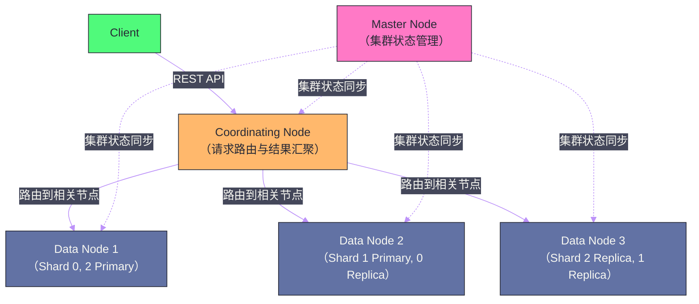

# ES 全局架构——集群、节点、索引与分片

## 摘要

Elasticsearch（ES）是构建在 [[Lucene]] 之上的分布式搜索与分析引擎，它解决了 Lucene 的核心局限——Lucene 是单机库，无法横向扩展，而 ES 通过分片（Shard）机制将索引数据分散到多个节点，通过副本（Replica）机制提供高可用，通过 REST API 封装 Lucene 的复杂性提供开箱即用的全文搜索能力。本文从 ES 解决的问题出发，系统梳理集群的节点角色分工（Master/Data/Coordinating/Ingest）、Index 与 Shard 的逻辑与物理映射关系、文档写入和查询请求的路由机制，以及"近实时搜索（Near Real-Time，NRT）"这个 ES 核心特性的本质来源。理解这些基础是深入研究 ES 倒排索引、查询优化和集群调优的前提。

---

## 第 1 章 Elasticsearch 解决的核心问题

### 1.1 从 Lucene 到 Elasticsearch

**[[Lucene]]** 是 Apache 基金会的全文搜索库，诞生于 1999 年，是搜索领域的奠基性技术。Lucene 提供了倒排索引（Inverted Index）的完整实现，支持复杂的布尔查询、模糊匹配、相关性评分——这些是现代搜索引擎的核心能力。

但 Lucene 本质上是一个 **Java 库**，有几个关键局限：

**局限一：单机，不能水平扩展**。Lucene 的索引文件存储在单台机器的磁盘上，无法自动分布到多台机器。当数据量超过单机磁盘容量（如数十 TB 的日志数据），或查询 QPS 超过单机处理能力，Lucene 原生无法应对。

**局限二：没有高可用保障**。单机存储意味着单点故障——磁盘损坏或机器宕机，索引数据就会丢失，搜索服务中断。

**局限三：API 复杂，使用门槛高**。Lucene 的 API 是底层 Java API，需要手动管理 IndexWriter、IndexSearcher、Directory 等概念，对应用开发者不友好。

**Elasticsearch（2010年）** 在 Lucene 之上提供了三层封装：
1. **分布式层**：通过 Shard 机制将 Lucene 索引分散到集群多节点，突破单机限制；
2. **高可用层**：通过 Replica 机制提供副本冗余，节点宕机自动切换；
3. **HTTP/REST API**：以 JSON over HTTP 的方式暴露所有功能，任何语言都能轻松集成。

### 1.2 ES 的核心应用场景

**全文搜索**：电商商品搜索、代码搜索、文档检索。ES 的倒排索引天然支持高效全文检索。

**日志分析（ELK Stack）**：Elasticsearch + [[Logstash]] + [[Kibana]] 构成的日志分析平台。日志流式写入 ES，Kibana 提供可视化分析——这是 ES 最广泛的生产用途之一。

**APM 与可观测性**：应用性能监控、分布式链路追踪数据的存储与分析。

**向量搜索（ES 8.x+）**：随着 LLM 的兴起，ES 8.x 引入了 kNN 向量检索能力，支持语义搜索（Dense Vector + HNSW 索引）。

---

## 第 2 章 集群架构与节点角色

### 2.1 节点角色的分工

ES 集群由多个**节点（Node）**组成，每个节点是一个运行 Elasticsearch 进程的服务器。节点有多种**角色（Role）**，不同角色承担不同职责：

**Master 节点（`master` 角色）**：负责集群级别的管理工作——创建/删除 Index、追踪集群节点的加入/离开、决定 Shard 分配到哪个节点。Master 节点维护**集群状态（Cluster State）**——一份包含所有节点信息、所有 Index 的 Mapping/Settings、所有 Shard 分配信息的全局元数据。

集群中同时只有一个 **Active Master**。其他有 `master` 角色的节点是 **Master-Eligible 节点**（候选节点），在 Active Master 宕机时参与选举产生新 Master。Master 选举使用 ES 自研的共识协议（ES 7.x 之前是类 Bully 算法，7.x 之后改为基于 Raft 的 [[ETCD|Raft-like]] 协议）。

**Data 节点（`data` 角色）**：存储实际的 Shard 数据（Lucene 索引文件），执行索引（写入）和搜索（查询）操作。数据节点是资源消耗的主体——需要大量磁盘（存储数据）、内存（JVM Heap + [[Page Cache]] for Lucene）和 CPU（查询计算）。

**Coordinating 节点（纯 Coordinating，无特殊角色）**：负责接收客户端请求、将请求路由到相关 Data 节点、汇聚各节点的查询结果返回给客户端。Coordinating 节点是客户端的统一入口，承担"散发-收集（Scatter-Gather）"的协调职责。

在小规模集群中，所有节点通常同时具备 master + data + coordinating 三种角色（混部）。在大规模生产集群中，三种角色通常分离部署，互不干扰。

**Ingest 节点（`ingest` 角色）**：在文档写入 Data 节点之前，对文档进行预处理（Pipeline 处理）——字段提取、格式转换、IP 地理位置解析等。类似轻量级的 ETL。对于复杂的数据预处理，通常使用 Logstash 代替 Ingest 节点。



### 2.2 Master 节点的脑裂防护

**脑裂（Split Brain）** 是分布式系统中经典的一致性问题：如果集群因网络分区分裂成两个子集群，且两个子集群都认为自己是完整集群，就会分别选出各自的 Master，导致两个 Master 同时管理集群，元数据出现分叉，数据不一致。

ES 的防护机制：**法定人数（Quorum）**，即 `discovery.zen.minimum_master_nodes = N/2 + 1`（N 为 master-eligible 节点总数）。只有获得法定人数选票的候选节点才能成为 Master。这样在网络分区时，只有拥有多数节点的子集群能选出 Master，少数节点的子集群无法形成 Master，从而避免脑裂。

ES 7.x 之后，`minimum_master_nodes` 配置被废弃，改为由 ES 自动计算法定人数，大大降低了配置错误的风险。

---

## 第 3 章 Index、Shard 与 Replica：逻辑到物理的映射

### 3.1 Index 与 Shard 的关系

**Index（索引）** 是 ES 中的逻辑数据集合，类似关系数据库中的"表"。Index 由一组 **Shard（分片）** 组成：

```
Index: logs-2024-01 (5 个 Primary Shard + 1 Replica)

Primary Shard 0 → 存储在 Data Node 1
Primary Shard 1 → 存储在 Data Node 2
Primary Shard 2 → 存储在 Data Node 3
Primary Shard 3 → 存储在 Data Node 1
Primary Shard 4 → 存储在 Data Node 2

Replica Shard 0 → 存储在 Data Node 3（不与 Primary 0 同节点）
Replica Shard 1 → 存储在 Data Node 1
...
```

每个 **Shard 本质上是一个完整的 Lucene 索引**——它包含独立的倒排索引文件、文档存储、段文件（Segment files）。ES 的分布式能力就是通过将 Lucene 索引拆分成多个 Shard，分布到多个节点来实现的。

**Shard 数量的重要性**：Index 的 Primary Shard 数量在创建时确定，**之后不能修改**（改变 Primary Shard 数量会破坏文档路由的哈希一致性，导致文档找不到）。只能通过 `reindex` 将数据迁移到新 Index 来"修改"分片数。因此，创建 Index 时需要合理规划 Shard 数量。

**Replica（副本）**：每个 Primary Shard 可以有 0 到多个 Replica Shard。Replica 存储 Primary 的完整副本，有两个作用：
1. **高可用**：Primary 节点宕机时，Replica 被提升为新 Primary，读写恢复；
2. **读扩展**：查询请求可以在 Primary 和 Replica 之间负载均衡，提升读吞吐量。

与 Kafka 不同，ES 允许从 Replica 读——这是因为 ES 的写入模型保证了 Primary 成功写入后，Replica 总是有最新数据（Primary 等待所有 in-sync Replica 确认后才返回写入成功）。

### 3.2 文档路由：如何确定文档属于哪个 Shard

ES 写入文档时，通过路由算法确定文档应该存入哪个 Primary Shard：

```
shard_num = hash(routing) % number_of_primary_shards
```

其中 `routing` 默认是文档的 `_id`，可以自定义（`?routing=user_id`）。这个公式解释了为什么 Primary Shard 数量不能改变——如果改变了 `number_of_primary_shards`，同一个 `_id` 的路由结果会变，找不到之前写入的文档。

**自定义路由的应用场景**：将同一用户的所有文档路由到同一个 Shard，使得查询某用户数据时只需访问一个 Shard（而不是所有 Shard），大幅提升查询效率。代价是可能导致数据分布不均（如果某些用户数据量远多于其他用户）。

---

## 第 4 章 文档写入链路

### 4.1 写入的完整流程

客户端向 ES 写入文档时，请求首先到达任意一个节点（这个节点自动扮演 Coordinating 节点的角色）。

**步骤一：路由计算**。Coordinating 节点根据 `hash(_id) % shards` 计算出目标 Primary Shard，再查询集群状态（Cluster State）找到该 Primary Shard 所在的 Data 节点。

**步骤二：转发到 Primary Shard**。Coordinating 节点将写入请求转发给 Primary Shard 所在的 Data 节点。

**步骤三：Primary 写入**。Primary Shard 接收文档，验证请求合法性，写入 Lucene（内存中的 Buffer，不一定立刻刷到磁盘），同时将操作写入 **Translog**（类似数据库的 WAL，持久化保证）。

**步骤四：并行复制到 Replica**。Primary 将写入请求并行发送给所有 in-sync Replica Shard，等待所有 Replica 确认写入成功。

**步骤五：返回客户端**。所有 in-sync Replica 写入成功后，Primary 向 Coordinating 节点返回成功，Coordinating 节点再向客户端返回响应。

### 4.2 近实时搜索（Near Real-Time）的来源

在 ES 中，文档写入后**不是立即可搜索的**——默认有约 1 秒的延迟（`refresh_interval=1s`）。这个 1 秒的延迟就是"近实时"的含义——ES 不是严格意义上的实时搜索，而是近实时。

**为什么有 1 秒延迟**？这需要理解 Lucene 的 Segment 机制：

Lucene 的索引由多个**Segment（段）** 组成，每个 Segment 是一个不可变的完整倒排索引文件。新写入的文档首先进入内存中的写入缓冲区（In-memory Buffer），当触发 **Refresh** 操作时，缓冲区中的文档被转换成新的 Segment 文件写入文件系统缓存（OS 的 [[Page Cache]]，不一定刷到磁盘），只有此时这批文档才变为**可搜索的**。

ES 的 `refresh_interval=1s` 配置控制这个定期 Refresh 的间隔——每 1 秒触发一次，将缓冲区转为新 Segment，这些文档才能被搜索到。

> [!info] 核心概念：Refresh vs Flush
> - **Refresh**：将内存 Buffer 转为 Segment，写入 OS Page Cache，文档变为可搜索状态。不保证持久化（OS 崩溃可能丢失）；
> - **Flush**：将 OS Page Cache 中的 Segment 强制刷写到磁盘，同时清空 Translog（此时 Translog 中的操作已持久化到 Segment）。Flush 保证持久化但 IO 代价较高，ES 自动触发（Translog 达到大小限制或定时触发）。
> 
> 文档写入的可靠性由 Translog 保证，而不是 Segment——即使 Refresh 后的 Segment 只在 Page Cache 中，只要 Translog 还在磁盘上，ES 重启后可以通过重放 Translog 恢复数据。

---

## 第 5 章 查询链路：Scatter-Gather 模型

### 5.1 两阶段查询

ES 的查询采用经典的 **Scatter-Gather（散发-收集）** 模型，分两个阶段：

**Query Phase（查询阶段）**：

Coordinating 节点将查询请求广播到所有 Primary Shard（或其 Replica）。每个 Shard 在本地执行查询，返回匹配文档的 `_id` 列表和相关性分数（但不返回完整文档内容），以及 Shard 本地的 Top-K 结果（根据 `from + size` 参数）。

Coordinating 节点汇聚所有 Shard 返回的 Top-K 结果，进行全局排序，确定最终需要哪些文档的完整内容。

**Fetch Phase（获取阶段）**：

Coordinating 节点向相关 Shard 发送第二轮请求，获取最终结果文档的完整内容（`_source` 字段），返回给客户端。

两阶段设计的原因：**全量返回文档内容代价高**——Query Phase 先确定哪些文档进入最终结果集（只需 ID + 分数，数据量小），再 Fetch Phase 精确获取这些文档的完整内容，避免传输不必要的数据。

### 5.2 深分页的性能陷阱

ES 的深分页（`from=10000, size=10`）是一个经典的性能陷阱：

每个 Shard 需要返回前 `from + size = 10010` 条结果给 Coordinating 节点，Coordinating 节点从所有 Shard 汇聚后（假设 5 个 Shard = 50050 条），全局排序取前 10010 条，再丢弃前 10000 条，返回第 10001-10010 条。

随着 `from` 增大，每个 Shard 需要返回的结果数量线性增长，Coordinating 节点的内存消耗和排序开销也线性增长。`from > 10000` 时 ES 默认会报错（`index.max_result_window` 默认 10000）。

**深分页的替代方案**：
- **`search_after`**：基于上一页最后一条文档的排序值进行分页，不需要从头计算，性能稳定，不受 `from` 大小影响。适合"无限滚动"的翻页场景；
- **Scroll API**：批量导出场景，一次性获取所有匹配文档，不适合实时用户翻页。

---

## 总结

本篇构建了 Elasticsearch 集群架构的整体认知框架：

**节点角色分工**：Master（集群状态管理）、Data（数据存储与查询执行）、Coordinating（请求路由与结果汇聚）三种角色分工明确，大规模生产集群应分离部署。

**分片映射**：Index（逻辑）→ Primary Shard（物理分片，Lucene 索引）→ Replica Shard（副本冗余）。文档通过 `hash(_id) % shards` 路由到 Primary Shard，Primary Shard 数量创建后不可更改。

**写入链路**：Coordinating → Primary Shard → 并行复制到 Replica → 返回。Translog 保证写入持久性，Refresh（1s）将 Buffer 转为 Segment 使文档可搜索，Flush 将 Segment 刷盘清空 Translog。

**查询链路**：Scatter-Gather 两阶段——Query Phase（所有 Shard 返回 Top-K ID）+ Fetch Phase（获取最终文档内容）。深分页问题用 `search_after` 替代 `from/size`。

下一篇深入 ES 的核心搜索能力基础——倒排索引：[[02 倒排索引——从 Term Dictionary 到 FST]]。

---

> [!note] 参考资料
> - Elasticsearch 官方文档: https://www.elastic.co/guide/en/elasticsearch/reference/current/index.html
> - 《Elasticsearch: The Definitive Guide》, O'Reilly
> - Elasticsearch 博客,《Inside a Shard》

---

> [!note] 思考题
> 1. ES 的数据组织为 Index → Shard → Segment。每个 Index 分为多个 Primary Shard（写入分片）和 Replica Shard（副本分片）。Shard 的数量在创建 Index 后不可修改（除非 Reindex）。如果初始设置 5 个 Shard 但数据量远超预期，Shard 变得很大（>50GB）——查询和恢复性能都会下降。你如何在建索引时估算合理的 Shard 数量？
> 2. ES 使用 Lucene 作为底层搜索引擎。每个 Shard 是一个独立的 Lucene 实例。Lucene 的 Segment 是不可变的——新数据写入新 Segment，删除通过标记（.del 文件）实现。Segment 合并（Merge）回收被删除的空间。频繁的 Merge 会消耗大量 IO 和 CPU——在高写入场景中如何调优 Merge 策略？
> 3. ES 的节点角色包括 Master、Data、Ingest、Coordinating 等。Master 节点负责集群状态管理（不存储数据），Data 节点存储数据并执行查询。在生产环境中为什么建议将 Master 和 Data 角色分离？专用 Master 节点需要多少资源？
