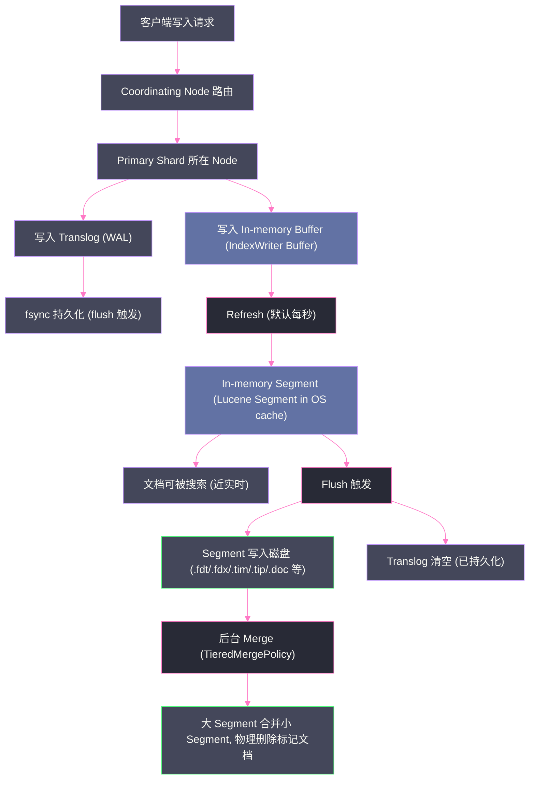
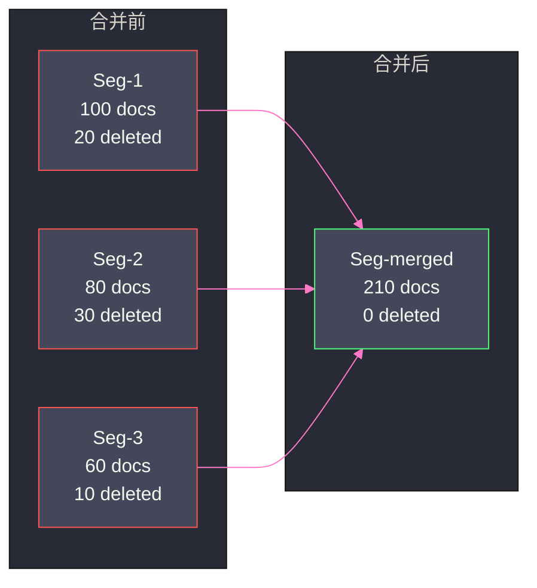

# 03 文档写入与 Lucene 段合并

## 摘要

一条文档从 `POST /index/_doc` 到可被搜索，中间经历了哪些过程？为什么 ES 自称"近实时"（Near Real-Time）而不是"实时"？为什么大量写入后磁盘上会留下成千上万个小文件？段合并（Segment Merge）又是为了解决什么问题——如果不合并，查询性能会以什么方式劣化？

本文从 Lucene 的不可变段（Immutable Segment）设计哲学出发，完整梳理 **Write → Refresh → Flush → Merge** 四阶段写入链路，深入剖析 Translog 的 WAL 机制、Segment 的物理文件结构、以及 `TieredMergePolicy` 的合并决策逻辑。理解这条链路，是解释 ES 写入放大、查询性能波动与磁盘空间占用三大经典问题的关键。

---

## 第 1 章 为什么段是不可变的

### 1.1 从一个朴素的设计问题出发

假设你要设计一个全文搜索引擎。用户写入一篇文章，你需要对其进行分词、建立倒排索引，然后让用户可以搜索。如果后来用户修改了这篇文章，最直接的做法是：找到原来的索引条目，更新其中的词频、位置信息，然后写回磁盘。

这在单机、小数据量场景下没什么问题。但放到搜索引擎的量级——每秒数万次写入、索引文件动辄数 GB——问题就来了：

- **随机写磁盘的代价极高**。传统机械硬盘的顺序读写吞吐可达 100-200 MB/s，但随机写因为磁头寻道，实际只有几百 IOPS，差距在百倍量级。即使是 SSD，随机小写的写放大和磨损问题也不容忽视。
- **多线程并发修改需要加锁**。倒排索引的修改涉及词典（Term Dictionary）、Posting List、DocValues 等多个数据结构，跨结构的原子性修改复杂度极高，锁竞争会严重影响并发写入吞吐。
- **文件校验和一致性保证困难**。一个正在被修改的文件，其校验和（Checksum）在修改过程中是无效的，这给故障恢复带来极大的不确定性。

Lucene 的答案是：**段（Segment）一旦写入磁盘，就永远不再修改**。

### 1.2 不可变性带来的三大好处

**第一：文件可以被操作系统 Page Cache 安全地缓存。**

[[Page Cache]] 是 Linux 内核中文件系统层面的缓存机制——文件内容被读取后，会驻留在物理内存中，后续读取直接命中内存，速度提升数个数量级。但这依赖一个前提：文件内容不会在进程读取期间被其他进程修改。Segment 的不可变性完美满足了这个条件。一个活跃被查询的 Segment，其文件会被 Page Cache 持久锁住，查询速度接近内存访问。

**第二：文件可以被安全地并发读取，无需任何锁。**

倒排索引的读路径（搜索词 → FST 查找 → Posting List 遍历）本质上是只读操作。由于 Segment 不可变，多个搜索线程可以同时读取同一个 Segment 文件，无需加任何锁，天然支持高并发搜索。

**第三：数据压缩效率更高。**

Lucene 的 Posting List 使用了 Frame of Reference（FOR）差值压缩和 RoaringBitmap 等算法，这些算法的压缩效率依赖于数据的有序性和静态性。对于一个固定不变的整数序列，可以一次性计算出最优的压缩参数。而可变数据结构无法做到这一点。

### 1.3 不可变性带来的代价：删除与更新如何处理

既然段不可变，那删除一条文档怎么办？直接把文档从 Posting List 里移除是不可能的（那会修改段文件）。

Lucene 的答案是：**用一个独立的删除标记文件（.liv 文件，即 Live Documents BitSet）来记录哪些文档 DocID 被标记为已删除**。搜索时，对每个命中的文档，先查 Live Documents BitSet，如果该 DocID 被标记删除，就跳过（或者说"过滤"掉），不放入最终结果集。

这意味着被"删除"的文档，其数据实际上还躺在段文件里占据磁盘空间，只是在搜索结果中被过滤掉。只有等到段合并时，被标记删除的文档才会真正被物理移除。

**更新（Update）**在 Lucene/ES 层面被实现为**先删除旧版本，再写入新版本**：
1. 根据文档 ID，找到旧版本文档所在的段，在 .liv 文件中标记其 DocID 为已删除；
2. 在内存的新段（MemBuffer）中写入新版本文档。

这就解释了为什么 ES 的更新操作（`_update`）的代价与写入操作基本相同——本质上它就是一次删除 + 一次写入。

> [!note] 设计哲学
> Lucene 用"删除标记 + 段合并时物理清除"的方式，将"如何修改不可变数据"这个难题，转化成了一个更易解决的"如何周期性地整理垃圾"的问题。这种设计思路在 LSM-Tree（[[LevelDB]]、RocksDB）中同样可以看到其影子。

---

## 第 2 章 写入链路：Write → Refresh → Flush → Merge

### 2.1 全链路一览

在深入每个阶段之前，先建立一张全局地图。



整条链路可以用一句话概括：**文档先写内存（速度快），定期刷盘（持久化），后台合并（整理碎片）**。Translog 贯穿其中，承担宕机恢复的责任。

### 2.2 第一阶段：Write —— 写入 Buffer 与 Translog

当一个索引请求到达 Primary Shard 后，ES 做两件事，且这两件事是**同步**的：

**写入 IndexWriter Buffer（内存缓冲区）**

这是 Lucene 的 `IndexWriter` 维护的内存数据结构，文档会在这里完成分词、建立内存中的倒排结构。此时文档**不可被搜索**——它还没有成为 Segment。

Buffer 的大小由 `indices.memory.index_buffer_size` 控制（默认是 JVM Heap 的 10%，最大 512MB）。

**写入 Translog（事务日志）**

Translog 是 ES 自己实现的 [[WAL]]（Write-Ahead Log）机制。每一条写入操作（Index/Delete/Update），都会被以追加写（append-only）的方式写入 Translog 文件。

> [!info] 核心概念：WAL（Write-Ahead Log）
> WAL 是数据库领域的经典模式——**在修改实际数据之前，先把"我打算做什么"记录到一个顺序日志文件中**。这个日志文件的写入是顺序 IO（非常快），即使系统崩溃，也可以在重启时通过重放日志（Replay）来恢复内存中丢失的数据。
>
> 不这样的话会怎样？如果没有 Translog，内存 Buffer 中还未刷到磁盘 Segment 的数据，在节点宕机后会永久丢失，数据完整性无法保证。

Translog 的持久化策略由 `index.translog.durability` 控制：
- `request`（默认）：每次写入请求都同步 fsync Translog，数据不丢失，但牺牲了写入吞吐；
- `async`：Translog 异步 fsync（默认每 5 秒），吞吐更高，但节点宕机可能丢失最近 5 秒的数据。

### 2.3 第二阶段：Refresh —— 从 Buffer 到内存 Segment

**Refresh** 是 Lucene 中 `IndexWriter.commit()` 之外的另一个操作——`IndexReader` 重新打开（reopen）。其效果是：**把内存 Buffer 中的数据，序列化成一个新的 Lucene Segment，并将其写入操作系统的文件系统缓存（OS Page Cache）**。

注意：Refresh 完成后，新 Segment 的文件存在于 OS 的 Page Cache（内存），**还没有 fsync 到磁盘**。但它已经可以被 `IndexSearcher` 搜索到了——因为 `IndexSearcher` 通过文件句柄读取数据，而 OS 会透明地从 Page Cache 中返回内容，无论文件是否已落盘。

**这就是"近实时"（Near Real-Time，NRT）的本质所在**：文档从写入到可被搜索，中间有一个 Refresh 的延迟（默认 1 秒）。

```
写入请求到达   Refresh 触发   文档可被搜索
     |              |              |
     t=0           t=1s          t=1s
                   (默认 refresh_interval)
```

Refresh 的代价是不可忽视的——每次 Refresh 都会创建一个新的 Lucene Segment（哪怕只写入了几条文档），而 Segment 的创建涉及内存数据结构的序列化、文件句柄的分配等开销。如果 `refresh_interval` 设置得太短（比如 100ms），Segment 数量会快速膨胀，查询时需要合并的 Segment 数量增多，性能反而下降。

> [!warning] 生产避坑
> **批量导入数据时，建议将 `refresh_interval` 设置为 `-1`（禁用自动 Refresh）**，等导入完成后手动调用 `POST /index/_refresh`。这能减少 Refresh 开销和 Segment 碎片，大幅提升导入吞吐。典型案例：某日志系统关闭 Refresh 后，写入速度从 5 万/s 提升到 20 万/s。

**Refresh 可以手动触发：**
```http
POST /my-index/_refresh
```

**Refresh 自动触发的条件：**
- 时间到达 `refresh_interval`（默认 1 秒）；
- Buffer 占用超过了 `indices.memory.index_buffer_size` 的限制；
- 搜索请求到来且有未刷新的数据（当 `index.refresh_interval=-1` 时，搜索请求可以携带 `?refresh=wait_for` 参数）。

### 2.4 第三阶段：Flush —— 从 OS 缓存到磁盘

**Flush** 是 ES 对 Lucene `IndexWriter.commit()` 操作的封装。其核心动作是：**将 OS Page Cache 中的所有 Segment 文件 fsync 到磁盘，并清空对应的 Translog**。

Flush 完成后，即使操作系统宕机，数据也能从磁盘 Segment 中完整恢复，Translog 中对应的历史记录就可以安全删除了。

**Flush 自动触发的条件：**
- Translog 大小超过 `index.translog.flush_threshold_size`（默认 **512MB**）；
- Translog 存在时间超过 `index.translog.flush_threshold_age`（默认 **30 分钟**，ES 7.x+ 已移除此参数，改为更智能的策略）；
- 节点重启前（Graceful Shutdown）；
- 快照（Snapshot）触发前。

**Flush 与 Refresh 的本质区别：**

| 操作 | 目标 | 数据位置 | 是否 fsync | 文档可搜索 |
|:---|:---|:---|:---|:---|
| **Refresh** | Buffer → Segment | OS Page Cache | 否 | ✅ 是 |
| **Flush** | OS Cache → 磁盘 | 物理磁盘 | ✅ 是 | 不改变（已在 Refresh 后可搜索） |

> [!info] 核心概念：fsync 与数据持久化
> `fsync()` 是一个系统调用，它告诉操作系统："把内核缓冲区（Page Cache）中属于这个文件的所有脏页，强制写入物理存储介质"。没有 fsync，操作系统可能将数据在内存中缓存数十秒才真正落盘——这期间如果断电，数据就丢了。fsync 的代价是昂贵的，因此 ES 不在每次 Refresh 后 fsync，而是将 Flush 操作的频率控制在较低水平（默认每 30 分钟或 Translog 达到 512MB 时）。

**Flush 可以手动触发：**
```http
POST /my-index/_flush
```

### 2.5 Translog 的完整生命周期

结合上述三个阶段，Translog 的完整生命周期如下：

1. **Write 阶段**：每条写操作同步追加到 Translog（`request` 模式），并写入内存 Buffer；
2. **Refresh 阶段**：Buffer 转为 Segment，Translog **不变**（新 Segment 还在 Page Cache，万一 OS 崩溃，Page Cache 丢失，需要 Translog 重放）；
3. **Flush 阶段**：所有 Segment fsync 到磁盘后，Translog **被截断**（Truncate）——这部分数据已安全持久，Translog 中的记录不再需要；
4. **节点重启恢复**：ES 读取最新的磁盘 Segment，然后**重放（Replay）** Translog 中自上次 Flush 以来的所有操作，恢复内存中丢失的数据。

```
Translog: [op1, op2, op3 | op4, op5, op6 | op7, op8]
                           ↑                ↑
                       Flush 点1         Flush 点2 (当前)
已清除 ─────────────────────┘ 已清除 ──────┘ 待重放（若宕机）
```

---

## 第 3 章 Segment 的物理文件结构

### 3.1 一个 Segment 对应哪些文件

每个 Lucene Segment 在磁盘上不是一个单一的文件，而是一**组**文件，每类文件负责存储不同的信息。下面列出核心文件：

| 文件扩展名 | 存储内容 | 说明 |
|:---|:---|:---|
| `.fdt` / `.fdx` | 原始字段存储（Stored Fields） | 存储 `_source`、`store: true` 的字段；`.fdx` 是 `.fdt` 的索引 |
| `.tim` / `.tip` | 词典（Term Dictionary / Term Index） | `.tim` 存 FST 压缩词典，`.tip` 是词典的跳跃索引 |
| `.doc` | Posting List（词频 + DocID） | 存储每个 Term 对应的文档 ID 列表和词频 |
| `.pos` | Position 信息 | Term 在文档中的位置（用于 phrase query） |
| `.pay` | Payload 信息 | 与 Position 关联的自定义数据 |
| `.dvd` / `.dvm` | DocValues | 列式存储，用于排序、聚合、Script；`.dvm` 是元数据 |
| `.nvd` / `.nvm` | Norms | 字段长度归一化因子，用于相关性评分 |
| `.si` | Segment Info | Segment 元信息（文档数、文件列表等） |
| `.liv` | Live Documents | 已删除文档的 Bitset（置 0 表示已删除） |
| `segments_N` | Segment 提交点 | 记录所有活跃 Segment 的列表（N 是递增数字） |

> [!note] 设计哲学：关注点分离
> Lucene 将不同用途的数据（倒排索引、正排存储、列式存储）存放在不同文件中，这样做的好处是：搜索操作只读 `.tim`/`.doc`；聚合操作只读 `.dvd`；`_source` 返回只读 `.fdt`。不同操作访问不同文件，相互不干扰，且各自可以独立利用 Page Cache。

### 3.2 segments_N 文件的作用

`segments_N` 文件（N 是 Lucene 生成的递增版本号）是整个 Lucene 索引的"目录"，记录了当前有效的 Segment 集合。每次 Flush（即 Lucene 的 commit）都会生成一个新的 `segments_N` 文件。

当 ES 节点重启、需要打开索引时，它读取最新的 `segments_N` 文件，找到所有有效 Segment 的列表，然后逐一打开这些 Segment 文件。这是 ES 快速启动的基础——它不需要扫描整个目录来发现 Segment，直接读取这个"清单"文件即可。

---

## 第 4 章 段合并（Segment Merge）

### 4.1 为什么必须合并

每次 Refresh 都会产生一个新的 Segment。即使一秒内只写入 10 条文档，1 小时后也会积累 3600 个 Segment。这带来三个严重问题：

**问题一：文件句柄耗尽。**

Linux 系统对进程的文件句柄数有限制（`ulimit -n`）。一个有数千个 Segment 的 ES 节点，会打开数万个文件句柄（每个 Segment 对应十几个文件）。生产环境中因 Segment 过多导致 `Too many open files` 的故障并不罕见。

**问题二：查询性能线性劣化。**

ES 的查询会在所有 Segment 上并行执行，最终合并结果。Segment 越多，每次查询需要访问的文件越多、需要合并的结果集越多。当 Segment 数量从 10 个增长到 1000 个，查询延迟的增长不是线性的——每个 Segment 的打开、遍历都有固定开销，1000 个 Segment 的查询耗时可能是 10 个 Segment 的数十倍。

**问题三：磁盘空间浪费。**

被标记删除的文档占据磁盘空间，但在查询中被过滤掉，既浪费空间，又拖慢查询（需要读取才能过滤）。只有合并时，这些"幽灵文档"才会被物理清除。

### 4.2 合并的过程

段合并是后台线程（`merge` 线程池）执行的操作，**对前台搜索完全透明**。合并的基本流程：

1. **选择候选 Segment**：根据合并策略（`MergePolicy`）选择一组需要合并的小 Segment；
2. **创建新 Segment**：遍历候选 Segment 中的所有文档，**跳过已删除文档**（即 .liv 中标记的），将存活文档写入一个新的大 Segment；
3. **原子切换**：新 Segment 写入完成并 fsync 后，更新 `segments_N`，将旧 Segment 的引用替换为新 Segment；
4. **删除旧文件**：旧 Segment 的所有文件被删除，磁盘空间释放。

整个过程中，旧 Segment 对正在进行的搜索仍然可见（因为 `IndexSearcher` 持有旧 Segment 的引用），新旧切换是原子的。



### 4.3 TieredMergePolicy：ES 默认的合并策略

ES（底层 Lucene）默认使用 `TieredMergePolicy`。理解它的决策逻辑，有助于解释为什么有时候磁盘上的 Segment 分布"阶梯状"排列。

**核心思想：按 Segment 大小分层（Tier），同一层的 Segment 才合并在一起**

TieredMergePolicy 的目标是维护一个"金字塔"形状的 Segment 集合：少数几个大 Segment，加上少量中等 Segment，再加上少量小 Segment。它的关键参数：

| 参数 | 默认值 | 含义 |
|:---|:---|:---|
| `max_merge_at_once` | 10 | 每次合并最多选取多少个 Segment |
| `max_merged_segment` | 5GB | 单个 Segment 最大不超过此大小 |
| `segments_per_tier` | 10 | 每层允许的最大 Segment 数量 |
| `floor_segment` | 2MB | 小于此大小的 Segment 被视为"地板级"，优先合并 |

**合并触发逻辑（简化版）：**
1. 将所有 Segment 按大小从大到小排序；
2. 计算当前 Segment 集合的"层数"（类似于 LSM-Tree 的层级概念）；
3. 如果某一层的 Segment 数量超过 `segments_per_tier`，就从那一层选择最"值得合并"（合并后删除率最高）的 Segment 组，发起合并任务。

> [!info] 核心概念：合并评分（Merge Score）
> TieredMergePolicy 在选择哪些 Segment 合并时，不是随机选，而是计算每个候选 Segment 组的 **Merge Score**：删除率越高的 Segment 组，Score 越低，越优先被选中合并。这确保了每次合并都能最大化"清除幽灵文档"的收益，减少不必要的 IO。

### 4.4 Force Merge：手动触发合并

ES 提供了 `_forcemerge` API，允许将一个索引的所有 Segment 强制合并到指定数量：

```http
POST /my-index/_forcemerge?max_num_segments=1
```

这会把索引压缩到单个 Segment，查询性能最优，磁盘占用最小（所有已删除文档被清除）。但代价是：**Force Merge 是极度 IO 密集的操作**，它会读取所有数据然后重写一遍，期间磁盘 IO 可能飙升到满负荷，严重影响正常查询和写入。

> [!warning] 生产避坑
> **Force Merge 只适合对只读索引（不再写入的历史索引）执行**。对活跃写入的索引执行 Force Merge 是危险的——它合并出的大 Segment，很快又会被新的写入 Refresh 出新小 Segment，导致合并永无止境，IO 持续高压。
> 
> 正确的使用场景：日志索引按天切换（ILM 冷却阶段），当天索引关闭写入后，对其执行 `_forcemerge?max_num_segments=1`，然后将其迁移到冷存储节点。

---

## 第 5 章 写入性能的三角权衡

### 5.1 写入延迟、可搜索延迟与资源消耗

ES 的写入链路设计，本质上是在三个目标之间取得平衡：

| 目标 | 相关参数 | 权衡 |
|:---|:---|:---|
| **写入吞吐高** | `index.refresh_interval`、`index.translog.durability` | 牺牲可搜索延迟（Refresh 越少，数据越晚可见） |
| **可搜索延迟低** | `refresh_interval` 越小越好 | 牺牲写入吞吐（更多 Segment，更多 Merge 开销） |
| **磁盘占用低** | 频繁 Merge | 牺牲 CPU/IO 资源（合并本身消耗资源） |

这个三角权衡没有普适的最优解，只有根据业务场景选择合适的参数组合：

- **日志场景**（高写入量、可接受秒级延迟）：`refresh_interval=30s`，`translog.durability=async`，批量写入 + 禁用 Refresh 导入；
- **搜索场景**（低写入量、要求亚秒可见）：`refresh_interval=1s`（默认），`translog.durability=request`（默认）；
- **只读历史数据**：执行 `_forcemerge?max_num_segments=1`，最大化压缩。

### 5.2 Merge 导致的查询抖动

在 Merge 执行期间，磁盘 IO 会显著升高，可能导致查询延迟出现周期性抖动（P99 延迟尖峰）。这是 Lucene 架构下无法完全消除的固有代价，但可以通过以下手段缓解：

**限制合并线程数和带宽：**
```
# elasticsearch.yml
indices.merge.scheduler.max_thread_count: 1  # SSD 可以设高，机械盘建议为 1
```

ES 还提供了 `index.merge.scheduler.max_merge_count` 参数控制同时进行的合并任务数量，以及通过 `store.throttle.max_bytes_per_sec` 限制合并的 IO 带宽（ES 5.x 前的旧参数，新版已内化为 CGroup 级别的 IO 限制）。

**使用 SSD 代替机械硬盘：**

Merge 操作的 IO 模式是大块顺序读 + 大块顺序写，SSD 的 IOPS 优势对 Merge 场景尤为明显。大量 ES 生产集群因切换 SSD 而彻底解决了 Merge 导致的查询抖动问题。

---

## 第 6 章 副本写入与一致性保证

### 6.1 Primary 与 Replica 的写入顺序

ES 的写入不仅仅发生在 Primary Shard，还需要同步到所有 Replica Shard。写入流程：

1. 客户端请求到达 Coordinating Node，路由到 Primary Shard 所在节点；
2. Primary 完成本地写入（Buffer + Translog）；
3. Primary **并行**将写入请求转发到所有 in-sync Replica（即 ISR 中的副本）；
4. 等待所有 Replica 确认写入成功（或等待 `wait_for_active_shards` 参数指定的数量）；
5. Primary 返回成功给客户端。

注意：Primary 收到 Replica 的 ACK，只代表 Replica 也完成了本地写入（写入 Buffer + Translog），**不代表 Replica 已完成 Refresh**。因此，Primary 可搜索，不意味着 Replica 立即可搜索——但在下一次 Replica Refresh 后，两者状态一致。

### 6.2 in-sync 副本集与写入一致性

ES 维护了一个 **in-sync copies（同步副本集）** 的概念，类似于 [[Kafka]] 的 ISR。只有与 Primary 保持同步（数据不落后超过一定程度）的 Replica，才在 in-sync 集合中。

写入请求需要 in-sync 集合中**所有成员**都确认，才算成功（`wait_for_active_shards=all` 语义）。默认情况下，`wait_for_active_shards=1`，只需 Primary 写入成功即可返回，牺牲了部分一致性以换取更低的写入延迟。

> [!warning] 生产避坑
> 在使用 `wait_for_active_shards=1`（默认）时，如果 Primary 写入成功后立刻宕机，而此时 Replica 还未来得及同步，可能导致数据丢失。对于不能接受数据丢失的场景，应将 `wait_for_active_shards` 设置为 `quorum`（多数副本确认）或 `all`。

---

## 第 7 章 生产案例：写入链路的典型故障

### 7.1 案例一：磁盘突然满了

**现象**：ES 节点磁盘使用率突然从 70% 飙升到 100%，集群状态变红，写入全部失败。

**根因分析**：Force Merge 期间，旧 Segment 尚未删除（等待当前 `IndexSearcher` 引用释放），新合并的大 Segment 已经写入，导致磁盘上同时存在新旧两套数据，峰值磁盘占用接近正常的两倍。

**解决方案**：
1. 立即停止 Force Merge（通过 `_tasks` API 取消任务）；
2. 删除一些不重要的历史索引释放空间；
3. 调整 Force Merge 策略，仅在磁盘使用率 < 50% 时执行；
4. 长期方案：增加节点或磁盘容量，将磁盘使用率红线设置在 75%（ES 默认 `cluster.routing.allocation.disk.watermark.high=85%`）。

### 7.2 案例二：Translog 文件异常膨胀

**现象**：某 ES 索引的 Translog 文件持续增长，占用了数十 GB 磁盘空间，Flush 迟迟不触发。

**根因分析**：该索引的 `index.translog.flush_threshold_size` 被人工修改为了 `10GB`（本意是减少 Flush 次数降低 IO），导致 Translog 需要积累到 10GB 才触发 Flush。而集群磁盘空间不足，进一步阻止了 Flush 的发生（Flush 需要写入新 Segment，需要额外空间）。

**解决方案**：
```http
PUT /problematic-index/_settings
{
  "index.translog.flush_threshold_size": "512mb"
}
```
随后手动触发 `POST /problematic-index/_flush`，Translog 被清空，磁盘空间恢复正常。

### 7.3 案例三：Refresh 导致的写入 GC 压力

**现象**：ES 节点 JVM GC 频繁，Old Gen 持续增长，偶发 Full GC 导致节点短暂离线。

**根因分析**：Refresh 操作会将内存中的 IndexWriter Buffer 序列化为 Segment，序列化过程会产生大量临时对象（Term Dictionary 构建、FST 编码等），在 Young Gen 快速晋升到 Old Gen，加速了 Old Gen 的填充。

**解决方案**：
1. 适当增大 Heap（但不超过 32GB，避免超过 JVM [[JVM]] 的指针压缩阈值）；
2. 将 `refresh_interval` 从 1s 调整为 5s，减少 Refresh 频率；
3. 增加节点分担写入压力（水平扩展）；
4. 检查是否存在大文档写入（`_source` 巨大的文档在 Refresh 时序列化开销极高）。

---

## 第 8 章 与 LSM-Tree 的设计对比

### 8.1 Lucene Segment 与 LSM-Tree 的异同

Lucene 的 Segment 机制与 [[LevelDB]]/RocksDB 的 [[LSM-Tree]] 在设计思想上有深刻的相似之处，但也有关键区别：

| 维度 | Lucene Segment | LSM-Tree（LevelDB） |
|:---|:---|:---|
| **写入目标** | 搜索（倒排索引） | KV 查询（B-Tree 替代） |
| **内存结构** | IndexWriter Buffer（未定型） | MemTable（跳跃表） |
| **不可变性** | ✅ Segment 不可变 | ✅ SSTable 不可变 |
| **合并触发** | TieredMergePolicy（基于大小分层） | Level Compaction（严格分层大小限制） |
| **删除方式** | .liv Bitset（标记删除） | Tombstone（删除墓碑） |
| **WAL** | Translog | WAL（Write-Ahead Log） |
| **读放大** | 较高（需在所有 Segment 上查询并合并） | 较低（分层后每层最多读一个 SSTable） |
| **写放大** | 中等 | 高（分层 Compaction 反复重写数据） |

> [!note] 设计哲学
> Lucene 优先优化的是**搜索延迟**（倒排索引的查询路径极短），而 LSM-Tree 优先优化的是**写入吞吐**（顺序写 WAL + MemTable）。两者都选择了"不可变文件 + 周期合并"的范式来解决更新问题，但在合并策略和读写权衡上各有侧重。

---

## 小结

本文沿着 **Write → Refresh → Flush → Merge** 的主轴，梳理了 ES 文档写入的完整链路：

- **不可变 Segment** 是 Lucene 的核心设计哲学，换来了并发读的无锁、Page Cache 的高效利用以及高压缩率；
- **Translog** 承担 WAL 角色，弥补了 Segment 写入到磁盘之前的可靠性窗口；
- **Refresh**（默认 1 秒）是"近实时"可搜索的来源，代价是产生碎片化的小 Segment；
- **Flush** 将 Page Cache 中的 Segment fsync 到磁盘，然后截断 Translog；
- **TieredMergePolicy** 在后台按层合并 Segment，物理清除已删除文档，控制 Segment 总数。

理解这条链路，是解释 ES 所有写入相关问题（GC 压力、磁盘占用、查询抖动）的底层框架。下一篇文章将深入 ES 的查询执行机制，分析 [[BM25]] 评分模型与向量检索（HNSW）的实现原理。
