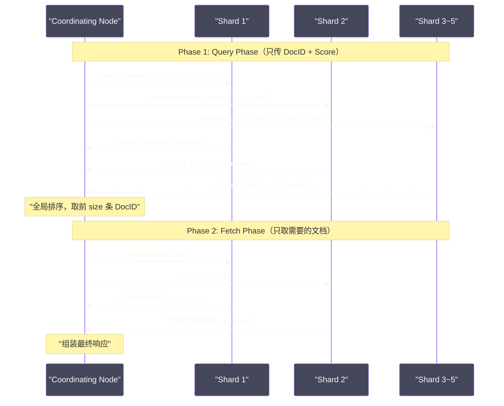
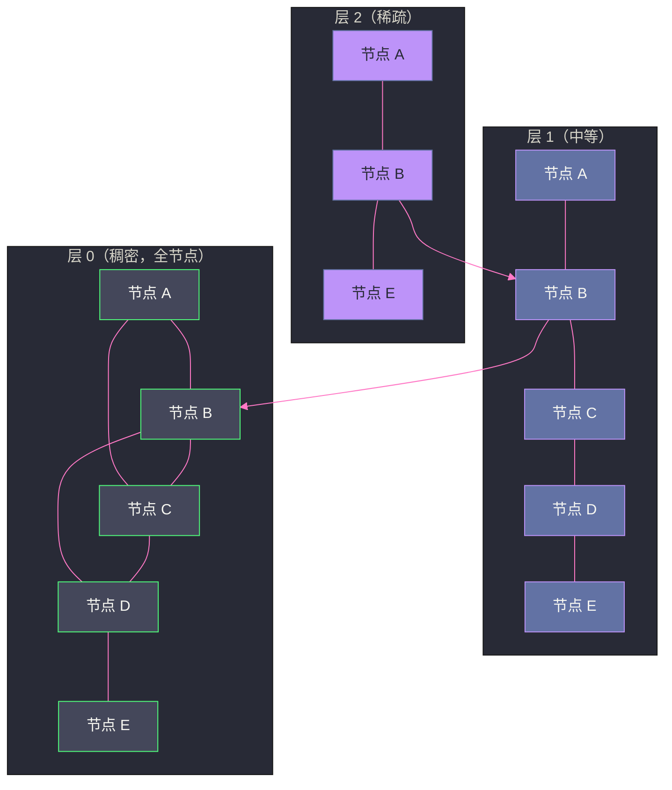

# 04 查询与相关性评分——BM25 与向量检索

## 摘要

当你在 ES 中执行一个 `match` 查询，搜索结果为什么是这个顺序？`_score` 字段是怎么算出来的？为什么短文档搜索命中后得分反而高于长文档？BM25 作为 ES 7.0 起的默认评分算法，是在哪些维度上超越了经典的 TF-IDF？

另一方面，随着大语言模型（LLM）和向量嵌入（Embedding）的兴起，ES 8.x 引入了 HNSW 向量索引，让 ES 从纯文本搜索扩展到语义搜索与 RAG（检索增强生成）场景。HNSW 是什么数据结构，它如何在百万维度向量空间中实现毫秒级近似最近邻检索？

本文完整梳理 ES 的**两阶段查询执行模型**（Query Phase + Fetch Phase），深入推导 BM25 的数学公式背后的工程直觉，再剖析 HNSW 图索引的构建与检索机制，最终落到 Hybrid Search（混合检索）的工程实践。

---

## 第 1 章 两阶段查询执行模型

### 1.1 为什么需要两阶段

假设你的索引有 5 个 Primary Shard，每个 Shard 上有 100 万条文档，你执行一个 `from=0, size=10` 的查询。最朴素的做法是：让每个 Shard 返回它认为最相关的 10 条文档（含完整 `_source`），Coordinating Node 汇总 50 条文档，再排序取前 10。

这个方案的问题在于：**网络传输的数据量是浪费的**。每个 Shard 返回的是完整文档（`_source` 字段可能很大），但 Coordinating Node 只需要文档 ID 和分数来做全局排序。5 个 Shard 传回 50 条完整文档，其中 40 条在全局排序后被丢弃——它们的网络传输完全是浪费的。

ES 的解决方案是**两阶段查询**：



### 1.2 Query Phase：打分与排序

**Query Phase** 的目标是：在每个 Shard 上，找出得分最高的 `from + size` 条文档的 DocID 和 Score，不需要返回任何字段值。

每个 Shard 独立执行查询：
1. 根据查询条件（如 `match`、`bool`、`range` 等），通过倒排索引定位候选文档集；
2. 对每个候选文档计算相关性得分（调用 `Scorer`，核心是 BM25 算法）；
3. 使用 Priority Queue（最小堆）维护 `from + size` 个最高得分的文档；
4. 将结果（DocID + Score，**不含任何字段**）返回给 Coordinating Node。

Coordinating Node 收到所有 Shard 的 `from + size` 条结果后，合并排序，取全局前 `size` 条文档的 DocID。

> [!warning] 生产避坑：深分页问题
> 如果 `from=10000, size=10`，每个 Shard 需要返回 `10010` 条 DocID 给 Coordinating Node，5 个 Shard 就是 5 × 10010 = 50050 条。随着 `from` 增大，内存消耗和网络传输线性增长。ES 默认将 `from + size` 限制在 10000（`index.max_result_window`），超过会报错。
>
> **深分页的正确解法**：使用 `search_after`（基于上一页最后一条文档的排序值作为锚点）或 Scroll API（为爬取全量数据设计，不适合实时场景）。

### 1.3 Fetch Phase：获取文档内容

Query Phase 只确定了哪些文档需要返回，**Fetch Phase** 才真正去读取这些文档的内容。

Coordinating Node 将全局 Top-K 的 DocID 列表，按 Shard 分组，发送给对应 Shard（或 Replica），Shard 根据 DocID 从 `.fdt` 存储文件中读取 `_source`（以及 `highlight`、`explain` 等附加信息），返回给 Coordinating Node 组装最终响应。

Fetch Phase 的 IO 是**随机读**——给定一批 DocID，去 `.fdx`（索引文件）中查找每个 DocID 的偏移量，再去 `.fdt`（数据文件）中读取对应的字节块。这是典型的随机磁盘 IO，依赖 [[Page Cache]] 来提升性能。如果请求的文档恰好不在 Page Cache 中（冷索引），Fetch Phase 的延迟可能显著高于 Query Phase。

### 1.4 Query Phase 的内部：Filter Cache 与 Query Cache

ES 区分两类查询语境：

- **Query Context（查询上下文）**：计算相关性得分，如 `match`、`multi_match`；
- **Filter Context（过滤上下文）**：只做是/否匹配，不计算分数，如 `filter`、`must_not`、`range`、`term`。

Filter Context 的执行结果可以被 ES 缓存（**Filter Cache**，存储在 JVM Heap 中），命中缓存的 Filter 条件完全无需访问磁盘。这是 ES 性能优化的核心手段之一——**将不涉及评分的条件放入 `filter` 子句**，而不是 `must`。

```json
{
  "query": {
    "bool": {
      "must": [
        { "match": { "title": "分布式系统" } }
      ],
      "filter": [
        { "term": { "status": "published" } },
        { "range": { "publish_date": { "gte": "2024-01-01" } } }
      ]
    }
  }
}
```

在上面的查询中，`match` 语句在 Query Context 中执行，参与 BM25 评分；`term` 和 `range` 在 Filter Context 中执行，结果会被缓存，且不计算分数。

---

## 第 2 章 BM25：从 TF-IDF 进化而来

### 2.1 TF-IDF 的局限性

在理解 BM25 之前，必须先理解它要解决的前辈——TF-IDF 的什么问题。

**TF-IDF**（Term Frequency × Inverse Document Frequency）是信息检索领域的经典评分公式：

$$\text{Score}(d, q) = \sum_{t \in q} \text{TF}(t, d) \times \text{IDF}(t)$$

其中：
- **TF（词频）**：词 t 在文档 d 中出现的次数。出现越多，权重越高；
- **IDF（逆文档频率）**：$\log \frac{N}{df(t)}$，N 是总文档数，df(t) 是包含词 t 的文档数。一个词在越少文档中出现，IDF 越高（说明它越有区分度）。

TF-IDF 有两个著名的缺陷：

**缺陷一：TF 无上界，长文档天然占优。**

一篇 10000 词的文章，即使关键词只是随机散布其中，TF 值也远高于一篇 500 词但主题高度聚焦的文章。原始 TF-IDF 无法区分"文章很长所以词频高"和"文章高度相关所以词频高"这两种情况。

**缺陷二：没有文档长度归一化。**

与上面相关——不同长度的文档，词频天然不可比。

ES（Lucene）使用了 TF 的平方根来缓解这个问题（`tf(freq) = sqrt(freq)`），并引入了 Norms（字段长度的倒数作为衰减因子），但这只是补丁式的修复。

### 2.2 BM25 的设计思想

**BM25**（Best Match 25，"25"是因为这是 Okapi BM 系列的第 25 个变体，历经多代演进）由英国信息检索学者 Robertson 等人在 1990 年代提出，2000 年前后在学术界和工业界逐渐成为主流。

BM25 的核心思想是：**对 TF 值施加一个"饱和函数"，使得词频越高，增益越来越小，直至趋近饱和**。

BM25 的完整公式：

$$\text{Score}(d, q) = \sum_{t \in q} \text{IDF}(t) \cdot \frac{tf \cdot (k_1 + 1)}{tf + k_1 \cdot \left(1 - b + b \cdot \frac{|d|}{\text{avgdl}}\right)}$$

乍看复杂，但拆开每个部分，都有清晰的工程直觉：

**IDF(t)**：与 TF-IDF 类似，衡量词 t 的稀有程度（区分度）。BM25 的 IDF 公式略有不同：

$$\text{IDF}(t) = \ln\left(\frac{N - df(t) + 0.5}{df(t) + 0.5} + 1\right)$$

加 0.5 是为了平滑处理（Laplace Smoothing），避免 df(t) = 0 时分母为零；加 1 是为了确保 IDF 始终为正（当 df(t) > N/2 时，原始公式会为负）。

**TF 饱和函数**：这是 BM25 最关键的改进。

$$\text{TF\_saturated} = \frac{tf \cdot (k_1 + 1)}{tf + k_1 \cdot \left(1 - b + b \cdot \frac{|d|}{\text{avgdl}}\right)}$$

**参数 k1（默认 1.2）**：控制 TF 的饱和速度。

- k1 趋近于 0：tf 无论多大，TF 饱和值都趋近于 1，即词频完全不影响得分；
- k1 趋近于无穷大：退化为线性 TF，即词频越高，得分线性增长（类似原始 TF-IDF）；
- k1 = 1.2 的含义：当某词出现次数从 1 增加到 10，TF 贡献的增益逐渐递减，超过约 4-5 次后几乎不再增长。

下面用一张对比表来直观感受这个饱和效果（k1=1.2，b=0，avgdl=|d|）：

| 词频 tf | 原始 TF（Lucene sqrt(tf)） | BM25 TF 饱和值 |
|:---:|:---:|:---:|
| 1 | 1.0 | 1.0 |
| 2 | 1.41 | 1.45 |
| 4 | 2.0 | 1.73 |
| 8 | 2.83 | 1.88 |
| 16 | 4.0 | 1.94 |
| 32 | 5.66 | 1.97 |

可以看到：在 BM25 中，tf 从 1 增加到 32，TF 贡献只从 1.0 增长到 1.97——几乎饱和了。而原始 TF 值从 1.0 增长到 5.66，差距巨大。这正是 BM25 对长文档更公平的根本原因。

**参数 b（默认 0.75）**：控制文档长度归一化的程度。

- b = 0：完全不做长度归一化，文档长度对得分没有影响；
- b = 1：完全按文档长度归一化，长文档中的词频会被大幅压缩；
- b = 0.75：折中，既考虑长度影响，又不过度惩罚长文档。

`|d|` 是当前文档的字段长度（词的数量），`avgdl` 是索引中该字段的平均文档长度。当 `|d| > avgdl`（文档比平均长），分母增大，TF 贡献减小——这就是"长文档惩罚"的实现机制。

### 2.3 BM25 的工程含义：三个问题的答案

**问题一：为什么短文档得分反而高？**

对于同样包含关键词且词频相同的两篇文章，短文章的 `|d| < avgdl`，BM25 公式中的文档长度归一化项 `(1 - b + b * |d|/avgdl) < 1`，使得分母变小，TF 饱和值更大，最终得分更高。直觉上，短文档中出现关键词，说明这个词在文档中更"集中"，相关性更强。

**问题二：`_score` 的绝对值有意义吗？**

没有。BM25 的绝对得分值没有跨索引的可比性——不同索引的 avgdl、文档数量 N 不同，导致 IDF 基准完全不同。`_score` 只在同一次查询的结果集内具有相对比较意义。

**问题三：如何自定义评分？**

ES 提供了 `function_score` 和 `script_score` 两种方式在 BM25 基础上叠加自定义因子：

```json
{
  "query": {
    "function_score": {
      "query": { "match": { "content": "分布式系统" } },
      "functions": [
        {
          "field_value_factor": {
            "field": "popularity",
            "factor": 1.2,
            "modifier": "log1p"
          }
        }
      ],
      "boost_mode": "multiply"
    }
  }
}
```

这里将 BM25 得分与文档的 `popularity` 字段值（经 log1p 变换后乘以 1.2）相乘，实现了"相关性 × 热度"的综合排序。

> [!warning] 生产避坑
> `script_score` 会对每个匹配文档执行脚本，当结果集很大时（如 `match_all` + `script_score`），性能开销极高。应配合 `filter` 先缩小候选集再做评分，或者使用预计算字段（在写入时计算好评分因子，存为 numeric field）代替运行时脚本。

### 2.4 ES 中修改 BM25 参数

BM25 的 k1 和 b 参数可以在 Mapping 中针对特定字段调整：

```json
PUT /my-index
{
  "settings": {
    "similarity": {
      "custom_bm25": {
        "type": "BM25",
        "k1": 1.5,
        "b": 0.5
      }
    }
  },
  "mappings": {
    "properties": {
      "title": {
        "type": "text",
        "similarity": "custom_bm25"
      }
    }
  }
}
```

对于文档长度差异不大的场景（如商品标题都是 5-15 个词），可以将 b 调低（如 0.25），减少长度归一化的干扰；对于长文档场景（新闻文章、技术文档），适当提高 b（如 0.9）。

---

## 第 3 章 向量检索：从语义鸿沟到 HNSW

### 3.1 关键词搜索的本质局限

BM25 再精妙，也无法解决一个根本性的问题：**词汇表不匹配（Vocabulary Mismatch）**。

用户搜索"笔记本散热差"，文章里写的是"MacBook Pro 温度过高"。两者语义完全一致，但没有任何关键词重合——BM25 给这篇文章的得分是 0。

这就是**语义鸿沟**（Semantic Gap）：关键词搜索本质上是词汇的字面匹配，无法理解语义相似性。

### 3.2 向量嵌入：用数字表达语义

**向量嵌入（Vector Embedding）** 是深度学习领域的核心技术——将文本（词、句子、段落）映射到一个高维数值向量，使得语义相似的文本，其向量在高维空间中彼此接近。

具体而言，一个文本嵌入模型（如 BERT、text-embedding-ada-002）将任意文本映射到一个固定维度的向量（如 768 维、1536 维）。"笔记本散热差"和"MacBook Pro 温度过高"经过嵌入模型处理后，会得到两个余弦相似度接近 1.0 的向量——尽管它们没有共同的关键词。

向量检索的任务是：给定一个查询向量 q，在包含 N 个向量的数据库中，找出与 q 最相似（余弦距离或 L2 距离最小）的 K 个向量。这就是**近似最近邻（ANN，Approximate Nearest Neighbor）** 问题。

### 3.3 暴力搜索为何不可行

最朴素的做法是暴力搜索（Brute Force）：计算查询向量 q 与库中每个向量的距离，取最小的 K 个。

时间复杂度 O(N × D)——N 是向量数量，D 是向量维度。当 N = 1000 万、D = 768 时，一次查询需要进行 768 亿次乘加运算。即使使用 SIMD 指令并行化，也需要数秒甚至更长时间——对于在线搜索完全不可接受。

因此，向量检索的核心挑战是：**在保证一定召回率（Recall）的前提下，大幅降低检索延迟**——这就是 ANN 算法的价值所在。

### 3.4 HNSW：分层可导航小世界图

ES 8.x 使用的 ANN 索引算法是 **HNSW**（Hierarchical Navigable Small World），这是目前工业界最主流的 ANN 索引之一（Milvus、Qdrant、Weaviate 等向量数据库均使用 HNSW 或其变体）。

要理解 HNSW，先从它的前身 **NSW（Navigable Small World）** 说起。

#### 3.4.1 NSW：小世界图的直觉

"六度分隔理论"告诉我们，世界上任意两个人，最多通过 6 个中间人就能相互认识。这背后是一种特殊的网络结构——**小世界图**（Small World Graph）：大多数节点与邻居相连（局部聚集性高），但少数节点有"长距离"的跨区域连接（充当桥梁），使得任意两点之间的平均路径长度很短。

NSW 算法将这种思想应用到向量空间：把向量库中的每个向量构建为图的一个节点，相似的向量之间连边（短程连接），同时保留一些跨越较大距离的连接（长程连接）。检索时，从一个任意起点出发，贪心地向与查询向量最近的邻居移动，直到找不到更近的邻居为止（局部最优）。

NSW 的问题：**在高维空间中，贪心遍历容易陷入局部最优**。一旦贪心路径走到一个"局部极小值"，就停止了，但这个点未必是全局最近邻。

#### 3.4.2 HNSW：加入层次结构

**HNSW** 通过在 NSW 上叠加**分层结构**来解决局部最优问题，核心思路来自跳跃表（Skip List）：在多个层次上建立图，高层稀疏（少节点、长连接），低层稠密（全节点、短连接）。

```
层 3（最稀疏）:  少数节点，长程连接，用于快速定位区域
层 2:           中等密度
层 1:           较密
层 0（最稠密）:  所有节点，短程精确连接
```

**构建过程：**

插入一个新向量 v 时：
1. 随机确定 v 所在的最高层 l（按指数分布：层越高，概率越低）；
2. 从最高层的入口点（Entry Point）开始，每层都执行贪心搜索找到离 v 最近的 M 个节点，建立连接；
3. 从上到下逐层建立连接，直到第 0 层（每层连接数由参数 M 控制）。

**检索过程：**

检索查询向量 q 的 K 最近邻时：
1. 从最高层（稀疏层）的入口点开始，贪心搜索离 q 最近的节点；
2. 下降到下一层，以上一层的最近节点作为新起点，继续贪心搜索；
3. 重复直到第 0 层，在第 0 层使用宽度优先搜索找到 `ef_search`（候选集大小参数）个候选节点；
4. 从候选集中取距离最小的 K 个作为结果。



#### 3.4.3 HNSW 的关键参数

| 参数 | ES 中的名称 | 含义 | 权衡 |
|:---|:---|:---|:---|
| M | `m` | 每个节点在每层的最大连接数 | 越大召回率越高，内存占用越多，构建越慢 |
| ef_construction | `ef_construction` | 构建索引时的候选集大小 | 越大索引质量越高，构建越慢 |
| ef_search | `num_candidates`（查询参数） | 检索时的候选集大小 | 越大召回率越高，查询越慢 |

**典型生产配置：**
```json
PUT /vector-index
{
  "mappings": {
    "properties": {
      "embedding": {
        "type": "dense_vector",
        "dims": 768,
        "index": true,
        "similarity": "cosine",
        "index_options": {
          "type": "hnsw",
          "m": 16,
          "ef_construction": 100
        }
      }
    }
  }
}
```

查询时：
```json
{
  "knn": {
    "field": "embedding",
    "query_vector": [0.1, 0.2, ...],
    "k": 10,
    "num_candidates": 100
  }
}
```

`num_candidates` 越大，从每个 Shard 收集的候选数越多，全局召回率越高，但延迟也越高。通常 `num_candidates = 10 × k` 是一个合理的起点。

### 3.5 ANN 的代价：召回率与延迟的权衡

HNSW 是**近似**最近邻——它不保证找到 100% 精确的最近邻，而是在特定参数下，以高概率找到前 K 个最近邻中的大部分。

**召回率（Recall@K）**：ANN 找到的前 K 个结果，与暴力搜索的真实前 K 个结果，有多大重叠（以比例衡量）。

召回率与 `num_candidates` 的关系是非线性的——从 `num_candidates = 50` 提升到 100，召回率可能从 90% 提升到 96%；但从 100 提升到 200，召回率只提升到 97%——边际收益递减。

> [!note] 设计哲学
> 向量检索本质上是一个"精确性与效率"的权衡。在实际业务中，从 95% 召回率提升到 99% 召回率，查询延迟可能从 5ms 增加到 50ms。是否值得？取决于业务场景——搜索广告的候选召回对 1% 的召回率损失极度敏感，而 RAG 场景的内容检索通常 90% 召回率即可满足需求。

---

## 第 4 章 Hybrid Search：文本检索与语义检索的融合

### 4.1 为什么需要混合检索

关键词检索（BM25）与向量检索（HNSW）各有优劣，实践中单独使用任何一种都有局限：

| 维度 | BM25 关键词检索 | 向量语义检索 |
|:---|:---|:---|
| **精确词匹配** | ✅ 极强（专有名词、型号、代码） | ❌ 弱（嵌入模型可能混淆相似词） |
| **语义理解** | ❌ 无法处理同义词、近义词 | ✅ 极强（理解语义相似性） |
| **新词/罕见词** | ✅ 只要词在索引中即可 | ❌ 嵌入模型对训练集外的词表现差 |
| **延迟** | 低（毫秒级） | 较高（向量计算 + 图遍历） |
| **索引大小** | 小 | 大（每个向量占 4 × dims 字节） |

混合检索（Hybrid Search）结合两者：用 BM25 处理精确词匹配，用向量检索处理语义相似性，最后通过评分融合策略（Score Fusion）合并两路结果。

### 4.2 ES 的混合检索实现

ES 8.x 提供了原生的混合检索支持：

```json
{
  "query": {
    "match": {
      "content": {
        "query": "分布式系统故障排查",
        "boost": 0.5
      }
    }
  },
  "knn": {
    "field": "embedding",
    "query_vector": [...],
    "k": 20,
    "num_candidates": 100,
    "boost": 0.5
  },
  "size": 10
}
```

ES 会对 BM25 和 kNN 的结果分别计算得分，然后将两路得分相加（受 `boost` 参数加权），最终按合并后的得分排序返回 Top-K。

但直接相加有一个问题：**BM25 得分和向量相似度的量纲不同**——BM25 得分通常在 0~10 之间，向量余弦相似度在 0~1 之间（ES 内部会将其归一化）。简单相加可能导致 BM25 的得分项主导最终排名。

### 4.3 RRF（倒数排名融合）

ES 8.8+ 引入了 **RRF（Reciprocal Rank Fusion）** 作为更鲁棒的排名融合策略。RRF 不依赖得分的绝对值，而是基于每路结果的**排名**来融合：

$$\text{RRF\_score}(d) = \sum_{\text{ranker}} \frac{1}{k + \text{rank}(d, \text{ranker})}$$

其中 k 是平滑参数（默认 60），`rank(d, ranker)` 是文档 d 在某路 ranker（BM25 或 kNN）结果中的排名（从 1 开始）。

**RRF 的优点：**
- 不依赖得分归一化，对不同量纲的得分鲁棒；
- 对高排名文档给予非线性更高的权重（1/(60+1) ≈ 0.016 vs 1/(60+100) ≈ 0.006，差距显著）；
- 即使某路结果中某文档不在候选集内（未命中），也不影响另一路的贡献。

```json
{
  "retriever": {
    "rrf": {
      "retrievers": [
        {
          "standard": {
            "query": {
              "match": { "content": "分布式系统故障排查" }
            }
          }
        },
        {
          "knn": {
            "field": "embedding",
            "query_vector": [...],
            "num_candidates": 100
          }
        }
      ],
      "rank_window_size": 50,
      "rank_constant": 60
    }
  },
  "size": 10
}
```

> [!info] 核心概念：为什么 RRF 比简单加权求和更好
> 假设 BM25 对文档 A 给出得分 8.5，对文档 B 给出得分 7.0；向量检索对文档 B 给出相似度 0.95，对文档 A 给出 0.60。简单加权相加（0.5 × 8.5 + 0.5 × 0.60 = 4.55 vs 0.5 × 7.0 + 0.5 × 0.95 = 3.975），文档 A 胜出——但向量检索明确认为 B 语义更相关。RRF 基于排名而非绝对值，能更公平地融合两路信号。

### 4.4 Hybrid Search 在 RAG 场景中的应用

**RAG（Retrieval-Augmented Generation，检索增强生成）** 是当前大语言模型应用的主流架构模式：在回答用户问题之前，先从知识库中检索相关文档片段，然后将片段拼入 Prompt，让 LLM 基于"有根据"的上下文生成答案。

ES 在 RAG 场景中充当知识库检索层，Hybrid Search 是最常见的检索策略：

1. **用户问题** → 调用 Embedding 模型 → 查询向量；
2. 用查询文本做 BM25 检索 + 用查询向量做 kNN 检索；
3. RRF 融合两路结果，取 Top-20 文档片段；
4. （可选）用 Reranker 模型对 Top-20 进行精排，取 Top-5；
5. Top-5 片段 + 用户问题 → LLM → 最终答案。

---

## 第 5 章 查询性能的底层决定因素

### 5.1 Segment 数量对查询性能的影响

查询执行时，ES 需要在所有 Segment 上并行执行，然后合并结果。Segment 越多，并行开销越大：

- 每个 Segment 的查询至少有一次文件句柄访问、一次 Term Dictionary 查找（FST 遍历）；
- 当 Segment 数量从 10 个增加到 1000 个，查询的 overhead 会显著增大，即使每个 Segment 的文档数很少；
- 这也是为什么段合并（Merge）对查询性能至关重要——少量大 Segment 远优于大量小 Segment。

### 5.2 Doc Values 与 Field Data 的选择

ES 的聚合（Aggregation）和排序需要字段的完整值，而倒排索引只记录了"哪些文档包含某个词"，没有"某个文档的字段值是多少"。这就需要正排数据结构。

ES 有两种正排机制：

- **Doc Values**（默认开启，除 `text` 类型外）：列式存储，类似于 Parquet 的列存，写入时预先构建，存储在磁盘的 `.dvd` 文件中，按需从 Page Cache 读取；
- **Field Data**（`text` 字段专用，默认关闭）：在查询时**实时**从倒排索引中反向构建列存，完全在 JVM Heap 中，开销极大。

> [!warning] 生产避坑
> **永远不要对 `text` 类型字段开启 Field Data**（`"fielddata": true`）。`text` 字段的词典可能极大（分词后每个词都是一个 entry），全部加载到 Heap 会导致 OOM。如果需要对文本字段做聚合，应使用 `keyword` 子字段（`fields: { keyword: { type: keyword } }`），它有 Doc Values，聚合性能良好。

---

## 第 6 章 生产案例：查询性能调优实战

### 6.1 案例一：match 查询变慢，filter 缓存未命中

**现象**：某搜索接口的 P99 延迟从 50ms 突然上升到 800ms，但 P50 没有变化。

**排查过程**：
1. 通过 `_cat/nodes?v&h=name,heap.percent,gc_percent` 发现 GC 暂停频繁；
2. 通过 `_nodes/stats/indices` 查看 `filter_cache.evictions` 指标，发现缓存 eviction 率极高；
3. 原因：查询中的 `range` 过滤条件使用了动态时间（`now-1h`），导致每秒的 Filter Cache 缓存 key 都不同，缓存不断被淘汰，永远无法命中。

**解决方案：**
将动态时间做时间取整处理，使得相邻几分钟的查询可以共享缓存 key：
```json
{
  "filter": {
    "range": {
      "timestamp": {
        "gte": "now-1h/m",
        "lte": "now/m"
      }
    }
  }
}
```

`/m` 表示对当前时间向下取整到分钟，这样同一分钟内的所有查询会使用相同的缓存 key，Filter Cache 命中率大幅提升。

### 6.2 案例二：kNN 查询召回率低

**现象**：向量检索结果不理想，很多明显语义相关的文档排名靠后。

**排查过程**：
1. 对比 kNN 查询结果和暴力搜索（禁用 HNSW，使用 `exact_search`）的结果，发现 Recall@10 只有 72%；
2. 检查索引配置，`ef_construction = 16`（太小，索引质量差），`num_candidates = 30`（查询时候选集太小）；
3. 同时发现 Segment 数量极多（写入期间没有做合并），HNSW 图被分散在大量小 Segment 中，图结构不完整（每个 Segment 内的图只有几百个节点，长程连接太少）。

**解决方案：**
1. 重新建索引，将 `ef_construction` 调整为 100；
2. 导入完成后执行 `_forcemerge?max_num_segments=1`，将所有 Segment 合并为一个，HNSW 图在完整的向量集上重新构建，长程连接更丰富；
3. 将查询时的 `num_candidates` 从 30 调整为 150。

调整后 Recall@10 提升至 96%，查询延迟从 12ms 上升到 18ms（可接受）。

---

## 小结

本文从 ES 的两阶段查询模型（Query Phase + Fetch Phase）出发，深入剖析了：

- **BM25** 通过 TF 饱和函数和文档长度归一化，系统性地修复了 TF-IDF 的两大缺陷；k1 和 b 参数的物理含义决定了评分行为，可以根据业务场景调优；
- **HNSW** 通过分层小世界图结构，将暴力搜索的 O(N×D) 复杂度降低到近似对数级，实现了毫秒级 ANN 检索；召回率与延迟之间的权衡由 `m`、`ef_construction`、`num_candidates` 三个核心参数控制；
- **Hybrid Search + RRF** 融合了关键词精确匹配和语义理解两种能力，是 RAG 场景下最主流的检索策略；
- Filter Cache、Doc Values 的合理使用，是查询性能调优的基础手段。

下一篇文章将转向 ES 的另一核心能力：[[聚合分析]]——Bucket、Metric 与 Pipeline 聚合的内存模型与精度权衡。

---

> [!note] 思考题
> 1. ES 的 `bool` 查询组合了 `must`（AND）、`should`（OR）、`must_not`（NOT）和 `filter`（不评分的过滤）。`filter` 上下文的查询结果可以被缓存（Bitset Cache）——重复的 filter 查询无需重新执行。在什么查询模式下 filter cache 的命中率最高？如果 filter 条件包含时间范围（如 `range: {timestamp: {gte: now-1h}}`），每秒都在变化——cache 是否有效？
> 2. ES 的深分页（如 `from: 10000, size: 10`）性能很差——需要每个 Shard 返回前 10010 条结果，Coordinating Node 合并后取第 10001-10010 条。Shard 越多开销越大。`search_after` + PIT（Point in Time）是深分页的推荐替代方案——它如何避免深分页的性能问题？在什么场景下 `scroll` API 比 `search_after` 更合适？
> 3. ES 的聚合（Aggregation）支持 Bucket（分桶）、Metric（指标）和 Pipeline（管道）三类。`terms` 聚合在高基数字段（如 user_id，基数百万级）上可能非常慢且消耗大量内存。`composite` 聚合如何在高基数场景下分页聚合？与直接使用 `terms` 并设置大 `size` 相比有什么优势？
