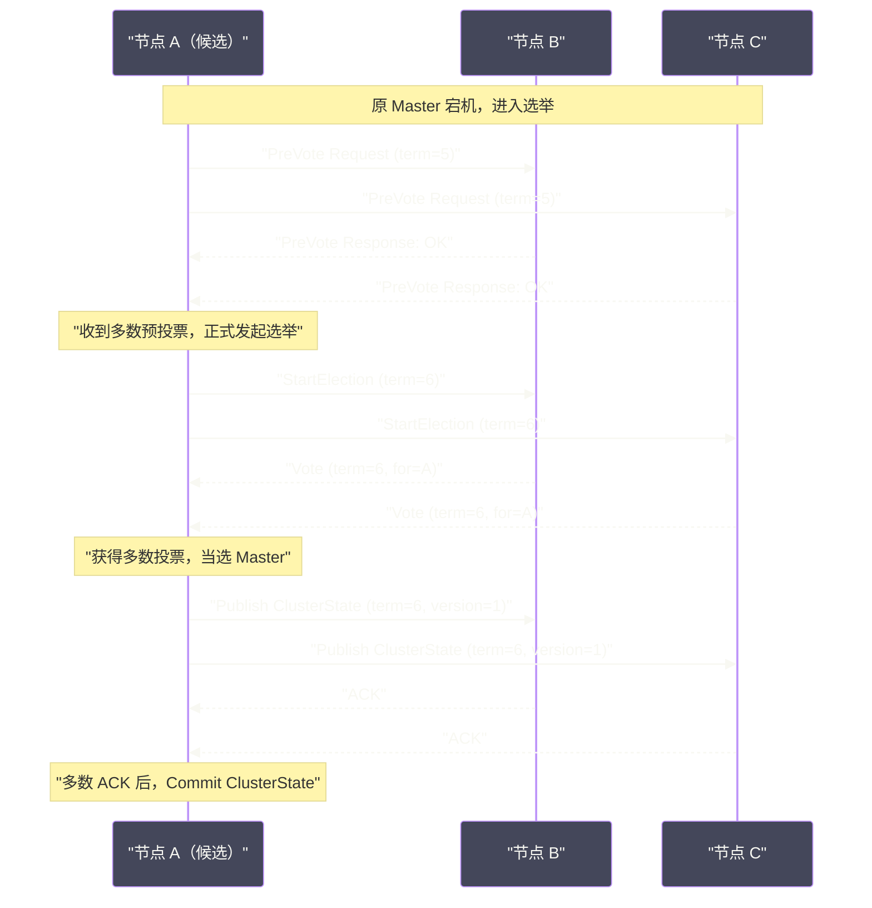

# 06 集群管理——选主、分片分配与脑裂防护

## 摘要

ES 集群的稳定性，最终依赖于一个核心角色：**Master 节点**。Master 负责维护集群的元数据（索引的 Mapping、Settings、分片的路由表），协调分片的分配与迁移，以及在节点加入/离开时更新集群状态。然而，分布式系统中最棘手的问题之一就是：**Master 节点宕机后如何重新选举？** 以及，更危险的情况——**网络分区（Network Partition）发生时，如何防止两个子网各自选出一个 Master，造成"脑裂"（Split-Brain）？**

本文从 ES 6.x 的基于 Zen Discovery 的选主机制，到 7.x 后基于 Raft 思想重写的全新选主协议，梳理脑裂问题的根源与解决方案，深入分析分片分配策略（Allocation Awareness、Filtering、Throttling）的工作原理，以及集群状态（Green/Yellow/Red）的真实含义。

---

## 第 1 章 Master 节点：集群的神经中枢

### 1.1 Master 节点做什么

在 ES 集群中，节点分为多个角色，其中 **Master-eligible 节点**（候选主节点）是可以参与选主的节点。每次只有一个 Master-eligible 节点被选为 **Active Master**（活跃主节点）。

Active Master 的职责：

- **维护集群元数据**：所有索引的 Mapping、Settings、Aliases，以及每个 Shard 分配在哪个节点上的路由表（Routing Table）——这些合称为 **Cluster State（集群状态）**；
- **协调分片分配**：当新索引创建、节点加入/离开、节点故障时，决定哪些 Shard 应该分配到哪些节点，发出 `allocate` / `move` 指令；
- **广播集群状态更新**：每次 Cluster State 变更，Master 将新版本的 Cluster State 广播给所有节点，所有节点以此为准更新自己的本地视图；
- **处理索引管理请求**：创建/删除索引、更新 Mapping/Settings 等元数据操作，必须经过 Master 节点执行，然后通过 Cluster State 广播同步。

> [!info] 核心概念：Cluster State 的重要性
> Cluster State 是整个集群的"共识基础"——所有节点必须对 Cluster State 保持一致的认知，才能正确路由查询和写入请求。如果两个节点对"Shard 1 在哪个节点"有不同的认知，就会产生路由错误，导致查询失败或数据丢失。这也是为什么 Master 的一致性至关重要。

### 1.2 Master-eligible 节点的数量选择

- **1 个**：无法容忍 Master 故障，Master 宕机后整个集群的元数据操作全部暂停（写入可能继续，但分片迁移、索引管理等操作无法进行）；
- **2 个**：无法解决脑裂问题（下文详述）；
- **3 个**（推荐）：可以容忍 1 个节点故障，可以防止脑裂（quorum = 2）；
- **5 个**：可以容忍 2 个节点故障，适合对可用性要求极高的场景。

一个节点可以同时具有多个角色（Master-eligible + Data + Ingest），但对于大规模生产集群，建议将 Master-eligible 节点**专用化**（`node.roles: [master]`），不承担数据存储职责，避免 GC Pause 或磁盘 IO 压力影响 Master 的心跳响应和选举稳定性。

---

## 第 2 章 ES 6.x 的 Zen Discovery 选主机制

### 2.1 Zen Discovery 的工作原理

ES 6.x 及之前版本使用 **Zen Discovery** 协议进行节点发现和主节点选举。理解它的工作方式，有助于理解 ES 7.x 为何要彻底重写这部分。

**节点发现（Node Discovery）：**

每个 ES 节点启动时，会尝试连接 `discovery.seed_hosts` 配置的种子节点列表（或通过 unicast discovery 广播）。节点通过 Ping 机制互相发现对方，建立节点视图（known nodes）。

**选主流程（Leader Election）：**

1. 每个 Master-eligible 节点向它已知的所有 Master-eligible 节点发送 Ping 请求，收集它们认为的当前 Master 是谁；
2. 如果超过半数（quorum）的节点都认为没有 Active Master，则进入选举阶段；
3. 候选主节点按照**节点 ID 字典序**排序，选择最小的节点 ID 作为"最优候选"（"bully 算法"的变体）；
4. 超过 `discovery.zen.minimum_master_nodes`（`minimum_master_nodes`，通常设置为 `(master_eligible_count / 2) + 1`）个节点同意该候选成为 Master，则该节点当选；
5. 新 Master 发布初始 Cluster State，通知所有节点。

### 2.2 Zen Discovery 的脑裂问题

脑裂（Split-Brain）是 Zen Discovery 最臭名昭著的问题。它发生在：

**场景描述**：集群有 3 个 Master-eligible 节点（A、B、C），`minimum_master_nodes = 2`。此时发生网络分区，A 与 B、C 之间的网络断开，但 B 和 C 之间仍然可以通信。

```
网络分区后：
子网 1：A（原 Master）
子网 2：B、C
```

- 子网 1：A 是原 Master，它认为自己仍然是 Active Master（它不知道自己与大多数节点失联了），继续提供服务，接受写入；
- 子网 2：B 和 C 发现失去了与 Master（A）的联系，且它们有 2 个节点（满足 `minimum_master_nodes = 2`），于是重新选举，B 当选为新 Master。

现在，A 和 B 都认为自己是 Active Master，各自在维护不同版本的 Cluster State，接受不同的写入——这就是脑裂。

**脑裂的后果：**
- 两个 Master 分别向各自的节点分配 Shard，同一个 Shard 的 Primary 可能在两个子网都存在；
- 两边都接受写入，数据产生分叉（同一文档 ID 在两边有不同版本）；
- 网络恢复后，数据无法自动合并，需要人工干预。

> [!warning] 生产避坑
> **`minimum_master_nodes` 参数是 ES 6.x 防脑裂的核心配置，必须设置为 `(master_eligible_count / 2) + 1`**。如果设置为 1 或忘记配置，一旦发生网络分区，脑裂几乎必然发生。大量 ES 生产事故的根源就是这个参数配置错误。

### 2.3 为什么 Zen Discovery 难以彻底解决脑裂

Zen Discovery 的根本问题在于：它的设计不是一个严格的分布式共识协议。`minimum_master_nodes` 只是一个"软约束"——它依赖每个节点正确地配置这个参数，以及网络分区时节点能够准确感知自己与多少个节点失联。在实际网络环境中，部分连通（partial connectivity）、时钟漂移等场景会使得这些假设失效，导致偶发的脑裂。

这就是为什么 ES 7.0 决定彻底重写选主机制。

---

## 第 3 章 ES 7.x+ 的全新选主协议：基于 Raft 的改造

### 3.1 从 Zen Discovery 到 Cluster Coordination

ES 7.0 引入了全新的 **Cluster Coordination** 模块，彻底替换了 Zen Discovery。新协议基于 [[ETCD|Raft]] 共识算法的核心思想，但做了适应 ES 场景的简化和改造。

**核心改进：**

1. **废除了 `minimum_master_nodes` 参数**：由 ES 自动计算 quorum（多数派），不再需要用户手动配置容易出错的参数；
2. **引入了"选举投票配置"（Voting Configuration）**：Master 节点会持久化一份"已知的 Master-eligible 节点集合"，选举时基于这份集合计算 quorum，而不是基于瞬时发现的节点数；
3. **严格的任期（Term）机制**：每次选举递增 term，低 term 的消息会被丢弃，防止旧 Master 的消息干扰新 Master；
4. **Pre-vote 机制**：候选节点在正式发起选举前，先收集大多数节点的"预投票"，确认自己有可能赢得选举，避免无效的选举轮次引发集群震荡。

### 3.2 Voting Configuration 机制

**Voting Configuration** 是 ES 7.x 选主的关键创新。它是一个持久化的集合，记录了"哪些 Master-eligible 节点的投票在当前 quorum 计算中有效"。

**Quorum 计算**：Voting Configuration 中超过一半（严格多数）的节点同意，即可完成选举或提交 Cluster State 变更。

**为什么需要持久化 Voting Configuration？**

考虑这个场景：集群有 3 个 Master-eligible 节点（A、B、C），C 节点永久下线（磁盘故障）。此时集群只有 A、B 可用，按照旧的 Zen Discovery，`minimum_master_nodes = 2`，A 和 B 仍然可以正常工作。

但如果没有持久化 Voting Configuration，ES 会认为 quorum 仍然需要 3 个节点（因为集群元数据里还记录着 C），A 和 B 永远无法达到 quorum，集群陷入无法选主的僵局。

通过 Voting Configuration，当 C 被确认永久下线后，管理员可以明确地将 C 从 Voting Configuration 中移除（通过 API `POST /_cluster/voting_config_exclusions?node_names=C`），之后 A 和 B 构成的 2 节点集合就满足 quorum（2/2 = 100% > 50%），可以正常选主。

### 3.3 新选主协议的选举流程



新协议明确区分了 **Pre-vote 阶段**（探测是否有可能获胜）和 **Election 阶段**（正式投票），加上严格的 Term 机制，从根本上杜绝了脑裂——在同一个 Term 内，不可能有两个节点同时获得多数投票。

---

## 第 4 章 Cluster State 的分发与版本管理

### 4.1 Cluster State 的内容

Cluster State 是 ES 集群中所有节点共同维护的"全局真相"，主要包含：

| 内容 | 说明 |
|:---|:---|
| **Nodes** | 集群中所有节点的 ID、地址、角色 |
| **Metadata** | 所有索引的 Mapping、Settings、Aliases、Templates |
| **Routing Table** | 每个索引每个 Shard 的 Primary 在哪个节点，Replica 在哪些节点 |
| **Blocks** | 集群/索引级别的写入、读取、元数据操作限制 |

每次 Cluster State 变更（添加/删除索引、分片迁移完成、节点加入/离开等），Master 都会递增 Cluster State 的版本号，然后将新版本广播给所有节点。

### 4.2 Cluster State 的发布流程

ES 7.x 的 Cluster State 发布使用两阶段提交（类似于 Raft 的 Log Replication）：

1. **Publish 阶段**：Master 将新 Cluster State 发送给所有节点，等待多数节点（Voting Configuration 中的 quorum）确认已接收；
2. **Commit 阶段**：收到 quorum 确认后，Master 广播 "Commit" 消息，所有节点将新 Cluster State 标记为 committed，开始应用。

这个两阶段确保了：即使 Master 在 Publish 阶段宕机，由于只有少数节点收到了新 Cluster State，下一任 Master 可以检测到这种"未提交"状态，选择回滚或重新提交，不会产生不一致。

---

## 第 5 章 分片分配：集群的负载均衡大脑

### 5.1 分片分配的时机

以下事件会触发分片重新分配（Rebalancing / Recovery）：

- **新索引创建**：新索引的所有 Primary Shard 需要被分配到各节点；
- **节点加入**：新节点加入后，Master 会将部分 Shard 迁移到新节点，实现负载均衡；
- **节点离开/故障**：原节点上的 Primary Shard 需要被重新分配，Replica 需要升级为 Primary 或重新复制；
- **Replica 数量变更**：增加副本数，Master 需要在其他节点上创建新的 Replica Shard；
- **手动执行 `_cluster/reroute`**：管理员主动触发分片重新分配。

### 5.2 分配决策：Shard Allocation Decider

ES 使用一组 **Shard Allocation Decider** 来决定某个 Shard 是否可以分配到某个节点。每个 Decider 独立做 YES/NO/THROTTLE 判断，所有 Decider 的结果综合后才决定是否分配。主要的 Decider 包括：

**SameShardAllocationDecider**：同一 Shard 的 Primary 和 Replica 不能在同一节点上。这是保障高可用的最基本约束——如果主副本在同一节点，节点宕机会导致数据丢失。

**DiskThresholdDecider**：基于磁盘使用率限制分配：
- `low`（默认 85%）：磁盘使用率超过此阈值的节点，不再接受新的 Shard 分配；
- `high`（默认 90%）：磁盘使用率超过此阈值的节点，ES 会将该节点的 Shard 迁移到其他节点；
- `flood_stage`（默认 95%）：触发紧急只读保护，该节点上的所有索引变为只读，防止磁盘写满导致 ES 崩溃。

**MaxRetryAllocationDecider**：某个 Shard 如果分配失败超过 5 次（默认），不再尝试自动分配，需要管理员手动干预（`_cluster/reroute?retry_failed=true`）。

**FilterAllocationDecider**：基于管理员设置的过滤条件（Allocation Filtering）决定分配，见下节。

### 5.3 Allocation Awareness：故障域感知

**Allocation Awareness** 是 ES 中最重要的高可用配置之一——让 ES 感知底层的物理拓扑（机架、可用区、数据中心），确保同一 Shard 的 Primary 和所有 Replica 分布在不同的故障域中。

**配置示例：**

在每个节点的 `elasticsearch.yml` 中标注所在可用区：
```yaml
# 节点 A、B（可用区 zone-a）
cluster.routing.allocation.awareness.attributes: zone
node.attr.zone: zone-a

# 节点 C、D（可用区 zone-b）
node.attr.zone: zone-b
```

在集群配置中启用 Allocation Awareness：
```http
PUT /_cluster/settings
{
  "persistent": {
    "cluster.routing.allocation.awareness.attributes": "zone"
  }
}
```

**效果**：对于有 1 个 Primary + 1 个 Replica 的索引，ES 会确保 Primary 和 Replica 分布在不同的 zone 中。即使 zone-a 整体宕机，zone-b 的副本仍然可用，集群保持 Green 或 Yellow 状态（而不是 Red）。

**Force Awareness（强制感知）**：

普通 Awareness 只是"尽量"分散，在节点不足时会退而求其次。**Force Awareness** 是强约束：

```http
PUT /_cluster/settings
{
  "persistent": {
    "cluster.routing.allocation.awareness.attributes": "zone",
    "cluster.routing.allocation.awareness.force.zone.values": ["zone-a", "zone-b"]
  }
}
```

启用 Force Awareness 后，如果 zone-b 完全宕机，ES **不会**将原本应分配在 zone-b 的 Replica 重新分配到 zone-a（因为这样会导致所有副本都在 zone-a，失去跨区容灾价值）。代价是：集群状态可能长时间保持 Yellow（Replica unassigned），但一旦 zone-b 恢复，这些 Replica 会自动回到 zone-b，保持拓扑设计的初衷。

### 5.4 Allocation Filtering：细粒度的分片控制

**Allocation Filtering** 允许管理员通过节点属性来精确控制哪些 Shard 可以分配到哪些节点。三个维度的过滤：

- `index.routing.allocation.include.{attr}`：只分配到包含该属性值的节点；
- `index.routing.allocation.exclude.{attr}`：不分配到包含该属性值的节点；
- `index.routing.allocation.require.{attr}`：必须分配到包含该属性值的节点（比 include 更严格）。

**典型应用场景：热温冷分层存储**

```yaml
# 热数据节点（SSD 磁盘）
node.attr.box_type: hot

# 温数据节点（HDD 磁盘）
node.attr.box_type: warm

# 冷数据节点（大容量 HDD 或对象存储挂载）
node.attr.box_type: cold
```

新创建的索引默认在热节点上：
```http
PUT /logs-2026-03-04
{
  "settings": {
    "index.routing.allocation.require.box_type": "hot"
  }
}
```

随着数据老化，通过 ILM（Index Lifecycle Management）自动将索引迁移到温/冷节点：
```http
PUT /logs-2026-03-04/_settings
{
  "index.routing.allocation.require.box_type": "warm"
}
```

执行此命令后，ES 会将该索引的所有 Shard 从热节点迁移到温节点，期间数据正常可读。

### 5.5 Rebalancing Throttle：控制分片迁移速度

分片迁移（Recovery）会消耗大量网络带宽和 IO。在生产环境中，节点扩容或故障恢复时，如果不加限制，大量 Shard 同时迁移会导致正常业务的查询延迟急剧上升。

ES 提供了多个 Throttle 参数：

```http
PUT /_cluster/settings
{
  "persistent": {
    "cluster.routing.allocation.node_concurrent_recoveries": 2,
    "cluster.routing.allocation.node_initial_primaries_recoveries": 4,
    "indices.recovery.max_bytes_per_sec": "100mb"
  }
}
```

- `node_concurrent_recoveries`：每个节点同时进行的 Shard 迁移数量（既包括作为数据源，也包括作为目标）；
- `node_initial_primaries_recoveries`：节点重启后，Primary Shard 从本地数据恢复的并发数（本地恢复不占用网络，可以设高一些）；
- `indices.recovery.max_bytes_per_sec`：跨节点迁移的带宽限制。

> [!warning] 生产避坑
> 节点扩容或故障恢复时，先将 `node_concurrent_recoveries` 降低（如设为 1），再触发 Rebalancing，避免大量并发迁移占满网络带宽和磁盘 IO，影响正常服务。等迁移完成后，再恢复默认值。

---

## 第 6 章 集群状态：Green / Yellow / Red 的真实含义

### 6.1 三种状态的定义

ES 集群状态是对所有索引状态的汇总：

| 状态 | 含义 | 是否可提供服务 |
|:---|:---|:---|
| **Green** | 所有 Primary Shard 和 Replica Shard 均已正常分配 | ✅ 完全正常 |
| **Yellow** | 所有 Primary Shard 已正常分配，但有 Replica Shard 未分配 | ✅ 可提供读写服务，但容错能力下降 |
| **Red** | 有 Primary Shard 未分配 | ⚠️ 部分索引无法提供读写服务（对应分片不可用） |

### 6.2 Yellow 状态的常见原因

**原因一：副本数超过数据节点数。**

如果你有 1 个数据节点，但索引设置了 `number_of_replicas: 1`，则 Replica Shard 无处分配（不能与 Primary 在同一节点），集群状态永远是 Yellow。

解决方案：
```http
PUT /my-index/_settings
{
  "index.number_of_replicas": 0
}
```
单节点测试环境，副本数应设为 0。

**原因二：节点宕机后，Replica Shard 未能成功迁移。**

节点宕机后，该节点上的 Replica Shard 变为 Unassigned，集群变 Yellow。等待 `index.unassigned.node_left.delayed_timeout`（默认 1 分钟）后，ES 开始尝试在其他节点上重新分配这些 Replica。如果其他节点磁盘空间不足，或触发了 `MaxRetryAllocationDecider` 的失败次数限制，Replica 将长期处于 Unassigned，集群持续 Yellow。

**原因三：索引 Shard 过多，部分 Shard 等待分配。**

`cluster.routing.allocation.node_concurrent_recoveries` 限制了并发迁移数。如果等待分配的 Shard 数量远大于并发限制，部分 Shard 会排队等待，集群处于 Yellow。

诊断命令：
```http
GET /_cluster/allocation/explain
```
这是 ES 提供的最有价值的诊断工具，会详细说明某个 Unassigned Shard 无法分配的原因（"节点磁盘空间不足"、"等待重试"、"过滤规则阻止"等）。

### 6.3 Red 状态：Primary Shard 丢失

集群变 Red 意味着某些 Primary Shard 不可用，对应的数据无法读写。常见原因：

**原因一：所有持有某 Shard 数据的节点同时宕机。**

如果一个 Shard 的 Primary 和所有 Replica 都在同时宕机的节点上（比如机架整体故障，而没有配置 Allocation Awareness），该 Shard 数据丢失，集群变 Red。

**原因二：磁盘数据损坏，Shard 无法正常加载。**

节点重启后，Shard 数据文件损坏（校验和不匹配），导致 Shard 加载失败，Primary Shard 无法恢复。

**原因三：`allocate_stale_primary` 后的数据不一致。**

在极端故障恢复场景中，管理员可能手动执行 `allocate_stale_primary`（强制从过时数据中恢复 Primary），导致部分最新写入丢失，但 Shard 恢复可用，集群从 Red 恢复到 Yellow 或 Green。

> [!warning] 生产避坑
> 集群状态变 Red 后，**永远不要急于执行 `allocate_stale_primary`**。应该先充分排查：
> 1. 确认是否有持有该 Shard 数据的节点仍在网络中（可能是因为节点启动慢）；
> 2. 检查 `_cat/shards?h=index,shard,prirep,state,unassigned.reason` 确认未分配原因；
> 3. 尝试 `_cluster/reroute?retry_failed=true` 让 ES 重试分配；
> 4. 只有在确认数据节点永久丢失、无法恢复时，才考虑 `allocate_stale_primary`，并做好相应的数据丢失预案。

---

## 第 7 章 集群规模化的稳定性挑战

### 7.1 大型集群的 Cluster State 膨胀问题

当集群有数千个索引、每个索引有数十个 Shard 时，Cluster State 可能膨胀到数十 MB，甚至数百 MB。每次 Cluster State 更新，Master 都需要将完整的 Cluster State 广播给所有节点。

ES 7.2+ 引入了 **Incremental Cluster State Update**——只广播 Cluster State 的**变更部分（diff）**，而非完整的 Cluster State，大幅降低了大型集群的 Cluster State 广播开销。

### 7.2 Shard 过多对 Master 的压力

ES 有一个黄金法则：**每个节点的 Shard 数量应控制在合理范围内**。通常建议每 GB Heap 管理不超过 20 个 Shard（保守值）或 50 个 Shard（激进值）。

Shard 数量过多的代价：
- Master 需要维护更大的 Routing Table（Cluster State 更大）；
- 节点启动/重启时，需要恢复更多的 Shard，启动时间更长；
- 全局查询需要在更多 Shard 上并行执行，overhead 增加。

ES 7.7+ 引入了 `cluster.max_shards_per_node`（默认 1000）参数，超过此限制后，新建索引请求会被拒绝。

**减少 Shard 数量的方法：**
- 合并小索引：使用 `_reindex` 将多个小索引合并为一个大索引；
- 使用 `_shrink` API 将多 Shard 索引压缩为少 Shard 索引（Shard 必须在同一节点）；
- 使用 ILM 的 `rollover` 策略，控制单个索引不超过合理大小（如 50GB），到期自动滚动新索引而非无限增大单个索引。

### 7.3 Master 节点的 GC 问题

Master 节点处理大量 Cluster State 广播和分片分配决策，频繁创建大对象（序列化/反序列化 Cluster State）。如果 Master 节点与数据节点混用，数据节点的查询/索引操作产生的 GC 压力可能导致 Master 心跳响应超时，误触发重新选举，造成集群震荡。

生产建议：
1. **专用 Master 节点**（不存储数据，`node.roles: [master]`）；
2. Master 节点的 Heap 设置适中（8~16GB 通常足够，不需要很大），过大的 Heap 会导致 GC STW 暂停时间更长；
3. 使用 G1GC，并配置 `-XX:MaxGCPauseMillis=200` 限制最大 GC 暂停时间。

---

## 小结

本文深入梳理了 ES 集群管理的核心机制：

- **Master 节点**是集群的神经中枢，负责维护 Cluster State、协调分片分配；Master-eligible 节点建议 3 个或 5 个，生产集群建议专用化；
- **Zen Discovery（ES 6.x）**通过 `minimum_master_nodes` 防脑裂，但配置错误或网络异常时仍可能发生脑裂；**ES 7.x 的 Cluster Coordination** 基于 Raft 思想彻底重写，通过 Voting Configuration + Term + Pre-vote 机制从根本上解决了脑裂问题；
- **Allocation Awareness**（按可用区分散 Shard）和 **Allocation Filtering**（按节点属性控制分片位置）是实现高可用拓扑和热温冷分层的核心工具；
- **集群状态 Green/Yellow/Red** 反映了 Shard 的分配健康度，`_cluster/allocation/explain` 是诊断 Unassigned Shard 的第一工具；
- 大型集群需要关注 Cluster State 膨胀、Shard 数量过多对 Master 的压力，以及 GC 导致的选举震荡。

下一篇文章将聚焦 ES 的性能调优——Mapping 设计原则、查询优化技巧与 JVM 参数调优。

---

> [!note] 思考题
> 1. ES 的动态 Mapping 自动推断字段类型——字符串默认被映射为 `text`（全文搜索）+ `keyword`（精确匹配）双字段。这种默认行为会导致索引膨胀——很多字段可能只需要 `keyword`（如 IP 地址、订单号）。在什么场景下你需要禁用动态 Mapping（`dynamic: strict`）？显式定义 Mapping 对索引性能和存储有什么影响？
> 2. `text` 类型经过分词器处理后存储为倒排索引，`keyword` 类型存储原始值的 Doc Values（用于聚合和排序）。如果一个字段既需要全文搜索又需要聚合（如商品名称），使用 `text` + `keyword` 子字段是标准做法。但这意味着数据存储了两份——在存储空间敏感的场景中有什么替代方案？
> 3. Nested 类型用于存储对象数组——每个嵌套对象作为独立的 Lucene 文档存储。查询 Nested 对象需要使用 `nested` 查询。如果一个文档有 1000 个 Nested 对象，实际上在 Lucene 中存储了 1001 个文档。大量 Nested 对象对写入和查询性能的影响有多大？`index.mapping.nested_objects.limit` 的默认值是多少？
