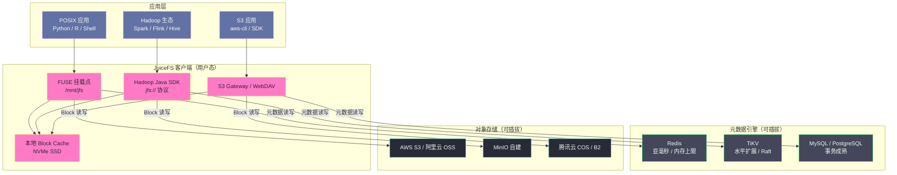
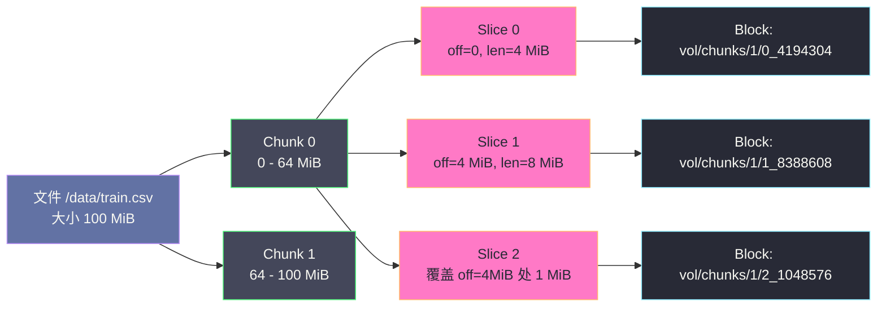
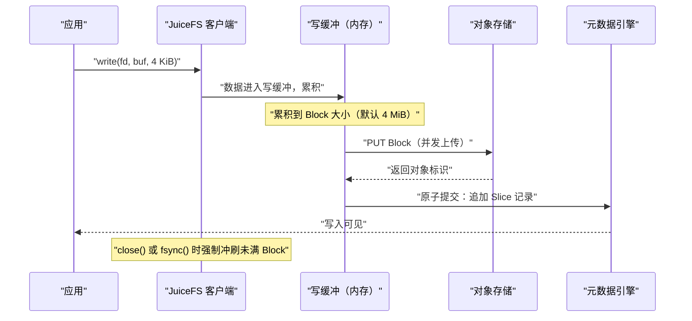
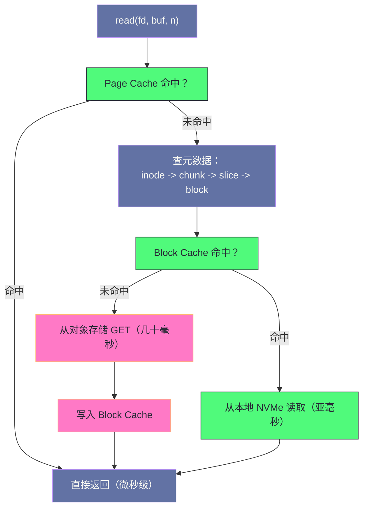

# 01 JuiceFS 全局架构——元数据引擎与对象存储的分离设计

**摘要：**

本文从 HDFS 赖以成立的四个工程假设出发，说明这些假设如何在容器化与云计算环境中逐一失效，进而引出 JuiceFS 的核心设计——把文件系统的**元数据**与**数据**分别交给最擅长各自场景的系统承担。文章首先厘清 JuiceFS 的定位边界：它不是又一个分布式存储集群，而是一层运行在用户态的**文件系统语义适配层**；随后逐层拆解它的三层架构（客户端、可插拔元数据引擎、对象存储），讲透数据侧的 Chunk → Slice → Block 三层映射如何在"对象不可变"的前提下实现 POSIX 随机写，以及元数据侧 inode/dentry/chunk/session 四类结构如何映射到键值存储。在此基础上给出读写路径全链路与一致性模型（close-to-open）的准确边界，并集中讨论它**不适合**的场景与常见误区。全文回答两个问题：JuiceFS 为什么要把元数据与数据拆开，以及拆开之后代价落在哪里。

---

## 第 1 章 一个时代的存储假设正在失效

### 1.1 HDFS 的四条隐含假设

要理解 JuiceFS 为什么长成今天这个样子，不妨先把时间拨回 2006 年前后，从 [[01 HDFS 的诞生——大规模分布式存储的工程哲学|HDFS]] 的起点看起。彼时的 Hadoop 生态解决的是一个非常具体的问题：用成百上千台廉价商用服务器，堆出一个容量以 PB 计、成本远低于高端存储阵列的可靠存储系统。HDFS 的每一个设计决策，都是为这个目标服务的。

把这些决策翻译成工程假设，大致有四条。

**假设一：存储节点与计算节点同址。** HDFS 把 DataNode 与运行 MapReduce 的 TaskTracker 部署在同一批机器上，靠"数据本地性"（Data Locality）把计算调度到数据所在的节点，用这种方式规避千兆网络时代的带宽瓶颈。这个假设在批处理作业独占集群、拓扑稳定的年代是成立的。

**假设二：数据块是有状态的、可原地修改的。** DataNode 上的块文件归 DataNode 自己管理，副本的增删改由 NameNode 下发指令，DataNode 直接在本地磁盘上落地。也就是说，HDFS 拥有对自己磁盘的完整控制权，可以决定一个块放在哪个扇区、什么时候做副本校验、什么时候原地重写。

**假设三：元数据规模可控，可以全部塞进单机内存。** NameNode 把整个命名空间（inode 与目录项）常驻 JVM 堆内存，换来 O(1) 级别的路径解析。代价是元数据规模被物理内存封顶。

**假设四：集群是长期稳定存在的资产。** HDFS 集群的扩容、缩容、升级都是有计划的重量级操作，DataNode 下线要走"等待副本迁移完成"的流程，集群的生命周期以年计。

这四条假设共同支撑起了 HDFS 的可靠性模型与性能模型。问题在于，云计算与容器化普及之后，它们一条一条地松动了。

### 1.2 假设逐一失效之后

先看本地性。在 Kubernetes 或 YARN 的弹性调度环境中，计算 Pod 的位置由调度器决定，随时可能落到任意节点上；存储节点若还是固定的一批 DataNode，那么"把计算调度到数据所在节点"这件事就变成了一场概率游戏。节点越弹性，本地性命中率越低，HDFS 最核心的性能优势随之蒸发。

再看状态性。对象存储（S3、OSS、COS、MinIO 等）在云上以按量付费、近乎无限扩展、免运维的姿态成为数据湖的事实存储层，但它的语义与 HDFS 完全不同：**对象是不可变的**，只有 PUT（整对象覆盖）与 GET（整对象读取），没有原地修改，也没有"目录"这个实体——所谓目录只是一串以斜杠分隔的前缀。HDFS 那套"直接管理磁盘块"的假设，在对象存储面前完全不适用。

然后是元数据规模。当业务从"几万个文件"变成"几十亿个小文件"（AI 训练样本、日志切片、时序数据分片）时，NameNode 的内存就成了硬约束。一个 inode 连同目录项、权限、时间戳等属性，在堆中大约占用 150 到 300 字节，128 GiB 堆的 NameNode 大致能支撑四亿个文件量级（关于这套内存模型的细节，可参见 [[02 HDFS 整体架构全景——NameNode、DataNode 与 Client 三角关系]]）；再往上走，要么上 HDFS Federation 拆分命名空间，要么接受运维复杂度的陡增。

最后是生命周期。云原生环境里，计算节点是"用完即弃"的；存储层若仍然要求"存算同址、长期在线"，就等于把弹性计算的收益拱手让出。

行文至此，一个结论已经浮出水面：**HDFS 并没有做错什么，它只是忠实服务于一个正在退场的时代。** 当存储层换成对象存储、计算层换成弹性容器之后，中间缺的不是"更快的 HDFS"，而是一层能把对象存储的原始字节重新翻译成 POSIX 文件语义的东西。

### 1.3 语义鸿沟：POSIX 与对象存储之间的翻译成本

如果不做这层翻译，会怎样？直接让 Spark、Python、R 这些工具去操作对象存储的 PUT/GET，会遇到三处硬伤。

其一是**随机写**。POSIX 允许 `pwrite(fd, buf, 1, offset)` 在文件中间覆盖一个字节；对象存储只能整对象覆盖，一个 10 GiB 的文件改一个字节就要重传 10 GiB。其二是**原子重命名**。POSIX 的 `rename()` 是原子的，这是无数工具（包括 Iceberg、Delta Lake 这类表格式）实现"原子提交"的基石；对象存储的 rename 是 copy 加 delete，中间存在可见的窗口，不是原子操作。其三是**目录与元数据操作**。`ls`、`stat`、`mkdir` 在 POSIX 下是毫秒级的内存操作，在对象存储下则退化为一次或多次网络请求加前缀枚举，延迟从微秒级跳到几十毫秒。

笔者常做一个类比：HDFS 像一座"自带仓库的工厂"，工人和货架在同一栋楼里，取料靠走几步路；对象存储像一座"第三方云仓"，容量无限、价格低廉，但每次取料都要开一张运单，且仓库只认整箱进出、不认零散拿取。JuiceFS 要做的，就是在这座云仓门口设一个**调度台**——把零散的取料需求攒成整箱运单，同时把"哪件货在哪个箱子里"的账本放在手边。

---

## 第 2 章 是什么：JuiceFS 的定位与边界

### 2.1 一句话定义

JuiceFS 是一个**面向云原生场景的 POSIX 兼容分布式文件系统**，由 Juicedata 开发并于 2021 年开源。它的核心设计可以压缩成一句话：**元数据存放在用户自选的数据库里，文件内容以对象形式存放在用户自选的对象存储上，二者由运行在用户态的客户端粘合成一个标准的文件系统。**

这句话里有三个"用户自选"，恰恰是它与其他分布式文件系统最根本的分野。

### 2.2 它不是分布式存储集群，而是文件系统语义适配层

需要先破除一个直觉误区：JuiceFS 本身不提供数据冗余，也不管理磁盘。

- 数据的可靠性由**对象存储**负责（S3 自带多副本或纠删码，MinIO 可配置纠删码），JuiceFS 只是往对象存储里写对象、从里面读对象。
- 元数据的可靠性由**元数据引擎**负责（Redis 的 AOF/RDB 与 Sentinel、TiKV 的 Raft 多副本、MySQL 的主从复制），JuiceFS 只是往里面写键值。
- 两者之间的**映射关系与语义**，由客户端在内存中计算。

换句话说，JuiceFS 不建造存储，它**编排**存储。这一点决定了它的运维模型：你不需要为 JuiceFS 维护一套存储集群，但你必须同时维护好元数据引擎与对象存储——这是它的收益，也是它的代价，后文第 9 章会专门讨论这个代价的边界。

### 2.3 与同类方案的定位差异

把 JuiceFS 放进同一张坐标系里对比，才能看清它占的那一格。

| 维度 | JuiceFS | HDFS | CephFS | Alluxio | S3FS |
|---|---|---|---|---|---|
| 元数据存放 | 外部数据库（Redis/TiKV/SQL） | NameNode 内存 | MDS 内存 + 日志 | 主节点内存 | 无独立元数据，靠对象列举 |
| 数据存放 | 任意对象存储 | DataNode 本地盘 | RADOS（自建） | 底层存储（HDFS/S3） | 对象存储 |
| 是否有服务端进程 | 无（可选 Gateway） | 有（NN + DN） | 有（MON + MDS + OSD） | 有（Master + Worker） | 无 |
| 服务端角色 | — | 存储 + 计算同址 | 自建统一存储 | 缓存加速层 | 纯 FUSE 映射 |
| 一致性模型 | 元数据强一致 + close-to-open | 强一致 | 强一致 | 可配置 | 依赖对象存储 |
| 弹性扩缩容 | 计算侧随容器扩缩 | 存算耦合 | 存储侧扩缩需数据迁移 | 计算侧可扩缩 | 随容器扩缩 |
| 运维面 | 元数据库 + 对象存储 | 集群运维 | 集群运维 | 集群运维 | 无 |

有一处细节值得单独点出：**Alluxio 是缓存层，JuiceFS 是文件系统。** Alluxio 的前提是底层已经有一份"权威数据"（在 HDFS 或 S3 上），它缓存的是这份数据的副本，缓存未命中就回源；而 JuiceFS 的元数据引擎是唯一权威，它不是在缓存一份别处的目录树，它**就是**那个目录树。这个区别决定了二者在"数据是否可以在底层被绕过修改"这个问题上的假设完全不同——Alluxio 允许底层被别的系统直接改写，JuiceFS 则要求所有写入都经过它自己。

再补一处容易被混为一谈的对比：CephFS 与 JuiceFS 都提供 POSIX 语义，但前者的数据落在自建 RADOS 集群里，后者落在外部对象存储上。因此 [[01 Ceph 全局架构——RADOS、CRUSH 与三大存储接口|Ceph]] 的数据路径完全绕过操作系统与网络协议栈，在高并发随机小 IO 上占优；而 JuiceFS 的数据路径每次都要经过对象存储的 PUT/GET，在大文件顺序吞吐与多客户端共享上占优。这不是谁替代谁的关系，而是两种成本结构的取舍，[[08 CephFS——MDS、多活元数据与实践边界|CephFS]] 那一篇会把这条对比线补完。

### 2.4 与 S3FS 的关键差别：有没有"权威元数据"

S3FS 与 JuiceFS 表面上都是"把对象存储挂成文件系统"，但二者的架构性质完全不同，值得单独辨析，因为选型时最容易在这里踩坑。

S3FS 没有独立的元数据存储，它靠对象存储的 LIST 接口来推断目录结构：`ls /data` 就等价于"列出前缀 `data/` 下的所有对象并归并出直接子项"，`stat` 一个文件就等价于"HEAD 这个对象"。这意味着它的每一次元数据操作都是一次对象存储请求，复杂度与目录内对象数量相关，且对象存储的请求计费会直接落到元数据操作上。更麻烦的是语义缺口：S3FS 无法高效实现原子 rename（只能 copy 加 delete），也无法在多个客户端之间维持一致的目录视图。

JuiceFS 把"权威元数据"抽出来放在元数据引擎里，于是 `ls` 变成一次 Hash 读取（或一次带索引的 SQL 查询），`rename` 变成一次原子更新。**有没有权威元数据，决定了元数据操作的复杂度是 O(1) 还是 O(N)，也决定了能否实现真正的 POSIX 语义。** 这是 JuiceFS 相对 S3FS 一类方案最本质的改进，而不是"性能调优"层面的差别。

---

## 第 3 章 为什么这样设计：两类 I/O 的天然分野

### 3.1 元数据与数据的 I/O 特征几乎相反

JuiceFS 全部设计的第一性依据，是一个朴素的观察：**文件系统的元数据操作与数据读写，在延迟、体积、访问模式三个维度上几乎是两个物种。**

| 特征 | 元数据操作（`ls`/`stat`/`mkdir`/`rename`） | 数据读写（`read`/`write`） |
|---|---|---|
| 延迟敏感度 | 极高，期望亚毫秒到毫秒 | 相对宽松，几十毫秒可接受 |
| 单次体积 | 几十到几百字节 | 从 KB 到 GB 不等 |
| 访问模式 | 随机键值查找、高频小操作 | 大块顺序读写为主 |
| 并发形态 | 极高 QPS、低带宽 | 低 QPS、高带宽 |
| 规模增长维度 | 随**文件数量**增长 | 随**数据总量**增长 |
| 最优载体 | 内存型 KV / 分布式 KV | 对象存储 / 分布式块存储 |

如果强行用一种系统承担两类负载，必然有一方被牺牲。把元数据塞进对象存储，每次 `stat` 都要一次网络 GET，一次 `ls` 一个含万级文件的目录就要枚举上万次，延迟直接爆炸；把数据塞进内存型 KV，成本高到不可接受。

### 3.2 不这样会怎样：三条被否决的路线

**路线一：元数据也放对象存储。** 这是 S3FS 一类的做法——没有独立元数据，靠 LIST 对象来推断目录结构。后果是 `ls` 与 `stat` 的复杂度从 O(1) 退化到 O(前缀枚举)，且对象存储的 LIST 是分页的、最终一致的（历史版本），并发写下的目录视图无法保证。用这种方式跑一个包含十万文件的目录，一次 `ls` 就是几十秒。

**路线二：自建统一存储集群。** 这是 Ceph 的做法——用 RADOS 同时承载对象、块、文件三种接口，元数据与数据都在自建集群内，语义可以做到完全可控。代价是运维面：一个生产级 Ceph 集群需要 Monitor、Manager、OSD、MDS 多个守护进程协同，容量规划、PG 调优、故障恢复都需要专门的团队。对于"只想有个共享文件系统给 Spark 用"的团队，这是明显的过度设计。

**路线三：只做缓存层。** 这是 Alluxio 的做法——不拥有权威数据，只加速访问。它解决不了"底层对象存储没有 POSIX 语义"这个根本问题，因为最终一致性、原子 rename 这些语义仍然缺位。

JuiceFS 选的是第四条路：**把两类负载分派给两个各自成熟、各自可替换的系统，客户端只负责翻译与编排。** 这条路的好处是每一层都能用现成的、经过大规模验证的组件；代价是引入了"两个外部依赖"和"跨系统一致性"这两个新问题。

### 3.3 为什么不做自有服务端

JuiceFS 的客户端完全运行在用户态（Go 语言实现），没有独立的服务端进程。这不是偷懒，而是一个有意的取舍。

有服务端，就意味着要有服务端的高可用、要有客户端与服务端的连接管理、要有服务端的容量规划与升级窗口——这些都是 HDFS NameNode 二十年运维经验的来源，也是它的负担来源。没有服务端，客户端的每一次元数据操作就是一次对元数据引擎的直接访问，链路更短、延迟更低；元数据引擎的高可用直接复用了 Redis Sentinel / TiKV Raft 的成熟能力，JuiceFS 不需要自己再造一套选主与复制。

这个取舍的代价在于：**客户端要承担更多的逻辑复杂度**（缓存管理、并发控制、重试、故障降级都在客户端），且一旦元数据引擎不可用，所有客户端同时失去服务能力，没有"服务端兜底"的余地。第 9 章会把这一点作为核心风险展开。

> [!note] 设计哲学
> JuiceFS 的架构取向可以概括为"**用编排替代建造**"。它不试图成为最强的存储系统，而是把"文件系统语义"这一层从存储硬件里剥离出来，做成一个可以架在任何元数据库与任何对象存储之上的适配层。这样做的直接收益是弹性和低成本，间接收益是每一层都可以独立演进——换元数据引擎不必动数据，换对象存储不必动元数据。

---

## 第 4 章 架构组成：客户端、元数据引擎、对象存储

### 4.1 架构全景



图中最值得注意的是**没有任何一个方块是 JuiceFS 自己的常驻服务端**：客户端进程活在应用所在的那台机器上，元数据引擎与对象存储都是别人家的成熟系统。

### 4.2 客户端：三个入口，一套内核

JuiceFS 客户端对外提供三种接入方式，它们的适用场景不同，但底层共用同一套元数据与数据访问逻辑。

**FUSE 挂载点**是最通用的入口。客户端通过 FUSE（Filesystem in Userspace）内核模块把自身注册成一个文件系统，应用的所有 `open`/`read`/`write`/`mkdir` 系统调用被内核转发给用户态的 JuiceFS 进程。它的优点是**语义最完整**——任何走系统调用的程序（Python、R、Shell 脚本、Java NIO）都能透明使用；代价是 FUSE 的上下文切换开销：每一次系统调用都要经历"内核 → 用户态 → 内核"的往返，在高 IOPS 场景下这笔开销不可忽略。

**Hadoop Java SDK** 是给大数据生态准备的入口。Spark、Flink、Hive 这些框架统一通过 Hadoop 的 `FileSystem` 抽象类访问存储，JuiceFS 实现了 `io.juicefs.JuiceFileSystem`，把 `jfs://` 协议注册进去，框架就把它当成一个普通的 HDFS 兼容文件系统。这条路径**绕过了 FUSE**，Java 进程直接调用 JuiceFS 的 Go 内核（通过 JNI），省掉了内核态往返，在大数据批处理场景下吞吐更好。

**S3 Gateway 与 WebDAV** 是给"不会说 POSIX 的客户端"准备的。有些工具只会说 S3 协议（比如某些备份软件），有些只会说 WebDAV，Gateway 让同一个 Volume 同时暴露 S3 兼容接口，实现多协议共享同一份数据。

### 4.3 元数据引擎：可插拔的大脑

元数据引擎是 JuiceFS 的"大脑"，它必须满足两个硬性要求：**支持事务或原子操作**（因为一次 `rename` 可能涉及多个键的原子变更），以及**支持高并发随机键值读写**。满足这两点的系统不少，各自的特征差异很大。

| 后端 | 延迟量级 | 容量上限 | 一致性 | 适用规模 |
|---|---|---|---|---|
| Redis | 亚毫秒 | 受内存限制 | 单实例内强一致（Lua 保证原子） | 亿级文件以内，延迟敏感 |
| TiKV | 毫秒级 | 水平扩展 | Raft 强一致 | 十亿级文件以上 |
| MySQL / PostgreSQL | 毫秒级 | 单机（可主从） | 事务强一致 | 千万级文件，复用现有 DBA 能力 |
| SQLite | 微秒级 | 单机文件 | 本地事务 | 单机测试，不支持多客户端并发 |
| Badger | 亚毫秒 | 单机磁盘 | 本地事务 | 单机部署、嵌入式场景 |

需要特别说明 Redis 的原子性来源：[[01 Redis 全局架构——一次请求的完整生命周期|Redis]] 本身并不提供跨键事务的强保证，JuiceFS 是把多个操作打包成一段 **Lua 脚本**交给 Redis 执行——Lua 脚本在 Redis 中是原子执行的，这就在单实例内实现了"多键原子更新"。所以 Redis 后端的可靠性边界是"单实例内原子 + 外部 Sentinel 做故障转移"，而 TiKV 与 SQL 后端的一致性是由分布式共识或数据库事务原生提供的。至于 TiKV，它的底层是 RocksDB，也就是一条从 [[01 LevelDB 全局架构——LSM-Tree 的写优化设计|LevelDB]] 演进出来的 LSM-Tree 路线（这条演进线的细节见 [[05 从 LevelDB 到 RocksDB——优化与演进]]），因此它的写放大与 Compaction 行为会直接反映为元数据延迟的抖动。

### 4.4 对象存储：只负责不透明的字节

JuiceFS 对对象存储的要求出人意料地低：只要能 PUT、GET、DELETE、LIST，并支持分片上传（Multipart Upload）即可。它**不需要**对象存储理解文件语义，也不需要对象存储提供目录、重命名、原子性——这些全部由元数据引擎承担。

这个分工带来一个漂亮的性质：**JuiceFS 的数据块在对象存储里是"不透明"的**。对象键名只携带卷名、块标识与长度信息，不含任何业务语义。这意味着对象存储可以被替换、被镜像、被分层（如把冷块下沉到归档存储），而文件系统的目录树完全不受影响。

---

## 第 5 章 数据存储模型：Chunk → Slice → Block

### 5.1 三层映射

JuiceFS 把文件内容切成三层结构，理解这三层是理解它一切数据行为的基础。

**Chunk（逻辑段）**：文件按固定的 **64 MiB** 为单位划分。Chunk 是纯逻辑概念，不落盘、不占空间，它只是元数据里"文件 → 数据段"映射的索引单位。文件第 N 个 64 MiB 区间就是第 N 个 Chunk。

**Slice（写操作单元）**：每一次写入在目标 Chunk 内产生一个 Slice，记录偏移、长度以及它引用的 Block 列表。同一个 Chunk 内允许多个 Slice 共存，且 Slice 之间**允许重叠**——这是实现随机覆盖写的关键。

**Block（对象存储单元）**：Slice 的数据被切成固定大小的 Block（默认 **4 MiB**），每个 Block 作为一个独立对象写入对象存储。对象键名大致形如 `{卷名}/chunks/{chunk_id}/{block_index}_{block_size}`。



### 5.2 不可变对象上的随机写

对象存储只支持整对象覆盖，POSIX 却要求支持 `pwrite` 式的随机写，这个矛盾必须由元数据层面化解。

JuiceFS 的解法是**只追加新 Slice，绝不修改旧 Block**：一次覆盖写在目标 Chunk 内生成一个新的 Slice，元数据中记录它与既有 Slice 的重叠关系；读取时按"从后往前"的顺序遍历该 Chunk 的 Slice 列表，用最新的 Slice 覆盖旧的，从而还原出每个偏移量的最新数据。旧 Block 保持原样，直到再也没有任何 Slice 引用它。

这套机制在语义上等价于**写时复制（Copy-on-Write）**，其原理与 [[Copy-on-Write原理|写时复制]] 在文件系统与内存管理中的经典应用一脉相承。它带来的直接好处是并发安全——两个客户端同时写同一个 Chunk 的不同偏移，各自生成自己的 Slice，互不干扰；带来的直接代价是**空间放大**——一次 1 MiB 的覆盖写若跨在 Block 边界上，可能要重写整个 4 MiB Block，旧 Block 在被回收前仍占着空间。

类比一下：这就像一份合同的修订，不是把原稿涂改，而是每次修订都附一张"修订页"，并声明"本页覆盖第 3 条"。查阅时从最新修订页往前翻，谁最后改的就以谁为准。等修订页攒得太多，再统一誊抄成一份干净的新稿——那就是 Compaction。

### 5.3 Compaction：把碎片重新誊抄

当一个 Chunk 内的 Slice 数量累积到阈值时，客户端会在后台上做一次 Compaction：把该 Chunk 内所有 Slice 按覆盖关系归并，合并成一个或少数几个大 Slice，重新上传成连续的大 Block，并释放不再被引用的旧 Block。它同时完成了两件事——**降低读取时的 Slice 查找开销**（读一个 Chunk 不再需要遍历上百个重叠 Slice），以及**回收对象存储空间**。

需要留意的是，Compaction 本身是有成本的：它要把数据读下来再写回去，因此会产生额外的对象存储请求与流量。对于"写一次、读很多次"的归档型数据，这个成本可以忽略；对于"反复随机覆盖写"的负载（譬如数据库文件），Compaction 会持续消耗带宽，这也是第 9 章要把这类负载列为反例的原因之一。

### 5.4 与 HDFS Block、S3 Multipart 的对比

| 维度 | HDFS Block | S3 Multipart | JuiceFS Block |
|---|---|---|---|
| 典型大小 | 128 MiB | 分片 5 MiB - 5 GiB | 默认 4 MiB（最大 16 MiB） |
| 是否可原地修改 | 可（副本重写） | 否（分片不可改，只能整体重传） | 否（新 Slice 覆盖） |
| 元数据归属 | NameNode | 无（由客户端组装） | 元数据引擎 |
| 随机写支持 | 支持 | 不支持（需重传整个对象） | 支持（Slice 覆盖关系） |
| 空间放大来源 | 副本（3 倍） | 重传 | 未回收的旧 Block + 副本 |

从这张表可以读出 JuiceFS 的一个基本取向：**它把"可靠性"完全外包给对象存储，自己只解决"语义"与"性能"。** Block 之所以取 4 MiB 这个相对小的值，正是因为对象存储的 PUT 以"请求数"计费且按对象计最小存储单位，块太大则随机写放大严重、块太小则请求数爆炸——4 MiB 是在这两个约束之间找到的经验平衡点。

### 5.5 大文件写入：分片上传与并发

Block 的默认大小决定了单次对象写入的体量，而写入的**并发度**决定了单客户端的吞吐上限。这两件事在 JuiceFS 里是分开控制的：`--max-uploads` 控制同时进行的 Block 上传数量，写缓冲的大小控制"攒多少数据再发车"。

对顺序写大文件（视频转码输出、模型权重落盘）而言，吞吐的瓶颈通常不在 CPU 也不在本地磁盘，而在"单次对象 PUT 的往返延迟"与"并发连接数"的乘积。设单次 PUT 的有效耗时为 T（含建连、签名、传输、确认），并发度为 C，则理论吞吐约为 `C × BlockSize / T`。这个式子解释了为什么调大并发度对写吞吐的收益是线性的，也解释了为什么在网络往返延迟高的跨区域场景下，同样的并发度只能换来更低的吞吐——此时应当优先考虑把对象存储与计算放在同一区域，而不是一味加大并发。

反过来，并发度也不是越大越好。对象存储对单个前缀（Prefix）有请求速率上限（以 AWS S3 为例，每前缀每秒约 3500 次写、5500 次读），并发过高会触发限流（HTTP 503 与 `SlowDown`），JuiceFS 客户端随即进入重试退避，实际吞吐反而下降。JuiceFS 为此提供了把 Block 分散到多个前缀的配置，通过打散对象键名来把请求摊到不同的限流桶上——这是"用命名空间的冗余换吞吐上限"的典型手法。

---

## 第 6 章 元数据模型：inode、dentry、chunk、session

### 6.1 四类结构

JuiceFS 的元数据由四类结构组成，它们与本地文件系统的概念一一对应——如果对 inode 与 dentry 的通用含义还不熟悉，可先读 [[02 VFS 虚拟文件系统——超级块、inode、dentry 与 file]] 与 [[01 文件系统的本质——从 open() 到磁盘扇区]] 两篇。

**inode**：文件或目录的属性，不含名字。包括类型、大小、属主、权限位、三个时间戳、链接计数、以及"父目录 inode"（用于快速反向查询）。每个 inode 有全局唯一的整数编号。

**dentry（目录项）**：连接"名字"与"inode"的映射。一个目录的内容就是一张 `名字 → 子 inode` 的表。

**chunk**：文件数据到 Block 的映射，即第 5 章讲的 Slice 列表。

**session**：客户端会话。每个挂载的客户端在元数据引擎里注册一个 session，并周期性续约；session 用于记录该客户端持有的文件锁（`flock`、POSIX 记录锁），也用于在客户端异常退出后清理它遗留的锁与临时状态。

这四类结构的分工，可以类比成户籍体系：inode 是"身份证"（记录这个人的属性，但不含姓名），dentry 是"户口簿"（记录某户下有哪些人、叫什么），chunk 是"财产清单"（记录这个人的东西放在哪些仓库的哪个货位），session 是"在册人员"（谁还在线、手里攥着哪把钥匙）。

### 6.2 路径解析如何变成键值查找

在本地文件系统里，`/data/train/a.jpg` 的解析是沿着目录树逐级下钻；在 JuiceFS 里，这个过程被翻译成一串键值查询。

以 Redis 后端为例，inode 属性以 Hash 存储，目录内容以 Hash 存储（key 为 `d{父 inode}`，field 为子项名字），chunk 映射以独立的 key 存储。那么一次 `stat("/data/train/a.jpg")` 的解析过程大致是：

```text
1. 查 d{根 inode} 的 field "data"        -> 得到 data 的 inode
2. 查 d{data inode} 的 field "train"     -> 得到 train 的 inode
3. 查 d{train inode} 的 field "a.jpg"    -> 得到 a.jpg 的 inode
4. 查 i{a.jpg inode}                     -> 得到属性（大小、权限、时间戳）
```

路径深度为 N 时，一次 `stat` 需要 N+1 次键值查询。这是它与 NameNode"一次内存查找"之间最本质的差异：**JuiceFS 的路径解析成本与目录深度成正比，且每一次都是网络往返**（虽然同一个客户端有目录项缓存可以摊薄这笔成本）。

反过来说，这个设计也带来一个好处：目录内容是一个普通的 Hash 或关系表，**单目录可以容纳的文件数量不再受"单机内存"约束**，只受元数据引擎的容量约束。HDFS 里那个"一个目录放一百万文件会拖垮 NameNode"的经典问题，在 JuiceFS 里转化成了"元数据引擎的容量与吞吐问题"。

### 6.3 session、锁与垃圾回收

session 机制值得单独展开，因为它牵涉到 JuiceFS 的"自愈"能力。

客户端启动时在元数据引擎注册 session，之后按心跳续约。当某个客户端崩溃或网络分区导致心跳中断，其他客户端在续约周期内会看到这个 session 失效，进而**接管它持有的锁**——这就实现了 `flock` 在客户端故障后的自动释放，避免出现"进程已死、锁还攥着"的僵局。

与之配套的是**孤儿数据回收**。删除文件时，元数据里的 inode 与 chunk 映射会立即删除，但对象存储里的 Block 不会同步删除——立刻删除会产生大量 DELETE 请求且无法合并。JuiceFS 采用"延迟删除 + 后台回收"：被删的 Slice 先进入待回收队列，由后台的 GC 流程批量清理，命令层面通过 `juicefs gc` 触发。这个设计把"删除"这个高频操作的成本压到最低，代价是存储空间不会立刻释放，运维上需要把 GC 纳入常规任务。

### 6.4 元数据的规模与成本量级

估算元数据引擎的容量需求，是选型时的第一步。经验量级是：**一个文件的元数据在 Redis 中大约占用数百字节内存**（inode 属性、目录项、chunk 映射、session 引用等合计）。据此可以粗略推算：一亿个文件大致需要几十 GiB 的 Redis 内存，十亿个文件则需要数百 GiB——此时 Redis 的内存成本就会明显高于 TiKV 的磁盘成本，这是元数据引擎选型的分水岭。

### 6.5 硬链接、符号链接与权限模型

POSIX 里最容易在"适配层"上出问题的，是链接与权限这两组语义，因为它们牵涉到跨对象的一致性，而非单个文件自身的属性。

**硬链接**在 JuiceFS 中是支持的：多个 dentry 指向同一个 inode，inode 上的链接计数随创建与删除增减，只有当计数归零时数据才进入待回收。这与本地文件系统一致，代价是硬链接的"跨目录"特性会把元数据的一致性边界从"一个目录"扩大到"整个命名空间"——这也是为什么某些分布式文件系统干脆不支持硬链接。

**符号链接**则是独立的一类 inode，自身不占数据空间，其内容就是目标路径字符串。它的风险不在实现，而在**语义歧义**：一个指向绝对路径的符号链接，在不同挂载点下的解析结果可能不同。跨 Volume 或跨挂载点共享数据时，这类链接需要格外小心。

**权限模型**方面，JuiceFS 完整实现了 POSIX 的 uid/gid/mode 三元组，以及 setuid/setgid/sticky 位。需要留意的是，权限判定发生在**客户端**（元数据引擎只负责存储属性，不做鉴权），因此安全性依赖于"客户端不可被篡改"这个前提。在多租户或不可信客户端的环境中，仅靠 POSIX 权限位是不够的，必须叠加元数据引擎自身的访问控制（Redis 密码、网络隔离）或使用带鉴权的对象存储凭据。

### 6.6 单目录规模：一个被低估的性能变量

本地文件系统里，一个目录塞进十万个文件会导致 `ls` 变慢、`readdir` 阻塞；JuiceFS 里这个问题的形态变了，但并没有消失。

JuiceFS 的目录内容在 Redis 后端是一个 Hash（或 SQL 后端是一张以 `(parent, name)` 为主键的表），单次 `ls` 需要把整个目录内容取回。目录内文件数量达到十万量级时，这一次取回的数据量就是数 MiB 级别，网络传输与客户端解析都会变成可观的开销；更关键的是，许多工具在遍历目录时会对每个子项做一次 `stat`，于是"一次 `ls` 加十万次 `stat`"就把元数据引擎推到了 QPS 上限。

应对手段有三条：其一是**控制单目录文件数**（把文件按时间或哈希前缀分桶，这是大数据生态里通行的分区思路）；其二是**利用目录项缓存**降低重复 `stat` 的成本；其三是**选择吞吐更高的元数据后端**（TiKV 的水平扩展能力在这里体现得最明显）。三条手段叠加使用，才能把"海量小文件"这类负载的元数据压力摊平。

---

## 第 7 章 读写路径全链路

### 7.1 写入路径

一次 `write()` 到底发生了什么，值得完整走一遍。



这条链路有三个关键点。

**其一，写缓冲把零散写攒成整块。** 对象存储的一次 PUT 有固定开销（建连、签名、请求头、响应），延迟在几十毫秒量级；若每次 4 KiB 的 `write` 都直接触发一次 PUT，吞吐会被请求开销压垮。写缓冲把数据先攒在内存里，攒满一个 Block 再上传，等于把 PUT 开销摊薄到 4 MiB 数据上。

**其二，并发上传。** JuiceFS 允许多个 Block 并行上传（由 `--max-uploads` 控制并发数），这样单客户端的写吞吐可以接近对象存储的多连接带宽上限，而不是被单连接延迟串行化。

**其三，元数据提交在最后。** 只有当 Block 成功落到对象存储之后，客户端才把 Slice 记录原子地写入元数据引擎。这个顺序保证了**元数据里出现的 Block 一定真实存在**——不会出现"元数据指向一个不存在的对象"这种悬空引用。反之，如果上传中途失败，客户端会重试，重试仍失败则把未上传的数据暂存在本地缓存目录，等待后续补传。

### 7.2 读取路径

读取路径由"元数据查询 + 数据获取"两段组成。第一段查元数据拿到 Slice 列表与 Block 标识，第二段按 Block 标识去缓存或对象存储取数据。



读取路径的性能，几乎完全由**缓存命中率**决定。三个层级的延迟量级差异是数量级的：

| 层级 | 载体 | 延迟量级 | 容量约束 |
|---|---|---|---|
| Page Cache | 内核内存 | 微秒 | 受系统可用内存限制 |
| Block Cache | 本地 SSD/NVMe | 亚毫秒到毫秒 | 由 `--cache-size` 限制 |
| 对象存储 | 远端 | 数十毫秒 | 近乎无限 |

### 7.3 缓存：把"远端仓库"拉近

**Page Cache** 是内核给的免费午餐——通过 FUSE 读取的数据会被内核自动缓存（其通用机制见 [[04 Page Cache：Linux 为什么要用内存来缓存磁盘|Page Cache]]），第二次读同一块数据不再进入用户态。它的局限是易失且受内存压力驱逐。

**Block Cache** 是 JuiceFS 自己维护的持久化磁盘缓存，把从对象存储下载的 Block 缓存在本地 NVMe 上，容量由 `--cache-size` 控制，淘汰策略是 LRU。它对**多轮访问同一数据集**的场景价值最大：AI 训练的第一轮从对象存储拉取，第二轮起命中本地缓存，平均吞吐被拉向本地 SSD 的水平。

**分布式缓存（P2P 缓存）** 是较新版本引入的机制：同一个 Volume 的多个客户端之间可以直接互相取缓存，避免 N 个节点各自从对象存储拉同一份数据。它解决的是"多机并发冷启动"的重复流量问题，代价是引入了客户端之间的发现与传输协调。

**预读** 则用来隐藏顺序读时的 TTFB 延迟：在下载当前 Block 的同时提前发起后续 Block 的下载，让网络与计算重叠。对顺序扫大文件（Parquet、视频、模型权重）有效，对随机小 IO 无效——因为随机读没有"下一块"可预测。

### 7.4 元数据操作的延迟构成

读路径的性能分析里，最容易出错的地方是把"文件系统慢"直接归因到对象存储，而忽略了元数据侧的延迟。事实上一次 `stat` 的耗时由四段构成，且它们的量级差异极大：

| 组成 | 量级 | 影响因素 |
|---|---|---|
| 客户端处理（路径切分、缓存查找） | 微秒 | 客户端 CPU、目录深度 |
| 网络往返到元数据引擎 | 0.1 - 1 毫秒 | 与元数据引擎的物理距离 |
| 元数据引擎内部执行 | 0.1 - 数毫秒 | Redis 单线程、TiKV Raft 复制、SQL 事务 |
| 客户端缓存未命中带来的重复查询 | 视深度而定 | 目录项缓存 TTL、目录深度 |

因此调优元数据延迟有三个抓手，优先级从高到低是：**先用缓存把重复查询消掉**（`--attr-cache`/`--entry-cache`），**再缩短客户端到元数据引擎的物理距离**（同机房、同可用区），**最后才是升级元数据引擎的规格**。跳过前两步直接堆硬件，往往是把钱花在了占比最小的一段上。

还有一处工程细节值得留意：**元数据操作的并发模型与数据操作不同**。数据读写的并发瓶颈在带宽与对象存储连接数，而元数据操作的并发瓶颈在元数据引擎的连接数与单线程处理能力。这解释了为什么 JuiceFS 的元数据相关参数（连接池大小、缓存 TTL）与数据相关参数（并发上传下载数、预读窗口）必须分开调，用一套参数通吃两类负载通常两头不讨好。

---

## 第 8 章 一致性模型：JuiceFS 给出了什么保证

### 8.1 close-to-open 一致性

分布式文件系统绕不开一致性问题，JuiceFS 给出的答案是 **close-to-open 一致性**：当一个客户端关闭文件后，其他客户端再次打开这个文件时，能看到关闭前的全部写入。

用交班来类比：两个班次之间不要求"边干边对齐"，但要求在**交班的那一刻**账目对齐。这样既避免了每次写都全网同步的开销，又保证了"数据不会丢在交接缝里"。

与之对应的是元数据层面的一致性。元数据操作（创建、删除、重命名、修改属性）是**强一致**的——它们直接落在元数据引擎上，所有客户端看到的是同一份权威数据，不存在"两个客户端对同一个目录看到不同内容"的情况（除非客户端开启了目录项缓存，见 8.3）。

### 8.2 数据最终一致与元数据强一致的分界

把两条线合起来看，JuiceFS 的一致性模型是这样的：

| 层面 | 一致性强度 | 保证来源 |
|---|---|---|
| 元数据（inode/dentry/chunk） | 强一致 | 元数据引擎的事务/原子操作 |
| 数据块（Block 内容） | 写入后不可变，天然一致 | 对象存储（不可变对象） |
| 跨客户端的可见性 | close-to-open | 客户端在 open 时校验元数据与缓存 |
| 属性/目录项缓存窗口内 | 可能陈旧 | 客户端本地 TTL（可配置） |

这里有一个容易被忽略的细节：**数据块本身是"写一次、永不修改"的**，所以数据侧根本不存在"多副本冲突"的问题——所有并发控制都集中在元数据侧。这是 JuiceFS 能用相对简单的模型获得可靠语义的根本原因。

### 8.3 属性缓存 TTL 的取舍

为了减少元数据引擎的查询压力，JuiceFS 允许客户端把文件属性、目录项、目录内容缓存在本地内存中一小段时间（`--attr-cache`、`--entry-cache`、`--dir-entry-cache`，默认都是 1 秒量级）。在 TTL 窗口内，客户端不再向元数据引擎发查询。

这本质上是在**元数据延迟与可见性新鲜度**之间做交换：TTL 越长，元数据 QPS 越低、延迟越好，但"另一个客户端刚创建的文件我多久能看到"的窗口也越长。对于只读数据集（训练数据、只读代码仓库），把 TTL 调到 5 到 30 秒可以显著降低元数据引擎负载，几乎无损；对于"多写者协作"的目录（共享输出目录、临时文件目录），则应保持较小的 TTL，否则会出现"文件已存在但我看不到"的诡异现象。

---

## 第 9 章 边界与反例：什么时候不该用 JuiceFS

任何架构的价值都体现在它的边界上。JuiceFS 的边界由三个约束共同划定：**元数据引擎的吞吐、对象存储的延迟、以及一致性模型的强度**。

### 9.1 反例一：数据库类随机小 IO

数据库（MySQL、PostgreSQL、RocksDB）的 IO 特征是"4 KiB 到 16 KiB 的随机读写、频繁 fsync、对延迟极其敏感"。这恰好是 JuiceFS 最不擅长的形态：每次随机读要查元数据再 GET 对象，未命中缓存时延迟是对象存储的 TTFB；每次 fsync 要等 Block 上传完成；Compaction 又会被反复的覆盖写持续触发。把数据库数据目录放在 JuiceFS 上，通常会在压测阶段就暴露出数量级的性能差距。这类负载应该用块存储（云盘、Ceph RBD）而不是文件系统适配层。

### 9.2 反例二：海量小文件的高频创建与删除

CI/CD 构建目录、Git 工作区、临时文件目录的共同特征是"极小的文件 + 极高的创建/删除速率"。JuiceFS 的每一个文件创建都要在元数据引擎写 inode 与 dentry，每一个删除都要更新计数并进入待回收队列，同时每个小文件在对象存储侧至少产生一次 PUT 请求。结果是**元数据 QPS 与对象存储请求数双双成为瓶颈**，且对象存储按请求计费的成本会显著上升。此外，大量小于 Block 大小的文件还会带来空间浪费——一个 1 KiB 的文件同样占用一个 Block 的最小存储单位。

### 9.3 反例三：元数据引擎成为全局单点

这是 JuiceFS 最需要严肃对待的风险。由于没有服务端兜底，**元数据引擎不可用等于整个文件系统不可用**——对象存储里的数据块完好无损，但没有任何人能知道它们对应哪些文件。元数据引擎的备份因此是最高优先级的运维任务。

> [!warning] 生产避坑
> 用 Redis 做元数据引擎时，最危险的两个配置是：把 Redis 当成纯缓存使用（配置了 `maxmemory-policy` 的 LRU 淘汰策略），以及在未开启持久化的情况下上线。前者会在内存压力下静默驱逐元数据键，后者会在 Redis 重启后直接丢失整个目录树。正确做法是关闭键淘汰、开启 AOF（`appendfsync everysec`）、部署 Sentinel 或 Cluster 做故障转移，并定期用 `juicefs dump` 导出元数据快照到独立位置。

### 9.4 反例四：对 POSIX 语义有强依赖的程序

JuiceFS 覆盖了绝大多数 POSIX 语义，但仍有若干边角存在差异，依赖这些边角的程序需要谨慎评估：跨 Volume 的 `rename` 不被支持（本地文件系统也不支持，但跨挂载点移动文件的行为需要确认）；FUSE 路径下部分 `ioctl` 与特殊文件类型的行为与本地盘不同；一致性模型是 close-to-open 而非严格实时一致，因此**不能用 JuiceFS 目录当进程间"文件信号量"**（譬如一个进程创建文件、另一个进程轮询该文件出现，在 TTL 窗口内可能轮询不到）。

### 9.5 常见误区

**误区一：把 JuiceFS 当 HDFS 用。** 在 Hadoop 场景下，JuiceFS 确实能替代 HDFS 的存储角色，但它没有数据本地性——不要指望"计算调度到数据所在节点"。它的替代品是"缓存本地性"，需要显式配置缓存容量与预热策略才能生效。

**误区二：把 JuiceFS 当本地盘用。** 本地盘的 `fsync` 语义是"落盘即持久"，JuiceFS 的 `fsync` 语义是"数据已上传到对象存储"，两者在延迟上差着数量级。对延迟敏感的中间件不应放在 JuiceFS 上。

**误区三：用元数据引擎容量换性能。** 有些团队为了追求亚毫秒元数据延迟，用大内存 Redis 承载十亿级文件，结果内存成本远超节省下来的对象存储成本。正确的做法是先用规模估算（第 6.4 节）确定量级，再在延迟与成本之间取平衡。

### 9.6 从 HDFS 迁移过来时最容易踩的四个坑

真实项目里，绝大多数 JuiceFS 的引入都始于"用 JuiceFS 替换 HDFS"，而迁移过程中的问题往往不出在性能上，而出在被忽略的语义差异上。

**第一坑：把"数据本地性"当成默认能力。** HDFS 时代调优的第一反应是"让计算靠近数据"；在 JuiceFS 上这个动作没有意义，取而代之的是"让缓存预热到计算节点"。如果迁移后不做预热、不配缓存容量，第一轮作业的 IO 表现会明显差于预期。

**第二坑：依赖 `rename` 的原子性却用了跨目录的重命名模式。** Iceberg 这类表格式的原子提交依赖同目录内的原子 rename，这在 JuiceFS 上是成立的；但如果作业逻辑涉及跨 Volume 或跨挂载点搬运文件，就必须改为"复制 + 删除"并自行处理中间态。混淆这两种场景会导致偶发的数据可见性问题。

**第三坑：把元数据引擎当成无状态组件。** 有人习惯性地把 Redis 当缓存用，上线时沿用"可随时清空重建"的心智模型。JuiceFS 的元数据引擎是唯一权威，清空即等于整个文件系统归零，这一点必须在团队内被反复强调。

**第四坑：忽视对象存储的请求成本。** HDFS 的容量成本只有"每 GB 每月的存储费"，对象存储的账单里还包含请求费与流量费。小文件密集的负载在 HDFS 上只是"元数据压力大"，迁移到 JuiceFS 后会变成"存储账单显著上升"，这一点需要在迁移前的成本测算里显式建模。

---

## 第 10 章 演进与取舍

### 10.1 从单一挂载到多入口

JuiceFS 的能力边界是逐步长出来的，而非一开始就规划完整。开源初期它主要提供 FUSE 挂载；此后陆续补齐了 Hadoop Java SDK（让大数据生态零改造接入）、S3 Gateway 与 WebDAV（让只会说对象协议或 WebDAV 的客户端也能访问同一份数据）、Kubernetes CSI Driver（把 Volume 以 PV 形式挂给 Pod），以及分布式缓存与更完善的观测指标。

这条演进路径说明了一个规律：**一个"适配层"产品的竞争力，取决于它能适配多少种调用方**。每多一种入口，同一个 Volume 就能被多一类系统复用，零拷贝共享的价值就多一分。

### 10.2 与数据湖表格式的相互成就

JuiceFS 与 [[01 为什么需要 Iceberg——Netflix 的多引擎困境与开放表格式|Iceberg]]、Delta Lake、Hudi 这类开放表格式之间，存在一种互为前提的关系，值得单独说明。

开放表格式的核心诉求是"多引擎共享同一份表数据"，它的实现依赖两个文件系统能力：**原子提交**（通过写临时文件再原子 rename 来完成快照切换）与**POSIX 目录语义**（元数据目录、数据目录的层级结构）。对象存储原生不具备这两点——它的 rename 是 copy 加 delete，且没有真正的目录。JuiceFS 恰好把这两点补齐，于是"对象存储的成本 + POSIX 的语义"这两个原本互斥的属性被同时提供出来，表格式的落地障碍随之消失。

反过来，表格式也给 JuiceFS 提出了新的要求：快照元数据文件小而多、提交频率高，这会把元数据引擎的写入 QPS 推高；如果元数据引擎的吞吐不足，表格式的提交就会成为整个数据链路的瓶颈。这也是为什么在数据湖场景中，元数据引擎的选型往往比对象存储的选型更关键。相关背景可参考 [[02 Hive Metastore 深度解析：元数据体系与 HMS 高可用]]。

### 10.3 路线之争：编排派与自建派

把视野放宽一点，JuiceFS 代表的"编排派"与 Ceph 代表的"自建派"并不是非此即彼的关系，而是两种成本结构的取舍。

自建派把存储的每一层都攥在自己手里，换来语义的完全可控与延迟的可预测，代价是运维团队与硬件投入；编排派把每一层都外包给成熟组件，换来弹性与低成本，代价是运维面被摊开成"元数据引擎 + 对象存储 + 客户端"三份，且一致性模型无法做到严格 POSIX。谁更合适，取决于团队的规模、业务对延迟的容忍度、以及是否已经有成熟的元数据库与对象存储基础设施。

### 10.4 落点

回到本专栏的主线：JuiceFS 的全部设计都指向同一个判断——**文件系统的价值不在于它自己有多强，而在于它能把底层存储的能力翻译成上层应用要的语义**。它用"元数据与数据分离"这一个决策，同时解决了 HDFS 的弹性困境、对象存储的语义困境，以及自建集群的运维困境；代价则是把复杂性从"集群运维"转移到了"两个外部依赖的联合运维"与"一致性模型的取舍"上。

架构即权衡：有利有弊才需要决策，有取有舍才需要权衡。理解了 JuiceFS 把代价放在哪里，才能在它适合的场景里放心使用，在它不适合的场景里果断放弃。后续四篇将分别深入元数据引擎选型、数据分块与缓存、大数据场景落地、以及生产运维，把这一层适配层的每一块拼图补完整。

---

## 专栏导航

- 下一篇：[[02 JuiceFS 元数据引擎——Redis、TiKV 与 SQL 后端的对比]]，讲清元数据引擎的选型框架与数据模型。
- 数据分块与缓存：[[03 JuiceFS 数据存储——分块、压缩与缓存]]。
- 大数据场景落地：[[04 JuiceFS 在大数据场景的应用]]。
- 生产运维与调优：[[05 JuiceFS 运维与调优——性能基准、监控与故障排查]]。
- 返回专栏首页：[[00 专栏导览]]。

---

## 参考资料

1. Juicedata. JuiceFS 官方文档：架构与元数据引擎. https://juicefs.com/docs/zh/community/introduction/
2. Juicedata. JuiceFS 技术架构解读：Chunk、Slice 与 Block. https://juicefs.com/docs/zh/community/internals/
3. Shvachko K, Kuang H, Radia S, et al. The Hadoop Distributed File System. IEEE MSST, 2010.
4. Ghemawat S, Gobioff H, Leung S T. The Google File System. ACM SOSP, 2003.
5. Amazon Web Services. Amazon S3 Strong Consistency 说明. https://aws.amazon.com/s3/consistency/
6. The Linux Kernel Organization. FUSE 内核模块文档. https://www.kernel.org/doc/html/latest/filesystems/fuse.html
7. PingCAP. TiKV 架构文档. https://tikv.org/docs/
8. Antonopoulos P. Alluxio 与 JuiceFS 架构对比分析. 社区技术文章.

---

> [!note] 思考题
> 1. JuiceFS 把元数据与数据分离，元数据引擎负责目录树、对象存储负责字节。如果某天需要把元数据引擎从 Redis 迁移到 TiKV，需要付出什么代价，是否有在线迁移路径？
> 2. 对象存储只支持整对象覆盖，JuiceFS 用"新 Slice 覆盖旧 Slice"实现随机写。在反复覆盖写的场景下，空间放大与 Compaction 流量会如何累积？
> 3. JuiceFS 没有服务端进程，元数据引擎不可用即文件系统不可用。在你们的环境中，这个单点的实际可用性由哪些组件决定？
> 4. 如果应用逻辑依赖"另一个进程创建文件、本进程轮询该文件出现"来做进程间同步，把这样的目录放到 JuiceFS 上会发生什么？
> 5. JuiceFS 用 4 MiB 作为 Block 默认大小，这个取值同时受对象存储的请求数计费与随机写放大两个因素约束。如果把 Block 调到 16 MiB，哪类负载受益、哪类负载受损？
