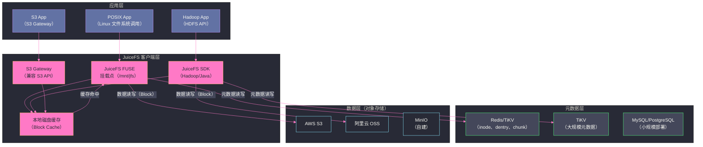

# 01 JuiceFS 全局架构——元数据引擎与对象存储的分离设计

## 摘要

JuiceFS 是一款面向云原生场景的高性能分布式文件系统，其核心设计思想是**将文件系统的元数据与数据彻底分离**：元数据存储在用户选择的数据库（Redis/TiKV/MySQL 等）中，而实际数据以对象（Object）形式存储在任意对象存储（S3/OSS/COS/MinIO 等）上。这种分离设计使 JuiceFS 能够以极低成本为 Hadoop 生态、AI 训练、数据湖等场景提供 POSIX 兼容的文件系统语义，同时彻底解耦存储扩展性和元数据性能。本文剖析这一设计的动机、架构组成以及与 HDFS 和 [[05 CephFS 分布式文件系统|CephFS]] 的本质差异。

---

## 第 1 章 为什么需要 JuiceFS——云时代的存储困境

### 1.1 HDFS 的历史遗产与现实困境

[[Hadoop YARN|Hadoop]] 生态的基石 **HDFS**（Hadoop Distributed File System）在十余年前的大数据时代堪称革命性设计：NameNode 管理元数据，DataNode 分布式存储数据块，通过机架感知实现高可用。但随着云计算和容器化的普及，HDFS 的局限性越来越突出：

**存算强耦合**：HDFS 将计算节点（运行 MapReduce/Spark 的节点）和存储节点（DataNode）绑定在一起，利用"数据本地性"减少网络传输。但在 Kubernetes 等弹性调度环境中，计算节点随时扩缩容，数据本地性几乎无法保证——存算耦合反而成了弹性扩展的障碍。

**NameNode 单点与容量限制**：HDFS 的 NameNode 将所有文件元数据（inode）存储在 JVM 堆内存中。一个典型配置的 NameNode（128GB 堆）大约能支持 4 亿个文件/目录（每个 inode 约 300 字节）。对于拥有数十亿文件的超大规模集群，NameNode 内存成为硬性瓶颈。Federation 方案可以缓解，但增加了运维复杂度。

**运维重量级**：HDFS 集群依赖 ZooKeeper 实现 NameNode HA，依赖 JournalNode 同步编辑日志，需要专门的集群运维团队。对于中小规模团队，维护一套 HDFS 集群的成本往往超过其带来的收益。

**与对象存储的割裂**：云环境下，对象存储（S3/OSS）价格低廉、按量付费、无限扩展，几乎成为数据湖的事实存储层。但 HDFS API 与对象存储 API（PUT/GET/LIST）存在语义差距——POSIX 文件系统的 append、rename、hard link 等操作很难高效地映射到对象存储。

### 1.2 JuiceFS 的设计出发点

JuiceFS（Juice File System，由 Juicedata 开发，2021 年开源）从一开始就为云原生场景设计，核心洞察是：

**元数据与数据的 I/O 特征截然不同**：
- 元数据操作（`ls`、`stat`、`mkdir`）：延迟敏感，需要毫秒级响应；数据量小（每个文件的元数据只有几百字节）；访问模式是随机的键值查找
- 数据读写（文件内容）：吞吐敏感，延迟要求相对宽松；数据量大；访问模式以顺序读写为主

基于这个洞察，JuiceFS 将两者交给最擅长各自场景的存储系统处理：
- **元数据** → 专用键值数据库（Redis/TiKV）或关系型数据库（MySQL/PostgreSQL），提供低延迟的随机读写
- **数据** → 对象存储（S3/OSS/MinIO），提供低成本、高吞吐的块存储

这种"让合适的系统做合适的事"的设计哲学，使 JuiceFS 在性能、成本和运维复杂度上同时达到了较好的平衡。

> [!note] 设计哲学
> JuiceFS 不是一个从头设计的分布式存储系统，而是一个**文件系统语义适配层**——它将 POSIX 文件操作翻译成两类不同的后端操作：元数据操作（写入元数据数据库）和数据操作（写入对象存储）。底层存储系统的选择完全开放，用户可以根据自身场景（延迟要求、成本预算、运维能力）选择最合适的后端。

---

## 第 2 章 JuiceFS 的三层架构

### 2.1 整体架构图



### 2.2 三个核心组件

**JuiceFS 客户端**：运行在使用文件系统的机器上，负责：
- 通过 FUSE 内核模块向应用提供 POSIX 文件系统接口（`open`/`read`/`write`/`mkdir` 等系统调用透明拦截）
- 将文件操作分解为元数据操作（写入/读取元数据引擎）和数据操作（写入/读取对象存储）
- 管理本地磁盘缓存（Block Cache），加速频繁访问的数据块读写

客户端是 JuiceFS 的核心逻辑所在，完全运行在用户空间（Go 语言实现），**没有独立的服务端进程**——这是 JuiceFS 与 HDFS、CephFS 最大的架构差异。

**元数据引擎**：存储文件系统的所有元数据，包括：
- **inode**：文件/目录的属性（size、mtime、uid、gid、mode 等）
- **dentry**：目录条目（父目录 → 子文件/目录的映射关系）
- **chunk**：文件数据的逻辑分块信息（每个 chunk 对应哪些 slice，每个 slice 存储在对象存储的哪个位置）
- **session**：客户端会话（用于处理文件锁和 FUSE 保活）

元数据引擎是可插拔的（Redis/TiKV/MySQL/PostgreSQL/SQLite），详见第 2 篇文章。

**对象存储**：存储文件的实际数据内容。JuiceFS 将文件数据按**固定大小的 Block**（默认 4MB）切割后存储到对象存储中。Block 的对象键名包含了 Volume 名称和 Block 的唯一标识，通过元数据引擎中的 chunk 信息还原文件到 Block 的映射关系。

---

## 第 3 章 关键设计：文件数据的存储模型

### 3.1 Chunk → Slice → Block 的三层映射

JuiceFS 的文件数据存储模型分三层：

**Chunk（逻辑段）**：文件按 64MB 为单位划分为若干 Chunk（类似 HDFS 的块大小概念，但不是物理块）。每个 Chunk 有一个唯一的 Chunk ID，元数据引擎中记录 `inode → [Chunk0, Chunk1, ...]` 的映射。

**Slice（写操作单元）**：每次 `write` 操作在 Chunk 内的目标位置生成一个 Slice（包含偏移量 off、长度 len、以及对应的 Block 列表）。允许同一个 Chunk 内有多个 Slice，Slice 之间可能有重叠（用于实现随机写入的覆盖语义）。

**Block（对象存储单元）**：每个 Slice 的数据被切割为若干固定大小的 Block（默认 4MB），每个 Block 作为独立的对象存储在对象存储中，对象键格式为 `{volume}/{chunk_id}/{block_index}_{block_size}`。

```
文件 /data/train.csv (100MB)
    ↓ 按 64MB 划分为 Chunk
Chunk 0 (0-64MB):
    Slice 0 (off=0, len=4MB)  → Block: jfs-vol/1/0_4194304
    Slice 1 (off=4MB, len=4MB) → Block: jfs-vol/1/1_4194304
    ...（共 16 个 4MB Block）

Chunk 1 (64MB-100MB):
    Slice 0 (off=0, len=4MB)  → Block: jfs-vol/2/0_4194304
    ...（共 9 个 Block，最后一个 Block 可能不足 4MB）
```

### 3.2 为什么这样设计——处理随机写入的核心逻辑

传统对象存储只支持 PUT（完整上传）和 GET（完整下载），不支持随机修改（在文件中间某个位置覆盖写）。但 POSIX 文件系统要求支持随机写入（`pwrite` 系统调用）。

JuiceFS 的解决方案：**允许同一个 Chunk 内存在多个 Slice，新的写入生成新的 Slice，通过元数据中的 Slice 覆盖关系来表达随机写入的语义**。

读取时，按 Chunk 内的 Slice 列表，从后向前查找覆盖关系，找到每个偏移量对应的最新 Slice，然后从对应的 Block 中读取数据。这个逻辑称为 **Copy-on-Write（写时复制）**——旧 Block 不修改，新写入生成新 Block，通过元数据追踪覆盖关系。

**Compaction（碎片整理）**：当一个 Chunk 内的 Slice 数量积累过多（默认超过 1000 个），JuiceFS 客户端会触发后台 Compaction：将多个 Slice 合并为一个大 Slice，减少读取时的 Slice 查找开销，同时删除不再被引用的旧 Block，释放对象存储空间。

---

## 第 4 章 与同类系统的架构对比

### 4.1 JuiceFS vs HDFS

| 维度 | JuiceFS | HDFS |
| :--- | :--- | :--- |
| **元数据架构** | 外部数据库（Redis/TiKV/MySQL） | 单点 NameNode（内存）|
| **数据存储** | 任意对象存储（S3/OSS/MinIO） | 专用 DataNode（本地磁盘） |
| **服务端进程** | 无（客户端直连元数据引擎和对象存储） | NameNode + DataNode 集群 |
| **POSIX 兼容** | 完整 POSIX（通过 FUSE） | 有限（不支持 append 以外的随机写） |
| **弹性扩缩容** | 存算完全解耦，按需扩展 | 存算耦合，DataNode 扩容同时增加存储和计算 |
| **元数据容量** | 受元数据引擎限制（Redis 受内存限制） | NameNode 堆内存限制（约 4 亿文件） |
| **运维复杂度** | 低（只需维护元数据引擎和对象存储） | 高（NameNode HA + JournalNode + ZooKeeper） |
| **适用场景** | 云原生、Kubernetes、AI 训练 | 传统大数据（MapReduce/Spark on YARN） |

### 4.2 JuiceFS vs CephFS

[[05 CephFS 分布式文件系统|CephFS]] 是另一种常见的分布式文件系统，同样基于 FUSE 提供 POSIX 语义。主要差异：

**底层存储**：CephFS 数据存储在 [[01 Ceph 全局架构——RADOS、CRUSH 与三大存储接口|Ceph RADOS]]（自建分布式块存储），需要专门维护 Ceph 集群（Monitor + OSD）。JuiceFS 数据存储在已有的对象存储上，无需自建存储集群。

**元数据架构**：CephFS 元数据由 MDS（Metadata Server）管理，MDS 是有状态服务，需要部署和维护。JuiceFS 元数据由外部数据库管理，更灵活，也更容易迁移。

**性能特征**：CephFS 的数据路径完全绕过操作系统（直接写 OSD），在高并发随机小 IO 场景性能好。JuiceFS 的数据路径经过对象存储（PUT/GET），对小文件随机写入有额外的延迟（每个 4MB Block 需要一次对象存储 PUT），更适合大文件顺序读写（如模型训练数据集）。

**云原生适配**：JuiceFS 天然适配公有云（直接使用 S3/OSS 等云原生对象存储），CephFS 通常需要自建 Ceph 集群，在公有云上使用成本较高。

---

## 第 5 章 JuiceFS 的适用场景

### 5.1 AI 训练数据集存储

AI 模型训练的典型数据访问模式：大量小文件（图片、文本样本）或大文件（视频、音频），以顺序读为主，多机并发访问。JuiceFS 的 Block Cache 可以在训练节点的本地 SSD 上缓存热门数据，降低对象存储的访问延迟和费用。

典型架构：训练数据存储在 S3（低成本），通过 JuiceFS 挂载到 Kubernetes Pod 上，FUSE 自动管理缓存。

### 5.2 Hadoop 生态的替代存储

JuiceFS 提供了兼容 HDFS API 的 Hadoop SDK，Spark、Flink、Hive 等框架无需修改代码即可将 JuiceFS 作为存储后端（替换 `hdfs://` 路径为 `jfs://`）。

对于希望从 HDFS 迁移到对象存储但不想放弃 POSIX 语义的团队，JuiceFS 是理想的过渡层。

### 5.3 Kubernetes CSI 持久化存储

JuiceFS 提供了 Kubernetes CSI Driver，以 PersistentVolume 的形式为 Pod 提供文件系统存储。相比 NFS，JuiceFS 的性能更好（分布式 Block Cache）；相比 Ceph CSI，运维更简单（无需自建 Ceph 集群）。

---

## 第 6 章 小结

JuiceFS 的核心创新是**将文件系统的元数据和数据存储完全解耦**，并让每一层都由最擅长该任务的系统来承担：
- 元数据 → 低延迟的 KV 数据库（Redis/TiKV）
- 数据 → 低成本的对象存储（S3/OSS/MinIO）

这种设计使 JuiceFS 在无需维护任何专用服务端进程的情况下，提供完整的 POSIX 文件系统语义，兼容 Hadoop 生态，并能在云原生环境（Kubernetes）中无缝运行。

它不是 HDFS 或 CephFS 的功能上的替代，而是在"云原生 + 低运维成本 + 对象存储后端"这个维度上的独特定位。

---

**延伸阅读**：
- [[02 JuiceFS 元数据引擎——Redis、TiKV 与 SQL 后端的对比]]
- [[03 JuiceFS 数据存储——分块、压缩与缓存]]

---

> [!note] 思考题
> 1. JuiceFS 将元数据和数据分离——元数据存储在 Redis/MySQL/TiKV 等引擎中，数据存储在对象存储（S3/OSS/MinIO）中。这种架构与传统分布式文件系统（如 CephFS，元数据和数据在同一集群）相比，在弹性扩展和运维复杂度方面有什么优势？元数据引擎的选择（Redis vs MySQL vs TiKV）对性能和可靠性有什么影响？
> 2. JuiceFS 兼容 POSIX 文件系统语义——可以直接挂载为本地目录。但对象存储的特点是'不可变对象'——没有原地修改，只有覆盖写。JuiceFS 如何在对象存储之上实现 POSIX 的随机写入（seek + write）？数据分块（默认 4MB Chunk → 64KB Block）的设计如何支持部分更新？
> 3. JuiceFS 在机器学习训练场景中被广泛使用——多个 GPU 节点同时读取训练数据。JuiceFS 的客户端缓存（本地 SSD 缓存热数据）如何提升读取性能？缓存一致性如何保证——如果数据源被更新，缓存何时失效？
