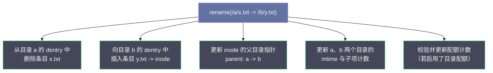
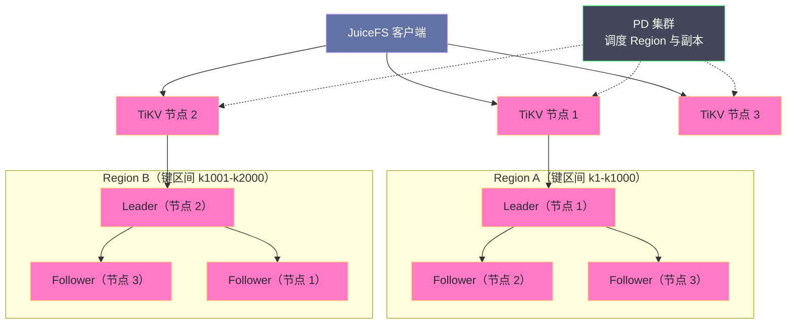
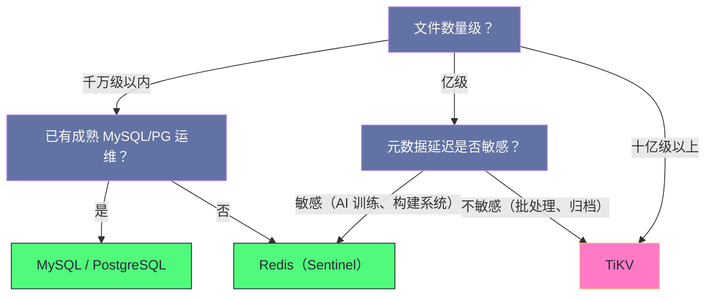

# 02 JuiceFS 元数据引擎——Redis、TiKV 与 SQL 后端的对比

**摘要：**

JuiceFS 把元数据交给外部数据库托管，于是"选哪个后端"就成了这套架构里最需要认真做的决策之一。本文先回答一个前置问题：元数据引擎到底必须具备什么能力——答案是**多键原子操作**，因为一次 `rename` 可能同时改动目录项、链接计数与配额计数，任何"最终一致"的键值存储都无法胜任。随后给出 JuiceFS 元数据的完整数据模型（inode、dentry、chunk、session 与全局计数器），并分别落到 Redis、TiKV、MySQL/PostgreSQL 三种后端上，讲清它们的 key/表结构、原子性来源、性能量级与失效模式。在此基础上给出一个可操作的选型决策框架（按文件数量级、延迟要求、运维能力三维度），以及迁移、备份、灾备的具体路径。全文回答两个问题：元数据引擎的选择会怎样决定 JuiceFS 的能力上限，以及在什么规模下必须换引擎。

---

## 第 1 章 元数据引擎：JuiceFS 的命门

### 1.1 一个不对称的依赖关系

在 JuiceFS 的三层架构里，元数据引擎与对象存储承担的风险完全不对称。

对象存储挂了，结果是**读写变慢或失败**——请求超时、重试、降级到缓存命中部分，但文件系统的目录树仍然完整，路径解析仍然可用，只是取不到数据。对象存储的故障甚至可以局部化：某个区域的 S3 抖动，只影响那部分 Block 的读取。

元数据引擎挂了，结果是**整个文件系统不可用**。所有路径解析、所有 `stat`、所有文件创建都走不通；对象存储里的 Block 完好无损，但没有任何人能说出它们对应哪些文件——它们变成了一堆无法被引用的孤儿字节。更要紧的是，如果元数据引擎的数据**丢失**（而非暂时不可达），那就不是"不可用"而是"不可恢复"：对象存储里几百 TB 的数据会瞬间失去索引。

这个不对称性决定了一条运维铁律：**JuiceFS 的备份优先级，元数据远高于数据**。数据侧的可靠性可以信任对象存储的多副本或纠删码，元数据侧的可靠性必须由使用者自己用持久化配置、主从/共识复制与定期快照三件事共同保证。

### 1.2 元数据引擎决定的三条能力曲线

选后端时，真正被决定的不是"快一点还是慢一点"，而是三条能力曲线的形状。

**延迟曲线**决定元数据密集型负载的体验。Redis 把元数据全放在内存里，单次查询在亚毫秒级；TiKV 与 SQL 后端要落盘、要过共识或事务，单次在毫秒级。这个差异在"一次 `ls` 加十万次 `stat`"的场景里会被放大成几十倍的总耗时差。

**容量曲线**决定能承载多少个文件。Redis 的容量与内存绑定，成本随文件数线性上升且单价高；TiKV 的容量与磁盘绑定，可以靠加节点水平扩展；SQL 后端受单机（或主从）的存储与索引规模限制。

**吞吐曲线**决定元数据并发能力。Redis 的命令执行是单线程的，理论上限就是"每秒能执行多少条命令"；TiKV 的吞吐可以随 Region Leader 数量水平扩展；SQL 后端的吞吐受单机事务处理能力与锁竞争限制。

三条曲线不是独立的——把延迟曲线做高（用 Redis）通常意味着容量曲线被压住；把容量曲线打开（用 TiKV）通常意味着延迟曲线略降。选型的本质就是在三条曲线之间选一个形状，去匹配业务的实际负载形状。

### 1.3 元数据引擎的三个硬约束

并非所有数据库都能当 JuiceFS 的元数据引擎。抛开性能不谈，它必须同时满足三条硬性能力，缺一条就不合格。

**约束一：支持多键原子操作。** 文件系统的一次语义操作往往涉及多个数据结构的同时变更，这些变更必须"要么全做、要么全不做"。只提供单键原子性（`SET`、`HINCRBY` 各自原子，但组合起来不原子）的存储不合格。

**约束二：支持高并发随机键值访问。** 元数据访问是典型的随机小操作，且并发度可能极高（数千个客户端同时挂载）。面向分析场景优化的列式数据库、面向顺序写优化的日志系统都不合适。

**约束三：具备可观测与可运维能力。** 元数据引擎是生产系统的关键依赖，必须能监控延迟、连接数、内存/磁盘水位，必须能做备份与故障转移。这一点排除了"用嵌入式 KV 跑生产多客户端共享"的做法——SQLite 与 Badger 虽然被支持，但它们的定位是单机测试。

> [!info] 核心概念
> JuiceFS 元数据引擎的选型，本质上是回答一个问题：**这个文件系统的"目录树"要放在哪种一致性模型上？** 放在单机内存上（Redis），延迟最低但容量受限；放在分布式共识上（TiKV），容量无限但每次写都要过一轮 Raft；放在关系型事务上（MySQL/PostgreSQL），语义最完备但吞吐受单机约束。三种选择没有高下，只有匹配。

---

## 第 2 章 元数据引擎必须提供什么

### 2.1 一次 rename 需要原子完成哪些变更

要理解"多键原子操作"这个要求的分量，不妨把一次 `rename("/a/x.txt", "/b/y.txt")` 拆开看。



这五步涉及至少三个不同的键（两个目录内容、一个 inode 属性）以及若干计数器。如果它们不是原子完成的，会怎样？

设想"删除旧条目成功、插入新条目失败"这一种中间态：文件从原来的目录消失了，却没有出现在新目录里。对使用者而言，这个文件**凭空蒸发了**——它还在对象存储里，但没有任何目录能通向它。更糟的是这种中间态无法被应用层感知与补救，因为 `rename` 在 POSIX 语义里就是"原子"的，调用方不会写补偿逻辑。

这就是为什么"最终一致的键值存储"不能当元数据引擎：它可以让每一次键的写入最终传播到所有副本，但无法保证多个键的变更在某个时刻同时生效。元数据需要的是**线性一致的原子事务**，而不是"最终都会一致"。

### 2.2 session 与锁：另一类必须原子的操作

除了路径与属性操作，还有一类容易被忽略的原子需求：**会话与文件锁**。

客户端挂载时在元数据引擎注册一个 session，之后按心跳续约；客户端打开文件并加锁时，锁记录挂在 session 下。这里存在一个典型的并发竞态：客户端 A 持有锁，进程被强杀，session 心跳中断；客户端 B 想拿同一把锁，必须先判定 A 的 session 已经失效，才能接管。

这个"判定失效 + 接管锁"的动作必须是原子的，否则两个客户端可能同时认为自己持锁——对 `flock` 这类语义而言，这就是数据损坏的直接来源。JuiceFS 的做法仍然是把判定与接管封装成单个原子操作交给元数据引擎执行：在 Redis 上是一段 Lua 脚本，在 TiKV/SQL 上是一个事务。**这也是为什么"元数据引擎必须支持事务"这条约束无法绕过**——它不只服务于路径操作，也服务于分布式锁。

顺带指出一个工程后果：session 的续约周期决定了"客户端崩溃后多久能释放锁"。周期调短，锁回收更快但心跳流量更大；周期调长，流量更省但故障后的等待更久。这个参数没有普适最优值，需要按业务对锁等待的容忍度来定。

### 2.3 三种后端如何实现原子性

三种主流后端用完全不同的机制满足这个要求，理解它们的差异有助于预判各自的失效模式。

| 后端 | 原子性机制 | 原子性的边界 | 失效模式 |
|---|---|---|---|
| Redis | 把多步操作打包成一段 Lua 脚本，脚本在服务端原子执行 | 单实例内（主从切换期间存在窗口） | 主从切换瞬间的写入可能丢失 |
| TiKV | Percolator 风格的两阶段分布式事务 + Raft 日志复制 | 集群内（多数派确认后提交） | 单节点故障不影响一致性，只影响延迟 |
| MySQL / PostgreSQL | 原生事务（BEGIN/COMMIT）加行锁 | 单实例内（主从复制为异步/半同步） | 主库故障时未同步的事务可能丢失 |

有一处细节值得展开：Redis 的 Lua 脚本之所以能提供原子性，是因为 Redis 在执行脚本期间不会插入其他命令——脚本里的所有读写构成一个不可分割的执行单元。但这份原子性只覆盖**一个 Redis 实例**；一旦部署成主从，主从复制是异步的，主库在故障前的最后几条写命令可能尚未传到从库，故障转移后这部分元数据变更就丢了。所以 Redis 后端的可靠性上限，取决于持久化配置（AOF `everysec` 最多丢一秒）与故障转移方案的严谨程度。

TiKV 的原子性则来自共识：一次事务提交前，相关键的写意图与提交记录都要经过 Raft 复制到多数派。这意味着任何单节点故障都不会造成已提交事务的丢失，代价是每次写都要等待一轮（或两轮）多数派确认，延迟从亚毫秒变成毫秒级。**这就是"延迟换可靠性"的具体价格。**

### 2.4 为什么不能只用单键原子

一个常见的误解是："Redis 的每个命令都是原子的，那用它做元数据引擎应该够了。"问题在于文件系统的语义操作**从来不是单个键的操作**。

JuiceFS 的做法是把这些多键操作全部封装成 Lua 脚本，例如创建文件时"分配 inode 号、写入 inode 属性、插入父目录 dentry、递增空间计数"四步合成一个脚本。这样做的好处是把原子性推给了 Redis 的服务端执行；代价是**所有原子脚本都必须是纯 Redis 操作**，无法调用外部逻辑，也无法跨实例。这也是为什么 Redis Cluster 的跨槽限制会成为一道门槛：如果脚本涉及的键被哈希到不同槽位，脚本就无法在单个节点上原子执行。

---

## 第 3 章 元数据的数据模型

### 3.1 五类结构

无论后端是哪种数据库，JuiceFS 的元数据模型是统一的，由五类结构组成。

**inode**：文件或目录自身的属性（类型、大小、uid/gid、mode、时间戳、链接计数、父目录指针）。以整数编号为唯一键。

**dentry**：目录内容的映射，即 `父目录 inode + 名字 → 子 inode`。这是路径解析的核心。

**chunk**：文件数据到对象存储 Block 的映射，即前一篇讲的 Slice 列表。

**session**：客户端会话与它持有的锁（`flock`、POSIX 记录锁），用于客户端异常退出后的锁回收。

**全局计数器**：下一个可分配的 inode 号、下一个 slice 号、已用空间、已用 inode 数等。这些计数器必须原子递增，否则会出现编号冲突。

### 3.2 Redis 后端的键设计

Redis 后端把这些结构映射到几种原生数据类型上。核心键的形状大致如下（以 Redis 为例，TiKV 的键空间结构类似，只是键被编码为字节序）：

```text
i{inode_id}            Hash    文件属性：type/size/uid/gid/mode/atime/mtime/ctime/nlink/parent
d{parent_inode_id}     Hash    目录内容：field 为子项名字，value 为子 inode 与类型
c{inode_id}_{chunk}    String  该 Chunk 的 Slice 列表（序列化后的二进制）
nextinode              String  下一个 inode 号（原子自增）
nextchunk              String  下一个 Chunk 号
nextsession            String  下一个 session 号
usedSpace              String  已用空间（字节）
usedInodes             String  已用 inode 数
session{session_id}    Hash    会话信息：心跳时间、持有的锁等
```

一次 `stat("/data/train/a.jpg")` 被翻译成的查询序列，就是沿着 dentry 逐级下钻：

```text
HGET d{1}      "data"    -> 得到 data 的 inode 号
HGET d{data}   "train"   -> 得到 train 的 inode 号
HGET d{train}  "a.jpg"   -> 得到 a.jpg 的 inode 号
HGETALL i{a.jpg}         -> 得到完整属性
```

这种设计的直接后果是：**路径解析的成本与目录深度成正比**，且每一跳都是一次网络往返（除非命中客户端的目录项缓存）。它与 HDFS NameNode 的"一次内存查找"形成鲜明对照，也是 JuiceFS 必须依赖客户端缓存来摊薄元数据开销的根本原因。

### 3.3 SQL 后端的关系表设计

MySQL/PostgreSQL 后端把同一套模型落成关系表，结构更直观，也更容易被 DBA 审计与查询：

```sql
-- 文件/目录属性表
CREATE TABLE jfs_node (
    inode     BIGINT PRIMARY KEY,
    type      TINYINT NOT NULL,      -- 1=文件 2=目录 3=符号链接
    mode      SMALLINT,
    uid       INT,
    gid       INT,
    size      BIGINT DEFAULT 0,
    nlink     INT DEFAULT 1,
    mtime     BIGINT,
    atime     BIGINT,
    ctime     BIGINT,
    parent    BIGINT                 -- 父目录 inode，用于反向查询与配额统计
);

-- 目录项表：路径解析的核心，主键即 (父目录, 名字)
CREATE TABLE jfs_edge (
    parent    BIGINT NOT NULL,
    name      VARCHAR(255) NOT NULL,
    inode     BIGINT NOT NULL,
    type      TINYINT NOT NULL,
    PRIMARY KEY (parent, name)
);

-- Chunk 映射表：value 为序列化后的 Slice 列表
CREATE TABLE jfs_chunk (
    inode     BIGINT NOT NULL,
    indx      INT NOT NULL,
    slices    MEDIUMBLOB,
    PRIMARY KEY (inode, indx)
);
```

`jfs_edge` 的主键选择很关键：以 `(parent, name)` 为主键，意味着"查一个目录下的某个名字"是一次主键点查，而"列出一个目录的全部内容"是一次主键范围扫描——这两种访问模式恰好是文件系统里最高频的两种。把主键设计成 `(parent, name)` 而不是自增 ID，是这套 schema 最重要的一个工程决策。

### 3.4 为什么这套模型能支撑单目录百万文件

本地文件系统（譬如 ext4 的早期实现）在单目录文件数极多时会遇到 `readdir` 性能退化，原因是目录被组织成线性链表。JuiceFS 在这件事上反而有结构性的优势：目录内容是一个 Hash（或一张以主键聚簇的表），插入、删除、按名查找都是 O(1) 或 O(log N)，**不会随着目录变大而退化**。

真正的瓶颈转移到了两处：其一是**单次 `ls` 需要取回整个目录内容**，目录越大，这一跳传输的数据量越大；其二是**遍历目录的工具会对每个子项做一次 `stat`**，把一次目录列举放大成 N 次元数据查询。也就是说，问题从"目录结构本身低效"变成了"网络往返次数太多"。对应的解法也就顺理成章：控制单目录文件数、利用目录项缓存、或者换用吞吐更高的元数据后端。

### 3.5 键编码：同一套模型在不同后端上的投影

同一份逻辑模型，落到不同后端时会被编码成不同形状的键。理解这个投影关系，有助于在排查问题时知道"该去后端里看什么"。

在 **Redis** 上，键是可直接阅读的字符串（`i1001`、`d1`、`c1001_0`），值则是 Hash 或 String；运维人员用 `redis-cli` 就能直观看到目录结构与属性，排查非常方便，代价是键名本身也占用内存。

在 **TiKV** 上，键必须编码为**字节序可比较**的形式，才能让"按目录列内容"退化为一次连续的范围扫描。因此 `(parent, name)` 这类复合键会被编码成"固定长度前缀 + 变长后缀"的字节串，保证字节序与逻辑序一致。这样做的好处是范围查询高效，代价是键不再可读——排查时必须借助 JuiceFS 自身的命令（`juicefs info`、`juicefs status`）而不是直接翻 TiKV。

在 **SQL** 后端上，模型直接对应表与行，可读性最好，且可以直接用 SQL 做审计查询（譬如"统计某个目录下的文件总数与总容量"），这是 SQL 后端在运维侧的一个隐性优势。

三种投影的取舍其实是一句话：**可读性、范围查询效率、运维便利性，三者难以兼得。**

### 3.6 配额与空间统计：为什么计数器也必须原子

目录配额与用量统计看似是"锦上添花"的功能，实际上它对元数据引擎提出了最苛刻的原子性要求。

原因是这类功能必须在**每一次写入路径上**维护累加值：文件写入了多少字节，就要给它的父目录及其所有祖先目录的空间计数加上多少。一次写入因此可能牵动从当前目录到根目录的一整条路径上的多个计数器。

如果这些计数器的更新不是原子的，会发生什么？最常见的是**计数漂移**：两个客户端并发写入同一目录，各自读到相同的旧计数、各自加上自己的增量、各自写回，后写的那次覆盖了先写的增量。结果是目录的用量统计比实际值偏小，日积月累之后配额形同虚设——用量早已超限，计数却显示还有余量。

JuiceFS 的应对方式有两层：一是把"写入数据 + 更新祖先计数"尽可能收敛到少数几次原子操作里；二是提供 `juicefs fsck` 与统计修复能力，在计数出现漂移时可以从 inode 与 Chunk 映射重新计算真实用量。后者是必要的兜底——**任何依赖增量累加的统计系统都需要一个可重算的基准，否则漂移无法被纠正。**

这带来一个实用建议：如果业务依赖配额做多租户隔离，应当定期（譬如每周）跑一次用量校准，而不是完全信任实时计数。这与数据库里"定期做一致性校验"的思路是一致的——增量维护带来性能，全量校验带来正确性，两者必须配对使用。

---

## 第 4 章 Redis 后端：亚毫秒的代价

### 4.1 优势：为什么它是默认首选

Redis 之所以在实践中被最多团队选为第一套元数据引擎，理由很直接。

**延迟极低。** 所有数据在内存中，单次元数据操作在亚毫秒量级，这对元数据密集型负载（代码仓库、AI 训练的小样本读取、频繁 `stat` 的构建系统）是决定性的。

**运维心智负担小。** 大多数团队已经在用 Redis 做缓存或分布式锁，有一套现成的部署、监控、告警经验；引入 JuiceFS 不需要新建一类运维对象。

**原子脚本能力成熟。** Lua 脚本在 Redis 上被大规模验证过，JuiceFS 把多键原子操作封装成脚本后，语义清晰且性能可预期。

### 4.2 局限：三道天花板

**内存天花板。** Redis 的容量与物理内存绑定。虽然可以通过集群化把容量摊到多台机器，但成本单价远高于磁盘型存储。一个粗略的量级估算是：单文件元数据占用数百字节内存，一亿文件对应几十 GiB，十亿文件对应数百 GiB——后者的内存成本通常已经超过"用 TiKV 换来的磁盘成本节省"。

**单线程天花板。** Redis 的命令执行是单线程的（网络 IO 在较新版本中已多线程化，但命令执行仍串行）。这意味着元数据的写入 QPS 有一个明确的上限，且这个上限会与 Lua 脚本的执行时长成反比——脚本越长，单位时间内能执行的脚本越少。在"数千客户端同时创建临时文件"的场景下，这个上限很容易被触达。

**持久化窗口。** Redis 的持久化（RDB 快照与 AOF 日志）不是"每次写都同步落盘"的。即使开启 AOF 并把 `appendfsync` 设为 `everysec`，最坏情况下仍会丢失最近一秒的写入。对元数据而言，这一秒的丢失可能意味着"一批刚创建的文件凭空消失"。

> [!warning] 生产避坑
> 用 Redis 做 JuiceFS 元数据引擎时，有三条配置是红线。第一，**绝对不要开启键淘汰策略**（`maxmemory-policy` 不能是 `allkeys-lru` 之类的值），否则内存压力下 Redis 会静默删除元数据键，直接造成目录树损坏；应当配置 `noeviction` 并在内存水位告警时扩容。第二，**必须开启 AOF 持久化**，并配合 `appendfsync everysec`，同时部署 Sentinel 或等价的高可用方案。第三，**必须定期导出元数据快照**（`juicefs dump`）到独立于 Redis 的存储位置——因为持久化文件与 Redis 实例同生共死，而快照可以在 Redis 彻底损毁时作为最后的恢复手段。

### 4.3 Sentinel 与 Cluster 的取舍

Redis 的高可用有两条路线，JuiceFS 场景下需要谨慎选择。

**Sentinel（哨兵）主从** 是实践中的主流选择：一个主库承接全部读写，若干从库做热备，哨兵负责监控与故障转移。它的优点是结构简单、多键 Lua 脚本可以无约束地执行（所有键都在同一个主库上）；缺点是容量与写入吞吐无法水平扩展，只能靠"加内存、换更强的机器"纵向提升。

**Redis Cluster** 用哈希槽把键分散到多个主节点，容量与吞吐都能水平扩展。但它的代价与 JuiceFS 的原子脚本直接冲突：Cluster 要求同一个脚本涉及的所有键落在同一个槽位，而文件系统的原子操作天然要跨多个键（inode、dentry、计数器）。这意味着要么接受脚本被拆散、原子性受损，要么在键名上做哈希标签（hash tag）把相关键强制绑到同一个槽——后者会破坏数据分布的均匀性。因此在需要严格原子性的场景里，Cluster 的收益与代价需要仔细权衡。

### 4.4 容量估算与关键调优参数

用 Redis 做元数据引擎时，容量估算必须在部署前完成，否则很容易在文件数增长到一半时撞墙。估算方法是"按文件数乘单文件元数据开销"，再留出充裕余量：

| 对象 | 单份开销量级 | 说明 |
|---|---|---|
| inode 属性 | 数十到上百字节 | Hash 的 field/value 与编码开销 |
| 目录项 | 数十字节 | 名字长度 + 子 inode 号 + 类型 |
| Chunk 映射 | 数十字节起 | 与 Slice 数量相关，写入越碎越大 |
| session 与锁 | 数十字节 | 每个客户端与每把锁各一份 |
| 键名与 Hash 桶结构 | 数十字节 | Redis 自身的对象头与字典开销 |

几项相加，**单文件的总开销落在数百字节量级**，据此可以推出一亿文件对应几十 GiB、十亿文件对应数百 GiB。规划时应当再乘一个安全系数（因为 Slice 碎片、符号链接、锁记录都会额外占空间），并把 `maxmemory` 设为物理内存的合理比例（通常 70% 到 80%），给复制缓冲区与 AOF 重写留出余量。

关键参数上，除了前文反复强调的"关闭键淘汰、开启 AOF、部署 Sentinel"，还有两处值得调整：其一是**客户端连接数上限**，数千个挂载点同时连接时会触及 Redis 的连接数限制，需要相应调大并监控连接水位；其二是**慢日志阈值**，把慢日志打开并设置合理阈值，是发现"某个元数据操作突然变慢"的最快手段——JuiceFS 的元数据延迟问题，十有八九能先在 Redis 慢日志里看到线索。

---

## 第 5 章 TiKV 后端：用延迟换无限容量

### 5.1 Region 与 Raft：容量扩展的机制

TiKV 是 PingCAP 开源的分布式键值存储，它的容量扩展能力来自**分片 + 共识**这套组合。

键空间被切成若干 **Region**（默认大小约 96 MiB），每个 Region 是一个连续的键区间，由 Raft 组管理，组内通常是三个副本分布在三台 TiKV 节点上。写入时，请求先到 Region 的 Leader，Leader 把日志复制给 Follower，多数派确认后提交。Region 的边界由 **PD（Placement Driver）** 动态调度——当某个 Region 过大或负载过高时，PD 会把它分裂并迁移副本，使数据与负载在集群内均衡分布。



这套机制带来的直接能力是：**容量与吞吐都可以靠加节点解决**。数据量增长，加 TiKV 节点让 PD 迁移 Region；写入 QPS 增长，不同 Region 的 Leader 分布在不同节点上，天然并行。这是 Redis 主从方案做不到的。

### 5.2 代价：延迟从哪来

TiKV 的延迟比 Redis 高一个数量级，这个差距由三段构成。

**第一段是落盘。** TiKV 的底层是 RocksDB（一条从 [[01 LevelDB 全局架构——LSM-Tree 的写优化设计|LevelDB]] 演进出来的 LSM-Tree 路线），写入先落 WAL 再进 MemTable，读取可能要穿透多层 SSTable。这与 Redis 的纯内存访问有本质区别。

**第二段是共识。** 每次写都要经过一轮（乐观事务下是两轮）多数派复制确认。跨机房部署时，这一轮的网络往返就足以把延迟推到十几毫秒。

**第三段是 Compaction 抖动。** LSM-Tree 的后台合并会周期性占用磁盘 IO 与 CPU，表现为元数据延迟的毛刺。这也是为什么 TiKV 集群对磁盘类型敏感——SSD 与 HDD 的表现在这里差距明显。

### 5.3 运维复杂度：PD 与容量规划

TiKV 的运维面比 Redis 大得多。除了 TiKV 节点本身，还需要维护 PD 集群（通常三个节点，提供调度与 TSO 服务）、监控 TiKV 的 Region 分布与热点、规划磁盘容量与 IO 预算。故障处理也更复杂：单个 TiKV 节点宕机，Region 会重新选主，期间该 Region 的请求会短暂失败重试；PD 不可用则整个集群无法分配 TSO，写入停摆。

因此"什么时候该上 TiKV"有一条清晰的分界线：**当 Redis 的内存成本或单线程吞吐已经成为实际瓶颈时**。若文件数量还在亿级以内、元数据 QPS 也没有打到上限，上 TiKV 只会白白引入运维负担与延迟上升。

### 5.4 TSO 与热点：TiKV 上两个特有的问题

把元数据搬到 TiKV 之后，会遇到两个在 Redis 上不存在的问题。

**第一个是 TSO 依赖。** TiKV 的事务需要一个全局单调递增的时间戳，这个时间戳由 PD 统一分配。也就是说，**PD 是写入路径上的关键依赖**：PD 不可用时，读取可能还能继续，但所有写事务都会卡在"申请时间戳"这一步。因此 TiKV 集群的高可用规划里，PD 的地位与 TiKV 节点同等重要，通常部署三个节点并由 Raft 保证一致性。这一点与 Redis 有本质差别——Redis 的延迟路径上没有任何中心协调组件。

**第二个是热点。** JuiceFS 的元数据访问天然有热点特征：某个被大量读取的目录（譬如训练数据集的根目录）会被所有客户端频繁查询，对应的 Region 就成了读热点；某个被大量写入的目录（譬如共享输出目录）则成为写热点。TiKV 的 PD 会尝试通过调度副本缓解热点，但调度有延迟且不总能解决"同一个键被高频访问"的问题。

应对手段与业务侧的分桶思路一致：**把高频写入的目录按前缀或时间分桶**，让写请求落到不同的键区间、进而落到不同的 Region。这是一个"用命名空间设计换吞吐"的手法，与第 3 章讲的单目录规模控制是同一个思路的两个侧面。

---

## 第 6 章 SQL 后端：复用既有基础设施

### 6.1 为什么有人选 MySQL/PostgreSQL

SQL 后端的吸引力不在性能，而在**组织现实**。

大多数中大型公司已经有一套成熟的 MySQL/PostgreSQL 运维体系：备份策略、主从复制、监控告警、故障切换、DBA 团队。选择 SQL 后端意味着 JuiceFS 的元数据被纳入这套既有体系，不需要新开一个"Redis 高可用"的运维课题。对于文件数量在千万级、延迟要求不极端的场景，这是一个非常理性的选择。

### 6.2 性能特征与瓶颈位置

SQL 后端的性能由三类操作决定：

| 操作 | 对应 SQL | 性能特征 |
|---|---|---|
| `stat` 单个文件 | `SELECT ... WHERE inode = ?` | 主键点查，性能好 |
| 列出目录 | `SELECT ... WHERE parent = ?` | 主键范围扫描，目录越大越慢 |
| 创建/删除/重命名 | 多表 INSERT/DELETE/UPDATE + 事务 | 受事务与锁竞争影响 |

性能瓶颈通常出现在两处：**高并发下的行锁竞争**（同一目录内的并发创建/删除会争抢父目录记录上的锁），以及**大目录的范围扫描**。前者可以通过应用层减少同目录并发写来缓解，后者需要通过目录分桶来规避。

### 6.3 规模上限

单机 MySQL/PostgreSQL 在元数据表达到数亿行量级时，索引深度增加、缓存命中率下降，性能开始明显退化。此时即便加索引也难以挽回——因为瓶颈不在 SQL 语句本身，而在单机的 IO 与内存容量。**SQL 后端的适用边界大致是千万级文件，超过这个量级应当规划迁移到 TiKV。**

### 6.4 连接池与锁竞争：SQL 后端最实际的两个调优点

SQL 后端的性能问题，几乎总能归到两件事上。

**其一是连接池。** JuiceFS 的每个客户端都会与元数据库建立若干连接，挂载点数量增长时，总连接数会快速逼近数据库的 `max_connections` 上限。连接池配置过小会导致元数据操作排队等待，配置过大则会把数据库的线程/进程资源耗尽。合理的做法是按"挂载点数量 × 每客户端并发度"估算总连接数，并留出余量，同时在数据库侧监控活跃连接水位。

**其二是行锁竞争。** 在同一个目录内并发创建或删除文件时，多个事务会争抢同一条父目录记录上的锁（因为要更新该目录的子项计数与 mtime）。高并发写入同一目录的场景下，这个锁会迅速成为串行点。缓解手段有三条：在应用层降低同目录并发写（把输出按分区或时间戳分目录）、缩短事务持锁时间（把非必要的计数更新挪出关键路径）、以及把数据库的隔离级别设为更宽松的 `READ COMMITTED`（若业务能接受）。这三条都指向同一个结论：**SQL 后端最怕的不是数据量大，而是同一目录的并发写多。**

---

## 第 7 章 选型决策框架

### 7.1 三维决策

把前文的分析收敛成一个可操作的框架：按"文件数量级"、"延迟要求"、"运维能力"三个维度定位。



三条典型场景的答案可以直接给出。

**AI 训练数据集存储**：文件数量通常千万到亿级，元数据延迟直接决定 GPU 等待时间，团队一般已有 Redis 运维经验。选 **Redis（Sentinel 主从）**，并把目录项缓存 TTL 调大以减少元数据查询。

**企业大数据平台**：文件数量可能到十亿级（小文件多），元数据 QPS 高但单次延迟不极端，团队有成熟 DBA。可以先用 **SQL 后端** 起步，把元数据纳入既有运维体系；规模再涨时规划迁移到 TiKV。

**数据湖 / 多租户平台**：文件数量与租户数都会持续增长，容量必须能水平扩展，且要求元数据强一致。直接选 **TiKV**，并接受延迟上升与运维复杂度增加。

### 7.2 反例：选错引擎会怎样

**用 Redis 承载十亿级文件。** 结果是内存成本失控，且单线程写入成为瓶颈；更糟的是当内存接近上限时，运维压力会让团队倾向于"临时调大淘汰策略"这种危险操作，一旦元数据被驱逐，文件系统即刻损坏。

**用 TiKV 承载延迟敏感的亿级小文件。** 结果是元数据延迟从亚毫秒升到毫秒级，训练数据加载的随机 `stat` 被放大成可观的开销，投入了大量运维成本却没换来收益。

**用 SQLite 承载多客户端生产负载。** SQLite 的锁粒度是整库，多客户端并发写会直接失败或串行化。它只适合单机挂载的测试场景。

### 7.3 成本估算：把三条曲线换算成钱

选型讨论最终要落到成本上，而 JuiceFS 的成本结构有一个容易被忽略的特点：**元数据成本与数据成本是两个独立的账本**。

| 成本项 | 计价维度 | 驱动因素 |
|---|---|---|
| 对象存储容量 | 每 GB 每月 | 数据总量 × 副本/纠删码系数 |
| 对象存储请求 | 每万次请求 | 写入碎片度、缓存命中率、GC 频率 |
| 对象存储流量 | 每 GB 出网 | 跨区域访问、缓存未命中回源 |
| Redis 元数据 | 内存规格 | 文件数量（数百字节/文件） |
| TiKV 元数据 | 节点数 × 磁盘 | 文件数量 + 元数据写入量 |
| SQL 元数据 | 实例规格 | 文件数量 + 元数据 QPS |

从这张表能读出一个反直觉的结论：**在"数据量不大但文件极多"的负载上，元数据成本可能超过数据成本。** 典型例子是百万级小图片的 AI 训练集：数据总量也许只有几 TB，对象存储费用很低，但一亿个 inode 需要的 Redis 内存成本会相当可观。反过来的场景是"少数超大文件"（视频归档、模型权重）：元数据成本可以忽略，成本几乎全在对象存储容量与出网流量上。

因此成本测算的正确做法是**分别估算两条曲线，再决定在哪一条上省钱**。如果元数据是成本大头，考虑用 TiKV 换掉内存型 Redis；如果请求费是成本大头，考虑提高缓存命中率、减少碎片写入；如果流量费是成本大头，考虑把计算与对象存储放在同一区域。

### 7.4 什么时候该认真考虑换引擎

把前文的判断收敛成一份清单，符合其中任意两条以上时，就应当启动引擎迁移的评估。

| 判断项 | 具体信号 |
|---|---|
| 容量 | Redis 内存水位长期高于 70%，或文件数已接近亿级 |
| 成本 | 元数据内存成本已超过对象存储容量成本 |
| 吞吐 | 元数据写入 QPS 长期贴近后端上限，出现排队 |
| 延迟 | 缓存命中率未降，但元数据 P99 持续抬升 |
| 并发 | 同目录并发写导致锁等待成为常态，业务侧无法再分桶 |
| 运维 | 团队已无法承担当前后端的故障处理复杂度 |

反过来，如果这些信号一条都不成立，那么"换个更高级的引擎"往往只是把成本从"内存贵"换成了"运维累"，并没有解决真实问题。**技术选型最容易犯的错，是为了想象中的规模问题提前付出真实成本。**

---

## 第 8 章 迁移、备份与灾备

### 8.1 dump 与 load：元数据的搬运工具

JuiceFS 提供了一对命令用于元数据的导出与导入，它们是备份与迁移的基础。

```bash
# 导出元数据快照（JSON 格式，可压缩）
juicefs dump redis://redis-host:6379/1 /backup/meta-$(date +%Y%m%d).json.gz

# 导入到新的元数据引擎
juicefs load tikv://pd-host:2379/new-vol /backup/meta-20260101.json.gz

# 校验元数据与对象存储的一致性
juicefs fsck redis://redis-host:6379/1

# 回收对象存储中已无引用的孤儿 Block
juicefs gc redis://redis-host:6379/1 --delete
```

`dump` 的输出是**逻辑快照**而非物理快照，因此它天然支持跨后端迁移——把 Redis 里的元数据导入 TiKV，是同一套格式的搬运。这也是 JuiceFS 相对自建文件系统的一个隐性优势：**元数据引擎可以换，而数据不需要动**。

### 8.2 从 Redis 迁移到 TiKV 的实操路径

当 Redis 的容量或吞吐成为瓶颈时，迁移是唯一的出路。迁移的核心难点不是"搬数据"，而是"搬的过程中如何保持可用"。


其中最关键的是**阶段三与阶段六**。JuiceFS 的元数据没有像 binlog 那样可以直接订阅的变更流，因此"在线迁移"通常需要一段短暂的停写窗口（把所有客户端卸载、确认无写入后再做最后一次增量导出）。如果无法接受停写窗口，替代方案是搭建一个新的 Volume、把数据分批复制过去，再让应用切换路径——代价是数据要搬两份。

阶段六的意义在于**保留回滚能力**：切换后不要立刻销毁旧 Redis，而是保留它并停止写入，作为一段时间的回滚后备。只有在新的 TiKV Volume 稳定运行足够长时间、且 `fsck` 校验通过之后，才考虑释放旧引擎。

### 8.3 灾备演练的三个必做项

元数据的灾备不能停留在"配了持久化"这个层面，必须通过演练验证。三个必做项如下。

**必做一：模拟元数据引擎整体损毁。** 用 `dump` 出的快照重建一个全新的元数据引擎，验证能否在预期时间内恢复出完整的目录树，并核对关键目录的文件数量与总容量是否与故障前一致。

**必做二：模拟客户端异常退出后的锁回收。** 在某个客户端持锁的情况下强杀进程，验证其他客户端能否在 session 超时后正常获取该锁，避免出现"锁永久泄漏"。

**必做三：模拟元数据与对象存储的不一致。** 人为删除少量对象存储中的 Block，运行 `fsck` 验证能否定位到受影响的文件，并确认 `gc` 不会误删仍被引用的对象。

### 8.4 该盯哪些指标

元数据引擎的监控不能只看它自身的健康度，还要看 JuiceFS 侧暴露的元数据行为。两边的指标要成对配置。

| 监控对象 | 关键指标 | 告警思路 |
|---|---|---|
| Redis | 内存使用率、`maxmemory` 水位、AOF 重写耗时、慢日志条数 | 内存接近上限即告警，慢日志突增即排查 |
| TiKV | Region 数量与分布、PD 可用性、Raft 落盘延迟、RocksDB 写停顿 | PD 不可用为最高级别，写停顿影响元数据毛刺 |
| SQL | 活跃连接数、慢查询数、行锁等待时长、主从延迟 | 行锁等待突增说明同目录并发写过多 |
| JuiceFS 客户端 | 元数据操作 P99 延迟、元数据 QPS、目录项缓存命中率、Block Cache 命中率 | 元数据 P99 与缓存命中率是最直接的用户体验指标 |

其中最后一行最容易被忽略，却最有用：**元数据操作 P99 延迟与缓存命中率是"用户能感知到的元数据质量"的直接投影**。元数据引擎的 `used_memory`、Region 数只是间接指标，它们升高不一定意味着业务变慢；而 JuiceFS 侧的元数据 P99 一旦升高，业务侧几乎必然已经受影响。

---

## 第 9 章 边界与反例

### 9.1 元数据引擎不能当缓存用

这是最容易犯也最危险的错误。把 JuiceFS 的 Redis 元数据引擎与"业务缓存用的 Redis"混为一谈，进而沿用"缓存可以随时清空"的心智模型，后果是灾难性的：**元数据引擎的每一次丢失都等于整个文件系统的目录树归零**。因此元数据 Redis 必须与缓存 Redis 物理隔离（独立实例、独立集群、独立监控），并且其淘汰策略、持久化配置、告警阈值都要按"关键数据库"而非"缓存"来设定。

### 9.2 不能跨后端共享同一个 Volume

元数据引擎与 Volume 是一一绑定的。把同一个对象存储桶配给两个不同的元数据引擎，会让两边各自维护一套互不知晓的目录树，指向同一批 Block——这不仅浪费空间，还会让 `gc` 在一边清理另一边仍在引用的 Block，造成数据损坏。对象存储侧的隔离（不同前缀、不同桶）必须与元数据引擎的隔离一一对应。

### 9.3 元数据的"备份"不等于"高可用"

主从复制与 Sentinel 解决的是**可用性**：主库挂了从库顶上，服务不中断。但它们不解决**逻辑损坏**：如果应用层因为误操作删除了大批文件，这个删除会同步复制到所有从库，高可用方案束手无策。因此**备份（可回溯的历史快照）与高可用（自动故障转移）是两件必须同时具备的事**，不能互相替代。定期 `dump` 快照并异地保存，是唯一能对抗逻辑损坏的手段。

### 9.4 常见误区

**误区一：认为元数据引擎可以随便换。** 虽然 `dump`/`load` 提供了迁移路径，但迁移需要停写窗口与全量搬运，且不同后端的性能特征差异巨大。选型应当尽量一次做对，把迁移当作应急手段而非常规操作。

**误区二：只监控元数据引擎自身，不监控文件系统侧。** Redis 的 `used_memory` 与 TiKV 的 Region 分布都只是间接指标。真正需要直接监控的是 JuiceFS 暴露的元数据操作延迟与 QPS，以及客户端的缓存命中率——这些才是业务能感知到的量。

**误区三：忽略元数据与对象存储的容量配比。** 元数据引擎的容量规划与对象存储的容量规划是两个独立问题：对象存储按数据总量增长，元数据引擎按文件数量增长。一个"数据量不大但文件极多"的负载，可能在对象存储上很省，却在元数据引擎上先撞墙。

### 9.5 扩容时机：什么信号出现时必须动手

元数据引擎的扩容不是"满了再加"，而是要在信号出现时就规划，因为迁移本身需要窗口期。三个必须动手的信号如下。

**信号一：Redis 内存水位持续高于 70%。** 这说明剩余空间已经不足以支撑 AOF 重写与复制缓冲，一旦触发内存告警，运维压力会逼出危险操作。此时应当启动"评估 TiKV 迁移"的流程，而不是等水位到 90% 再仓促决策。

**信号二：元数据操作 P99 延迟持续抬升而缓存命中率未下降。** 缓存命中率不变意味着不是负载变重，而是元数据引擎自身的处理能力在退化——通常是 Redis 单线程饱和、TiKV 的 RocksDB 写停顿增多，或 SQL 侧行锁等待变长。这类退化不会自愈，只会随着文件数增长继续恶化。

**信号三：同目录并发写导致的锁等待成为常态。** 在 SQL 后端上尤其明显。如果业务侧已经无法通过目录分桶来缓解，说明后端的并发能力已经触顶，需要考虑迁移到 TiKV 或改用 Redis。

把这三个信号写进监控与值班手册，是让"元数据引擎选型"从一次性决策变成持续运维的关键。**架构决策的正确性，往往取决于它是否配了对应的观测手段。**

---

## 第 10 章 落点

回到主线：元数据引擎的选择，是 JuiceFS 这套架构里**唯一一个必须在部署前想清楚、且事后很难轻易更改**的决策。

它的判断逻辑可以概括成一句话：**元数据引擎决定了文件系统的能力上限，而这个上限由文件数量级、延迟要求与运维能力三者共同约束。** Redis 把延迟做到极致，代价是容量与吞吐受单机约束；TiKV 把容量与吞吐打开，代价是延迟上升与运维面扩大；SQL 后端则在"复用既有基础设施"这个维度上占优，适合作为规模不大时的起点。

三种后端没有绝对优劣，只有匹配与否——这与存储领域里所有"用一致性换可用性、用延迟换成本"的权衡一样，最终都要回到业务对延迟的容忍度、对成本的敏感度，以及团队实际的运维能力上来。下一篇将转向数据侧，讲清 Chunk/Slice/Block 这套分块模型如何配合缓存，把对象存储的高延迟挡在应用之外。

还有一层认知值得留在最后：**元数据引擎的选择，实际上是在选择"这个文件系统由谁来保证正确性"。** 选 Redis，正确性的边界是"单实例内的原子脚本 + 你配置的持久化与故障转移"；选 TiKV，正确性的边界是"多数派共识"；选 SQL，正确性的边界是"数据库事务与复制模式"。这三种边界对应的运维动作完全不同——Redis 需要你盯持久化配置，TiKV 需要你盯 PD 与 Region，SQL 需要你盯主从延迟与锁等待。

换句话说，元数据引擎不只是"存目录树的地方"，它同时决定了**故障时你会以什么方式失效、以及你需要具备哪一类运维能力**。这层含义，往往比"快还是慢"更值得在选型会上被讨论。相关的共识机制细节可以参照 [[Raft]]，而 TiKV 的存储引擎底座则可以对照 [[01 LevelDB 全局架构——LSM-Tree 的写优化设计]] 与 [[05 从 LevelDB 到 RocksDB——优化与演进]] 两篇来理解。

最后补一条贯穿全篇的隔离原则：**元数据引擎必须与它"看起来相似"的业务组件物理隔离。** 具体来说，承载 JuiceFS 元数据的 Redis 不能与业务缓存共用实例，承载元数据的 TiKV 集群不宜与其他业务共用同一批 PD，承载元数据的 MySQL 实例不要与业务库同库同实例。原因不在于性能竞争，而在于**运维动作的语义冲突**：业务缓存可以随时清空、可以开启淘汰、可以做激进的内存回收；而元数据引擎的任何一个这类动作都会造成不可逆的数据损坏。把两类角色放在同一个实例上，等于把"可随意处置"的心智模型传染给了"必须绝对谨慎"的关键数据。

这条原则的另一种表述是：**给元数据引擎单独划一块资源边界，并在监控、告警、变更审批上都按"数据库"而非"缓存"对待。** 它带来的额外成本（多一套实例、多一份运维）远小于它规避的风险。

---

## 专栏导航

- 上一篇：[[01 JuiceFS 全局架构——元数据引擎与对象存储的分离设计]]。
- 下一篇：[[03 JuiceFS 数据存储——分块、压缩与缓存]]。
- 大数据场景落地：[[04 JuiceFS 在大数据场景的应用]]。
- 生产运维与调优：[[05 JuiceFS 运维与调优——性能基准、监控与故障排查]]。
- 返回专栏首页：[[00 专栏导览]]。

---

## 参考资料

1. Juicedata. JuiceFS 官方文档：元数据引擎（Redis / TiKV / MySQL / PostgreSQL）. https://juicefs.com/docs/zh/community/database/
2. Juicedata. JuiceFS 元数据备份与恢复：dump 与 load. https://juicefs.com/docs/zh/community/metadata_dump_load/
3. PingCAP. TiKV 架构概览：Region、Raft 与 PD. https://tikv.org/docs/stable/concepts/architecture/
4. PingCAP. TiKV 事务模型（Percolator）. https://tikv.org/docs/stable/concepts/explore-tikv-features/transactions/
5. Redis. Lua 脚本与原子性说明. https://redis.io/docs/interact/programmability/eval-intro/
6. Redis. 持久化（RDB 与 AOF）. https://redis.io/docs/management/persistence/
7. O'Neil P, O'Neil E, Weikum G. The LRU-K Page Replacement Algorithm for Database Disk Buffering. ACM SIGMOD, 1993.
8. Peng D, Dabek F. Large-scale Incremental Processing Using Distributed Transactions and Notifications. USENIX OSDI, 2010.

---

> [!note] 思考题
> 1. 元数据引擎不可用会让整个文件系统不可用，而对象存储不可用只影响部分读写。这个不对称性应当如何反映在备份策略与告警优先级上？
> 2. Redis 的 Lua 脚本提供了单实例内的多键原子性，但主从切换期间存在窗口。要消除这个窗口，需要付出什么代价？
> 3. TiKV 用 Raft 换取一致性，每次写要多等一轮多数派确认。在跨机房部署时，这个延迟代价是否仍然可接受？
> 4. 如果你们的文件数量刚好处于"Redis 内存成本开始不划算、TiKV 运维成本又偏高"的区间，会如何做决策？
> 5. 为什么说"高可用"不能替代"备份"？请用一次误删除操作说明两者的分工。
