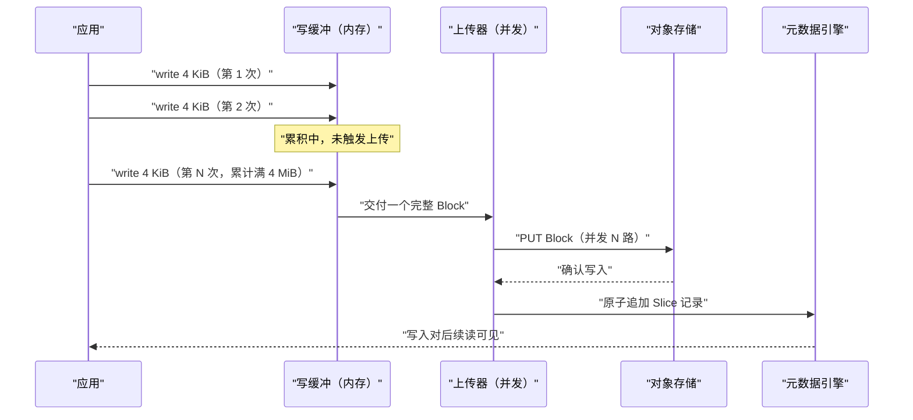
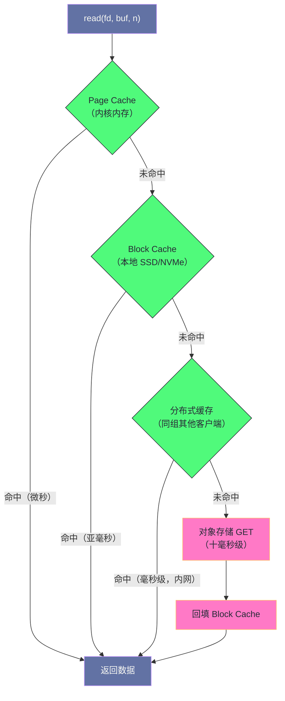
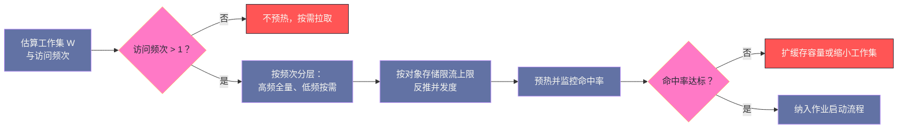

# 03 JuiceFS 数据存储——分块、压缩与缓存

**摘要：**

数据侧要解决的核心矛盾只有一个：**对象存储的高延迟与带宽上限，和应用程序对文件 IO 的期望之间的落差。** 本文把 JuiceFS 应对这个矛盾的手段拆成三组机制来讲。第一组是写路径上的**写缓冲与并发上传**，它把零散的 `write` 攒成整块对象、把单次 PUT 的开销摊薄，并用并发把吞吐从"单连接延迟的倒数"提升到"并发数乘以块大小除以延迟"。第二组是读路径上的**三级缓存**（内核 Page Cache、本地磁盘 Block Cache、客户端间分布式缓存）与**预读**，它把远端几十毫秒的延迟在命中时压到亚毫秒。第三组是**压缩与客户端加密**，它们在 CPU 与带宽/存储成本之间做交换。文章随后给出缓存命中率的诊断方法（低命中率的四类根因与排查顺序），以及这套机制失效的边界。全文回答两个问题：为什么"分块 + 缓存"能救回对象存储的延迟，以及什么时候救不回来。

---

## 第 1 章 数据侧的核心矛盾

### 1.1 三条延迟量级

要理解 JuiceFS 数据路径上的每一个设计，先要接受一组不体面但真实的数量级。

| 访问目标 | 延迟量级 | 相对倍数 |
|---|---|---|
| 内核 Page Cache（内存） | 微秒 | 1 |
| 本地 NVMe SSD | 百微秒量级 | 约 100 倍 |
| 同机房对象存储 | 十毫秒量级 | 约 10000 倍 |
| 跨区域对象存储 | 数十到上百毫秒 | 约 100000 倍 |

这组数字说明一件事：**只要一次 IO 落到了对象存储，应用就要付出比本地访问多四个数量级的等待。** 而文件系统的调用方（Spark 的读取器、PyTorch 的 DataLoader、Python 的 `open`）通常并不会为此做任何适配——它们按"本地文件"的预期发起请求，并按同样的预期等待结果。

这就是矛盾的来源：**上层的期望是本地盘量级，下层的现实是网络量级，中间必须有一层把差距吸收掉。** JuiceFS 的数据路径设计，全部围绕"如何把这四个数量级尽量挡在应用之外"展开。

### 1.2 三组机制的分工

JuiceFS 用了三组机制来吸收这个落差，它们分别针对矛盾的不同侧面。

**写路径的机制**解决的是"次数"问题。对象存储的 PUT 有固定开销，写入越碎、次数越多，开销占比越高。写缓冲把多次小写攒成一次大对象上传，本质上是把固定开销的**分母**做大。

**读路径的机制**解决的是"位置"问题。既然远端慢、本地快，那就尽量让数据从本地取——这就是三级缓存与预读的全部动机。缓存命中时，一次读的延迟由本地介质决定；未命中时才回落到对象存储。

**压缩与加密**解决的是"体积"问题。数据在上传前先变小，等于同时降低了存储成本、网络传输时间与（在某些计价模型下）请求成本，代价是消耗 CPU。它不改变访问次数与位置，只改变每次传输的字节数。

三组机制的共同特征是**它们都在客户端完成**。这是 JuiceFS 没有服务端进程这个架构选择的必然结果：既然没有服务端可以帮你做缓冲、缓存、压缩，那就全部放在客户端，靠"每个客户端自己尽力"来达成整体效果。这个选择带来了简单，也带来了第 8 章要讨论的局限。

> [!info] 核心概念
> JuiceFS 的数据路径可以用一句话概括：**写的时候尽量攒大、读的时候尽量就近、传的时候尽量变小。** 攒大靠写缓冲，就近靠多级缓存与预读，变小靠压缩。三者的取舍点各不相同——攒大受内存与持久性约束，就近受本地磁盘容量与一致性约束，变小受 CPU 与数据可压缩性约束。

### 1.3 数据侧与元数据侧的分界

在展开具体机制之前，需要先把"数据侧"的边界划清楚，否则很容易把两类问题混在一起。

**数据侧管的是"字节怎么存、怎么取、怎么传"**：分块模型、写缓冲、缓存、预读、压缩、加密。它处理的对象是文件内容，性能指标是吞吐与读延迟。

**元数据侧管的是"文件在哪里、叫什么、有多大"**：目录树、属性、Chunk 与 Slice 的映射关系。它处理的对象是路径与属性，性能指标是操作延迟与 QPS。

两侧的分界线是**元数据中的 Chunk 映射**：数据侧的一切寻址，都要先向元数据侧问"这个偏移落在哪个 Block 上"。因此当读取变慢时，必须先判断是"寻址慢"（元数据侧）还是"取数慢"（数据侧）——这个判断决定了后面所有排查动作的方向。元数据侧的机制与选型已在 [[02 JuiceFS 元数据引擎——Redis、TiKV 与 SQL 后端的对比]] 中展开，本篇只处理数据侧。

---

## 第 2 章 写路径：从 write() 到对象 PUT

### 2.1 为什么必须有写缓冲

先做一个算术。假设应用每次 `write` 4 KiB，而对象存储单次 PUT 的有效耗时（建连、签名、传输、确认）是 50 毫秒。如果每次 `write` 都直接触发一次 PUT，那么单线程的写吞吐上限就是 `4 KiB ÷ 50 ms ≈ 80 KiB/s`。这个数字连本地磁盘的千分之一都不到，任何写入型负载都无法接受。

再算一次：如果把数据攒到 4 MiB 再上传，同样 50 毫秒的固定开销被摊到 4 MiB 上，单次 PUT 的等效吞吐变成 `4 MiB ÷ 50 ms ≈ 80 MiB/s`。**同样的延迟，吞吐提升了一千倍**——差别只在于"把固定开销的分母做大"。

这就是写缓冲存在的全部理由。它不改变对象存储的延迟特性，只是把"每次小写都付一次固定开销"改成了"多次小写合并付一次"。



### 2.2 三个触发时机

写缓冲里的数据什么时候必须离开内存，由三个条件中的任意一个触发。

**条件一：攒满一个 Block。** 这是常规路径，也是效率最高的路径——上传的对象尺寸恰好是设计值，固定开销摊薄得最充分。

**条件二：`close()` 或 `fsync()`。** 这两个调用意味着应用明确要求"数据必须落定"。此时即使缓冲未满，也必须把残余数据上传（上传为不足一个 Block 的对象），否则一旦客户端进程崩溃，这部分数据就丢了。这里有一个容易误解的点：JuiceFS 的 `fsync` 语义是"数据已进入对象存储"，而不是"已落到本地磁盘"——它的延迟天然比本地 `fsync` 高一个数量级。

**条件三：上传延迟到期。** 写缓冲可以配置一个等待时长（`--upload-delay`），让数据在缓冲里多停留一会儿，以期攒到更大的批量。默认值是不等待（攒满即发）。把它调大可以提升"写入合并度"，代价是数据在内存中滞留更久、崩溃时丢失的风险窗口更大。

### 2.3 并发上传与失败重试

单个 Block 的上传是串行的网络操作，但多个 Block 可以并行。JuiceFS 允许配置同时上传的 Block 数量（`--max-uploads`），这直接决定了单客户端的写吞吐上限。

设单次 PUT 的有效耗时为 T，并发度为 C，Block 大小为 S，则理论写吞吐约为 `C × S ÷ T`。这个式子给出两条调优结论：并发度对吞吐的贡献是线性的（在对象存储不触发限流的前提下）；跨区域部署时 T 变大，同样的并发度换来的吞吐成比例下降——**此时正确的动作是把对象存储搬到同区域，而不是无脑加大并发**。

失败处理同样重要。Block 上传失败（网络抖动、对象存储限流）时，客户端会重试；重试仍失败时，未上传成功的数据会被暂存到本地缓存目录，等待后续补传，而不是直接丢弃。同时，**元数据的 Slice 记录只在 Block 确认落定后才写入**——这个顺序保证了元数据不会指向不存在的对象。反过来，如果 Slice 记录写入成功但对象实际不存在（譬如对象存储侧发生了数据丢失），那就属于需要靠 `fsck` 才能发现的"元数据与数据不一致"，是另一类故障。

### 2.4 顺序写与随机写的不同命运

写路径的效率，高度依赖写入模式。

**顺序写**（追加日志、落盘模型权重、导出数据集）是最理想的形态：数据自然地按 Block 边界积累，每个 Block 只上传一次，Slice 记录也是简单追加，Compaction 几乎不触发。这类负载在 JuiceFS 上的表现接近对象存储的带宽上限。

**随机覆盖写**（数据库文件、反复修改的中间结果）则要付出额外代价：每次覆盖都会生成新的 Slice，旧 Block 在失去引用前仍占空间，Chunk 内的 Slice 数量快速增长，进而触发后台 Compaction——而 Compaction 本身要读回旧数据再写新数据，等于把写入量又放大一遍。因此**随机覆盖写在 JuiceFS 上会同时承担"空间放大"与"Compaction 流量"两笔成本**。

### 2.5 写缓冲的内存预算与崩溃影响

写缓冲是"用内存换吞吐"的典型，因此它的配置本质上是一道内存预算题。

假设一个客户端同时写入 M 个文件，每个文件的写缓冲上限为 B，则最坏情况下的缓冲占用是 `M × B`。如果 B 取默认的几百 MiB，而 M 又达到几十，那么单节点的写缓冲占用就会逼近机器的可用内存——这不是理论风险，在"Spark 一个 Executor 同时写几百个输出文件"的场景里非常容易发生。

因此写缓冲的容量需要按"最大并发写文件数 × 单文件缓冲上限"来反推，而不是照搬默认值。在内存紧张的节点上，宁可把缓冲调小、让上传更频繁一点，也不要让客户端因为内存不足被系统杀掉——**客户端被 OOM Killer 杀掉比写吞吐下降严重得多，因为它会同时中断该节点上所有挂载点的服务。**

崩溃影响同样值得算清。写缓冲里的数据尚未进入对象存储，如果客户端进程崩溃，这部分数据就丢了。丢失的量级上界是"每个未完成文件最多一个未满 Block"，即 `M × S`（S 为 Block 大小）。这个量级通常是可以接受的——它意味着"最近几秒内写入的、不足一个 Block 的尾部数据"可能丢失，而已经上传的 Block 不会受影响。但如果把 `--upload-delay` 调得很大，丢失窗口就会随之扩大，这是"提升合并度"必须付出的对价。

### 2.6 读写混合负载的资源竞争

真实业务很少是纯读或纯写，而读写混合会引发三处资源竞争，这也是"同样配置在不同作业上表现差异很大"的常见原因。

**第一处是网络带宽的竞争。** 上传与下载共享同一块网卡与同一条到对象存储的链路。当写入占用大量上行带宽时，读取的下载速度会被压缩，表现为"读延迟无故升高"。缓解手段是限制写入并发（`--max-uploads`）或把读写拆到不同节点。

**第二处是本地磁盘的竞争。** Block Cache 的读写、写缓冲失败时的本地暂存、以及 Compaction 的临时读写，都落在同一块盘上。缓存目录与暂存目录若在同一块盘，读写混合时会互相拖慢——尤其是随机读与 Compaction 的顺序读会争抢磁盘队列。

**第三处是内存的竞争。** 写缓冲占用内存，Block Cache 的元信息与 Page Cache 也占用内存。在内存紧张的节点上，写缓冲的膨胀会挤压 Page Cache，间接降低读命中率——这解释了一种令人困惑的现象：**加大写入并发之后，读取反而变慢了**，因为写缓冲把内存吃掉了。

这三处竞争的共同特征是"隐式耦合"：从单个参数上看不出问题，只有把读写放在一起观察才会发现。因此在调优读写混合负载时，正确做法是**先分别测出纯读与纯写的性能上限，再看混合时的实际表现**，两者的差距就是竞争成本。

---

## 第 3 章 读路径：三级缓存与预读

### 3.1 三级缓存的分工



三级缓存的容量与持久性各不相同，它们之间是**互补而非替代**的关系。

| 层级 | 介质 | 容量约束 | 持久性 | 典型延迟 |
|---|---|---|---|---|
| Page Cache | 内核内存 | 受系统可用内存限制，内存压力下被驱逐 | 进程重启即失效 | 微秒 |
| Block Cache | 本地 SSD/NVMe | 由缓存大小上限与磁盘剩余空间共同约束 | 跨进程重启保留，节点重装即失效 | 亚毫秒到毫秒 |
| 分布式缓存 | 同组其他客户端的内存/磁盘 | 取决于对端可用缓存 | 对端下线即失效 | 毫秒级（内网） |

### 3.2 Page Cache：免费但不可控

通过 FUSE 读取的数据会被内核自动缓存在 Page Cache 中，第二次访问同一区域时不再进入用户态。这是"零成本"的一级缓存，但它有两个不可控之处：一是**淘汰时机由内核决定**，内存压力大时热点数据也可能被驱逐；二是**容量不可预留**，无法保证某份数据集留在内存里。

因此对于"多轮访问同一大数据集"的训练场景，不能依赖 Page Cache，必须依赖 Block Cache。

### 3.3 Block Cache：可控的持久化缓存

Block Cache 是 JuiceFS 在本地磁盘上维护的对象级缓存，它把从对象存储下载的 Block 落盘保存，下次读取同一 Block 时直接从本地读。几个关键配置决定了它的行为：

| 配置 | 作用 | 取舍 |
|---|---|---|
| 缓存目录 | 指定缓存落在哪块盘 | 应当放在本地 SSD/NVMe，不要放在网络盘或机械盘 |
| 缓存容量上限 | 控制缓存最多占用多少空间 | 越大命中率越高，但会挤占其他业务的空间 |
| 保留空间比例 | 保证磁盘至少留出一定空闲 | 防止缓存把系统盘写满导致节点异常 |

这里最需要强调的一条经验是**缓存介质的选择**。Block Cache 的收益全部来自"本地比远端快"，如果缓存目录落在机械盘上，随机读的 IOPS 会低到让"命中缓存"的延迟反而接近甚至超过直接从对象存储读——此时缓存不仅没有收益，还额外消耗了本地 IO 与磁盘寿命。

Block Cache 的淘汰策略是 LRU（最近最少使用）。这个策略对"访问有局部性"的负载有效，对"完全随机访问"的负载几乎无效——后者是第 8 章要讨论的反例。

### 3.4 分布式缓存：把重复流量挡在集群内部

在一个 N 节点的计算集群里，如果每个节点都从对象存储拉同一份数据，对象存储就要承担 N 倍的出网流量。分布式缓存（P2P 缓存）的思路是：**让客户端之间互相取缓存，只有第一个节点需要回源。**

它的收益随集群规模放大：N 个节点读同一份冷数据，回源流量从 N 份降到 1 份，对象存储的请求数与出网费用同步下降。代价是引入了客户端之间的协调：需要发现同组节点、需要处理对端不可用、需要防止缓存环路。它也更依赖内网质量——如果内网带宽还不如对象存储出网带宽，那这个机制就是负收益。

### 3.5 预读：隐藏顺序读的往返延迟

顺序读大文件时，每次读都要等一次对象存储的往返。预读的做法是**在下载当前 Block 的同时，提前发起后续 Block 的下载**，让多次往返在时间上重叠。

它的效果可以用一个简化模型估计：设单次 GET 的耗时由"固定往返 T0"与"传输时间 Tt"组成，无预读时每个 Block 的耗时是 `T0 + Tt`，有预读且预读窗口为 K 时，稳态下每个 Block 的等效耗时趋近于 `max(T0 ÷ K, Tt)`。也就是说，**预读把固定往返摊薄到窗口内的多个 Block 上**，直到传输时间成为主导。

预读的有效前提是**访问模式可预测**。顺序扫描（Parquet 列读、视频播放、模型加载）完全符合；随机小 IO 不符合——没有"下一块"可言，预读只会浪费带宽与缓存空间。

### 3.6 数据缓存与元数据缓存的分工

初学者常把两类缓存混为一谈，但它们在 JuiceFS 里服务的是完全不同的目标。

**数据缓存**（Page Cache 与 Block Cache）缓存的是**文件内容**，解决的是"读一个字节要等多久"。它的失效由数据是否被修改决定，而由于 JuiceFS 的数据块不可变，旧块永远不会被复用，因此数据缓存不需要一致性校验。

**元数据缓存**（属性缓存、目录项缓存、目录内容缓存）缓存的是**路径与属性**，解决的是"查一次 `stat` 要跑几趟元数据引擎"。它的失效由时间窗口决定——客户端在 TTL 内不再向元数据引擎确认，因此可能看不到其他客户端刚做的修改。

这两类缓存的调优方向相反：数据缓存越大越好（在介质允许的前提下），元数据缓存的 TTL 则要在"降低元数据 QPS"与"保证可见性新鲜度"之间权衡。在只读数据集上，把元数据 TTL 调大是近乎无损的优化；在多方协作写的目录上，调大 TTL 会带来"文件已存在却看不到"的困扰。

还有一处细节：**目录深度会同时放大两类缓存的收益**。路径越深，一次 `stat` 需要的元数据查询越多，元数据缓存的收益越大；而数据缓存的收益与目录深度无关，只与访问的重复度有关。因此"深目录 + 高频 stat"的负载，优化重点应当放在元数据缓存而不是数据缓存上。

### 3.7 缓存目录的工程规范

缓存目录的配置看起来只是"指定一个路径"，但它决定了缓存的性能上限与运维稳定性，值得定几条规范。

**规范一：缓存目录必须落在本地盘，且优先 NVMe。** 网络盘（NFS、云盘挂载）会让"命中缓存"的延迟回到网络量级，缓存彻底失去意义；机械盘的随机 IOPS 过低，在多线程并发读时甚至可能慢于直接从对象存储读。

**规范二：缓存目录独占一块盘，不与系统盘、数据盘、日志盘混用。** 混用的后果是双向的：缓存写满会影响系统稳定，其他业务的 IO 洪峰会拖慢缓存读取。独占一块盘可以让缓存的行为完全可预测。

**规范三：设置明确的容量上限与保留空间。** 容量上限控制缓存最多占多少空间，保留空间保证磁盘不会真的被写满。两者叠加才能既充分利用磁盘又避免"磁盘满导致节点异常"。

**规范四：缓存目录应当是持久化的本地盘，而不是容器可写层。** 在 Kubernetes 环境里，如果缓存目录落在容器可写层（OverlayFS 的上层），那么 Pod 重建即清空缓存。把缓存目录挂载为宿主机路径或独立的本地卷，才能让缓存在 Pod 重建后仍然有效——这一点对"频繁滚动更新"的集群尤其重要。

这四条规范都不涉及复杂调优，却决定了缓存机制能否发挥设计中的效果。**数据路径上的性能问题，相当大的比例来自"缓存目录配置不当"这一类基础问题，而不是参数没调好。**

---

## 第 4 章 压缩：用 CPU 换带宽与存储

### 4.1 位置与时机

JuiceFS 的压缩发生在**客户端上传之前**：数据在内存中被压缩，压缩后的结果作为对象写入对象存储；读取时先下载压缩对象，再在客户端解压。这个位置选择带来三个直接后果。

其一，**对象存储里存的是压缩后的字节**，因此存储成本按压缩后体积计费。其二，**网络传输量减少**，跨区域访问时收益尤其明显。其三，**元数据中记录的长度需要区分"逻辑长度"与"物理长度"**，否则读取时会取错字节数。

压缩是 Volume 级别的属性，在创建 Volume 时确定；此后写入的所有新数据按该配置处理，已写入的旧数据不受影响。这意味着"改压缩算法"不是一次配置变更，而是一次**新老数据共存**的状态迁移。

### 4.2 LZ4 与 Zstd 的权衡

| 维度 | LZ4 | Zstandard（Zstd） |
|---|---|---|
| 压缩速度 | 极快，GB/s 量级 | 中等，百 MB/s 量级 |
| 压缩率 | 中等 | 更高 |
| 解压速度 | 极快 | 快 |
| 适用数据 | 日志、JSON、CSV 等文本型 | 冷数据归档、可压缩性高的结构化数据 |
| 适用场景 | 吞吐敏感、CPU 受限 | 存储成本敏感、CPU 充裕 |

选择的分界线是**瓶颈在哪一侧**。如果瓶颈是网络带宽或对象存储吞吐（跨区域、带宽受限），应当选 LZ4——它的解压速度足以让 CPU 不成为新瓶颈；如果瓶颈是存储成本（长期归档、冷数据），应当选 Zstd——用更多的 CPU 换更小的体积。

### 4.3 不该压缩的数据

有几类数据压缩是负收益，需要明确排除。

**已经压缩过的格式**：JPEG、PNG、MP4、以及内部已压缩的列式格式（Parquet 默认用 Snappy 或 Zstd 压缩数据页、ORC 同理）。对这类数据再压一遍，通常只能省下个位数百分比的体积，却要付出完整的 CPU 开销。

**高熵数据**：模型权重文件（浮点参数近似随机）、加密后的数据、已编码的二进制。压缩算法对高熵输入的输出体积几乎等于输入体积，压缩率接近 1，CPU 白花。

**极小块数据**：小于几百字节的对象，压缩头部的开销可能超过节省的体积。

判断方法很简单：**在目标数据集上实测压缩率**。压缩率低于 1.2 左右的数据集，压缩基本不值得开启。

### 4.4 CPU 与带宽的换算

压缩的收益能否兑现，取决于一个简单的不等式：**压缩节省的传输时间，是否大于压缩与解压消耗的 CPU 时间。**

设原始体积为 V、压缩率为 r、网络带宽为 B、压缩与解压的合计吞吐为 P（单位时间处理的数据量），则开启压缩的净收益约为 `V × (1 - r) ÷ B`（节省的传输时间）减去 `V ÷ P`（CPU 时间）。当带宽 B 较小（跨区域、共享链路）或压缩率 r 较低（数据可压缩）时，这个不等式容易成立；反之在"内网高带宽 + 低压缩率"的组合下，压缩是纯亏损。

这也解释了为什么同一个压缩配置在不同环境下的评价会截然相反：**压缩的效果不是数据属性的函数，而是"数据属性 × 网络条件 × CPU 余量"三者的联合函数。**

### 4.5 压缩与分块大小的相互影响

压缩与分块是两件独立配置的事，但它们的效果会相互影响，值得单独说明。

**压缩的对象是 Block**，因此 Block 越大，压缩的"上下文"越充分、压缩率越高——这与"把同一份数据切成更多小对象分别压缩会损失压缩率"是同一个道理。反过来说，如果为了降低随机写放大而把 Block 调小，压缩率会随之下降，压缩收益被削弱。

**压缩后的体积会影响"块是否值得缓存"的判断。** 一个压缩率为 3 的数据集，其缓存占用只有原始体积的三分之一，等于在同样的缓存容量下能装下三倍的工作集——**压缩在这里间接提升了缓存命中率**。这是"压缩 + 缓存"组合常常能带来超预期收益的原因：两项优化的收益叠加，而不是各自独立。

由此得到一条实践建议：**如果负载同时具备"可压缩"与"有重复访问"两个特征，压缩的收益会被缓存放大。** 典型例子是文本型训练语料与日志数据。

---

## 第 5 章 客户端加密：把信任边界放在客户端

### 5.1 为什么要在客户端加密

JuiceFS 的加密发生在**客户端**，密钥由使用者掌握，对象存储只看到密文。这个设计针对的是"存储侧不可信"的场景：对象存储由第三方提供、或者对象存储的运维人员不应看到明文。

它的实现方式通常是"对称加密 + 非对称密钥封装"的组合：数据用对称算法加密（密钥随机生成），对称密钥本身再用 RSA 公钥加密后随对象一起存储。这样客户端只需要保管私钥，就能解密所有数据，而对象存储侧即使拿到全部对象也无法还原明文。

### 5.2 与压缩的顺序

加密与压缩同时开启时，**顺序必须是先压缩、后加密**。原因很直接：加密后的数据是高熵的，压缩算法对它无能为力。如果先加密再压缩，压缩环节就是纯粹的开销浪费。

这条顺序要求也解释了为什么"加密 + 压缩"的组合收益会低于单独压缩：压缩必须在明文上进行，因此它节省的是"明文体积"，而加密后的密文体积与明文体积大致同阶——压缩的收益仍然成立，只是不能叠加"对密文再压一遍"的想象空间。

### 5.3 性能与合规的取舍

客户端加密带来的成本有三块：**CPU 开销**（加解密吞吐）、**密钥管理复杂度**（私钥的保管、轮换、丢失后的后果）、以及**运维盲区**（对象存储侧看到的是密文，无法做内容级的去重或扫描）。

最后一块常被忽略：**加密会关闭服务端去重**。如果对象存储原本依赖内容哈希做去重来降低成本，加密后每个对象的密文都不同，去重失效，存储成本可能反而上升。因此"是否开启加密"是一个需要同时考虑合规要求与成本结构的决策，而不是单纯的"更安全就更好"。

### 5.4 密钥管理：加密方案里最脆弱的一环

加密算法的强度通常不是风险点，**密钥的保管才是**。客户端加密意味着私钥一旦丢失，对象存储里的密文就永久无法解密——这不是"数据暂时不可用"，而是"数据实质损毁"。因此在采用客户端加密的部署里，密钥的备份等级必须高于元数据备份，且必须异地保存、离线保存。

与之配套的三条要求是：密钥的轮换要有明确流程（轮换后旧数据仍用旧密钥解密，因此必须保留历史密钥）；密钥的访问权限要严格收敛（能解密全部数据的能力本身就是极高权限）；以及**必须做过一次"用备份密钥恢复数据"的演练**——没有演练过的备份不算备份，这一点在密钥上尤其成立。

反过来，如果合规要求并不强制"存储侧不可见"，那么采用"对象存储服务端加密"往往比客户端加密更划算：它免去了密钥管理负担，也保留了服务端去重与内容扫描的能力。**在加密这件事上，"更强的加密"不等于"更合适的方案"。**

---

## 第 6 章 缓存预热与一致性

### 6.1 warmup：把冷启动挪到作业开始之前

对确定会被访问的数据集（训练集、常用维表），可以在作业开始前主动把数据拉进 Block Cache，避免第一轮访问时被对象存储延迟拖慢。

```bash
# 预热一个目录（并发拉取其中的所有 Block 到本地缓存）
juicefs warmup --threads 32 /mnt/jfs/train_data/

# 预热指定文件列表（从标准输入读取）
find /mnt/jfs/train_data -name "*.parquet" | juicefs warmup --file -

# 观察缓存目录的增长，判断预热进度
watch -n 5 "du -sh /data/jfs-cache"
```

预热的工程要点是**并发度与耗时的权衡**：并发越高，预热越快，但对对象存储的瞬时压力越大，容易触发限流。合理的做法是按"对象存储的请求速率上限"反推并发度，并在预热期间监控对象存储的错误率。

### 6.2 缓存失效：三条路径

缓存的有效性依赖"数据没变"这个前提。失效有三条路径。

**第一条是容量淘汰。** 缓存空间不足时，LRU 会驱逐最久未访问的 Block。这属于"正常的缓存行为"，但会导致命中率随负载变化而波动。

**第二条是数据更新。** 当某个文件被修改，它对应的旧 Block 就不再是最新内容。JuiceFS 靠元数据中的 Slice 映射来保证正确性——修改会生成新的 Slice 与新 Block，旧 Block 自然被绕过，不需要显式失效。**这是"数据不可变"设计带来的一个隐性好处：缓存永远不需要做一致性校验，因为旧数据永远不会被复用。**

**第三条是属性缓存过期。** 客户端为了减少元数据查询，会把文件属性与目录项缓存在本地一小段时间。在这个窗口内，客户端可能看不到其他客户端刚做的修改。这一点在第 8 章作为反例讨论。

### 6.3 容量规划：缓存多大才够

缓存容量的规划取决于**工作集大小**与**访问局部性**。

如果工作集（被反复访问的数据总量）小于缓存容量，理论上可以达到接近百分之百的命中率；如果工作集远大于缓存容量，命中率就取决于访问是否具有局部性——随机访问的工作集等于数据集全体，命中率会退化为"缓存容量除以数据集大小"。

因此规划步骤是：先估算工作集，再判断访问模式是否局部，最后把缓存容量设为工作集的一个比例（并在监控中验证实际命中率）。**不要用"数据集大小"来规划缓存容量**——数据集可以无限大，缓存只该覆盖被反复访问的那一部分。

### 6.4 预热的成本收益核算

预热不是免费的，它在"提前付出带宽"与"避免作业卡顿"之间做交换，因此值得算一次账。

预热的成本是**把整个工作集从对象存储读一遍的流量与时间**。设工作集体积为 W、对象存储带宽为 B、预热并发有效吞吐为 Bp（通常小于 B，因为受客户端与服务端两侧约束），则预热耗时约为 `W ÷ Bp`。收益是**后续每一次作业启动都不再冷启动**。

因此预热划算的前提是：**工作集会被反复访问，且单次冷启动的代价高于预热成本。** 对于"只跑一次"的作业，预热纯属浪费；对于"每天跑几十次的训练任务"，预热一次可以省下几十次冷启动。这也意味着预热的粒度应当按"访问频次"来分层——高频访问的部分全量预热，低频部分按需拉取。



还有一处容易被忽略的成本：**预热会占用缓存空间**，可能把原本有局部性的其他数据挤出去。如果节点的缓存同时服务多个业务，预热一个大数据集可能导致其他业务的命中率下降——**预热决策必须放在"整个节点缓存预算"的视角下做，而不是单个作业的视角。**

### 6.5 缓存的生命周期管理

缓存不是"配好就不用管"的资源，它的有效容量会随时间与运维动作发生变化，需要按生命周期来管理。

**起点是节点初始化。** 新节点上线时缓存为空，如果不做预热，第一次作业必然经历冷启动。因此在自动化部署流程里，应当把"预热高频数据集"作为节点就绪的一个步骤，而不是留给作业自己去承担。

**中途会经历三类损耗。** 其一是**容量淘汰**：工作集增长或缓存上限被调小，都会导致驱逐增加。其二是**节点重启**：内存中的 Page Cache 全部失效，Block Cache 视其落盘位置而定——若缓存目录挂载在临时盘或容器可写层上，重启即清空；只有落在持久化的本地盘上才能跨重启保留。其三是**磁盘写满**：缓存目录所在盘被其他数据占满时，缓存会被迫驱逐，此时命中率会突然掉下来。这三类损耗中，**只有第一类是可预期的，后两类必须靠监控提前发现**。

**终点是节点退役。** 节点下线时缓存自然失效，无需特别处理；但如果节点是被临时下线后又上线（弹性伸缩场景），那么每次上下线都会清空缓存，形成"反复冷启动"的循环。这种情况下应当考虑把缓存目录放在持久化的数据盘上，并让节点池的伸缩策略尽量保持稳定——**频繁伸缩的节点池与依赖缓存的负载天然不合。**

一条实用原则是：**把缓存目录与数据盘分开规划，并为缓存目录设置明确的容量上限与磁盘剩余空间告警。** 缓存目录失控（写满系统盘）是生产事故里最常见也最容易避免的一类。

---

## 第 7 章 缓存命中率的诊断

### 7.1 命中率怎么算

命中率是这套机制的核心健康指标，定义为"从缓存满足的读取次数"除以"总读取次数"。JuiceFS 客户端通过指标端点暴露缓存命中与未命中的计数，Prometheus 侧的表达式大致形如：

```promql
# Block Cache 命中率
rate(juicefs_blockcache_hits[5m])
/ (rate(juicefs_blockcache_hits[5m]) + rate(juicefs_blockcache_miss[5m]))
```

需要留意的口径问题是：这里的"未命中"包含"首次访问"与"被淘汰后重新访问"两种含义完全不同的情况。首次访问导致的未命中是不可避免的（数据总要从对象存储来一次），被淘汰导致的未命中才是配置问题。因此**观察命中率必须结合"是否处于稳态"**——刚预热完的窗口内命中率低是正常的。

### 7.2 低命中率的四类根因

| 根因 | 表现 | 排查手段 |
|---|---|---|
| 缓存容量不足 | 命中率随负载升高而下降，缓存目录长期满 | 查看缓存目录使用量与驱逐计数 |
| 访问模式随机 | 命中率稳定在一个低水平，与容量无关 | 分析应用的读偏移分布 |
| 缓存介质太慢 | 命中率不低但延迟不降 | 检查缓存目录所在磁盘类型与 IOPS |
| 缓存被反复清空 | 命中率周期性归零 | 检查节点重启、缓存目录被清理、磁盘写满 |

四类根因的应对方式完全不同：容量不足要扩容，随机访问要改负载形态或接受低命中率，介质太慢要换盘，反复清空要修运维流程。**先定位根因再调参数，是这个环节最重要的纪律**——看到命中率低就加大缓存容量，只有在第一类根因下才有效。

### 7.3 调优的正确顺序

把数据路径的调优动作排个序，收益从高到低大致是：

1. **确认缓存介质是本地 SSD/NVMe。** 这一步的收益最大，成本最低，却最常被忽略。
2. **让工作集适配缓存容量。** 通过预热、分片、或按访问频率分层来控制工作集。
3. **提高顺序读的预读窗口。** 对顺序扫描型负载有效。
4. **调大并发上传/下载数。** 前提是对象存储未触发限流。
5. **开启压缩。** 仅在带宽受限或存储成本敏感时。
6. **启用分布式缓存。** 仅在多节点读同一份冷数据时。

这个顺序的背后逻辑是：**先解决"用不用得上本地资源"，再解决"本地资源够不够"，最后才考虑"网络侧能不能省"。** 反过来调（先加压缩、先加并发）往往是在优化占比最小的一段。

### 7.4 一次"训练突然变慢"的定位过程

把诊断方法串成一个完整案例，比罗列指标更容易记住。

假设现象是：某个训练任务昨天每小时跑一个 Epoch，今天变成两小时一个，GPU 利用率从九成掉到六成。按下面的顺序定位。

**第一步，先看是数据侧还是元数据侧。** 观察客户端暴露的两组延迟：数据读取延迟与元数据操作延迟。如果只有数据延迟升高，问题在缓存或对象存储；如果元数据延迟也升高，问题可能在元数据引擎。这一步把排查范围砍掉一半。

**第二步，看缓存命中率是否变化。** 如果命中率从九成掉到三成，说明问题在本地：可能是节点被重装或重启导致缓存清空、可能是缓存目录磁盘写满触发驱逐、也可能是缓存目录所在盘出现 IO 故障。此时不需要看对象存储，直接查本地。

**第三步，若命中率正常，看对象存储侧的请求延迟与错误率。** 对象存储侧出现限流或抖动时，未命中的那部分 IO 会显著变慢。此时要区分是"限流"（请求被拒）还是"抖动"（请求变慢），前者要降并发，后者要考虑换区域或加缓存。

**第四步，若对象存储也正常，看本地磁盘的 IO 饱和度。** 一个反直觉的常见原因是：**缓存目录所在盘被其他业务或 Compaction 占满了 IO**，导致"命中缓存的读取"也变慢。这种情况下命中率指标完全正常，但延迟就是上不去——只有看磁盘 IO 饱和度才能发现。

**第五步，回看写入侧。** 如果该任务同时有大量写入，写入侧的 Compaction 会与读取争抢磁盘与网络。此时现象是"读写互相拖慢"，需要评估是否要限制写入并发或把读写拆到不同节点。

这五步的价值在于**每一步都在缩小范围**，而不是同时调整所有参数。数据路径的调优最忌讳"一次性把所有参数都改一遍"——那样即使问题消失，也不知道是哪一个参数起了作用，下次遇到同类问题仍然无从下手。

---

## 第 8 章 边界与反例

### 8.1 反例一：完全随机的读负载

如果负载的读偏移在数据集上均匀随机分布（随机采样训练、随机点查），那么 Block Cache 的命中率上限就是"缓存容量除以数据集大小"。在数据集远大于缓存的常见情形下，命中率会低到个位数百分比，缓存的唯一作用是把"每次读都走对象存储"变成"偶尔能省一次"。

更麻烦的是这类负载还会**污染缓存**：随机访问会不断把冷数据塞进缓存，把真正有局部性的热点数据挤出去。因此在混合负载（既有顺序扫描又有随机点查）的环境里，需要评估随机负载对缓存命中率的破坏程度。

### 8.2 反例二：把 JuiceFS 当本地盘做低延迟写入

本地盘的 `fsync` 是"数据落到本地持久介质"，延迟在毫秒级；JuiceFS 的 `fsync` 是"数据上传到对象存储"，延迟在几十毫秒级。任何依赖"高频 fsync + 低延迟"的程序（数据库、消息队列的日志、需要强持久性的中间件）放到 JuiceFS 上都会出现数量级的性能退化，且这种退化不是靠调参能消除的——它是架构决定的。

### 8.3 反例三：依赖属性缓存窗口外的实时可见性

客户端为了减少元数据查询会缓存属性与目录项一小段时间。如果一个应用用"创建文件"作为进程间信号（A 创建 `ready` 文件，B 轮询该文件是否出现），在缓存窗口内 B 可能看不到 A 刚创建的文件，导致逻辑卡住。这类用法应当改用真正的进程间通信机制，而不是借用文件系统的可见性语义。

### 8.4 反例四：跨区域部署却期待本地延迟

如果客户端与对象存储跨区域，那么无论缓存做得多好，**未命中的那部分 IO 都要付跨区域的往返与出网费用**。跨区域部署下的正确做法是"把缓存做大、把预热做足、把跨区访问比例压到最低"，而不是指望预读与并发能消除物理距离带来的延迟。

### 8.5 反例五：把分布式缓存当成免费的容量扩展

分布式缓存能减少重复回源，但它不增加集群的总缓存容量——它只是让"已经有缓存的节点"把数据借给"没有缓存的节点"。如果集群里每个节点访问的数据集互不重叠，分布式缓存毫无收益；如果内网带宽不足，它还会带来负收益。**它的适用前提是"数据在节点间有重叠"，而不是"节点很多"。**

### 8.6 小文件与碎片写：成本结构的差异

最后补充一类既不算"随机读"也不算"随机写"的特殊负载：**大量小文件**。它的成本结构与前面的反例都不同，值得单独算账。

一个 1 KiB 的文件，在 JuiceFS 上至少产生：一份元数据（inode 与目录项，数百字节内存）、一个对象（按对象存储的最小计费单位计费，通常是几十 KB 量级，而不是 1 KiB）、以及一次 PUT 请求。于是它的实际成本由三部分构成：**元数据内存成本、对象存储的最小存储单位浪费、以及请求费用**。三者都与"文件数"成正比，而与"数据总量"无关。

对比一下 HDFS：同样一个 1 KiB 文件，成本是"一份 NameNode 内存 + 一个 128 MiB 块（若未开启小文件合并）"。也就是说，**两者都有小文件成本问题，只是表现形式不同**——HDFS 表现为块浪费与 NameNode 内存压力，JuiceFS 表现为对象最小计费单位与请求费用。

应对手段也就顺理成章地分成三层：**减少文件数**（合并小文件、调整作业的输出分片数）、**减少元数据开销**（控制目录内文件数、避免不必要的 `stat`）、以及**减少请求数**（提高写入合并度、把碎片写入改为顺序追加）。三层里第一层的收益最大，也最难推动——因为它要求改应用侧的行为，而不是改存储配置。

---

## 第 9 章 落点

回到开头那个矛盾：**上层按本地盘的期望发起 IO，下层只能提供网络的量级。** JuiceFS 的数据路径给出了三组机制来吸收这个落差——写的时候攒大、读的时候就近、传的时候变小。

这三组机制的共同前提是"访问模式可预测且具有局部性"。顺序写的合并、顺序读的预读、多轮访问的缓存命中，全都建立在这个前提上；一旦负载变成"随机写 + 随机读 + 无重复访问"，这三组机制就会同时失效，剩下的只有对象存储的原始延迟与 Compaction 的额外开销。

因此这套机制的价值边界可以用一句话表述：**它把"有局部性的 IO"优化到接近本地盘的水平，同时把"无局部性的 IO"完整地留给对象存储去承担。** 理解这条边界，就能判断一个负载是否适合放在 JuiceFS 上——不是看它"读得多还是写得多"，而是看它"是否重复访问同一批数据、是否以顺序方式访问"。

这也是架构权衡的常见形态：**没有一个机制能同时优化所有负载形态，能做的只是识别负载的局部性，然后决定把优化资源投在哪一侧。** 下一篇将把这条判断用到具体场景上，看大数据处理与 AI 训练这两类负载如何从中获益。

最后留下一句可以带走的判断：数据路径上的所有参数（缓冲大小、缓存容量、预读窗口、并发数、压缩开关）都不是"越大越好"的旋钮，而是**在"内存、磁盘、带宽、CPU"四种资源之间重新分配压力的杠杆**。拧动任何一个杠杆，压力都会转移到另一个资源上。因此调优的正确姿态不是"把参数调到最优"，而是"把压力转移到当前最空闲的那种资源上"——这与对象存储本身的选型（[[01 Ceph 全局架构——RADOS、CRUSH 与三大存储接口|自建存储]] 还是云对象存储）遵循的是同一套逻辑。

---

## 专栏导航

- 上一篇：[[02 JuiceFS 元数据引擎——Redis、TiKV 与 SQL 后端的对比]]。
- 下一篇：[[04 JuiceFS 在大数据场景的应用]]。
- 全局架构：[[01 JuiceFS 全局架构——元数据引擎与对象存储的分离设计]]。
- 生产运维与调优：[[05 JuiceFS 运维与调优——性能基准、监控与故障排查]]。
- 返回专栏首页：[[00 专栏导览]]。

---

## 参考资料

1. Juicedata. JuiceFS 官方文档：数据存储与缓存（Chunk/Slice/Block、Block Cache）. https://juicefs.com/docs/zh/community/cache/
2. Juicedata. JuiceFS 官方文档：数据压缩与加密. https://juicefs.com/docs/zh/community/encryption/
3. Juicedata. JuiceFS 官方文档：warmup 与 stats 命令. https://juicefs.com/docs/zh/community/command_reference/
4. Collet Y, et al. LZ4: Extremely Fast Compression Algorithm. https://github.com/lz4/lz4
5. Facebook. Zstandard 压缩算法文档. https://facebook.github.io/zstd/
6. Linux Kernel Organization. FUSE 与 Page Cache 交互说明. https://www.kernel.org/doc/html/latest/filesystems/fuse.html
7. Amazon Web Services. Amazon S3 Multipart Upload 与请求速率说明. https://docs.aws.amazon.com/AmazonS3/latest/userguide/mpuoverview.html

---

> [!note] 思考题
> 1. 写缓冲把多次小写攒成整块上传，摊薄了 PUT 的固定开销。这个机制对"写后立刻要求持久化"的应用是否友好？
> 2. Block Cache 依赖数据不可变，因此永远不需要做缓存一致性校验。如果某天需要支持"原地修改且缓存立即失效"，代价会是什么？
> 3. 预读对顺序读有效、对随机读无效。如何在不改动应用的前提下判断负载属于哪一类？
> 4. 客户端加密会关闭对象存储侧的去重。在成本敏感的场景里，这个代价应当如何被纳入决策？
> 5. 分布式缓存的适用前提是"节点间数据有重叠"。如果集群里每个节点访问互不重叠的数据集，还有哪些手段能降低对象存储的重复压力？
