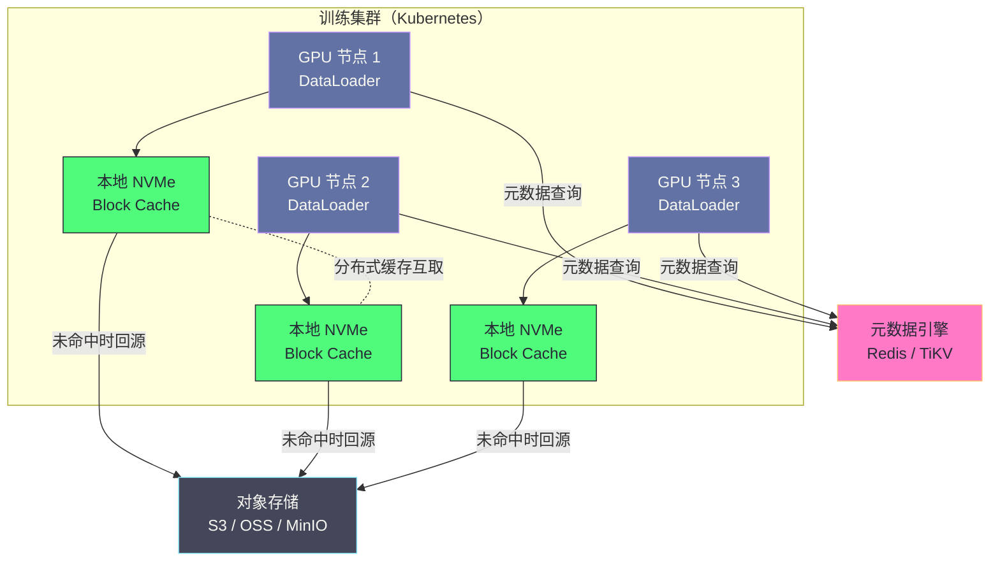
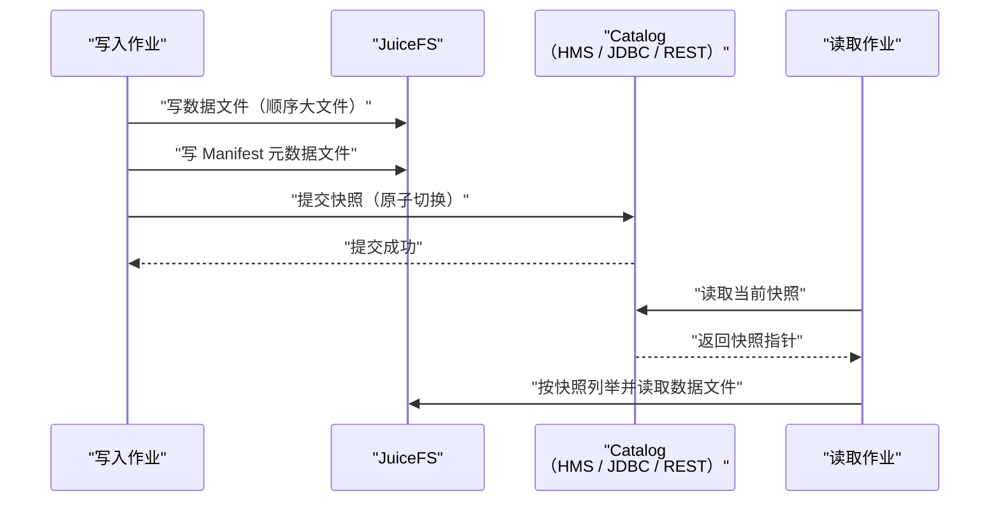
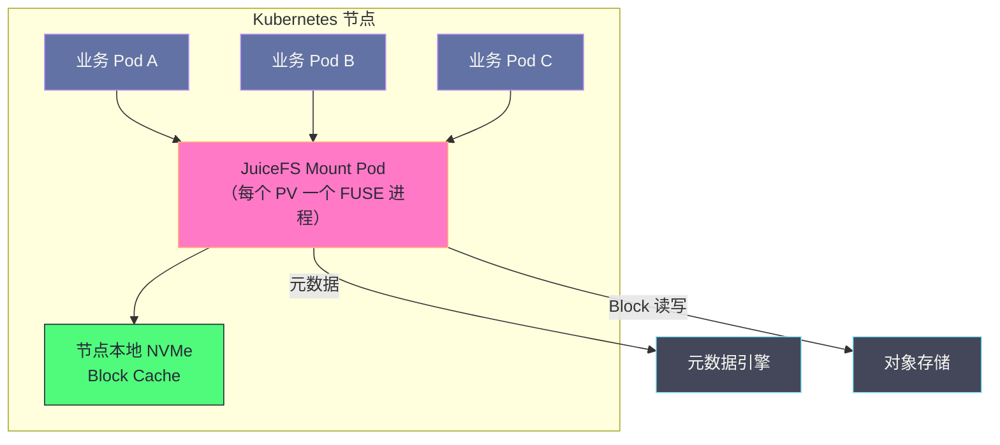

# 04 JuiceFS 在大数据场景的应用

**摘要：**

JuiceFS 的架构特性只有在具体场景里才能被验证。本文挑出三类最能体现其价值的负载——**Hadoop 生态的批处理**、**AI 训练的数据加载**、以及**数据湖表格式的存储层**——逐一拆解它们各自的 IO 画像、落地配置与验收指标。核心判断是：这三类负载有一个共同特征，即**"有访问局部性、又需要 POSIX 语义"**，而 JuiceFS 恰好把对象存储的低成本与文件系统的语义同时提供出来。文章会讲清 Hadoop 侧如何用 `jfs://` 协议零改造接入、如何把 HDFS 的"数据本地性"替换为"缓存本地性"；AI 训练侧如何用元数据缓存 TTL 与预热把 GPU 等待时间压下来；数据湖侧如何补上对象存储缺失的原子 rename。最后给出从 HDFS 迁移的四步路径与验收指标，以及这套方案在 Kubernetes 环境中的形态与边界。

---

## 第 1 章 场景判断：哪些负载适合放在 JuiceFS 上

### 1.1 三类负载画像

JuiceFS 的适用场景不需要逐个枚举，抓住三类画像就够了。

**第一类是 Hadoop 生态的批处理。** Spark、Flink、Hive、MapReduce 通过 Hadoop 的 `FileSystem` 抽象访问存储，它们的 IO 画像是"顺序读大文件 + 批量写输出文件"，作业间共享同一份数据源，且通常运行在弹性调度环境（YARN 或 Kubernetes）中。这类负载与 HDFS 的差异在于：计算节点不再固定，数据本地性无从保证。

**第二类是 AI 训练的数据加载。** 训练作业反复多轮（Epoch）读取同一份数据集，读取模式在"顺序扫大文件"（视频、Parquet）与"随机读小样本"（图片、文本）之间摆动，多机并发访问同一份数据，且对 GPU 等待时间极其敏感。

**第三类是数据湖的存储层。** Iceberg、Hudi、Delta Lake 这类开放表格式需要文件系统提供**原子提交**与**目录语义**，而对象存储原生不具备；同时它们又要求低成本、大容量的存储底座。

### 1.2 共同特征：有局部性，又需要 POSIX

把三类画像放在一起看，会发现它们的共同点不是"数据量大"，而是两个更具体的特征。

**特征一：访问有局部性。** 批处理作业反复读同一批维表与事实表；训练作业反复读同一份数据集；数据湖的查询集中在最近的分区与热点列。有了局部性，缓存才有用武之地——这也是 JuiceFS 数据路径能救回对象存储延迟的前提。

**特征二：需要 POSIX 语义。** 这三个生态里的工具（Spark 的读取器、Python 的数据加载库、表格式的提交逻辑）都建立在文件语义之上：目录、原子重命名、`stat`、`open`。它们不会为了适配对象存储而改写自己的 IO 层。

**JuiceFS 的价值就在这两个特征的交叉点上：它用缓存解决"局部性带来的延迟问题"，用元数据引擎解决"POSIX 语义的缺失问题"。** 换句话说，它不是"更便宜的 HDFS"，而是"给对象存储装上文件系统语义、再装上本地缓存"。

### 1.3 与 HDFS 的能力对照

把能力逐项对照，比笼统地说"可以替代 HDFS"更有指导意义。

| 能力 | HDFS | JuiceFS |
|---|---|---|
| 数据本地性 | 有（计算调度到数据节点） | 无，但有"缓存本地性"（数据缓存到计算节点） |
| 弹性扩缩容 | 存算耦合，扩缩容需数据迁移 | 存算解耦，计算侧随容器伸缩 |
| 多集群共享 | 需 DistCp 复制数据 | 多客户端挂载同一 Volume，零拷贝共享 |
| 元数据规模 | 受 NameNode 内存约束 | 受元数据引擎约束，可水平扩展 |
| 随机写 | 支持（HDFS 允许 append 与部分随机写） | 支持（Slice 覆盖关系，代价是 Compaction） |
| 原子 rename | 支持 | 支持 |
| 延迟（热数据） | 本地盘量级 | 缓存命中时本地盘量级 |
| 延迟（冷数据） | 本地盘量级 | 对象存储量级 |
| 运维面 | 集群运维 | 元数据库 + 对象存储 + 客户端 |

这张表里最关键的两行是最后两行的变体：**HDFS 的延迟是恒定的本地盘量级，JuiceFS 的延迟取决于缓存命中率。** 这个差别决定了 JuiceFS 的落地重心不是"装上就能用"，而是"把缓存命中率调上去"——后面每一节讲的具体配置，最终都服务于这个目标。

### 1.4 什么时候不该迁移

反面判断同样重要。以下几类环境不适合把存储迁到 JuiceFS。

**环境一：已有稳定且自建的 HDFS 集群，且计算节点固定。** 如果计算节点是长期在线的物理机或固定虚拟机，数据本地性依然有效，HDFS 的性能优势没有被削弱。此时迁移的收益主要在"弹性扩缩容"与"多集群共享"上，如果这两点不是痛点，迁移只是把运维对象从"一个集群"换成了"元数据库加对象存储"，收益有限。

**环境二：对延迟有硬性要求且无局部性。** 在线服务的数据目录、需要低延迟随机读的小文件场景，不适合。

**环境三：团队没有对应的运维能力。** JuiceFS 把运维面摊成了三份（元数据引擎、对象存储、客户端），需要团队能同时处理这三类组件的故障。如果团队只熟悉"集群运维"，迁移后遇到元数据引擎故障时会缺乏应对手段。

**环境四：数据量小且增长可预期。** 如果数据总量只有几十 TB 且长期稳定，用 HDFS 或直接扩容现有存储更简单。JuiceFS 的收益随规模放大，小规模下的收益不足以覆盖迁移成本。

把这四条反过来读，就是 JuiceFS 的适配条件：**规模在增长、计算在弹性化、需要多集群共享、且团队愿意承担新的运维面。**

---

## 第 2 章 Hadoop 生态集成

### 2.1 接入方式：一个协议名，零代码改造

Spark、Flink、Hive、MapReduce 这些框架不直接调用操作系统，而是通过 Hadoop 的 **HCFS（Hadoop Compatible File System）** 抽象类访问存储。任何实现了 `FileSystem` 接口的存储，只要把实现类注册进去，就能被整个生态当成"一种文件系统"使用。

JuiceFS 提供的实现是 `io.juicefs.JuiceFileSystem`，协议名是 `jfs://`。接入动作只有三步：把 JuiceFS 的 Hadoop SDK 加入类路径、在 `core-site.xml` 里注册实现类、把作业里的 `hdfs://` 路径改成 `jfs://`。

```xml
<configuration>
    <!-- 把 jfs:// 协议绑定到 JuiceFS 的实现类 -->
    <property>
        <name>fs.jfs.impl</name>
        <value>io.juicefs.JuiceFileSystem</value>
    </property>

    <!-- 元数据引擎地址（示例为 Redis） -->
    <property>
        <name>juicefs.meta</name>
        <value>redis://redis-host:6379/1</value>
    </property>

    <!-- 本地缓存目录与容量上限（单位 MiB） -->
    <property>
        <name>juicefs.cache-dir</name>
        <value>/data/jfs-cache</value>
    </property>
    <property>
        <name>juicefs.cache-size</name>
        <value>51200</value>
    </property>
</configuration>
```

接入之后，Spark 代码里的路径写法完全不变：

```python
df = spark.read.parquet("jfs://my-volume/dw/orders/dt=2026-01-01/")
df.filter(df.amount > 1000).write.parquet("jfs://my-volume/dw/orders_filtered/")
```

这个"零代码改造"的性质，是 JuiceFS 在大数据生态里落地阻力小的根本原因。**迁移成本被压缩到"改配置 + 改路径前缀"，而不是"改写 IO 层"。**

### 2.2 从"数据本地性"到"缓存本地性"

HDFS 时代的性能优化有一个固定的起手式：**让计算靠近数据**。YARN 调度器会尽量把 Container 分配到存有目标数据块的 DataNode 上，避免跨机架的网络传输。

这套逻辑在弹性调度环境下失效了。当计算节点是按需创建、用完即毁的容器时，"数据在哪台机器上"这件事在调度时刻是不确定的；即使调度器想做本地性优化，它面对的也是一个不断变化的节点集合。更现实的是，云上很多部署干脆把计算与存储放在不同的资源池里，"同址"这个前提本身就不成立。

JuiceFS 给出的替代方案是**缓存本地性**：不追求"计算发生在数据所在节点"，而是追求"数据被缓存到计算发生的节点"。任务第一次在某节点运行数据时从对象存储拉取，之后同一节点的后续任务直接命中本地缓存。这个机制的优点是**与调度位置无关**——节点怎么调度都行，只要任务有重复执行，缓存就会逐步建立。

代价是**第一次执行必然是冷的**。因此缓存本地性的效果，取决于"任务重复度"与"缓存容量"两个因素。对于每天反复跑的定时批处理，缓存命中率会很高；对于"跑一次就不再用"的临时分析，缓存本地性几乎不起作用——此时应当依靠预读与并发来改善顺序读的吞吐，而不是指望缓存。

### 2.3 Spark 场景的调优要点

Spark 场景下需要关注的配置，可以按"读"与"写"两侧分开看。

| 配置项 | 作用 | 调优思路 |
|---|---|---|
| 并发下载数 | 控制同时拉取的对象数量 | 提高可提升读吞吐，但受对象存储限流约束 |
| 预读窗口 | 顺序读时提前拉取的 Block 数 | 顺序扫描型作业调大，随机读型作业调小 |
| 写缓冲大小 | 单客户端写缓冲上限 | 按"并发写文件数 × 缓冲上限"反推，避免内存被打满 |
| 并发上传数 | 控制同时上传的对象数量 | 提高可提升写吞吐，同样受限流约束 |
| 元数据缓存 TTL | 属性与目录项的本地缓存时长 | 只读数据集可调大以降低元数据 QPS |

有一处 Spark 特有的细节值得强调：**Spark 的并行度与 JuiceFS 的并发参数是两层并发。** Spark 的 Task 数量决定"有多少个线程同时访问存储"，JuiceFS 的并发下载数决定"客户端层面允许多少个对象请求同时在飞"。前者过大而后者过小，会让大量 Task 排队等 IO；前者过小而后者过大，则并发参数用不满。合理的做法是先按集群规模确定 Task 并行度，再据此设置客户端的并发参数，而不是各自独立地"调大"。

### 2.4 小文件问题：Spark 输出侧的治理

Spark 写 JuiceFS 时最容易引发问题的不是读，而是写——尤其是输出文件的数量。

Spark 的每个写 Task 会产生一个输出文件。一个并行度较高的作业可能一次写出成千上万个几百 KB 的小文件。这些小文件会在三个地方同时造成压力：元数据引擎（每个文件一份 inode 与目录项）、对象存储（每个文件一次 PUT 请求，且按最小计费单位占用空间）、以及下游作业（读取时对每个小文件都要做元数据查询）。

治理手段按收益排序如下。

**第一，减少输出分片数。** 在写入前对 DataFrame 做重分区或合并，把输出文件数控制在合理量级（通常按"目标单文件大小 128 MiB 到 512 MiB"反推分片数）。这是最根本的手段，因为它直接减少了文件数。

**第二，按分区列组织目录结构。** 让目录层级承担"分类"职责，避免把大量文件堆在同一个目录里，同时让下游查询能通过分区剪枝跳过无关目录。

**第三，作业完成后做小文件合并。** 对已经产生的小文件，用定期合并作业把它们整理成大文件。这类合并作业本身要读写数据，成本不低，因此更适合作为"周期性维护"而不是"每次作业后都跑"。

**第四，警惕"过度分区"。** 有些团队为了提升并行度把分区数调到远超必要值，结果并行度上去了、小文件问题也上去了。分区数的选择应当以"单分区数据量"为准，而不是"分区数越多越快"。

### 2.5 Hive 与 Flink 场景的差异

虽然同属 Hadoop 生态，Hive 与 Flink 对存储的要求与 Spark 并不相同，配置侧重也应有所区别。

**Hive 的特点是"元数据操作密集"。** 一次查询往往要先向 Hive Metastore 取分区列表，再对每个分区做目录列举，最后读取数据文件。分区数多的时候，目录列举与 `stat` 的次数会非常可观。因此 Hive 场景的优化重点在**元数据侧**：把目录项缓存 TTL 适当调大、控制单目录的分区数量、以及避免"分区粒度过细"导致的目录爆炸。数据侧的顺序读反而不是瓶颈——Hive 的读通常是全分区扫描，预读能很好地发挥作用。

**Flink 的特点是"写入持续且小批"。** 流式作业持续产生小批量输出，如果每个 Checkpoint 都切换一次文件，就会形成"文件数随时间线性增长"的形态。Flink 侧的优化重点在**写入的攒批**：通过调整 Checkpoint 间隔与文件滚动策略，让单个输出文件足够大、文件总数可控。同时要关注元数据侧的写 QPS，因为流式作业的文件创建频率远高于批处理。

**两者的共同点是都需要关注"文件数量"而不是"数据总量"。** 这是对象存储时代的一个新视角：HDFS 时代文件数量的代价主要体现在 NameNode 内存上，而在 JuiceFS 上它同时体现在元数据引擎容量、对象存储请求数与下游列举成本三处。

### 2.6 YARN 与 Kubernetes 两种调度环境的差异

同样跑 Spark，YARN 与 Kubernetes 两种调度环境对 JuiceFS 的落地方式影响很大。

**YARN 环境的接入更接近传统大数据部署。** 计算节点是长期在线的 NodeManager，JuiceFS 的 Hadoop SDK 随作业一起分发，客户端进程跑在 Executor 的 JVM 里。缓存目录落在 NodeManager 的本地盘上，随节点长期存在，因此**缓存命中率会随着作业反复执行而自然积累**——这是一个被低估的优点：YARN 环境的缓存本地性效果通常优于容器环境，因为节点稳定。

**Kubernetes 环境的接入走 CSI Driver。** 缓存目录落在挂载 Pod 可见的宿主机路径上，随 Pod 重建保留、随节点重建失效。它的问题在于**节点生命周期与作业生命周期不完全对齐**：如果作业完成后节点被回收，缓存也随之消失，下次作业又要重新建立。因此 Kubernetes 环境更依赖"显式预热"，而 YARN 环境可以更多依赖"自然积累"。

**两种环境在参数上的差异也值得注意。** YARN 环境下 Executor 数量相对稳定，客户端并发参数可以按固定规模设置；Kubernetes 环境下 Executor 数量随作业波动，客户端并发参数需要按峰值估算，否则会出现"高峰期限流、低谷期闲置"的浪费。

**共同的落地要点是缓存目录的位置。** 两种环境都必须确保缓存目录落在本地持久盘上，而不是临时目录或容器可写层。这一条在 YARN 环境里通常默认满足，在 Kubernetes 环境里却需要显式配置——它是容器化落地中最容易出错的一环。

---

## 第 3 章 AI 训练数据存储

### 3.1 训练负载的 IO 特征

AI 训练的数据访问特征与传统大数据计算差异很大，需要单独分析。

**特征一：多轮重复访问。** 一次训练通常跑十几个到上百个 Epoch，同一份数据集被反复完整读取。这意味着"第一轮冷、后续轮热"，缓存机制天然适配。

**特征二：访问模式在两极之间摆动。** 大文件型数据集（视频、音频、已打包的 Parquet）以顺序读为主，适合预读；小文件型数据集（图片、文本样本）在 Shuffle 下表现为大量随机读，缓存命中率取决于工作集与缓存容量的比值。

**特征三：多机并发读同一份数据。** 数据并行训练时，N 个 GPU 节点读同一份数据集，对存储的并发读取能力与出网带宽要求高。这也是分布式缓存收益最大的场景。

**特征四：GPU 等待成本极高。** 数据加载跟不上会导致 GPU 空转，而这个成本远高于存储成本。因此训练场景的优化目标不是"省存储钱"，而是"把数据延迟压到 GPU 不等待的水平"。

### 3.2 训练场景的架构形态



这张图里有两个设计要点。**其一，元数据查询是每个节点独立发起的**——N 个节点的 `stat` 会形成 N 倍的元数据 QPS，这是训练场景必须调大元数据缓存 TTL 的原因。**其二，缓存是节点本地的**——同一份数据在每个节点各缓存一份，节点数越多、总缓存占用越大，但每个节点只需覆盖自己访问过的那部分。

### 3.3 训练场景的配置组合

训练场景的配置可以按"减少元数据压力"与"提升数据吞吐"两个目标来组织。

```bash
# 挂载时的典型配置（数值需按实际规模调整）
juicefs mount redis://redis-host:6379/1 /mnt/jfs \
    --cache-dir /nvme/jfs-cache \
    --cache-size 512000 \
    --prefetch 8 \
    --max-downloads 32 \
    --attr-cache 5 \
    --entry-cache 5 \
    --dir-entry-cache 5
```

其中前四项服务于数据吞吐，后三项服务于元数据压力。后三项的含义值得展开：它们让客户端把文件属性、目录项、目录内容在本地缓存若干秒，在窗口内不再向元数据引擎查询。对于**训练期间不会被修改的只读数据集**，这个缓存几乎没有副作用，却能把元数据 QPS 降低一个量级——这是训练场景里性价比最高的一项优化。

需要提醒的是，**这些 TTL 参数只在"数据不在此窗口内被修改"时才安全**。如果训练过程中有别的进程在往同一目录写新文件，调大 TTL 会导致部分节点看不到新文件。因此实践中的做法是：只读数据集所在目录用大 TTL，协作写入的目录用小 TTL，甚至可以通过挂载不同路径分别配置。

### 3.4 冷启动治理：预热与顺序编排

即使配置得当，第一轮 Epoch 仍然是冷的。治理冷启动有两条思路。

**思路一：作业开始前预热。** 用 warmup 命令把数据集提前拉进本地缓存，把冷启动的等待从"训练过程中"挪到"训练开始前"。预热并发度要按对象存储的限流上限反推，并在预热期间监控对象存储的错误率——预热本身把对象存储打限流，是这类方案最常见的翻车方式。

**思路二：让第一轮承担预热职责。** 如果数据集过大、无法在合理时间内全量预热，可以接受"第一轮慢"，但要让第一轮同时把数据填进缓存，后续轮次受益。这要求缓存容量足够覆盖工作集，否则第一轮填进去的数据会被后续轮次挤出去，形成"每轮都冷"的循环。

判断该用哪条思路的标准很简单：**工作集是否小于缓存容量。** 小于则预热一次长期受益；大于则必须接受一定的冷读比例，并转而优化"未命中部分的读吞吐"（提高并发与预读）。

### 3.5 训练写侧：Checkpoint 的特殊性

训练不仅有读，还有写，而 Checkpoint 的写入特征与数据读取完全不同。

**特征一：单文件大、写入频率低。** 一个 Checkpoint 可能是几 GB 到几十 GB 的连续写入，频率是每几百到几千步一次。这是"顺序写大文件"的理想形态——写缓冲能攒满、并发上传能用足、Compaction 不会触发。

**特征二：写入必须可靠。** Checkpoint 的意义是"训练中断后能恢复"，因此它的持久性要求高于普通输出。这里需要明确一个语义边界：JuiceFS 的写入在 `close` 或 `fsync` 之后才被视为持久化到对象存储，因此训练框架应当在写完 Checkpoint 后显式 `fsync` 或 `close`，并在框架层面确认写入成功，而不是依赖"写完了就算落盘"。

**特征三：保留策略要明确。** 训练通常会保留最近若干个 Checkpoint 并删除更早的。删除动作在 JuiceFS 上只更新元数据，对象存储空间由后台 GC 回收，因此**删除后空间不会立即释放**。如果磁盘配额紧张，需要把 GC 纳入常规任务，而不是期待"删了就腾出空间"。

还有一处容易被忽略的细节：如果多个训练任务把 Checkpoint 写到同一个目录，目录内文件数会持续增长，进而推高该目录的 `ls` 与 `stat` 成本。按任务或按时间分目录，是低成本且收益明显的组织方式。

### 3.6 训练场景的四类失败模式

训练场景的性能问题有一些固定的形态，识别它们能大幅缩短排查时间。

**失败模式一：GPU 利用率呈现"锯齿"。** 表现为利用率在"满载"与"接近零"之间周期性波动，而不是稳定在某个水平。这种形态通常说明数据加载是"批量阻塞式"的——加载器一次取一批数据，取的时候 GPU 空转。解法是提高 DataLoader 的并发工作进程数、启用预取队列，让"取下一批"与"算当前批"重叠。

**失败模式二：第一轮极慢、后续正常。** 这是典型的冷启动形态，说明缓存机制在起作用但需要一轮来填充。解法是作业前预热，或接受第一轮的代价。

**失败模式三：所有轮次都慢且命中率低。** 这说明工作集远大于缓存容量，缓存被反复替换。此时提高缓存容量、或改用"分层数据"策略（把最热的一部分数据固定缓存），都比继续调并发更有效。

**失败模式四：训练中途突然变慢。** 常见原因是并发写入的 Checkpoint 与读取争抢带宽，或元数据引擎侧出现了延迟抖动。排查方向是先看时间点是否与 Checkpoint 周期吻合，再看元数据延迟是否同步升高。

这四类模式的共同价值在于：**它们把"训练变慢"这个模糊现象映射到了具体的机制上**，从而让优化动作有了明确的靶子。训练场景的调优最忌讳"所有参数一起调"，因为那会同时改变多个机制的行为，反而掩盖了真正的瓶颈。

---

## 第 4 章 数据湖场景

### 4.1 表格式对文件系统的两个硬要求

开放表格式（Iceberg、Hudi、Delta Lake）之所以需要一个"像文件系统"的存储层，是因为它们的正确性依赖两个能力。

**要求一：原子提交。** 一次写入要么整体生效、要么整体不生效，不能出现"部分文件已写入但快照未切换"的中间态。不同表格式实现这一点的方式不同：有的依赖 catalog 层（如 Hive Metastore、JDBC、REST catalog）提供的比较并交换语义，有的依赖文件系统的原子重命名或"写入即创建"的原子性。无论走哪条路，**文件系统侧的原子性都是这套机制的基础之一**。

**要求二：目录语义。** 表格式的元数据目录与数据目录有明确的层级结构，工具需要按目录列举、按前缀剪枝。对象存储的"扁平前缀"虽然能模拟目录，但列举操作的语义与成本都与真正的目录不同。

JuiceFS 同时提供这两个能力，于是表格式可以像使用本地文件系统一样使用它——这是数据湖场景下 JuiceFS 相对"直接用对象存储"的核心增量。

### 4.2 提交流程与元数据压力



从这张图能看出数据湖场景的一个特点：**元数据提交是一个高频的小操作**。每次写入（无论数据量大小）都要提交一次快照，提交涉及若干个小文件的写入与一次原子切换。对于"流式小批写入"的场景（每分钟提交一次），元数据侧的写 QPS 会显著上升。

这带来两条落地建议：**第一，元数据引擎的写入吞吐必须按"提交频率"而不是"数据量"来规划**；**第二，尽量提高单次提交的数据量**（攒批写入），把提交频率降下来。后者既能减轻元数据压力，也能减少小文件数量，是数据湖场景里一举两得的优化。

### 4.3 与 Hive Metastore 的分工

初学者常把 JuiceFS 与 Hive Metastore 混为一谈，实际上它们管的是两个不同层次的"元数据"。

| 维度 | Hive Metastore | JuiceFS 元数据引擎 |
|---|---|---|
| 管什么 | 表、库、分区、列、Schema | 文件、目录、inode、Chunk 映射 |
| 层次 | 数据仓库的逻辑模型 | 文件系统的物理结构 |
| 访问者 | SQL 引擎（Hive、Spark、Trino） | 所有走文件接口的进程 |
| 变更频率 | 每次 DDL 或分区提交 | 每次文件创建/删除/重命名 |

两者的关系是**上下层**：SQL 引擎先向 Metastore 问"这张表的数据在哪个路径"，拿到路径后再通过文件系统去访问那些文件。JuiceFS 替代的是后半段——它不参与表的逻辑模型，只负责路径下的文件怎么存。相关背景可参考 [[02 Hive Metastore 深度解析：元数据体系与 HMS 高可用]]。

理解这个分工有一个实际好处：**当"查询变慢"时，可以先判断慢在 Metastore 还是慢在文件系统。** 如果 Metastore 的调用延迟正常，而列举目录与读取文件的耗时升高，那问题就在文件系统侧。

### 4.4 增量与流式写入的特殊性

数据湖场景里，批写入与流式写入对存储的要求差异很大，而后者往往被低估。

**批写入的特点是"低频大块"。** 一次作业提交一次快照，每次写入几十 GB 到几百 GB。这类负载对存储的要求与普通批处理类似：顺序写大文件、偶尔的小元数据文件。它的问题是"作业高峰期元数据写 QPS 集中"，但总体可控。

**流式写入的特点是"高频小块"。** 每隔几十秒到几分钟提交一次快照，每次写入的数据量可能只有几十 MB。此时**快照提交的频率成为元数据压力的主导因素**：假设有一百张表，每张表每两分钟提交一次，那么元数据引擎每秒要处理接近一次的提交事务，而每次提交涉及若干个小文件写入与一次原子切换。这些事务如果落在同一个元数据引擎上，就会形成持续的写入压力。

更麻烦的是，流式写入会持续产生小文件：每次提交都写出一批新文件，如果不做合并，文件数会随时间线性增长。**这是数据湖场景里"元数据压力"与"小文件问题"同时爆发的典型形态。**

应对手段有三条：**其一，提高单次提交的数据量**（延长 Checkpoint 间隔、加大攒批窗口），用吞吐换频率；**其二，配置表格式自带的文件合并机制**（定期把小文件合并成大文件，同时清理过期快照）；**其三，为高频提交的表分配独立的元数据引擎**，避免把提交压力传导到其他业务。三条手段里，第一条的收益最大——它同时缓解了元数据压力与小文件问题。

---

## 第 5 章 Kubernetes 环境中的形态

### 5.1 CSI Driver 与挂载模型

在 Kubernetes 中，JuiceFS 通过 CSI Driver 以 PersistentVolume 的形式提供给 Pod。它的挂载模型与"每个 Pod 各自跑一个 FUSE 进程"不同：**CSI Driver 会为每个 PV 启动一个独立的挂载 Pod，业务 Pod 通过共享挂载点访问同一份文件系统。**



这个模型带来三个直接后果。**其一，缓存是节点级的、被同一节点的所有 Pod 共享**——同一节点上多个 Pod 读同一份数据，只需要一份缓存，命中率比"每 Pod 独立缓存"更高。**其二，挂载 Pod 的生命周期需要被管理**——它由 CSI Driver 创建与回收，若业务 Pod 异常退出而挂载 Pod 未被正确清理，会留下"孤儿挂载 Pod"。**其三，FUSE 进程的资源消耗集中在挂载 Pod 上**——大量并发访问时，挂载 Pod 的 CPU 与内存可能成为瓶颈，需要单独监控。

### 5.2 共享挂载与独立挂载的取舍

当同一个 Volume 被多个 PV 使用时，是让它们共用一个挂载 Pod，还是各自独立挂载，是一个需要显式选择的配置。

**共享挂载**的优点是资源占用低（一个节点上一个 FUSE 进程），缓存复用率高（同一节点上的所有 Pod 共享同一份缓存）。缺点是耦合度高——挂载 Pod 出现问题时影响该节点上所有使用该 Volume 的业务。

**独立挂载**的优点是隔离性好，某个挂载点的问题不会扩散。缺点是资源开销成倍增加，且缓存无法复用（各自维护自己的缓存目录，命中率下降）。

选择的依据是"节点上该 Volume 的 Pod 密度"：密度高时共享挂载收益明显，密度低时独立挂载更简单。这个取舍与 Kubernetes 里其他"共享 vs 独占"的决策遵循同样的逻辑。

### 5.3 缓存与节点生命周期的耦合

在 Kubernetes 里，缓存目录的位置决定了缓存能否跨 Pod 重建保留。

如果缓存目录落在容器可写层（OverlayFS 的上层），那么 Pod 重建即清空缓存——这对"频繁滚动更新"的部署是灾难性的，因为每次更新都会把缓存清零，之后所有读取都是冷的。

正确的做法是把缓存目录挂载为**宿主机路径或独立的本地卷**，使缓存的生命周期与节点绑定而不是与 Pod 绑定。同时要为缓存目录设置容量上限与磁盘剩余空间告警，避免缓存写满宿主机磁盘影响节点上其他工作负载。

### 5.4 挂载 Pod 的资源与监控

挂载 Pod 是这套方案里唯一新增的常驻组件，它的资源与健康度需要被单独对待。

**资源方面**，挂载 Pod 承担了该节点上所有访问的 FUSE 处理、缓存管理、上传下载调度。并发访问量大时，它的 CPU 与内存消耗会显著上升——尤其是大量并发元数据操作会推高它的线程数与内存占用。因此挂载 Pod 的资源上限不能按"空载"设置，而要按"峰值并发"估算，并留出余量。

**监控方面**，需要盯的指标与普通客户端一致（元数据延迟、缓存命中率、上传下载错误率），但要多加一项**挂载 Pod 的重启次数**。挂载 Pod 反复重启通常意味着两件事：资源上限设置过低导致被 OOM Killer 杀掉，或者底层文件系统出现了导致 FUSE 崩溃的问题。前者调资源，后者需要看挂载 Pod 的日志与内核日志。

**生命周期方面**，最需要防范的是"孤儿挂载 Pod"——业务 Pod 已经退出，但对应的挂载 Pod 因为回收逻辑异常而残留。它会持续占用节点资源，并可能与后续挂载冲突。因此需要把"挂载 Pod 与 PV 的对应关系"纳入常规巡检。

一条经验是：**把挂载 Pod 当作"节点上的关键基础设施"来运维，而不是当作"业务 Pod 的附属物"。** 它的稳定性直接决定了该节点上所有使用该 Volume 的业务。

---

## 第 6 章 多集群与多租户共享

### 6.1 一个 Volume，多集群并发访问

HDFS 的共享模式是"一个集群内的所有客户端"，跨集群共享需要复制数据。JuiceFS 的模式是"所有挂载了同一 Volume 的客户端"，跨集群共享只需挂载同一个元数据引擎与对象存储。

这个能力带来的最直接收益是**数据零拷贝共享**：训练集群与离线分析集群读同一份数据，不需要先复制再读；数据只有一份，不存在"两份数据不一致"的问题。它的代价是**并发度集中**——所有集群的元数据请求都打到同一个元数据引擎上，因此元数据引擎的容量与吞吐必须按"全部客户端的总和"来规划，而不是按单个集群。

### 6.2 配额与隔离

多租户场景下需要两类隔离。

**容量隔离**依靠目录配额：为每个租户的根目录设置配额，限制其可用空间与 inode 数量。这里需要注意前文提过的性质——配额依赖计数器的增量维护，存在漂移风险，因此应当配合定期校准。

**性能隔离**更困难。JuiceFS 的客户端各自独立，没有服务端做统一的流量调度，因此一个租户的突发流量会直接影响到元数据引擎与对象存储，进而影响其他租户。可用的手段包括：为不同租户配置不同的元数据引擎（用"Volume 隔离"替代"目录隔离"）、限制客户端的并发参数、以及在对象存储侧使用不同的存储桶来分摊限流。**性能隔离的粒度与成本成正比，需要在设计阶段就明确租户之间需要多强的隔离。**

### 6.3 权限与安全边界

JuiceFS 的权限判定发生在客户端，元数据引擎只存储属性。这意味着**POSIX 权限位的有效性依赖于"客户端不可被篡改"这个前提**。在多租户或不可信客户端的环境中，仅靠权限位是不够的，必须叠加元数据引擎自身的访问控制（密码、网络隔离）与对象存储的凭据管理。

此外，如果客户端加密被启用，需要把密钥的分发与轮换纳入租户管理流程——密钥的隔离粒度决定了加密方案的隔离强度。关于加密与密钥管理的细节，可参见 [[03 JuiceFS 数据存储——分块、压缩与缓存]]。

### 6.4 多集群共享的运维要点

多集群共享同一个 Volume 时，运维上有三处需要特别注意。

**其一是"故障域共享"。** 元数据引擎是单点依赖，它故障时所有集群同时受影响。这与 HDFS 时代"每个集群各自独立"的形态不同，因此在规划高可用时，必须按"全部客户端"而不是"单个集群"来设计元数据引擎的冗余度。

**其二是"版本一致性"。** 不同集群的客户端版本可能不一致（某个集群升级慢、另一个集群已经升级）。客户端版本差异通常不会破坏兼容性，但在元数据写入的细节上可能存在差异。稳妥做法是把"客户端版本"纳入统一的发布管理，避免长期存在多版本混跑。

**其三是"变更协调"。** 元数据引擎的升级、对象存储的迁移、Volume 参数的调整，都会同时影响所有集群。这与 HDFS 时代"集群各自升级"的节奏完全不同——**共享带来了零拷贝的便利，也带来了变更必须协调的约束。** 这一点在落地前应当与各集群的负责人达成共识，并建立统一的变更窗口机制。

---

## 第 7 章 从 HDFS 迁移的落地路径

### 7.1 四步迁移

迁移的难点不在技术，而在"如何在不中断业务的前提下把数据与作业都搬过去"。四步路径如下。


**第一步是搭建与压测。** 按目标规模部署元数据引擎与对象存储，用 JuiceFS 自带的基准工具测出读写吞吐、元数据 QPS、缓存命中率的上限，建立性能基线。这一步的价值在于"提前知道瓶颈在哪"，而不是等业务上来才发现。

**第二步是非核心作业试点。** 挑选一两个数据量适中、失败影响可控的作业，把数据复制一份到 JuiceFS，让作业同时支持从两处读取，对照结果与耗时。这一步验证的是"语义正确性"——作业输出是否与 HDFS 上一致。

**第三步是数据搬迁。** 用增量同步把存量数据搬到 JuiceFS，并在搬迁过程中持续校验（对比文件数量、总容量、抽样校验内容）。搬迁期间业务仍在 HDFS 上运行，因此需要处理"搬迁后又产生的增量"——通常靠再次同步解决。

**第四步是核心作业切换。** 按"低风险到高风险"的顺序切换，每次切换保留回滚路径（把路径改回 HDFS 即可）。切换后重点观察缓存命中率与元数据延迟这两个指标，它们决定了实际体验是否达标。

### 7.2 验收指标

迁移是否成功，不应当用"作业能跑通"来判断，而应当用一组可量化的指标。

| 指标 | 含义 | 期望方向 |
|---|---|---|
| 作业端到端耗时 | 与 HDFS 上的基线对比 | 不劣化，热点作业应当改善 |
| 缓存命中率 | 稳态下的数据缓存命中比例 | 有局部性的负载应当显著高于首次访问 |
| 元数据操作 P99 | 路径与属性操作的尾延迟 | 稳定在可接受区间 |
| 对象存储错误率 | 限流与失败的占比 | 接近零，若升高说明并发参数过高 |
| 存储成本 | 容量 + 请求 + 流量 | 与迁移前对比，确认收益兑现 |

其中**对象存储错误率**是最容易被忽略却最重要的一项：它升高通常意味着并发参数超过了对象存储的限流上限，此时表现是"吞吐上不去"，而根因是重试退避。这个指标不达标时，继续调大并发只会让情况更糟。

### 7.3 迁移中最常见的三个失误

**失误一：只迁移数据，不迁移"目录组织"。** 把 HDFS 上原本按业务随意堆放的目录结构原样搬过来，会导致单目录文件数过多、热点集中。迁移是重新组织目录结构的难得机会——按分区列、按时间、按业务域重新组织，收益会长期体现。

**失误二：用 HDFS 的心智调 JuiceFS 参数。** HDFS 没有客户端缓存、没有并发上传下载这些概念，因此从 HDFS 过来的团队容易忽略缓存容量、预热、元数据 TTL 这些关键参数，导致性能远低于预期。

**失误三：忽略元数据的备份与演练。** 迁移到 JuiceFS 后，元数据引擎成为新的关键依赖。如果没有为它建立备份与灾备演练，等于把"整个文件系统不可恢复"的风险引入了生产——这是迁移过程中最严重的一类疏漏。

### 7.4 双读对照的具体做法

"双读对照"是迁移第二步的核心动作，做法值得写清楚，因为它直接决定了迁移的信心从哪来。

**做法一：同一份数据放两处，同一作业跑两遍。** 把待验证的数据集复制一份到 JuiceFS，作业分别从 HDFS 路径与 `jfs://` 路径各跑一次，对比输出结果与耗时。对比的重点不是"是否完全一致"（浮点计算可能有微小差异），而是"输出文件数量、总容量、分区结构、关键聚合指标是否一致"。

**做法二：影子读。** 让作业从 HDFS 读，但同时对 JuiceFS 上的同一路径发起一次读取（结果丢弃），用于验证"JuiceFS 侧的读取能否成功、耗时是否可接受"。这个做法不改变业务结果，风险最低，适合在核心作业上做前期验证。

**做法三：抽样内容校验。** 用校验和或内容比对工具，对两处的数据文件做抽样比对，验证搬迁过程没有损坏数据。抽样比例按数据总量与风险容忍度确定，关键数据集应当全量校验。

这三种做法的共同目的是**把"数据正确性"与"性能可接受性"分开验证**。混在一起验证的问题是：一旦作业失败，无法判断是数据不一致还是性能不足。分开之后，每一步的成功或失败都有明确的含义，迁移决策也就有了扎实的依据。

---

## 第 8 章 边界与反例

### 8.1 反例一：把 JuiceFS 当作"更便宜的 HDFS"而不做缓存治理

如果迁移后不做缓存容量规划、不做预热、不调元数据 TTL，那么 JuiceFS 的表现会明显差于 HDFS——因为 HDFS 的延迟恒定，而 JuiceFS 在缓存未命中时要付对象存储的延迟。**JuiceFS 的收益不是自动获得的，它来自"把缓存命中率调上去"这件事。**

### 8.2 反例二：把低延迟要求的小文件随机读写放在 JuiceFS 上

特征工程阶段的小文件随机读写、需要低延迟的在线服务数据目录、频繁 `fsync` 的中间件数据目录，都不适合 JuiceFS。它们的共同点是"无局部性 + 对延迟敏感"，恰好落在 JuiceFS 最不擅长的区间。

### 8.3 反例三：把 JuiceFS 当成本地共享盘做"多写者协作"

多个进程同时写同一批文件（而不是各写各的输出文件）时，JuiceFS 的一致性是 close-to-open，属性缓存 TTL 内可能看不到其他写者的变更。依赖文件出现作为同步信号、或依赖"写完立刻被他人看到"的逻辑，都应当改用显式的协调机制。

### 8.4 反例四：忽略数据湖提交频率对元数据的压力

流式小批写入（每分钟甚至每秒提交一次快照）会把元数据引擎的写 QPS 推高，且这类压力与数据量无关，容易被容量规划忽略。落地前应当按"提交频率 × 表数量"估算元数据写 QPS，而不是只算数据量。

### 8.5 反例五：在频繁伸缩的节点池上依赖缓存

如果计算节点池频繁伸缩（作业高峰扩容、闲时缩容），新节点每次上线都是冷缓存，缓存本地性的效果会被反复清零。这类环境下的正确做法是把缓存容量集中到少数"稳定节点"上，或者接受"冷读比例较高"并转而优化未命中部分的吞吐。

### 8.6 反例六：把 JuiceFS 当作多写者共享的 NFS 替代

有一种常见误用是把 JuiceFS 当作"NFS 的替代品"，让多个进程在同一目录里协作读写同一批文件。这会踩到两个坑：其一，一致性是 close-to-open，属性缓存窗口内其他写者的变更可能不可见；其二，同一目录内的高频创建与删除会把元数据引擎的写 QPS 推高，并在 SQL 后端上引发行锁竞争。

这类场景的正确做法是**改变协作方式**：让每个进程写自己的输出文件（按任务 ID 或时间戳命名），由下游统一汇总；或者用真正的协调服务（如元数据服务、分布式锁）来做同步，而不是借用文件系统的可见性语义。**文件系统适合做"数据的存放地"，不适合做"进程间的协调器"。**

---

## 第 9 章 落点

回到开头的判断：JuiceFS 在大数据与 AI 场景里的价值，来自"**有局部性**"与"**需要 POSIX**"这两个特征的交叉。它用缓存把局部性变成低延迟，用元数据引擎把对象存储变成文件系统。

这条路径也决定了落地工作的重心。它不是"装完就能用"的替换，而是一组需要主动经营的优化：**缓存容量要按工作集规划，预热要纳入作业流程，元数据 TTL 要按数据的读写性质分层，输出分片数要按文件大小反推，数据湖的提交频率要纳入元数据容量规划。** 这些动作的共同点是——它们都不改变 JuiceFS 的架构，只决定这套架构的性能是否被兑现。凡是把 JuiceFS 当作"更便宜的 HDFS"直接替换的团队，最终都会在这五个动作上补课。

更宏观地看，这是"存算分离"这条路线的必然代价：**分离带来了弹性与成本优势，同时把原本由存储集群内部承担的优化责任转移到了使用方。** HDFS 时代，数据本地性由调度器与集群拓扑自动保证；存算分离之后，等效的优化必须由使用方显式经营。理解这一点，就能理解为什么同样的 JuiceFS 部署在不同团队手里表现差异会很大——差别不在产品，而在是否把这份责任接了过来。

还有一层容易被忽略的含义：**存算分离把"存储的可靠性"与"存储的性能"拆给了两个不同的组件。** 可靠性交给对象存储（多副本或纠删码，无需你操心），性能交给缓存与元数据引擎（需要你主动经营）。这个拆分的好处是"可靠性可以花钱买到"，坏处是"性能无法花钱直接买到"——它只能通过理解负载、规划缓存、调整参数来获得。这三类场景的落地工作，本质上都是在补上"性能"这一半的责任。

---

## 专栏导航

- 上一篇：[[03 JuiceFS 数据存储——分块、压缩与缓存]]。
- 下一篇：[[05 JuiceFS 运维与调优——性能基准、监控与故障排查]]。
- 全局架构：[[01 JuiceFS 全局架构——元数据引擎与对象存储的分离设计]]。
- 元数据引擎选型：[[02 JuiceFS 元数据引擎——Redis、TiKV 与 SQL 后端的对比]]。
- 返回专栏首页：[[00 专栏导览]]。

---

## 参考资料

1. Juicedata. JuiceFS 官方文档：Hadoop 生态集成与 Java SDK. https://juicefs.com/docs/zh/community/hadoop_java_sdk/
2. Juicedata. JuiceFS 官方文档：Kubernetes CSI Driver. https://juicefs.com/docs/zh/csi/introduction/
3. Apache Software Foundation. Hadoop Compatible File System（HCFS）规范. https://hadoop.apache.org/docs/current/api/org/apache/hadoop/fs/FileSystem.html
4. Apache Iceberg. Table Spec：快照与提交协议. https://iceberg.apache.org/spec/
5. Delta Lake. Transaction Log 与原子提交. https://docs.delta.io/latest/delta-intro.html
6. Apache Hudi. Timeline 与增量处理模型. https://hudi.apache.org/docs/overview
7. Dean J, Barroso L A. The Tail at Scale. Communications of the ACM, 2013.
8. Zaharia M, et al. Apache Spark: A Unified Engine for Big Data Processing. Communications of the ACM, 2016.
9. Juicedata. JuiceFS 官方文档：性能调优参数说明（并发、缓存与元数据缓存）. https://juicefs.com/docs/zh/community/performance_guide/

---

> [!note] 思考题
> 1. HDFS 的数据本地性由调度器保证，JuiceFS 的缓存本地性需要主动经营。这两者的运维成本差在哪里？
> 2. Spark 的 Task 并行度与 JuiceFS 的并发下载数是两层并发，如何判断瓶颈在哪一层？
> 3. 训练场景把元数据缓存 TTL 调大几乎无损，但如果数据集在训练期间被追加写入，会发生什么？
> 4. 数据湖的元数据压力与"提交频率"成正比而与数据量无关。这一点应当如何反映在容量规划里？
> 5. 从 HDFS 迁移时，"重新组织目录结构"为什么是一个难得的收益机会？
