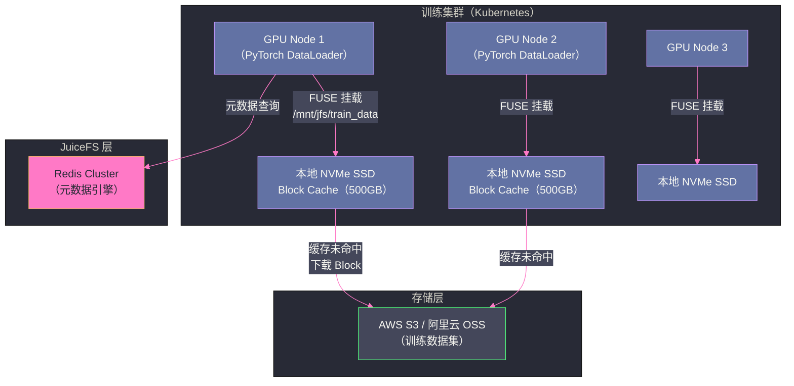

# 04 JuiceFS 在大数据场景的应用

## 摘要

JuiceFS 在大数据和 AI 训练场景的价值，不仅仅在于提供"更便宜的 HDFS"，更在于其独特的架构特性（存算分离、POSIX 兼容、多客户端共享）使得一些传统 HDFS 架构难以实现的场景变得可行。本文从实际工程场景出发，剖析 JuiceFS 在 Spark/Flink 大数据处理、AI 模型训练、以及数据湖构建三个场景中的具体应用模式、配置要点和性能调优策略。

---

## 第 1 章 替代 HDFS 的 Hadoop 生态集成

### 1.1 JuiceFS Hadoop SDK 的原理

JuiceFS 提供了 **Hadoop-Compatible File System**（HCFS）接口的实现（`JuiceFileSystem`，继承自 Hadoop 的 `FileSystem` 抽象类）。Spark、Flink、Hive、MapReduce 等框架通过 Hadoop FileSystem API 与存储交互，只需将 JuiceFS Hadoop SDK 加入类路径，即可将 `jfs://my-volume/` 路径作为存储目标，无需修改任何业务代码。

```xml
<!-- Hadoop core-site.xml 配置 -->
<configuration>
    <!-- 注册 JuiceFS 文件系统 -->
    <property>
        <name>fs.jfs.impl</name>
        <value>io.juicefs.JuiceFileSystem</value>
    </property>

    <!-- 元数据引擎地址（Redis 示例） -->
    <property>
        <name>juicefs.meta</name>
        <value>redis://redis-host:6379/1</value>
    </property>

    <!-- 本地 Block Cache 路径和大小 -->
    <property>
        <name>juicefs.cache-dir</name>
        <value>/data/jfs-cache</value>
    </property>
    <property>
        <name>juicefs.cache-size</name>
        <value>51200</value>  <!-- 50GB Block Cache -->
    </property>
</configuration>
```

配置完成后，Spark SQL 直接操作 JuiceFS 路径：

```python
# Spark 读取 JuiceFS 上的 Parquet 文件
df = spark.read.parquet("jfs://my-volume/dw/orders/dt=2024-01-01/")
df.filter(df.amount > 1000).write.parquet("jfs://my-volume/dw/orders_filtered/")
```

### 1.2 相比 HDFS 的架构优势

**弹性计算节点**：HDFS 依赖数据本地性，计算节点尽量在存储数据的 DataNode 上运行任务。在 Kubernetes/YARN 弹性调度环境中，任务调度位置难以与 DataNode 完全对齐，数据本地性无从保证，HDFS 的设计优势消失。JuiceFS 的 Block Cache 提供了另一种本地性机制——**缓存本地性**：任务节点缓存过的数据块下次访问无需走网络，效果接近数据本地性，且与调度位置无关。

**按需扩缩容**：HDFS 集群的存储节点扩缩容需要谨慎（DataNode 下线需要等待副本迁移完成）。JuiceFS 的数据存储在对象存储，计算节点（运行 Spark/Flink 的节点）可以任意扩缩容，不影响数据可靠性；Block Cache 随节点生命周期存在，节点下线时缓存自然清空，不需要专门的迁移操作。

**多集群共享存储**：HDFS 是单集群访问（不同 HDFS 集群之间需要 DistCp 拷贝数据）。JuiceFS 挂载同一个 Volume 的多个客户端（不同集群的 Spark、Flink、AI 训练集群）可以**并发读写同一份数据**，无需数据复制，实现数据的统一管理和零拷贝跨框架共享。

### 1.3 Spark 性能优化配置

针对 Spark 场景的 JuiceFS 优化参数：

```xml
<!-- 提升并发读取线程数（对应 Spark 读取 Task 的并行度） -->
<property>
    <name>juicefs.max-downloads</name>
    <value>20</value>
</property>

<!-- 预读大小（与 Spark 的 mapreduce.input.fileinputformat.split.maxsize 配合） -->
<property>
    <name>juicefs.prefetch</name>
    <value>5</value>  <!-- 预读 5 个 Block = 20MB -->
</property>

<!-- 上传线程数（写入场景） -->
<property>
    <name>juicefs.max-uploads</name>
    <value>20</value>
</property>

<!-- Buffer 大小（影响写入吞吐） -->
<property>
    <name>juicefs.buffer-size</name>
    <value>600</value>  <!-- 600MB -->
</property>
```

> [!warning] 生产避坑：Spark 小文件问题
> Spark 写入 JuiceFS 时，每个 Task 写一个文件（典型输出是大量小 Parquet 文件，每个 100-500MB）。大量小文件会导致 JuiceFS 元数据引擎（尤其是 Redis）的 inode 和 dentry 数量快速增长，同时对象存储的 PUT 请求数增多（费用增加）。
>
> 优化方案：
> 1. Spark 写入前 `repartition()` 减少输出文件数
> 2. 使用 Spark 的 `coalesce()` 合并小分区
> 3. 写入完成后使用 `juicefs compact` 合并小文件（JuiceFS Enterprise 版功能）

---

## 第 2 章 AI 训练数据存储

### 2.1 AI 训练的 IO 特征分析

AI 模型训练（尤其是深度学习训练）的数据访问特征与传统大数据计算有本质差异：

**访问模式**：训练时每个 Epoch 按随机顺序访问训练集中的每个样本（Shuffle），这意味着对大量小文件（图片 100KB-1MB，文本样本 1-10KB）的随机读取，而不是顺序扫描大文件。

**多轮访问**：标准训练通常 10-100 个 Epoch，同一份数据集被反复访问。第一个 Epoch 是冷读（对象存储），后续 Epoch 应命中缓存。

**多机并发**：分布式训练（Data Parallel）时，多个 GPU 节点并发读取同一份数据集，对存储的并发 IO 能力要求高。

### 2.2 JuiceFS 在 AI 训练中的架构



### 2.3 训练场景的 JuiceFS 配置

```bash
# 在 GPU 训练节点上挂载 JuiceFS（针对 AI 训练优化）
juicefs mount redis://redis-cluster:6379/1 /mnt/jfs/train_data \
    --cache-dir /nvme/jfs-cache \   # 本地 NVMe SSD 作为 Block Cache
    --cache-size 512000 \           # 500GB Block Cache
    --prefetch 10 \                 # 预读 10 个 Block（40MB，提升顺序读）
    --max-downloads 30 \            # 最多 30 个并发下载线程
    --attr-cache 5 \                # 文件属性缓存 5 秒（减少元数据查询）
    --entry-cache 5 \               # 目录项缓存 5 秒
    --dir-entry-cache 5             # 目录缓存 5 秒
```

**缓存 TTL 参数的作用**：`--attr-cache`、`--entry-cache`、`--dir-entry-cache` 允许客户端将文件属性和目录信息缓存在本地内存中，在 TTL 内不向元数据引擎（Redis）发起查询。对于训练场景（数据集不会在训练中修改），设置 5-30 秒的缓存 TTL 可以大幅减少 Redis 的 IOPS，降低 Redis 负载。

**代价**：如果数据集在 TTL 内被外部修改，训练节点可能看不到最新文件（一致性与性能的权衡）。对于只读的训练数据集，这个代价是可以接受的。

### 2.4 第一轮 Epoch 的预热策略

为避免第一轮训练因冷 Block Cache 而 IO 瓶颈，在正式训练前预热缓存：

```bash
# 多线程预热（--threads 根据网络带宽和对象存储并发限制调整）
juicefs warmup --threads 50 /mnt/jfs/train_data/

# 对于超大数据集（几十 TB），分批预热（先预热最热的部分）
juicefs warmup --threads 50 /mnt/jfs/train_data/imagenet/train/

# 监控预热进度
watch -n5 "df -h /nvme/jfs-cache && ls /nvme/jfs-cache | wc -l"
```

---

## 第 3 章 数据湖构建——JuiceFS + Iceberg/Hudi

### 3.1 数据湖存储层的诉求

现代数据湖（Data Lakehouse）要求存储层同时满足：
- **ACID 事务**：数据更新/删除需要原子性（由 Iceberg/Delta Lake/Hudi 的表格式层提供）
- **高吞吐写入**：Flink 实时流写入或 Spark 批量写入
- **低成本存储**：冷数据的 GB/月存储成本尽量低
- **POSIX 兼容**：传统工具（Python、R）能直接访问数据文件

JuiceFS 作为对象存储的 POSIX 适配层，能够让 Iceberg/Delta Lake/Hudi 等表格式直接以文件路径方式操作数据（`jfs://bucket/iceberg-warehouse/`），无需特殊的 Connector。

### 3.2 JuiceFS + Apache Iceberg 的组合

```python
# Spark 使用 JuiceFS 路径创建 Iceberg 表
spark.sql("""
    CREATE TABLE iceberg_catalog.my_db.orders (
        order_id BIGINT,
        date DATE,
        amount DECIMAL(10,2)
    ) USING iceberg
    LOCATION 'jfs://my-volume/warehouse/orders'
    TBLPROPERTIES (
        'write.format.default' = 'parquet',
        'write.parquet.compression-codec' = 'zstd'
    )
""")

# 流式写入（Flink）
# Flink 通过 Iceberg Flink Connector 写入，底层文件写到 JuiceFS
# 事务原子性由 Iceberg 保证，文件存储由 JuiceFS 管理
```

**JuiceFS 在此架构中的价值**：
- 提供 POSIX `rename` 语义（Iceberg 的提交操作依赖原子 rename 实现原子提交）
- 对象存储原生不支持原子 rename（S3 的 rename 是 copy + delete，非原子），JuiceFS 的元数据引擎在 Redis/TiKV 中原子更新 dentry，实现真正的原子 rename
- Block Cache 加速后续的 OLAP 查询

---

## 第 4 章 小结

JuiceFS 在大数据和 AI 场景的核心价值是：

1. **Hadoop 生态无缝替换 HDFS**：通过 HCFS SDK，Spark/Flink/Hive 零代码迁移到 JuiceFS，存算解耦获得弹性扩容能力
2. **AI 训练的高效数据加载**：Block Cache 将热数据缓存在本地 NVMe，多轮训练后接近本地 IO 速度；预热 + 预读共同消除冷启动延迟
3. **数据湖的原子 rename 语义**：为 Iceberg/Delta Lake/Hudi 提供对象存储无法原生支持的原子重命名，确保表格式事务语义的正确性

选择 JuiceFS 的本质是选择**用元数据引擎（Redis/TiKV）的一点运维成本，换取对象存储的无限扩展性、低成本和云原生弹性**。

---

**延伸阅读**：
- [[03 JuiceFS 数据存储——分块、压缩与缓存]]
- [[05 JuiceFS 运维与调优——性能基准、监控与故障排查]]

---

> [!note] 思考题
> 1. JuiceFS 的客户端缓存包括内存缓存（Buffer，用于预读）和磁盘缓存（Cache，缓存频繁访问的 Block）。磁盘缓存使用本地 SSD，默认最大 100GB。在 ML 训练场景中，如果训练数据集 500GB 但缓存只有 100GB，缓存的命中率取决于数据的访问模式——随机 shuffle 的数据集缓存命中率会很低。你如何根据工作负载调整缓存大小？
> 2. JuiceFS 的分布式缓存允许多个客户端节点共享缓存——节点 A 缓存的数据可以被节点 B 通过 P2P 方式读取，避免重复从对象存储拉取。在一个 10 节点的 GPU 集群中，分布式缓存如何减少对象存储的请求量和带宽消耗？
> 3. 缓存预热（`juicefs warmup`）可以在训练开始前将数据预先加载到本地缓存。在 Kubernetes 中，如何在 Pod 启动前完成缓存预热？Init Container 是否适合执行预热？预热大量数据（TB 级）的耗时如何控制？
