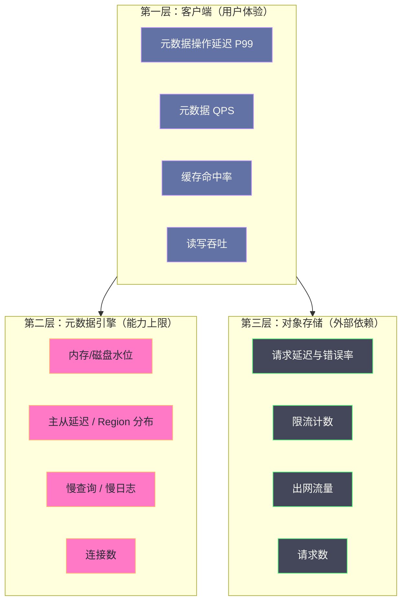
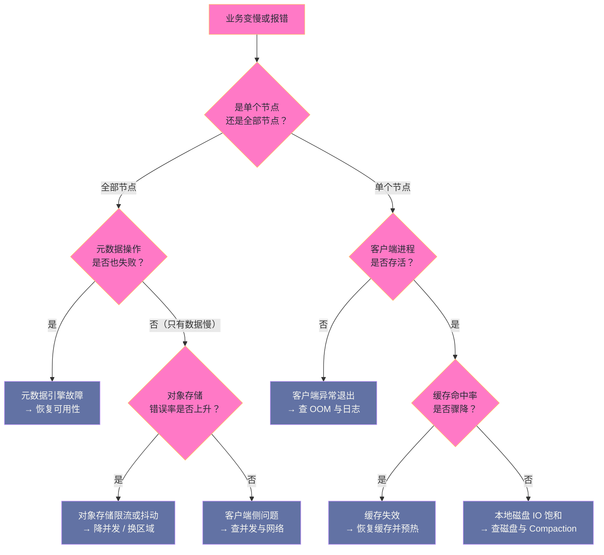

# 05 JuiceFS 运维与调优——性能基准、监控与故障排查

**摘要：**

JuiceFS 的运维与传统分布式存储有一个根本差异：**它不是一套需要运维的集群，而是三份需要同时照看的依赖**——元数据引擎、对象存储、以及运行在每台计算节点上的客户端。本文按"先建立基线、再持续监控、最后按 SOP 处置"的顺序组织。第一部分讲性能基线为什么必须"先测后调"，以及文件系统基准与对象存储基准分别能回答什么问题；第二部分给出三层监控指标体系（客户端、元数据引擎、对象存储）与关键指标的计算口径，并说明哪些指标才是"用户能感知到的"；第三部分给出六类高频故障的排查 SOP 与一张决策树，覆盖元数据引擎不可用、缓存失效、对象存储限流、客户端异常、元数据与数据不一致等场景；最后是日常运维清单、容量与成本治理，以及这套运维体系的能力边界。全文回答两个问题：JuiceFS 的运维对象到底是什么，以及故障时应该按什么顺序定位。

---

## 第 1 章 运维对象的重新定义

### 1.1 三份依赖，三类故障

接手 JuiceFS 的运维，第一件要纠正的认知是"它是一套集群"。它不是。它更像一条**由三个独立组件串起来的链路**，而这三个组件由不同的团队、不同的知识体系、不同的故障模式构成。

| 组件 | 谁负责 | 典型故障 | 影响面 |
|---|---|---|---|
| 元数据引擎 | DBA 或平台团队 | 内存耗尽、主从切换、PD 不可用、锁等待 | 整个文件系统不可用 |
| 对象存储 | 云厂商或存储团队 | 限流、区域抖动、请求失败率上升 | 部分读写变慢或失败 |
| 客户端 | 使用方自己 | 缓存目录异常、进程被杀、参数配置错误 | 单节点或单业务受影响 |

三类故障的影响面差别很大，这直接决定了运维的优先级与告警分级。**元数据引擎的故障必须按最高级别处理，对象存储的故障次之，客户端的故障可以按业务粒度处理。**

### 1.2 运维优先级：元数据高于数据

这个优先级不是主观判断，而是由架构的不对称性决定的。

对象存储侧的数据有多副本或纠删码保护，且即使暂时不可访问，元数据里的映射关系仍然完整，故障恢复后一切照旧。元数据引擎侧则没有这层缓冲：**它一旦丢失，对象存储里的数据就永久失去索引**——这不是"数据不可用"，而是"数据实质损毁"。

由此推出的三条运维纪律是：

**纪律一：元数据的备份等级高于数据。** 定期导出元数据快照并异地保存，且快照的保存位置必须独立于元数据引擎本身（不能把快照存在同一台 Redis 所在的机器上）。

**纪律二：元数据引擎的持久化配置必须显式检查。** 不能假设"默认配置是安全的"——很多默认配置面向缓存场景，对元数据场景是危险的。

**纪律三：灾备演练必须覆盖元数据。** 演练内容不是"对象存储能不能读"，而是"能不能用备份把整个目录树恢复出来"。

### 1.3 为什么不能只靠"厂商默认"

JuiceFS 的默认参数面向"通用场景"，而生产环境的需求往往是特定场景的极端值。三个最常见的默认值陷阱如下。

**陷阱一：缓存容量默认偏小。** 默认值通常只够"验证功能"，对于需要覆盖工作集的训练场景远远不够。缓存容量不足会直接表现为命中率低、性能不达标。

**陷阱二：并发参数默认保守。** 默认的并发上传下载数面向"兼容性优先"，在高带宽环境里无法用满网络；反之在不稳定环境里又可能过高。

**陷阱三：元数据缓存 TTL 默认偏短。** 短 TTL 保证了可见性，但代价是元数据 QPS 高。在只读数据集场景下，这是纯粹的浪费。

**这三类陷阱的共同特征是"默认值不会报错，只会让性能低于预期"。** 因此调优工作的第一步不是"改参数"，而是"建立基线，用数据判断哪些参数需要改"。

### 1.4 运维能力的三个层次

把 JuiceFS 的运维能力分成三层，有助于判断团队当前处于哪一级、下一步该补什么。

**第一层：能恢复服务。** 知道客户端进程在哪、知道怎么重启、知道元数据引擎的地址与凭据。这一层解决的是"出问题能不能快速恢复"，是运维的底线。

**第二层：能定位根因。** 有分层监控视图、有基线数据、有排查决策树，能在故障发生时判断问题出在哪一层。这一层解决的是"同样的问题会不会反复发生"。

**第三层：能预防故障。** 有容量与成本的趋势预测、有变更的影响评估流程、有定期的灾备演练与故障复盘。这一层解决的是"故障发生前能不能提前干预"。

三层之间的差距不是工具差距，而是**是否把"运维"从被动响应变成了主动经营**。绝大多数团队在接入 JuiceFS 后停在第一层，而 JuiceFS 的性能与可靠性收益恰恰集中在第二三层——因为它的多数问题（缓存失效、元数据水位、对象存储限流）都是"渐进式恶化"而非"突发崩溃"，只有主动经营才能提前发现。

---

## 第 2 章 性能基线：先测后调

### 2.1 为什么必须先建基线

没有基线的调优是盲目的。原因有三层。

**第一层：无法判断"慢"是相对什么而言。** 如果不测出"这套部署在当前网络与硬件条件下的理论上限"，就无法判断"当前性能差多少"，也就无法判断优化空间还有多大。

**第二层：无法区分瓶颈在哪一段。** 一次读取的耗时由"元数据查询 + 缓存查找 + 对象存储获取"三段构成。不分别测量，就不知道哪一段是主导。

**第三层：无法验证优化是否有效。** 改了参数之后，性能提升了 10% 还是 50%，需要基线作为参照。没有基线，就只能凭感觉判断"好像是快了"。

因此基线的建立应当**在业务接入之前**完成，并在每次重大变更（升级、扩容、换对象存储、换元数据引擎）之后重新测量。

### 2.2 文件系统基准：测端到端的真实表现

JuiceFS 提供了内置的基准工具，它会在挂载点上执行一组标准操作，分别报告大块读写、小块读写与各类元数据操作的性能。

```bash
# 完整基准测试（读写吞吐 + 元数据操作）
juicefs bench /mnt/jfs --block-size 1 --threads 4

# 典型输出形态（数值仅为示例，实际值取决于环境）
# Write large blocks:  <大块写吞吐>
# Read large blocks:   <大块读吞吐>
# Write small blocks:  <小块写吞吐>
# Read small blocks:   <小块读吞吐>
# Stat file:           <每秒 stat 次数>
# Create file:         <每秒创建文件数>
# Rename file:         <每秒重命名次数>
# Delete file:         <每秒删除次数>
```

这份输出对应四个能力维度，需要分开看：

| 维度 | 对应指标 | 主要瓶颈 |
|---|---|---|
| 大块吞吐 | 大块读写 | 对象存储带宽、并发数、客户端 CPU |
| 小块吞吐 | 小块读写 | 对象存储 TTFB、缓存命中率 |
| 元数据吞吐 | 每秒 stat/create/rename/delete | 元数据引擎性能、客户端到引擎的网络延迟 |
| 缓存效果 | 第二次运行的数值是否显著优于第一次 | 缓存容量与介质 |

有一处关键细节：**基准测试必须跑两遍。** 第一遍是冷态（缓存为空），第二遍是热态（缓存已填充）。两遍的差值直接反映了缓存机制的效果——如果两遍差异很小，说明缓存配置有问题，或者负载本身没有局部性。

### 2.3 对象存储基准：排除上层干扰

当文件系统基准的吞吐低于预期时，下一步是把 JuiceFS 这一层摘掉，单独测对象存储的原始能力。

```bash
# 直接测试对象存储的 PUT/GET 能力
juicefs objbench \
    --storage s3 \
    --bucket https://my-bucket.s3.amazonaws.com \
    --block-size 4 \
    --threads 20
```

这个测试回答三个问题：**对象存储的原始吞吐上限是多少**（决定 JuiceFS 吞吐的上限）、**单次请求的延迟是多少**（决定小块读写的下限）、**并发提高到什么程度会触发限流**（决定并发参数的合理区间）。

把两组基准数据放在一起对比，就能定位瓶颈：如果对象存储基准本身就低，那么 JuiceFS 侧的任何调优都是徒劳，问题在存储侧或网络侧；如果对象存储基准很高而 JuiceFS 侧低，那么瓶颈在 JuiceFS 客户端或元数据侧。

### 2.4 元数据引擎的基线

元数据引擎的性能需要单独测量，因为它与数据路径的瓶颈来源完全不同。

测量方法有两类。**其一是通过 JuiceFS 侧观察**：基准测试中的 `stat`/`create`/`rename` 次数就是端到端的元数据吞吐。**其二是通过元数据引擎自身的工具观察**：Redis 有延迟监控与慢日志，TiKV 有各类延迟指标，SQL 有慢查询日志。

两类方法要结合使用：前者告诉你"用户感知到多少"，后者告诉你"引擎内部发生了什么"。**当两者出现明显差距时，问题通常在客户端与引擎之间的网络链路上，而不在引擎本身。**

### 2.5 压测方法论：让基准数据有意义

内置基准工具给出的是"能力上限"，但要判断"这套部署能否支撑某个业务"，还需要按业务的真实形态做一次压测。压测设计有三条原则。

**原则一：按真实 IO 尺寸与并发度施压。** 用 4 KiB 随机读去压一个顺序读大文件的业务，结论毫无意义。压测的请求尺寸分布、读写比例、并发度都应当来自业务的实际画像——这些数据可以从业务的日志或客户端的指标里提取。

**原则二：区分冷态与稳态。** 压测必须覆盖"缓存为空"与"缓存已填充"两种状态，因为二者的性能差可能达到一个数量级。只测其中一种，得到的结论都是片面的。业务的真实体验通常是"启动时冷、运行后热"，因此压测报告应当同时给出两个数值。

**原则三：压到出现瓶颈为止，并记录瓶颈是什么。** 压测的目的不是得到一个好看的吞吐数字，而是**找到第一个倒下的环节**。可能是客户端 CPU、可能是网络带宽、可能是对象存储限流、也可能是元数据引擎的 QPS 上限。知道"哪个环节先倒"，才能在业务增长时提前扩容。

还有一处细节容易被忽略：**压测数据本身要清理。** 压测会产生大量临时文件与元数据，如果不清理，会在后续的容量规划中造成干扰（尤其是文件数），并可能触发不必要的 GC。

### 2.6 基线的维护：让参照物保持有效

基线不是一次性产物，它需要随环境变化而更新，否则会从"参照物"退化为"误导源"。

需要重新测基线的四类变化：**网络链路变化**（跨区域改为同区域，延迟会显著变化）；**对象存储变化**（换供应商、换存储类别）；**硬件变化**（缓存目录从 SATA SSD 换到 NVMe）；**客户端大版本升级**（内部实现可能变化）。

反之，**不应当频繁重测的场景**是"业务量变化"——业务量变化改变的是负载，不是能力上限。把"能力基线"与"负载基线"分开维护，是让基线体系保持清晰的关键：前者由环境决定，后者由业务决定，两者的对比才产生"是否还有余量"的判断。

一条实用的做法是把基线写成一份可版本管理的配置文件，与部署配置放在一起。这样每次变更都能对照基线评估影响，也便于在故障复盘时追溯"环境何时发生了变化"。

---

## 第 3 章 监控体系

### 3.1 三层指标

JuiceFS 的监控需要覆盖三个层次，缺一层就会出现盲区。



三层的关系是**因果关系**：第二层与第三层的变化会传导到第一层。因此排查时的顺序是"从第一层发现异常，到第二三层定位根因"，而告警的设计则相反——第二三层的异常应当更早触发告警，因为它们出现问题时第一层还没恶化，正是干预的窗口期。

### 3.2 关键指标与计算口径

客户端侧暴露 Prometheus 格式的指标，几个关键指标的表达式大致如下（具体指标名以实际版本为准）。

```promql
# 元数据操作 P99 延迟（用户最能感知的元数据质量指标）
histogram_quantile(0.99,
  rate(juicefs_meta_ops_durations_histogram_seconds_bucket[5m]))

# 数据缓存命中率
rate(juicefs_blockcache_hits[5m])
/ (rate(juicefs_blockcache_hits[5m]) + rate(juicefs_blockcache_miss[5m]))

# 对象存储请求错误率（按方法区分 GET/PUT）
rate(juicefs_object_request_errors_total[5m])
/ rate(juicefs_object_requests_total[5m])

# 读吞吐与写吞吐
rate(juicefs_client_io_bytes{op="read"}[1m])
rate(juicefs_client_io_bytes{op="write"}[1m])
```

四个指标的口径需要特别注意。

**元数据 P99 是"用户能感知到的元数据质量"的直接投影。** 元数据引擎的 `used_memory`、Region 数只是间接指标，它们升高不一定意味着业务变慢；而 P99 一旦升高，业务侧几乎必然已经受影响。因此**告警应当优先挂在 P99 上**，而不是只挂在引擎的资源水位上。

**缓存命中率必须结合"是否处于稳态"看。** 冷启动窗口内的低命中率是正常的，只有稳态下的低命中率才说明配置问题。

**错误率要区分错误类型。** 限流错误（可重试）与数据错误（不可重试）的含义完全不同：前者是容量或并发问题，后者是数据一致性问题。

**吞吐要区分"客户端侧"与"对象存储侧"。** 两者差值大，说明缓存起了作用；差值小，说明大部分 IO 都落到了对象存储。

### 3.3 告警规则设计

告警的设计原则是"**在用户受影响之前发出**"。据此把规则分成三级。

| 级别 | 触发条件 | 处置动作 |
|---|---|---|
| 提示 | 缓存命中率低于基线、元数据 QPS 高于基线 | 记录并观察趋势，不打断值班 |
| 警告 | 元数据 P99 超过基线若干倍、缓存命中率低于阈值 | 值班介入排查，准备扩容 |
| 严重 | 元数据引擎不可达、对象存储错误率显著上升、元数据 P99 超阈值持续 | 立即介入，必要时降级或限流 |

一个常见的设计错误是**把所有指标都设为"严重"**，结果告警疲劳让值班人员对真正的严重告警也麻木。正确做法是把"资源水位类"指标设为提示或警告（它们是趋势指标），把"用户可感知类"指标（P99、错误率）设为严重。

### 3.4 仪表盘与 SLO

仪表盘的设计应当服务于"快速定位"而不是"信息齐全"。建议按三个视图组织。

**视图一：用户体验视图。** 只放四个指标——元数据 P99、缓存命中率、读吞吐、写吞吐。这个视图回答"现在业务是否正常"。

**视图二：分层定位视图。** 把客户端、元数据引擎、对象存储三层的核心指标并列展示。这个视图回答"如果不正常，问题在哪一层"。

**视图三：容量与成本视图。** 元数据引擎的内存/磁盘水位、对象存储的容量与请求量、缓存目录的使用量。这个视图回答"还能撑多久、花多少钱"。

SLO 的设定要区分两类场景：**元数据操作的 SLO 通常比数据读取更严格**，因为元数据延迟直接决定了每个文件操作的等待时间，而数据读取可以通过缓存摊薄。一个常见的设定是"元数据 P99 在稳态下不超过某个阈值"，把这条作为 SLO 的核心项。

### 3.5 指标之外：日志与追踪

指标能告诉你"发生了什么"，但往往不能告诉你"为什么"。定位到某一层之后，需要借助日志与追踪往下挖。

**客户端日志**记录挂载、上传下载、重试、错误等信息。它的价值在于"保留了个体事件的细节"——指标是聚合的，日志是具体的。当指标显示"错误率上升 1%"时，日志能告诉你这 1% 的错误码分别是什么，而这决定了处置方向（限流要降并发，权限问题要改凭据，网络问题要查链路）。

**元数据引擎的日志**（Redis 慢日志、TiKV 的慢查询、SQL 的慢查询日志）是定位"元数据为什么变慢"的第一手材料。**如果元数据 P99 升高而引擎侧没有慢日志，那么慢的原因大概率在客户端到引擎的网络链路上**，而不是引擎内部的执行时间。

**内核日志**是排查 FUSE 与 OOM 问题的必读项。客户端被 OOM Killer 杀掉、FUSE 连接异常中断，这些事件只在系统日志里有痕迹。

三者配合的方式是：**指标定位层次，日志定位原因，追踪定位链路。** 如果部署了链路追踪，可以把一次文件操作与它触发的元数据查询、对象存储请求串起来，得到完整的时间分解——这是排查"偶发慢"最有效的手段，因为偶发问题在聚合指标上只表现为尾延迟升高，看不出具体环节。

### 3.6 多挂载点的指标聚合

当集群里有成百上千个挂载点时，指标的聚合方式会直接影响可读性。

**按节点聚合会掩盖问题。** 把一千个节点的元数据 P99 取平均，会把"一个节点极慢"这个现象摊平成"整体正常"。因此聚合时必须关注**分位数与最大值**：P99 与 max 的组合能同时反映"整体水平"与"最差节点"。

**按业务聚合便于归因。** 如果不同业务使用不同的挂载点或不同的 Volume，应当按业务维度聚合指标，这样"哪个业务在拖慢元数据引擎"一目了然。

**区分"节点数"与"请求量"的权重。** 简单地按节点平均，会让"大量低负载节点"稀释"少数高负载节点"的影响。更合理的做法是按请求量加权，或者干脆分开看"高负载节点"与"低负载节点"两组指标。

**关注离群节点。** 生产环境中最常见的性能问题是"少数节点异常"，表现为它们的缓存命中率显著低于其他节点、或元数据延迟显著高于其他节点。这类离群往往指向具体原因：该节点磁盘类型不同、缓存目录配置遗漏、或该节点上跑着额外的高 IO 业务。因此**离群检测应当成为监控的常规能力**，而不只是"出问题时才去比对"。

### 3.7 监控的两个常见误区

**误区一：只监控组件，不监控业务感知。** 组件指标（CPU、内存、连接数）反映的是"资源是否紧张"，业务感知指标（元数据 P99、缓存命中率、读写吞吐）反映的是"用户是否受影响"。两者不可互相替代：资源紧张但延迟正常是常态（说明余量充足），资源宽松但延迟升高同样会发生（说明瓶颈在链路而非组件）。

**误区二：告警阈值从经验值照搬。** 不同环境的合理阈值差异极大（跨区域与同区域的延迟差一个数量级、NVMe 与 SATA 的缓存命中延迟差数倍）。阈值应当从本环境的基线推导，而不是照搬文档或其他集群的数值。**用别人的阈值告警自己的系统，结果通常是"该响的不响、不该响的天天响"。**

---

## 第 4 章 故障排查 SOP

### 4.1 故障一：元数据引擎不可用

**症状**：所有挂载点的操作卡住或报错，`ls` 超时，应用日志出现连接被拒绝或超时。

**排查顺序**：先确认引擎是否可达（连通性与认证），再确认引擎自身是否健康（内存是否耗尽、主从是否在切换、是否只读），最后确认客户端配置（连接地址、超时参数、认证凭据）。

**处置要点**：这类故障的影响面是"全部客户端"，因此处置动作必须谨慎——**不要在有业务运行时对元数据引擎做破坏性操作**（如清空数据、重建实例），因为元数据是唯一权威，任何数据层面的动作都可能造成不可逆损失。正确的动作是"先恢复可用性"（主从切换、扩容、重启），而不是"先清理数据"。

**预防措施**：为元数据操作设置合理的超时，让应用能快速感知故障而不是无限等待；建立引擎的高可用；把引擎的资源水位告警设为警告级，提前扩容。

### 4.2 故障二：缓存失效导致性能骤降

**症状**：业务突然变慢，监控显示对象存储的读取量与出网流量急剧上升，缓存命中率接近零。

**常见原因**：节点被重建导致缓存清空；缓存目录所在磁盘写满触发驱逐；缓存目录被其他进程清理；缓存目录配置被改动（指向了新的空目录）。

**排查顺序**：先看缓存目录的实际使用量（是否为空、是否满），再看缓存目录的挂载点（是否还是本地持久盘），最后看节点是否发生过重启或重建。

**处置要点**：这类故障的处置是"恢复缓存"，而不是"调参数"。恢复手段是重新预热，并检查为什么缓存会失效。**特别注意"缓存目录磁盘写满"这一类——它往往不是缓存本身的问题，而是同一块盘上其他数据增长导致的**，需要同时处理磁盘占用。

### 4.3 故障三：对象存储限流

**症状**：读写速度突然下降，客户端日志出现限流相关的错误码，重试次数上升。

**根因**：并发参数超过了对象存储对单个前缀的请求速率上限；或对象存储侧整体负载高。

**排查顺序**：先看错误码类型（是限流还是其他错误），再看客户端的并发参数与请求速率，最后看对象存储侧的服务状态。

**处置要点**：**降低并发参数**是直接的缓解手段（牺牲吞吐换稳定性）；长期方案是把对象键分散到多个前缀，把请求摊到不同的限流桶上。这里有一个反直觉的要点：**限流时的直觉反应是"加大并发把丢失的吞吐补回来"，而这恰恰会让情况更糟**——重试退避会让有效吞吐进一步下降。

### 4.4 故障四：客户端进程异常

**症状**：单个节点上的所有挂载点失效，其他节点正常。

**常见原因**：客户端被 OOM Killer 杀掉（写缓冲或缓存元信息占用过多内存）；FUSE 崩溃；客户端版本存在缺陷。

**排查顺序**：先看系统日志确认是否被 OOM 杀掉，再看客户端的资源占用曲线，最后确认客户端版本与已知问题。

**处置要点**：如果是 OOM，需要下调写缓冲上限或缓存容量，而不是简单重启；如果是 FUSE 崩溃，需要收集内核日志与客户端日志用于定位。**重启客户端只能恢复服务，不能解决问题**，因此必须同时找到根因。

### 4.5 故障五：元数据与数据不一致

**症状**：读取某个文件时报错，或者文件大小与预期不符。

**常见原因**：对象存储侧发生了数据丢失（极少见但可能）；`gc` 误删了仍被引用的对象；元数据引擎的计数出现漂移。

**排查顺序**：用一致性校验工具扫描，定位到受影响的文件；确认受影响范围；判断是数据侧丢失还是元数据侧错误。

**处置要点**：这类故障的处置必须**先冻结写入**（避免不一致范围扩大），再评估影响面，最后从备份或上游数据源恢复。`gc` 相关的误删尤其需要警惕——它意味着元数据与数据的对应关系被破坏，恢复难度远高于普通故障。

### 4.6 排查决策树

把上述 SOP 收敛成一张决策树，便于值班时快速定位。



这张树的价值在于**它把"从现象到根因"的路径固定下来**。值班时的最大风险不是不会排查，而是在压力下跳步——比如看到"全部节点变慢"就直接去重启元数据引擎，而实际上只是对象存储限流。按树走可以避免这类误判。

### 4.7 故障复盘：从个案到机制改进

故障处置完成不等于运维工作结束。真正让可靠性提升的是复盘，而复盘要避免沦为"事故经过叙述"。

一份有效的复盘应当回答四个问题。

**问题一：故障为什么能被触发？** 这一问针对触发条件。是配置缺失（没开持久化）、容量不足（内存打满）、还是外部依赖波动（对象存储限流）？答案决定了要补的是配置、容量还是架构。

**问题二：为什么没有被更早发现？** 这一问针对监控。如果故障持续了半小时才被发现，说明监控有盲区；如果监控发现了但没有告警，说明阈值设计有问题。**这一类改进的收益往往高于修故障本身**，因为它能提前暴露下一类故障。

**问题三：为什么影响面这么大？** 这一问针对架构。元数据引擎故障导致全部客户端不可用，是架构决定的；但"没有降级方案"是可以改进的——例如把只读数据集改为本地副本、把非关键业务从共享 Volume 上迁走。

**问题四：处置过程中哪一步最耗时？** 这一问针对 SOP。耗时的步骤通常意味着"缺少工具"或"缺少判断依据"，改进方向就是把该步骤自动化或把判断依据写进手册。

复盘产出的动作项应当分为三类：**立即修复**（配置与容量类问题）、**监控补强**（阈值与视图类问题）、**架构调整**（影响面与降级类问题）。第三类的周期最长，但价值最高。把动作项纳入待办并跟踪闭环，是复盘不流于形式的关键。

### 4.8 降级与限流预案

有些故障无法在短时间内彻底修复（对象存储区域级抖动、元数据引擎需要扩容），此时需要有"在故障期间维持业务底线"的预案。

**预案一：降低并发以保住稳定性。** 当对象存储出现限流时，把客户端的并发上传下载数调低，用吞吐换成功率。这个动作的效果立竿见影，且可以随时回退。它适合作为"第一反应"。

**预案二：暂停非关键写入。** 把批量导入、数据搬迁、GC 等非关键写入任务暂停，把元数据引擎与对象存储的能力留给在线业务。这类任务通常可以延后，因此是性价比很高的"让路"动作。

**预案三：切换只读副本。** 对于只读数据集，如果本地已有缓存或另有一份副本，可以把业务指向副本，避免依赖出问题的共享 Volume。这个预案需要在架构设计阶段就准备好"副本从哪来"，临时准备是来不及的。

**预案四：明确不可降级的业务。** 有些业务对 JuiceFS 是硬依赖（训练作业的数据集、数据湖的存储层），没有副本也没有替代路径。这类业务需要被显式识别出来，并在容量规划与高可用设计上给予最高优先级——**预案的价值不在于"覆盖所有情况"，而在于"清楚哪些情况没有预案"。**

---

## 第 5 章 日常运维清单

### 5.1 备份与恢复

元数据的备份是日常运维里优先级最高的一项，建议纳入定时任务。

```bash
# 导出元数据快照（建议每日执行，保留最近若干份）
juicefs dump redis://redis-host:6379/1 /backup/meta-$(date +%Y%m%d).json.gz

# 恢复演练：导入到一个独立的元数据引擎，验证快照可用
juicefs load redis://test-redis:6379/9 /backup/meta-20260101.json.gz

# 一致性校验（扫描元数据与对象存储的对应关系）
juicefs fsck redis://redis-host:6379/1
```

三条实践要点：**快照必须异地保存**（与元数据引擎不在同一故障域）；**快照必须定期做恢复演练**（没演练过的备份不算备份）；**快照的保留策略要明确**（保留多少份、保留多久），避免备份本身占用过多空间。

### 5.2 垃圾回收

删除文件只更新元数据，对象存储的空间由后台 GC 回收。因此 GC 需要纳入常规任务。

```bash
# 先扫描不删除，确认待回收的数量与容量
juicefs gc redis://redis-host:6379/1

# 确认后执行删除
juicefs gc redis://redis-host:6379/1 --delete
```

GC 的执行频率需要权衡：频率过高会增加对象存储的 DELETE 请求量与扫描开销，频率过低则空间长期不释放、成本虚高。通常按"数据删除的活跃度"来定——删除频繁的环境跑得勤一些，归档型环境跑得稀一些。**GC 执行期间应当监控对象存储的请求错误率，避免 GC 与业务高峰叠加导致限流。**

### 5.3 巡检项

日常巡检建议覆盖以下项目，每项都有明确的"不正常"判定标准。

| 巡检项 | 检查内容 | 不正常的表现 |
|---|---|---|
| 元数据引擎水位 | 内存/磁盘使用率、连接数 | 内存水位持续高于阈值 |
| 元数据延迟 | P99 延迟与基线对比 | 持续高于基线若干倍 |
| 缓存健康度 | 缓存目录使用量、命中率 | 使用量异常低（被清空）或命中率骤降 |
| 对象存储错误率 | 限流与失败计数 | 非零且持续 |
| 客户端进程 | 进程存活、重启次数 | 反复重启 |
| 备份任务 | 快照是否成功生成、是否异地保存 | 任务失败或文件缺失 |
| GC 任务 | 待回收容量是否持续增长 | 持续增长说明 GC 未生效 |
| 孤儿挂载 Pod | 挂载 Pod 与 PV 的对应关系 | 存在无对应业务的挂载 Pod |

### 5.4 变更窗口与影响评估

JuiceFS 的变更有一个特点：**元数据引擎与客户端参数的变更会影响全部挂载点**，因此变更的协调成本高于单集群系统。

变更前需要评估三件事：**影响面**（哪些客户端会受影响）、**可回滚性**（出问题能否快速退回原配置）、**验证方式**（变更后用什么指标确认成功）。对于元数据引擎的变更，还应当额外评估"变更期间是否有作业在跑"——如果有，需要安排在作业间隙或提前通知。

一条经验是：**把"元数据引擎的参数变更"与"客户端的参数变更"分开做**。两者的影响面与回滚方式不同，混在一起做会让故障定位变得困难。

### 5.5 升级与迁移的运维流程

升级客户端、升级元数据引擎、更换对象存储，这三类变更的影响面与风险各不相同，流程也应有所区别。

**客户端升级**的影响面是"逐节点"的。可以按批次滚动升级，每批升级后观察该批节点上的业务是否正常，再推进下一批。风险点是"版本混跑期间的行为差异"，因此升级窗口应当尽量短，避免长期多版本共存。

**元数据引擎升级**的影响面是"全部客户端"。流程应当是：先在非生产环境验证；再在低峰期执行；升级前确认备份快照可用；升级后立即校验元数据可读与延迟指标。**这类变更必须准备回滚方案，且回滚方案必须经过验证**——"理论上能回滚"和"实际能回滚"是两回事。

**更换对象存储**是三类里最复杂的一项，因为它涉及数据搬迁。流程要点是：先做数据同步，再做双读验证（对照新旧存储的读取结果），最后切换写入并保留旧存储一段时间作为回滚路径。这里有一条硬性要求：**元数据引擎与对象存储必须成对切换**，不能出现"元数据指向旧存储、新数据写进新存储"这种混合状态，否则会出现 `gc` 误删仍在使用的对象的风险。

三类变更的共同纪律是：**变更前先确认备份，变更中保持可观测，变更后立即验证。** 这三条听起来平常，但绝大多数生产事故都能在其中找到缺失的一环。

### 5.6 值班手册的最小内容

值班手册的价值在于"让不熟悉这套系统的人也能按步骤处置"。它的最小内容集合包括四部分。

**第一部分：拓扑与依赖清单。** 列出元数据引擎地址、对象存储桶、挂载点分布、以及各组件之间的依赖关系。这部分的作用是"出事时知道去哪里看"。

**第二部分：指标入口与基线值。** 列出监控面板地址、关键指标的基线值、以及"多少算异常"的判定标准。没有基线值的监控面板，对值班人员来说只是一堆数字。

**第三部分：排查决策树与 SOP。** 即前文第 4 章的内容，按"现象 → 分层判断 → 处置动作"组织。这部分是手册的核心。

**第四部分：升级路径与联系人。** 明确哪些问题需要升级（元数据引擎的数据层面问题、跨团队的对象存储问题）、以及升级对象是谁。**这一部分最容易被忽略，却是值班体验的关键**——把"该找谁"写清楚，能避免大量无效的自行处置。

手册的维护同样重要：每次故障复盘都应当产生"手册需要补充的内容"，否则手册会随着系统演进而失效。**一份半年未更新的值班手册，通常已经不能反映当前系统。**

---

## 第 6 章 容量与成本治理

### 6.1 两个独立的容量曲线

JuiceFS 的容量规划需要同时跟踪两条曲线，它们由不同因素驱动。

**数据容量曲线**由数据总量驱动，决定对象存储的容量成本。它的增长通常是可预测的（按业务数据增长率）。

**元数据容量曲线**由文件数量驱动，决定元数据引擎的容量成本。它的增长往往不可预测——一个作业的输出分片数调整，可能让文件数在一周内翻倍。因此元数据容量需要更频繁地审视，并设置更敏感的告警阈值。

### 6.2 成本治理的四个抓手

成本治理的动作按收益排序如下。

**抓手一：减少文件数。** 文件数同时影响元数据成本、对象存储请求成本与最小存储单位浪费，是收益最大的治理方向。手段包括调整作业输出分片数、定期合并小文件、避免过度分区。

**抓手二：提高缓存命中率。** 缓存命中率直接决定对象存储的出网流量与请求数。提高命中率的手段是规划缓存容量与预热策略，而不是调大并发。

**抓手三：合理选择压缩。** 压缩同时降低存储成本与传输成本，但只在数据可压缩时有效。判断方法是实测压缩率。

**抓手四：清理无用数据。** 包括过期的中间结果、不再使用的历史快照、以及 GC 未及时回收的孤儿数据。这一步需要与业务方协作确定"哪些数据可以删"，不能由存储侧单方面决定。

### 6.3 存储分层

对于长期归档的数据，可以考虑把对象存储侧做分层：热数据用标准存储，冷数据下沉到低频或归档存储。这一步在 JuiceFS 侧是透明的——**由于数据块对 JuiceFS 是不透明的字节，对象存储的存储类别变化不影响文件系统的目录树**。这一点是"元数据与数据分离"架构带来的一个实际便利，也是它相对自建存储的一个优势。

需要注意的约束是：归档类存储的取回延迟通常很高（分钟级甚至小时级），因此**下沉到归档层的数据必须有明确的"不常访问"属性**，否则读取时会出现难以解释的长时间等待。

### 6.4 成本归因：知道钱花在哪

成本治理的前提是成本可归因。JuiceFS 的成本由多个维度构成，如果不做归因，很容易"以为在省存储费，实际在为请求费买单"。

归因的最小粒度应当做到"按业务线"或"按 Volume"。可行的做法有两条：**其一，为不同业务使用不同的 Volume（不同元数据引擎与不同对象存储前缀）**，这样账单天然可分；**其二，如果共用一个 Volume，则通过目录配额与用量统计来近似归因**，但需要注意配额计数存在漂移，归因结果只能作为量级参考。

归因之后，判断"成本是否合理"的方法是把成本拆成三块看趋势：**容量成本是否随数据量同步增长**（若是，属于正常增长）；**请求成本是否随文件数增长**（若是，说明文件数在膨胀，治理方向是减少文件数）；**流量成本是否随缓存命中率反向变化**（若是，说明缓存配置在起作用或失效）。

这三条趋势线放在一起看，就能回答"钱花得值不值"：**如果成本在涨而缓存命中率在降，那说明花的是"补救钱"；如果成本在涨而命中率稳定，那说明花的是"业务增长的钱"。** 两者的处置方式完全不同，混在一起就无法决策。

---

## 第 7 章 边界与反例

### 7.1 反例一：用"集群运维"的心智运维 JuiceFS

从 HDFS 或 Ceph 转过来的团队，容易把 JuiceFS 当成"一套需要巡检集群状态的系统"，于是把精力放在"客户端进程是否存活"上，而忽略了"元数据引擎的持久化配置是否正确"这类更关键的问题。**JuiceFS 的运维重心不在"组件存活"，而在"元数据的可靠性与缓存的有效性"。**

### 7.2 反例二：把监控做成"指标齐全但无法定位"

只堆指标不设计排查路径，是监控体系最常见的失败形态。判断标准很简单：**当业务报障时，值班人员能否在五分钟内定位到"哪一层"出了问题。** 如果不能，说明监控缺少分层视图与决策路径。

### 7.3 反例三：把"重启"当作万能处置

重启客户端或元数据引擎能恢复服务，但如果不找到根因，故障会周期性复发。更严重的是，**对元数据引擎的盲目重启可能造成数据层面的风险**（未持久化的写入丢失）。因此"重启"应当被视为最后手段，而不是第一反应。

### 7.4 反例四：忽略"删除不等于释放空间"

删除文件后空间不立即释放，是 JuiceFS 与本地文件系统、与 HDFS 都不同的一个语义。忽略这一点会导致两个问题：**成本虚高**（账单上的容量没有随删除下降）、**容量告警误判**（看到容量没降就以为删除没生效，进而重复删除或误判系统异常）。

### 7.5 反例五：把 GC 当成"随时可跑"的任务

GC 会扫描元数据并对对象存储发起大量删除请求，因此它本身就是一次负载。在不合适的时间跑 GC（业务高峰期、对象存储本身已有限流），会加剧问题。**GC 应当像备份一样被纳入运维日历，而不是临时决定。**

### 7.6 反例六：用单点指标代替分层视图

有些团队只监控"元数据引擎的 CPU 与内存"这一组指标，认为"引擎不忙就说明系统正常"。这忽略了两个事实：**元数据引擎的资源占用与业务体验之间并非线性关系**（引擎很忙但延迟可接受，与引擎不忙但网络抖动导致延迟升高，都会发生）；**数据路径的性能问题根本不会反映在元数据引擎的指标上**（缓存失效、对象存储限流都不改变引擎的负载）。

因此监控必须有分层视图。**单点指标只能回答"这个组件忙不忙"，分层视图才能回答"业务是否正常、问题在哪一层"。**

### 7.7 反例七：把"基线"当成一次性的验收动作

基线如果只在接入时测一次，之后不再维护，就会在环境变化后失去参照价值。更糟的是，**过期的基线会误导判断**：按旧基线判断"延迟正常"，而实际环境已经变化（对象存储换了区域、缓存盘换了型号），真实的能力上限已经不同。

基线的正确用法是把它当作"随环境演进的参照物"，在四类变化后重测（见第 2.6 节），并与负载基线分开维护。**没有基线的运维是盲目的，用过时基线的运维是自欺的。**

---

## 第 8 章 落点

回到第 1 章的判断：JuiceFS 的运维对象不是"一套集群"，而是"三份依赖加上一条链路"。这个认知决定了运维工作的全部重心——**把元数据的可靠性做到最高优先级，把缓存的有效性做成可观测的指标，把对象存储的限流当作常态而非异常。**

从更抽象的层面看，这套运维体系体现的是"存算分离"路线的一条内在要求：**当你把存储拆成多个可独立替换的组件时，你就同时接过了"保证它们协同工作"的责任。** HDFS 时代，元数据、数据、缓存三者的协同由集群内部自动完成；存算分离之后，这份协同必须由运维体系显式维护——备份元数据、经营缓存、监控限流、协调变更，每一项都是这份责任的具象。

这也解释了为什么 JuiceFS 的落地效果在不同团队手里差异很大：**架构决定的只是能力上限，运维决定的才是实际表现。** 五篇专栏讲完，从架构到数据路径、从场景到运维，贯穿始终的一条主线是同一个判断——**它把复杂性从"建造"转移到了"编排与经营"，收益是弹性与成本，代价是这份必须被接住的责任。**

把这五篇的落点串起来，其实是一条完整的因果链：[[01 JuiceFS 全局架构——元数据引擎与对象存储的分离设计|架构层]] 决定了"元数据与数据分离"这个前提；[[02 JuiceFS 元数据引擎——Redis、TiKV 与 SQL 后端的对比|元数据引擎]] 的选型决定了能力上限的三条曲线；[[03 JuiceFS 数据存储——分块、压缩与缓存|数据路径]] 的机制决定了性能能否被兑现；[[04 JuiceFS 在大数据场景的应用|场景落地]] 决定了这些机制是否被正确使用；而本篇的运维体系，决定了这条链路在长期运行中是否稳定。

换句话说，**JuiceFS 的可靠性不是某个组件的属性，而是这五层协同的结果**。任何一层的疏漏都会在最上层以"业务变慢或不可用"的形式暴露出来，而定位它需要自下而上的分层视角——这也正是这套运维体系存在的意义。

---

## 专栏导航

- 上一篇：[[04 JuiceFS 在大数据场景的应用]]。
- 全局架构：[[01 JuiceFS 全局架构——元数据引擎与对象存储的分离设计]]。
- 元数据引擎选型：[[02 JuiceFS 元数据引擎——Redis、TiKV 与 SQL 后端的对比]]。
- 数据路径机制：[[03 JuiceFS 数据存储——分块、压缩与缓存]]。
- 返回专栏首页：[[00 专栏导览]]。

---

## 参考资料

1. Juicedata. JuiceFS 官方文档：运维与监控（metrics、stats、status）. https://juicefs.com/docs/zh/community/monitoring/
2. Juicedata. JuiceFS 官方文档：性能基准与诊断工具（bench、objbench、profile）. https://juicefs.com/docs/zh/community/benchmark/
3. Juicedata. JuiceFS 官方文档：元数据备份与恢复（dump、load、fsck、gc）. https://juicefs.com/docs/zh/community/metadata_dump_load/
4. Prometheus. Histogram 与 quantile 计算说明. https://prometheus.io/docs/practices/histograms/
5. Beyer B, Jones C, Petoff J, Murphy N R. Site Reliability Engineering. O'Reilly, 2016.
6. Amazon Web Services. Amazon S3 请求速率与限流说明. https://docs.aws.amazon.com/AmazonS3/latest/userguide/optimizing-performance.html
7. Redis. 延迟监控与慢日志（LATENCY、SLOWLOG）. https://redis.io/docs/management/optimization/latency/
8. PingCAP. TiKV 监控指标与告警规则. https://docs.pingcap.com/tidb/stable/grafana-tikv-dashboard

---

> [!note] 思考题
> 1. JuiceFS 的运维对象是三份依赖而非一套集群，这个差异如何改变你对"值班手册"的编排方式？
> 2. 元数据 P99 延迟与元数据引擎的资源水位，哪一个更适合作为告警主指标？
> 3. 对象存储限流时加大并发会让情况更糟，为什么？正确的处置动作是什么？
> 4. 删除文件后空间不立即释放，这个语义会怎样影响容量告警的设计？
> 5. 如果要把 JuiceFS 的灾备演练做成常态化流程，最小可行的演练集合应该包含哪几项？
