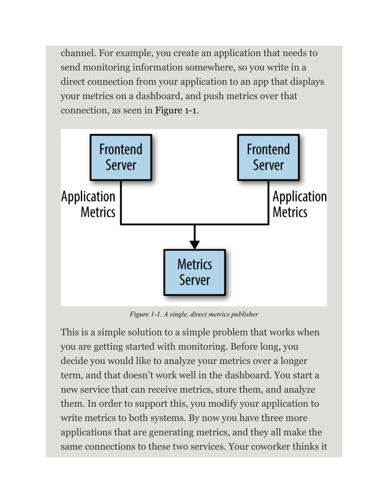
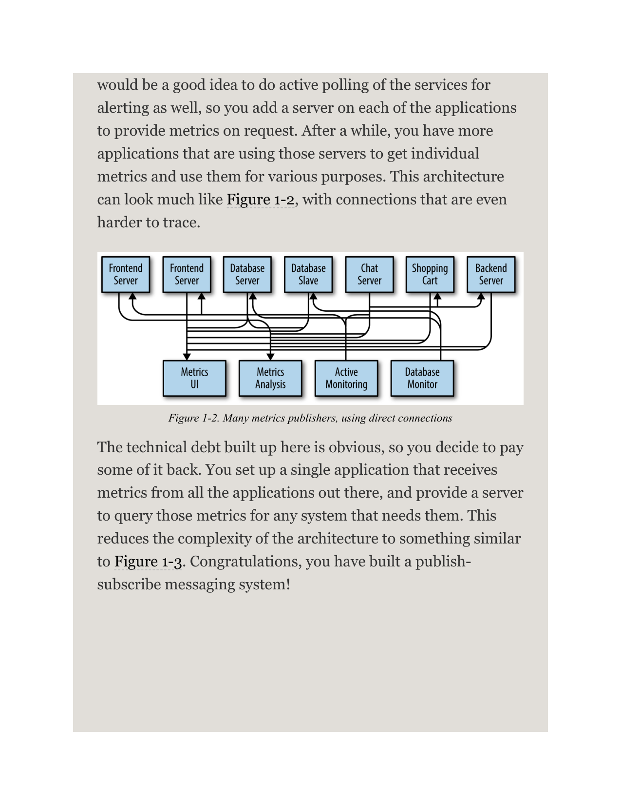
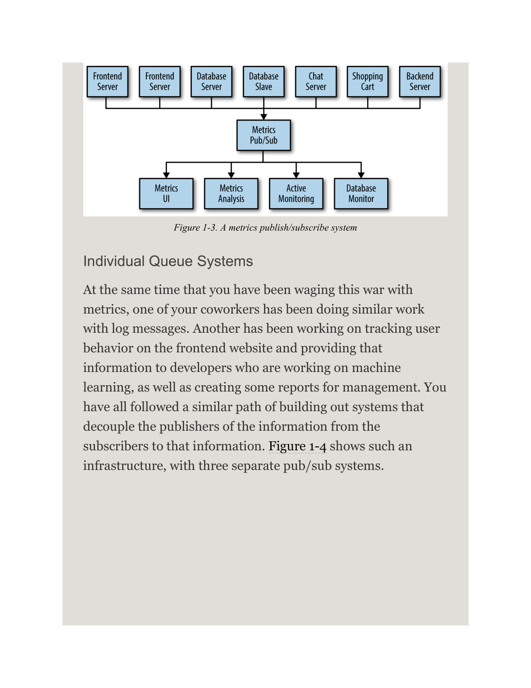
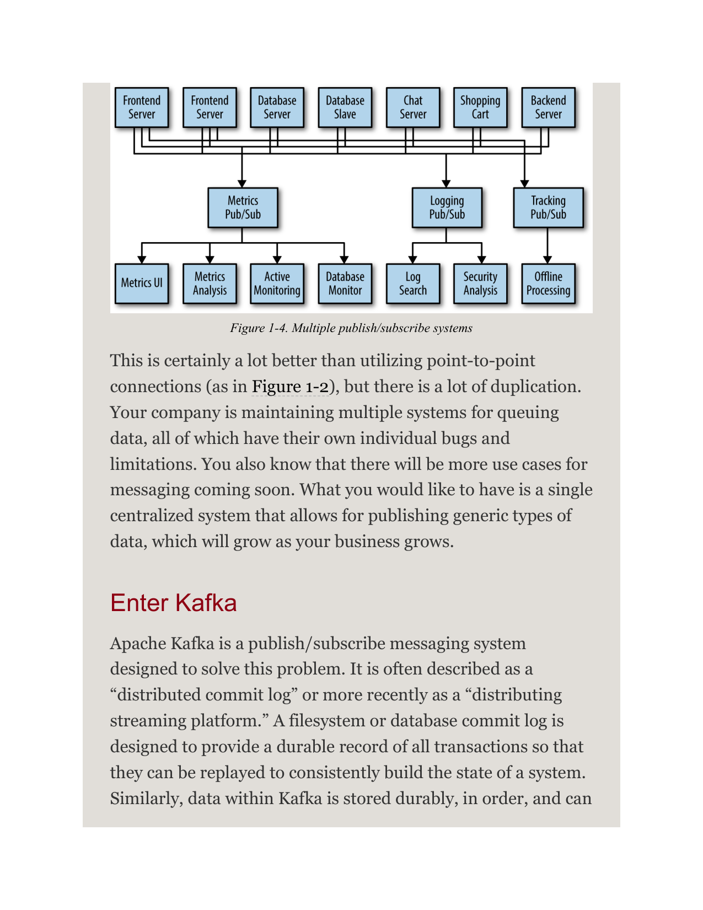
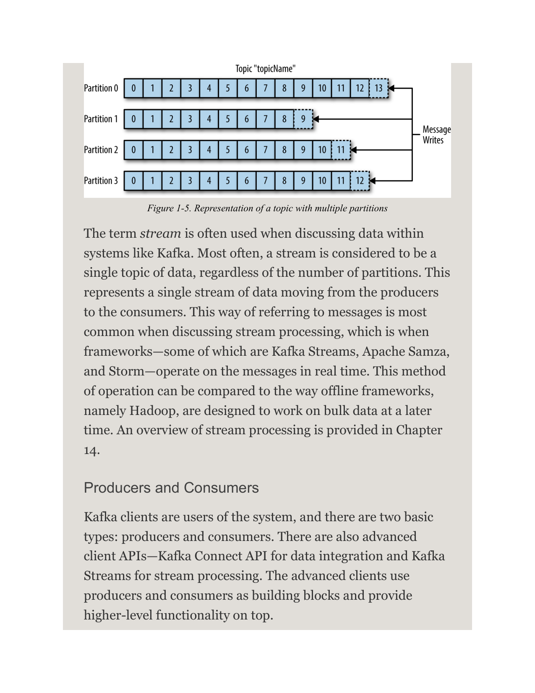
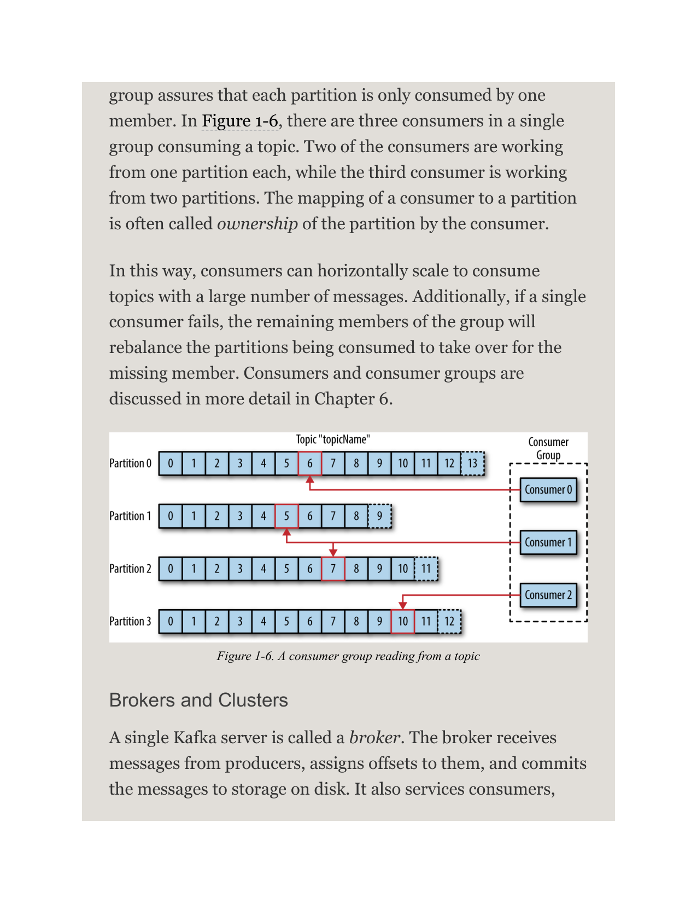
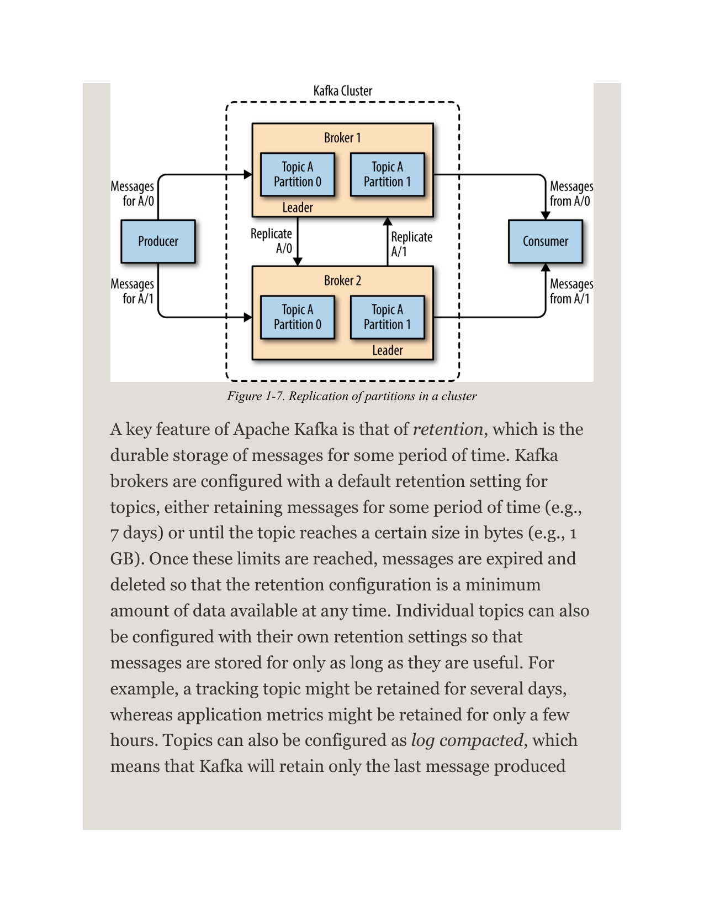
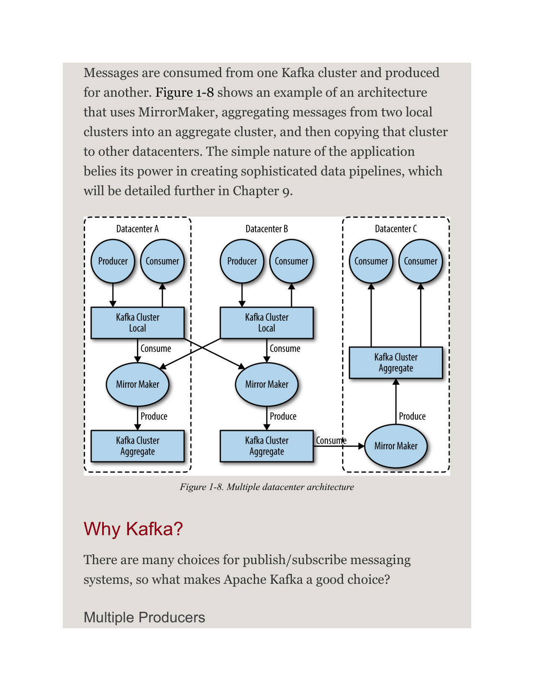
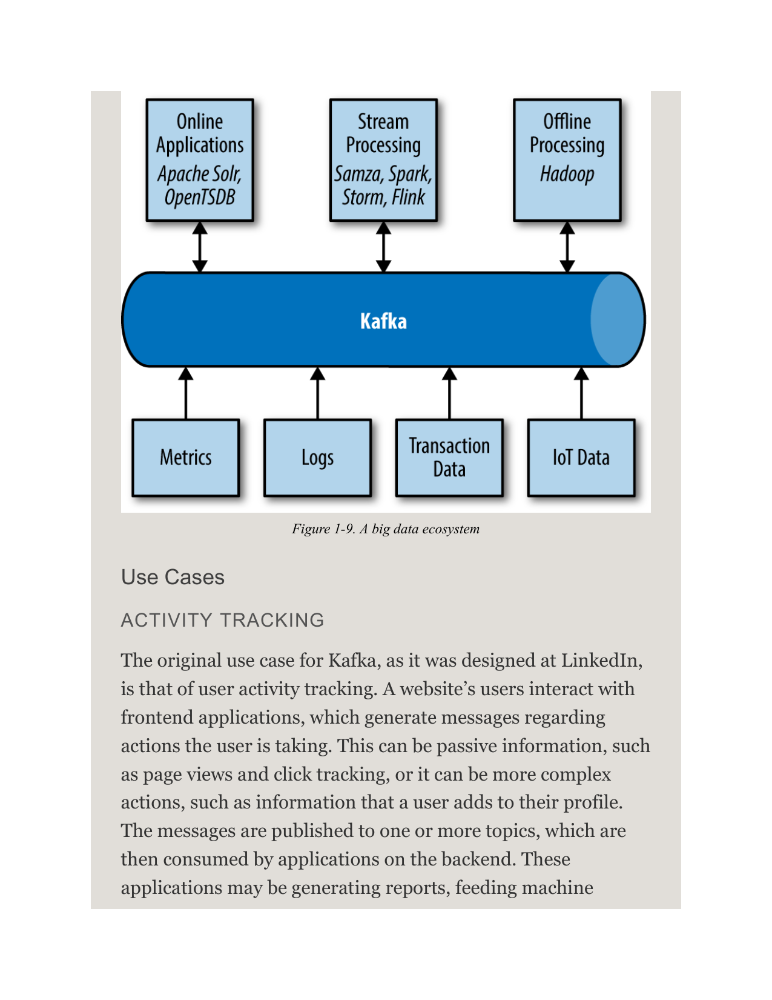

# 1 初识 Kafka

> **Early Release 读者请注意**
>
> Early Release 电子书让你在书籍正式发布之前就能接触到作者原始、未经编辑的内容，以便你能尽早利用这些技术。本章将是最终版书籍的第 1 章。
>
> 如果你对如何改进本书内容和/或示例有意见，或者发现本章中有缺失的内容，请通过 cshapi+ktdg@gmail.com 联系作者。

每个企业都由数据驱动。我们接收信息，分析它，处理它，并创造更多数据作为输出。每个应用程序都在创造数据——无论是日志消息、指标、用户活动、外发消息，还是其他任何形式的数据。每一个字节的数据都有一个故事要讲，都有某种重要性，能够为下一步的行动提供信息。为了知道下一步该做什么，我们需要将数据从产生的地方移动到可以被分析的地方。我们每天都在 Amazon 这样的网站上看到这一点：我们对感兴趣的商品点击，会转化为推荐，稍后展示给我们。

我们完成这个过程的**速度越快**，组织就能变得越敏捷、响应越及时。我们在数据搬运上花费的精力越少，就越能专注于核心业务。这就是为什么数据管道在数据驱动的企业中是一个关键组件。**我们如何移动数据，几乎变得与数据本身同等重要。**

> 每当科学家意见不一，那是因为我们没有足够的数据。然后我们可以就获取什么样的数据达成一致；我们去获取数据；数据就解决了问题。要么我是对的，要么你是对的，要么我们都错了。然后我们继续前进。
>
> ——Neil deGrasse Tyson

## 发布/订阅消息系统

在讨论 Apache Kafka 的具体细节之前，理解**发布/订阅消息系统**的概念及其重要性至关重要。发布/订阅消息系统是一种模式，其特点是数据的发送方（发布者）不会将数据片段（消息）专门指向某个接收方。相反，发布者以某种方式**对消息进行分类**，而接收方（订阅者）**订阅**接收特定类别的消息。发布/订阅系统通常有一个 **Broker**——消息被发布到的中心点——来促进这一过程。

### 这一切是如何开始的

许多发布/订阅的用例都以相同的方式开始：从一个简单的消息队列或进程间通信通道开始。例如，你创建了一个需要将监控信息发送到某处的应用程序，于是你在应用程序中写了一个直接连接，连接到在仪表盘上显示指标的应用程序，然后通过这个连接推送指标，如图 1-1 所示。

对于监控的起步阶段来说，这是一个简单问题的简单解决方案。但不久之后，你决定想要在更长的时间维度上分析你的指标，而这在仪表盘上效果并不好。于是你启动一个新服务来接收指标、存储它们并进行分析。为了支持这一点，你修改了应用程序，让它同时向两个系统写入指标。此时，你已经有了另外三个也在生成指标的应用程序，它们都建立了到这两个服务的相同连接。你的同事认为对服务进行主动轮询用于告警也是个好主意，于是你在每个应用程序上添加了一个服务器，以便按需提供指标。一段时间后，更多应用程序开始使用这些服务器来获取各个指标并用于各种目的。这种架构看起来很像图 1-2，其中的连接关系甚至更难追踪。

这里积累的技术债务显而易见，所以你决定偿还一部分。你设置了一个单一的应用程序来接收所有应用程序的指标，并提供一个服务器，任何需要这些指标的系统都可以查询。这将架构的复杂性降低到类似于图 1-3 的程度。恭喜你，你已经构建了一个**发布/订阅消息系统**！

### 独立队列系统

在你与指标苦苦斗争的同时，你的一个同事也在处理日志消息的类似工作。另一个人则在跟踪前端网站的用户行为，并将这些信息提供给从事机器学习的开发人员，同时为管理层生成一些报告。你们都遵循了类似的道路：构建系统来解耦信息的发布者和订阅者。图 1-4 展示了这种基础设施，其中有三个独立的发布/订阅系统。

这当然比使用点对点连接（如图 1-2 所示）要好得多，但存在大量重复。你的公司正在维护多套数据队列系统，每套都有各自的缺陷和限制。你还知道，很快会有更多的消息系统用例出现。你真正想要的是一个**单一的集中式系统**，能够发布通用类型的数据，并随着业务的增长而增长。

## 走进 Kafka

Apache Kafka 就是一个为**解决这个问题**而设计的发布/订阅消息系统。它常被描述为"**分布式提交日志**"（distributed commit log），或者最近更流行的说法——"**分布式流平台**"（distributing streaming platform）。文件系统或数据库的提交日志旨在提供所有事务的持久化记录，以便可以重放这些记录来一致地构建系统状态。同样地，Kafka 中的数据也以**持久化、有序**的方式存储，并且可以被**确定性**地读取。此外，数据可以在系统内分布，以提供额外的故障保护和显著的性能扩展机会。

### 消息与批次

Kafka 中的数据单元称为**消息**（message）。如果你从数据库背景来理解 Kafka，可以把它看作类似于一行或一条记录。对 Kafka 而言，消息就是一个**字节数组**，因此消息中包含的数据对 Kafka 来说没有特定的格式或含义。消息可以携带可选的元数据位，称为**键**（key）。键也是一个字节数组，与消息一样，对 Kafka 没有特定含义。键用于以更可控的方式将消息写入分区。最简单的方案是生成键的一致性哈希，然后通过将该哈希值对主题中的分区总数取模来选择该消息的分区号。这确保了具有相同键的消息始终写入同一个分区。

为了提高效率，消息以**批次**（batch）的形式写入 Kafka。批次就是一组消息的集合，所有这些消息都发往同一个主题和分区。如果每条消息都单独进行一次网络往返，会造成过大的开销，而将消息收集到一起形成批次可以减少这种开销。当然，这是在**延迟和吞吐量之间的权衡**：批次越大，单位时间内可以处理的消息越多，但单条消息传播的时间也越长。批次通常还会被压缩，以牺牲一些计算能力为代价，提供更高效的数据传输和存储。键和批次都将在第 4 章中详细讨论。

### Schema（模式）

虽然消息对 Kafka 本身来说是不透明的字节数组，但建议在消息内容上施加额外的结构——即 **Schema（模式）**，以便于理解。消息模式有很多选择，取决于应用程序的具体需求。简单系统（如 JSON 和 XML）易于使用且人类可读，但它们缺乏强类型处理、模式版本间兼容性等特性。许多 Kafka 开发者更倾向于使用 **Apache Avro**，这是一个最初为 Hadoop 开发的序列化框架。Avro 提供了紧凑的序列化格式；模式与消息载荷分离，变更时无需重新生成代码；以及强大的数据类型和模式演化能力，同时支持向后和向前兼容。

一致的数据格式在 Kafka 中**至关重要**，因为它使得消息的**写入和读取可以解耦**。当这些任务紧密耦合时，订阅消息的应用程序必须被更新以处理新的数据格式，同时还要兼容旧格式。只有在那之后，发布消息的应用程序才能更新以使用新格式。通过使用定义良好的模式并将其存储在公共仓库中，Kafka 中的消息可以在无需协调的情况下被理解。模式与序列化将在第 4 章中详细讨论。

### 主题与分区

Kafka 中的消息被归类到**主题**（topic）。主题最接近的类比是数据库表或文件系统中的文件夹。主题进一步被分解为若干个**分区**（partition）。回到"提交日志"的描述，一个分区就是一个单一日志。消息以仅追加（append-only）的方式写入其中，并按从头到尾的顺序被读取。需要注意的是，由于一个主题通常有多个分区，**无法保证跨整个主题的消息时间排序**，只能保证在单个分区内的排序。图 1-5 展示了一个具有四个分区的主题，写入操作被追加到每个分区的末尾。分区也是 Kafka 提供**冗余和可扩展性**的方式。每个分区可以托管在不同的服务器上，这意味着单个主题可以水平扩展到多台服务器上，以提供远超单台服务器的性能。

在讨论 Kafka 等系统中的数据时，经常使用"流"（stream）这个术语。大多数情况下，流被视为一个单一的数据主题，无论分区数量是多少。这代表了从生产者流向消费者的单条数据流。这种方式指代消息在讨论**流处理**时最为常见——Kafka Streams、Apache Samza 和 Storm 等框架以实时方式操作消息。这种方法可以与离线框架（如 Hadoop）形成对比，后者设计为在以后的时间点对批量数据进行操作。流处理概述将在第 14 章中介绍。

### 生产者与消费者

Kafka 客户端是系统的使用者，有**两种基本类型**：**生产者**（Producer）和**消费者**（Consumer）。此外还有高级客户端 API——用于数据集成的 Kafka Connect API 和用于流处理的 Kafka Streams。这些高级客户端使用生产者和消费者作为构建块，在其之上提供更高级的功能。

**生产者**创建新消息。在其他发布/订阅系统中，它们可能被称为发布者（publisher）或写入者（writer）。通常，消息会被生产到特定主题。默认情况下，生产者不关心特定消息写入哪个分区，会均衡地将消息分布到主题的所有分区上。在某些情况下，生产者会将消息定向到特定分区，这通常通过消息键和分区器来实现——分区器会生成键的哈希并将其映射到特定分区。这确保了给定键的所有消息都会被写入到同一个分区。生产者也可以使用自定义分区器，按照其他业务规则将消息映射到分区。生产者将在第 4 章中详细介绍。

**消费者**读取消息。在其他发布/订阅系统中，这些客户端可能被称为订阅者（subscriber）或读取者（reader）。消费者订阅一个或多个主题，并**按消息生产的顺序读取**消息。消费者通过跟踪消息的**偏移量**（offset）来记录已经消费了哪些消息。偏移量是另一种元数据——Kafka 在每条消息生产时附加的一个持续递增的整数值。给定分区中的每条消息都有唯一的偏移量。通过将每个分区最后消费的消息偏移量存储在 Zookeeper 或 Kafka 本身中，消费者可以停止和重启而不会丢失自己的位置。

消费者作为**消费者组**（consumer group）的一部分工作——消费者组是一个或多个消费者协同消费一个主题的集合。消费者组确保每个分区只被组中的一个成员消费。在图 1-6 中，单个组中有三个消费者在消费一个主题。其中两个消费者各自消费一个分区，而第三个消费者消费两个分区。消费者到分区的映射通常被称为消费者对分区的"所有权"。

通过这种方式，消费者可以**水平扩展**以消费具有大量消息的主题。此外，如果单个消费者发生故障，组中的剩余成员将**重平衡**（rebalance）正在消费的分区，以接管故障成员的工作。消费者和消费者组将在第 6 章中详细讨论。

### Broker 与集群

单个 Kafka 服务器称为 **Broker**。Broker 接收来自生产者的消息，为它们分配偏移量，并将消息提交到磁盘存储。它还服务消费者，响应针对分区的获取请求（fetch request），返回已提交到磁盘的消息。根据具体硬件及其性能特性，单个 Broker 可以轻松处理数千个分区和每秒数百万条消息。

Kafka Broker 被设计为作为**集群**的一部分运行。在 Broker 集群中，一个 Broker 还会充当**集群控制器**（cluster controller，从集群中的活跃成员中自动选举产生）。控制器负责管理操作，包括将分区分配给 Broker 和监控 Broker 故障。一个分区由集群中的**单个 Broker 拥有**，该 Broker 被称为分区的 **Leader**。一个分区可以被分配给多个 Broker，这将导致分区被复制（如图 1-7 所示）。这提供了分区中消息的**冗余**，使得在 Broker 故障时另一个 Broker 可以接管领导权。然而，所有操作该分区的消费者和生产者都必须连接到 Leader。集群操作（包括分区复制）将在第 8 章中详细介绍。

Apache Kafka 的一个关键特性是**保留**（retention），即消息在一段时间内的持久化存储。Kafka Broker 配置了主题的默认保留设置，要么保留消息一段时间（例如 7 天），要么直到主题达到一定的大小（例如 1 GB）。一旦达到这些限制，消息就会过期并被删除，因此保留配置是**任意时刻保证可用的最小数据量**。单个主题也可以配置自己的保留设置，以便消息只在其有用的时候才被存储。例如，跟踪主题可能保留几天，而应用指标可能只保留几个小时。主题还可以配置为**日志压缩**（log compacted），这意味着 Kafka 只会保留特定键的最后一条消息。这对于变更日志类型的数据非常有用，因为只有最后一次更新是有价值的。

### 多集群

随着 Kafka 部署的增长，拥有多个集群通常是**有利的**。这样做有几个原因：

- **数据类型隔离**
- **安全需求的隔离**
- **多数据中心（灾难恢复）**

特别是当处理多个数据中心时，通常需要在集群之间**复制消息**。这样，在线应用程序可以访问两个站点的用户活动。例如，如果用户更改了个人资料中的公开信息，无论搜索结果在哪个数据中心显示，该更改都需要可见。或者，监控数据可以从多个站点收集到一个中心位置，在那里托管分析和告警系统。Kafka 集群内的复制机制仅设计为在单个集群内工作，而不是在多个集群**之间**工作。

Kafka 项目包含一个名为 **MirrorMaker** 的工具用于此目的。本质上，MirrorMaker 就是一个通过队列连接在一起的 Kafka 消费者和生产者。消息从一个 Kafka 集群消费，然后为另一个集群生产。图 1-8 展示了使用 MirrorMaker 的架构示例，将来自两个本地集群的消息聚合到一个汇总集群，然后将该集群复制到其他数据中心。该应用程序简单的表象掩盖了其在创建复杂数据管道方面的能力，这将在第 9 章中详细介绍。

## 为什么选择 Kafka？

发布/订阅消息系统有很多选择，那么是什么让 Apache Kafka 成为一个好的选择呢？

### 多生产者

Kafka 能够**无缝处理多个生产者**，无论这些客户端使用多个主题还是同一个主题。这使得该系统非常适合聚合来自多个前端系统的数据并使其保持一致。例如，一个通过多个微服务向用户提供内容的网站，可以有一个用于页面浏览量的单一主题，所有服务都可以使用通用格式写入。消费者应用程序随后可以接收整个网站所有应用程序的单条页面浏览量流，而无需协调从多个主题——每种应用一个——进行消费。

### 多消费者

除了多个生产者外，Kafka 还被设计为支持**多个消费者读取任意单条消息流而互不干扰**。这与许多队列系统形成对比，在那些系统中，一条消息一旦被一个客户端消费，就不再对其他任何客户端可用。多个 Kafka 消费者可以选择作为同一个组的一部分运行，共享一条流，确保整组只处理给定消息一次。

### 基于磁盘的保留

Kafka 不仅能处理多个消费者，其**持久化消息保留**意味着消费者不一定需要实时工作。消息被提交到磁盘，并使用可配置的保留规则进行存储。这些选项可以按主题进行选择，允许不同的消息流根据消费者需求具有不同的保留时长。持久化保留意味着如果消费者因处理缓慢或流量突发而落后，不存在丢失数据的风险。这也意味着可以对消费者进行维护——将应用程序离线一小段时间——而无需担心消息在生产者端积压或丢失。消费者可以被停止，消息将被保留在 Kafka 中。这使得它们可以**重新启动并从中断的地方继续处理消息，而不会丢失数据**。

### 可扩展

Kafka 的**灵活可扩展性**使其易于处理任何规模的数据。用户可以从单个 Broker 作为概念验证开始，扩展到三个 Broker 的小型开发集群，然后迁移到具有数十甚至数百个 Broker 的大型生产集群，这些集群会随着数据规模的增长而扩展。扩展可以在集群在线的情况下执行，不会影响整个系统的可用性。这也意味着多 Broker 集群可以**容忍单个 Broker 的故障**，并继续服务客户端。需要容忍更多同时故障的集群可以配置更高的复制因子。复制将在第 8 章中详细讨论。

### 高性能

所有这些特性汇集在一起，使 Apache Kafka 成为一个在高负载下具有出色性能的发布/订阅消息系统。生产者、消费者和 Broker 都可以被扩展以轻松处理非常庞大的消息流。同时，从消息生产到对消费者可用，仍能提供亚秒级的消息延迟。

## 数据生态系统

许多应用程序参与我们为数据处理构建的环境。我们有定义好的**输入**——以创建数据或以其他方式将数据引入系统的应用程序的形式。我们有定义好的**输出**——以指标、报告和其他数据产品的形式。我们创建**循环**，其中一些组件从系统中读取数据，使用其他来源的数据进行转换，然后将数据重新引入数据基础设施以在其他地方使用。这是针对大量不同类型的数据完成的，每种数据都有独特的内容、大小和使用特性。

Apache Kafka 为数据生态系统提供了**循环系统**，如图 1-9 所示。它在基础设施的各个成员之间传递消息，为所有客户端提供一致的接口。当与提供消息模式的系统配合使用时，生产者和消费者不再需要任何形式的紧密耦合或直接连接。随着业务案例的创建和消亡，组件可以被添加和移除，而生产者无需关心谁在使用数据，也无需关心消费者应用程序的数量。

## 用例

### 活动跟踪

Kafka 最初在 LinkedIn 设计的用例就是**用户活动跟踪**。网站用户与前端应用程序交互，这些应用程序生成关于用户行为操作的消息。这可以是被动信息，如页面浏览量和点击跟踪；也可以是更复杂的操作，如用户添加到个人资料中的信息。消息被发布到一个或多个主题，然后由后端的应用程序消费。这些应用程序可能生成报告、为机器学习系统提供数据、更新搜索结果，或执行其他必要操作以提供丰富的用户体验。

### 消息传递

Kafka 也用于**消息传递**——应用程序需要向用户发送通知（如电子邮件）。这些应用程序可以生产消息，而无需关心格式化或消息实际如何发送。然后一个单一的应用程序可以读取所有待发送的消息并一致地处理它们，包括：

- 使用统一的外观和风格来**格式化消息**（也称为"装饰"）
- 将多条消息收集到**单条通知**中发送
- 应用用户关于如何接收消息的**偏好设置**
- 使用单一应用程序避免了在多个应用程序中**重复功能**，同时也允许执行像聚合这样的操作，否则这是不可能的。

### 指标与日志

Kafka 也非常适合收集应用程序和系统指标及日志。这是一个能够发挥**多个应用程序产生相同类型消息**能力的用例。应用程序定期将指标发布到 Kafka 主题，这些指标可以被监控和告警系统消费。它们也可以在 Hadoop 等离线系统中用于执行长期分析，如增长预测。日志消息可以以相同方式发布，并路由到专门的日志搜索系统（如 Elasticsearch）或安全分析应用程序。Kafka 的另一个额外好处是，当目标系统需要更改时（例如，是时候升级日志存储系统了），无需更改前端应用程序或聚合的方式。

### 提交日志

由于 Kafka 基于提交日志的概念，数据库更改可以被发布到 Kafka，应用程序可以轻松监控这条流以接收实时更新。这个变更日志流还可以用于将数据库更新复制到远程系统，或将来自多个应用程序的更改合并到单个数据库视图中。持久化保留在这里用于为变更日志提供缓冲区，这意味着在消费应用程序发生故障时可以重放。或者，可以使用日志压缩主题通过每个键只保留一次变更来提供更长的保留时间。

### 流处理

另一个提供大量应用类型的领域是**流处理**。虽然几乎所有 Kafka 的使用都可以被认为是流处理，但这个术语通常指提供类似 Hadoop 中 Map/Reduce 处理功能的应用程序。Hadoop 通常依赖数小时或数天的长时间数据聚合。而流处理在数据实时到达时——消息一经生产就进行处理。流框架允许用户编写小型应用程序来操作 Kafka 消息，执行计数指标、将消息分区以便其他应用程序高效处理，或使用来自多个来源的数据转换消息等任务。流处理将在第 14 章中介绍。

## Kafka 的起源

Kafka 的创建是为了解决 LinkedIn 的数据管道问题。它被设计成一个高性能的消息系统，能够处理多种类型的数据，并提供关于用户活动和系统指标的干净、结构化的实时数据。

> 数据真正驱动我们所做的一切。
>
> ——Jeff Weiner, LinkedIn CEO

### LinkedIn 的问题

与本章开头描述的示例类似，LinkedIn 有一个收集系统和应用指标的系统，使用自定义收集器和开源工具进行内部数据存储和展示。除了传统的指标（如 CPU 使用率和应用性能）之外，还有一个复杂的请求追踪功能，使用监控系统来提供单个用户请求如何在内部应用程序中传播的内省分析。然而，这个监控系统存在许多缺陷：包括基于轮询的指标收集、指标间的大时间间隔，以及应用所有者无法管理自己指标的能力。该系统**高度依赖人工干预**——大多数简单任务都需要人为介入——而且**不一致**，同一测量在不同系统中使用不同的指标名称。

与此同时，还有一个为跟踪用户活动信息而创建的系统。这是一个 HTTP 服务，前端服务器会定期连接到它，并将一批消息（XML 格式）发布到 HTTP 服务。这些批次随后被移动到离线处理环节，在那里对文件进行解析和整理。这个系统也有许多缺陷：XML 格式不一致，解析消耗大量计算资源。更改跟踪的用户活动类型需要前端和离线处理之间进行大量协调工作。即使在那种情况下，系统也因模式变更而不断崩溃。跟踪基于每小时批处理构建，所以无法在实时场景中使用。

监控和用户活动跟踪无法使用同一个后端服务。监控服务过于笨重，数据格式不适合活动跟踪，监控的轮询模型与跟踪的推送模型不兼容。与此同时，跟踪服务过于脆弱，不适用于指标场景，面向批处理的方式不是实时监控和告警的正确模型。然而，监控和跟踪数据共享许多特征，信息的相关性（例如，特定类型的用户活动如何影响应用性能）是非常有价值的。特定类型用户活动的下降可能表明服务它的应用程序存在问题，但活动批次处理数小时的延迟意味着对这些问题的响应非常缓慢。

最初，团队对现有的现成开源解决方案进行了彻底调查，以寻找一个能够提供数据实时访问并能扩展到处理所需消息流量规模的新系统。使用 ActiveMQ 搭建了原型系统，但当时它无法处理这种规模。对于 LinkedIn 需要的方式来说，它也是一个脆弱的解决方案——发现了 ActiveMQ 中许多会导致 Broker 暂停的缺陷，这会使客户端的连接积压，并干扰应用程序服务用户请求的能力。最终决定**为数据管道构建一个自定义基础设施**。

### Kafka 的诞生

LinkedIn 的开发团队由 Jay Kreps 领导，他是一位首席软件工程师，此前负责 Voldemort（一个分布式键值存储系统）的开发和开源发布。初始团队还包括 Neha Narkhede，后来加入了 Jun Rao。他们一起着手创建一个既能满足监控和跟踪系统需求，又能为未来扩展规模的消息系统。主要目标是：

- 通过使用**推-拉模型**来**解耦生产者和消费者**
- 在消息系统内提供消息数据的**持久性**，以允许多个消费者
- 针对**高吞吐量**消息进行优化
- 允许系统**水平扩展**以随数据流的增长而增长

结果是一个发布/订阅消息系统，具有典型消息系统的接口，但存储层更像日志聚合系统。结合 Apache Avro 在消息序列化方面的采用，Kafka 在每天数十亿条消息的规模上对指标和用户活动跟踪都表现出了有效性。Kafka 的可扩展性帮助 LinkedIn 的使用量增长到超过**七万亿条生产消息**（截至 2020 年 2 月）和每天超过**五 PB 的数据消费量**。

### 开源

Kafka 于 2010 年底在 GitHub 上作为开源项目发布。随着它在开源社区中开始引起关注，于 2011 年 7 月被提出并被接受为 Apache 软件基金会孵化器项目。Apache Kafka 于 2012 年 10 月从孵化器毕业。从那时起，它一直不断地被开发和维护，并在 LinkedIn 之外找到了一个强大的贡献者和提交者社区。Kafka 现在被用于世界上一些最大的数据管道中，包括 Netflix、Uber 和许多其他公司。

Kafka 的广泛采用也在核心项目周围创造了一个**健康的生态系统**。全球数十个国家有活跃的线下聚会群组，提供关于流处理的本地讨论和支持。还有大量与 Apache Kafka 相关的开源项目，其中最大的集中在 Confluent（包括 KSQL，以及他们自己的 Schema Registry 和 REST 项目）和 LinkedIn（包括 Cruise Control、Kafka Monitor 和 Burrow）。

### 商业参与

2014 年秋季，Jay Kreps、Neha Narkhede 和 Jun Rao 离开 LinkedIn，创立了 **Confluent**——一家围绕为 Apache Kafka 提供开发、企业支持和培训的公司。他们还与其他公司（如 Heroku）一起提供 Kafka 云服务。Confluent 通过与 Google 合作，在 Google Cloud Platform 上提供托管的 Kafka 集群，并在 Amazon Web Services 和 Azure 上提供类似服务。Confluent 的另一个主要举措是组织 **Kafka Summit** 会议系列。始于 2016 年，每年在美国和伦敦举行会议，Kafka Summit 为社区提供了一个全球规模的聚集地，分享关于 Apache Kafka 及相关项目的知识。

### 名字的由来

人们经常问 Kafka 是如何得名的，以及它是否象征着应用程序本身的特定含义。Jay Kreps 分享了以下洞见：

> 我当时认为，既然 Kafka 是一个为写入而优化的系统，使用一位作家的名字会很合适。我在大学时上过很多文学课，喜欢 Franz Kafka（弗朗茨·卡夫卡）。此外，这个名字对开源项目来说听起来很酷。所以基本上没有太多关联。

## 开始使用 Kafka

现在我们已经了解了 Kafka 的全部内容和它的历史，我们可以搭建它并构建我们自己的数据管道。在下一章中，我们将探索安装和配置 Kafka。我们还将讨论选择合适的硬件来运行 Kafka，以及在进入生产运维时需要注意的一些事项。

---

## 本章小结

- **发布/订阅消息系统**：一种解耦数据发送者和接收者的模式，Kafka 是其最流行的实现之一
- **核心概念**：消息（字节数组）、键（元数据）、批次（效率优化）、Schema（结构化数据）、主题（分类）、分区（扩展与冗余单元）
- **生产者与消费者**：生产者创建消息，消费者读取消息，消费者组保证分区独占消费
- **Broker 与集群**：Broker 是单个 Kafka 服务器，集群中一个 Broker 担任控制器，分区有 Leader 和 Follower 之分
- **保留机制**：可配置的时间或大小限制，支持日志压缩（只保留每个 key 的最新值）
- **为什么选择 Kafka**：多生产者、多消费者、磁盘持久化、可扩展、高性能
- **用例**：活动跟踪、消息传递、指标与日志、提交日志（CDC）、流处理
- **Kafka 的起源**：LinkedIn 为解决数据管道问题而创建，2010 年开源，2012 年从 Apache 毕业

## 本章选择题

1. **Kafka 中数据的基本单元是什么？**
   - A. Topic
   - B. Partition
   - C. Message（消息）
   - D. Batch（批次）

2. **在 Kafka 中，什么机制确保具有相同 Key 的消息写入同一个分区？**
   - A. 轮询（Round-robin）
   - B. 一致性哈希 + 取模
   - C. 随机选择
   - D. 基于时间戳排序

3. **Kafka 中一个 Topic 的消息顺序在以下哪个范围内是有保证的？**
   - A. 整个 Topic
   - B. 单个 Partition 内
   - C. 整个 Broker
   - D. 整个集群

4. **Kafka 的 retention 机制支持以下哪种配置方式？**
   - A. 仅按时间保留
   - B. 仅按大小保留
   - C. 按时间、大小或日志压缩（log compacted）
   - D. 仅日志压缩

5. **MirrorMaker 的主要作用是什么？**
   - A. 在单个集群内复制分区
   - B. 监控消费者组的延迟
   - C. 在多个 Kafka 集群之间复制消息
   - D. 管理 Topic 的配置

查看答案

1. **C. Message（消息）** — 消息是 Kafka 的数据单元，本质上是一个字节数组。
2. **B. 一致性哈希 + 取模** — 对 key 进行哈希后对分区数取模，确保相同 key 的消息路由到同一分区。
3. **B. 单个 Partition 内** — Kafka 只在单个分区内保证消息的有序性，跨分区无顺序保证。
4. **C. 按时间、大小或日志压缩（log compacted）** — Kafka 支持保留时间、保留大小和日志压缩三种保留策略。
5. **C. 在多个 Kafka 集群之间复制消息** — MirrorMaker 本质上是消费者+生产者，用于跨集群数据复制。

