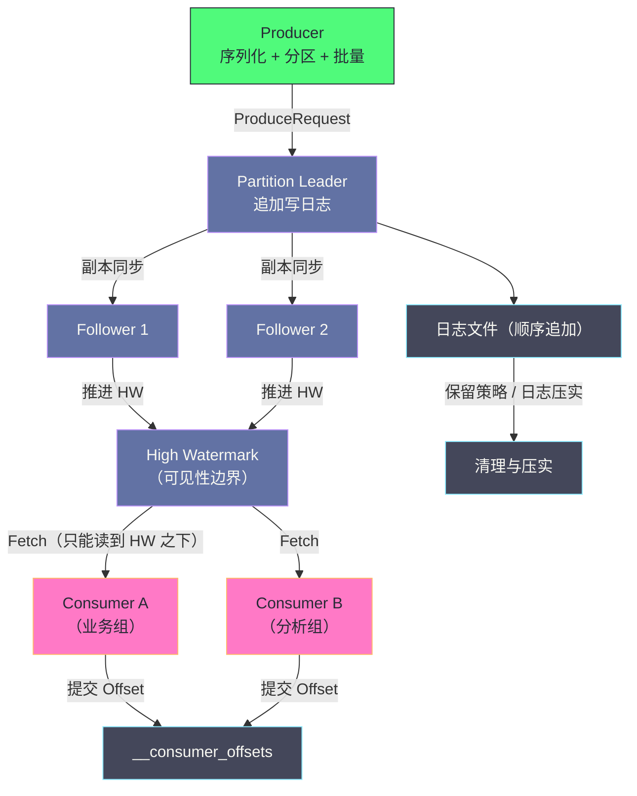

# 01 Kafka 全局架构——Broker、Topic、Partition 与消息流转

**摘要：**

理解 Kafka 的关键不在于记住它的组件，而在于理解它做了一次**范式转移**：把"消息队列"重新定义为"**分布式提交日志**"。传统消息队列把"投递"当作核心语义——消息被消费后即删除、Broker 维护每条消息的消费状态；Kafka 把"存储"当作核心语义——消息持久化在磁盘上、消费者自己维护消费位置。这一个转变同时解除了传统队列的三条限制（吞吐瓶颈、消费语义固化、无法重放），也带来了新的代价（消费状态的责任转移、保留策略需要管理、顺序性只保证在分区内）。本文按"为什么 → 是什么 → 怎么流转"展开：先讲范式转移的动机与代价，再逐层拆解 Broker、Topic、Partition、Offset、Replica 这套概念体系，然后走完 Producer 写入与 Consumer 读取两条链路，最后说明高吞吐的三个支点（顺序写、Page Cache、零拷贝）以及这套架构的边界与常见误用。

---

## 第 1 章 消息系统的范式转移

### 1.1 传统消息队列的三条限制

在 Kafka 之前（2011 年前后），消息系统领域已有成熟的方案，它们大多遵循 AMQP 这类以"投递"为核心的模型：消息被投递到队列，被某个消费者取走后即从队列中移除，Broker 负责维护"哪条消息已被消费"的状态。

这个模型在企业应用集成场景里运作良好，但在大数据时代暴露出三条限制。

**限制一：吞吐量瓶颈。** 为了不丢消息，传统队列通常要为每条消息维护消费状态（已投递、已确认、待重试），这些精细化的状态管理在吞吐量上升时会成为瓶颈。当每秒需要处理百万级消息时，"为每条消息记一笔账"的成本超过了消息本身的价值。

**限制二：消费语义被固化。** 队列模型决定了"一条消息只能被一个消费者取走"。但真实的业务场景往往要求"一份数据被多方使用"——同一份用户行为日志，实时推荐系统要用来更新特征、离线分析要用来做统计、监控系统要用来检测异常。传统队列无法让三方各自完整地读一遍同一份数据。

**限制三：无法重放。** 消息一旦被消费就消失了。当下游系统出现 Bug 需要重新处理历史数据时，唯一的办法是"让上游重发一遍"——而这在很多场景下做不到（上游可能已经不再持有这份数据）。

三条限制的共同根源是同一个设计假设：**消息是"在途的"（in-flight），它的生命周期到被消费为止。** 只要这个假设不变，上面三条限制就无法从机制上解除。

### 1.2 提交日志：换一个类比

Kafka 的做法是换掉这个假设：**把消息当作"已落地的记录"，而不是"在途的包裹"。**

这个转变可以用日志来类比。传统消息队列像"快递驿站"——包裹到站后等待取件，取走即出站，驿站需要记录每个包裹的状态；Kafka 像"日志本"——每条记录按顺序写下后就永久留在本子上，谁要读就自己翻到某一页开始读，本子不关心谁读到了哪。

这个类比对应到实现上是三件事：**消息追加写入磁盘上的日志文件**（写下来就不动）、**每条消息有一个递增的编号**（也就是 Offset，相当于行号）、**消费者自己记录读到哪一行**（消费位置由消费者维护，而不是 Broker）。

这个转变带来的收益是直接的：**吞吐量不再受"状态管理"约束**（写入就是追加，不涉及复杂状态）；**多个消费者可以各自完整读取**（日志本可以被多人翻阅，互不影响）；**可以重放**（只要数据还在保留期内，随时可以回到任意位置重新读）。

### 1.3 代价：责任与语义的转移

范式转移从来不是"只有好处"，Kafka 的这个选择同样把若干责任从 Broker 转移到了使用方。

**责任一：消费位置由消费者维护。** 传统队列里，Broker 知道每条消息是否被消费；Kafka 里，消费者需要自己提交 Offset。这带来一个直接后果：**如果消费者忘记提交或提交时机不当，就会造成重复消费或消息丢失。** 这类问题的调试难度远高于"Broker 说没消费成功"。

**责任二：数据保留需要显式管理。** 传统队列里消息被消费后自动消失，"保留"不是问题；Kafka 里消息不会因为被消费而删除，因此必须配置保留策略（按时间或按大小），否则磁盘会被填满。**"消息消费完了但磁盘还在涨"是初学者的常见困惑**，而它的原因就是范式转移的直接结果。

**责任三：有序性只在分区内成立。** 日志本是一本，但 Kafka 把它切成了多本（分区）——因此"全局有序"不再自动成立。需要有序的场景必须由使用方通过路由策略来保证（把需要有序的消息路由到同一个分区）。

**这三条代价与第 1.1 节的三条限制是一一对应的**：解除吞吐瓶颈的代价是消费状态的责任转移；解除消费语义固化的代价是保留策略需要管理；解除无法重放的代价是有序性边界。理解这个对应关系，就能理解 Kafka 后续每一个设计决策的动机。

> [!info] 核心概念
> 把 Kafka 理解为"分布式提交日志"，而不是"消息队列"，能解释它大量的设计细节：为什么它不关心消费者是否消费成功（那是消费者自己的事）、为什么它的核心 API 里有 `seek()`（回到某个位置重读）、为什么它能同时承担消息总线、流式存储与事件日志三种角色（因为"日志"本身就是一个通用的抽象）。**一个类比选对了，后续的很多问题就变成了"从类比推导"而不是"死记硬背"。**

### 1.4 "日志"这个类比为什么有力

"日志"之所以是一个好的类比，是因为它同时具备四个性质，而这四个性质恰好对应分布式系统的四类核心需求。

**性质一：只能追加。** 日志的新记录永远加在末尾，不修改已有内容。这个性质在存储上意味着顺序写（高性能），在语义上意味着**已写入的事实不可更改**（可审计）。

**性质二：有序。** 日志的每一行有明确的先后顺序。这个性质让"重放"成为可能——只要按顺序读一遍，就能重建出相同的状态。

**性质三：可被多方独立读取。** 一本日志可以被多人翻阅，每个人翻到自己的位置，互不干扰。这个性质让"一份数据多方消费"成为可能。

**性质四：位置是显式的。** 读者需要自己记住"读到哪了"。这个性质把消费状态的责任显式地交给了读者，而不是隐含在系统内部。

把这四条性质与 Kafka 的机制一一对应，会发现**Kafka 的每一个核心概念都是某条性质的实现手段**：分区是对"有序"的切分（把一本日志拆成多本以换取并行度）、Offset 是"位置显式"的具体形式、副本是对"只能追加"的可靠性保障、消费者组是"多方独立读取"的组织方式。**从这个角度看，Kafka 的概念体系不是一堆需要记忆的名词，而是一个逻辑自洽的推演结果。**

---

## 第 2 章 Kafka 在现代架构中的三种角色

### 2.1 消息总线：解耦生产者与消费者

最传统的用法是作为**消息总线**：生产方把事件写入 Kafka，消费方各自订阅。

它的价值在于解耦——订单服务产生订单事件后，不需要知道有哪些下游系统关心它；库存服务、通知服务、BI 系统各自订阅，互不依赖。**新增一个下游系统不需要改动生产方**，这是消息总线最核心的价值。

这个用法对应的是"日志本"的第一层能力：**写入与读取在时间上解耦**。生产方写完之后不需要等待任何人的确认（除了可靠性配置要求的副本确认），读取方可以按自己的节奏读。

### 2.2 流式存储：数据管道的中枢

第二类用法是作为**数据管道的中枢**：各类数据源（业务数据库的变更日志、应用日志、设备上报）先写入 Kafka，再由流处理引擎（Flink、Spark Streaming）消费并输出到下游系统（数据仓库、告警、特征库）。

这个用法的关键性质是"**Kafka 在管道里充当缓冲与解耦层**"：上游的写入速率与下游的处理速率不需要匹配——上游突增时数据在 Kafka 里堆积（而不是压垮下游），下游变慢时上游不受影响。**这个"削峰填谷"的能力，来自"数据被持久化保存"这个前提**——而它正是传统队列不具备的（传统队列在消息堆积时会因为状态管理开销而性能下降）。

### 2.3 事件日志：状态的来源

第三类用法是作为**事件日志**（Event Sourcing 的基础设施）：把业务状态的每一次变更记录为不可变的事件，系统的当前状态可以由事件流重放得出。

这个用法的价值在两处：**可追溯**（每一次状态变更有记录）与**可重建**（新系统可以通过重放历史事件来构建自己的状态，而不需要从数据库导出快照）。

它对应的是"日志本"最本质的能力：**日志本身就是权威数据，而不只是数据的传输通道**。这也是 Kafka 与"消息队列"在概念上最远的用法——在这里，Kafka 不是"传递消息的中介"，而是"存储事实的地方"。

### 2.4 三种角色的共同底座

三种角色看起来差异很大，但它们建立在同一个底座上：**持久化 + 可重放 + 多消费者独立读取**。

这也解释了一个常见困惑：**为什么 Kafka 的配置项里既有"消息系统"风格的参数（如 `acks`），也有"存储系统"风格的参数（如保留策略、日志压实）。** 因为它同时是这两类系统——当你把它当消息总线用时，关注前者；当你把它当存储用时，关注后者。**不理解这个双重身份，就会在配置时把两类参数混为一谈。**

---

## 第 3 章 Broker 与集群

### 3.1 Broker 的职责

**Broker** 是 Kafka 集群中的服务节点，本质上是一个运行 Kafka 进程的服务器。一个生产集群通常由三台以上 Broker 组成。

单个 Broker 承担四件事：**接收生产者的写入请求**（把消息追加到对应分区的日志文件）、**响应消费者的读取请求**（从日志文件读取并返回）、**存储它负责的分区数据**（以日志文件的形式落在本地磁盘）、以及**与其他 Broker 同步副本数据**（保证分区的高可用）。

Broker 用数字 ID 标识。需要留意的是，**Broker 本身不存储"哪个分区在哪个 Broker 上"这类集群元数据**——这类元数据由集群层面的组件统一管理，这也是下一节要讲的内容。

### 3.2 元数据管理的演进：从 ZooKeeper 到 KRaft

Kafka 的集群元数据（有哪些 Topic、每个 Topic 有多少分区、每个分区的 Leader 是谁）需要一个统一的管理者。历史上这个角色由 **ZooKeeper** 承担。

引入 ZooKeeper 的代价是三处：**多了一个需要部署与运维的组件**（Kafka 集群之外还要维护一个 ZK 集群）；**元数据变更要跨系统协调**（Controller 需要把变更写到 ZK，再由 ZK 通知其他 Broker）；以及**元数据规模受限**（ZK 的节点数量与写入频率都有上限，这在大规模集群里成为约束）。

较新的版本引入了 **KRaft 模式**：用 Kafka 自己实现的共识协议（Raft 的变体）管理元数据，把元数据本身也当作一个内部的日志来复制。它的收益是**去掉了 ZooKeeper 这个外部依赖**（部署与运维都简化了），并且**元数据的可扩展性更好**（因为它复用了 Kafka 自己的日志机制）。

这个演进值得留意的不是"哪个更好"，而是它体现的一条规律：**系统演进的一个常见方向是"把外部依赖内化"**。这与 JuiceFS 内化协调与存储依赖、Doris 内化元数据管理是同一类选择——**代价是必须自己把这件事做对，收益是部署与运维面的收缩。**

### 3.3 集群规模与拓扑

集群规模由三个因素共同决定：**吞吐量需求**（更多 Broker 分摊读写）、**容量需求**（更多 Broker 分摊磁盘）、以及**可用性需求**（副本需要分布在不同故障域）。

一个容易被忽略的约束是**分区数对单 Broker 的压力**：每个分区对应一组日志文件与索引文件，分区数越多，单 Broker 需要打开的文件句柄、占用的内存（索引与元数据缓存）与后台线程（副本同步、日志清理）就越多。因此"分区数"是集群规划里的一个独立维度，不能只看吞吐与容量。

还有一处拓扑上的考虑：**副本应当分布在不同故障域**（不同机架、不同可用区）。因为副本的意义是"某个故障域失效时数据仍可用"，如果副本集中在同一机架，机架级故障就会同时带走多个副本。**这一点在跨机房部署时尤其重要——它直接决定了"能容忍什么级别的故障"。**

### 3.4 集群变更的代价

集群的扩缩容与节点替换都会触发**数据搬迁**：新增 Broker 后，部分分区的副本需要迁移到新节点以实现负载均衡；下线节点前，它持有的副本必须迁移到其他节点。

这个过程的代价有三处。**其一是网络与磁盘压力**（搬迁本质是"读出来再写过去"，与业务读写争抢资源）；**其二是耗时**（搬迁总量除以可用带宽，通常以小时甚至天计）；**其三是期间的风险**（如果搬迁中途又发生节点故障，副本数可能降到危险水平）。

因此集群变更的三条纪律是：**限速**（给搬迁设置带宽上限，避免挤占业务）、**避开高峰**（不与大批量写入叠加）、**一次一类变更**（便于归因）。**这三条与 Doris 的扩缩容纪律、JuiceFS 的数据均衡纪律完全一致——因为它们面对的是同一类问题：数据搬迁会与正常服务争抢共享资源。**

---

## 第 4 章 Topic 与 Partition：从逻辑到物理

### 4.1 为什么需要 Partition

**Topic** 是 Kafka 的逻辑分类单元——生产者往某个 Topic 发消息，消费者订阅某个 Topic。但 Topic 本身是纯粹的逻辑概念，物理上它被切成若干 **Partition（分区）**。

设想没有分区的场景：一个 Topic 就是一条单一的有序消息序列。那么所有读写都集中在存放这条序列的那台机器上——**单机成为吞吐与容量的双重瓶颈**；同时所有消费者只能串行消费这条序列——**消费端也无法并行**。

分区的解法是把一条序列切成 N 条：每条分区独立存储、独立读写，因此**写入可以并行**（生产者同时向多个分区写）、**消费可以并行**（消费者组内不同成员负责不同分区）、**存储可以分散**（数据分布在多台 Broker 的磁盘上）。

```text
Topic: user-events（3 个分区）

Partition 0: [msg0, msg3, msg6, ...]  → 存储在 Broker 0
Partition 1: [msg1, msg4, msg7, ...]  → 存储在 Broker 1
Partition 2: [msg2, msg5, msg8, ...]  → 存储在 Broker 2
```

### 4.2 代价：有序性的边界

分区带来的最直接代价是**有序性的范围收缩**。

在"一条序列"的模型里，全局有序是天然的；切成 N 条之后，**每条分区内有序，分区之间没有顺序保证**。这意味着：如果业务要求"同一个用户的三个操作必须按顺序处理"，就必须保证这三条消息落在同一个分区里——而这需要**由生产者通过消息 Key 来指定**（相同 Key 哈希到同一分区）。

这条约束有一个重要的实践含义：**"是否需要全局有序"是选择分区策略的前提。** 如果业务确实需要全局有序，那就只能用一个分区——而这意味着放弃并行度。多数场景实际上只需要"按业务实体有序"（同一订单、同一用户、同一设备），这种情况下用 Key 路由即可。

### 4.3 分区数量的取舍

分区数是一个需要仔细权衡的参数，因为它同时影响四个方向。

**向上（并行度）**：分区数决定了一个消费者组最多能有多少个消费者并行消费（一个分区只能被组内一个消费者消费）。分区数少于消费者数时，多出来的消费者会闲置。

**向下（单分区规模）**：分区数越多，单个分区的数据量越小。这本身不是问题，但如果分区过小，日志段会频繁滚动，Compaction 与清理的效率会下降。

**横向（Broker 压力）**：每个分区对应一组文件与后台任务，分区数越多，单 Broker 的文件句柄、内存占用与后台线程压力越大。

**时间维度（不可逆性）**：**分区数可以增加，但不可以减少**——因为减少分区意味着要重新分配已有的数据，而 Kafka 的语义是按分区组织的（Offset 是分区内的编号），跨分区搬迁会破坏这个语义。因此分区数的决策具有"单向性"，**定少了可以加，定多了只能重建 Topic**。

一个实用的判断方法是：**按"目标单分区吞吐"反推分区数**（例如目标总吞吐除以单分区可承载的吞吐），再与"消费者数量上限"取较大值，最后检查"分区总数 × 副本数"是否在集群可承受范围内。

### 4.4 Offset：消息的地址

每条消息在它所属的分区里有一个递增的整数编号，即 **Offset**。Offset 从 0 开始、单调递增、不可变。

一条消息的精确地址由三元组确定：**（Topic，Partition，Offset）**。这个三元组是 Kafka 里最基础的定位方式——消费者提交的进度、日志文件里的索引、事务的边界，全都建立在这个三元组上。

这里有一处与直觉相悖的性质值得强调：**Offset 不是"全局唯一的消息 ID"，而是"分区内的位置编号"。** 因此同一个 Offset 值在不同分区里指向完全不同的消息。这解释了为什么"跨分区的消息顺序"无从谈起——它们本来就没有可比较的先后编号。

还有一处实践上的含义：**消费者提交的进度就是一组 (Partition, Offset) 对**。因为分区是独立消费的，所以"消费进度"天然是"每个分区各自一个位置"，而不是一个全局的单一进度值。这一点在排查"消费延迟"时很重要——延迟需要按分区看，而不是看一个平均值。

### 4.5 分区的物理落点

分区不只是一个逻辑概念，它在物理上有明确的对应物：**每个分区在 Broker 的磁盘上对应一个目录**，目录里存放该分区的日志文件与索引文件。

这个映射关系带来三处实践含义。

**含义一：分区是数据搬迁的最小单位。** 当 Broker 扩容或失效时，搬迁与重建的单位是分区（更准确地说是分区的副本）。因此分区数量决定了"集群变更时的搬运粒度"——分区越少，单个分区越大，单次搬运的数据量越大、耗时越长。

**含义二：分区决定了单机的资源占用形态。** 每个分区都需要打开若干文件句柄、占用索引缓存、并可能有一个后台线程参与副本同步。因此分区总数会直接影响单 Broker 的资源压力。

**含义三：分区是"数据本地性"的边界。** 一个分区的全部数据都在某台 Broker 上（该分区的 Leader 与副本），因此"读取某个分区的全部数据"这件事天然是单机操作。这解释了为什么"按分区键聚合"的操作比"跨分区聚合"高效得多。

**这三条含义共同说明：分区不只是"并行度的单位"，它同时是"搬迁的单位""资源占用的单位"与"数据本地性的单位"。** 因此在设计分区数时，不能只考虑并行度，还要考虑后三者。

---

## 第 5 章 副本与 Leader

### 5.1 副本的角色分工

每个分区可以有多个**副本**（Replica），副本数由 `replication.factor` 决定。副本分布在不同的 Broker 上，其中一个是 **Leader**，其余是 **Follower**。

分工很明确：**Leader 处理所有读写请求**（生产者写入、消费者读取都找 Leader），**Follower 只做一件事——从 Leader 同步数据**。Follower 不对外提供服务，它的价值在于"当 Leader 失效时可以被选为新 Leader"。

这个"读写都走 Leader"的设计简化了一致性问题：因为只有 Leader 接受写入，就不存在"多个节点同时写导致冲突"的情况；Follower 只是被动复制，因此它们的数据要么与 Leader 一致，要么落后。**"单写多读副本"是最容易推理的一致性模型**，代价是 Leader 承担了全部读写压力（这也是分区数需要足够多的原因之一——分区分散了 Leader 的角色）。

### 5.2 ISR：一个折中的同步定义

"副本与 Leader 一致"这句话需要一个精确的定义，因为网络与负载会让 Follower 的同步有快有慢。

Kafka 引入了 **ISR（In-Sync Replicas，同步副本集合）**：与 Leader 保持"足够接近"的副本集合。Leader 是 ISR 的当然成员，Follower 如果落后超过一定阈值（由 `replica.lag.time.max.ms` 控制）就会被移出 ISR，追赶上来后再被加回。

ISR 的引入解决了一个两难：**如果要求"所有副本都必须确认"，那么一个慢副本就会拖垮整个写入**；**如果只要求"Leader 确认"，那么 Leader 失效就会丢数据**。ISR 给出了中间答案——**要求"当前的同步副本集合"确认**，既排除了掉队的副本（不拖慢写入），又保证了"至少有一个其他副本持有数据"（不因 Leader 失效而丢失）。

这个设计的关键参数是 `min.insync.replicas`：它规定了"ISR 至少要有几个成员，写入才被接受"。把它设为 2、同时 `acks=all`，就得到了"至少两个副本确认"的保证——这是生产环境最常见的高可靠组合。

### 5.3 High Watermark：可见性的边界

副本机制带来一个必须回答的问题：**消费者能读到哪一条消息？**

如果消费者能读到"刚写入 Leader 但还没同步到任何 Follower"的消息，那么一旦 Leader 失效，这条消息就会"读到过但后来不存在了"——这违反了一致性直觉。

Kafka 用 **High Watermark（HW，高水位）** 划定可见性边界：**只有已经被 ISR 中所有副本同步的消息，才对消费者可见。** HW 之下的消息是"已提交"的（即使 Leader 失效也不会丢失），HW 之上的消息虽然在 Leader 上存在，但消费者读不到。

这个机制保证了"读到的消息不会因为故障而消失"，代价是**引入了可见性延迟**：一条消息从写入 Leader 到对消费者可见，需要等待 ISR 中所有副本都同步到它。副本同步是有周期的，因此这个延迟虽然通常很小，但在 ISR 成员较多或网络较慢时会变大。

**这也是"副本数越多越安全但延迟越高"这条经验的来源**——副本数增加意味着 HW 需要等待更多副本同步，可见性延迟随之上升。

### 5.4 Leader 选举与数据截断

当 Leader 失效时，需要从 ISR 中选出一个新 Leader。这个过程中有一个容易被忽略的风险：**数据截断**。

设想这样的场景：旧 Leader 写入了若干条消息（在 HW 之上，尚未被其他副本同步），然后它失效了。新 Leader 是从 ISR 中选出的、不持有这些消息的副本。此时那些"只存在于旧 Leader 上"的消息必须被丢弃——否则新 Leader 的日志就会出现空洞（Offset 不连续）。这个动作就是**截断**（Truncation）。

截断本身是正确的（它保证了一致性），但历史上它曾带来一个严重问题：**如果旧 Leader 在"假死"后恢复（例如长时间的 GC 暂停），它并不知道自己已经被替换，可能会带着那些"应该被截断"的消息重新加入集群**，造成数据状态混乱。Kafka 引入 **Leader Epoch**（一个单调递增的纪元编号）来解决这个问题——每次 Leader 变更都递增纪元，副本在重新加入时会比对自己的纪元与当前纪元，从而知道"自己落后了、需要截断到什么位置"。

这个机制的意义在于：**它把"哪些数据应该被丢弃"这个判断从"依赖时序假设"变成了"依赖显式编号"。** 分布式系统里凡是依赖"谁先谁后"的判断，都容易在时钟与网络不可靠时出错；而依赖显式编号（纪元、序列号、版本号）的判断则不会。**这是一条通用的设计经验：能用编号解决的顺序问题，不要用时序解决。**

---

## 第 6 章 Producer 的写入链路

### 6.1 元数据获取与分区路由

生产者发送消息的第一步是"知道该发给谁"。它向任意一个 Broker 请求集群元数据（有哪些 Topic、每个 Topic 的分区分布、每个分区的 Leader 在哪台 Broker），并把结果缓存在本地，定期刷新。

拿到元数据后，生产者根据**分区策略**决定目标分区。三种典型策略：**无 Key 时用粘性策略**（一段时间内把消息集中发往同一个分区，以攒满批次、提升批量效率，之后随机换一个分区）；**有 Key 时用哈希策略**（对 Key 做哈希后取模，保证相同 Key 落到同一分区，从而保证同 Key 有序）；**自定义策略**（按业务规则路由，如让某类消息走专用分区）。

有一处细节值得留意：**哈希分区在 Key 分布不均时会产生数据倾斜**。如果某个 Key 的消息量远超其他 Key（热门商品、大客户），对应分区会成为热点——该分区的 Leader 承担了远超平均的写入，消费该分区的消费者也远比其他消费者繁忙。**"倾斜"是分区设计里最常见的性能问题，而它的根源往往在业务数据本身的分布上，而不是配置。**

### 6.2 批量累积：吞吐的来源

生产者不会"调用一次发送就发一条网络请求"。它把发往同一个分区的消息累积到一个**批次**里，满足"批次达到指定大小"或"等待时间超过指定阈值"两个条件之一时才发送。

这个机制的意义可以用算术说明：假设单次网络往返的有效开销是 1 毫秒，如果每条消息都单独发送，那么单连接吞吐上限就是"消息大小除以 1 毫秒"；如果攒成 100 条一批发送，同样的 1 毫秒开销被摊到 100 条消息上，**吞吐提升接近百倍**。这也是"批量"成为所有高吞吐系统标配的原因。

批量带来的代价是**延迟**：消息需要等待攒批，因此"最坏情况下的发送延迟"等于攒批等待时间。**这个取舍由等待时间参数控制**——设为 0 表示不等待（延迟最低、批量效果最差），设为一个较小的值（几毫秒）则能显著提升吞吐而延迟增加有限。多数异步场景下，几毫秒的额外延迟是可以接受的，因此实践中通常不会保持默认的 0。

### 6.3 acks：可靠性的三个档位

`acks` 参数控制"Broker 在什么条件下向生产者返回成功"，它直接决定了消息的持久性级别。

| acks 取值 | 语义 | 代价 |
|---|---|---|
| 0 | 发出去即认为成功，不等确认 | 网络中断时消息可能根本没到达 |
| 1 | 等 Leader 写入本地日志即返回 | Leader 在副本同步前失效会丢这条消息 |
| all | 等 ISR 中所有副本都写入才返回 | 写入延迟取决于最慢的 ISR 成员 |

三档的取舍是"可靠性换延迟"的直接体现。需要强调的是 **`acks=all` 单独使用并不够**：如果 ISR 因为副本掉队而只剩 Leader 自己，`acks=all` 就退化为 `acks=1`——**表面上用了最强配置，实际上失去了保护。** 因此它必须与 `min.insync.replicas` 配合使用，后者的作用是"当 ISR 成员不足时拒绝写入而不是降级"。

这条组合的意义在于：**它把"静默丢数据"变成了"显式报错"**。当副本不足时，生产者会收到错误而不是"成功但实际不安全"的确认——**在数据可靠性上，"报错"永远优于"静默降级"**。

### 6.4 幂等与事务：重试的代价如何消除

生产者重试是不可避免的（网络抖动、Broker 短暂不可用），但重试会带来一个经典问题：**如果 Broker 已经写入成功、只是确认响应丢失了，那么重试会造成重复写入。**

Kafka 的解法是给每次发送一个可识别的标识：生产者实例有一个唯一 ID，每条消息（准确地说是每个批次）带一个单调递增的序列号。Broker 记录"这个生产者在这个分区上已经收到的最大序列号"，收到重复的序列号时直接返回成功但不重复写入。**这就把"重试"变成了幂等操作。**

需要留意它的边界：**幂等性只在单个生产者会话、单个分区内成立。** 生产者重启后 ID 会变化（新会话无法识别旧会话的重复），跨分区也没有原子性保证。要跨越这两个边界，需要使用事务 API——它提供跨分区的原子写入，是"精确一次"语义的基础（细节见 [[03 生产者——分区策略、acks 与幂等性]]）。

---

## 第 7 章 Consumer 的消费链路

### 7.1 Consumer Group：两种模型的统一

**消费者组**是 Kafka 组织并行消费的机制。规则只有两条：**同一个组内，一个分区只能被一个消费者消费**（互斥）；**不同组之间互不影响，各自独立消费全量数据**（广播）。

这两条规则恰好统一了两种传统的消息模型：**当组内只有一个消费者时，它等价于"点对点"**（每条消息只被处理一次）；**当有多个组订阅同一主题时，它等价于"发布订阅"**（每个组都收到全量）。因此 Kafka 不需要为两种模型维护两套代码路径——**模型的差异被"组的数量与成员数量"这两个参数吸收了**。

### 7.2 拉取模型与长轮询

消费者采用**拉取**（主动请求）而不是推送模型。这个选择有三处收益：**消费者可以按自身处理能力控制速率**（处理慢时就少拉一点，天然形成背压）；**重启后只需从上次位置继续拉取**（不需要 Broker 记住"发到哪了"）；**可以批量获取**（一次请求拿一批消息，减少往返）。

拉取模型的固有问题是"没有新消息时怎么办"——如果消费者不断轮询而消息一直没来，就是纯粹的资源浪费。Kafka 用**长轮询**解决：拉取请求可以携带"最少返回多少字节"与"最多等待多久"两个条件，Broker 在数据不足时会等待而不是立即返回空结果。**这个机制让"有消息时低延迟、没消息时不空转"两个目标同时成立。**

### 7.3 Offset 提交：责任转移的具体形态

消费者处理完消息后需要**提交进度**（把"已读到哪个位置"写入 Kafka 的内部主题）。这是第 1.3 节讲的"责任转移"最具体的体现。

提交方式分两类：**自动提交**（按固定间隔自动提交当前已返回给应用的最大位置）与**手动提交**（应用在处理完成后显式提交）。

自动提交的问题是**提交时机与处理完成时机可能不一致**：如果消费者已拉取一批消息、定时提交触发了、然后进程崩溃，那么重启后会从已提交的位置继续——而那一批中尚未处理完的消息就被跳过了。**这不是"提交太晚"，而是"提交太早"，后果是消息丢失。**

反过来，如果手动提交但提交失败（或提交前崩溃），重启后会重复处理那批消息。**因此"至少一次"是拉取模型的默认语义，而"精确一次"需要额外机制**（如幂等处理或事务）。理解这一点，就能理解为什么"消费端必须做幂等"是 Kafka 使用的基本纪律——**它不是可选的优化，而是语义的直接要求。**

### 7.4 消费语义的三档

把上述机制组合起来，可以给出三档语义及其所需条件。

**至多一次**：先提交再处理。消息可能丢（处理前崩溃就丢了），但不会重复。

**至少一次**：先处理再提交。消息可能重复（提交前崩溃就重复了），但不会丢。**这是多数场景的默认选择**，配合消费端幂等即可达到业务上的"精确一次"。

**精确一次**：需要事务机制把"处理结果写入"与"进度提交"绑成一个原子操作。它保证"既不丢也不重"，代价是复杂度与性能开销（细节见 [[07 消费语义——Exactly-Once 的实现路径]]）。

三档的选择依据是业务对"重复"与"丢失"的容忍度——**这再次说明 Kafka 把语义的选择权交给了使用方，而不是替你决定。**

### 7.5 消费滞后：最需要被监控的指标

消费滞后（Lag）指"分区最新消息的位置"与"消费者已提交位置"之间的差值。它是消费链路最重要的健康指标，因为**它同时反映了上游写入速率与下游处理能力之间的差距**。

滞后有三类典型形态，各自的含义不同。

**形态一：稳定的小滞后。** 滞后在一个小范围内波动而不持续增长，说明消费能力与生产速率匹配。**这是正常状态，不需要干预。**

**形态二：持续增长的滞后。** 滞后单向增长且不回落，说明消费能力跟不上生产速率。原因可能在消费端（处理逻辑变慢、消费者数量不足）也可能在上游（写入量突增）。**此时需要先判断是哪一侧的变化**——对比写入速率与消费速率的历史曲线即可区分。

**形态三：突增后回落。** 滞后突然升高然后逐步回落，通常对应"上游短时突增"或"消费端短暂不可用"。**这类形态的关键是确认它最终能回落到正常水平**——如果回落速度很慢，说明消费能力的余量不足。

需要强调的一点是：**滞后必须按分区看，而不是看总和。** 因为消费能力是"每个分区一个消费者"的并行结构，某个分区滞后严重而其他分区正常，说明该分区存在倾斜或该消费者有问题——而总和的数字会把这个问题平均掉。

---

## 第 8 章 一条消息的完整生命周期

把前面的机制串起来，一条消息从产生到被消费经历五个阶段。

**阶段一：生产端。** 消息被序列化、按分区策略选定目标分区、累积到批次、批量发送给该分区的 Leader。

**阶段二：Leader 接收与落盘。** Leader 把消息追加到分区的日志文件（顺序追加，这是高吞吐的基础），并根据 `acks` 配置决定何时返回确认。

**阶段三：副本同步。** Follower 定期向 Leader 拉取新消息并写入本地，ISR 与 HW 随之推进。

**阶段四：消费端读取。** 消费者从 Leader 拉取消息，能读到的边界由 HW 划定；读完后按策略提交进度。

**阶段五：保留与清理。** 消息不会因为被消费而删除，而是按保留策略（时间或大小）定期清理最老的日志段；如果配置了日志压实，则按 Key 保留最新值。



这五个阶段里有三处"边界"值得记住：**可见性边界在 HW**（HW 之上读不到）、**有序性边界在分区**（跨分区无序）、**持久性边界在 acks 与 min.insync.replicas**（两者配合才安全）。**这三条边界共同刻画了 Kafka 的一致性模型——它不是一个"要么强一致要么最终一致"的简单标签，而是三条各自独立的边界。**

---

## 第 9 章 高吞吐的三个支点

Kafka 能在普通机械硬盘上实现很高的吞吐，靠的是三个相互配合的机制。理解它们有助于理解"为什么某些配置看起来反直觉"。

**支点一：顺序追加写。** 消息永远追加到日志末尾，不修改已有内容。机械硬盘的随机写需要寻道（毫秒级），而顺序写可以持续以很高的速率写入——**"写磁盘慢"这个直觉来自随机写场景，在顺序追加的模型下并不成立。**

**支点二：Page Cache。** Kafka 写入时数据先进入操作系统的页缓存（由内核异步刷盘），读取时如果数据仍在页缓存中则直接命中内存。在"消费进度接近生产进度"的实时场景里，消息几乎完全通过页缓存传递，磁盘只承担持久化职责。

这个机制解释了一条反直觉的经验：**Kafka 不建议配置过大的 JVM 堆内存。** 因为堆内存与页缓存共享同一批物理内存——堆越大，留给页缓存的越少，冷数据读取的性能越差。**"把内存留给操作系统"在这里比"把内存留给应用"更划算。**

**支点三：零拷贝。** 消费者拉取数据时，Kafka 通过操作系统的零拷贝机制把数据从页缓存直接送到网络，跳过"内核到用户态、用户态再回内核"的两次数据拷贝。

零拷贝有一个前提条件：**数据在传输过程中不能被修改。** 这解释了 Kafka 的一个设计选择——**Broker 不解压消息**。生产者压缩后发送，Broker 原样存储，消费者拉取后自行解压。**Broker 因此是"传输型"而非"处理型"的**，这也是它能把零拷贝用足的原因。

三个支点的关系是**叠加而非替代**：顺序写解决了"写入的磁盘代价"，页缓存解决了"读取的磁盘代价"，零拷贝解决了"传输的 CPU 代价"。**三者缺一，吞吐都会明显下降**——这也是为什么 Kafka 对部署环境敏感（与内存密集型应用共部署会挤占页缓存，从而破坏第二个支点）。

### 9.4 三个支点各自的失效条件

三个支点都不是无条件成立的，理解它们的失效条件有助于定位性能问题。

**顺序写的失效条件是"数据被就地修改"**。Kafka 的日志是追加的，因此这个条件天然满足。但**日志压实（Compaction）会重写日志段**——它是一个"读旧段、写新段"的过程，虽然新段仍是顺序写，但它引入了额外的读写量。因此在开启压实的主题上，"写入吞吐"的评估要把压实开销算进去。

**页缓存的失效条件是"访问模式不再集中"**。实时消费（消费进度接近生产进度）走页缓存；而"补数据"（消费几天前的数据）需要真正的磁盘 IO。**因此同一个集群在"实时消费"与"补数据"两种负载下的性能表现可能相差一个数量级**——而这不是配置问题，是访问模式问题。

**零拷贝的失效条件是"数据需要被处理"**。只要 Broker 需要修改消息内容（例如格式转换、内容过滤），零拷贝就用不上。**这也是为什么 Kafka 坚持"Broker 不处理数据"**——一旦引入处理逻辑，这个支点就消失了。凡是在 Broker 侧做数据加工的需求（如拦截器修改消息），都会同时牺牲零拷贝带来的性能。

**三条失效条件的共同启示是：Kafka 的性能优势来自"不做某些事"，而不是"做得更快"。** 不修改数据（顺序写）、不主动缓存（依赖操作系统）、不处理内容（零拷贝）——**这三条"不做"才是性能的真正来源。** 因此任何"让 Kafka 多做一点"的需求，都要先评估它对这三个支点的影响。

---

## 第 10 章 边界与反例

### 10.1 反例一：把 Kafka 当数据库用

Kafka 能持久化、能按 Key 查询最新值（借助日志压实）、能重放，这让一些团队产生"它能否替代数据库"的想法。但它的查询能力仅限于"按 Offset 顺序扫描"与"按时间戳定位"——**没有二级索引、没有条件查询、没有聚合**。把它当数据库用，最终都会演变成"在消费端重建一套索引"，而那时你会发现需要的其实是一个真正的存储系统。

### 10.2 反例二：忽视消费端幂等

因为"至少一次"是默认语义，消费端必须能容忍重复消息。**如果消费逻辑是"累加计数"或"扣减库存"这类非幂等操作，重复消息会造成业务数据错误**，且这类错误往往在数据积累很久之后才被发现。正确做法是把"消费端幂等"当作基本要求，而不是"配置好了就不会重复"。

### 10.3 反例三：分区数定得过少或过多

定得过少，并行度不足，消费者闲置；定得过多，单 Broker 的文件与内存压力上升，且**分区数不可减少**，定多了只能重建主题。**分区数是少数"具有单向性"的决策之一**，因此需要按预期峰值而不是当前负载来定。

### 10.4 反例四：把 `acks=all` 当作"配了就安全"

如第 6.3 节所述，`acks=all` 在 ISR 收缩时会退化为 `acks=1`。**不与 `min.insync.replicas` 配合的 `acks=all`，只是心理安慰。**

### 10.5 反例五：忽略数据倾斜

按 Key 分区在 Key 分布不均时会产生热点。**倾斜的症状是"整体吞吐正常但个别消费者或分区负载极高"**，而它无法通过增加分区数解决——因为问题在数据分布上，不在分区数量上。解法通常是改造 Key（引入随机后缀）或按业务规则拆分。

### 10.6 反例六：把 Kafka 与内存密集型应用共部署

如第 9 章所述，Kafka 的性能依赖页缓存。共部署会挤占页缓存，导致冷数据读取性能显著下降。**这类问题的表现是"实时消费正常但补数据很慢"**——因为实时消费走页缓存，而补数据需要真正的磁盘 IO。

### 10.7 反例七：认为"消息被消费了就该释放磁盘"

这是范式转移带来的最典型困惑。Kafka 的消息不会因为被消费而删除，磁盘释放由保留策略决定。**"消费完了但磁盘没降"是设计使然，不是故障。**

### 10.8 反例八：把滞后看成一个整体数字

消费滞后是"每个分区一个值"，把它们相加得到的总和会掩盖"某个分区严重滞后"这类问题。**正确的观察方式是"分区级滞后 + 最大值"，而不是"总和"**——因为消费能力的瓶颈总是由最慢的那个消费者决定，而它对应的分区滞后才是真正需要关注的对象。

### 10.9 反例九：在需要全局有序时仍按分区设计

如果业务确实需要全局有序（例如全量事件的时间顺序），那么唯一的选择是单分区——而这意味着放弃并行度。**用多分区 + 事后排序来模拟全局有序，本质上是在应用层重建一个单分区**，成本更高且更容易出错。**"是否需要全局有序"必须在设计阶段回答清楚，而不是留给事后补救。**

---

## 第 11 章 落点

回到开头的判断：Kafka 的全部设计都可以从"**它是一条可持久化的、可被多方独立读取的日志**"这个定位推导出来。

分区解决了"一条日志的吞吐上限"，代价是有序性收缩到分区内；副本解决了"单点失效"，代价是引入了 ISR 与高水位这两个概念；批量与零拷贝解决了"高吞吐"，代价是引入了延迟与"Broker 不处理数据"的约束；消费者自维护进度解决了"多消费者独立读取"，代价是把消费语义的责任交给了使用方。

**这些代价没有一个是"设计缺陷"，它们全都是范式转移的必然对价。** 因此使用 Kafka 的关键不是记住参数，而是理解"你把哪些责任接了过来"：消费端的幂等、保留策略的管理、分区数的规划、有序性的保证——**这四项都不是 Kafka 替你做的，而是它要求你做的。**

后续各篇将分别深入这四条责任线：日志存储引擎（保留与清理的机制）、生产者（可靠性与幂等）、消费者与再平衡（并行的代价）、副本机制（可用性的边界）、以及精确一次语义（把前几篇的能力组合起来）。

---

## 专栏导航

- 下一篇：[[02 日志存储引擎——Segment、索引与零拷贝]]。
- 生产者：[[03 生产者——分区策略、acks 与幂等性]]。
- 消费者组：[[04 消费者与消费者组——Rebalance 机制深度剖析]]。
- 副本机制：[[05 副本机制——ISR、HW 与 Leader Epoch]]。
- 返回专栏首页：[[00 专栏导览]]。

---

## 参考资料

1. Apache Kafka. 官方文档：Introduction 与 Design. https://kafka.apache.org/documentation/
2. Kreps J. The Log: What every software engineer should know about real-time data's unifying abstraction. LinkedIn Engineering, 2013.
3. Narkhede N, Shapira G, Palino T. Kafka: The Definitive Guide. O'Reilly.
4. KIP-500: Replace ZooKeeper with a Self-Managed Metadata Quorum. https://cwiki.apache.org/confluence/display/KAFKA/KIP-500
5. KIP-98: Exactly Once Delivery and Transactional Messaging. https://cwiki.apache.org/confluence/display/KAFKA/KIP-98
6. Wang G, Koshy J, Subramanian S, et al. Building a Replicated Logging System with Apache Kafka. VLDB, 2015.
7. Kreps J, Narkhede N, Rao J. Kafka: a Distributed Messaging System for Log Processing. NetDB, 2011.

---

> [!note] 思考题
> 1. "把消息当已落地的记录而不是在途的包裹"这个转变，解除了哪三条限制、又带来了哪三条责任？
> 2. 分区数可以增加但不可以减少。这个单向性对"分区数怎么定"提出了什么要求？
> 3. `acks=all` 为什么不等于"配了就安全"？它与哪个参数必须配合使用？
> 4. 高吞吐的三个支点（顺序写、页缓存、零拷贝）中，哪一个最容易被部署方式破坏？
> 5. "至少一次"是默认语义，因此消费端必须幂等。你会用什么方式让一个"累加计数"的消费逻辑变得幂等？
