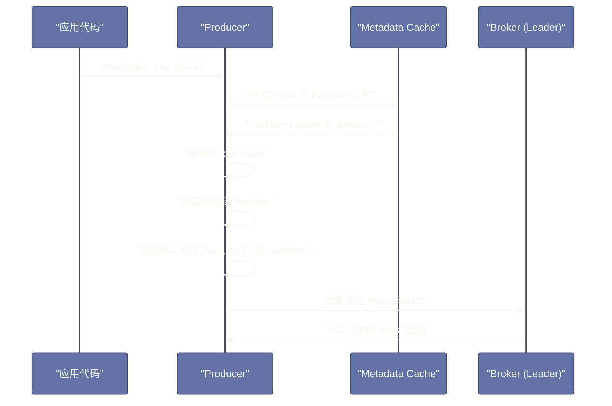
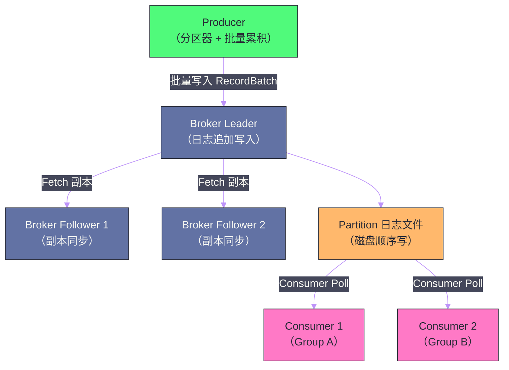

# Kafka 全局架构——Broker、Topic、Partition 与消息流转

## 摘要

Apache Kafka 是一个以**持久化、高吞吐、分布式**为核心设计目标的消息系统，它已经远远超越了"消息队列"的传统定义，更接近一个**分布式流式存储平台**。本文从 Kafka 解决的核心问题出发，系统梳理其架构中最基础也是最重要的概念：Broker 集群如何组织、Topic 与 Partition 的逻辑与物理映射关系、Producer 如何将消息写入 Broker、Consumer 如何从 Broker 拉取消息，以及整个消息流转的完整链路。理解这些基础概念是深入研究 Kafka 副本机制、消费者组 Rebalance、Exactly-Once 语义的前提。

---

## 第 1 章 Kafka 解决的核心问题

### 1.1 消息系统的演进历史

在 Kafka 诞生之前（2011年），消息系统领域已经有 RabbitMQ、ActiveMQ 等成熟方案。这些系统基于**AMQP**（Advanced Message Queuing Protocol）协议，将消息投递（Delivery）作为核心设计目标——消息被消费后即删除，Broker 维护每条消息的消费状态。

这种设计在企业应用集成（EAI）场景中运作良好，但在大数据时代暴露出严重局限：

**局限一：吞吐量瓶颈**。传统消息队列为保证消息不丢失，通常将消息存储在数据库或内存中，并为每条消息维护复杂的状态（ACK/NACK/重试队列）。这种精细化状态管理在吞吐量高时成为性能瓶颈——RabbitMQ 的单节点吞吐量在万级消息/秒时就会出现压力。

**局限二：消费语义固化**。AMQP 的 Queue 模型决定了消息被某个消费者消费后即"消失"，不同消费者看不到相同的消息。在 LinkedIn 的实际场景中，同一份用户行为日志需要被实时推荐系统、离线 Hadoop 分析、监控告警三个完全不同的系统同时消费——传统队列无法支持这种"一数据多消费"的需求。

**局限三：无法重放**。一旦消息被消费，就无法回溯。当下游系统出现 Bug 需要重新处理历史数据时，传统队列无能为力。

Kafka 的核心创新是将消息系统重新定位为**分布式提交日志（Distributed Commit Log）**——消息不是被"消费后删除"，而是持久化存储在磁盘上，消费者通过维护自己的**偏移量（Offset）**来记录消费位置。这个设计决策带来了三个革命性变化：
1. 吞吐量极大提升（顺序写磁盘 + 批量发送 + 零拷贝）；
2. 多个消费者可以独立消费同一份数据；
3. 消费者可以任意回溯历史数据。

### 1.2 Kafka 在现代架构中的定位

现代大数据和微服务架构中，Kafka 承担了三种角色：

**消息总线（Message Bus）**：解耦生产者与消费者。订单服务产生订单事件，推送到 Kafka；库存服务、通知服务、BI 系统各自订阅消费，互不依赖。

**流式存储（Streaming Storage）**：数据管道的核心。实时数据从各种源（CDC、日志、IoT）写入 Kafka，再由 Flink/Spark Streaming 等计算引擎消费，输出到数仓、告警系统、推荐引擎。

**事件日志（Event Log）**：Event Sourcing 架构的基础设施，将业务状态变更记录为不可变的事件流，支持系统状态重建和时间旅行调试。

---

## 第 2 章 核心概念：从逻辑到物理的映射

### 2.1 Broker：服务节点

**Broker** 是 Kafka 集群中的服务节点，本质上是一个运行 Kafka 进程的服务器。一个生产级 Kafka 集群通常由 3、5 或更多 Broker 组成。

每个 Broker 负责：
- 接收 Producer 的消息写入请求；
- 响应 Consumer 的消息拉取请求；
- 存储其负责的 Partition 的日志文件；
- 在集群内与其他 Broker 同步副本数据。

Broker 通过数字 ID 标识（如 broker-0、broker-1、broker-2）。集群的元数据管理（哪个 Topic 有多少 Partition，每个 Partition 的 Leader 在哪个 Broker 上）在 Kafka 2.x 及之前由 [[Zookeeper]] 维护，在 Kafka 3.x 的 KRaft 模式下由 Kafka 内置的 Raft 协议接管（详见第 6 篇）。

### 2.2 Topic 与 Partition：逻辑与物理的映射

**Topic** 是 Kafka 的逻辑消息分类单元，类似于数据库中的"表"——Producer 向特定 Topic 发送消息，Consumer 订阅特定 Topic 接收消息。

然而，Topic 本身是一个纯粹的逻辑概念，在物理层面，Topic 被拆分为若干个 **Partition（分区）**。Partition 才是 Kafka 实现**并行性**和**扩展性**的核心机制。

理解"为什么需要 Partition"是理解 Kafka 架构的关键：

**没有 Partition 的假设场景**：假设 Topic 是一个单独的、有序的消息序列，所有 Producer 写入和所有 Consumer 读取都操作这同一个序列。这意味着所有 IO 都集中在一个 Broker 上（单机瓶颈），所有消费者必须串行消费（无法并行）。当消息量达到每秒百万级时，单节点必然成为瓶颈。

**Partition 的解法**：将一个 Topic 的消息水平切分为 N 个 Partition，每个 Partition 分布在不同的 Broker 上，每个 Partition 的数据独立存储、独立读写。这样：
- **写入可以并行**：Producer 可以同时向多个 Partition 写入，吞吐量线性扩展；
- **消费可以并行**：Consumer Group 中的每个消费者负责若干个 Partition，多个消费者并行消费；
- **存储可以分散**：数据分散在多个 Broker 的磁盘上，突破单机存储上限。

**Partition 的代价**：单个 Partition 内的消息是严格有序的（按写入顺序），但不同 Partition 之间没有顺序保证。如果业务需要严格有序（如同一用户的操作必须按序处理），需要将同一用户的消息发送到同一个 Partition（通过 Key 哈希路由）。

```
Topic: user-events (3 个 Partition)

Partition 0: [msg0, msg3, msg6, msg9, ...]   → 存储在 Broker-0
Partition 1: [msg1, msg4, msg7, msg10, ...]  → 存储在 Broker-1
Partition 2: [msg2, msg5, msg8, msg11, ...]  → 存储在 Broker-2
```

### 2.3 Offset：消息的唯一地址

每个 Partition 内的消息有一个递增的整数编号，即 **Offset（偏移量）**。Offset 是消息在 Partition 内的唯一标识符，从 0 开始，单调递增，不可变。

一条消息的精确地址由三元组定位：`(Topic, PartitionID, Offset)`。

Consumer 通过维护自己读取到的 Offset 来记录消费进度——这是 Kafka 与传统消息队列最大的架构差异之一。传统队列的消费状态由 Broker 维护（Broker 知道每条消息是否被消费），而 Kafka 将消费状态的维护责任转移给了 Consumer。这个设计极大降低了 Broker 的复杂度，使得 Broker 可以专注于高吞吐的日志存储与读取。

> [!info] 核心概念：Offset 管理的演进
> Kafka 早期版本（0.8 之前），Consumer 将 Offset 存储在 [[Zookeeper]] 中。这在高频提交时造成 ZK 压力，且 ZK 的设计初衷不是高频小写。从 0.9 版本开始，Kafka 将 Consumer Offset 迁移到一个内部 Topic `__consumer_offsets` 中存储，彻底去除了消费端对 ZK 的依赖。

### 2.4 副本（Replica）：高可用保障

每个 Partition 可以有 1 到 N 个副本（Replica），副本数量称为**Replication Factor**。副本分布在不同的 Broker 上，每个 Partition 的 N 个副本中有一个是 **Leader**，其余是 **Follower**。

- **Leader Replica**：负责处理所有来自 Producer 和 Consumer 的读写请求；
- **Follower Replica**：从 Leader 同步数据，不对外提供服务，当 Leader 宕机时被选举为新 Leader。

副本机制详见第 5 篇，此处只需理解其在整体架构中的位置。

---

## 第 3 章 Producer：消息的写入链路

### 3.1 Producer 的工作流程

Producer 向 Kafka 发送消息的完整流程：



**关键步骤解析**：

**步骤一：元数据获取**。Producer 在启动时（或首次发送时）向任意一个 Broker 发送 `Metadata` 请求，获取集群的完整拓扑信息（所有 Broker 的地址、所有 Topic 的 Partition 分布、每个 Partition 的 Leader 位置）。这些元数据缓存在 Producer 内部，定期刷新（`metadata.max.age.ms`）。

**步骤二：分区器（Partitioner）选择目标 Partition**。Producer 根据消息的 Key 和分区策略决定写入哪个 Partition：
- Key 为 `null`：使用 Sticky Partitioner（粘性分区器，Kafka 2.4+），将批量消息粘性地发到同一个 Partition，直到该批次满或发送，然后随机换一个 Partition（提升批量效率）；
- Key 不为 `null`：对 Key 做 `murmur2` 哈希后取模，相同 Key 总是路由到同一 Partition（保证同 Key 消息有序）；
- 自定义 Partitioner：实现 `Partitioner` 接口，完全自定义路由逻辑。

**步骤三：消息累积为 Batch**。Producer 不会逐条发送消息，而是将目标相同 Partition 的消息积累到一个 **RecordBatch** 中，满足以下任一条件才触发发送：
- Batch 大小达到 `batch.size`（默认 16KB）；
- 等待时间超过 `linger.ms`（默认 0ms，即不等待）。

批量发送是 Kafka 高吞吐的关键技术之一——一次网络请求发送多条消息，分摊了网络 RTT 和协议开销。

**步骤四：发送到 Leader Broker**。Producer 直接将消息发送到对应 Partition 的 Leader Broker（跳过任何代理层），Broker 将消息追加到 Partition 的日志文件。

### 3.2 acks 参数：可靠性与性能的取舍

`acks` 参数控制 Broker 在什么条件下向 Producer 返回成功响应：

| acks 值 | 语义 | 适用场景 |
| --- | --- | --- |
| `0` | 不等待 Broker 确认，发完即认为成功 | 允许丢失，极致吞吐（日志采集） |
| `1` | 等待 Leader 写入成功即返回 | 默认值；Leader 宕机可能丢失最近消息 |
| `all`（`-1`） | 等待所有 ISR 副本写入成功才返回 | 最强可靠性保证，吞吐略降 |

`acks=all` 配合 `min.insync.replicas=2` 是生产环境最常见的高可靠配置——至少 2 个 ISR 副本写入成功才确认，即使 1 个副本宕机也不丢消息。

---

## 第 4 章 Consumer：消息的消费链路

### 4.1 Consumer Group：并行消费的组织方式

**Consumer Group（消费者组）** 是 Kafka 实现消息并行消费的机制。同一个 Group 内的 Consumer 共同消费一个（或多个）Topic 的所有 Partition——每个 Partition 在同一时刻只能被 Group 内的一个 Consumer 消费（互斥），但同一个 Partition 可以被不同 Group 的 Consumer 同时消费（广播）。

```
Topic: orders (4 个 Partition)

Consumer Group A (在线订单处理):       Consumer Group B (数据分析):
  Consumer A-1 → Partition 0, 1          Consumer B-1 → Partition 0, 1, 2, 3
  Consumer A-2 → Partition 2, 3          （只有一个消费者，消费所有 Partition）
```

这个设计巧妙地统一了两种传统消息模型：
- **点对点（P2P）**：一个 Group 只有一个 Consumer → 每条消息只被消费一次；
- **发布订阅（Pub/Sub）**：多个不同 Group 订阅同一 Topic → 每个 Group 都能收到全量消息。

### 4.2 Consumer 的拉取模型

Kafka Consumer 采用**拉取（Pull）模型**，而非推送（Push）模型——Consumer 主动向 Broker 发起 `Fetch` 请求获取消息，而不是 Broker 主动推送。

**拉取模型的优势**：
- Consumer 可以根据自身处理能力控制消费速率，避免被 Broker 压垮（背压控制）；
- Consumer 宕机重启后，只需从上次提交的 Offset 继续拉取，不需要 Broker 重新投递；
- 拉取请求可以批量获取多条消息，减少网络请求次数。

**拉取模型的代价**：如果没有消息，Consumer 会持续轮询 Broker（空轮询），浪费资源。Kafka 通过 **Long Polling** 解决这个问题——`Fetch` 请求可以指定 `fetch.min.bytes`（最小返回字节数）和 `fetch.max.wait.ms`（最长等待时间）：如果 Broker 当前没有足够数据，就阻塞等待直到满足条件或超时，避免空轮询。

### 4.3 Offset 提交：消费进度的持久化

Consumer 消费完消息后，需要**提交 Offset**（将消费到的位置持久化到 `__consumer_offsets` Topic），以便 Consumer 重启后能从正确位置继续消费。

提交方式有两种：

**自动提交（`enable.auto.commit=true`）**：Consumer 定期（`auto.commit.interval.ms`，默认 5 秒）自动提交当前已返回给应用的最大 Offset。简单，但可能导致**消息重复消费**（Consumer 已拉取消息但尚未处理完，定时提交触发，然后 Consumer 崩溃，重启后从已提交的 Offset 重新拉取——这批消息被重复拉取但其实部分已处理）。

**手动提交**：应用代码在确认消息处理完成后，显式调用 `consumer.commitSync()` 或 `consumer.commitAsync()`。更精确，但需要处理提交失败的情况。

---

## 第 5 章 整体消息流转：从端到端视角

### 5.1 一条消息的完整生命周期



**生命周期各阶段**：

**阶段一：Producer 端**。消息被序列化、分配目标 Partition，积累到 RecordBatch，满足条件后批量发送到 Leader Broker。发送可能失败（网络、Broker 宕机），Producer 根据 `retries` 配置自动重试。

**阶段二：Broker 接收与持久化**。Leader Broker 接收消息后，将其追加到 Partition 对应的日志文件（顺序写，极高性能）。根据 `acks` 配置决定何时返回 ACK——`acks=all` 时需等待 ISR 中所有副本都写入。

**阶段三：副本同步**。Follower Broker 定期向 Leader 发送 `Fetch` 请求（与 Consumer 的 Fetch 协议相同），拉取并写入新消息，维持数据同步（副本同步机制详见第 5 篇）。

**阶段四：Consumer 消费**。Consumer 向 Leader Broker 发送 `Fetch` 请求，指定 Topic、Partition 和起始 Offset，获取一批消息。只有已经同步到足够副本（由 **High Watermark** 控制）的消息才对 Consumer 可见，未达到 HW 的消息即使已写入 Leader 也不可见。

**阶段五：消息保留与删除**。Kafka 不会在消息被消费后立即删除，而是根据保留策略定期清理：基于时间（`log.retention.hours`，默认 168 小时即 7 天）或基于大小（`log.retention.bytes`），超出部分的最老 Segment 文件被删除。

### 5.2 近实时搜索的本质

传统上人们认为持久化到磁盘等于"慢"，但 Kafka 通过以下技术组合实现了极高的持久化读写性能：

**顺序写磁盘**：Kafka 的日志是追加写的，磁盘顺序写的速度远高于随机写（SSD 也如此），接近内存的写入速度。

**[[Page Cache]] 的充分利用**：Kafka 大量依赖操作系统的 [[Page Cache]]——写入消息时先写到 Page Cache（操作系统异步刷盘），Consumer 拉取消息时通常也能直接从 Page Cache 命中（热数据），避免了磁盘 IO。这就是 Kafka 通常不建议设置较大 JVM Heap 的原因——要把内存尽量留给操作系统的 Page Cache。

**零拷贝（Zero Copy）**：Consumer Fetch 请求触发的数据读取，使用 `sendfile` 系统调用（Linux）直接将文件数据从内核态发送到网络，绕过用户态的数据拷贝（详见第 2 篇）。

---

## 总结

本篇构建了 Kafka 架构的整体认知框架：

**核心定位**：Kafka 是分布式提交日志，而非传统消息队列。持久化存储 + Consumer 自主维护 Offset，让多消费者独立消费和历史回放成为可能。

**分层映射**：Topic（逻辑）→ Partition（物理分片）→ Segment（磁盘文件）。Partition 是并行性的基本单位，Offset 是消息的精确地址。

**Producer 链路**：元数据获取 → 分区路由 → 批量累积 → 发送到 Leader，`acks` 参数控制可靠性级别。

**Consumer 链路**：Consumer Group 实现并行消费，拉取模型保证消费速率可控，Offset 提交持久化消费进度。

**性能基础**：顺序写磁盘 + Page Cache 利用 + 零拷贝，共同支撑了 Kafka 的高吞吐低延迟特性。

下一篇深入 Kafka 的日志存储引擎：[[02 日志存储引擎——Segment、索引与零拷贝]]。

---

> [!note] 参考资料
> - Apache Kafka 官方文档: https://kafka.apache.org/documentation/
> - Jay Kreps,《The Log: What every software engineer should know about real-time data's unifying abstraction》
> - 《Kafka: The Definitive Guide》, O'Reilly
