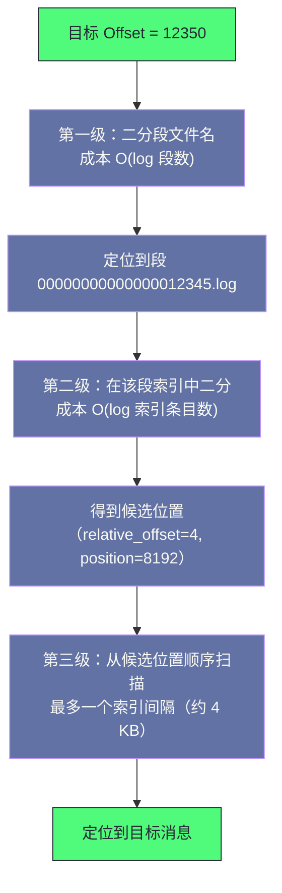

# 02 日志存储引擎——Segment、索引与零拷贝

**摘要：**

Kafka 能在普通机械硬盘上跑出很高的吞吐，这个事实常被归因于"顺序写"，但顺序写只是三个支点中的一个。本文按"为什么快 → 数据怎么放 → 怎么找到它 → 怎么发出去 → 怎么清理"的顺序展开。先说明磁盘性能的真实曲线，以及为什么"顺序访问"能比"随机访问内存"更快这个反直觉结论成立；再拆解 Page Cache 在写入与读取两条路径上的作用，以及"为什么不建议给 Kafka 大堆内存"这个配置建议的来源。然后逐层讲清物理结构：分区目录、日志段的三件套文件、以及"文件名即起始 Offset"这个设计如何让段定位退化为二分查找；日志段内部的批次格式与变长编码；以及稀疏索引（偏移量索引与时间戳索引）如何把消息定位的成本压到 O(log N) 级别。之后是零拷贝的两次拷贝路径与它的前提条件，日志保留与日志压实两种清理策略，以及存储层的调优要点。最后是这套存储引擎的边界与常见误判。

---

## 第 1 章 磁盘性能的真实曲线

### 1.1 随机写与顺序写的量级差

在很多工程师的直觉里，"写磁盘"等于"慢"。这个直觉来自数据库场景——B+ 树更新需要在任意位置修改页，属于**随机写**；机械硬盘完成一次随机写要经历寻道（毫秒级）与旋转等待，因此每秒只能完成几百次。

但这个直觉在"顺序写"的场景下完全不成立。顺序写时磁头不需要大幅移动，可以持续以很高的速率写入——**两者的差距不是几倍，而是两个数量级。**

| 访问方式 | 机械硬盘 | 固态硬盘 |
|---|---|---|
| 随机写（每秒次数） | 百次量级 | 万次量级 |
| 顺序写（吞吐） | 百 MB/s 量级 | GB/s 量级 |

Kafka 的日志写入恰好是天然的顺序写：**新消息永远追加到当前日志段的末尾，不修改任何已有内容。** 因此它从一开始就避开了随机写这条最慢的路径。

### 1.2 一个反直觉的结论

更进一步，有一项被广泛引用的研究给出了一个违反直觉的结论：**顺序访问磁盘的吞吐，可以超过随机访问内存的吞吐。**

原因有两层。**其一是预读**：操作系统在检测到顺序访问模式时，会主动预读后续数据，使得实际磁盘 IO 被批量提交，单次寻道成本被摊薄到大量数据上。**其二是随机访问内存并不快**：链表遍历、哈希表冲突探测这类操作的每次访问都可能触发缓存未命中，从内存取一次数据的延迟虽然远小于磁盘，但大量随机访问累积起来的开销并不可忽略。

这个结论的实践意义在于：**"用磁盘"本身不是性能劣势，"用错访问模式"才是。** 这也解释了为什么 Kafka 选择"追加日志"而不是"就地更新记录"——它不是在做性能妥协，而是在选择一条性能上更优的路径。

### 1.3 三个支点的分工

把"为什么快"拆开看，是三个各司其职的机制。

**顺序追加写**解决的是**写入侧**的磁盘代价——把随机写变成顺序写，写入不再受寻道限制。

**Page Cache**解决的是**读取侧**的磁盘代价——热数据直接从内存返回，磁盘只承担持久化职责。

**零拷贝**解决的是**传输侧**的 CPU 代价——数据从页缓存直接送到网络，跳过用户态的两次拷贝。

三者是**叠加**关系而不是替代关系。这也解释了为什么它们各自的失效条件都值得单独了解——**任何一个支点失效，整体吞吐都会明显下降，而下降的幅度取决于该支点原本承担了多少。**

### 1.4 为什么这个结论在"补数据"时会反转

把第 1.2 节那个反直觉结论放到"补数据"场景下，会发现它并不成立——**此时"用磁盘"确实是性能劣势。**

原因在于那个结论依赖"顺序访问"这个前提。补数据时的访问模式是"从某个较早的位置开始顺序读"，表面上看也是顺序的，但它有两个额外成本：**其一是这些数据不在页缓存中**（需要真正的磁盘读取），**其二是读取过程中会把大量冷数据塞进页缓存**，挤掉原本的热数据，从而影响实时消费的性能。

**后一个成本尤其容易被忽略**：一次大规模补数据不仅自己慢，还会**降低其他消费者的性能**——因为它污染了页缓存。这也是为什么"补数据任务应当限速"不是一句客套话，而是有明确机制支撑的要求。

**这条分析给出一个通用判断：任何"大规模读取历史数据"的操作，都会以两种方式影响系统——自身的读取成本，以及对共享缓存的污染。** 因此在评估这类操作时，要同时估算这两个影响。

### 1.5 为什么"批量"是高吞吐的通用手段

在进入具体机制之前，先点出一个贯穿全篇的共性：**Kafka 的存储层与生产端都大量使用"批量"来摊薄固定开销。**

存储层的批量体现在两处：**消息以批次为单位存储**（批次头部的公共字段只存一份），**日志段以较大的尺寸为单位组织**（减少文件数量与定位层级）。生产端的批量体现在一处：**消息以批次为单位发送**（摊薄网络往返）。

这三处批量的共同逻辑是：**任何操作都有"与数据量无关的固定开销"（文件头、批次头、网络往返、索引条目），把多份数据合并在一次操作里，就能把这个开销摊到多份数据上。** 批量的代价则是"等待"（要等攒够）与"粒度变粗"（清理与定位的最小单位变大）。

**理解了"批量摊薄固定开销"这条通用逻辑，就能理解本专栏里绝大多数参数的作用**——它们中的相当一部分，本质上都在回答"批量要多大、要等多久"。

---

## 第 2 章 Page Cache：性能的第一支点

### 2.1 写入路径：延迟由内存决定

应用调用写文件的系统调用时，数据并不是直接落到磁盘，而是**先写入内核的页缓存**（一块由操作系统管理的内存），由内核在后台异步地把"脏页"刷到磁盘。

这意味着**写入调用的延迟是内存级别的，而不是磁盘级别的**。对于 Kafka 而言，Broker 接收消息后追加到日志文件，这个动作的延迟主要由内存写入速度决定——磁盘的持久化在后台完成。

当然，"异步刷盘"带来一个必须面对的问题：**如果机器在脏页刷盘前断电，这部分数据就丢了。** 这也是为什么 Kafka 的可靠性不能只依赖"写入成功"——它需要副本机制（多个 Broker 各自持有一份）来保证，而不是依赖单机的持久化时机。**"用副本保证可靠性，而不是用同步刷盘"是分布式存储的通行做法**，因为它把可靠性从"单机硬件的可靠性"转移到了"多机冗余"上。

### 2.2 读取路径：热数据与冷数据的分野

读取路径的性能取决于数据是否还在页缓存里。

**热数据路径**（消费进度接近生产进度）：刚写入的消息还在页缓存中，消费者拉取时直接从内存返回，不触发任何磁盘 IO。**在实时消费的场景里，消息几乎完全通过页缓存传递，磁盘只是持久化的备份。**

**冷数据路径**（消费几天前的历史数据）：数据已经不在页缓存中，需要触发真正的磁盘读取；读到的数据会重新进入页缓存（可能挤掉其他数据）。

这两条路径的性能差距很大，而它带来一个重要的诊断启示：**当有人说"Kafka 变慢了"时，首先要问的是"是实时消费变慢了，还是补数据变慢了"。** 两者的根因完全不同——前者可能与生产端或消费端有关，后者几乎总是与页缓存容量或磁盘 IO 有关。

### 2.3 为什么"堆内存要小"

基于上面的机制，可以推导出一条看起来反直觉的配置建议：**不要给 Kafka 的 JVM 分配过大的堆内存。**

原因是**堆内存与页缓存共享同一批物理内存**。堆越大，留给操作系统的页缓存就越少，冷数据读取的性能就越差。因此把内存"留给应用"反而不如"留给操作系统"——因为 Kafka 的性能依赖页缓存，而不是依赖 JVM 堆。

这条建议也解释了一个部署约束：**Kafka 不适合与内存密集型应用（如流处理引擎的计算节点、大数据计算框架的工作节点）共部署在同一台机器上。** 那些进程的大内存会挤占页缓存，从而破坏 Kafka 的性能基础。**"专用机器"在这里不是奢侈要求，而是性能前提。**

### 2.4 页缓存的失效条件

页缓存不是永远有效的，它的失效条件有两条。

**条件一：访问模式不再集中。** 如第 2.2 节所述，"补数据"这类访问会绕过页缓存的优势。**这类场景下的正确预期是"按磁盘 IO 能力估算吞吐"，而不是按页缓存能力估算。**

**条件二：内存被其他进程占用。** 共部署、容器内存限制过紧、或机器上还有其他重负载进程时，页缓存会被压缩。**这类问题的表现是"同样的负载，性能时好时坏"**——因为页缓存的可用容量随其他进程的行为波动。

**这两条失效条件共同说明：页缓存的性能优势是"环境依赖"的，而不是"配置依赖"的。** 因此它比另外两个支点更脆弱——顺序写与零拷贝由代码逻辑保证，而页缓存依赖运行环境。

### 2.5 页缓存容量的估算方法

页缓存需要多大？这个问题没有标准答案，但有一个可操作的估算路径：**按"实时消费所需覆盖的数据量"估算。**

推导逻辑是：页缓存的作用是"让热数据留在内存里"。而"热数据"的范围由"生产与消费之间的时间差"决定——如果消费进度平均落后生产进度十分钟，那么需要被页缓存覆盖的就是这十分钟的数据量。**因此页缓存容量的下限是"峰值写入速率乘以允许的消费滞后时间"。**

这个估算有两个实践含义。**其一，写入速率高的集群需要更大的内存**（同样的滞后时间对应更多数据）。**其二，如果消费滞后长期很大，那么再大的页缓存也不够**——因为此时"热数据"的范围已经超出了内存容量，优化方向应当是提升消费能力，而不是加内存。

**这条估算路径的价值在于它把"该给多少内存"从经验问题变成了推导问题**——虽然推导结果仍是量级估算，但它至少指明了"内存需求由哪些变量决定"，从而让容量规划有了讨论的基础。

---

## 第 3 章 Partition 的物理结构

### 3.1 目录与文件三件套

每个分区在 Broker 的磁盘上对应一个目录，目录名由"主题名加分区号"构成。目录里存放该分区的日志段文件——**每个日志段由三个文件组成**：

```text
orders-0/
├── 00000000000000000000.log        消息数据文件
├── 00000000000000000000.index      偏移量稀疏索引
├── 00000000000000000000.timeindex  时间戳稀疏索引
├── 00000000000000012345.log        新的日志段（当前正在写入）
├── 00000000000000012345.index
├── 00000000000000012345.timeindex
└── leader-epoch-checkpoint         Leader 纪元检查点
```

三件套的分工是：**数据文件存消息内容**，**偏移量索引把"消息编号"映射到"文件位置"**，**时间戳索引把"时间"映射到"消息编号"**。

把这个结构与"日志本"的类比对应起来会更直观：数据文件是日志本的正文，偏移量索引是"目录页"（告诉你第 12345 条记录在本子的第几页），时间戳索引是"按日期查的索引"（告诉你某天开始的记录在哪一条）。

### 3.2 日志段的滚动

当前正在写入的日志段不会无限增长，满足以下任一条件时它会"滚动"——即创建一个新的日志段，后续消息写入新段：

- **大小超过阈值**（默认 1 GB）；
- **存在时间超过阈值**（默认 168 小时）；
- **索引文件超过大小上限**；
- **消息时间戳的跨度超过阈值**。

滚动之后，**旧段变为不可变的只读文件**。这个"只读"的性质很关键——它正是零拷贝的理想场景：内容不变，操作系统可以安全地缓存并直接传输，不需要担心"传输过程中数据被改"。

**滚动阈值的设置需要权衡两处**：段太大则清理粒度粗（删一个段会删掉很多数据，可能超出保留期的需要）；段太小则文件数量多（每个段都有索引与元数据开销，且定位时要多一层二分）。**默认的 1 GB 是在这两个方向之间的经验平衡点。**

### 3.3 "文件名即起始 Offset"

日志段的文件名是**该段第一条消息的 Offset**，补齐到固定长度。

这个设计看起来只是一个命名约定，但它带来一个重要的效率性质：**给定任意一个 Offset，可以通过对所有段文件名做二分查找，快速定位它属于哪个段。** 因为段是按 Offset 递增顺序排列的，文件名本身就可以作为排序键。

如果没有这个约定（例如用随机字符串命名），那么"定位某个 Offset 属于哪个段"就需要读取每个段的元数据来获取起始位置——**定位成本从 O(log N) 变成 O(N)**。

**这是一个"用命名约定换查询效率"的典型设计**：把"段的起始位置"这个信息编码进文件名，从而让操作系统层面的目录列举就变成了一次有序索引。**这类"把元数据编码进名字"的手法在存储系统里很常见**，因为它的成本为零（名字本来就要取），收益却是一层索引。

### 3.4 分区数对存储层的影响

把物理结构放大到集群规模看，分区数会以三种方式影响存储层。

**其一是文件数量。** 每个分区至少有"一个活跃段 + 若干历史段"，每段三个文件。因此"分区数 × 段数 × 3"就是单 Broker 需要维护的文件数量量级——分区数多时，这个数字会很快上升到需要关注的规模。

**其二是索引内存占用。** 索引文件虽小，但它是**按分区常驻映射的**（为了快速定位）。因此分区数决定了索引缓存的总量——这是"分区数不能无限增加"的一个具体来源。

**其三是清理与压实的开销。** 清理线程按分区遍历日志段，分区数越多，单轮清理的遍历成本越高；日志压实更是要逐分区扫描并重写。

**这三条共同说明：分区数是存储层的一个"乘数"**——它不直接决定性能，但它会放大其他所有开销。因此"分区数定多少"这个决策，需要同时考虑生产端（并行度）与存储端（开销乘数）两侧。

### 3.5 活跃段与只读段的差异

日志段有两种状态，它们的处理方式不同，这个差异值得单独说明。

**活跃段**是当前正在写入的那个段。它的特点是"内容会变"——因此**它不能用零拷贝传输**（零拷贝要求内容不可变），读它的数据需要经过常规的读取路径。这个性质带来一个实际后果：**消费最新消息（刚写入不久）与消费稍早消息的路径不完全相同**，前者可能落在活跃段上。

**只读段**是滚动之后的历史段。它的内容固定不变，因此**它是零拷贝的理想对象**。

这个差异解释了为什么"滚动频率"会影响性能：**段滚动得越频繁，活跃段就越小，落在活跃段上的消息比例就越低**，从而让更多读取走零拷贝路径。但滚动过于频繁又会增加文件数量（第 3.2 节讲的代价）。**因此段大小的调优，本质上是在"零拷贝覆盖率"与"文件数量"之间取平衡。**

---

## 第 4 章 日志文件的格式

### 4.1 批次而非单条

日志文件里存的不是"一条条独立的消息"，而是**批次**——生产者一次发送的一批消息在 Broker 侧作为一个整体追加。

批次的头部记录了这批消息的公共信息：**起始 Offset**（批次第一条消息的编号）、**批次长度**、**格式版本**、**压缩类型与时间戳类型**（标志位）、**批次内消息数量**、**时间戳范围**（第一条与最大时间戳）、以及**生产者 ID 与序列号**（用于幂等与事务）。

把这些信息提到批次级别而不是每条消息各自携带，直接降低了存储开销——**同一批次内的消息共享这些字段，相当于做了一次"公共前缀压缩"。**

### 4.2 变长编码与批次压缩

批次内的每条消息只记录**相对信息**：相对偏移（相对于批次起始 Offset 的差值）、时间戳增量（相对于批次基准时间戳的差值）、以及键值内容。

用相对值而不是绝对值，是因为**差值通常是小整数，可以用更少的字节表示**；而绝对值（尤其是 64 位的 Offset）需要固定 8 字节。这就是**变长编码**（Varint）的用途——小数值占少字节，大数值占多字节。

**压缩也发生在批次层面**：整个批次的记录部分被一起压缩，而不是逐条压缩。这个选择很重要——**相似内容的批量消息有更多可压缩的重复模式**，批次级压缩的压缩率明显高于逐条压缩。

需要强调的是：**Broker 不做解压与重压。** 生产者压缩后发送，Broker 校验完整性后原样存储，消费者拉取后自行解压。**这个"原样传输"的设计是零拷贝成立的前提**——一旦 Broker 需要解压再压缩，零拷贝就用不上了（第 6 章会展开）。

### 4.3 格式版本的意义

批次头部的"格式版本"字段看起来不起眼，但它是**格式演进的关键机制**。

当需要引入新字段（例如幂等生产者需要的序列号）时，新版本会扩展批次结构；Broker 与消费者根据版本号决定如何解析。**这样旧数据仍然可读，新数据可以使用新能力**——不需要一次性重写全部历史数据。

**这是所有持久化格式都必须具备的能力**：一旦数据被写下来，格式就被"冻结"了，因为已经写下的数据不会重写。因此格式设计的第一原则不是"信息完备"，而是"**为未来的扩展留出余地**"。Kafka 的批次格式经历过多次版本演进，每一次都保留了向后兼容性——**这个能力在长期运行的存储系统里，比任何单项优化都重要。**

### 4.4 格式演进对使用方的影响

格式版本虽然是内部机制，但它对使用方有两个实际影响。

**影响一：升级后的兼容性边界。** 新版本客户端可以读写旧格式数据（向下兼容），但旧版本客户端可能无法解析新格式。因此**集群升级时"先升级服务端还是先升级客户端"这个顺序需要确认**——这与所有分布式系统的升级纪律一致。

**影响二：格式转换的代价。** 如果确实需要把旧格式数据转换为新格式（例如为了使用新格式才有的特性），这个转换需要重写数据。**而重写数据会破坏顺序写的性质**（第 9.1 节的反例），因此它是一个有代价的操作，需要按"数据量除以可用吞吐"估算耗时。

**这两个影响的共同提示是：格式的演进是"单向且昂贵"的。** 因此"是否需要转换历史数据"应当在升级前评估清楚，而不是升级后才发现某些功能对旧数据不可用。

---

## 第 5 章 稀疏索引：把定位成本降到对数级

### 5.1 为什么索引是稀疏的

一个自然的想法是"为每条消息都建一条索引"。但这样做的后果是**索引文件与数据文件一样大**——既浪费存储，又浪费页缓存（索引本身也要占内存）。

Kafka 的选择是**稀疏索引**：不是每条消息都建索引，而是每隔一段数据量建一个索引条目（默认间隔约 4 KB）。于是索引文件只有数据文件的千分之一量级，**小到可以整个映射进内存**。

稀疏带来的代价是：定位到一个索引条目后，还需要从该位置顺序扫描一小段（最多约 4 KB）才能找到目标消息。**但这段扫描的代价可以忽略**——4 KB 恰好是一个内存页的大小，而顺序扫描几乎总是命中页缓存。

**稀疏索引的取舍可以概括为：用"最多扫一小段"的代价，换来"索引足够小、可以常驻内存"。** 这与本书其他系统里的块级索引（ZoneMap、BloomFilter）是同一类思路——**索引的价值不在于"精确定位"，而在于"把搜索范围缩小到可接受的量级"。**

### 5.2 索引条目的结构

每条索引条目是一个定长记录，包含两个字段：**相对偏移**（相对于段起始 Offset 的差值）与**物理位置**（对应消息在数据文件中的字节偏移）。

用相对偏移而不是绝对 Offset，同样是为了省空间——绝对 Offset 是 64 位整数，而段内的相对偏移是小整数，4 字节足够。**这与第 4.2 节的变长编码是同一个思路：用"相对量"替代"绝对量"来降低存储开销。**

### 5.3 三级定位的完整过程

给定一个目标 Offset，定位过程分三步。

**第一步：定位日志段。** 对所有段文件名（即各段的起始 Offset）做二分查找，找到"起始 Offset 不超过目标值的最大者"。这一步是纯内存操作（目录列举的结果可以缓存）。

**第二步：在索引中二分。** 把该段的索引文件映射进内存，对相对偏移做二分查找，找到"不超过目标相对偏移的最大条目"。这一步得到的是一个"候选位置"。

**第三步：在数据文件中顺序扫描。** 从候选位置的字节偏移开始，顺序读取批次并比对 Offset，直到找到目标消息。**这一步最多扫描约一个索引间隔的数据量。**

三步的复杂度分别是 O(log 段数)、O(log 索引条目数)、O(1)（有界的顺序扫描）。**整体是 O(log N) 级别**——这就是稀疏索引把定位成本压到的水平。

### 5.4 时间戳索引

除了"按 Offset 查位置"，还有一类查询是"**按时间查 Offset**"——例如"从两小时前的消息开始消费"。

时间戳索引为此而设，它的结构与偏移量索引类似，但存储的是"时间戳到相对偏移"的映射。使用方式是：先用时间戳索引把时间转换为 Offset，再用偏移量索引把 Offset 转换为物理位置。**两步串联，实现了"按时间定位消息"。**

这个能力的实践价值在于"**按时间回退消费位置**"：当发现消费逻辑有问题时，可以把消费位置回退到"问题发生前的时间点"重新处理。**它是"可重放"这个能力的具体入口之一**——而"可重放"正是 Kafka 相对传统队列的核心优势。

### 5.5 三级定位的图示与它的边界

把三级定位画出来，能更清楚地看出每一级的成本来源。



**这套定位机制有三处边界需要知道。**

**边界一：它只能按 Offset 或时间戳定位。** 无法"按 Key 查找"（除非开启日志压实并按 Key 扫描）——**这是"Kafka 不是数据库"这条判断在存储层的具体体现。**

**边界二：定位成本与"数据在不在页缓存"无关，但读取成本与之强相关。** 三级定位本身是内存操作（段文件名、索引都在内存），但**最后读取数据时是否命中页缓存，决定了实际延迟。** 因此"定位快"不等于"读取快"。

**边界三：索引间隔决定的是"扫描上限"，而不是"平均扫描量"。** 如果目标消息恰好紧跟在一个索引条目之后，扫描量接近于零；如果它在两个条目之间靠后的位置，扫描量接近一个间隔。**因此索引间隔的设置应当按"最坏情况"而不是"平均情况"来评估。**

---

## 第 6 章 零拷贝

### 6.1 传统路径的四次拷贝

先看不用零拷贝时，一个"把文件内容发送到网络"的动作要经历什么。

**第一步**：磁盘数据通过 DMA 拷贝到内核的页缓存。**第二步**：从页缓存拷贝到用户态缓冲区（这次拷贝由 CPU 执行）。**第三步**：从用户态缓冲区拷贝到内核的套接字缓冲区（又一次 CPU 拷贝）。**第四步**：从套接字缓冲区通过 DMA 拷贝到网卡。

四次拷贝里，**中间两次是 CPU 参与的**，而且伴随四次用户态与内核态的切换。对于"只是转发数据"的场景，这两次 CPU 拷贝是纯粹的浪费——**数据从头到尾没有被修改，却被迫在用户态绕了一圈。**

### 6.2 sendfile：把 CPU 拷贝降为零

操作系统提供了 `sendfile` 系统调用，允许直接把文件描述符的数据发送到网络套接字，**不经过用户态**。

数据路径因此变成：磁盘经 DMA 到页缓存；页缓存的内容直接经 DMA 送到网卡。**中间那次"页缓存到套接字缓冲"的动作，在支持分散聚集 DMA 的硬件上可以退化为"只传递地址与长度信息"，不再拷贝数据本身。**

结果是：**CPU 数据拷贝从两次降为零次，用户态与内核态的切换也大幅减少。**

Kafka 在 Java 层通过文件通道的 `transferTo` 调用底层实现。一个值得注意的现象是：**在 Kafka 处理消费者拉取的代码路径上，看不到"读取消息内容"的代码**——因为数据根本没有进入 JVM 堆内存，它从页缓存直接流向网络。**"看不到"本身就是这个机制生效的证据。**

### 6.3 前提条件：数据不能被修改

零拷贝有一个硬性前提：**数据在传输过程中不需要被修改。**

这个前提解释了一连串设计选择：**Broker 不解压消息**（压缩数据原样存储、原样发出，消费者自己解压）；**Broker 不转换格式**（消息以什么格式进来就以什么格式出去）；**Broker 不做内容过滤**（过滤需要读取内容，而读取内容意味着数据要进用户态）。

这些选择的共同表述是：**Broker 是"传输型"而非"处理型"的。** 它的职责是"把字节从磁盘搬到网络"，而不是"理解并加工这些字节"。

### 6.4 失效条件与它的代价

零拷贝的失效条件很明确：**一旦有处理需求，它就用不上。**

实践中常见的"处理需求"包括：在 Broker 侧做消息格式转换（把旧格式升级为新格式）、做内容级别的过滤（只转发满足条件的消息）、做字段级加密或脱敏。**这些需求都会让数据必须经过用户态，从而失去零拷贝带来的性能。**

因此当业务提出"能不能在 Kafka 侧做一点加工"时，正确的评估方式是：**这项加工会让消费者拉取的路径失去零拷贝，吞吐会下降到什么水平？** 多数情况下，正确的答案是"把加工放到消费端或独立的处理层去做"——因为 Broker 侧加工是**一个"用全局吞吐换取局部便利"的交易**，而它影响的往往是所有主题的所有消费者。

### 6.5 零拷贝在同类系统中的应用

零拷贝不是一个 Kafka 特有的技巧，它是所有"数据搬运型"系统的共同选择。理解它在别处的形态，有助于在跨系统排查时识别同类问题。

**文件服务器与对象存储网关**用零拷贝发送静态文件（数据不需要修改）；**数据库的备份与导出**用零拷贝把数据文件直接发送到网络或写入另一块磁盘；**日志采集与转发**用零拷贝把日志文件转出去。

反过来，**凡是"需要加工"的路径都用不上零拷贝**：消息转换、格式适配、内容过滤、字段加密——这些操作都必须让数据经过用户态。

**由此可以得到一条跨系统的判断：如果一条数据路径的性能不达预期，先问"它有没有被迫经过用户态"。** 这个判断适用于消息系统、存储系统、以及任何"搬运数据"的组件——**因为"用户态往返"是所有高吞吐路径的共同敌人。**

### 6.6 如何判断零拷贝是否生效

零拷贝生效与否，可以通过"系统调用层面的证据"来确认，而不是靠猜测。

**证据一：网络发送路径上的系统调用类型。** 如果数据是通过零拷贝发送的，那么在系统调用跟踪里会看到发送文件的调用（而不是"读文件 + 写套接字"这一对）。**这一对调用的存在与否，是零拷贝是否生效的直接证据。**

**证据二：CPU 使用率与吞吐的比值。** 零拷贝省下的是 CPU 拷贝，因此**它的效果会体现为"同样的吞吐下 CPU 更低"或"同样的 CPU 下吞吐更高"**。如果 CPU 占用与吞吐的关系偏离了基线，就值得怀疑零拷贝是否失效。

**证据三：内存拷贝相关的指标。** 如果数据确实经过了用户态，那么会看到额外的内存分配与拷贝行为——**这类行为在零拷贝路径上是完全不存在的。**

**三个证据里，第一个最直接，后两个用于交叉验证。** 它们的共同价值在于把"零拷贝是否生效"从一个"只能看代码推断"的问题，变成了"可以从运行态观测"的问题——**而可观测性正是排查性能问题的前提。**

---

## 第 7 章 日志保留与清理

### 7.1 两种保留策略

Kafka 的日志清理有两种策略，它们解决的问题不同。

**删除策略**（默认）：按时间或大小删除最老的日志段。按时间配置"保留多久"，按大小配置"最多占多少空间"。这是"消息系统"风格的策略——**数据有生命周期，过期即删。**

**压实策略**：不删除消息，而是对每个键保留最新的一条，删除同键的历史版本。这是"存储系统"风格的策略——**数据的价值在于"当前状态"，历史版本可以丢弃。**

两种策略可以在同一集群的不同主题上分别使用，因为它们服务的是两类不同的语义。

### 7.2 删除的粒度是日志段

一个容易被忽略的细节是：**删除的粒度是整个日志段，而不是单条消息。**

这意味着"删除"这个动作有天然的"粗粒度"：如果一个段里最老的消息已经超过保留期，但最新的消息还没有，这个段仍然不会被删除（要等整个段都过期）。**因此实际保留时间会比配置值略长，最长可能多出一个段的写入时间。**

这个"超时保留"在工程上通常可以接受，但它带来一个需要留意的后果：**如果段设置得很大而写入量很小，那么实际保留时间可能远超配置值**——因为一个段可能要很久才写满。**这也是"段大小要与写入速率匹配"这条建议的来源。**

### 7.3 日志压实

压实适用于"键值语义"的场景——例如把 Kafka 当作数据库变更日志的载体时，对每个主键只需要保留最新的状态。

压实由后台的清理线程执行：它扫描日志段，识别出每个键的最新版本，把保留的部分写入新的段，然后替换旧段。**这个过程会重写数据**，因此它消耗额外的磁盘 IO 与 CPU——这一点在评估开启压实的主题的写入性能时必须算进去。

压实带来一个重要的能力：**它让"最终状态"可以被长期保留，而不受"保留期"限制。** 因为压缩后的数据量取决于"键的数量"而不是"更新的次数"——**无论一个键被更新多少次，压实后只占一条记录的空间。** 这正是"状态可以由日志重建"这个能力在存储层面的支撑。

### 7.4 两种策略的选择

判断用哪种策略，可以问一个问题：**数据的价值在于"事件序列"还是"当前状态"？**

如果在于事件序列（用户行为、操作日志、审计记录），用删除策略——**每条事件都有独立价值，历史不能丢。**

如果在于当前状态（配置、用户资料、库存快照），用压实策略——**历史版本没有独立价值，只需保留最新。**

有一类场景需要两者结合：**既要有保留期限制（避免无限增长），又要对键去重。** 这种情况可以配置为"压实 + 删除"的组合策略——压实负责按键去重，删除负责清理真正过期的数据。**这个组合在"变更日志 + 有保留要求"的场景里很常见。**

### 7.5 清理的时间与成本

清理（无论是删除还是压实）都是**后台任务**，它的执行时机与成本需要被纳入运维考虑。

**删除的成本较低**——它本质上只是"删除文件"，不涉及数据读写。但它的触发是周期性的，因此"空间释放"会有延迟。

**压实的成本较高**——它要读取旧段、识别保留项、写入新段、替换旧段。这个过程的资源占用与"写入等量数据"相当，因此它会与正常写入争抢磁盘 IO。

**两者共同的运维要点是"错峰"**：清理与压实都应当在业务低峰期执行，或通过参数限制其资源占用。**这一点与 Doris 的 Compaction、JuiceFS 的 GC 是同一类问题——"后台维护任务与前台业务争抢资源"是存储系统的共性。**

还有一处细节值得留意：**压实后的数据仍然保持原有的 Offset。** 也就是说，压实不会"重新编号"——被删除的消息留下"空洞"，Offset 不再连续。**这一点对消费者是透明的**（消费者按 Offset 读取时会自动跳过空洞），但它意味着"压实后的 Offset 序列不能用来估算消息数量"。

---

## 第 8 章 存储层的调优要点

### 8.1 磁盘与磁盘组

存储层的第一项选择是磁盘。**机械硬盘并非不可用**——因为写入是顺序的，机械盘也能达到不错的吞吐；但它的随机读性能很差，因此"补数据"场景会明显受影响。**固态硬盘则消除了这个短板**，代价是成本与写入寿命。

**多块磁盘可以提高吞吐**：把不同分区的日志目录分布在不同的物理磁盘上，让写入并行落到多块盘。这也是为什么 Kafka 的日志目录配置支持多个路径——**它不只是为了容量，也是为了 IO 并行。**

### 8.2 文件系统与挂载参数

文件系统的选择会影响性能。实践中较常见的选择是 **XFS**（对大文件与并发写入友好）与 **ext4**（通用、稳定）。**两者都能用，差异不像"选错就不可用"那么大**，因此不必把它当作首要决策。

更值得关注的是**挂载参数**：关闭访问时间记录（因为 Kafka 不需要"最后访问时间"这个语义，而记录它会带来额外的写操作）、以及调整预读参数（顺序读场景下适当增大预读能提升吞吐）。

### 8.3 段大小与索引间隔

两个存储层的参数值得按负载调整。

**段大小**决定了清理粒度与文件数量。写入量大的主题可以适当调大（减少文件数、降低定位开销）；写入量小的主题应当调小（否则"超时保留"会很明显）。

**索引间隔**决定了"索引文件的密度"与"定位时的扫描量"。间隔越小，索引越大（占用更多页缓存）但扫描越少；间隔越大则相反。**默认值对多数场景够用，只有在"海量小消息"这类特殊负载下才需要调整**——因为小消息意味着同样的数据量有更多条，索引的定位精度要求更高。

### 8.4 存储层的健康指标

存储层的监控应当盯住四类指标。

**第一类：磁盘容量与增长趋势。** 它回答"还能撑多久"。**需要注意把它与"保留策略"对照**——如果容量增长快于保留策略的预期，说明要么写入量在增长，要么保留配置与预期不符。

**第二类：磁盘 IO 利用率与排队深度。** 它回答"磁盘是否是瓶颈"。**利用率高但吞吐低，通常说明访问模式退化成了随机**（补数据、压实、或磁盘碎片）。

**第三类：页缓存命中情况与内存使用。** 它回答"热数据是否还在内存里"。**这一类指标最容易被忽略**，因为操作系统层面没有直接的"页缓存命中率"指标——通常需要用间接方式推断（如对比磁盘读速率与消费速率）。

**第四类：日志段与文件数量。** 它回答"分区与段的配置是否合理"。**文件数量异常增长通常意味着段过小或分区过多。**

**四类指标的关系是"从容量到配置"逐层深入**：容量回答"够不够"，IO 回答"快不快"，内存回答"为什么快或慢"，文件数回答"配置是否合理"。**按这个顺序排查，就能从现象逐步逼近根因。**

---

## 第 9 章 边界与反例

### 9.1 反例一：把"顺序写"当成无条件成立

顺序写的前提是"只追加不修改"。**开启日志压实的主题会重写日志段**，因此它的写入成本高于纯追加的主题。把压实主题与普通主题放在一起评估写入吞吐，会得出错误结论。

### 9.2 反例二：用"实时消费"的性能预期去估算"补数据"

两者的性能差一个数量级。**用实时消费的吞吐去规划"历史数据回补"任务，会导致回补时间远超预期**——因为回补走的是真正的磁盘 IO。

### 9.3 反例三：与内存密集型应用共部署

页缓存被挤占，冷数据读取性能下降。**这类问题的表现是"延迟时好时坏"**，因为页缓存的可用容量随其他进程波动。

### 9.4 反例四：认为"删除策略会立即释放空间"

删除粒度是日志段，且删除是后台按周期执行的。**因此"改了保留期之后磁盘立刻下降"不会发生**——需要等清理线程执行、且需要整个段都过期。

### 9.5 反例五：在 Broker 侧做数据加工

任何 Broker 侧的处理都会牺牲零拷贝。**这类"便利"的代价由所有消费者共同承担**，因此在评估时必须按"全局影响"而不是"单个主题的便利"来权衡。

### 9.6 反例六：把段大小设得过大而写入量很小

结果就是第 7.2 节讲的"超时保留"——实际保留时间远超配置值，磁盘占用比预期高。**段大小应当与写入速率匹配，而不是照搬默认值。**

### 9.7 反例七：忽略索引文件的内存占用

索引文件虽然只有数据文件的千分之一，但**分区数很多时，索引总量的绝对规模仍不可忽略**。分区数多的集群需要为索引缓存预留内存——**这也是"分区数不能无限增加"这条约束的一个具体来源。**

### 9.8 反例八：把"压实"当成"免费的存储优化"

压实要重写日志段，因此它消耗磁盘 IO 与 CPU，且会与正常写入争抢资源。**在写入量大的主题上开启压实，等于给这个主题的写入成本加了一笔隐形的税。** 开启前应当评估"键的数量"与"更新频率"——如果更新频繁而键数量不大，压实的收益（省空间）会很显著；如果键数量本身就很大，压实的收益有限而成本固定。

### 9.9 反例九：用"保留期"估算磁盘容量而不考虑副本与索引

磁盘占用的实际构成是"**数据量 × 副本数 + 索引 + 段开销 + 未清理的过期数据**"。只按"保留期 × 写入速率"估算，会低估实际占用。**这类低估在集群运行一段时间后才会暴露**（因为过期数据要等清理周期），因此更难提前发现。

### 9.10 反例十：把"段滚动"当成纯粹的内部行为

段滚动会改变"活跃段与只读段的比例"，从而影响零拷贝的覆盖率（第 3.5 节）。因此滚动配置不是纯粹的内部参数——**它间接影响了消费最新消息与消费历史消息两条路径的性能比例。**

---

## 第 10 章 落点

回到开头的问题：Kafka 为什么能用磁盘跑出高吞吐？

答案是**三个支点叠加**：顺序写消除了写入侧的磁盘随机访问，页缓存消除了读取侧的磁盘访问，零拷贝消除了传输侧的 CPU 拷贝。而三者能够成立，依赖的是同一组设计选择——**只追加不修改、Broker 不处理数据、把内存留给操作系统。**

因此这套存储引擎的"性格"可以概括为：**它是一个极简的、只做追加与顺序读取的日志结构。** 它的性能来自"不做那些会破坏顺序性与零拷贝的事"，而不是来自任何复杂的优化技巧。

这也决定了它的边界：**凡是需要"就地修改"（重写日志段）、"随机读取"（绕过页缓存）、或"在传输路径上处理数据"（破坏零拷贝）的需求，都会触及它的性能底线。** 而日志压实、补数据、Broker 侧加工恰好分别对应这三类需求——**第 9 章的反例之所以成立，根源都在这里。**

再提炼一层：这套存储引擎的所有设计都可以归纳为"**把数据当成不可变的事实，然后围绕这个假设做极致的顺序化**"。不可变带来顺序写（因为不需要就地修改）；顺序写带来可预测的 IO（因为寻道成本被消除）；不可变又让零拷贝成立（因为传输中数据不需要改）。**"不可变"这一个前提，同时支撑了三个支点中的两个。**

这也是一个更普遍的规律：**存储系统的性能上限，往往由它对"数据是否可变"这个问题的回答决定。** 选择"不可变 + 追加"的系统（Kafka、LSM-Tree 类的存储引擎、对象存储）在写入上占优；选择"可变 + 就地更新"的系统（B+ 树类的数据库）在点查与更新上占优。**两者的差异不是实现质量，而是对数据可变性的根本取舍。** 因此在选型时，先问"这份数据主要是被写入还是被修改"，比比较吞吐数字更有指导意义。

下一篇转向生产端，看分区策略、确认级别与幂等性这三者如何共同决定"写入的可靠性与顺序性"。

---

## 专栏导航

- 上一篇：[[01 Kafka 全局架构——Broker、Topic、Partition 与消息流转]]。
- 下一篇：[[03 生产者——分区策略、acks 与幂等性]]。
- 消费者组：[[04 消费者与消费者组——Rebalance 机制深度剖析]]。
- 副本机制：[[05 副本机制——ISR、HW 与 Leader Epoch]]。
- 返回专栏首页：[[00 专栏导览]]。

---

## 参考资料

1. Apache Kafka. 官方文档：Log Compaction 与 Log Retention. https://kafka.apache.org/documentation/#compaction
2. Apache Kafka. 官方文档：Topic 级配置（log.segment.bytes、log.index.interval.bytes、log.retention.*）. https://kafka.apache.org/documentation/#topicconfigs
3. Kreps J. The Log: What every software engineer should know about real-time data's unifying abstraction. LinkedIn Engineering, 2013.
4. Jacobs A. The Pathologies of Big Data. ACM Queue, 2009（关于顺序磁盘访问与随机内存访问的对比）.
5. Linux man page: sendfile(2). https://man7.org/linux/man-pages/man2/sendfile.2.html
6. Brendan Gregg. Systems Performance: Enterprise and the Cloud. Addison-Wesley（关于页缓存与文件系统的章节）.
7. Narkhede N, Shapira G, Palino T. Kafka: The Definitive Guide, Chapter 5: Kafka Internals. O'Reilly.
8. Apache Kafka. 官方文档：Broker 配置（num.io.threads、num.network.threads、log.dirs）. https://kafka.apache.org/documentation/#brokerconfigs
9. Confluent. 关于 Kafka 性能调优的官方说明（磁盘、文件系统与页缓存）. https://docs.confluent.io/platform/current/kafka/deployment.html
10. Apache Kafka. 官方文档：消息格式与批次结构（RecordBatch 与格式版本演进）. https://kafka.apache.org/documentation/#messageformat

---

> [!note] 思考题
> 1. "顺序访问磁盘可以快于随机访问内存"这个结论的成立依赖哪两个条件？
> 2. 页缓存在"实时消费"与"补数据"两种场景下的作用完全不同。这个差异会如何影响容量规划？
> 3. 稀疏索引用"最多扫描一个索引间隔"的代价换来"索引可以常驻内存"。这个取舍在什么负载下会失衡？
> 4. 零拷贝的前提是"数据不被修改"。哪些看似合理的需求会破坏这个前提？
> 5. 日志压实会重写日志段。它给"写入吞吐评估"带来了什么影响？
