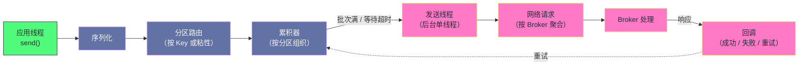

# 03 生产者——分区策略、acks 与幂等性

**摘要：**

生产端要回答三个问题：**消息发到哪个分区**（决定负载均衡与顺序性）、**什么时候算写入成功**（决定可靠性与吞吐）、**重试会不会造成重复**（决定语义的精确程度）。本文按这三条线展开。第一条线讲分区策略的演进：从轮询到粘性，动机是"批量效率"；从粘性到哈希，动机是"同 Key 有序"；以及哈希分区带来的数据倾斜问题与三种缓解手段。第二条线讲确认级别：三档语义各自的失效场景，以及"最强配置必须与最小同步副本数配合"这条容易被忽略的组合约束。第三条线讲重试与重复：幂等生产者如何用"生产者标识加序列号"把重试变成幂等操作，以及它在"跨会话"与"跨分区"两个方向上的边界——跨越这两个边界需要事务。之后讲事务的两阶段提交、事务标记与读隔离、以及僵尸隔离机制。最后是生产端的调优旋钮、排障路径与常见误用。全文的核心判断是：**生产端的可靠性不是一个参数决定的，而是由分区策略、确认级别、重试配置与幂等开关共同构成的组合。**

---

## 第 1 章 生产端的三个问题

### 1.1 发到哪：分区策略

生产者拿到一条消息后，第一个决策是"把它发到哪个分区"。

这个决策同时影响三件事：**负载是否均衡**（消息在各分区之间分布是否均匀）、**顺序是否可保证**（需要有序的消息是否落在同一分区）、以及**批量效率**（同一分区的消息能否攒成一个较大的批次）。

三者之间存在冲突。**要保证同 Key 有序，就必须让同 Key 的消息落在同一分区——而这在 Key 分布不均时会造成倾斜。** 要追求批量效率，就应该让消息尽量集中在少数分区——而这与负载均衡冲突。**因此分区策略的选择，本质上是在这三个目标之间选一个侧重。**

### 1.2 何时算成功：确认级别

第二个决策是"Broker 在什么条件下返回成功"。这个决策直接决定了可靠性的下限。

它的三个档位（不等确认、等主副本确认、等所有同步副本确认）对应三种失效场景：**不等确认时，网络中断可能导致消息根本没到达；等主副本确认时，主副本在副本同步前失效会丢这条消息；等所有同步副本确认时，写入延迟取决于最慢的那个副本。**

这里有一个关键点：**"最强档"的有效性依赖于另一个参数。** 如果同步副本集合因为副本掉队而收缩到只剩主副本，那么"等所有同步副本确认"就退化为"等主副本确认"——表面上用了最强配置，实际保护已经失效。**因此可靠性配置必须成对理解，而不是单看一个参数。**

### 1.3 重试会不会重复：幂等性

第三个决策是"发送失败后重试，会不会造成重复写入"。

这个问题看起来是"网络问题"，实质上是**语义问题**：如果 Broker 已经写入成功、只是确认响应在返回途中丢失了，那么生产者无法区分"真的失败"与"确认丢了"。它的重试会造成同一条消息被写入两次。

在缺少内置机制时，这个问题的解法只有两个：**接受"至少一次"语义**（允许重复，由消费端去重），或者**在业务层实现幂等**（如数据库唯一键）。前者把责任推给了下游，后者把责任推给了每个业务实现。**幂等生产者与事务 API 的价值，就是把这份责任收回到 Kafka 内部。**

> [!info] 核心概念
> 生产端的三个问题不是并列关系，而是**层层递进**：分区策略决定"消息去哪"，确认级别决定"何时算成功"，幂等性决定"失败重试是否安全"。三者的共同产物就是"写入语义"——**而写入语义与消费语义（第 7 章的"至多一次/至少一次/精确一次"）共同决定了端到端的数据保证。** 只优化其中一端，无法得到端到端的精确一次。

### 1.4 三个问题与"三档语义"的对应

把生产端的三个问题与第 1 篇讲的"三档消费语义"放在一起看，会发现它们的组合方式很有规律。

**要得到"至多一次"**：生产端任意配置（因为至多一次允许丢），消费端"先提交再处理"。

**要得到"至少一次"**：生产端至少配到"等主副本确认"（否则可能丢），消费端"先处理再提交"，并且**消费端必须幂等**（因为会重复）。

**要得到"精确一次"**：生产端启用幂等（消除重试重复），消费端使用事务（把"结果写入"与"进度提交"原子化）。

**这张对应表的价值在于它把"语义"从一个模糊的标签变成了"两端各需要什么配置"的清单。** 实践中大量"我们以为是精确一次但实际是至少一次"的问题，根源都在于**只配了其中一端**——例如生产端启用了幂等，但消费端仍是自动提交，那么整体语义仍是至少一次。

---

## 第 2 章 发送流水线

### 2.1 应用线程与 IO 线程分离

调用发送接口之后，消息并不会立即进入网络。它经历一条明确的流水线：**序列化 → 分区路由 → 写入累积器 → 由独立的发送线程批量取出并发送 → 接收响应并触发回调。**

这条流水线的核心设计是**"应用线程与 IO 线程分离"**：应用线程只做"序列化 + 选分区 + 放入内存缓冲"这些不涉及网络的操作；真正的网络发送由一个后台线程负责。

这个分离带来一个直接好处：**发送调用几乎不阻塞**（它只是内存操作），因此应用线程不会因为网络延迟而被挂起。**对于高吞吐的生产场景，这是必需的**——否则每条消息的发送都要等待一次网络往返，吞吐会被延迟直接限制。

### 2.2 累积器的结构

累积器是按分区组织的内存缓冲：每个分区对应一个待发送批次的队列，队列末尾是"当前正在填充"的批次。消息被追加到对应分区的当前批次里。

这个结构有一个实践含义：**累积器是"按分区"组织的，因此不同分区的消息互不干扰。** 一个分区发送慢（例如它的主副本负载高）不会阻塞其他分区的发送——**这是分区机制在生产端的体现**，也是"多分区能提升写入吞吐"的机制来源。

累积器的总容量有上限，达到上限时发送调用会阻塞等待。**这个设计是必要的**——否则生产速度持续超过发送速度时，内存会被无限占用。**它的代价是"生产端会把压力反馈给应用"**（阻塞或超时抛错），而这恰恰是期望的行为：**让压力显式暴露，而不是静默地耗尽内存。**

### 2.3 两个触发条件

一个批次被发送的触发条件有两个：**批次达到指定大小**，或者**等待时间超过指定阈值**。

- **批次大小**决定了"一次网络请求最多携带多少数据"。调大它能提升吞吐（单次请求摊薄更多固定开销），但会占用更多内存。
- **等待时间**决定了"最多等多久"。设为 0 表示不等待（延迟最低但批量效果最差）；设为一个较小的值（几毫秒）能在延迟增加有限的前提下显著提升吞吐。

**这两个参数的组合决定了"吞吐与延迟的平衡点"。** 实践中的常见做法是把等待时间设为一个较小的正值——因为**多数场景对"几毫秒的额外延迟"不敏感，但对吞吐敏感**。只有对延迟极度敏感的场景（如交互式链路）才值得保持"不等待"。

### 2.4 背压：从"生产快于发送"说起

当消息产生速度持续超过发送速度时，累积器会被填满。此时发送调用会阻塞（最长到配置的超时时间），超时后抛错。

这个机制在系统设计里叫**背压**（back pressure）——**下游处理不过来时，把压力传导回上游，让上游减速或感知失败。**

背压是分布式系统的必要机制，因为"上游永远比下游快"是常态。没有背压的系统，压力会以"内存增长"的形式积累，最终以"内存溢出"的形式爆发——**而那时的问题已经比"发送阻塞"严重得多。** 因此"发送调用会阻塞"不是缺陷，而是**把不可控的崩溃转化成了可控的减速**。

需要留意的是背压的传导方向：**如果上游无法减速**（例如它是一条不可暂停的数据采集链路），那么背压就会变成"发送超时抛错"，进而变成"数据丢失"（如果上游丢弃失败的消息）。**因此在设计生产端时，必须明确"背压时上游如何响应"**——是减速、是缓冲到本地、还是丢弃。**这个决策比任何参数调优都重要。**

### 2.5 流水线的图示与它的观测点

把发送流水线画出来，能更清楚地看出每一段的可观测点。

**这条流水线有三个关键观测点。** 其一是**累积器水位**（回答"背压是否临近"）；其二是**批次大小分布**（回答"批量配置是否合理"）；其三是**重试率**（回答"集群侧是否有问题"）。

三者的关系是：**累积器水位高说明生产快于发送；批次偏小说明等待时间不足或生产速率低；重试率上升说明发送路径上有失败。** 因此排查生产端问题时，**先看水位判断"是否已经饱和"，再看批次判断"效率是否有优化空间"，最后看重试判断"是否有故障"**——这个顺序避免了在饱和状态下做无效的参数调优。

### 2.6 序列化与消息大小的影响

流水线的第一环是序列化，它常常被当作"与性能无关的细节"，但实际上它有两处实际影响。

**影响一：序列化的 CPU 开销。** 在高吞吐场景下，序列化是每条消息都要执行的 CPU 工作。**如果序列化实现低效（例如反射式的通用序列化），它会成为生产端的 CPU 瓶颈**——表现为"发送速率上不去但网络与 Broker 都不忙"。

**影响二：消息大小直接决定批量效率。** 批次有大小上限，因此**消息越大，一个批次能装的消息越少**。在同样的批次配置下，大消息的批量效果天然更差——**这意味着"调大批次上限"对大数据量消息的效果有限，而"减少不必要的字段"可能更有效。**

**两处影响的共同提示是：消息格式的设计是生产端性能的一部分，而不是"业务层的事"。** 实践中常见的情况是：团队在参数上调来调去收效甚微，而实际上把消息里的冗余字段精简掉，或者换一个更紧凑的序列化格式，效果立竿见影。

---

## 第 3 章 分区策略

### 3.1 轮询策略与它的批量问题

最早的默认策略是**轮询**：消息依次分配到各分区。

这个策略保证了均匀分布，但它有一个副作用：**连续发送的多条消息会落到不同分区，因此每个分区的批次都攒不满。** 结果是"单次网络请求携带的消息很少"，批量效率很差。

**这是一个"看似公平却效率低"的设计**——它在"负载均衡"这个目标上做得很好，却牺牲了"批量效率"。而批量效率对吞吐的影响远大于负载均衡的精细程度。

### 3.2 粘性分区：为批量效率而生的修正

较新的版本引入了**粘性分区**：在一段时间内，把消息集中发往同一个分区；当该分区的批次攒满或等待超时后，再随机换一个分区。

这个策略同时满足了两个目标：**短期内消息集中在一个分区**（批次容易攒满，批量效率高）；**长期来看消息仍然均匀分布**（因为换分区的选择是随机的）。

**粘性分区是"把时间维度引入负载均衡"的一个例子**：不是"每条消息都追求均匀"，而是"每个时间段内集中、时间段之间轮换"。**这个思路在很多系统里都有应用**——例如 Doris 的写缓冲把多条小写攒成一个批次、JuiceFS 把多次小写攒成一个对象，本质上都是"用短期的集中换取批量的效率"。

### 3.3 哈希分区：顺序性的唯一保证

当消息带有 Key 时，策略变为**哈希分区**：对 Key 做哈希后取模，决定目标分区。

这个策略的意义是**唯一能保证"同 Key 有序"的方式**——因为相同 Key 总是落到同一分区，而分区内是有序的。**反过来，只要消息跨分区，就谈不上顺序保证**（第 1 篇讲的"有序性边界在分区"）。

由此得到一条设计纪律：**"需要有序"这个需求必须被翻译成"用什么作为 Key"。** 例如"同一订单的操作必须有序"，对应"用订单号作为 Key"；"同一设备的上报必须有序"，对应"用设备号作为 Key"。**如果业务说不清"按什么有序"，那么它就还没有确定分区键。**

### 3.4 数据倾斜：哈希分区的固有代价

哈希分区的前提是"Key 分布均匀"。当这个前提不成立时（热门商品、大客户、活跃用户），对应分区会成为热点——**该分区的主副本承担了远超平均的写入，消费该分区的消费者也远比其他消费者繁忙。**

倾斜有三处危害：**写入侧**（热点分区的 Broker 成为瓶颈，整体吞吐被它限制）；**存储侧**（热点分区的数据量与日志段数量远超其他）；**消费侧**（消费该分区的消费者滞后增长，而其他消费者空闲）。

缓解手段有三种，各有代价。

**手段一：给 Key 加随机后缀。** 把"用户 A"的消息打散到多个分区（如 `用户A#0`、`用户A#1`）。**代价是失去该 Key 的全局有序**——它变成了"按分片有序"。适用于"同一实体的操作之间没有严格先后依赖"的场景。

**手段二：自定义分区策略做更均匀的映射。** 例如对已知的热点 Key 做特殊处理（单独分配或进一步打散）。**代价是需要维护一份"热点清单"**，而热点会随时间变化。

**手段三：在业务层预先聚合。** 把同一 Key 的多条消息在发送前合并成一条（例如把"加 1"操作合并成"加 N"）。**代价是引入了发送侧的缓冲与延迟。**

**三种手段的共同特征是"用顺序性或延迟换取均匀性"。** 因此缓解倾斜的第一步不是选手段，而是**确认"这个 Key 的顺序性要求到底有多强"**——如果业务实际上只需要"最终一致"而不需要"严格有序"，那么加随机后缀是成本最低的选择。

### 3.5 自定义分区策略

当内置策略都不适用时，可以实现自定义的分区逻辑。常见的场景包括：**按业务规则路由**（如把 VIP 用户的消息路由到专用分区以便优先处理）；**按地理区域路由**（便于区域化的消费与存储）；**实现特定的均衡算法**（如一致性哈希，以减少分区数变化时的影响）。

自定义分区需要留意两处约束：**一是"分区数变化时行为是否合理"**（如果算法依赖分区数取模，那么分区数变化会打乱原有映射）；**二是"是否会破坏顺序保证"**（如果自定义逻辑把同一 Key 的消息分到了不同分区，那就失去了有序性）。**这两处约束是自定义分区最容易出错的地方。**

### 3.6 分区策略的选择清单

把上述分析收敛成一份选择清单，按顺序回答四个问题。

**问题一：消息是否带 Key？** 不带 Key 时用粘性策略（追求批量效率），带 Key 时进入下一个问题。

**问题二：Key 的分布是否均匀？** 均匀则用哈希策略（既保证有序又保证均衡）；不均匀则进入下一个问题。

**问题三：该 Key 是否真的需要严格有序？** 需要则接受倾斜（或者拆 Key），不需要则加随机后缀打散。**这一步是最容易答错的——很多团队默认"带 Key 就要严格有序"，而实际上业务只要求"最终状态正确"。**

**问题四：内置策略是否够用？** 不够用则自定义，但要注意"分区数变化"与"顺序保证"两处约束。

**这份清单的价值在于它把"选分区策略"从"凭经验"变成了"按顺序回答四个问题"。** 而其中第三问最关键——**它要求业务方明确"顺序性要求的强度"，而不是笼统地说"要保序"。**

---

## 第 4 章 确认级别与可靠性

### 4.1 三档语义与各自的失效场景

| 档位 | 语义 | 失效场景 |
|---|---|---|
| 0 | 发出去即认为成功 | 网络中断时消息可能未到达 |
| 1 | 等主副本写入本地日志 | 主副本在副本同步前失效会丢这条消息 |
| 所有同步副本 | 等同步副本集合全部写入 | 延迟取决于最慢的同步副本 |

三档的取舍是"可靠性换延迟"的直接体现。**需要强调的是，第二档与第三档的差异只在"主副本失效"这一种场景下体现**——如果集群没有发生主副本失效，两者的结果完全相同。因此"要不要用最强档"取决于**"主副本失效的概率乘以其后果"是否可接受**，而不是"越强越好"。

### 4.2 最强组合与它的前提

生产环境中最常见的高可靠配置是"**等待所有同步副本确认 + 最小同步副本数设为 2 + 副本数为 3**"。

这个组合的语义是：**写入必须被至少两个副本确认；如果同步副本集合不足两个，则拒绝写入而不是降级。**

第三项（拒绝而不是降级）是关键。**它把"静默丢数据"变成了"显式报错"**——当副本不足时，生产者会收到错误。**在数据可靠性上，"报错"永远优于"静默降级"**，因为前者可以被监控与重试，后者只会在一段时间后表现为"数据少了"。

### 4.3 同步副本集合收缩：最容易被忽略的退化

如第 1.2 节所述，"等待所有同步副本"在集合收缩时会退化。这个退化发生的条件是**副本落后超过阈值被移出集合**——原因可能是副本所在节点负载高、网络抖动、或磁盘慢。

**这个退化的危险在于"它不报错"。** 如果配置里没有设"最小同步副本数"，那么集合收缩后写入仍然成功——只是保护级别从"两个副本"降到了"一个副本"。**而运维侧看到的指标（写入成功率、延迟）可能完全正常。**

因此有一条重要的运维纪律：**必须监控同步副本集合的大小**，并在它低于预期时告警。**"写入成功率正常"不等于"可靠性配置生效"**——这两件事需要分别验证。

### 4.4 可靠性与吞吐的取舍

三档配置对吞吐的影响，本质上来自"等待几个副本确认"。**副本数越多、确认要求越严，写入延迟越高，因此在同样的并发下吞吐越低。**

但这里有一个容易被误判的地方：**在高并发场景下，提高确认级别的吞吐损失可能远小于直觉。** 因为写入是批量并发的——单个批次等待更久，但多个批次可以同时在途。**吞吐的损失取决于"在途请求数"能否填补"单请求延迟上升"带来的空缺。**

因此"为了吞吐而降低可靠性"这个决策，应当基于实测而不是直觉。**实践中常见的情况是：把确认级别从"主副本"提到"所有同步副本"，吞吐只下降百分之几十，而可靠性提升是数量级的。** 这类交易通常是划算的——**但前提是集群的副本同步能力足够，否则延迟会大幅上升。**

### 4.5 验证可靠性配置是否生效

可靠性配置有一个特点：**它在正常运行时"看起来都正常"**，只有故障发生时才体现差异。因此不能等故障来验证，必须主动验证。

三条可操作的验证手段如下。

**手段一：确认同步副本集合的规模。** 如果它长期等于副本数，说明副本同步健康、可靠性配置生效；如果它经常小于副本数，说明有副本持续掉队——**此时"等待所有同步副本"的保护级别实际上已经下降。**

**手段二：确认写入在副本不足时会被拒绝。** 可以通过人为暂停一个副本（在测试环境）来验证：如果写入仍然成功，说明"最小同步副本数"没有生效或设置过小。

**手段三：观察重试率与错误率。** 如果"副本不足"这类错误从未出现过，可能是好消息（集群健康），也可能是坏消息（**配置没有生效，因此永远不会报这个错**）。**区分这两者需要结合前两项验证。**

**三项手段的共同思路是"主动构造或观察那些只在异常时才出现的信号"。** 这与"备份必须验证可恢复"是同一条原则——**没有验证过的保护机制，不能算作保护机制。**

---

## 第 5 章 幂等生产者

### 5.1 问题定义：Broker 无法区分首次与重试

生产者重试会导致重复，根源是**Broker 无法区分"这是第一次发送"与"这是重试发送"**——两次请求的内容完全相同，Broker 没有依据判断。

要解决这个问题，必须给每次发送一个**可识别的标识**，并让 Broker 记录"已处理过哪些标识"。**这就是幂等生产者的基本思路。**

### 5.2 生产者标识与序列号

幂等生产者用两个标识实现去重：**生产者标识**（生产者实例启动时向集群申请的唯一编号）与**序列号**（生产者对每个分区维护的、单调递增的计数）。

每条发送请求携带"生产者标识 + 分区 + 序列号"这个三元组。Broker 为每个"生产者标识加分区"的组合维护一个期望序列号，收到请求时比对：

- **序列号等于期望值**：接受写入，期望值加一；
- **序列号小于期望值**：判定为重复请求，返回成功但不写入；
- **序列号大于期望值加一**：判定为乱序（可能有消息丢失），返回错误。

这个机制同时提供了两个能力：**去重**（重试请求的序列号小于期望值，被识别并忽略）与**乱序检测**（序列号跳跃说明中间有消息丢失，显式报错）。**后者常被忽略，但它同样重要**——它保证"消息不会静默丢失"。

### 5.3 启用幂等带来的配置联动

启用幂等不是一个孤立的开关，它会**强制若干配置取值**：确认级别被提升为"所有同步副本"、重试次数被设为极大值、以及在途请求数被限制在一个较小范围内。

这些联动不是任意的——**它们是幂等语义的前提条件**。例如"在途请求数受限"是为了避免"多个批次同时发送导致序列号乱序"；"确认级别提升"是因为"如果只等主副本确认，那么主副本失效后新主副本可能缺少这条消息，序列号状态就会错乱"。

**Kafka 在启动时会校验这些配置的一致性**，不满足时直接报错。**这个"启动即校验"的设计值得肯定**——它把配置错误暴露在启动阶段，而不是运行阶段。**与之对比，很多系统的配置错误要到特定负载下才显现**，排查成本高得多。

### 5.4 幂等性的两个边界

幂等生产者的保证范围有两个明确的边界。

**边界一：不跨生产者会话。** 生产者标识在重启后会变化，新会话对 Broker 来说是全新的生产者，无法识别旧会话的重复。**因此"生产者重启"这个动作会让幂等保护失效。**

**边界二：不跨分区。** 序列号是按分区维护的，因此幂等性只在分区内成立。**"向多个分区写入并且要么全成功要么全失败"这个需求，幂等性无法满足。**

**跨越这两个边界需要事务**——这正是下一章的主题。理解这两个边界，就能理解"什么时候必须用事务"：**当需要"跨会话的幂等"或"跨分区的原子性"时。** 反过来，如果业务场景不涉及这两者（例如"单生产者实例、写入单主题"的常规链路），那么幂等性已经足够，不需要引入事务的复杂度。

### 5.5 幂等与重试配置的配合

幂等性不是"打开开关就完事"，它与重试配置存在配合关系。

**前提一：重试次数必须足够大。** 如果重试次数被设得很小，那么在短暂故障时消息会直接失败——**此时幂等性没有机会发挥作用**（因为它只在"重试发生"时才有意义）。因此启用幂等时，重试次数会被自动设为极大值。

**前提二：在途请求数必须受限。** 如果有多个批次同时在途，它们的序列号可能乱序到达——而 Broker 会把"序列号跳跃"判定为消息丢失并报错。**因此启用幂等时会限制在途请求数**，以避免这种"假丢失"。

**前提三：确认级别必须够高。** 如果只等主副本确认，那么主副本失效后新主副本可能缺少某些消息，序列号状态就会与实际日志不一致。**因此启用幂等时会强制提升确认级别。**

**三条前提的共同特征是"幂等性依赖于一组更严格的配置"**——这也是为什么它的启用会自动调整这些配置，并在启动时校验。**理解这层依赖关系，就能理解"为什么不能只要幂等而不要那些配置"**：它们不是可选项，而是幂等语义的组成部分。

### 5.6 幂等的实现代价

幂等性也有代价，主要体现在两处。

**代价一：Broker 需要为每个"生产者加分区"维护序列号状态。** 这是一个额外的状态表，它的规模与"生产者实例数乘以分区数"相关。**因此大量短生命周期的生产者（如频繁创建与销毁的客户端）会让这个状态表频繁变动**，带来额外的管理开销。

**代价二：限制在途请求数会略微降低并发。** 这是幂等语义的要求（避免序列号乱序），因此它是"用一点并发换取去重保证"。

**两处代价都不大，但它们的共同含义是：幂等不是"零成本的正确性开关"。** 不过在绝大多数场景下，这个成本相对于"消除重复"的收益是微不足道的——**因此"默认启用幂等"是合理的工程选择。**

---

## 第 6 章 事务：跨越幂等性的边界

### 6.1 使用场景：流处理中的精确一次

事务最典型的场景是**流处理中的精确一次**：从上游主题消费消息、处理后写入下游主题、并提交消费进度。这三个动作（写下游 + 提交进度）必须原子完成——否则会出现"处理了但没提交进度"（重启后重复处理）或"提交了进度但结果没写出"（数据丢失）。

**这个场景的共同特征是"两个需要原子化的动作跨越了不同的存储位置"**（一个在输出主题、一个在消费进度主题）。因此它无法用幂等性解决（幂等性只在分区内生效），必须用事务。

### 6.2 两阶段提交与事务协调者

Kafka 的事务基于两阶段提交，由一个**事务协调者**负责推进。

**第一阶段（准备）**：生产者调用提交时，向协调者发送结束事务的请求。协调者把"准备提交"这个状态持久化到内部主题。**这一步的持久化很关键**——它保证协调者即使宕机重启，也能继续推进这个事务，不会卡在中间态。

**第二阶段（提交）**：协调者向所有参与该事务的分区的主副本发送"写入事务标记"的请求，标记该事务为已提交。

**这个两阶段结构与其他系统的分布式事务是同一套思路**：先把"决定"持久化下来，再执行"决定"。**它的价值在于"决定"一旦落定就不会丢失**，因此不会出现"部分参与者提交、部分回滚"的状态。

### 6.3 事务标记与读隔离

事务内的消息写入后，**它们对消费者是否可见取决于消费者的读隔离级别**。

- **读已提交**：消费者只看到已提交事务的消息。未提交事务的消息虽然写在日志里，但对它不可见。
- **读未提交**：消费者能看到所有已写入的消息，不管事务是否提交。

**这个机制与第 1 篇讲的"高水位划定可见性边界"是同一类设计**——都是用"某种标记"来划分"可见"与"不可见"。区别在于高水位划的是"副本是否同步"，事务标记划的是"事务是否提交"。

**两者叠加的结果是：一条消息对消费者可见，需要同时满足"已被同步副本确认"与"所属事务已提交"两个条件。** 这也解释了为什么事务会带来额外的延迟——**它增加了可见性的条件，因此增加了等待。**

### 6.4 僵尸隔离

事务机制必须处理一个棘手的情况：**生产者实例在事务中途失效，但它的进程可能仍然存活**（例如网络分区导致它无法与协调者通信，但它自己并不知道）。此时如果它继续尝试提交旧事务，就会与新启动的实例产生冲突。

Kafka 用**事务标识 + 生产者纪元**来解决：事务标识是一个用户配置的、跨重启稳定的字符串；每次新实例用同一标识注册时，协调者会递增纪元。**当旧实例（低纪元）再发出请求时，协调者识别出它的纪元已过期，返回"已被隔离"的错误**——旧实例因此无法继续操作。

**这个机制解决的是"脑裂"类问题**：两个实例都认为自己有权操作同一个事务。它的解法不是"让旧实例停下来"（做不到，它可能已经失联），而是"让它的请求被拒绝"。**这是分布式系统处理"不可达节点"的标准手法——不是去停止它，而是让它的输出无效。**

### 6.5 事务的性能代价

事务不是免费的，它的代价落在三处。

**代价一：可见性条件增加。** 如第 6.3 节所述，事务内的消息需要"事务标记已写入"才可见。因此**从消息写入到对消费者可见，多了一道等待**。

**代价二：协调开销。** 每个事务都要与协调者交互（开始、提交或回滚），协调者还要把状态持久化。**因此事务的"每次提交"都有额外的往返与写入。**

**代价三：消费者的读隔离开销。** 使用"读已提交"的消费者需要跟踪事务状态，判断哪些消息可见。**这会给消费端带来额外的状态管理成本。**

**三处代价的共同含义是：事务应当用于"确实需要跨分区原子性"的场景，而不是"为了保险起见全都用"。** 对"写入单个主题"的场景，幂等性已经能消除重试重复，不需要事务。

### 6.6 事务机制的通用性

把 Kafka 的事务放在更宽的视野里看，它与数据库的分布式事务、与流处理框架的端到端一致性机制，共享同一套骨架。

**共同骨架是"两阶段 + 协调者 + 显式标记"**：先把决定持久化（准备阶段），再让所有参与者执行（提交阶段），并用一个显式标记让读取方知道"哪些数据已经生效"。

**不同之处在"参与者是什么"**：数据库事务的参与者是多个数据库；Kafka 事务的参与者是多个分区（以及消费进度）；流处理框架的端到端一致性则是把"外部系统的写入"与"框架自身的检查点"绑定。

**理解这个共性有一个实际好处：跨系统排查时，可以先问"它的两阶段分别是什么、协调者是谁、可见性标记是什么"。** 这三个问题能快速建立对任何"端到端一致性机制"的理解框架——**而不必逐条记忆每个系统的实现细节。**

---

## 第 7 章 生产端的调优与排障

### 7.1 吞吐与延迟的三个旋钮

生产端影响吞吐与延迟的旋钮主要有三个：**批次大小**（一次请求携带多少数据）、**等待时间**（最多等多久攒批）、以及**在途请求数**（同时有多少请求在飞）。

三者的作用机制不同。**批次大小决定"单次请求的效率上限"**（批次越大，固定开销摊得越薄）；**等待时间决定"批次能否攒满"**（时间太短则批次常为空）；**在途请求数决定"并发度"**（在延迟不变的前提下，并发越高吞吐越高）。

三者的调优顺序通常是：**先调等待时间让批次能攒满，再调批次大小提升单次效率，最后根据延迟与带宽调整在途请求数。** 反过来调（先加在途请求数）往往只是在增加内存占用而没有提升效率。

### 7.2 常见问题的定位

生产端的常见问题可以按现象分类。

| 现象 | 常见原因 | 检查方向 |
|---|---|---|
| 发送阻塞或超时 | 累积器满（生产快于发送） | 发送速率、批次配置、Broker 负载 |
| 写入延迟高 | 确认级别高且副本同步慢 | 同步副本集合状态、副本节点负载 |
| 出现重复消息 | 未启用幂等，重试导致 | 幂等开关、重试配置 |
| 报"副本不足"错误 | 同步副本集合低于最小值 | 副本节点健康、是否有限流 |
| 分区负载不均 | Key 分布倾斜 | 分区键选择、各分区数据量 |

**这张表的价值在于"把现象与检查方向对应起来"**。生产端的问题往往表现相似（都是"慢"或"报错"），但根因分布在不同环节——**按现象查表，比逐项调参有效得多。**

### 7.3 需要监控的指标

生产端的监控建议覆盖四类指标。

**吞吐与延迟类**：发送速率、平均与分位延迟。它们是"用户体验"的直接投影。

**重试与错误类**：重试率、各类错误率。**重试率是一个特别敏感的指标**——它上升通常意味着集群侧有问题（副本慢、节点负载高、网络抖动）。

**批次效率类**：平均批次大小、平均每请求消息数。**它们回答"批量配置是否合理"**——如果平均批次远小于配置上限，说明等待时间太短或生产速率太低。

**缓冲水位类**：累积器可用空间。**它回答"背压是否临近"**——水位持续走低说明生产速率已经接近发送能力的上限。

**四类指标的层次是"从结果到原因"**：吞吐与延迟是结果，重试与错误是信号，批次效率与缓冲水位是机制层面的解释。**按这个顺序看，就能从"慢"逐步定位到"为什么慢"。**

### 7.4 生产端与消费端的协同

生产端的配置不能孤立决定，它必须与消费端配合才能得到期望的整体语义（第 1.4 节已给出对应关系）。这里补充三处容易被忽略的协同点。

**协同点一：分区数同时约束两端。** 生产端的分区策略决定"消息怎么分布"，消费端的分区数上限决定"最多有多少消费者"。**因此分区数是一个需要两端共同确认的参数**——只按生产端或只按消费端定，都可能不合适。

**协同点二：消费滞后会反向影响生产端。** 如果消费长期滞后，页缓存无法覆盖热数据（第 2 篇的内容），读取会退化为磁盘 IO；而这会间接影响集群整体负载，进而影响生产端的写入延迟。**因此"生产端变慢"的原因有时在消费端。**

**协同点三：事务场景下两端必须成对配置。** 生产端使用事务，消费端必须使用"读已提交"隔离级别——否则消费者会看到未提交的消息（相当于事务保护失效）。**这一对配置必须同时生效，只配一端等于没配。**

**三个协同点的共同提示是：Kafka 的语义是"端到端"的，因此任何"只调一端"的优化都可能达不到预期。** 这也解释了为什么本专栏把生产者与消费者分成两篇但反复互相引用——**它们本来就是同一套语义的两半。**

---

## 第 8 章 边界与反例

### 8.1 反例一：以为"用了幂等就不会重复"

幂等性有两个边界（不跨会话、不跨分区）。**生产者重启后重复仍可能发生，跨分区的原子性仍然缺失。** 把幂等当作"万能的去重方案"，会在重启或跨分区场景下失效。

### 8.2 反例二：只设"等待所有同步副本"而不设最小同步副本数

这是最危险的配置组合——**它在同步副本集合收缩时静默退化为"只等主副本"，而监控指标看不出异常。** 两者必须成对配置。

### 8.3 反例三：为吞吐牺牲可靠性而不做实测

"降低确认级别能提升吞吐"这个判断需要实测验证。**在高并发场景下，吞吐的损失可能远小于直觉**——因为并发可以填补单请求延迟上升的空缺。凭直觉做这个交易，可能白白牺牲了可靠性而没换到多少吞吐。

### 8.4 反例四：用高基数低分布的 Key 做分区

如果 Key 是"时间戳"这类低基数或"状态"这类低基数列，哈希后分布会很差（大量消息集中到少数分区）。**分区键应当选"基数高且分布均匀"的字段**——这与 Doris 分桶键的选择逻辑完全一致。

### 8.5 反例五：忽略背压时上游的行为

"发送调用会阻塞"这个机制只有在"上游能减速"时才是良性的。如果上游不可暂停，背压会转化为"超时抛错"乃至"数据丢失"。**因此在设计时必须明确"背压时怎么办"，而不是假设"不会发生背压"。**

### 8.6 反例六：把事务当作常规写入手段

事务会带来额外的延迟（可见性条件增加）与协调开销。**它应当用于"确实需要跨分区原子性"的场景，而不是"为了保险起见全都用事务"。** 对绝大多数"写入单主题"的场景，幂等性已经足够。

### 8.7 反例七：自定义分区时不考虑分区数变化

如果自定义逻辑依赖"分区数取模"，那么分区数变化（增加分区）会打乱原有映射，导致同一 Key 的历史消息与新消息落在不同分区。**这会造成"看起来有序的消息实际无序"**，且很难排查。

### 8.8 反例八：把"生产端配好"当作"端到端配好"

端到端语义需要两端配合。**生产端启用幂等但消费端仍用自动提交，整体语义仍是至少一次。** 这类"半配"问题最隐蔽，因为每一端的配置看起来都是"更安全"的选择。

### 8.9 反例九：在生产端做业务校验与过滤

有些团队在生产端拦截并过滤"不合规"的消息。这会把过滤逻辑散落在各个生产者里，**导致"消息是否进入 Kafka"这件事无法从 Kafka 侧审计**。更稳妥的做法是"全部写入 + 在消费端或处理层过滤"，因为**已写入的数据可以被重放，而被丢弃的数据无法找回**。

### 8.10 反例十：忽略"消息大小"对批量效率的影响

批次有大小上限，因此大消息天然难以攒成大批次。**如果生产端调优收效甚微，值得回头检查"消息是否过大"**——精简字段或换用更紧凑的序列化格式，可能比继续调批次参数更有效。**这类问题容易被归因到"Kafka 性能不行"，而根因在消息设计上。**

---

## 第 9 章 落点

回到开头的三个问题：发到哪、何时算成功、重试会不会重复。

这三个问题的答案组合起来，就是**生产端的写入语义**：分区策略决定"有序性的范围"，确认级别决定"持久性的下限"，幂等与事务决定"重复是否可能"。**三者中任何一个配置不当，端到端的语义都会退化**——而且退化往往不是"报错"，而是"静默地少一点保证"。

这也是生产端最需要留意的一条认知：**可靠性的配置项之间是"组合生效"的，不是"各自独立"的。** 确认级别需要与最小同步副本数配合，幂等需要与重试与在途请求数配合，事务需要与事务标识与读隔离配合。**孤立地看某一个参数，无法判断可靠性是否达标。**

把这一条推广开：**在分布式系统里，"可靠性"很少是某一个开关，而是一组相互约束的配置共同定义的。** 因此运维的核心工作之一，就是维护"哪些配置必须成对出现"这份知识——**而这份知识往往不在文档里，而在踩过的坑里。**

再补一层更具体的判断：**生产端的调优与配置，最终都服务于一个目标——让"写入语义"与"业务能承受的代价"匹配。** 如果业务能接受偶发重复（例如日志类数据），那么不启用幂等、用最宽松的确认级别，换来的是最低的延迟与最高的吞吐；如果业务不能接受任何丢失（例如交易流水），那么就要接受更严格的确认级别与更低的吞吐。**因此"生产端该怎么配"这个问题的答案，取决于业务侧对"重复"与"丢失"的容忍度——而这是一个业务决策，不是技术决策。**

还有一处值得留意的细节：**这三类问题的"默认值"往往偏向性能而不是安全。** 默认的确认级别是"等主副本确认"、默认不启用幂等、默认等待时间为零——这些默认值让系统"开箱即快"，但也意味着**如果使用者不主动检查，得到的语义会比想象中弱。** 因此"上线前逐项确认生产端配置"应当是一个固定动作，而不是"等出了问题再说"。**在生产端，默认值从来不是承诺，只是起点。**

下一篇转向消费端，看消费者组的再平衡机制——那是"并行消费"这个能力所付出的代价，也是生产环境中延迟峰值最常见的来源。

---

## 专栏导航

- 上一篇：[[02 日志存储引擎——Segment、索引与零拷贝]]。
- 下一篇：[[04 消费者与消费者组——Rebalance 机制深度剖析]]。
- 全局架构：[[01 Kafka 全局架构——Broker、Topic、Partition 与消息流转]]。
- 副本机制：[[05 副本机制——ISR、HW 与 Leader Epoch]]。
- 返回专栏首页：[[00 专栏导览]]。

---

## 参考资料

1. Apache Kafka. 官方文档：Producer Configs（acks、linger.ms、batch.size、enable.idempotence）. https://kafka.apache.org/documentation/#producerconfigs
2. KIP-98: Exactly Once Delivery and Transactional Messaging. https://cwiki.apache.org/confluence/display/KAFKA/KIP-98
3. KIP-480: Sticky Partitioner. https://cwiki.apache.org/confluence/display/KAFKA/KIP-480
4. Confluent. Exactly-Once Semantics Are Possible: Here's How Kafka Does It. https://www.confluent.io/blog/exactly-once-semantics-are-possible-heres-how-apache-kafka-does-it/
5. Narkhede N, Shapira G, Palino T. Kafka: The Definitive Guide, Chapter 3: Kafka Producers. O'Reilly.
6. Apache Kafka. 官方文档：Producer 监控指标. https://kafka.apache.org/documentation/#producer_monitoring
7. Helland P. Life beyond Distributed Transactions: an Apostate's Opinion. CIDR, 2007.
8. Apache Kafka. 官方文档：幂等生产者与事务的配置说明（enable.idempotence、transactional.id）. https://kafka.apache.org/documentation/#producerconfigs
9. Narkhede N, Shapira G, Palino T. Kafka: The Definitive Guide, Chapter 3: Kafka Producers（关于分区策略与确认级别的讨论）. O'Reilly.
10. Apache Kafka. 官方文档：分区分配与顺序性保证（partitioning and ordering）. https://kafka.apache.org/documentation/#semantics
11. Apache Kafka. 官方文档：消息投递语义与生产端配置的组合约束说明. https://kafka.apache.org/documentation/#semantics
12. Apache Kafka. 官方文档：幂等性与事务的实现原理（生产者标识与序列号机制）. https://kafka.apache.org/documentation/#design

---

> [!note] 思考题
> 1. 粘性分区是"把时间维度引入负载均衡"。这个思路与 Doris 的写缓冲、JuiceFS 的对象攒批有什么共性？
> 2. "等待所有同步副本"为什么会静默退化？哪个参数是防止退化的关键？
> 3. 幂等性有两个边界（不跨会话、不跨分区）。分别对应什么场景下的失效？
> 4. 事务标记与高水位都在划定"可见性边界"，它们的区别是什么？
> 5. 如果上游无法减速，背压会转化为什么？这个转化应当在设计阶段如何被处理？
