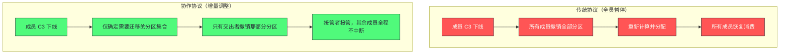

# 04 消费者与消费者组——Rebalance 机制深度剖析

**摘要：**

消费者组是 Kafka 实现并行消费的机制，而**再平衡**是它最复杂、也最容易出问题的一环——每当成员数量变化或分区数量变化，就会触发一次"重新分配消费权"的过程。在早期的协议下，这个过程是"全员暂停"的：即使只下线一个消费者，其他所有消费者也会短暂停止消费。这使再平衡成为生产环境中延迟峰值与消费积压最常见的来源。本文按"是什么 → 怎么做 → 怎么少做"展开：先讲消费者组如何用"组的数量与成员数量"统一点对点与发布订阅两种模型；再拆解再平衡的三阶段流程与协调者、组长两个角色的分工（尤其说明"分区分配为什么在客户端算"）；然后逐一对比四种分配策略——范围、轮询、粘性、协作粘性，说明"粘性"与"增量"这两个改进分别解决了什么问题；之后讲静态成员机制如何避免"临时不可用"触发不必要的再平衡，以及消费进度管理的两种提交方式与它们的取舍。最后是再平衡的运维手段、监控指标与常见误用。

---

## 第 1 章 消费者组：两种模型的统一

### 1.1 队列模型与发布订阅

消息系统有两个经典模型，它们的语义相反。

**队列模型**（点对点）：消息只被消费一次，多个消费者之间是竞争关系——谁先取到谁处理。典型场景是订单处理，一个订单只能被一个处理节点消费。

**发布订阅模型**：消息被所有订阅者各自完整消费，订阅者之间互不影响。典型场景是订单事件同时被库存系统与通知系统消费。

传统上这两类模型由不同的组件或不同的 API 提供，因为它们的"消息生命周期"不同：队列模型下消息被消费后即消失，发布订阅模型下消息要为每个订阅者各保留一份。

### 1.2 用两个参数统一两种模型

Kafka 的做法是把两者的差异**收敛到两个参数上**：组的数量与组的成员数量。

- **同一个组内**：一个分区只能被一个消费者消费（互斥）——**当组内只有一个消费者时，它就等价于队列模型**（每条消息只被处理一次）。
- **不同组之间**：互不影响，各自独立消费全量数据——**当有多个组订阅同一主题时，它就等价于发布订阅模型**（每个组都收到全量）。

这个设计的精妙之处在于：**Kafka 不需要为两种模型维护两套代码路径**。所有消费行为都通过消费者组统一描述，差异只体现在"组怎么配"上。

**这带来一个实践上的好处：模型可以随需求演进而不需要更换组件。** 一个最初用作"点对点任务分发"的主题，后来需要被另一个系统同时消费，只需要新增一个消费者组——**不需要迁移数据、不需要改生产端。**

### 1.3 协调者：组的管理者

每个消费者组有一个专属的**协调者**（Group Coordinator），它是某个 Broker 上的一个组件（一个 Broker 可以同时是多个组的协调者）。

协调者的职责有四项：**管理组成员**（注册、心跳、超时检测）、**存储消费进度**（把提交的位置写入内部主题）、**在成员变化时触发再平衡**、以及**通知各成员其分到的分区**。

消费者如何找到自己的协调者？**通过对组标识做哈希，映射到内部主题的某个分区，该分区的主副本所在 Broker 就是协调者。** 这个设计让"协调者分配"变成了一个确定性计算——**任何消费者都能独立算出自己的协调者是谁，不需要额外的查询。**

这个"用哈希做确定性分配"的手法值得留意：它把"中心分配"变成了"各自计算"，从而避免了"需要一个全局注册表"的开销。**这与第 1 篇讲的"文件名即起始 Offset"是同一类思路——用可计算的映射替代需要查询的映射。**

### 1.4 消费进度存在哪里

消费者组除了管理成员，还要存"每个分区消费到哪了"。这个信息存在**一个内部主题**里（主题名是一个以双下划线开头的系统主题）。

这个选择值得说明：**把消费进度也当作"消息"来存储**，意味着它复用了 Kafka 自身的高吞吐、持久化与副本机制——**不需要为消费进度单独设计一套存储。** 代价是"消费进度的提交本质上是一次写入"，因此高频提交会给集群带来额外的写入负载。

这个设计带来两个实践含义。**其一，消费进度是"可以查询的"**（因为它存在一个主题里），因此可以用消费工具查看任意组的进度。**其二，消费进度的提交频率需要被控制**——过于频繁的提交会推高这个内部主题的写入量，**而它是全集群共享的**，因此一个组的频繁提交会影响其他组。

**"把元数据当作数据来存储"是一个很常见的设计手法**——它用一次"统一"换来了"不必为特殊情况单独设计机制"的简洁。**理解这一点，就能理解为什么"消费进度的提交频率"会成为一个需要被管理的参数。**

### 1.5 消费者组与分区数的关系

消费者组的能力上限由分区数决定，这个约束值得单独说明。

**一个分区只能被组内一个消费者消费**，因此"组内能并行工作的消费者数量"上限就是分区数。**超出的消费者分不到分区，处于空闲状态**——它们不贡献消费能力，但会参与再平衡（第 7.2 节）。

这条约束带来两个设计含义。**其一，分区数决定了消费并行度的上限**——如果分区数不足，加消费者无法提升消费能力。**其二，消费者数应当与分区数匹配**——多于分区数是浪费，少于分区数则无法用满并行度。

**实践中的常见错误是"按消费者数定分区数"而忽略了未来的增长。** 因为分区数可以增加但不可减少（第 1 篇第 4.3 节），所以分区数应当按"预期最大并行度"来确定——**这与分桶数、分片数的设计逻辑完全一致：凡是不可减少的划分维度，都要按峰值规划。**

---

## 第 2 章 再平衡的三阶段流程

### 2.1 触发条件

再平衡在以下情况被触发：

- **有新成员加入**（新实例启动时发起加入请求）；
- **有成员主动离开**（正常关闭时发送离开请求）；
- **有成员被判定失效**（心跳超时，见下）；
- **有成员长时间不拉取消息**（两次拉取之间的间隔超过阈值，被认为"卡死"）；
- **订阅的主题的分区数量发生变化**；
- **订阅的主题列表发生变化**。

后两条与"成员数量"无关，而是"分配的前提条件变了"——**这提示了一个重要认知：再平衡的本质不是"成员变了"，而是"当前的分配方案不再有效"。** 分区数增加会让原有分配"覆盖不全"，因此也需要重新分配。

### 2.2 第一阶段：加入组与组长选举

所有成员（包括触发再平衡的那个）都要重新发送"加入组"请求。请求里携带该成员**支持的分配策略列表**（按优先级排序）以及它的订阅信息。

协调者收集到所有成员的请求后，从中选出一个**组长**（通常是第一个发送请求的成员）。随后协调者在响应中告知所有成员：当前组的完整成员列表、谁是组长、以及**协商一致的分配策略**（取"所有成员都支持的策略中优先级最高的那个"）。

**这个"协商"机制有一个实践含义：策略是"取交集"的，因此如果组内成员的策略配置不一致，实际生效的策略可能出乎意料。** 例如新成员配了"协作粘性"而老成员只支持"范围"，那么协商结果会是"范围"——**升级过程中这个现象很常见，需要留意。**

### 2.3 第二阶段：同步组与方案下发

加入组完成后，**组长**根据协商好的策略，计算"每个成员应该消费哪些分区"，然后把这个分配结果提交给协调者。其他成员发送空的同步请求（不携带分配方案）。

协调者收到组长的分配结果后，通过同步响应把各成员对应的分配方案下发给它们。

**这一步完成后，每个成员知道自己负责哪些分区，可以开始消费了——再平衡结束。**

**这里有一个关键的设计细节：分区分配的计算发生在客户端（组长）而不是协调者。** 这个选择的理由是"**让分配算法可以插件化扩展，而不需要修改 Broker 代码**"。代价是"分配的正确性依赖客户端实现"，以及"组长需要持有全量成员信息"（因此加入组响应里会返回完整成员列表）。

### 2.4 第三阶段：稳定消费与心跳维持

进入稳定状态后，每个成员通过**独立的心跳线程**定期向协调者发送心跳（心跳线程与拉取线程是分开的）。

如果协调者在超时时间内没有收到某个成员的心跳，就把它从组里移除并触发新一轮再平衡。

这里有两个超时参数需要区分，它们检测的是不同类型的"不可用"：

| 参数 | 检测什么 | 典型默认值 |
|---|---|---|
| 会话超时 | 进程是否还活着（心跳是否正常） | 秒级（随版本变化） |
| 拉取间隔超时 | 应用是否卡死（是否长期不拉取） | 分钟级（如 5 分钟） |

**两个参数的差异很重要**：前者检测"进程级失活"（崩溃、网络断开），后者检测"应用级卡死"（进程还活着，但处理逻辑卡住导致不再拉取）。**两者的应对方式也不同**——前者要查进程与网络，后者要查处理逻辑的耗时。

### 2.5 组的状态机

消费者组有一个显式的状态机，理解它有助于判断"当前处于哪个阶段"。

**空**：组里没有成员（刚开始或全部离开）。

**准备再平衡**：已触发再平衡，正在等待成员发送加入请求。**这个状态是"暂停"的主要来源**——等待时长由超时参数控制。

**完成再平衡**：成员已全部加入，正在等待组长提交分配方案。

**稳定**：分配已完成，成员正常消费。

**已死**：组已被彻底移除（通常是因为长时间无成员）。

**这个状态机的实践价值在于"排查时可以先看组在哪个状态"。** 如果长期停留在"准备再平衡"，说明有成员迟迟未发送加入请求（可能是网络问题或实例正在启动）；如果长期停留在"完成再平衡"，说明组长迟迟未提交分配（可能是分配算法计算过慢）。

**"先看状态，再看细节"这个顺序能显著缩短排查时间**——因为它把"再平衡卡住了"这个模糊现象，转化成了"卡在哪个阶段"这个具体问题。

### 2.6 再平衡期间的消息会丢吗

一个自然的疑问是：**再平衡期间成员暂停消费，这段时间新写入的消息会丢吗？**

**不会丢，但会积压。** 消息仍然照常写入（写入不受消费状态影响），只是没有被读取——因此表现为"消费滞后在再平衡期间上升"。等再平衡完成后，成员从各自提交的位置继续消费，把积压的部分读掉。

**这个性质带来两个实践含义。** 其一是**"再平衡导致的消息积压是可恢复的"**（只要积压量在可接受范围内）；其二是**"频繁再平衡会累积积压"**——因为每次暂停都让滞后上升一点，如果再平衡比消费速度更快，滞后就会持续增长。

**"暂停但不出错"这个性质值得留意**：它意味着再平衡问题往往不表现为"报错"，而表现为"滞后曲线异常"（锯齿状或持续上升）。**因此排查这类问题的入口是指标曲线，而不是错误日志**——这也是为什么第 7.3 节把"再平衡频率"列为核心监控指标。**凡是"不影响正确性、只影响时序"的机制，都需要靠曲线而不是日志来发现问题。**

---

## 第 3 章 协调者与组长的分工

### 3.1 为什么要把两个角色分开

协调者与组长是两个完全不同的角色，混淆它们会导致对再平衡流程的错误理解。

**协调者**在 Broker 侧，它是"组的管理者"——维护成员列表、检测超时、推进再平衡流程、存储消费进度。**它不参与分区分配的计算。**

**组长**在客户端，它是"某个被选中的消费者"——负责执行分配算法、把结果提交给协调者。**它只做计算，不做管理。**

**这个分工的设计动机是"可扩展性"**：如果把分配算法放在 Broker 侧，那么每次调整算法都需要升级 Broker；放在客户端则可以让使用方自由扩展（自定义分配策略）。**代价是"分配逻辑的正确性由客户端保证"**，以及"组长成为一次性的瓶颈"（它要收集全量成员信息并计算）。

### 3.2 组长的选举与它的公平性

组长通常是"第一个发送加入组请求的成员"。这个规则简单但有一个副作用：**在网络状况相似的情况下，组长往往固定在某个实例上**（例如启动最早的那个）。

这不构成严重问题（因为分配计算本身很轻量），但它解释了为什么"某个消费者在再平衡期间的表现与其他略有不同"——**它在再平衡时多做了一次计算。**

### 3.3 分配结果的传播路径

把分工串起来，分配结果的传播路径是：**协调者收集成员信息 → 下发给组长 → 组长计算分配 → 提交给协调者 → 协调者下发给各成员。**

**这条路径有一个可以优化的空间：既然组长已经算出了全量分配，为什么还要经由协调者再下发一遍？** 原因是"组长只知道全量信息，但每个成员只需要知道自己那部分"——**通过协调者中转，可以让每个成员只收到与自己相关的部分，而不是全量分配方案。** 这是一个"用一次中转换取消息精简"的设计。

### 3.4 自定义分配策略的适用场景

既然分配算法可以插件化，那么什么时候值得自定义？

**场景一：业务亲和性。** 例如"把某类分区分给部署在同一可用区的消费者"，以减少跨区流量。**这类需求无法用内置策略表达**（内置策略只考虑均匀与稳定）。

**场景二：特殊的分组约束。** 例如"同一类别的分区必须由同一消费者处理"（如按租户分组）。**这需要把"业务分组"纳入分配逻辑。**

**场景三：与外部系统协同。** 例如"消费者与它负责的分区需要在同一个节点上，以便本地缓存生效"。**这类需求把"分配"与"资源布局"绑在了一起。**

**三种场景的共同特征是"内置策略只优化了通用目标（均匀、稳定），而业务需求包含通用目标之外的约束"。** 自定义的代价是"需要自己保证正确性"——**尤其是"分配结果必须覆盖所有分区且不重复"这条基本要求，任何自定义实现都必须验证。**

### 3.5 分配方案的"有效性"判据

一个分配方案是否"有效"，需要满足三条基本要求。

**要求一：全覆盖。** 所有分区都必须被分配给某个成员——**否则那部分分区将无人消费，造成静默的数据积压。**

**要求二：不重复。** 每个分区只能分配给一个成员——**否则同一分区会被两个消费者消费，造成重复处理。**

**要求三：只分给"订阅了该主题"的成员。** 如果成员 A 只订阅了主题甲，却被分到了主题乙的分区，那么它无法正确处理。

**三条要求的共同特征是"它们都是正确性要求，而不是性能要求"**——违反任何一条都会产生"数据被重复处理或无人处理"这类难以排查的问题。**因此任何自定义分配策略的测试，都必须先验证这三条。**

这个"正确性优先于性能"的检查顺序值得强调：**分配策略的优化（均匀、稳定）是在满足正确性之后的第二步。** 而实践中常见的问题恰恰是"先追求均匀，忽略了全覆盖"——**结果是"大部分分区被正常消费，少数分区悄悄积压"。**

---

## 第 4 章 分区分配策略

### 4.1 范围策略与它的不均匀

**范围策略**把消费者按某种顺序排列、分区按顺序排列，然后把分区**按区间**分配给消费者。

它的优点是实现简单、直观；缺点是**在多主题订阅时会不均匀**。原因是它对每个主题独立计算：如果某主题的分区数不能被消费者数整除，那么排在前面的消费者会多分到一些——而由于"排在前面"在每个主题上都是同一批消费者，**多出来的分区会累积到同一批人身上。**

举例说明：两个主题各 7 个分区、3 个消费者时，每个主题的分配都是"第一个消费者 3 个、第二个 2 个、第三个 2 个"——于是第一个消费者在两个主题上各多一个，总共多两个。**这个不均匀随主题数增加而放大。**

### 4.2 轮询策略

**轮询策略**把"所有主题的所有分区"混在一起，按轮询方式依次分配。

它解决了范围策略的不均匀问题——**因为它不再按主题独立计算，而是全局轮询。**

但轮询引入了另一个问题：**再平衡后的分配结果与之前可能差异很大。** 因为轮询的顺序取决于"分区列表的顺序"与"成员列表的顺序"，任何变化都会打乱原有分配。结果是**大量分区需要在成员之间迁移**——而分区迁移意味着状态转移（提交进度、放弃或接管分区、可能重建本地状态）。

### 4.3 粘性策略：最小化迁移

**粘性策略**的目标是"在保证均匀的前提下，尽量保持原有分配不变"。

它的做法是"优先保留每个成员原有的分区"，只有在"需要填补某个成员离开后留下的空缺"或"需要重新平衡负载"时才调整。因此**再平衡后只有"原属于离开者"的分区被重新分配，其他成员的分配保持不变。**

这个改进的价值对**有状态的消费者**尤其明显：如果消费者在本地维护了与该分区相关的状态（例如流处理里的聚合状态），那么分区迁移意味着状态需要重建——**粘性策略把这种重建的范围从"全员"缩小到"接管者"。**

**粘性的代价是分配算法更复杂**（需要在"均匀"与"稳定"两个目标之间做优化），计算时间略长，但通常可以忽略。

### 4.4 协作粘性：把"全员暂停"改成"增量调整"

前面三种策略都属于**"先全部放弃、再重新分配"**的协议：再平衡时所有成员先撤销自己的全部分区（暂停消费），然后重新分配。

**协作粘性**改变了这个流程，实现了**增量再平衡**：它只让"需要交出分区的成员"撤销那部分分区，其他成员继续消费不受影响的分区。整个过程可能需要两轮"加入组加同步组"（第一轮确定要迁移哪些分区、让交出者撤销；第二轮把撤销的分区分配给接管者），但**大多数成员在过程中不中断消费**。

**这个改进的效果在大型集群里尤为显著**：成员数越多，"全员暂停"的影响面越大，而"增量调整"通常只涉及少数成员。**因此它把一个"与集群规模成正比"的停顿，变成了"与变更规模成正比"的停顿。**

### 4.5 四种策略的对比与选择

| 策略 | 均匀性 | 分区迁移量 | 是否全员暂停 | 适用 |
|---|---|---|---|---|
| 范围 | 多主题时不均 | 中 | 是 | 单主题、简单场景 |
| 轮询 | 均匀 | 大 | 是 | 多主题、不关心迁移 |
| 粘性 | 均匀 | 小 | 是 | 有状态消费者 |
| 协作粘性 | 均匀 | 小 | 否（增量） | 生产环境首选 |

**选择的原则很简单：优先用协作粘性**，因为它同时具备"均匀""迁移少""不全员暂停"三个优点。只有在需要兼容旧版本客户端时才考虑其他策略——**而"组内成员策略不一致会导致协商结果退化"这一点（第 2.2 节），正是升级过程中需要特别留意的地方。**

### 4.6 分配策略的升级路径

从传统协议升级到协作协议不是一次配置变更就能完成的，因为**协议版本需要所有成员一致**。

推荐的升级路径分三步。**第一步，让所有成员都"支持"协作策略**（在配置里把它加入支持列表，但不作为首选）——此时协商结果仍是旧策略，行为不变。**第二步，确认所有成员都已完成第一步**（否则会出现"部分支持、部分不支持"的混合状态）。**第三步，把协作策略设为首选**——此时协商结果切换为协作协议，行为改变。

**这三步的关键是"先把支持能力铺开，再切换行为"**——**而不是"一步切换"**。因为一步切换会让"尚未升级的成员"与"已升级的成员"无法协商出一致的策略，可能导致再平衡失败。

**这条升级路径与所有分布式系统的协议升级是同一套模式**：先让新能力可用（但不启用），再确认全员具备，最后统一切换。**凡是"需要全体一致"的变更，都必须走这个三步路径**——这与 Kafka 自身的版本升级纪律、以及本专栏第 6 篇要讲的元数据迁移纪律完全一致。

### 4.7 分配策略的常见误区

三处误区在实践中反复出现。

**误区一：以为"分区迁移"是免费的。** 迁移意味着交出者要提交进度、接管者要从该位置开始——**如果有本地状态，还要重建。** 因此"迁移量小"（粘性策略的价值）不只是省几次网络往返。

**误区二：以为"均匀"就是"性能最优"。** 均匀分配保证负载均衡，但**如果分区之间的数据量本身不均匀（倾斜），那么"均匀分配分区数"并不等于"均匀分配负载"。** 此时真正的解法是处理倾斜（第 1 篇第 4.2 节），而不是调整分配策略。

**误区三：忽略"成员数超过分区数"的影响。** 多余的成员完全空闲却参与再平衡——**它们不贡献消费能力，只增加再平衡的影响面。** 因此在配置消费者实例数时，应当以分区数为上限。

**三处误区的共同根源是"把分配策略当作性能旋钮，而它实际上是正确性与稳定性的保障"。** 分配策略能决定的是"负载是否均衡、迁移是否最小、暂停是否全员"——**它无法解决"数据本身倾斜"或"分区数不足"这类问题。**

---

## 第 5 章 静态成员：避免不必要的再平衡

### 5.1 临时不可用引发的再平衡风暴

生产环境中，再平衡最常见的根因不是"成员真的下线"，而是**"成员临时不可用"**。典型场景包括：

- **容器编排环境下的滚动更新**：旧实例停止、新实例启动，协调者看到"一下线一上线"，触发两次再平衡；
- **长时间的垃圾回收暂停**：进程卡住导致心跳中断，被判定失效；
- **短暂网络抖动**：心跳丢失，被判定失效。

这些场景的共同特点是：**消费者并没有真的"死了"，但系统无法区分"临时不可用"与"永久下线"，于是保守地触发了再平衡。** 而再平衡的代价（暂停消费、分区迁移）往往远大于"等它几秒钟"。

### 5.2 静态成员机制

**静态成员**机制为每个消费者实例指定一个**稳定的、全局唯一的身份标识**（配置项为实例标识）。

它的行为变化在于：**静态成员"下线"时，协调者不立即触发再平衡，而是保留它原有的分区分配，等待它重新上线。** 如果在超时时间内重新连接，就把它原来的分区分配回去——**整个过程不触发再平衡**；超时后仍未重连，才真正触发。

**这个机制解决的是"重启"这类场景**：因为实例标识是配置的（不随进程变化），新实例上线时协调者认出"这就是原来那个"，于是把分区还给它。**在容器滚动更新（通常几十秒内完成）的场景下，整个过程可以做到零再平衡。**

### 5.3 唯一性约束与它的风险

静态成员有一个硬性约束：**实例标识必须在组内全局唯一。**

如果两个实例用了相同的标识，后来的那个会把前一个"踢出"——**因为协调者认为它们是"同一个成员的新旧两个实例"，于是保留新的、淘汰旧的。** 这可能导致**正在正常消费的实例被意外中断**。

因此标识的生成规则需要保证唯一且稳定。在容器环境里，通常用"实例名"或"有状态工作负载的序号"作为标识——**它们天然满足"每个实例唯一"与"重启后不变"两个条件。**

**这个约束与第 3 篇讲的"事务标识"是同一条思路：** 用一个"跨重启稳定的标识"来识别"同一个逻辑角色"，从而让系统能够正确处理"重启"这种场景。**凡是要处理重启的场景，都需要一个"逻辑身份"来跨越进程生命周期。**

### 5.4 静态成员的适用边界

静态成员能消除"重启类"再平衡，但它不适用于所有场景。

**适用**：实例会重启但"逻辑身份不变"的场景——容器滚动更新、有状态工作负载的实例替换、计划内的重启。**这类场景的共同特征是"实例数量与身份是稳定的"。**

**不适用**：实例会"动态增减"的场景——例如按负载自动扩缩容的消费者集群。**因为静态成员的意义是"等待同一个身份回来"，而扩缩容场景下"旧身份不会回来"**——此时协调者会白等一个超时周期，反而延长了再平衡的时间。

**因此选择静态成员前，先回答一个问题："这个实例下线后，是否会有同一个身份的实例重新上线？"** 答案是"会"则适合，答案是"不会（是永久减少或换成新身份）"则不适合。**这个判断标准同样适用于其他"需要稳定身份"的机制**——它们都以"身份会回来"为假设前提。

### 5.5 静态成员与滚动更新的配合

静态成员最典型的应用场景是容器化环境的滚动更新，值得说明它的完整配合方式。

**滚动更新的过程是"逐个替换实例"**：停掉一个、启动一个、确认健康、再处理下一个。在没有静态成员时，每次"停掉一个"都会触发再平衡（因为协调者判定它下线），"启动一个"又触发一次——**一轮滚动更新可能触发与实例数成正比次数的再平衡。**

**配置静态成员后**，协调者在新实例用同一标识上线时认出它，把分区还回去——**整个替换过程可以做到零再平衡。** 前提是"替换的耗时小于会话超时"——如果替换过程很长（例如镜像拉取慢），仍会超时并触发再平衡。

**这里有一条容易被忽略的配合要求：静态成员的效果依赖"替换足够快"。** 因此如果发现"配了静态成员但仍有再平衡"，应当先确认替换耗时是否超过了超时阈值——**这个排查方向比"怀疑配置没生效"更常见。**

---

## 第 6 章 消费进度管理

### 6.1 自动提交的陷阱

自动提交模式下，消费者按固定间隔自动提交"当前已返回给应用的最大位置"。

**问题在于"已返回"与"已处理完"是两件事。** 如果消费者拉取了一批消息、定时提交触发了、然后进程崩溃，那么重启后会从已提交的位置继续——**那一批中尚未处理完的消息就被跳过了。**

这不是"提交太晚"，而是**"提交太早"**：提交的进度超过了实际处理完成的进度。**后果是消息丢失**——而丢失的这类问题最难排查，因为它不报错、只表现为"数据少了"。

### 6.2 手动提交的两种方式

手动提交有两种：**同步提交**（阻塞直到成功或失败，失败会重试）与**异步提交**（不阻塞，失败时通过回调通知）。

两者的取舍是"延迟与可靠性"：同步提交更可靠但增加消费延迟；异步提交更快但失败时不会自动重试（**因为乱序重试可能覆盖更新的进度，所以不能简单重试**）。

**因此实践中常见的模式是"平时异步、关闭前同步"**：正常消费时用异步提交保持吞吐，在消费者关闭前用一次同步提交确保最后一批进度被提交。**这个模式的价值在于它同时获得了"运行时的低延迟"与"退出时的可靠性"。**

### 6.3 进度提交与消费语义

把提交时机与处理时机的关系梳理清楚，就能理解三档语义的来源。

**先提交再处理**：如果处理失败，进度已经提交——**消息丢失**（至多一次）。

**先处理再提交**：如果提交失败或崩溃，进度未提交——**消息重复**（至少一次）。

**用事务把两者绑成原子操作**：既不丢也不重——**精确一次**（需要事务，见第 7 篇）。

**因此"提交时机"这个看似细节的选择，直接决定了消费语义。** 这也解释了为什么"消费端必须幂等"是 Kafka 使用的基本纪律——**因为默认的"至少一次"语义意味着重复必然会发生。**

### 6.4 重复与丢失的取舍

面对"重复"与"丢失"，选择哪个？**多数业务场景选择"接受重复、避免丢失"**——因为重复可以通过幂等处理消除（同一订单处理两次，第二次检测到已处理就跳过），而丢失无法补救（数据从未到达，无从恢复）。

**这个取舍的通用表述是："可检测的重复"优于"不可察觉的丢失"。** 重复会在处理逻辑中被发现（如果做了幂等判断），而丢失只会在业务侧对账时被发现——**而后者的发现成本与修复成本都高得多。**

### 6.5 消费进度的重置

除了"提交进度"，消费者还需要能"重置进度"——即把消费位置改到别处。这个能力在三种场景下被用到。

**场景一：重放历史数据。** 当消费逻辑修复后需要重新处理历史数据时，把进度回退到某个时间点（利用时间戳索引，见第 2 篇）或某个偏移量。

**场景二：跳过无法处理的消息。** 如果某条消息因为格式问题持续导致处理失败，可以把进度跳过它——**这是一个"有代价的处置"，因为它意味着承认这条消息被放弃了。**

**场景三：新消费组从指定位置开始。** 一个新建的组需要决定"从头开始"还是"从最新开始"——**这个选择决定了它会处理多少历史数据。**

**三种场景的共同提示是："进度"是一个可以被主动设置的量，而不只是一个被自动推进的量。** 理解这一点，就能理解为什么"可重放"是 Kafka 的核心能力之一——**因为它把"消费位置"从一个隐含的内部状态，变成了一个可以显式操作的对象。**

### 6.6 提交频率的取舍

提交频率是一个需要权衡的参数，它的两端各有一个代价。

**提交太频繁**：每次提交都是一次写入（写入那个内部主题），因此会推高集群的写入负载；同时"提交超前"导致丢数据的风险窗口也更多（因为提交次数多，撞上"提交后崩溃"的概率更高）。

**提交太稀疏**：崩溃后需要重新消费的窗口更大——**重复处理的数据量更多。** 因此"重复的量"与"提交的频率"成反比。

**这个取舍的量化方式是"以允许的重复量反推提交频率"**：如果业务能接受"最多重复处理 N 条消息"，那么提交频率应当使得"两次提交之间处理的消息数不超过 N"。**这条推导把提交频率从一个"凭感觉"的参数变成了一个由业务容忍度决定的参数。**

**这与本专栏其他篇里的"攒批"取舍是同一类问题**：写入频率、提交频率、导入频率——它们都在"更频繁但每次更小"与"更稀疏但每次更大"之间选择。**而选择的依据始终是"哪一端的代价更不可接受"。**

---

## 第 7 章 再平衡的运维

### 7.1 再平衡的三类代价

再平衡的代价分三处，理解它们有助于评估"要不要优化"。

**代价一：消费暂停。** 传统协议下全员暂停，暂停时长取决于"成员数量"与"网络往返"。**在成员数多的集群里，这个暂停可能达到数十秒。**

**代价二：分区迁移带来的状态转移。** 迁移意味着"交出者提交进度、接管者从提交位置开始"。**如果消费者有本地状态（如流处理的聚合状态），还要重建状态。**

**代价三：触发时的连锁反应。** 如果再平衡频繁发生，消费会反复暂停与恢复——**表现为"消费滞后呈锯齿状波动"，而不是稳定的增长。**

### 7.2 减少再平衡的四种手段

**手段一：使用协作粘性策略。** 把"全员暂停"变成"增量调整"（第 4.4 节）。

**手段二：配置静态成员。** 消除"重启"这类场景触发的再平衡（第 5 章）。

**手段三：让处理时间与拉取间隔匹配。** 如果处理一批消息的耗时可能超过"拉取间隔超时"，那么应当调大该超时或调小"单次拉取的消息数"。**这是"应用级卡死"导致再平衡的主要来源。**

**手段四：避免"成员数超过分区数"。** 多余的成员会处于空闲状态，而它们的存在增加了再平衡的影响面（因为每次再平衡都涉及全员）。**成员数应当不超过分区数。**

**四种手段的优先级是"策略与静态成员优先，参数其次"。** 因为前两者消除的是"不必要的再平衡"，后两者只是"减少其影响"。

### 7.3 需要监控的指标

消费者组的健康度建议监控四类指标。

**其一是各分区的消费滞后。** 它是"消费能力与生产速率差距"的直接投影（第 1 篇第 7.5 节已展开）。

**其二是再平衡的频率与时长。** **频繁的再平衡通常意味着有成员反复失活**（进程被重启、GC 过长、网络抖动），而它本身是可以被消除的。

**其三是消费者的处理耗时分布。** 如果处理耗时的分位数接近"拉取间隔超时"，那么再平衡随时可能被触发——**这是一个"预警"指标，而不是"事后"指标。**

**其四是提交失败率。** 提交失败通常发生在"成员被踢出组之后仍尝试提交"的场景，**它是再平衡已经发生的信号。**

**四类指标的关系是"从结果到原因"**：滞后是结果，再平衡频率是事件，处理耗时是原因，提交失败是证据。**按这个顺序排查，就能从"消费慢了"定位到"为什么慢"。**

### 7.4 一次再平衡风暴的排查推演

把上述手段串成一个排查案例。

假设现象是"消费滞后呈锯齿状波动，且波动越来越频繁"。

**第一步，确认是否真的是再平衡。** 观察组的成员变化日志与再平衡计数——如果再平衡频繁发生，就确认了方向。

**第二步，判断再平衡的触发原因。** 三类原因：**成员主动离开**（正常关闭）、**成员被判失效**（心跳超时）、**分区数或订阅变化**。前两者占绝大多数，第三类通常是人工操作（扩分区）。

**第三步，如果是"被判失效"，再分两种。** **心跳超时**说明进程或网络有问题（查实例是否被重启、GC 是否过长、网络是否抖动）；**拉取间隔超时**说明处理逻辑卡住（查单批处理耗时是否接近或超过阈值）。

**第四步，针对根因处置。** 如果是滚动更新导致的（实例被重启），配置静态成员；如果是处理耗时导致的，调大拉取间隔超时或减小单批拉取量；如果是 GC 导致的，先看 GC 日志再决定是调堆还是调处理逻辑。

**第五步，如果根因无法消除（例如必须频繁扩缩容），则降低再平衡的影响。** 启用协作粘性策略，把"全员暂停"变成"增量调整"。

**这五步的价值在于"每一步都在把问题缩小一个范围"**——从"消费慢了"到"再平衡频繁"到"哪一类触发"到"具体哪个参数"。**而它的起点不是调参数，而是确认方向**——这正是本专栏反复强调的排查纪律。

---

## 第 8 章 边界与反例

### 8.1 反例一：把再平衡当成"偶发的运维噪音"

再平衡会暂停消费、迁移分区、可能重建状态。**在成员数多的集群里，它的影响面很大。** 把它当作"偶发噪音"而不做优化，会让消费链路的稳定性长期受制于"任何一次实例重启"。

### 8.2 反例二：组内成员策略配置不一致

策略是"取交集"协商的，因此不一致的配置会导致实际生效的策略退化（例如从协作粘性退化为范围）。**升级过程中尤其容易出现这个问题**，需要确认"所有成员都支持目标策略"再切换。

### 8.3 反例三：成员数超过分区数

多余的成员完全空闲（分不到分区），却仍然参与再平衡——**它们不贡献消费能力，只增加再平衡的影响面。** 成员数应当不超过分区数。

### 8.4 反例四：用自动提交而不做幂等处理

自动提交会导致"提交超前"，进而导致消息丢失；而如果改成手动提交，又会引入重复。**两条路都需要消费端有幂等能力或事务支持。** 期望"配好提交方式就不会有问题"是把语义问题误当成配置问题。

### 8.5 反例五：忽略"应用级卡死"这一类失效

会话超时检测的是"进程是否活着"，而"拉取间隔超时"检测的是"应用是否卡死"。**只关注前者会漏掉"进程健康但处理逻辑卡住"的情况**，而这类情况的后果是"消费停滞但心跳正常"，更隐蔽。

### 8.6 反例六：静态成员标识不唯一

两个实例用同一个标识会导致其中一个被意外踢出。**这个错误的表现是"某个消费者莫名停止消费"**，而它不报错、只在行为上体现——因此很难排查。

### 8.7 反例七：在消费者关闭时不提交进度

如果消费者正常关闭时不做最后一次提交，那么重启后会从更早的位置重新消费——**造成不必要的重复。** 因此"关闭前同步提交"应当成为固定动作。

### 8.8 反例八：在扩缩容场景下使用静态成员

静态成员假设"同一身份会回来"，而扩缩容场景下身份不会回来。**此时协调者会白等一个超时周期，反而延长了再平衡时间。** 因此静态成员不是"总是更好"的配置。

### 8.9 反例九：把"消费进度"当成只能前进的量

消费进度可以被显式重置（第 6.5 节），这是"可重放"能力的入口。**忽略这一点，会让"修复消费逻辑后重放历史数据"变成一件需要建新主题、重新导数据的大工程**，而实际上只需要回退进度。

---

## 第 9 章 落点

回到开头的判断：再平衡是"并行消费"这个能力所付出的代价。

**并行的前提是"分配"**（哪个消费者负责哪些分区），而分配的前提是"一致同意"——**只要成员或分区发生变化，就需要重新达成一致，而重新达成一致的过程必然是"暂停—协商—恢复"。** 这与分布式系统里所有的"成员变更"问题同构：任何"需要全体一致"的状态，在成员变化时都要经历一次重新协商。

而这个代价是可以被削弱的：**协作粘性削弱了"暂停范围"**（从全员到少数），**静态成员削弱了"触发频率"**（从"每次重启"到"只有真失效"）。**两个改进合起来，把再平衡从"频繁且全员"压到了"偶发且局部"。**

因此这一篇的核心结论可以概括为一句：**并行消费的代价不能消除，但可以被限制在"真正的变更"范围内。** 而运维工作的重点，就是消除那些"不是变更却被当作变更"的情况——**重启、抖动、GC 暂停都属于这一类，它们才是再平衡噪音的主要来源。**

再补一层认知：**再平衡暴露的是"分布式系统的成员管理"这个通用问题的代价。** 任何需要"多个实例协同分担一份工作"的系统，都要面对同一组问题：**怎么知道谁还在？谁不在？不在的怎么处理？** Kafka 的答案是"心跳检测 + 协调者 + 重新分配"，而这三者的代价（检测延迟、协调开销、分配暂停）在所有同类系统里都存在。

因此理解再平衡的价值不限于 Kafka——**它提供了一个"成员管理代价"的具体样本**：当你在其他系统里遇到"节点变化导致服务抖动"时，可以先问"它的检测机制是什么、协调者是谁、重新分配的范围有多大"，然后用同一套思路去削弱代价。**这是本专栏反复出现的"跨系统迁移认知"的又一个例子**——一个系统的具体机制会过时，但它所对应的"问题类型"与"取舍结构"不会。

下一篇转向副本机制，看"可用性"这一侧的设计——那是 Kafka 如何在"多数副本确认"与"单副本确认"之间取平衡，以及高水位与 Leader 纪元如何共同保证"读到的数据不会消失"。

---

## 专栏导航

- 上一篇：[[03 生产者——分区策略、acks 与幂等性]]。
- 下一篇：[[05 副本机制——ISR、HW 与 Leader Epoch]]。
- 全局架构：[[01 Kafka 全局架构——Broker、Topic、Partition 与消息流转]]。
- 日志存储：[[02 日志存储引擎——Segment、索引与零拷贝]]。
- 返回专栏首页：[[00 专栏导览]]。

---

## 参考资料

1. Apache Kafka. 官方文档：Consumer Configs（session.timeout.ms、max.poll.interval.ms、group.instance.id）. https://kafka.apache.org/documentation/#consumerconfigs
2. KIP-429: Kafka Consumer Incremental Rebalance Protocol. https://cwiki.apache.org/confluence/display/KAFKA/KIP-429
3. KIP-345: Introduce Static Membership Protocol to Reduce Consumer Rebalances. https://cwiki.apache.org/confluence/display/KAFKA/KIP-345
4. KIP-54: Sticky Partition Assignment Strategy. https://cwiki.apache.org/confluence/display/KAFKA/KIP-54
5. Confluent. From Eager to Incremental Rebalancing. https://www.confluent.io/blog/cooperative-rebalancing-in-kafka-streams-consumer-ksqldb/
6. Narkhede N, Shapira G, Palino T. Kafka: The Definitive Guide, Chapter 4: Kafka Consumers. O'Reilly.
7. Apache Kafka. 官方文档：Consumer Group 状态机与协议（JoinGroup/SyncGroup/Heartbeat）. https://kafka.apache.org/protocol
8. Apache Kafka. 官方文档：消费进度与内部主题（__consumer_offsets）说明. https://kafka.apache.org/documentation/#impl_offsettracking
9. Apache Kafka. 官方文档：消费者组命令行工具与滞后查询方式. https://kafka.apache.org/documentation/#basic_ops_consumer_group
10. Apache Kafka. 官方文档：分区分配策略的配置与协商规则（partition.assignment.strategy）. https://kafka.apache.org/documentation/#consumerconfigs
11. Apache Kafka. 官方文档：消费者组协调流程与故障处理说明. https://kafka.apache.org/documentation/#impl_consumer_rebalance

---

> [!note] 思考题
> 1. 消费者组用"组的数量与成员数量"两个参数统一了两种消息模型。这个设计带来了什么实践上的好处？
> 2. 分区分配的计算为什么放在客户端（组长）而不是协调者？这个选择的代价是什么？
> 3. 协作粘性把"全员暂停"变成"增量调整"。为什么它在大型集群里的效果更显著？
> 4. 静态成员机制需要"跨重启稳定的标识"。这与事务标识的设计动机有什么共性？
> 5. "可检测的重复优于不可察觉的丢失"——你会如何为一条"扣减库存"的消费逻辑实现幂等？
