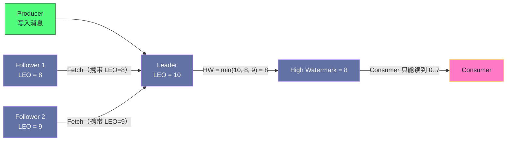

# 05 副本机制——ISR、HW 与 Leader Epoch

**摘要：**

副本机制要回答四个问题：**数据放在几个节点上**（冗余）、**什么算"已经同步"**（同步的定义）、**消费者能读到哪一条**（可见性边界）、以及**切换时哪些数据该丢弃**（正确性）。Kafka 对这四个问题给出的答案分别是：多副本加主从分工、**动态的同步副本集合**、**高水位**、以及**Leader 纪元**。本文按这四问展开。先用反事实说明"为什么不能等所有副本"（一个慢副本会拖垮整体写入），引出同步副本集合这个折中；再讲高水位如何划定"读到就不会消失"的边界，以及它带来的可见性延迟；然后重点拆解高水位机制在两个经典场景下的缺陷（数据丢失与数据分叉）——它们的共同根源是"用自己可能过时的进度去决定截断位置"；接着讲 Leader 纪元如何用"显式编号"替代"时序推断"来修复这两处缺陷，并提炼出"能用编号解决的顺序问题不要用时序解决"这条通用经验；之后是不干净选举的两难与判断依据，以及副本机制的配置、监控与常见故障。最后是边界与常见误判。

---

## 第 1 章 副本要解决的四个问题

### 1.1 冗余：数据放在几个节点上

副本机制的起点是"冗余"——同一个分区的数据在多个节点上各存一份，从而在某个节点失效时数据仍然可用。

但"存几份"只是最表层的问题。一旦引入多份，就必然产生**"多份之间如何保持一致"**这个更深的问题。而"一致"需要被定义——因为网络与负载会让副本之间的同步有快有慢，"完全一致"在多数时刻并不成立。

### 1.2 什么算"已经同步"

这就引出第二个问题：**什么条件下可以认为"这条消息已经安全了"？**

三种可能的答案，各自的代价不同。**答案是"主副本写入即安全"**：写入延迟最低，但主副本失效就会丢数据。**答案是"所有副本都写入才安全"**：安全性最高，但**任何一个慢副本都会拖垮整体写入延迟**——一个故障节点就能让整个分区的写入变慢。

这两种答案都不理想，因此需要一个折中：**"当前与主副本保持足够接近的那批副本"**——这就是动态同步副本集合的由来（第 3 章）。

### 1.3 消费者能读到哪

第三个问题是**可见性边界**：消费者能读到哪一条消息？

如果消费者能读到"刚写入主副本但还没同步到任何其他副本"的消息，那么一旦主副本失效，这条消息就会"读到过但后来不存在了"。**这破坏的是消息系统最基本的直觉——读到的东西不应该消失。**

因此需要一个明确的边界，只让"已经足够安全"的消息对消费者可见——这就是高水位的作用（第 4 章）。

### 1.4 切换时哪些数据该丢弃

第四个问题只在"主副本切换"时出现：**新主副本的数据可能与旧主副本不完全一致**（旧主副本可能多写了一些还没同步出去的消息）。此时需要决定"从哪个位置截断"。

这个问题的答案看起来显然——"截断到所有副本都确认过的位置"。但**"所有副本都确认过的位置"这个信息在切换的瞬间可能已经过时**，而这正是高水位机制的缺陷所在（第 5 章），也是 Leader 纪元要修复的问题（第 6 章）。

**四个问题的递进关系值得留意**：冗余引出"同步的定义"，"同步的定义"引出"可见性边界"，"可见性边界"引出"切换时的截断正确性"。**每一层都是前一层引入新概念之后的必然追问**——理解了这条推导链，就能理解为什么副本机制需要 ISR、HW、Leader Epoch 这三个概念，而不是一个简单的"复制数据"。

### 1.5 三个概念与四个问题的对应

把三个核心概念与四个问题对应起来，可以看清每个概念"负责回答哪个问题"。

**同步副本集合**回答"什么算已经同步"——它把"全部副本"这个不可用的定义，替换成"当前足够接近的副本"这个可用的定义。

**高水位**回答"消费者能读到哪"——它用"集合内所有副本位置的最小值"划出一条可见性边界。

**Leader 纪元**回答"切换时哪些该丢弃"——它用"纪元到起始位置"的记录替代"靠自己记录的进度推断"。

**而"冗余"这个问题没有对应的新概念**——它由"副本数"这个配置直接回答。

**这张对应表的用处在于"排查时的定位"**：如果问题是"消费者读到的消息后来消失了"，方向在高水位；如果问题是"写入被拒绝"，方向在同步集合与最小副本数；如果问题是"切换后数据不一致"，方向在纪元记录。**每个问题都指向一个具体的机制，而不是笼统的"副本有问题"。**

---

## 第 2 章 副本的基本分工

### 2.1 主副本与从副本

每个分区的多个副本中，有且仅有一个**主副本**（Leader），其余是**从副本**（Follower）。

分工很明确：**所有读写都只与主副本交互**——生产者的写入、消费者的读取都找主副本；**从副本只做一件事**——从主副本拉取数据，保持自己的日志不落后。

这个"读写都走主副本"的设计带来一个重要的性质：**不存在"多节点同时写"的冲突问题。** 因为只有主副本接受写入，从副本只是被动复制，所以它们的数据要么与主副本一致，要么落后——**不会出现"分叉"**（除了第 5 章要讲的那种极端场景）。

### 2.2 为什么不让从副本提供读服务

有些分布式系统允许从副本提供读服务（以扩展读能力），Kafka 明确不这样做。原因有三处。

**原因一：会破坏"读到的不消失"这个直觉。** 从副本可能落后于主副本，因此"从从副本读"可能读到比刚才更旧的数据——**表现为"消息时光倒流"。**

**原因二：实现会复杂得多。** 一旦允许从副本读，就必须处理"读一致性"问题（读到什么程度的数据算可接受）。**而 Kafka 选择了"不支持"来回避这个复杂度。**

**原因三：读能力的扩展有别的办法。** Kafka 的水平扩展是靠"增加分区数"（每个分区的主副本分布在不同节点）实现的，**而不是靠"让从副本分担读"**。这与第 4 篇讲的"分区数决定并行度上限"是同一件事。

**这三条原因共同说明：Kafka 在副本机制上选择了"简单但集中"——读写都集中在主副本上，复杂度用"增加分区"来摊薄。** 这也是它与其他"读写分离"系统的根本差别。

### 2.3 拉取式同步：复用消费的代码路径

从副本同步主副本的方式是**主动拉取**（从副本向主副本发送拉取请求），而不是主副本推送。

这个选择有一个很实际的理由：**拉取请求的格式与消费者的拉取请求几乎相同**，因此两者的代码路径可以大量复用。**这降低了实现与维护成本**，也让"副本同步"这件事不需要一套独立的协议。

拉取式同步还有一个隐含的好处：**主副本不需要维护"每个从副本同步到哪了"这个状态来主动推送**——它只需要在收到拉取请求时，根据请求里携带的位置返回相应数据。**这把状态维护的责任转移给了拉取方**，与第 1 篇讲的"消费进度由消费者维护"是同一个设计取向。

### 2.4 日志末端位置：副本自己的进度

每个副本（包括主副本自己）都维护一个**日志末端位置**——表示"这个副本已经写入的最新消息位置加一"。

这个值的重要性在于：**它是"副本自己知道的进度"**，而不是"别人认为它的进度"。多副本一致性的一切判断，最终都要落到"各副本的这个值分别是多少"上。

**这里有一处容易混淆的地方：** 主副本的日志末端位置与高水位是两个不同的值。**前者是"主副本写了多少"，后者是"有多少已经被确认安全"。** 两者之间的差距，就是"已写入但尚未被确认"的那部分消息——**这部分消息对消费者不可见**（第 4 章）。

### 2.5 副本同步的资源消耗

副本同步不是"免费的后台动作"，它消耗真实的资源，这一点在容量规划时容易被忽略。

**网络带宽**：每个从副本都要从主副本拉取全量数据。**因此"一份写入"在网络上的实际传输量是"写入量乘以副本数"**——三副本集群的网络流量是写入量的三倍（更准确地说是"一份从生产端来、两份在副本间同步"）。

**磁盘空间**：副本数直接乘以存储占用。**这是最直观的一项**，也是"副本数设多少"这个决策里最容易被计算的一项。

**主副本的负载**：主副本既要服务生产者与消费者，又要服务从副本的拉取。**因此主副本的负载是"业务负载加副本同步负载"**——这也是为什么"分区分布是否均衡"很重要（主副本过于集中会让某些节点过载）。

**三项消耗的共同含义是："副本数"这个参数同时影响可靠性、可见性延迟与资源成本。** 因此它是一个需要三方权衡的参数，而不是"越多越好"。

### 2.6 副本分布与故障域

副本"放在哪几个节点上"与"放几份"同样重要，因为它决定了"能容忍什么级别的故障"。

**如果三份副本集中在同一机架**，那么一次机架级故障（交换机、供电）就会同时带走全部副本——**此时"三副本"的保护级别实际上退化成了"单副本"。**

**如果三份副本分布在不同机架但同一可用区**，那么可以容忍机架级故障，但无法容忍可用区级故障。

**因此"副本分布"应当按"需要容忍哪种级别的故障"来规划**：容忍节点故障则跨节点；容忍机架故障则跨机架；容忍机房故障则跨机房。

这里有一处取舍需要留意：**跨故障域分布会提高副本同步的延迟**（因为网络距离变远），而副本同步延迟直接影响可见性延迟（第 4.3 节）。**因此"跨多少故障域"是一个"可靠性范围"与"延迟"之间的取舍**——这与"副本数设多少"是同一类决策，只是维度从"数量"换成了"位置"。

**实践中的常见配置是"跨机架"**：它能覆盖最常见的故障（单节点与单机架），而对延迟的影响在可接受范围内。**跨机房的配置通常只用于容灾场景，且需要接受明显更高的同步延迟。**

---

## 第 3 章 同步副本集合：动态的同步定义

### 3.1 为什么需要它

回到第 1.2 节的两难：**等所有副本会拖垮写入，只等主副本会丢数据。**

同步副本集合给出了折中：**"等当前与主副本保持足够接近的那批副本"。**

这个定义的精妙之处在于它是**动态的**：接近的副本在集合内，掉队的副本被移出集合。因此**一个慢副本被移出之后，就不再拖累写入**——写入只需要等待集合内剩下的副本。

**这实际上是一个"自动降级"机制**：当部分副本不可用时，系统自动把一致性要求降低到"剩下的健康副本"，从而保住可用性；当副本恢复并追赶上之后，它重新加入集合，一致性要求随之提高。

### 3.2 进入与退出的规则

**退出的条件**是"落后超过一定时长"——从副本的位置落后于主副本超过阈值时被移出集合。

**重新进入的条件**是"追上主副本的位置"——一旦追上就自动重新加入。

这两条规则共同构成了一个"自动调节"的闭环：**掉队则降级，追上则恢复。** 而它不需要任何人工干预——**这是"动态定义"相比"静态定义"（如固定等待 N 个副本）的核心优势。**

### 3.3 为什么用时间而不是消息条数

一个值得注意的设计细节是：**判断"落后"的维度是时间，而不是消息条数。**

早期版本确实用过"落后条数"这个维度，但它有一个明显缺陷：**当写入速率突增时，即使从副本同步完全正常，也可能因为"来不及同步足够多的条数"而被误判为落后。** 结果是集合频繁收缩又恢复——**这种"抖动"会让写入延迟忽高忽低。**

换成时间维度后，这个问题消失了：**只有"持续落后超过一定时长"才会被移出**，短暂的速率波动不会触发。**这是一个"用更稳健的度量替代更敏感的度量"的例子**——敏感性在这里不是优点，而是噪音来源。

### 3.4 集合收缩的退化与它的防线

集合收缩带来一个必须正视的后果：**如果集合收缩到只剩主副本，那么"等所有同步副本"就退化为"等主副本"。**

这个退化是**静默的**——写入仍然成功，只是保护级别下降了。**而运维侧看到的指标（写入成功率、延迟）可能完全正常。**

防线是"最小同步副本数"这个参数：它规定"集合至少要有几个成员，写入才被接受"。把它设为 2，就得到了"至少两个副本确认"的保证——**当集合不足两个时，写入被拒绝而不是降级。**

**这条防线的价值在于它把"静默的可靠性下降"变成了"显式的写入失败"。** 而"显式失败"是可监控、可重试、可告警的——**这正是第 3 篇反复强调的"报错优于静默降级"在副本机制上的体现。**

### 3.5 集合信息的持久化与传播

同步副本集合本身也是一份"元数据"，它需要被持久化并传播给相关节点，否则切换时会无从判断。

**它的持久化位置随架构版本变化**：早期依赖外部协调服务存储，较新的架构把它写入集群自身的元数据日志（第 6 篇会展开）。

**它的传播路径是"主副本上报、控制器协调、广播给所有节点"**。这条路径的存在意味着**集合的变化不是瞬时的**——从"某个副本掉队"到"所有节点都知道它掉队了"之间存在时间差。

**这个时间差带来一个实践含义：在集合变化的窗口期内，不同节点对"当前集合是什么"的认知可能不一致。** 而这类不一致正是高水位机制缺陷的土壤（第 5 章）——**因为"用局部认知去推断全局状态"在不一致窗口内必然出错。**

**因此"把元数据集中管理并统一下发"是消除这类问题的方向**，而这也正是第 6 篇要讲的架构演进的动机之一。

### 3.6 同步集合与确认级别的配合

同步集合与确认级别是两个必须一起理解的配置，它们的组合决定了实际的写入保证。

**确认级别决定"等谁"，同步集合决定"等的那批人是谁"。** 因此"等所有同步副本"这个表述里，"所有"的范围是动态的——**这正是它能兼顾可用性与可靠性的原因，也是它需要"最小同步副本数"来兜底的原因。**

四种组合的实际效果如下。

| 确认级别 | 最小同步副本数 | 实际保证 |
|---|---|---|
| 主副本 | 任意 | 主副本失效可能丢数据 |
| 所有同步副本 | 1 | 集合收缩时退化为"只等主副本" |
| 所有同步副本 | 2 | 至少两个副本确认，否则拒绝写入 |
| 所有同步副本 | 副本数 | 需要全部副本在线，可用性最低 |

**这张表的实用价值在于"它把两个参数的影响放在一起看"**。实践中常见的错误是"只设确认级别，不设最小副本数"（第二行）——**表面上用了最强档，实际在集合收缩时退化为最弱档。**

**而最后一行的启示是"可靠性不是越高越好"**：要求全部副本在线意味着"任何一个节点故障都会导致写入失败"，这在实际生产中通常不可接受。**因此"三副本 + 最小两个"是实践中的平衡点**——容忍一个节点失效，同时保证至少两个副本持有数据。

---

## 第 4 章 高水位：可见性边界

### 4.1 为什么需要它

设想没有可见性边界的情况：生产者写入一条消息到主副本，消费者立即读到它；随后主副本在从副本同步之前失效，新主副本（从从副本中选出）没有这条消息。

**结果是消费者"读到了一条后来不存在的消息"。** 从消费者的视角看，这条消息"读到了又消失了"——**这破坏了"读到即已发生"这个基本假设。**

高水位的作用就是划定边界：**只有已经被集合内所有副本同步的消息，才对消费者可见。**

### 4.2 推进机制

高水位的计算方式是"取集合内所有副本位置的最小值"——**因为只有最小值之前的消息，才能保证"所有副本都有"。**

每当从副本发来拉取请求时，主副本会用请求里携带的位置更新自己对"该副本进度"的记录，然后重新计算高水位。因此**高水位的推进节奏由"最慢的那个副本的拉取频率"决定。**

### 4.3 可见性延迟

高水位机制带来一个必然的代价：**可见性延迟**——一条消息从写入主副本，到对消费者可见，需要等待集合内所有副本都同步到它。

这个延迟通常很小（因为副本同步是持续的），但在两种情况下会变大：**集合内成员较多**（要等更多副本），**或某个副本的同步较慢**（高水位由最小值决定）。

**这解释了"副本数越多越安全但延迟越高"这条经验的机制来源。** 它不是一条经验规律，而是"高水位取最小值"这个计算方式的直接推论。

**因此"副本数设多少"这个决策，本质上是"可靠性"与"可见性延迟"之间的取舍。** 三副本是常见默认值，因为它在"容忍一个节点失效"与"延迟可接受"之间取了平衡。

### 4.4 高水位对消费者意味着什么

高水位对消费者有两个直接含义，理解它们有助于排查"消费行为异常"。

**含义一：消费者看不到"最新写入"的消息。** 它看到的最新消息永远落后于生产端一小段时间（取决于副本同步的速度）。**如果业务要求"写入后立刻可读"，这个机制就是阻碍**——而它不是配置问题，是设计前提。

**含义二：消费者的进度提交也受高水位影响。** 因为消费者只能提交"已经读到的位置"，而"能读到的"受高水位限制——**因此进度提交的位置也不会超过高水位。** 这保证了"提交的进度对应的消息一定是已确认安全的"。

**两条含义共同说明：高水位不只影响"读什么"，也影响"能提交到哪"。** 这也解释了为什么"高水位与日志末端的差距"是一个重要的监控指标（第 8.2 节）——**它的两端分别连着"生产端写了多少"与"消费端能读到多少"，是这条链路的中间量。**

### 4.5 高水位与副本的关系

还有一处需要澄清的边界：**高水位是"分区级"的概念，而不是"主题级"或"集群级"的。**

这意味着"可见性延迟"是**按分区各自计算的**——某个分区的高水位可能推进很快（副本同步顺畅），而另一个分区的高水位长期滞后（某个副本掉队）。**因此"这个主题的延迟是多少"这个问题，准确的答案应当是"各分区延迟的分布"，而不是一个平均值。**

**这与第 4 篇讲的"消费滞后要按分区看"是同一个道理**：任何"按分区独立维护"的量，都应当按分区观察，而不是取平均——**因为平均值会掩盖"个别分区严重异常"这类问题，而这类问题恰恰是最需要被发现的。**

**因此在监控设计上，"分区级指标的最大值"通常比"平均值"更有价值。** 它直接回答"最差的那个分区有多差"，而这正是"用户可能感知到的延迟"。

---

## 第 5 章 高水位的两处缺陷

### 5.1 缺陷一：数据丢失

高水位机制的缺陷在一个特定场景下暴露：**主副本与从副本先后失效、且从副本持有的高水位信息已经过时。**

设想这样的过程：主副本写入了一条消息并返回确认（因为确认级别只要求主副本），从副本随后拉取到了这条消息，但**还没收到"高水位已推进"的通知**——此时从副本自己记录的高水位仍然较低。接着主副本失效，从副本成为新主副本；**新主副本按照"自己记录的高水位"截断日志，把那条消息截掉了**——尽管它实际上已经持有这条消息。

结果是：**生产者收到了确认，但消息被删除。** 这是"数据丢失"，而且是一种很隐蔽的丢失——**因为所有的确认都返回了成功。**

### 5.2 缺陷二：数据分叉

第二个缺陷更严重：**两个副本在各自成为主副本的期间，可能在同一位置写入不同的内容。**

设想主副本与从副本因网络分区而各自认为自己是主副本（或先后成为主副本并各自接受写入），那么它们的日志在同一段位置上会出现**内容不同**的消息。当分区恢复后，**两者对"这一段应该是什么"的看法不一致**——这就是"数据分叉"。

数据分叉比数据丢失更难处理：**它破坏的是"同一个位置只有一种内容"这个基本假设**，而大量下游逻辑（如消费者的去重、偏移量的语义）都建立在这个假设上。

### 5.3 两处缺陷的共同根源

两处缺陷的根源是同一个：**从副本用"自己记录的、可能已经过时的高水位"来决定截断位置。**

**问题的本质是"用一个间接的、可能过时的量来推断一个直接的事实"。** 从副本真正需要知道的是"哪些消息是已提交的"，而它手里只有"我以为的高水位是多少"——**两者在正常情况下一致，但在切换场景下可能不一致。**

**这是一个典型的"信息不足导致的推断错误"**：不是逻辑错了，而是"依据的信息"不完整。因此修复的方向也很明确——**要么让从副本拿到更准确的信息，要么让它不必推断。**

### 5.4 为什么这两处缺陷长期存在

一个自然的疑问是：既然这两处缺陷如此明显，为什么它们长期存在于生产系统里？

原因有三层。**其一是触发条件苛刻**——需要"主副本与从副本在特定时序下先后失效"，这在正常情况下很少发生。**其二是后果隐蔽**——数据丢失的表现是"少了一条消息"，而它不报错，因此可能很久之后才被发现。**其三是修复代价高**——修复需要改变截断协议（引入纪元与新的请求类型），属于协议级变更，涉及所有节点的兼容。

**三层原因共同解释了一个普遍现象：分布式系统里最难修的往往不是"逻辑错误"，而是"在苛刻时序下才暴露、且后果隐蔽"的问题。** 这类问题的共同特征是"**正常路径完全正确，异常路径才有问题**"——而验证异常路径的成本远高于正常路径。

**因此这类缺陷的发现通常来自"故障复盘"而非"代码审查"。** 这也提示了一条实践：**对"只在故障时才有差异"的机制，应当通过主动构造故障来验证**（例如在测试环境模拟"主从先后失效"），而不是等生产环境自然发生。

### 5.5 这两处缺陷的启示

把这两处缺陷抽象一层，可以得到两条对设计有普遍意义的启示。

**启示一：任何"基于本地状态推断全局状态"的机制，都要问"本地状态在什么情况下会过时"。** 如果答案是"在切换、分区、暂停等异常场景下会过时"，那么这个机制在这些场景下就不可靠——**而这类场景恰恰是最需要它可靠的场景。**

**启示二："看起来正确"的机制需要被"反例检验"。** 高水位机制在正常路径上完全正确，它的缺陷只在特定时序下暴露。**因此评审一个机制时，除了问"正常情况下它对吗"，还要问"在节点先后失效、网络分区、进程暂停这些场景下它还成立吗"。**

**两条启示的共同指向是"把异常场景当作设计输入，而不是事后补救"。** 而实践中这一点很难做到——**因为异常场景的组合空间很大，而人的注意力总是先被正常路径占满。** 这也是为什么"主动构造故障"（混沌工程那类实践）在分布式系统里价值很高：**它把"想象异常"变成了"观察异常"。**

---

## 第 6 章 Leader 纪元：用编号替代时序

### 6.1 修复思路

修复的思路是：**给每一任主副本一个单调递增的编号（纪元），并记录"每一任主副本从哪个位置开始写入"。**

这个"纪元到起始位置"的记录被持久化在每个节点上，形成一份"主副本历史"。有了它，**从副本在需要截断时不再靠自己推断，而是直接询问当前主副本"某个纪元的日志结束于哪个位置"**，然后据此决定截断点。

### 6.2 为什么这样能修复

关键在于**"纪元加起始位置"这个信息是全局一致的**（因为它被记录在每个节点的历史里，且随日志一起复制），而"高水位"是**每个节点各自维护的、可能过时的**。

因此修复后的判断不再依赖"我以为的进度"，而是依赖"客观上某一任主副本写到哪了"。**信息从"局部可能过时"变成了"全局一致"。**

具体到第 5.1 节的场景：新主副本成为主副本后**不截断自己的日志**（因为它持有全部已写入的消息）；旧主副本恢复后向新主副本询问"上一纪元结束于哪个位置"，发现自己并不需要截断——**那条消息被保住了。**

### 6.3 一条通用的设计经验

Leader 纪元这个修复方案，值得提炼成一条通用经验：**能用显式编号解决的顺序问题，不要用时序推断解决。**

原因是：**时序推断依赖"信息的传播速度"与"本地记录的新鲜度"**，而这两者在分布式系统里都不可靠（网络会延迟、节点会暂停）。**显式编号则是一个"客观事实"**——它随数据一起传播，因此不存在"过时"的问题。

这条经验在本专栏里已经出现过多次：**生产者用序列号去重（第 3 篇）**、**事务用纪元做僵尸隔离（第 3 篇）**、**静态成员用稳定标识识别实例（第 4 篇）**——**它们都是"用显式标识替代对状态的推断"。**

**因此当你在设计一个分布式机制时，如果发现自己在"根据本地状态推断远程状态"，就应当考虑"能否引入一个随数据传播的显式编号"。** 这是一个在分布式系统里反复有效的思路。

### 6.4 纪元记录的维护

"纪元到起始位置"这份记录需要被维护，它的维护方式值得说明。

**它随日志一起复制**：每个节点在切换主副本时，会把"新纪元从哪个位置开始"追加到自己的记录里。因此这份记录**不需要额外的复制机制**——它搭了日志复制的便车。

**它是单调增长的**：纪元只增不减，因此"谁更新"可以简单地通过"编号更大"来判断。**这与第 3 篇讲的生产者序列号、第 4 篇讲的静态成员标识是同一类设计——用一个单调量来表达"更新的版本"。**

**它解决的是"截断点判断"这个具体问题，但它带来的能力更通用**：有了它，任何节点都能回答"某一任主副本写到哪了"——**这让"跨任期的数据归属"变得可查询。**

**最后一点尤其值得留意**：纪元的引入不仅修复了两个缺陷，还把"哪段数据属于哪一任主副本"变成了一个可查询的事实。**这类"附带能力的扩展"在架构演进中很常见**——一个为解决具体问题而引入的机制，往往会在后续被复用到别处。**这也是为什么"引入显式编号"这类改动通常不会白做。**

### 6.5 纪元机制的兼容性代价

纪元机制是协议级的改动，因此它有兼容性代价，这一点对运维有实际影响。

**新节点能理解纪元，老节点不能。** 因此从"无纪元"到"有纪元"的升级需要**所有节点都支持新协议之后才能启用**——否则新旧节点之间对"如何判断截断点"的理解不一致。

**这类"协议级变更"的升级路径与第 4 篇讲的分配策略升级是同一套三步法**：先让所有节点具备能力（但不启用），再确认全员具备，最后统一切换。**凡是改变"节点之间如何交互"的变更，都必须走这个路径**——因为它影响的不是单个节点的行为，而是它们之间的约定。

**这条兼容性代价也解释了为什么这类修复往往"发现得早、修复得晚"**（第 5.4 节）：**修复的技术方案不复杂，但"让所有节点同步升级"的工程成本很高**——而在大规模集群里，升级窗口本身就是一项需要精心安排的工作。

---

## 第 7 章 不干净选举：可用性与一致性的抉择

### 7.1 两种选择

如果集合内所有副本都失效了（例如多个节点同时宕机），系统面临一个抉择。

**选择一：等待。** 等集合内的某个副本恢复上线，再从中选主。**优先保证一致性**，代价是在等待期间该分区不可用。

**选择二：从落后的副本中选主。** 允许"不在集合内的副本"成为主副本，立刻恢复可用性。**优先保证可用性**，代价是该副本可能缺少最近写入的消息——**即数据丢失。**

这是分布式系统里经典的"分区不可避免时，一致性与可用性只能选一个"的具体形态。

### 7.2 各自的后果与适用场景

**选择"等待"**适合"数据不能丢"的场景——交易流水、审计日志、需要精确对账的业务。**代价是"分区不可用"**，而不可用会向上传导（生产者写入失败、消费者停止消费）。

**选择"从落后副本选主"**适合"丢几条可以接受"的场景——应用日志、埋点数据、监控指标。**代价是"数据丢失且可能分叉"**。

需要强调的是第二种选择的代价**不只是"可能丢消息"**：它还可能产生**数据分叉**（第 5.2 节）——因为落后的副本成为主副本后，它的日志与原来的主副本不一致。**因此"能接受丢消息"不等于"能接受这个选择"**——还要能接受"同一位置出现两种内容"这种更麻烦的后果。

### 7.3 判断依据

判断该选哪一个，可以问一个问题：**"这条消息丢了，业务能否察觉并接受？"**

**如果能察觉且不能接受**（例如对账时发现少了一笔），选"等待"。

**如果无法察觉或可以接受**（例如日志少了几行没人会发现），可以考虑"从落后副本选主"。

**这里有一个容易被忽略的判断细节：** "能否察觉"比"能否接受"更重要。**不可察觉的丢失是最危险的一类**——因为它不会触发任何告警，只会在很久之后以"数据对不上"的形式暴露。**因此在不确定时，选择"等待"（显式失败）是更稳妥的默认值。**

### 7.4 不干净选举的实际表现

如果确实开启了它，需要知道它会以什么形式表现，以便识别。

**表现一：分区短暂不可用后突然恢复，但消息"少了一段"。** 这是最直接的形态——恢复的代价是丢弃了未同步的部分。

**表现二：下游出现"对不上"的现象。** 例如对账时发现某段时间的数据缺失，而上游的生产日志里"明明发过"。

**表现三：消息的顺序出现"断裂"。** 因为被丢弃的那段消息之后，新写入的消息会接在更早的位置上——**从消费者视角看，位置连续但内容跳了一段。**

**三种表现的共同特征是"它们都不产生错误，只产生缺失"。** 因此**识别它们的方法不是看错误日志，而是做数据对账**——这也是为什么"开启不干净选举"必须配套"定期的数据完整性核对"，否则丢失会一直不被发现。

---

## 第 8 章 副本机制的运维

### 8.1 关键配置

副本机制的配置不多，但每一项都影响可靠性，值得逐项确认。

| 配置 | 作用 | 取舍 |
|---|---|---|
| 副本数 | 冗余度 | 越高越安全，但存储与可见性延迟上升 |
| 最小同步副本数 | 写入的最低副本要求 | 设为 2 可防"静默退化" |
| 落后判定时长 | 移出同步集合的阈值 | 太短会抖动，太长则保护级别长期偏低 |
| 不干净选举开关 | 是否允许落后副本选主 | 开则可用性优先，关则一致性优先 |

**这四项的共同特征是"它们共同定义了'这条消息在什么条件下算安全'"。** 因此它们必须一起评估，而不是孤立地调某一项——**这与第 3 篇讲的"可靠性配置组合生效"是同一个道理。**

### 8.2 需要监控的指标

副本侧的监控建议覆盖四类。

**其一：同步集合的规模。** 它长期等于副本数说明同步健康；经常小于副本数说明有副本持续掉队——**此时"等待所有同步副本"的保护级别实际上已经下降。**

**其二：高水位与日志末端的差距。** 这个差距就是"已写入但不可见"的消息量。**它长期很大说明副本同步跟不上写入**，消费者会看到明显的可见性延迟。

**其三：副本同步的速率与延迟。** 它回答"副本为什么跟不上"——可能是网络带宽、磁盘 IO、或副本节点负载高。

**其四：主副本切换的次数与原因。** 频繁切换说明有节点不稳定，需要查根因（进程、GC、网络）。

**四类指标的关系是"从结果到原因"**：集合规模与水位差距是结果，同步速率是原因，切换次数是事件。**按这个顺序排查，就能从"消费有延迟"定位到"副本同步跟不上"。**

### 8.3 常见故障与处置

**故障一：同步集合反复收缩又恢复。** 通常是"落后判定阈值太短"或"副本节点负载波动大"。处置方向是调大阈值或排查副本节点的资源竞争。

**故障二：写入报"副本不足"。** 说明同步集合规模低于最小要求。**这是"防线生效"的表现，不是故障本身**——真正要查的是"为什么副本掉队"。

**故障三：主副本切换后数据"看起来少了"。** 需要区分两种情况：**如果是未提交的消息被截断，那是正常行为**（这些消息本来就没被确认安全）；**如果是已确认的消息消失，那是严重问题**，需要检查配置与纪元记录。

**三类故障的处置有一个共同要点：先确认"是设计使然还是真的异常"。** 副本机制里有相当一部分行为（如"未提交消息被截断"）看起来像数据丢失，但实际上是保证一致性的必要动作——**把它当成故障去"修复"，反而会破坏正确性。**

### 8.4 一次副本同步延迟的排查推演

把排查路径串成一个案例。

假设现象是"某个主题的消费可见性延迟明显高于其他主题"。

**第一步，确认是不是高水位的问题。** 观察该主题的高水位与日志末端差距——如果差距持续很大，说明副本同步跟不上写入。

**第二步，确认是"某个副本慢"还是"所有副本都慢"。** 前者看同步集合的规模（如果经常收缩，说明有副本掉队）；后者看整体写入速率（如果写入突增，副本可能只是"暂时跟不上"）。

**第三步，如果是"某个副本慢"，查该副本所在节点的资源。** 三类常见原因：**网络带宽**（副本同步占用大量带宽）、**磁盘 IO**（写日志变慢）、**CPU 或 GC**（拉取线程被抢占）。

**第四步，如果是"所有副本都慢"，先看写入速率。** 如果写入速率接近集群能力上限，那么"副本跟不上"是必然的——**此时正确的动作是扩容或限流，而不是优化副本同步。**

**第五步，如果资源都正常但仍慢，检查同步的并发配置。** 副本同步的并发度是可配置的——**默认值面向通用场景，在高吞吐下可能需要调大。**

**这五步的价值在于"每一步都在区分不同的根因"**：是高水位机制的正常表现、是某个节点的问题、是整体容量不足、还是配置需要调整。**而它的起点是"确认现象"，不是"直接调参数"。**

---

## 第 9 章 边界与反例

### 9.1 反例一：把"副本数"当作可靠性的全部

副本数只决定"有几个备份"，而"写入需要几个副本确认"由确认级别与最小同步副本数共同决定。**三副本配最宽松的确认级别，可靠性并不高于两副本配最严格的确认级别**（在某些场景下甚至更低）。

### 9.2 反例二：忽略同步集合的规模

"等待所有同步副本"在集合收缩时会静默退化。**只看写入成功率与延迟指标，无法发现这个问题**——必须显式监控集合规模。

### 9.3 反例三：把"落后判定时长"调得过短

调得太短会让集合频繁抖动——**表现为写入延迟忽高忽低**，而根因是"副本的同步速率有正常波动"。**这个参数的目标是"容忍正常波动、只剔除真正掉队的"，而不是"越快剔除越好"。**

### 9.4 反例四：把未提交消息的截断当作数据丢失

主副本切换时，未提交的消息会被截断——**这是保证一致性的必要动作**。把它当作故障去"修复"（例如关闭截断）会破坏"同一位置只有一种内容"这个基本假设。

### 9.5 反例五：在需要精确审计的场景开启不干净选举

它的代价不只是丢消息，还包括数据分叉。**对需要精确对账的业务，这个选项应当保持关闭**——即使这意味着分区在极端情况下不可用。

### 9.6 反例六：让从副本提供读服务

Kafka 不支持从从副本读，这不是"功能缺失"，而是"有意选择"（第 2.2 节）。**如果业务需要"读扩展"，正确的方向是增加分区数，而不是想办法让从副本提供读。**

### 9.7 反例七：把可见性延迟当作性能问题

高水位带来的可见性延迟是设计使然。**如果业务要求"写入后立刻可读"，那不是调优能解决的，而是需要换一种机制**（例如在应用层直接用写入返回值，而不是立刻去读）。

### 9.8 反例八：忽略副本同步的资源消耗

副本同步占用网络带宽与磁盘空间，且会让主副本承担"业务负载加同步负载"。**把它当作"后台免费动作"会导致容量规划偏乐观**——尤其是在网络带宽的估算上。

### 9.9 反例九：在开启不干净选举后不做数据对账

它的丢失是"不可察觉"的（第 7.4 节）。**因此开启它必须配套定期的数据完整性核对**，否则丢失会长期不被发现——**而"长期未被发现的数据缺失"在需要审计的场景里是严重问题。**

---

## 第 10 章 落点

回到开头的四个问题：冗余、同步的定义、可见性边界、切换时的截断正确性。

Kafka 对这四个问题的答案是层层递进的：**多副本解决冗余；动态同步副本集合解决"同步的定义"（用"当前足够接近"替代"全部"）；高水位解决"可见性边界"（用"已确认安全"划定可读范围）；Leader 纪元解决"截断正确性"（用显式编号替代时序推断）。**

而这四个答案背后有一条共同的设计取向：**"用可显式判断的条件替代需要推断的状态"。** 动态集合用的是"是否落后超时"（可判断），而不是"是否完全一致"（难判断）；高水位用的是"最小值"（可计算），而不是"大概安全"（难界定）；纪元用的是"显式编号"（客观事实），而不是"我以为的进度"（可能过时）。

**这条取向的价值在于"可推理"**：一个机制如果建立在"可显式判断的条件"上，那么它在故障场景下的行为就是可以推理的；如果建立在"需要推断的状态"上，那么它的故障行为就取决于"推断在什么时候出错"——**而后者正是高水位机制两处缺陷的根源。**

把这一篇的结论与前面几篇放在一起看，会发现 Kafka 的可靠性设计有一条清晰的主线：**它不追求"绝对不丢"，而是追求"明确知道什么条件下会丢"。** 确认级别定义"等几个副本"，最小同步副本数定义"低于多少就拒绝"，不干净选举定义"是否允许丢"——**每一个开关都在把"模糊的可靠性"变成"明确的边界"。**

**这与第 1 篇讲的"读到的不消失"、第 3 篇讲的"重试不重复"、第 4 篇讲的"并行有代价"是同一个思路**：Kafka 的每一处设计都在回答"在什么条件下，系统保证什么"。**而使用者的工作，就是确认这些条件在自己的场景里是否成立。** 如果成立，那么可以放心依赖；如果不成立，就需要在应用层补上保护（如消费端幂等、数据对账）。

**这条"确认条件"的工作无法被省略**——**因为条件的成立与否取决于部署方式、负载特征与业务容忍度，而这些都不是 Kafka 能替你判断的。**

下一篇转向集群管理，看"谁是集群的大脑"这个问题——Controller 的职责，以及从依赖外部协调服务到内化共识的架构演进。

---

## 专栏导航

- 上一篇：[[04 消费者与消费者组——Rebalance 机制深度剖析]]。
- 下一篇：[[06 Controller 与集群管理——从 ZooKeeper 到 KRaft]]。
- 全局架构：[[01 Kafka 全局架构——Broker、Topic、Partition 与消息流转]]。
- 日志存储：[[02 日志存储引擎——Segment、索引与零拷贝]]。
- 返回专栏首页：[[00 专栏导览]]。

---

## 参考资料

1. Apache Kafka. 官方文档：Replication（ISR、HW、Leader Epoch）. https://kafka.apache.org/documentation/#replication
2. KIP-101: Alter Replication Protocol to Use Leader Epoch Rather Than High Watermark for Truncation. https://cwiki.apache.org/confluence/display/KAFKA/KIP-101
3. Apache Kafka. 官方文档：Topic 级配置（min.insync.replicas、unclean.leader.election.enable、replica.lag.time.max.ms）. https://kafka.apache.org/documentation/#topicconfigs
4. Confluent. Kafka Internals: Topics, Partitions, Replication. https://www.confluent.io/blog/
5. Narkhede N, Shapira G, Palino T. Kafka: The Definitive Guide, Chapter 5: Kafka Internals. O'Reilly.
6. Ongaro D, Ousterhout J. In Search of an Understandable Consensus Algorithm (Raft). USENIX ATC, 2014.
7. Apache Kafka. 官方文档：副本与 ISR 的监控指标. https://kafka.apache.org/documentation/#monitoring
8. Apache Kafka. 官方文档：副本同步的并发与限流配置（num.replica.fetchers、replica.fetch.max.bytes）. https://kafka.apache.org/documentation/#brokerconfigs
9. Apache Kafka. 官方文档：机架感知与副本分布（broker.rack）说明. https://kafka.apache.org/documentation/#basic_ops_racks
10. Apache Kafka. 官方文档：副本同步与高水位的实现说明（replication internals）. https://kafka.apache.org/documentation/#replication

---

> [!note] 思考题
> 1. 副本机制要回答的四个问题（冗余、同步定义、可见性边界、截断正确性）是如何层层递进的？
> 2. 为什么"落后判定"用时间维度而不是消息条数？换成时间解决了什么问题？
> 3. 高水位机制的两处缺陷有什么共同根源？Leader 纪元是如何消除这个根源的？
> 4. "能用显式编号解决的顺序问题，不要用时序推断解决"——本专栏还有哪些机制体现了这条经验？
> 5. 在"等待"与"从落后副本选主"之间，你会用什么标准来判断？为什么"能否察觉"比"能否接受"更重要？
