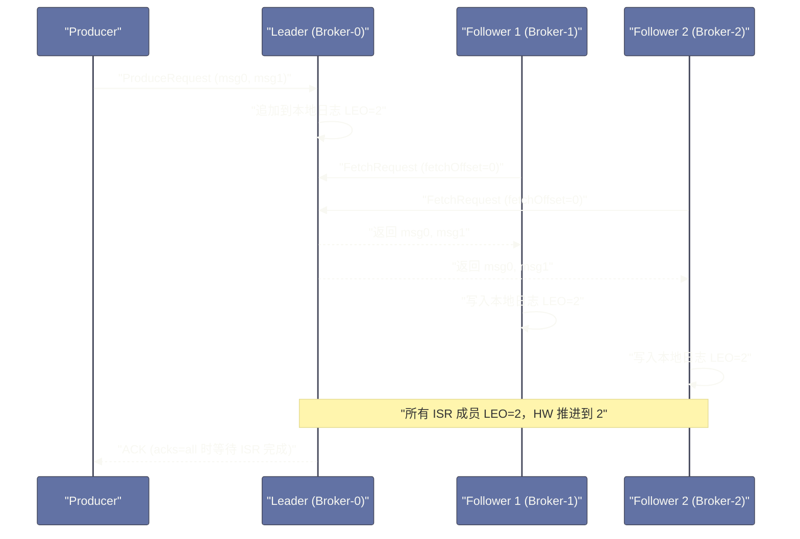

# 副本机制——ISR、HW 与 Leader Epoch

## 摘要

Kafka 的高可用依赖副本机制——每个 Partition 的数据在多个 Broker 上保有副本，Leader 宕机后从 ISR（In-Sync Replicas，同步副本集合）中选出新 Leader，业务影响降到最低。但副本同步不是简单的"复制数据"，其中涉及三个精妙的设计：**ISR** 动态筛选真正与 Leader 保持同步的 Follower，避免因个别慢副本阻塞 Producer；**High Watermark（HW）** 控制消费者可见的消息边界，防止消费到尚未提交的消息；**Leader Epoch** 解决了 HW 机制在特定场景下的数据截断（Data Loss）和数据不一致（Data Divergence）问题。理解这三个机制的来龙去脉，是理解 Kafka 如何在高吞吐与强一致性之间做精细权衡的关键。

---

## 第 1 章 副本的基本概念与同步流程

### 1.1 Leader 与 Follower 的职责划分

每个 Partition 的 N 个副本中，有且仅有一个 **Leader Replica**，其余是 **Follower Replica**。所有来自 Producer 的写入和来自 Consumer 的读取，都只与 Leader 交互——Follower 不对外提供任何服务，它们存在的唯一目的是**冗余备份**，在 Leader 失效时接替。

这与某些分布式系统（如 Elasticsearch、MySQL 读写分离）允许从节点提供读服务不同。Kafka 选择"只读 Leader"的原因：
- 消费者需要读到最新提交的消息，Follower 可能有同步延迟，从 Follower 读会导致消费者看到的消息有"时光倒流"的感觉（此刻读到的比刚才读到的旧）；
- 实现更简单——不需要处理读一致性问题；
- 实际上，Kafka 的水平扩展是通过增加 Partition 数量（每个 Partition 分布在不同 Broker），而不是通过读 Follower 来扩展读能力。

### 1.2 Follower 的同步机制：拉取而非推送

Follower 同步 Leader 的方式与 Consumer 消费的方式几乎完全相同——**主动向 Leader 发送 Fetch 请求**，拉取最新消息。这不是偶然的设计相似，而是刻意复用：Follower 的同步代码路径与 Consumer 的消费代码路径共享了大量实现，降低了代码复杂度。

Follower 的 Fetch 请求携带其当前的 LEO（Log End Offset，Follower 已写入的最大 Offset + 1），Leader 根据此值判断哪些消息需要返回给 Follower。



**LEO（Log End Offset）**：每个副本（包括 Leader 自身）维护的本地日志末尾位置，代表"该副本已写入的最新消息 Offset + 1"。LEO 是每个副本的"自己知道的进度"。

---

## 第 2 章 ISR：动态维护的同步副本集合

### 2.1 什么是 ISR，为什么需要它

**In-Sync Replicas（ISR）** 是与 Leader 保持"足够同步"的副本集合。Leader 本身始终在 ISR 中，Follower 根据同步情况动态加入或退出 ISR。

为什么需要 ISR 这个概念，而不是简单地"等所有副本都写入"？

设想一个极端场景：Partition 有 3 个副本（Leader + 2 个 Follower），`acks=all`。某个 Follower 因磁盘故障、网络问题或 Full GC 而同步严重滞后。如果 Leader 必须等待所有副本（包括这个慢副本）确认，那么每次写入的延迟都会被这个慢副本拖垮——一个故障节点会影响整个集群的写入性能。

ISR 的解法：**只等待 ISR 中的副本**，将明显落后的副本踢出 ISR。`acks=all` 语义变为"等待 ISR 中所有副本写入"，而不是"等待全部副本写入"。这样，一个故障副本被踢出 ISR 后，不再影响正常的写入流程，实现了可用性（Availability）与一致性（Consistency）的精细平衡。

### 2.2 ISR 的进入与退出规则

**退出 ISR（OSR，Out-of-Sync Replica）的条件**：

Follower 的 LEO 落后于 Leader LEO 的时间超过 `replica.lag.time.max.ms`（默认 30 秒）时，被踢出 ISR（加入 OSR 集合）。

注意这里的度量维度是**时间**，而不是落后的消息条数——Kafka 0.9 之前曾使用 `replica.lag.max.messages` 控制落后条数，但这个参数有缺陷：当 Producer 突发大量消息时，即使 Follower 同步正常，也可能因为来不及同步而被错误踢出 ISR，造成频繁的 ISR 抖动（ISR thrashing）。时间维度更稳定，只有持续落后才会被踢出。

**重新进入 ISR 的条件**：被踢出 ISR 的 Follower 追上 Leader 的 LEO 后，自动重新加入 ISR。Leader 在本地维护 ISR 集合，并将 ISR 变更持久化到 [[Zookeeper]]（或 KRaft 中的元数据日志）。

### 2.3 ISR 与可靠性的关系

ISR 的设计直接影响 `acks=all` 的实际保障强度：

**最坏情况**：所有 Follower 都落后超时，被踢出 ISR，ISR 中只剩 Leader 自己。此时 `acks=all` 退化为 `acks=1`——Leader 写入即 ACK，Follower 宕机不影响写入，但 Leader 宕机会丢数据。

这就是为什么生产环境需要配合 `min.insync.replicas` 使用：

```properties
# 至少需要 2 个 ISR 副本写入才认为成功
min.insync.replicas=2

# 如果 ISR 成员数量 < min.insync.replicas，Producer 写入会收到：
# NotEnoughReplicasException → 宁可拒绝写入，也不允许数据丢失风险
```

---

## 第 3 章 High Watermark：消费者可见的消息边界

### 3.1 为什么需要 High Watermark

Producer 写入消息到 Leader 后，这条消息可能还没有被任何 Follower 同步。如果 Consumer 立即读取这条消息，然后 Leader 在 Follower 同步之前宕机，新 Leader 从 Follower 中选出——新 Leader 没有这条消息，但 Consumer 已经消费了它。

这会导致一个严重问题：**消费者读到了 Kafka 认为"不存在"的消息**（因为选举后的 Leader 没有这条消息，它被"抹除"了）。从消费者视角看，这条消息"读到了又消失了"——破坏了消息队列的基本语义。

**High Watermark（HW，高水位）** 的作用就是解决这个问题：**HW 标记了所有 ISR 副本都已确认写入的最大 Offset**，Consumer 只能读取 HW 以下的消息（HW 之上的消息对 Consumer 不可见）。

```
Leader 日志视图：

Offset: 0  1  2  3  4  5  6
              ↑HW=3       ↑LEO=7

Consumer 只能消费 Offset 0, 1, 2（HW 以下）
Offset 3, 4, 5, 6 虽然存在于 Leader，但对 Consumer 不可见（等待 ISR 同步）
```

### 3.2 HW 的推进机制

HW 的推进由 Leader 负责计算。当 Follower 发送 FetchRequest 时，会携带自己的 LEO，Leader 以此更新对应 Follower 的"已知 LEO"。

**HW = min（所有 ISR 成员的 LEO）**

```
示例（replication.factor=3，ISR=[Leader, F1, F2]）：

Leader LEO = 10
F1 LEO = 8
F2 LEO = 9

HW = min(10, 8, 9) = 8

Consumer 只能消费 Offset 0..7
```

当 F1 的下一次 FetchRequest 将 LEO 更新到 9 时，HW = min(10, 9, 9) = 9，Consumer 可消费范围扩展到 Offset 0..8。

每次 Follower 的 FetchRequest 到达 Leader 时，Leader 都会重新计算 HW，并在响应中携带最新的 HW。Follower 收到响应后也更新自己本地记录的 HW。

### 3.3 HW 机制的两个经典 Bug

尽管 HW 机制从直觉上看是正确的，但在某些场景下（特别是 Leader 与 Follower 同时宕机重启）会出现严重问题。这正是 Kafka 引入 Leader Epoch 的原因。

**Bug 1：数据丢失（Data Loss）**

```
初始状态（replication.factor=2，acks=1）：
  Leader (B0): [m0, m1]  LEO=2, HW=2
  Follower (B1): [m0]    LEO=1, HW=1

步骤：
1. Producer 写入 m1，Leader B0 返回 ACK（acks=1，不等 Follower）
2. B1 发送 FetchRequest，获取 m1，写入本地：B1 LEO=2
3. B0 宕机，B1 被选为新 Leader
4. B1 从本地 HW=1 截断日志（截断 HW 以上的消息），
   B1 日志变为 [m0]，m1 被删除！
5. B0 重启，向新 Leader B1 同步，也截断到 HW=1
   → m1 永久丢失，但 Producer 已经收到了 ACK
```

关键问题：B1 在成为 Leader 前，其 HW=1（还没收到 B0 通知 HW 已推进到 2），所以截断了 m1。

**Bug 2：数据不一致（Data Divergence）**

类似场景，两个节点在宕机重启后可能出现相同 Offset 但不同内容的消息——Partition 在两个节点上的日志出现分叉，破坏了副本一致性的基本假设。

---

## 第 4 章 Leader Epoch：HW 机制的修正

### 4.1 Leader Epoch 的设计动机

HW 机制的 Bug 根本原因在于：**Follower 不知道它是否已经获取了 Leader 的最新 HW，也不知道当前的日志是否已经被"提交"（commit）了**。Follower 截断日志时使用的是自己的 HW，而这个 HW 可能已经过时。

**Leader Epoch** 是 Kafka 0.11 引入的修复方案。其核心思想是为每任 Leader 分配一个单调递增的整数编号（Epoch），每次 Leader 切换时 Epoch 加 1。每个 Broker 维护一个 **Leader Epoch Sequence（Leader 历史记录）**：`[(epoch0, startOffset0), (epoch1, startOffset1), ...]`，记录每个 Epoch 对应的 Leader 从哪个 Offset 开始写入。

### 4.2 Leader Epoch 如何修复数据丢失

引入 Leader Epoch 后，Follower 重启时**不再使用 HW 截断日志**，而是向当前 Leader 发送 **OffsetsForLeaderEpoch 请求**：

```
Follower 重启时的新流程：

1. Follower 向 Leader 发送：
   "我上次见到的 Leader Epoch 是 E，对应 LEO 是 X，请告诉我该截断到哪里"

2. Leader 响应：
   "Epoch E 的日志结束于 Offset Y"

3. Follower 比较：
   - 如果自己的 LEO <= Y：不需要截断，直接从 LEO 位置继续同步
   - 如果自己的 LEO > Y：截断到 Y，然后继续同步（Y 以上的消息是未提交的，应该丢弃）
```

以修复数据丢失 Bug 为例：

```
引入 Leader Epoch 后的同一场景：
  B0（Leader，Epoch=1）：[m0, m1]  LEO=2, HW=2
  B1（Follower，Epoch=1）：[m0, m1]  LEO=2, HW=1（还没收到 HW 更新）

B0 宕机，B1 被选为新 Leader（Epoch=2）：
  B1 不截断日志！它的 LEO=2，m1 保留。

B0 重启，向新 Leader B1 发送 OffsetsForLeaderEpoch：
  "我知道的 Epoch=1 对应的 LEO 是多少？"
  B1 响应："Epoch=1 的最终 LEO=2"
  
B0 发现自己的 LEO=2 == 2，不需要截断
B0 作为 Follower 向 B1 同步，最终 [m0, m1] 在两个节点上一致。
m1 没有丢失！
```

### 4.3 Unclean Leader Election：可用性与一致性的最终抉择

如果所有 ISR 副本都宕机了怎么办？此时 Kafka 面临两种选择：

**选项 A（默认，`unclean.leader.election.enable=false`）**：等待 ISR 中的某个副本重新上线。优先保证**数据一致性**，但在等待期间 Partition 不可用（写入失败），影响可用性。

**选项 B（`unclean.leader.election.enable=true`）**：允许从 OSR（落后的副本）中选出新 Leader，恢复可用性，但该副本可能缺少最近写入的消息，会发生**数据丢失**。

这是经典的 CAP 理论在工程中的直接体现——在分区（P）不可避免的前提下，只能在一致性（C）和可用性（A）之间选择。Kafka 默认选择 C（数据一致性），这是消息队列场景的合理默认值。某些日志采集场景（丢几条日志可接受）可以开启 Unclean Election 以保障可用性。

> [!warning] 生产避坑：Unclean Election 带来的数据不一致
> 即使开启了 `unclean.leader.election.enable=true`，也要理解它的代价：不只是可能丢消息，还可能产生数据分叉（不同 Consumer 在不同时间点读到不同版本的数据）。对于金融类或需要精确审计的业务场景，**绝对不要开启** Unclean Election。

---

## 总结

本篇系统剖析了 Kafka 副本机制的三个核心设计：

**ISR（In-Sync Replicas）**：动态筛选真正同步的副本集合。`acks=all` 只等 ISR 成员，避免单个慢副本拖慢整体写入。`min.insync.replicas` 设置 ISR 的最小数量，在 ISR 萎缩时宁可拒绝写入也不允许数据丢失风险。

**High Watermark（HW）**：ISR 所有成员 LEO 的最小值，作为消费者可见消息的上界。防止消费者读到尚未在所有 ISR 副本上落地的消息，避免 Leader 切换后消费到"幻影消息"的问题。

**Leader Epoch**：每次 Leader 切换递增，记录每个 Epoch 的起始 Offset。Follower 重启时通过 `OffsetsForLeaderEpoch` 请求确定正确的截断点，彻底修复了 HW 机制在并发宕机场景下的数据丢失和数据分叉 Bug。

下一篇深入 Kafka Controller 的职责与 KRaft 去 ZooKeeper 的架构演进：[[06 Controller 与集群管理——从 ZooKeeper 到 KRaft]]。

---

> [!note] 参考资料
> - Apache Kafka 文档,《Replication》
> - KIP-101: Alter Replication Protocol to use Leader Epoch rather than High Watermark for Truncation
> - Confluent Blog,《Kafka Internals: Topics, Partitions, Replication》
> - 《Kafka: The Definitive Guide》, Chapter 5
