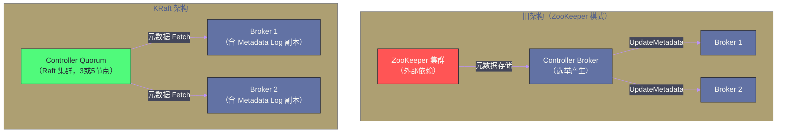

# Controller 与集群管理——从 ZooKeeper 到 KRaft

## 摘要

Kafka 集群的"大脑"是 **Controller**——它是 Broker 集群中被选举出来的一个特殊节点，负责管理所有 Partition 的 Leader 选举、Broker 的上线/下线感知，以及将集群元数据变更广播给所有 Broker。在 Kafka 2.x 及之前，Controller 的选举和元数据存储依赖 [[Zookeeper]]；而 Kafka 3.x 引入的 **KRaft 模式**（Kafka Raft）彻底去除了对 ZooKeeper 的依赖，将元数据管理内化为 Kafka 自身的 Raft 共识日志。这一架构变迁不只是"换掉 ZooKeeper"的工程迁移，更是 Kafka 元数据管理范式的根本性转变——从"外部协调依赖"到"自主共识"。本文深入剖析 Controller 的职责边界、基于 ZooKeeper 的老架构痛点，以及 KRaft 如何通过 Metadata Log 彻底解决这些问题。

---

## 第 1 章 Controller 的职责

### 1.1 Controller 是什么，做什么

**Controller** 是 Kafka 集群中在所有 Broker 中通过选举产生的**单一协调者节点**。Controller 并不是一个独立进程，而是某个 Broker 节点上的一个特殊角色——这个 Broker 既提供普通的消息读写服务，也承担 Controller 的协调职责。

Controller 的核心职责：

**职责一：分区 Leader 选举**。当某个 Broker 宕机时，该 Broker 上所有作为 Leader 的 Partition 都失去了 Leader。Controller 负责为这些 Partition 从 ISR 中选出新 Leader，并将新的 Leader 信息广播给所有相关 Broker（让 Producer 和 Consumer 知道应该连哪个 Broker）。

**职责二：ISR 变更管理**。Controller 接收 Leader Broker 上报的 ISR 变更（某个 Follower 落后太多被踢出 ISR），持久化到元数据存储，并同步给其他 Broker。

**职责三：Broker 上线/下线感知**。Controller 监听 Broker 的注册信息（在 ZK 模式下监听 ZooKeeper 的 `/brokers/ids` 路径），感知 Broker 集群的成员变化，触发必要的 Leader 重新分配。

**职责四：Topic 生命周期管理**。Topic 的创建、删除、Partition 扩容——这些元数据变更通过 Controller 协调，确保所有 Broker 的视图一致。

**职责五：元数据广播**。Controller 是集群元数据的"分发中心"——当任何元数据变更（新增 Partition、Leader 切换、ISR 变化）时，Controller 将变更通过 `UpdateMetadata` 请求广播给所有 Broker，让每个 Broker 都维护最新的集群视图。

### 1.2 Controller 选举机制（ZooKeeper 模式）

在传统的 ZooKeeper 模式中，Controller 的选举方式极为简单：所有 Broker 启动时都争抢在 ZooKeeper 上创建临时节点 `/controller`。ZooKeeper 保证只有一个 Broker 能创建成功，这个 Broker 成为 Controller。

其他 Broker 监听 `/controller` 节点的变化——当 Controller Broker 宕机时，ZK 临时节点自动消失，所有 Broker 立即感知，再次争抢创建 `/controller`，完成新一轮选举。

这种选举方式的优点是简单、自然；缺点是依赖 ZooKeeper，引入了外部组件的复杂性。

---

## 第 2 章 基于 ZooKeeper 的传统架构及其痛点

### 2.1 ZooKeeper 在 Kafka 中的多重角色

在 Kafka 2.x 及之前，ZooKeeper 承担了大量职责：

```
ZooKeeper 节点结构（简化）：

/kafka
├── /brokers
│   ├── /ids               ← Broker 注册（临时节点）
│   │   ├── /0             ← Broker-0 的连接信息
│   │   └── /1             ← Broker-1 的连接信息
│   └── /topics
│       └── /orders        ← Topic 元数据
│           └── /partitions
│               └── /0     ← Partition 0 的状态
│                   └── /state ← Leader、ISR 信息
├── /controller            ← Controller 选举（临时节点）
├── /consumers             ← Consumer Group Offset（旧版）
└── /config                ← Broker/Topic 动态配置
```

ZooKeeper 实质上是 Kafka 的**外置数据库**——存储集群元数据、承担 Leader 选举的协调工作、提供 Watch 机制实现变更通知。

### 2.2 ZooKeeper 依赖的三大痛点

**痛点一：元数据更新路径长，Controller Failover 慢**

当 Controller 宕机时，新 Controller 上任后需要从 ZooKeeper 读取**全量元数据**才能开始工作。对于拥有数万个 Partition 的大规模集群，从 ZK 加载全量元数据可能需要数十秒甚至更长时间。在这段时间内，集群无法响应 Broker 变化——如果在 Controller Failover 期间有其他 Broker 宕机，这些 Partition 的 Leader 选举会被延迟，影响可用性。

**痛点二：ZooKeeper 与 Broker 的元数据双写不一致**

每次 ISR 变更、Leader 切换，都需要：
1. Leader Broker 将变更写入 ZooKeeper；
2. Controller 从 ZooKeeper 读取变更；
3. Controller 将变更广播给所有 Broker（通过 `UpdateMetadata` 请求）。

这个三步流程是**异步的**，存在窗口期——ZK 中的数据和各 Broker 缓存的元数据可能短暂不一致。在高变化率场景（大量 Leader 切换）下，这种不一致可能持续较长时间。

**痛点三：运维复杂度高**

部署和维护 Kafka 集群需要同时维护 ZooKeeper 集群（通常 3 或 5 节点）——这是两个不同的分布式系统，需要各自的监控、告警、升级和备份流程。对于中小团队，这是显著的运维负担。ZooKeeper 本身的调优（JVM 参数、磁盘 IO、会话超时配置）也需要专门的经验积累。

> [!info] 核心概念：为什么不是早点去掉 ZooKeeper
> Kafka 对 ZooKeeper 的依赖根深蒂固——不只是 Controller 选举，而是整个元数据管理体系都构建在 ZK 之上。去除 ZK 意味着 Kafka 必须自己实现：分布式一致性（Raft 协议）、Leader 选举、元数据持久化——这是一个"重新造轮子"级别的架构工程，也是为什么这件事直到 Kafka 2.8（2021年预览）才出现。

---

## 第 3 章 KRaft 模式：Kafka 的自主共识

### 3.1 KRaft 的核心架构变化

KRaft（Kafka Raft）将元数据管理从 ZooKeeper 迁移到 **Kafka 自身的 Raft 日志**。核心变化：



**KRaft 的关键设计**：

**Controller Quorum**：KRaft 引入了一个 3 或 5 节点的 Controller Quorum（可以是专用 Controller 节点，也可以是兼任 Controller 的 Broker 节点）。这些节点通过 **Raft 共识协议**选举出一个 Active Controller（相当于 Raft 的 Leader），其余为 Standby Controller（相当于 Follower）。

**Metadata Log**：所有集群元数据变更都以事件（Event）的形式追加到一个特殊的 Topic `__cluster_metadata` 中，这本质上是一个 Raft 复制的日志。Active Controller 是这个 Topic 的 Leader，变更必须经过 Raft 多数派确认才能提交——这保证了元数据的强一致性。

**Broker 的 Metadata Cache**：每个 Broker 通过订阅 `__cluster_metadata` Topic 实时接收元数据变更，在本地维护完整的元数据缓存。与 ZK 模式不同，Broker 不再被动等待 Controller 广播，而是**主动从 Controller Quorum 拉取最新元数据**——这与 Consumer 消费 Topic 的机制完全相同，极大降低了实现复杂度。

### 3.2 KRaft 解决的三大问题

**问题一解决：Controller Failover 秒级完成**

在 KRaft 模式下，所有 Standby Controller 都已经持有完整的 Metadata Log 副本，无需从外部存储加载全量元数据。当 Active Controller 宕机时，新的 Active Controller（从 Standby 中选出）可以立即开始服务——Failover 时间从"数十秒"降低到"毫秒级"。

**问题二解决：元数据强一致性**

所有元数据变更通过 Raft 日志进行，Raft 保证了**线性一致性（Linearizability）**——所有节点按相同顺序看到相同的元数据变更序列，不再有 ZK 模式下的三步异步更新问题。

**问题三解决：运维简化**

去掉 ZooKeeper 后，整个 Kafka 集群只需要维护一种进程（Kafka Broker），运维复杂度显著降低。特别是容器化部署场景（Kubernetes）中，不再需要单独管理 ZooKeeper StatefulSet。

### 3.3 KRaft 的部署模式

**Combined 模式**：Controller 和 Broker 角色部署在同一进程中。适合小规模集群（3-5 节点），每个节点既处理消息读写，又参与 Controller 选举。这是官方推荐的**开发和测试**部署方式。

**Isolated 模式**：Controller Quorum 是专用节点（不接受 Producer/Consumer 流量），Broker 是另一组专用节点（不参与 Controller 选举）。适合**生产大规模集群**，Controller 节点资源专用，不受业务流量波动影响。

```bash
# KRaft 模式的 server.properties 关键配置

# Combined 模式（单个节点同时是 Controller 和 Broker）
process.roles=broker,controller

# Isolated 模式（专用 Controller 节点）
process.roles=controller

# Controller Quorum 的成员列表（3 节点示例）
controller.quorum.voters=1@kafka-1:9093,2@kafka-2:9093,3@kafka-3:9093

# 节点 ID（全局唯一）
node.id=1
```

### 3.4 版本演进与生产就绪时间线

| Kafka 版本 | KRaft 状态 | 说明 |
| --- | --- | --- |
| 2.8 | Early Access | 首次引入，不可用于生产 |
| 3.0-3.2 | Preview | 功能逐步完善，仍不推荐生产 |
| 3.3 | 生产就绪（部分功能）| 官方宣布可用于生产，但仍有限制 |
| 3.4+ | 全面可用 | 支持从 ZK 模式迁移到 KRaft |
| 4.0（计划）| 移除 ZK 支持 | ZooKeeper 模式将被完全移除 |

> [!warning] 生产避坑：迁移 KRaft 前的准备
> 从 ZooKeeper 模式迁移到 KRaft 是不可逆的单向操作（迁移后无法回退到 ZK 模式）。迁移前必须：(1) 确保 Kafka 版本 ≥ 3.4；(2) 备份所有 ZooKeeper 数据；(3) 在测试环境充分验证；(4) 准备回滚预案（如恢复到 ZK 模式的快照）。官方提供 `kafka-storage.sh` 工具辅助迁移，但不要在不了解迁移流程的情况下轻易在生产环境执行。

---

## 总结

本篇系统梳理了 Kafka 集群管理的核心机制与架构演进：

**Controller 的职责**：分区 Leader 选举、ISR 变更管理、Broker 上下线感知、Topic 生命周期管理、元数据广播——Controller 是集群协调的单点大脑，其稳定性直接影响集群的可用性。

**ZooKeeper 模式的痛点**：Controller Failover 慢（需重新加载全量元数据）、ZK 与 Broker 之间的元数据异步不一致、运维需要同时维护 ZooKeeper 和 Kafka 两套系统。

**KRaft 模式的核心设计**：Controller Quorum 通过 Raft 协议选出 Active Controller，所有元数据变更以事件形式追加到 `__cluster_metadata` Raft 日志，Broker 主动拉取元数据（与 Consumer 机制一致）。解决了 Failover 慢、不一致、运维复杂三大问题。

下一篇深入 Exactly-Once 语义的完整实现路径：[[07 消费语义——Exactly-Once 的实现路径]]。

---

> [!note] 参考资料
> - KIP-500: Replace ZooKeeper with a Self-Managed Metadata Quorum
> - Apache Kafka 文档,《KRaft: Apache Kafka Without ZooKeeper》
> - Confluent Blog,《Apache Kafka Beyond 1 Million Partitions》
