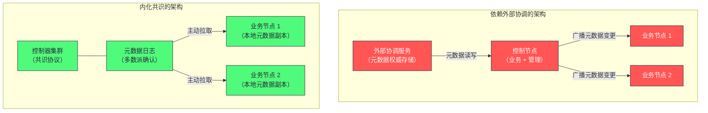

# 06 Controller 与集群管理——从 ZooKeeper 到 KRaft

**摘要：**

集群管理要回答一个基础问题：**"谁来决定集群的全局状态"？** 比如"某个分区的数据在哪个节点上""某个节点下线后哪些分区需要换主""新增一个主题后各节点如何知道"。这些决策有一个共同特征——**它们必须是全局一致的**，而"让每个节点自己决定"会导致互相冲突。因此需要一个"大脑"，而这个大脑本身也必须可靠。本文按"大脑是什么 → 大脑依赖谁 → 大脑如何自治"展开。先讲集群管理需要集中决策的三件事，以及"集中"带来的单点风险；再拆解 Controller 的五项职责与它的选举方式；然后剖析依赖外部协调服务的架构——外部服务承担了哪些角色、为什么它能工作、以及它带来的三条痛点（故障转移慢、元数据双写不一致、运维复杂）。接着讲内化共识的架构如何用"元数据日志 + 主动拉取"替代"外部存储 + 被动广播"，以及它如何同时解决三条痛点。之后是两种部署模式的选型、元数据规模这个被低估的约束、版本演进与迁移的单向性、以及集群管理的监控与常见故障。最后是边界与常见误判。

---

## 第 1 章 集群为什么需要一个"大脑"

### 1.1 需要集中决策的三件事

在 Kafka 的机制里，有三类决策**必须由集群统一做出**，而不能由各个节点自行决定。

**第一类是"谁负责哪个分区的读写"。** 每个分区的多个副本中必须确定一个主副本，且**所有节点对"谁是主副本"的认知必须一致**——否则生产者可能把消息发给 A、消费者却从 B 读，或者两个节点都认为自己有权接受写入。

**第二类是"同步副本集合是什么"。** 第 5 篇讲过，这个集合决定"写入需要等几个副本确认"。如果不同节点对集合的认知不一致，那么"写入是否安全"的判断就没有统一标准。

**第三类是"集群里有哪些主题、每个主题有多少分区"。** 主题的创建与分区扩容会改变"数据如何分布"，因此所有节点都必须知道变更后的结果。

**三类决策的共同特征是"它们是全局事实，而不是局部事实"。** 而"全局事实"必须有一个权威来源——**这就是集群需要"大脑"的根本原因。**

### 1.2 为什么不能"各节点自己决定"

一个自然的疑问是：能不能让每个节点根据自己观察到的信息自行判断，而不需要一个中心决策者？

**不行，因为不同节点观察到的信息可能不同。** 网络延迟与故障会让"某个节点是否还活着"这件事在不同观察者眼里有不同答案——**节点 A 认为 B 挂了，节点 C 可能还能连上 B。** 如果各自据此决策，就会出现"A 把 B 的分区接管了，而 C 仍然认为 B 还在服务"这种冲突状态。

**这类冲突的后果很严重**：两个节点同时认为自己是一个分区的主副本，各自接受写入，**于是同一个分区产生了分叉的日志**（第 5.2 节讲的场景）。

**因此需要一个"唯一的决策者"来消解这种分歧**——即使它的判断可能出错，但**"统一的错误"比"各自为政"更容易被纠正**。这是"中心化决策"在分布式系统里依然必要的原因。

### 1.3 "大脑"的代价

集中决策的代价有三处，理解它们有助于理解后续架构演进的方向。

**代价一：单点风险。** 如果决策者失效，集群就无法响应"节点变化"这类事件——**表现为"某个节点挂了但它的分区长期没有新主副本"。**

**代价二：决策者需要完整信息。** 它必须知道集群的全部拓扑与元数据，因此**它的启动与恢复需要加载全量元数据**——而元数据越多，这个过程越慢。

**代价三：决策结果需要被传播。** 决策做完之后，所有节点都要知道结果。**传播路径的长度直接决定"集群多久能达到一致状态"。**

**三处代价恰好对应后续架构演进的三个改进方向**：用"多副本 + 共识"缓解单点风险；用"常驻副本"消除加载全量元数据的时间；用"主动拉取"缩短传播路径。**因此理解这三处代价，就能理解为什么架构会这样演进。**

### 1.4 一个类比：议事与传达

把集群管理类比成"议事"会更容易理解它的结构。

**"议事"需要一个议长**——否则每个人各说各话，无法形成统一决议。这个议长就是 Controller。

**议长需要掌握全部议题的背景**——否则无法做出正确决议。这就是"决策者需要完整信息"（代价二）。

**决议形成后必须传达给所有人**——否则各人按自己的理解行动。这就是"决策结果需要被传播"（代价三）。

**议长本人可能缺席**——此时需要有人立刻接替，且接替者必须能立刻开始议事（而不是先花时间把所有背景资料读一遍）。这就是"单点风险"与"常驻副本"要解决的问题。

**这个类比的用处在于"它把三个改进方向变成了三个自然的问题"**：怎么保证议长缺席时立刻有人接替？怎么让接替者不必重读资料？怎么让决议传达得更快？**而这三问的答案分别对应"控制器集群""元数据常驻副本""主动拉取"。**

### 1.5 集中决策换来了什么

代价之外，集中决策带来的收益也值得明确——否则容易在"避免单点"的直觉下走向另一个极端。

**收益一：冲突被消解。** 只有一个决策者，因此不会出现"两个节点都认为自己是主副本"这类冲突。**这直接保证了"同一位置只有一种内容"这个基本假设**（第 5 篇讲的数据分叉正是这个假设被破坏的后果）。

**收益二：决策可以基于全局信息。** 决策者掌握完整拓扑，因此能做出"局部视角做不到"的判断——例如"某个节点下线后，它的分区应该分散到哪些节点上"（这需要考虑各节点的当前负载与副本分布）。

**收益三：变更可以有序进行。** 元数据变更由一个点发起、按统一顺序传播，因此所有节点看到的是同一个变更序列。**这正是"元数据线性一致"这个性质的来源。**

**三条收益共同说明：集中决策不是"为了简单"而做的妥协，而是"为了正确性"的必要设计。** 因此"消除单点"的正确方向不是"取消中心决策"，而是"让中心决策本身更可靠"——**这正是"控制器集群 + 共识"这个改进方向所做的事。**

---

## 第 2 章 Controller 的职责

### 2.1 五项职责

集群的"大脑"在 Kafka 里叫 **Controller**，它承担五项职责。

**职责一：分区主副本选举。** 当某个节点下线时，它上面作为主副本的所有分区都需要选出新的主副本。Controller 负责从各分区的同步副本集合中选出新主副本，并把结果通知相关节点。

**职责二：同步副本集合的变更管理。** 各分区的主副本会把"某个从副本掉队了/追上了"上报给 Controller，由它持久化并同步给其他节点。

**职责三：节点上下线感知。** Controller 感知集群成员的变化，并触发必要的重新分配。

**职责四：主题生命周期管理。** 主题的创建、删除、分区扩容都由 Controller 协调，确保所有节点看到一致的结果。

**职责五：元数据分发。** 任何元数据变更（新增分区、主副本切换、集合变化）都由 Controller 分发给所有节点，让每个节点维护最新的集群视图。

**五项职责可以归为两类**：前四项是"做决策"，第五项是"传播决策"。**而"传播"这一项的存在，正是第 1.3 节讲的"代价三"的具体形态。**

### 2.2 Controller 不是一个独立进程

一个容易被误解的地方是：**Controller 不是一套单独的进程，而是某个节点上的一个"特殊角色"。**

也就是说，**承担 Controller 职责的那个节点同时还在正常服务生产者的写入与消费者的读取**。这个设计让部署更简单（不需要为 Controller 单独规划资源），但它带来一个需要留意的耦合：**Controller 所在节点的负载会影响集群管理操作的响应速度**——如果该节点同时承载着大量业务流量，那么"主副本选举"这类管理操作可能变慢。

**这个耦合在大规模集群里会更明显**：节点越多、分区越多，Controller 需要处理的元数据变更越频繁，而它与业务流量共享同一份资源。**这也是"分离部署模式"（第 5 章）存在的理由之一。**

### 2.3 单点的风险与缓解

Controller 是单点——同一时刻只有一个节点承担这个角色。它的风险在于"失效期间集群无法响应节点变化"。

缓解手段是"**快速重新选举**"：其他节点持续监控 Controller 的状态，一旦它失效就立刻选出新的。**因此 Controller 的可用性取决于"检测失效的速度"与"新 Controller 就绪的速度"。**

**而"新 Controller 就绪"这个环节正是第 1.3 节讲的"代价二"**——新 Controller 必须先把集群的全量元数据加载到内存，才能开始做决策。**因此"元数据加载耗时"直接决定了"故障转移的停机窗口"。**

**这条链条值得记住**：元数据规模 → 加载耗时 → 故障转移窗口 → 集群的可用性。**它解释了为什么"元数据规模"是一个需要被管理的约束**（第 6 章），而不只是一个"存储细节"。**把"某个配置项"与"某个可用性后果"连起来，是理解分布式系统配置的正确方式。**

### 2.4 两种架构下的选举机制

Controller 的选举机制在两种架构下完全不同，理解这个差异有助于理解"内化"到底改了什么。

**外部协调架构下的选举**：所有节点争抢在外部服务上创建一个临时节点，**谁创建成功谁就是 Controller**。这个机制的巧妙之处在于"临时节点"的语义——**节点失效时临时节点自动消失**，因此其他节点立刻感知并重新争抢。**选举的"检测失效"这一步被外部服务的会话机制接管了。**

**内化共识架构下的选举**：控制器集群内部的节点通过共识协议选出一个活动控制器。**选举、失效检测、状态复制都由共识协议统一处理**——因此不再需要"临时节点"这类特殊机制。

**两种机制的差异可以概括为"借用"与"自建"**：前者借用了外部服务的"临时节点 + 会话"能力，后者把"选举与失效检测"纳入自己的共识协议。**而从工程角度看，后者的收益是"不必再维护一个外部系统"，代价是"必须自己把共识实现做对"。**

---

## 第 3 章 依赖外部协调的架构

### 3.1 外部协调服务承担的角色

早期架构把"集群元数据的存储与协调"交给了一个**外部的协调服务**（ZooKeeper）。它承担的角色有三个。

**角色一：元数据的权威存储。** 主题、分区、副本分布、集合状态、配置变更都记录在它的节点树里。

**角色二：选举的协调者。** Controller 的选举利用了它"临时节点唯一性"的能力——多个节点争抢创建同一个临时节点，只有一个能成功，成功者即为 Controller；一旦该节点失效，临时节点自动消失，其他节点立刻感知并重新争抢。

**角色三：变更的通知机制。** 它提供"监听"能力——节点可以订阅某个路径的变化，从而在元数据变更时被通知。

**三个角色合起来，外部协调服务实际上是 Kafka 的"外置数据库加协调器"。** 这个设计在早期是合理的：**它复用了成熟的协调服务，而不需要自己实现共识算法**——而后者正是分布式系统里最难的部分。

### 3.2 这个架构为什么能工作

它的优点是"**用成熟组件解决难题**"：共识、选举、通知这三件事都有现成的实现，Kafka 只需要定义"把什么数据放在哪里"。

**因此它在很长时间里是唯一选择**——直到"自己实现共识"的成本被证明是可接受的（第 4 章）。

**这也解释了一个常见的架构现象：系统早期倾向于"复用外部能力"，成熟后才倾向于"内化关键依赖"。** 前者的收益是"快速可用"，后者的收益是"部署与运维的简化"——**两者都是理性的，只是适用的阶段不同。**

### 3.3 三条痛点

随着集群规模增长，外部协调架构暴露出三条痛点。

**痛点一：故障转移慢。** 新 Controller 上任后需要从外部存储读取全量元数据才能工作。**分区数量越多，这个加载过程越慢**——在大规模集群里可能达到数十秒。而在这段时间内，集群无法响应任何节点变化——**如果此时又有节点故障，其分区的主副本选举会被延迟。**

**痛点二：元数据双写不一致。** 每次元数据变更都要走三步：**主副本写入外部存储 → Controller 读取变更 → Controller 广播给所有节点。** 这三步是异步的，因此存在窗口期——**在这个窗口内，外部存储里的数据与各节点缓存的视图可能不一致。** 在高变化率场景（大量主副本切换）下，这种不一致可能持续较长时间。

**痛点三：运维复杂度高。** 部署一套集群需要同时维护两个分布式系统——**两套监控、两套告警、两套升级流程、两套备份策略。** 对中小团队，这是显著负担；对容器化部署，还意味着多一套需要管理的有状态工作负载。

**三条痛点的共同根源是"元数据管理被拆到了两个系统里"。** 因此改进方向也很明确——**把元数据管理收回自己手里。**

### 3.4 为什么长期没有改

一个自然的疑问是：既然痛点明确，为什么这个架构维持了很长时间？

**因为"自己实现共识"的代价很高。** 它意味着要从零实现：**分布式一致性算法、主副本选举、元数据持久化与快照、成员变更处理**——这些是分布式系统里最难的几类问题，而且**任何一处实现错误都会导致数据不一致**，而这类问题的排查成本极高。

**因此"复用外部协调服务"在很长时间里是理性选择**：它用"多维护一个系统"的运维成本，换取了"不必自己实现共识"的实现成本。**只有当集群规模增长到"故障转移慢"成为实际瓶颈时，内化的收益才超过成本。**

**这条演进逻辑值得留意：架构演进往往不是"新方案更好"，而是"约束条件变了"。** 早期"快速可用"是主要矛盾，因此复用外部能力；后期"大规模下的可用性与运维"成为主要矛盾，因此内化关键依赖。**同一个团队在不同阶段会做出相反的选择，而两者都可能是对的。**

### 3.5 外部协调服务自身的可靠性

一个容易被忽略的点是：**引入外部协调服务，也就把它的可靠性纳入了整个系统的可靠性链。**

具体来说，**外部协调服务不可用会导致 Controller 无法选举、元数据无法更新**——因此它的可用性要求不低于集群本身。这意味着**它也需要多副本部署、也需要监控与告警、也需要升级与备份**——**这正是"运维复杂度高"这条痛点的具体内容。**

**"引入一个依赖，就引入了它的全部运维负担"**——这条规律在分布式系统里普遍成立。**因此评估一个架构时，不能只算"它能解决什么问题"，还要算"它带来了哪些新的运维对象"。** 这也是第 4 章讲的"内化"为什么有价值的根本原因：**它减少的不只是组件数量，而是一整套运维负担。**

### 3.6 三条痛点的优先级

三条痛点在不同规模下的严重程度不同，这解释了"什么时候该考虑迁移"。

**小规模集群（数十个节点、数千个分区）**：三条痛点都不明显——**故障转移的加载时间很短、元数据变更不频繁、运维负担尚可承受。** 此时迁移的收益有限。

**中大规模集群（上百节点、数万到数十万分区）**：**"故障转移慢"最先成为实际瓶颈**——因为它直接决定了"节点故障后的恢复时间"，而这与可用性直接相关。**此时迁移的收益开始显现。**

**超大规模集群（分区数达到百万量级）**：**"元数据双写不一致"与"运维复杂度"的影响也会被放大**——前者在高变化率下更容易暴露，后者的绝对工作量随集群数增长。

**这个优先级排序的实用价值在于"它回答了'我的集群该不该迁移'"**：如果分区数还在数千量级且节点变化不频繁，那么迁移的紧迫性不高；**如果已经出现"节点故障后恢复要等几十秒"的体验，那就是明确的迁移信号。**

---

## 第 4 章 内化共识的架构

### 4.1 核心变化

内化共识的架构（即 KRaft 模式）做了三件事。

**其一，用一组专门的节点组成"控制器集群"**，它们之间通过共识协议选出一个"活动控制器"（相当于共识协议里的主），其余是"备用控制器"。

**其二，把所有元数据变更写入一个内部的元数据日志**，这个日志本身就是被共识协议复制的——因此元数据的写入需要多数派确认，天然具备强一致性。

**其三，让所有节点主动从控制器集群拉取元数据**，而不是被动等待广播。

**三件事分别对应三条痛点**：控制器集群解决"单点风险"，元数据日志解决"双写不一致"，主动拉取解决"传播路径长"。

### 4.2 架构对比图

把两种架构并列画出来，能更清楚地看出"依赖方向"的改变。

**图中最值得注意的是"箭头方向的变化"**：旧架构里，元数据的流向是"控制节点广播给业务节点"（推送）；新架构里，是"业务节点从元数据日志拉取"（拉取）。**这个方向变化对应第 4.3 节要讲的"把状态维护责任转移给接收方"。**

**另一处变化是"依赖的位置"**：旧架构的元数据在集群之外的独立系统里，新架构的元数据在集群之内。**这个位置变化带来的是"故障域的变化"**——旧架构里"外部服务故障"是独立的一类故障，新架构里"元数据故障"与"集群故障"合并成了一类，**管理上更集中，但也意味着集群自身要承担元数据的可靠性责任。**

### 4.3 元数据日志：把元数据当作数据

这个架构最核心的一步是**"把元数据当作数据来存储"**——用与业务消息相同的机制（日志 + 副本 + 共识）来管理元数据。

这个选择的收益有三层。**其一，复用已有的机制**（日志存储、副本复制、快照压缩），不需要为元数据单独设计一套存储。**其二，天然具备强一致性**（因为写入要经过多数派确认），消除了"双写不一致"的窗口。**其三，可扩展性更好**（因为日志可以分段、可以压缩快照，因此元数据规模的上限更高）。

**"把元数据当作数据"这个手法在本专栏里已经出现过**：第 4 篇讲过"消费进度也存在一个内部主题里"。**两者是同一个思路——用统一的机制处理"看起来特殊"的数据，从而避免为特殊情况单独设计。** 这个思路的价值在于**它把"新增一种数据"的成本降低到"几乎为零"**，因为不需要新的存储机制。

### 4.3 主动拉取替代被动广播

第二个关键变化是**传播方向的改变**：从"控制器主动推送给所有节点"变成"节点主动从控制器拉取"。

这个改变带来两个收益。**其一，传播路径更短**（从"控制器逐个通知"变成"节点自己来取"），且**节点可以按自己的节奏拉取**，不需要控制器维护"每个节点同步到哪了"这个状态。**其二，它复用了消费的代码路径**——节点拉取元数据与消费者拉取消息在机制上几乎相同。

**"把推送改成拉取"这个改变的意义容易被低估。** 推送模式要求"发送方知道所有接收方的状态"，因此发送方必须维护一份"谁同步到哪了"的列表——**而这个列表在节点频繁变化时很难维护正确。** 拉取模式则把这个状态转移给了接收方（"我自己知道拉到哪了"），**发送方只需要响应请求**。

**这与第 1 篇讲的"消费进度由消费者维护"、第 5 篇讲的"副本同步用拉取"是同一个设计取向：把状态维护的责任交给"需要这个状态的一方"。** 这条取向在本专栏里反复出现，**因为它是降低协调复杂度的通用手段。**

### 4.4 三项改进的实际效果

三项变化带来的实际效果如下。

**故障转移从"数十秒"降到"毫秒级"**——因为备用控制器已经持有完整的元数据日志副本，**不需要再从外部加载**。这是第 1.3 节"代价二"被消除的直接结果。

**元数据具备线性一致性**——所有变更按同一顺序被所有节点看到，不存在"双写窗口"。这是第 3.3 节"痛点二"被消除的结果。

**运维面收缩为一个系统**——不再需要维护外部的协调服务集群。这是"痛点三"被消除的结果。

**三项改进的关系是"一因多果"**：它们的共同来源是"元数据被纳入自己管理"这一个决定。**这与第 1.3 节"三处代价对应三个改进方向"的对应关系是一致的**——**理解了代价的构成，就能预测改进的方向。**

### 4.5 快照与日志的配合

元数据日志不能无限增长，因此需要"快照"机制配合——这与第 2 篇讲的日志段与压实是同一类思路。

**日志记录"变更"，快照记录"某个时刻的完整状态"。** 恢复时先加载快照，再重放快照之后的日志，就能重建出当前状态。**因此"日志从哪个位置开始"由快照决定**——快照之后的部分才需要重放。

**这个机制的价值在于它把"恢复时间"与"历史变更总量"解耦**：无论历史上发生了多少变更，恢复时间只取决于"最近一次快照之后的日志量"。**因此定期做快照是保证"恢复足够快"的必要手段。**

**"日志 + 快照"这个组合是几乎所有"需要持久化状态"的系统的标配**：数据库的预写日志与检查点、LSM-Tree 的日志与 SSTable、以及这里的元数据日志与快照——**它们解决的是同一个问题：如何让"重放历史"的成本不随时间无限增长。**

---

## 第 5 章 部署模式与选型

### 5.1 合并模式

**合并模式**让同一批节点既承担控制器角色、又承担业务角色（既参与集群管理，又处理消息读写）。

**它的优点是部署简单**（节点数量少、配置一致），适合小规模集群与开发测试环境。**它的缺点是控制器与业务共享资源**——业务流量的波动会影响集群管理操作的响应速度（第 2.2 节讲的耦合）。

### 5.2 分离模式

**分离模式**把控制器节点与业务节点分成两组：控制器节点只做集群管理（不处理业务流量），业务节点只处理读写（不参与控制器选举）。

**它的优点是资源隔离**——集群管理操作的延迟不受业务流量影响。**它的缺点是需要更多的节点**（因为控制器节点不承担业务），因此成本更高、部署更复杂。

### 5.3 选择依据

选择依据可以归结为一个问题：**"集群管理操作的延迟是否敏感？"**

**如果集群规模小、节点变化不频繁**，那么合并模式足够——**因为"控制器被业务影响"这件事的后果有限**（最多是某次故障转移慢一点）。

**如果集群规模大、分区数量多、节点变化频繁**，那么分离模式更稳妥——**因为此时"控制器响应慢"会直接放大成"故障恢复慢"**，而这类延迟在大规模集群里的影响面很大。

**这条判断与第 4 篇讲的"静态成员适用边界"是同一类思考**：配置的优劣取决于"它保护的那个场景是否真的会发生"。**在小集群里做大规模集群的优化，只是增加复杂度而没有收益。**

### 5.4 两种模式的迁移路径

如果集群从小规模增长到大规模，合并模式是否需要改为分离模式？这个迁移比"从旧架构迁移到新架构"简单得多，因为**它只涉及角色配置的调整，而不涉及元数据存储位置的改变。**

**迁移的关键是"顺序"**：应当先把控制器角色从业务节点上移出（新增专用控制器节点、把它们的角色配置为仅控制器），确认新的控制器集群稳定运行后，再把原节点的角色配置改为仅业务节点。**这样整个过程不会出现"控制器集群成员不足"的窗口。**

**这类"角色调整"的迁移在本专栏里也有先例**：第 4 篇讲的分配策略升级（先铺支持、再切行为）遵循同一个模式——**"先把新结构准备好，再切换职责，最后清理旧结构"。** 凡是涉及"角色或协议变化"的变更，都可以套用这个三步结构。

---

## 第 6 章 元数据规模：一个被低估的约束

### 6.1 元数据规模由什么决定

集群元数据的主要内容是"主题、分区、副本分布、集合状态、配置"。其中**增长最快的是分区数与副本数**——因为它们的乘积决定了"需要被记录的副本条目数量"。

**因此"元数据规模"主要由"分区总数"决定，而不是由"数据总量"决定。** 一个数据量很大但分区很少的集群，元数据规模可能远小于一个数据量小但分区极多的集群。

**这与 Doris 的"Tablet 数量是元数据问题"、JuiceFS 的"文件数量决定元数据规模"是同一条规律**：**元数据规模由"对象数量"决定，而不是由"数据量"决定。** 这条规律在所有"元数据与数据分离"的系统里都成立。

### 6.2 大规模集群的挑战

分区数增长会以三种方式影响集群管理。

**其一是元数据加载时间**（第 2.3 节）——它决定故障转移窗口。**其二是元数据变更的传播量**——分区越多，单次"节点下线"影响的元数据条目越多。**其三是控制器节点的内存**——元数据需要常驻内存才能快速响应查询。

**三条影响的共同特征是"它们都与分区数成正比"**，因此"分区数能到多大"是一个由集群管理能力决定的上限，而不是由存储能力决定。

**这也解释了一条实践建议：不要为了"提高并行度"而无节制地增加分区数。** 分区数同时受"消费并行度需求"（第 4 篇）与"集群管理能力"（本篇）两端约束，**取两者的较小值才是合理的设计。**

### 6.3 与同类系统的类比

把 Kafka 的元数据管理与其他系统对照，能看清这条约束的普遍性。

**Doris 的元数据常驻在管理节点的内存里**，规模受内存约束；**JuiceFS 的元数据存放在外部数据库里**，规模受那个数据库的容量约束；**Kafka 的元数据存放在自己的日志里**，规模受"日志与快照的处理能力"约束。

**三种方案的共同点是"元数据需要一个能被快速访问的载体"**，因为**元数据访问的延迟直接决定集群管理操作的延迟**。区别只在于这个载体是自己实现的还是外部的——**而这正是本篇讨论的架构演进所改变的。**

**因此当你在设计一个分布式系统时，"元数据放在哪"是一个必须尽早回答的问题**，因为它决定了：元数据的规模上限、故障转移的速度、以及运维面的复杂度。**这三个后果都不是事后容易调整的。**

---

## 第 7 章 版本演进与迁移

### 7.1 演进时间线

内化共识的架构经历了几个阶段：**先作为早期预览（功能不全、不可用于生产）**，**再进入功能完善的预览阶段**，**然后在某个版本宣布可用于生产**，**之后补齐"从旧架构迁移"的能力**，**最后计划彻底移除旧架构的支持**。

**这条演进路径的模式值得留意：新架构的引入通常分四步——可用 → 可生产 → 可迁移 → 旧架构退场。** 其中"可迁移"这一步最关键，因为**它决定了已有集群能否平滑过渡**；而"旧架构退场"通常是最后一个大版本的动作。

**对使用者的启示是：在"可生产"与"可迁移"之间有一个窗口期**——此时新架构可用于新建集群，但存量集群还无法迁移。**如果团队计划迁移存量集群，就应当等"可迁移"这一步，而不是在"可生产"时就急于行动。**

### 7.2 版本升级的顺序

除了"迁移到新架构"这件事，普通的版本升级也有顺序要求，且与架构迁移是两件不同的事。

**普通升级的顺序通常是"先业务节点、后管理节点"**——理由是"先让数据面就绪，再让控制面使用新能力"。**如果反过来，新版控制节点可能依赖新版业务节点的能力，导致升级期间功能异常。** 这与第 2 篇讲的"先升级数据面再升级控制面"是同一个原则。

**而"架构迁移"的顺序不同**：它需要在集群中逐步引入新角色、把元数据搬迁过去、再切换。**因此"升级"与"迁移"应当分开做**——**先升级到支持迁移的版本、确认稳定、再执行迁移**，而不是一次完成。**把两件事合并做，会在出问题时无法判断是哪一步引起的。**

### 7.3 迁移的单向性

从旧架构迁移到新架构通常是**单向的**——迁移后无法直接回退。原因是**元数据的存储格式与位置都变了**，回退意味着"把元数据再搬回外部存储"，而这个过程在新架构下没有对应的支持。

**这条单向性带来一个硬性要求：迁移前必须备份。** 而备份的重点是**元数据**（因为数据本身有多副本，且可以从上游重放；而元数据是唯一的、不可重建的）。

**"元数据备份优先于数据备份"这条原则在本专栏里已经出现过多次**（第 1 篇 JuiceFS 的元数据引擎、第 2 篇的日志保留），**因为它们的元数据都是"唯一的、不可从别处恢复的"**——**这是所有"元数据与数据分离"架构的共同脆弱点。**

### 7.4 迁移前的检查项

把迁移前的准备工作列成清单。

**检查一：版本是否满足要求。** 迁移通常有最低版本要求（因为需要"可迁移"能力）。

**检查二：元数据备份已完成且验证可恢复。** 不只要备份，还要验证。

**检查三：集群当前状态健康。** 如果存在大量未同步的副本、或正在进行大量主副本切换，应当先让集群回到稳态再迁移——**在亚健康状态下迁移，会把两类问题混在一起。**

**检查四：迁移流程已在测试环境演练。** 迁移涉及元数据搬迁与节点重启，**流程的每一步都应当在测试环境验证过。**

**检查五：回滚预案已明确。** 虽然迁移是单向的，但"回滚到迁移前的备份"这条路必须想清楚——**包括"回滚会丢多少数据"这个量化评估。**

**五项检查的共同特征是"它们都是准备工作，而不是技术操作"。** 而迁移失败的案例里，多数不是因为操作出错，而是因为准备工作缺失——**这与第 5 篇讲的"对只在故障时才有差异的机制应当主动构造故障来验证"是同一条实践纪律。**

---

## 第 8 章 集群管理的运维

### 8.1 关键指标

集群管理侧的监控建议覆盖四类。

**其一：控制器角色的状态与切换次数。** 频繁切换说明有节点不稳定，需要查根因。

**其二：元数据变更的速率。** 它反映"集群有多活跃"——主副本切换、集合变化、主题变更都会产生元数据变更。**速率异常升高通常意味着有节点反复失活。**

**其三：元数据日志的规模与快照情况。** 它回答"元数据管理是否健康"——日志持续增长而不做快照会让恢复变慢。

**其四：集群管理操作的延迟。** 例如"节点下线到其分区完成主副本切换"的耗时。**它是"集群可用性"的直接投影。**

**四类指标的关系是"从状态到后果"**：角色状态是前提，变更速率是负载，日志规模是健康度，操作延迟是结果。**按这个顺序排查，就能从"恢复变慢"定位到"元数据管理的问题"。**

### 8.2 常见故障

**故障一：控制器频繁切换。** 根因通常是"控制器节点资源不足"（GC 暂停、CPU 争抢）或"网络不稳定"。处置方向是资源隔离（分离部署）或排查网络。

**故障二：节点下线后分区长期无主副本。** 根因通常是"控制器不可用"或"控制器负载过高"。**这是"大脑失效"的典型表现**——需要先恢复控制器的可用性。

**故障三：元数据变更长期未生效。** 根因通常是"传播路径受阻"（某个节点拉取元数据失败）。**表现是"某个节点的视图与集群不一致"**，可能导致它做出错误判断。

**三类故障的共同特征是"它们都表现为'集群行为不符合预期'，而不是'报错'"**——这与第 4 篇讲的"再平衡问题表现为曲线异常而非报错"是同一类现象。**因此集群管理的排查入口同样是指标与状态，而不是错误日志。**

### 8.3 一次"分区长期无主"的排查推演

把排查路径串成一个案例。

假设现象是"某个节点下线后，它上面的分区长时间没有新的主副本"。

**第一步，确认控制器是否可用。** 如果控制器本身不可用（没有活动控制器、或控制器节点异常），那么"无人做决策"就是根因——**此时应先恢复控制器。**

**第二步，确认控制器是否"过载"。** 如果控制器可用但响应慢（元数据变更积压、变更速率异常高），那么"决策排队"就是根因。**这类情况通常伴随"元数据变更速率远高于平时"。**

**第三步，确认是否有"决策完成但未生效"。** 如果控制器已完成主副本选举，但业务节点未收到通知（元数据同步失败），那么"传播受阻"就是根因。**这类情况的表现是"部分节点视图不一致"。**

**第四步，确认分区自身的状态。** 如果该分区的同步副本集合为空（所有副本都掉队），那么"没有合格的候选主副本"就是根因——**此时需要等副本恢复同步。**

**四步分别对应四类根因：控制器不可用、控制器过载、传播受阻、无合格候选。** 而它们的处置方式完全不同——**这也是为什么"先分类再处置"比"直接重启"更有效**：重启可能让某一类问题暂时消失，但会让根因更难定位。

### 8.4 集群管理的关键配置

集群管理侧的配置不多，但每一项都影响"故障恢复能力"，值得逐项确认。

| 配置类别 | 作用 | 确认要点 |
|---|---|---|
| 角色配置 | 决定节点是仅业务、仅控制器、还是兼任 | 大规模集群应当分离部署 |
| 控制器集群成员 | 决定共识需要多少节点参与 | 通常取奇数（3 或 5），容忍少数节点失效 |
| 元数据日志目录 | 元数据的落盘位置 | 应当独立于业务日志，避免资源争抢 |
| 快照触发条件 | 决定元数据日志的清理节奏 | 应当保证"恢复时间"在可接受范围内 |

**这四项的共同特征是"它们共同定义了'集群管理的可靠性上限'"。** 而其中**"元数据日志目录独立"这一项最容易被忽略**——因为默认配置下它可能与业务日志共享同一块盘，**而一旦磁盘 IO 被业务打满，元数据操作就会变慢，进而放大成"故障恢复慢"。**

**因此确认配置时，应当把"元数据的资源是否与业务隔离"作为一个独立检查项。** 这与第 5 篇讲的"副本同步会与业务争抢网络"、第 4 篇讲的"再平衡会与消费争抢资源"是同一类问题——**"后台机制与前台业务共享资源"是所有分布式系统的共性，而隔离是最直接的缓解手段。**

---

## 第 9 章 边界与反例

### 9.1 反例一：把控制器当作"可以随便重启的组件"

控制器失效期间，集群无法响应节点变化。**把它当作"普通节点"随意重启，会在"恰好有节点故障"时放大影响**——因为此时无人处理主副本选举。

### 9.2 反例二：为追求并行度无节制增加分区数

分区数同时受"消费并行度需求"与"集群管理能力"两端约束。**只按前者规划，会让元数据规模超出集群管理能力**——表现为"故障恢复变慢""控制器内存吃紧"。

### 9.3 反例三：在小集群上采用分离部署

分离部署的收益是"控制器资源隔离"，而它需要额外节点。**如果集群规模小、节点变化不频繁，那么"控制器被业务影响"的后果有限**——此时分离部署只是增加了复杂度。

### 9.4 反例四：迁移前不备份元数据

迁移通常是单向的，元数据是唯一的。**没有备份意味着"迁移出问题就无法回到原状态"**——这与"升级前不备份元数据"是同一类风险。

### 9.5 反例五：在亚健康状态下执行迁移

如果集群本身已存在大量未同步副本或频繁切换，迁移会把两类问题混在一起，导致异常难以归因。**变更前先让集群回到稳态，是变更管理的基本前提。**

### 9.6 反例六：把"元数据不一致"当作"数据不一致"

元数据不一致的表现是"某个节点对集群拓扑的认知与别人不同"，它影响的是**管理操作**（如选举、副本分配），而不是**消息数据**。**区分这两者很重要**——前者的修复方式是"让该节点重新同步元数据"，后者则可能涉及数据恢复。

### 9.7 反例七：认为"内化共识就等于更可靠"

内化共识消除了"双写不一致"与"故障转移慢"，但它也把"共识实现的正确性"变成了自己的责任。**它的可靠性上限取决于自身实现的质量**，而不是"自动更高"——**这是"复用外部能力"与"内化关键依赖"之间的真实取舍。**

### 9.8 反例八：把"元数据日志"与"业务日志"混在一起管理

元数据日志有独立的目录与配置，它的容量与保留策略也不应与业务主题混同。**把它当作"又一个主题"来管理，会导致它的资源与业务争抢**——而它一旦受影响，后果是"集群管理操作变慢"，影响面远大于某个业务主题。

### 9.9 反例九：把"控制器角色"当作可以随意迁移的角色

控制器的迁移（例如从合并模式改为分离模式）涉及"谁来做决策"这个根本问题，因此必须按顺序进行（第 5.4 节）。**随意调整角色配置可能导致"控制器集群成员不足"的窗口**——而在这个窗口里，集群无法响应节点变化。

---

## 第 10 章 落点

回到开头的问题：谁来决定集群的全局状态？

答案是"一个被选举出来的大脑"，而这个大脑本身的可靠性由两层机制保证：**一是"多副本 + 共识"**（保证大脑自身不因单点失效而丢失决策能力），**二是"元数据的高效存取"**（保证大脑能快速就绪、快速决策）。

本篇讨论的架构演进，本质上是在解决第二个问题：**早期把元数据存在外部服务里，导致"大脑就绪"需要加载全量数据；后来把元数据内化为自己的日志，让"大脑"始终带着完整的元数据副本待命。**

**这条演进的启示不是"内化总是更好"，而是"依赖的取舍取决于规模"。** 小规模时，复用外部能力（成熟的共识实现）的收益大于运维成本；大规模时，元数据的规模让"外部加载"成为瓶颈，内化的收益才超过实现成本。

**这与第 3 篇讲的"默认值偏向性能而非安全"、第 4 篇讲的"静态成员有适用边界"是同一类判断**：**没有一个配置或架构在所有规模下都最优，选择的依据始终是"当前的约束条件是什么"。**

再补一层更抽象的观察：**本篇讨论的"依赖取舍"是所有基础设施系统都要面对的问题。** 把能力外包（复用外部组件）还是内化（自己实现），这个选择在每个系统里都会出现——**而判断依据始终是"该能力的复杂度"与"该能力的规模敏感度"**。

**如果一项能力"实现很难但规模不敏感"**（例如早期的共识需求），外包是理性的；**如果一项能力"规模敏感且已成为瓶颈"**（例如大规模下的元数据加载），内化就变得必要。**Kafka 的架构演进恰好是从前者转向后者的一个样本**——它没有在第一天就选择自研共识（那样成本太高、风险太大），也没有在痛点出现后继续忍受（那样规模上不去）。**"在对的时候做对的事"比"一次做对"更接近真实的架构演进方式。**

下一篇转向"精确一次"这个端到端语义——它需要把前几篇的机制（幂等、事务、副本、消费进度）组合起来，才能得到一个完整的数据保证。

---

## 专栏导航

- 上一篇：[[05 副本机制——ISR、HW 与 Leader Epoch]]。
- 下一篇：[[07 消费语义——Exactly-Once 的实现路径]]。
- 全局架构：[[01 Kafka 全局架构——Broker、Topic、Partition 与消息流转]]。
- 消费者组：[[04 消费者与消费者组——Rebalance 机制深度剖析]]。
- 返回专栏首页：[[00 专栏导览]]。

---

## 参考资料

1. KIP-500: Replace ZooKeeper with a Self-Managed Metadata Quorum. https://cwiki.apache.org/confluence/display/KAFKA/KIP-500
2. Apache Kafka. 官方文档：KRaft 模式与部署配置（process.roles、controller.quorum.voters）. https://kafka.apache.org/documentation/#kraft
3. Apache Kafka. 官方文档：Controller 与集群管理机制. https://kafka.apache.org/documentation/#design
4. Confluent. Apache Kafka Beyond 1 Million Partitions. https://www.confluent.io/blog/
5. Ongaro D, Ousterhout J. In Search of an Understandable Consensus Algorithm (Raft). USENIX ATC, 2014.
6. Apache ZooKeeper. 官方文档：临时节点与 Watch 机制. https://zookeeper.apache.org/doc/current/zookeeperProgrammers.html
7. Apache Kafka. 官方文档：集群升级与元数据迁移说明. https://kafka.apache.org/documentation/#upgrade

---

> [!note] 思考题
> 1. 集群管理需要集中决策的三类事情是什么？为什么"让各节点自己决定"会导致冲突？
> 2. 集中决策的三处代价（单点风险、需要完整信息、需要传播结果）分别对应后续架构演进的哪三个改进方向？
> 3. "把元数据当作数据来存储"这个手法在本专栏还出现在哪里？它的价值是什么？
> 4. 元数据规模由"对象数量"而非"数据量"决定。这条规律在 Doris 与 JuiceFS 里分别对应什么？
> 5. 为什么"内化共识"不等于"自动更可靠"？这个取舍的关键变量是什么？
