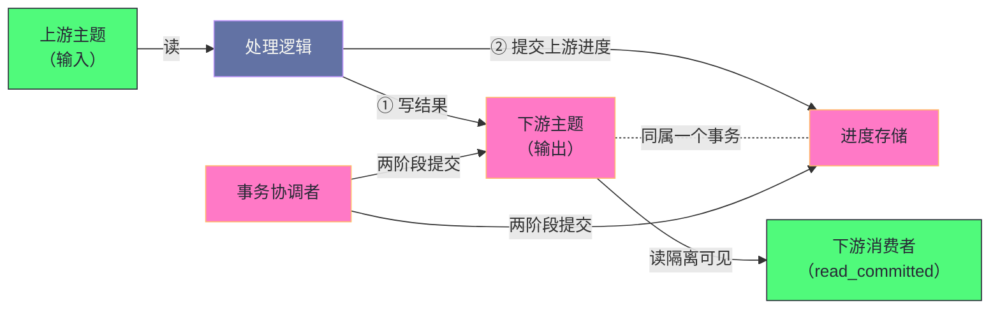

# 07 消费语义——Exactly-Once 的实现路径

**摘要：**

"恰好被处理一次"是消息系统里最常被提到、也最容易被误解的一个保证。它的难点不在于算法复杂，而在于**失败是常态**：网络会抖动、进程会崩溃、机器会宕机，而任何一次失败都可能让"处理消息"与"记录已处理"这两件事中的一件成功、另一件失败。本文先厘清三种语义的精确边界——**至多一次是"先记录再处理"**（可能丢），**至少一次是"先处理再记录"**（可能重），**精确一次是"把两者原子化"**（不丢不重）。然后逐层拆解 Kafka 实现它的三层机制：幂等生产者解决"重试导致的重复写"、事务解决"跨分区与跨会话的原子性"、读隔离解决"未提交消息的可见性"。三者缺一不可。之后讨论两个必须说清楚的边界：**当写入目标不是 Kafka 时，Kafka 无法单独保证端到端语义**，此时常见做法是"至少一次加幂等写入"；以及**流处理框架如何把这些机制封装成一行配置**，以及这个封装背后的代价。最后是边界、常见误判与"业务等效"这个务实结论。

---

## 第 1 章 三种语义的精确边界

### 1.1 至多一次：先记录再处理

**至多一次**的语义是"最多处理一次"——可能丢，但不会重复。

实现方式很简单：**先把消费进度记录下来，再处理消息。** 这样即使处理失败，重启后也不会重新消费（因为进度已经推进）。

**它的代价是"丢失不可感知"**：处理失败的那条消息永远不会被重试，而系统不会报错——**只是少处理了一条。** 因此它只适合"丢失可接受"的场景（日志采集、指标上报）。

### 1.2 至少一次：先处理再记录

**至少一次**的语义是"至少处理一次"——不会丢，但可能重复。

实现方式是反过来的：**先处理消息，处理完成后再记录进度。** 这样如果"处理成功但记录失败"（或记录前崩溃），重启后会重新处理同一批消息——**重复发生了，但没有丢。**

**它是绝大多数场景的默认选择**，因为它把"丢失"这个不可补救的问题，转化成了"重复"这个可以补救的问题（只要处理逻辑幂等）。

### 1.3 精确一次：把两者原子化

**精确一次**的语义是"恰好处理一次"——不丢也不重。

它的实现不是"找到一种不会失败的顺序"，而是**把"处理结果写入"与"进度记录"这两个动作绑成一个原子操作**：要么都生效，要么都不生效。

**这就把问题从"如何避免失败"变成了"如何原子化两个动作"**——而后者是一个有成熟解法的问题（事务）。**因此"精确一次"的实现路径，本质上是一条"用事务把两个动作绑定"的路径。**

### 1.4 三者的关系

三种语义的关系可以用一句话概括：**它们不是三个并列的选项，而是一条"代价递增"的路径。**

| 语义 | 实现方式 | 失败后果 | 代价 |
|---|---|---|---|
| 至多一次 | 先记录再处理 | 丢失（不可感知） | 最低 |
| 至少一次 | 先处理再记录 | 重复（可检测） | 低（需要幂等） |
| 精确一次 | 两者原子化 | 无 | 高（事务开销） |

**这张表最值得注意的是"失败后果"这一列**：从"不可感知的丢失"到"可检测的重复"再到"无失败后果"，**每一级都在把"不可控的风险"变成"可控的成本"。**

**而"至多一次"之所以在实践中很少被主动选择**，正是因为它把失败变成了"不可感知"——**而不可感知的失败是最难处理的**，因为它不会触发任何机制，只会在一段时间后以"数据缺失"的形式暴露。

### 1.5 为什么"至少一次"成为默认

"至少一次"之所以成为绝大多数系统的默认选择，理由有三层。

**理由一：它把不可补救的问题变成了可补救的问题。** 丢失无法补救（数据从未到达），重复可以补救（幂等处理即可消除）。**这个转换本身就是一个巨大的收益**——因为它把"需要完美"的问题变成了"需要幂等"的问题。

**理由二：它不需要额外机制。** "先处理再提交"就是最自然的写法，**不需要事务、不需要协调者、不需要额外的超时管理。** 因此它的实现成本最低。

**理由三：它的失败是"可见的"。** 重复会表现为"同一件事做了两次"，这在业务侧是**可以被察觉的**（例如对账时发现同一笔订单被处理了两次）。**而"可察觉"意味着有机会修复。**

**三层理由共同解释了为什么"至少一次加幂等"是工程上的主流答案**——**它不是"退而求其次"，而是在"成本"与"风险可控性"之间的最优点。** 只有当"重复本身也无法被幂等消除"时（例如副作用是外部不可去重的动作），才需要上升到精确一次。

### 1.6 语义的选择是一项业务决策

值得强调的一点是：**选择哪种语义不是技术偏好，而是业务决策。**

**"能接受多少重复"与"能接受多少丢失"这两个问题的答案，只有业务方知道。** 例如"订单状态变更"通常不能接受丢失（会影响用户看到的订单状态），但可以接受重复（幂等处理即可）；而"用户行为埋点"两者都可以接受（统计口径的微小误差无妨）。

**因此技术侧的职责不是"追求最高的语义等级"，而是"把每种语义的代价讲清楚，让业务方做出选择"。** 这与第 3 篇讲的"生产端该怎么配取决于业务对重复与丢失的容忍度"是同一个判断——**语义等级的选择，最终都要回到业务容忍度上。**

### 1.7 一个常见的误解

最后澄清一个常见的误解：**"精确一次"并不意味着"性能一定更差"。**

在"低吞吐、少量分区"的场景下，三层机制的开销几乎不可察觉——**因此"用精确一次"可能完全没有性能代价。** 而在"高吞吐、多分区"的场景下，开销才会显现。

**因此"要不要用精确一次"的决策依据，不是"它的名字听起来更贵"，而是"当前场景下它的实际开销是多少"。** 而这个开销**只能通过实测获得**——**这与第 4 篇讲的"可靠性提升的吞吐代价应当实测而非凭直觉"是同一个纪律。**

**这条误解的实践危害在于：它让团队在"其实开销可忽略"的场景下放弃了更强的保证**——而放弃的理由是一个未经测量的直觉。

---

## 第 2 章 为什么"精确一次"难

### 2.1 两个必须原子化的动作

把第 1.3 节的结论展开，可以看清"精确一次"的难点具体在哪。

在"从上游读、处理后写下游"这个流程里，有两个动作必须原子化：**把处理结果写到下游**，以及**把"已经处理到哪"记录下来**。

**如果只做一个**：只写结果不记录进度 → 重启后重复处理（至少一次）；只记录进度不写结果 → 重启后跳过（至多一次）。

**如果两个都做但不原子**：可能出现"写了结果但进度没记录"（重复）或"进度记录了但结果没写"（丢失）——**而这两种中间态都无法从外部区分**，因为它们各自看起来都像"正常执行的一部分"。

**因此难点不在"做两件事"，而在"让两件事无法被分开观察"。** 这就是事务要解决的问题。

### 2.2 失败是常态

需要强调的一点是：**这些中间态不是"极端情况"，而是"迟早会发生的情况"。**

原因在于这两个动作跨越了网络与进程边界——**写结果是一次网络往返，记录进度是另一次。** 在这两次之间，进程可能崩溃、网络可能断开、对方可能超时。**因此"两个动作之间出现失败"的概率，与"系统运行时长"成正比。**

**这也解释了为什么"精确一次"必须由机制保证，而不能靠"小心处理"实现**——因为它的失败条件是"时间"，而不是"某个可避免的操作"。

### 2.3 "恰好一次"是个不精确的说法

最后需要澄清一个语义上的细节：**"恰好一次"在严格意义上很难被外部验证。**

因为"一次"的定义依赖于"什么算一次处理"——是"消息被读取一次"，还是"消息的副作用被执行一次"？**如果副作用是"发一封邮件"，那么"恰好一次"意味着"用户只收到一封"**——而这需要邮件系统本身支持去重。

**因此工程上讨论的"精确一次"，通常指的是"在特定边界内的精确一次"**：例如"Kafka 内部端到端精确一次"（从 Kafka 读到写回 Kafka），或"Kafka 精确一次加外部系统幂等写入"。

**这个澄清的价值在于它避免了"以为有了精确一次就万事大吉"的误解**——**边界在哪里，比保证的名字更重要。**

### 2.4 幂等性与原子性的区别

这两个词经常被混用，但它们解决的是不同的问题，值得单独辨析。

**幂等性解决的是"重复执行同一个操作，结果不变"**——例如"把某个字段设为 5"是幂等的，而"把某个字段加 1"不是。**它作用于单个操作，且不涉及"多个操作之间的关系"。**

**原子性解决的是"多个操作要么都生效要么都不生效"**——它作用于一组操作之间的关系。**它不保证"重复执行结果不变"，只保证"不会出现中间态"。**

**两者的关系是互补而非替代**：幂等性让"重试"变得安全（因此可以放心重试），原子性让"多步操作"变得不可分割（因此不会留下中间态）。**在精确一次的路径里，两层机制分别对应这两者**——幂等生产者提供幂等性，事务提供原子性。

**这个区分有实用价值**：当出现"重复处理"时，应当问"是幂等性没生效，还是原子性没覆盖到这一步"——**两个问题的排查方向完全不同。**

### 2.5 为什么不能靠"重试幂等"解决一切

一个自然的想法是：既然"至少一次加幂等"能解决问题，那为什么还需要事务？

**因为有些操作天然不幂等，且无法通过简单改造变得幂等。** 例如"把处理结果写入多个下游系统"——如果只写成功了一部分，那么重试会让"已成功的部分重复"。

**更本质地说：幂等性只能消除"同一个操作的重复"，无法消除"多个操作之间的不一致"。** 而"处理结果写入"与"进度记录"恰好是两个不同的操作——**它们之间的不一致正是第 2.1 节描述的中间态。**

**因此"至少一次加幂等"之所以在实践中够用，是因为大多数业务场景可以容忍"重复"而不产生错误后果**（例如"插入一条记录"用唯一键挡住）。**而当"重复会产生实际错误"且"无法用唯一键挡住"时，就必须用事务。**

### 2.6 三种语义与三层机制的对应

把第 1 章的三种语义与后面三章的机制对应起来，可以看清"哪一层解决哪一档"。

**至多一次与至少一次**：这两档不需要额外机制，它们的差异只在于"提交与处理的先后"。**因此它们的实现成本都低**——代价分别在"丢失不可感知"与"需要幂等处理"。

**精确一次**：它需要三层机制叠加（幂等 + 事务 + 读隔离）。**因此它的实现成本高**，但换来的是"不丢不重"。

**这个对应关系说明一件事：语义等级的提升不是"调一个开关"，而是"引入一组机制"。** 因此评估"要不要用精确一次"时，应当评估的是"这一组机制带来的复杂度与开销是否值得"——**而不是把"精确一次"当作一个可以随时开启的选项。**

---

## 第 3 章 第一层：幂等生产者

### 3.1 它解决了什么

第一层机制解决的是"**生产者重试导致的重复写**"。

问题的形态是：生产者发送一批消息，Broker 成功写入但确认响应在返回途中丢失；生产者认为失败并重试——**于是同一批消息被写入两次。**

解法是给每次发送一个可识别的标识（生产者标识加序列号），Broker 记录"已处理到哪个序列号"，重复的请求被识别并忽略。**这把"重试"从"可能造成重复"变成了"幂等操作"。**

### 3.2 它的边界

但这一层的保证范围有两个明确边界（第 3 篇已展开）：**不跨生产者会话**（重启后标识变化，无法识别旧会话的重复）、**不跨分区**（序列号按分区维护）。

**这两个边界恰好对应下一层要解决的问题**：跨会话需要"稳定的标识"（事务标识），跨分区需要"跨分区的原子性"（事务）。**因此三层的设计是层层递进的——每一层解决上一层留下的边界。**

**这个"层层递进"的结构值得留意**：它说明"精确一次"不是某一个机制的名字，而是**一组机制叠加后达到的效果**。**单独看任何一层，都会觉得"它的保证不够强"；但它们的组合覆盖了完整的问题空间。**

### 3.3 幂等性的可观测性

幂等性生效与否，可以间接观测——这一点对排查"为什么出现重复"很有用。

**如果幂等性生效**，那么"生产者重试"这件事在结果上是不可见的（Broker 会识别并忽略重复请求）。**因此"出现重复"通常意味着"幂等没有生效"**，而不是"幂等失效了"。

**排查方向有三处**：**其一，幂等开关是否启用**（它是否真的被打开）；**其二，是否有"跨越了幂等边界"的操作**（例如生产者重启，第 3.2 节讲的第一条边界）；**其三，是否绕过了幂等机制**（例如用另一种写入方式写入了同一批数据）。

**"出现重复"与"出现丢失"的排查难度不同**：重复是"多了一次"，可以从数据里看出来；而丢失是"少了一次"，需要对比才能发现。**这也是"至少一次优于至多一次"的另一个理由——它的失败更容易被定位。**

### 3.4 幂等性的成本

幂等性不是零成本的，代价主要在两处。

**其一是 Broker 侧的状态维护**：它需要为"生产者加分区"维护序列号记录。**因此大量短生命周期的生产者会让这份状态频繁变动**——这是一个容易被忽略的运维负担。

**其二是并发的轻微限制**：为避免序列号乱序，在途请求数被限制在一个较小范围内。**因此它用"一点并发"换取了"去重的保证"。**

**两处成本都不大，但它们的共同含义是"幂等不是免费的正确性开关"**——**不过在绝大多数场景下，这个成本相对于"消除重复"的收益是微不足道的**，因此"默认启用"是合理的工程选择。

---

## 第 4 章 第二层：事务

### 4.1 事务要绑定的两件事

第二层机制的核心作用是**把两个动作绑成原子操作**——具体来说，是"**把处理结果写入下游**"与"**把消费进度记录下来**"这两件事。

关键在于后一件事也被纳入了事务范围：**消费进度的提交不再是独立操作，而是事务的一部分。** 因此事务提交成功意味着"结果写了、进度也记录了"；事务回滚意味着"两者都没发生"。

**"把消费进度纳入事务"这一步是整条路径的关键。** 如果没有它，那么"写结果"是事务的、"记进度"是独立的——两者仍然可能不一致，**而这正是第 2.1 节描述的中间态。**

### 4.2 事务的边界与它的稳定标识

事务还解决了"跨生产者会话"这个边界：它要求配置一个**跨重启稳定的标识**（与第 4 篇讲的"静态成员标识"是同一类东西）。

有了稳定标识，新实例可以"继承"旧实例的事务状态——**因此"重启"这件事不再破坏幂等性。** 同时，稳定标识还带来了"僵尸隔离"的能力：如果旧实例仍存活并试图继续操作，它的请求会被识别为过期并拒绝。

**"用稳定标识识别逻辑角色"这个手法在本专栏已经出现三次**（生产者的幂等标识、消费者的静态成员标识、这里的事务标识）——**它解决的都是同一个问题：让"重启"不被误判为"换了一个角色"。**

### 4.3 事务的性能代价

事务不是免费的，代价落在三处。

**其一是协调开销**：每个事务都要与协调者交互（开始、提交或回滚），协调者还要把状态持久化。

**其二是可见性条件增加**：事务内的消息需要"事务已提交"才对消费者可见（下一章展开）——**因此从写入到可读多了一道等待。**

**其三是消费者侧的开销**：使用读隔离的消费者需要跟踪事务状态，判断哪些消息可见。

**三处代价共同说明：事务应当用于"确实需要原子性"的场景**，而不是"为了保险起见全都用"。**对"只写单个分区且不涉及进度绑定"的场景，幂等性已经足够。**

### 4.4 事务的提交时机与检查点

事务"什么时候提交"是一个有实际影响的设计选择，它与流处理的检查点机制紧密相关。

**如果事务提交过于频繁**：协调开销与可见性等待被反复付出——**表现为吞吐下降。**

**如果事务提交过于稀疏**：事务覆盖的数据量大，一旦回滚需要重做的工作多；且读隔离的稳定偏移量推进会变慢（第 5.2 节）——**表现为消费延迟上升。**

**因此提交时机实际上是在"开销"与"延迟"之间取平衡**，而它与流处理的检查点周期绑定——**因为"检查点成功"正是"可以安全提交"的那个时刻**（第 6 篇讲的"把成功点对齐"）。

**这与第 4 篇讲的"提交频率的取舍"是同一类问题**：消费进度的提交频率、事务的提交频率、以及检查点的周期，本质上都在回答"多久确认一次"。**而判断依据也一致——由"能接受多少重复"或"能接受多少延迟"反推。**

### 4.5 事务与分区的关系

事务的原子性范围是"它写入的那些分区"，这一点有一个实践含义值得说明。

**事务只对它实际写入的分区产生原子性**——如果一次处理涉及三个分区，那么这三个分区的写入要么都生效要么都不生效；**而它不涉及的分区不受影响。**

**因此"事务的粒度"由"一次处理涉及多少个分区"决定。** 涉及分区越多，事务的协调成本越高（协调者要向更多主副本写入标记）。

**这条性质带来一个设计启示：如果可能，应当让"一次处理只涉及少数分区"**——例如按业务键分区，让同一业务实体的处理都落在同一分区上。**这与第 1 篇讲的"按 Key 分区以保证有序"是同一个手法，只是目的从"有序"变成了"降低事务范围"。**

---

## 第 5 章 第三层：读隔离

### 5.1 未提交消息的可见性

第三层机制解决的是"**未提交事务的消息会不会被读到**"。

如果消费者能读到"属于进行中事务"的消息，那么一旦该事务回滚，这些消息就会"读到过但后来不存在了"——**这破坏了"读到即已发生"这个假设**（与第 5 篇讲的高水位要解决的问题同类）。

读隔离的做法是：**消费者只读"已提交事务"的消息**，未提交的部分被过滤掉。**这是"可见性边界"这个概念在本专栏里的第三次出现**——第一次是副本同步的高水位，第二次是事务标记，第三次是这里的读隔离。**三者都是"用一个标记划定可见范围"，只是标记的含义不同。**

### 5.2 稳定偏移量与它的阻塞风险

读隔离的实现依赖一个"稳定偏移量"——**它是"所有进行中事务的最小起始位置"**。

消费者只能读到这个位置之前的内容。**因此它的推进取决于"最慢的那个进行中事务何时结束"。**

这里有一个必须正视的风险：**如果一个事务长时间不结束（例如应用卡死或忘记提交），稳定偏移量就无法推进——而这意味着该分区的所有后续消息都无法被读隔离的消费者读到，即使那些消息根本不属于任何事务。**

**这个风险的形态很特殊：它不是"数据出错"，而是"数据读不到"。** 表现是"消费停滞"，而根因在"某个事务没有结束"——**因此排查方向应当先看"是否有长时间未结束的事务"，而不是先看消费者。**

### 5.3 超时的必要性

针对上述风险，必须设置事务超时——**超过时限的事务会被强制中止**，从而让稳定偏移量能够推进。

**这个超时的取值需要在两处之间权衡**：太短会让"正常但较慢的事务"被误中止（而中止意味着这批处理白做，需要重试）；太长会让"卡死的事务"长时间阻塞消费。

**这与第 4 篇讲的"会话超时"是同一类参数**：它们都在"容忍正常的慢"与"及时清理异常的卡"之间取平衡。**而判断标准也是一致的：超时值应当明显大于"正常情况下的最大耗时"，而不是接近它。**

### 5.4 读隔离与高水位的对比

读隔离划定的边界与第 5 篇讲的高水位划定的边界，是同一类机制的两个实例，值得对照。

| 维度 | 高水位 | 稳定偏移量 |
|---|---|---|
| 划的是什么边界 | "已被所有同步副本确认" | "不属于任何进行中事务" |
| 边界由谁决定 | 副本同步进度 | 最慢的进行中事务 |
| 推进的阻塞源 | 慢副本 | 未结束的事务 |
| 不推进的后果 | 消费者读不到新消息 | 读隔离消费者读不到新消息 |
| 缓解手段 | 剔除掉队副本 | 事务超时 |

**这张表最有价值的是"推进的阻塞源"与"缓解手段"两行**：两者的阻塞源不同（一个是"副本慢"，一个是"事务不结束"），但**它们的不推进后果相同（消费者读不到）**，而缓解手段也都指向"给阻塞源设置上限"。

**因此"消费者读不到新消息"这类现象有两个可能的方向**：**副本侧的问题**（同步跟不上）或**事务侧的问题**（有事务未结束）。**排查时应当两个方向都看**——**而"先看哪个"取决于该主题是否使用了事务。**

### 5.5 读隔离的配置确认项

使用读隔离时，有几项配置必须确认，否则"精确一次"会静默失效。

**确认项一：消费者侧是否真的启用了读隔离。** 如果消费者仍用默认的"读未提交"，那么它会看到未提交的消息——**而生产端的事务再正确也无效。** 这是一个"两端必须成对配置"的典型场景。

**确认项二：事务超时是否设置合理。** 如第 5.3 节所述，超时过短会误中止正常事务，过长会让卡死事务长期阻塞消费。

**确认项三：是否存在"跨主题的事务混用"。** 如果同一个消费者组既读事务主题又读非事务主题，那么稳定偏移量的推进只受事务主题影响——**因此"消费停滞"可能只出现在部分分区上**，而这会让排查方向变得模糊。

**三项确认的共同特征是"它们都是'配置是否成对'的问题"**——**这再次印证了第 3 篇的判断：可靠性配置是组合生效的，孤立看某一个参数无法判断语义是否达标。**

### 5.6 读隔离的监控要点

使用读隔离后，有三类指标需要监控，因为它们直接反映"精确一次是否在正常工作"。

**其一是未结束事务的数量与持续时长。** 这是稳定偏移量的推进阻力来源——**数量多或时长长，说明事务提交不够及时。**

**其二是稳定偏移量与日志末端的差距。** 它对应"已被写入但因事务未结束而不可见"的消息量。**它长期很大说明读隔离的消费者会看到明显的可见性延迟。**

**其三是事务的中止率。** 中止意味着"这批处理白做"（需要重试）——**中止率上升说明超时设置偏短，或处理耗时波动大。**

**三类指标的关系是"从原因到后果"**：未结束事务是原因，稳定偏移量差距是中间量，中止率是另一类后果（重做）。**按这个顺序看，就能从"消费延迟高"定位到"事务提交不及时"。**

---

## 第 6 章 三层机制的配合

### 6.1 为什么缺一不可

三层机制各自解决一个具体问题，缺任何一层都会留下缺口。

**缺第一层**：生产者重试会造成重复写——**而这是最基础的一层，没有它，后面的机制都建立在"写入本身可能重复"的基础上。**

**缺第二层**：无法保证"跨分区的原子性"与"跨会话的幂等"——**表现为"重启后重复"或"部分分区写入成功部分失败"。**

**缺第三层**：消费者可能读到未提交的消息——**表现为"读到的消息后来消失了"。**

**三层的关系可以这样理解**：第一层保证"写入不重复"，第二层保证"多个动作要么都做要么都不做"，第三层保证"只看到做完的"。**它们分别对应"写"、"绑"、"读"三个环节。** 而这三个环节恰好覆盖了数据流动的完整路径——**因此"缺一不可"不是强调，而是结构上的必然。**

### 6.2 端到端的组合

把三层组合起来，就得到了"Kafka 到 Kafka"的端到端精确一次：

**从上游读 → 处理 → 事务内写入下游并提交上游进度 → 事务提交 → 下游的读隔离消费者看到结果。**

这条链路上，"读到"与"写下"是原子的：**上游的进度只在"下游结果已提交"的前提下才推进**——因此"处理了但结果丢了"与"结果写了但会重复处理"这两种情况都不会发生。

**这也解释了为什么"端到端"这个词很重要**：单看生产端（幂等）或消费端（读隔离）都不构成完整保证，**必须两端配合才能得到"处理恰好一次"的效果。** 这与第 3 篇讲的"生产端与消费端必须成对配置"是同一件事。

### 6.3 完整链条的图示

把这条链路画出来，能更清楚地看出"原子性的范围"。

**图中最关键的是"① 与 ② 同属一个事务"这条虚线**——它正是第 2.1 节讲的"两个必须原子化的动作"。**如果这条虚线不存在（两者独立提交），那么整条链路就退化为"至少一次"或"至多一次"。**

**另一处值得注意的是"事务协调者"这个角色**：它不在数据路径上，但决定了事务何时生效。**因此"协调者不可用"会导致"事务无法提交"**——表现为"处理已完成但结果不可见"。**这类故障的排查入口不是数据，而是协调者的状态。**

### 6.4 这套组合的适用规模

最后需要说明这套组合的适用规模——因为它的开销随规模放大。

**在小规模场景**（少量分区、低吞吐），三层机制的开销几乎不可察觉——**因为协调与标记的绝对量很小。**

**在中等规模场景**，事务协调开始成为需要考虑的负载——**此时"事务提交频率"与"事务涉及的分区数"成为需要调优的参数。**

**在超大规模场景**，事务的开销可能成为主要矛盾——**此时更常见的做法是"把精确一次的范围缩小"**：例如只在关键链路上使用事务，而非关键链路退回到"至少一次加幂等"。

**"按链路重要性分级"这个做法值得留意**：它承认"精确一次"是一种昂贵资源，因此**只在真正需要的地方使用。** 这与第 4 篇讲的"物化视图数量应当与查询收益匹配"是同一类思路——**昂贵的机制应当按收益分配，而不是全量铺开。**

---

## 第 7 章 当写入目标不是 Kafka 时

### 7.1 问题的形态

如果"处理结果"要写入的不是 Kafka，而是数据库、接口、或文件系统，那么第 6 章的组合就用不上了——**因为"外部系统的写入"无法被纳入 Kafka 的事务。**

**问题的本质是"跨越了两个系统的事务边界"。** 而跨系统的事务需要分布式事务协议（两阶段提交），代价高且要求外部系统支持。

**因此实践中的主流做法不是"强行做跨系统事务"，而是"把幂等性下推到外部系统"。**

### 7.2 幂等写入的实现

幂等写入的思路是：**让外部系统自己能够识别"这条消息已经处理过"。**

常见的实现方式是引入一个业务幂等键——**通常直接用"主题加分区加偏移量"这个三元组**（因为它天然唯一），在外部系统里对它建唯一约束。这样重复写入时会被外部系统拒绝（或识别为已存在并跳过），**因此"重复处理"在业务层面被消除了。**

**这个做法的效果是"业务等效于精确一次"**：系统层面确实重复处理了（至少一次语义），但**业务效果是恰好一次**（因为重复的副作用被幂等键挡掉了）。

### 7.3 为什么"业务等效"是常见答案

这个答案之所以常见，是因为它**把"分布式事务"这个难题换成了"幂等键"这个相对简单的问题**——代价是需要在外部系统里维护幂等键（存储成本与清理逻辑）。

**它的适用前提是"外部系统能支持唯一约束"**——数据库通常可以，而某些接口（如"发短信"、"调第三方支付"）可能不支持，此时需要外部系统自己提供幂等能力（如"请求号去重"）。

**因此判断"能否用这个做法"的第一个问题是：目标系统是否支持幂等？** 支持则"至少一次加幂等写入"是成本最低的方案；不支持则需要引入分布式事务，或接受"至少一次"并承担重复的业务后果。

### 7.4 跨系统一致性的其他路径

除了"幂等写入"，还有两条路径值得知道，它们适用于不同条件。

**路径一：让外部系统参与两阶段提交。** 如果外部系统支持"准备加提交"这类协议，那么可以把它的写入纳入同一个事务。**代价是要求外部系统支持该协议，且会带来同步阻塞**——实践中支持这种协议的系统不多。

**路径二：把外部写入转化为"可重放的操作"。** 思路是"不直接写外部系统，而是写一条'待执行的意图'到 Kafka"，再由另一个消费者去执行。**这样"意图"的写入与进度提交可以原子化（因为都是 Kafka 操作），而外部执行则由那个消费者保证幂等。** 这条路径的价值在于**它把跨系统问题转化成了系统内问题**——代价是多了一次转发与一个执行组件。

**三条路径（幂等写入、两阶段提交、意图转发）的取舍依据是"外部系统的能力"**：能幂等则用第一条（最简单）；支持两阶段提交则用第二条（但要求高）；都不支持则用第三条（增加组件但可行）。

**这个"按外部系统能力选路径"的思路值得留意**：它说明"端到端一致性"的可行方案**取决于链路两端的配合能力，而不是单方面可以决定的**——**这也是为什么"精确一次"必须说清边界。**

---

## 第 8 章 流处理框架的封装

### 8.1 框架如何隐藏事务

Kafka 自带的流处理库把上述机制封装成了一行配置——**用户只需要声明"要精确一次"，框架在内部自动管理事务：按任务分配事务标识、在检查点时事务性地写入结果并提交进度。**

**这个封装的价值在于"把复杂机制变成默认行为"**：业务代码不需要感知事务的存在，也不需要理解稳定偏移量、协调者这些概念。

**这类封装在本专栏里也有先例**：第 4 篇讲的"协作粘性分配策略"把"增量再平衡"的复杂流程封装成了一个配置项。**封装的通用价值是"让使用者只需声明意图，而不必理解实现"**——而它的代价是"出问题时需要深入内部才能排查"。

### 8.2 两个版本的差异

这个封装经历过一次重要改进，核心变化是"**事务标识与生产者的对应关系**"。

早期版本里，一个执行线程内的多个任务共享一个生产者与事务标识——**这限制了并发度，因为同一个事务标识只能被一个实例使用。**

改进后的版本让**每个任务拥有独立的事务标识与生产者**——因此任务的并行度不再受"线程与生产者绑定"的限制，且事务协调者需要管理的对象也更清晰。

**这个改进的收益在大规模流处理应用里更明显**——因为任务数量多时，"共享"带来的争用会被放大。**这与第 4 篇讲的"协作粘性在大型集群里效果更显著"是同一类规律：机制改进的收益与规模成正比。**

### 8.3 代价与边界

封装带来的代价有三处。

**其一是资源占用**：每个任务持有独立的生产者与事务标识，意味着更多的连接与协调状态。

**其二是恢复成本**：如果框架维护了本地状态（如聚合结果），那么实例重启后需要从备份主题恢复状态——**恢复时间取决于状态大小**，因此在状态很大时，恢复会成为显著的开销。

**其三是"精确一次"的边界仍在**：框架保证的是"Kafka 到 Kafka"这一段；如果流处理的输出要写外部系统，仍然需要第 7 章讲的幂等写入。

**三处代价的共同提示是："一行配置"背后仍有真实成本**——**它省的是"理解与实现"，不是"运行开销"。**

### 8.4 自带库与独立框架的选择

最后值得说明的是"用自带的流处理库"与"用独立流处理框架"的取舍，因为这决定了"谁来管事务"。

**自带库的优势是"与 Kafka 的机制贴合最紧"**：它的精确一次实现直接构建在 Kafka 的事务机制上，因此不需要额外的协调组件，且延迟更低（数据不需要离开 Kafka 的生态）。**它的限制是"只能消费 Kafka 的数据"**——如果需要从其他数据源读取，就不适用。

**独立框架的优势是"数据源与处理能力更丰富"**：它可以连接多种数据源、提供更复杂的时间窗口与状态管理。**代价是"端到端一致性需要自己协调"**——它需要把"框架的检查点"与"外部系统的写入"绑定起来（第 5 篇讲的"把成功点对齐"）。

**因此选择依据可以归结为两个问题**：**数据源是否只有 Kafka？** 是则自带库更简单；**是否需要复杂的时间窗口与状态管理？** 需要则独立框架更合适。

**这个取舍与第 4 篇讲的"用内置能力还是自建能力"是同一类判断**——**内置能力贴合但受限，自建能力灵活但要自己保证正确性。** 而判断的依据始终是"需求是否超出内置能力的边界"。

### 8.5 状态与恢复的代价

框架封装中有一项代价值得单独说明：**本地状态与它的恢复**。

**如果流处理需要维护状态**（例如聚合、去重、连接维表），那么状态通常存在本地磁盘上，并通过一个备份主题同步到 Kafka。**这样做的目的是"状态不丢"**——实例重启后可以从备份主题恢复。

**但恢复是有代价的**：恢复时间取决于状态大小，**在状态达到很大规模时（例如几十 GB），恢复可能耗时数分钟甚至更久**——而在这段时间内，该实例负责的分区无法被处理。

**这条代价带来两个实践要点**：**其一，状态设计应当尽量精简**（只保留必要的信息，而不是把原始数据都存下来）；**其二，对恢复时间敏感的场景需要准备"热备"**（预先同步状态的副本实例，切换时不必从零恢复）。

**"状态恢复时间"这个约束与本专栏其他篇讲的"元数据加载时间"（第 6 篇）、"数据搬迁耗时"（第 2 篇）是同一类问题**——**它们都是"某个东西的规模决定了恢复或迁移的耗时"，而这类耗时直接影响可用性。** 因此"控制规模"是这类系统的通用优化方向。

---

## 第 9 章 边界与反例

### 9.1 反例一：以为"开了精确一次就真的精确一次"

精确一次有明确的边界（Kafka 到 Kafka）。**写入外部系统时，如果外部系统不支持幂等，那么整体语义仍然可能重复。** 把配置项当作"端到端保证"，会在跨系统场景下失效。

### 9.2 反例二：把"恰好一次"当作可外部验证的性质

"一次"的定义依赖于"什么算一次处理"。**如果副作用是外部动作（发通知、调接口），那么"恰好一次"需要那个外部系统配合去重。** 否则只能做到"业务等效"。

### 9.3 反例三：不设置事务超时

没有超时，卡死的事务会长期阻塞稳定偏移量的推进——**表现为"该分区的消费停滞"，而根因在事务侧。** 因此超时是必需的，且取值应当明显大于正常事务的最大耗时。

### 9.4 反例四：为了"更安全"对所有场景都启用事务

事务有协调开销、可见性延迟与消费者侧开销。**对"只写单分区、不涉及进度绑定"的场景，幂等性已经足够**——引入事务只是增加成本。

### 9.5 反例五：把"消费停滞"一律归因到消费者

读隔离的消费停滞可能源于"未结束的事务"。**排查顺序应当先看"是否有长时间未结束的事务"，再看消费者的处理耗时。**

### 9.6 反例六：忽略幂等键的清理

用"主题加分区加偏移量"作幂等键意味着这个键会持续积累。**如果不做清理，幂等表会成为新的存储负担**——因此需要配套的保留策略（例如"保留足够长的时间，确保不会再有重复"）。

### 9.7 反例七：把框架的"精确一次"当作"无需理解内部机制"

封装省的是"实现"，不是"排查"。**当出现"重复处理"或"消费停滞"时，仍然需要理解事务、稳定偏移量、超时这些概念才能定位。** 把封装当作黑盒，会在故障时缺乏排查手段。

### 9.8 反例八：把"至多一次"用在无法察觉丢失的场景

至多一次的失败是"不可感知的"。**把它用在需要数据完整性的场景（如对账数据），会导致"数据缺失且无人知道"**——而这比"重复"严重得多，因为它没有修复的入口。

### 9.9 反例九：为"更安全"把事务用于所有链路

事务有协调开销、可见性延迟与消费者侧开销。**对"只写单分区且不涉及进度绑定"的链路，幂等性已经足够**——引入事务只是把成本加上去而没有换来额外的保证。

### 9.10 反例十：忽略幂等键的保留策略

幂等键会持续积累。**没有保留策略意味着幂等表会无限增长**——而它的清理时机必须"足够晚"，确保不会再有重复写入进来（否则清理后重复又会出现）。

---

## 第 10 章 落点

回到开头：为什么"精确一次"难？

**因为它的难点不在算法，而在"失败是常态"**——两个必须原子化的动作跨越了网络与进程边界，而它们之间出现失败只是时间问题。**因此解法不是"避免失败"，而是"让失败无法造成不一致"**——这就是事务要解决的问题。

三层机制的层层递进也值得再强调一次：**幂等解决"写入不重复"，事务解决"多个动作要么都做要么都不做"，读隔离解决"只看到做完的"。** 每一层都在补齐上一层留下的边界，而它们的组合才构成"端到端"。

**最后落到一个务实的结论上：在绝大多数真实系统里，"精确一次"是通过"至少一次加幂等"来实现的，而不是通过"端到端分布式事务"。** 前者把难题换成了"维护幂等键"这个可控的问题，代价是需要在业务侧做一点额外设计；后者代价高且依赖外部系统的支持能力。

**这条务实结论与本专栏反复出现的一条认知一致：系统的保证总是"在某个边界内"的，而工程的重点是"把边界划清楚，并在边界之外补上应用层的保护"。** 承认边界，比追求一个模糊的"完全保证"更有价值。

把这一篇放到整个专栏里看，它的位置很特殊：**前面几篇讲的机制（幂等、事务、副本、消费进度），都是为"端到端语义"服务的零件，而这一篇是把它们组装起来的那一张图纸。** 幂等解决"写入不重复"，事务解决"多步原子"，读隔离解决"只看到做完的"——**三者缺一不可，且必须两端成对配置。**

**而"边界"这个概念贯穿全篇**：精确一次有边界（Kafka 到 Kafka）、事务有边界（它写入的分区）、幂等有边界（单会话单分区）、甚至"一次"这个概念本身也有边界（什么算一次处理）。**理解这些边界，比记住"精确一次"这个名词重要得多**——因为**边界决定了"什么时候可以依赖这个保证，什么时候需要在应用层补上保护"。**

**这也是为什么"精确一次"这个说法在实践中应当被"精确到哪一步"所替代**——**后者是可验证的，而前者只是一个愿望。** 一个可验证的表述通常是"从某主题读到写回某主题，在处理逻辑内恰好一次"，**而这句话里的每一个限定词都不能省略。** 限定词越多，说明保证越弱；而"没有限定词的精确一次"通常意味着"说话的人还没想清楚边界在哪里"。

下一篇转向性能优化，看"吞吐与延迟"这一对永恒的矛盾如何被一组具体参数所表达，以及为什么"先确定 SLO 再调参"是唯一的正确顺序。

---

## 专栏导航

- 上一篇：[[06 Controller 与集群管理——从 ZooKeeper 到 KRaft]]。
- 下一篇：[[08 Kafka 性能优化——吞吐量调优与延迟分析]]。
- 生产者与幂等：[[03 生产者——分区策略、acks 与幂等性]]。
- 副本机制：[[05 副本机制——ISR、HW 与 Leader Epoch]]。
- 返回专栏首页：[[00 专栏导览]]。

---

## 参考资料

1. KIP-98: Exactly Once Delivery and Transactional Messaging. https://cwiki.apache.org/confluence/display/KAFKA/KIP-98
2. KIP-447: Producer Scalability for Exactly Once Semantics. https://cwiki.apache.org/confluence/display/KAFKA/KIP-447
3. Confluent. Transactions in Apache Kafka. https://www.confluent.io/blog/transactions-apache-kafka/
4. Apache Kafka. 官方文档：事务与读隔离（isolation.level、transaction.timeout.ms）. https://kafka.apache.org/documentation/#producerconfigs
5. Apache Kafka. 官方文档：Kafka Streams 的处理保证（processing.guarantee）. https://kafka.apache.org/documentation/#streamsconfigs
6. Narkhede N, Shapira G, Palino T. Kafka: The Definitive Guide, Chapter 3 与 Chapter 4. O'Reilly.
7. Helland P. Life beyond Distributed Transactions: an Apostate's Opinion. CIDR, 2007.
8. Apache Kafka. 官方文档：事务协调者与稳定偏移量（Last Stable Offset）说明. https://kafka.apache.org/documentation/#design
9. Apache Kafka. 官方文档：幂等写入与外部系统去重（idempotent sink）的实践建议. https://kafka.apache.org/documentation/#connect
10. Apache Kafka. 官方文档：Kafka Streams 的状态存储、待机副本与恢复机制. https://kafka.apache.org/documentation/#streams
11. Apache Kafka. 官方文档：事务消息与读隔离在跨分区写入场景下的行为说明. https://kafka.apache.org/documentation/#design

---

> [!note] 思考题
> 1. 三种语义的实现差异只在于"提交与处理的先后"。为什么这个先后顺序决定了"丢"还是"重"？
> 2. 为什么"精确一次"的解法是"原子化两个动作"，而不是"避免失败"？
> 3. 稳定偏移量的推进取决于"最慢的进行中事务"。这个性质会带来什么风险，如何缓解？
> 4. 当写入目标不是 Kafka 时，"至少一次加幂等写入"为什么是成本最低的常见答案？它的前提是什么？
> 5. "精确一次"的边界在哪里？为什么说"承认边界"比"追求完全保证"更有价值？
