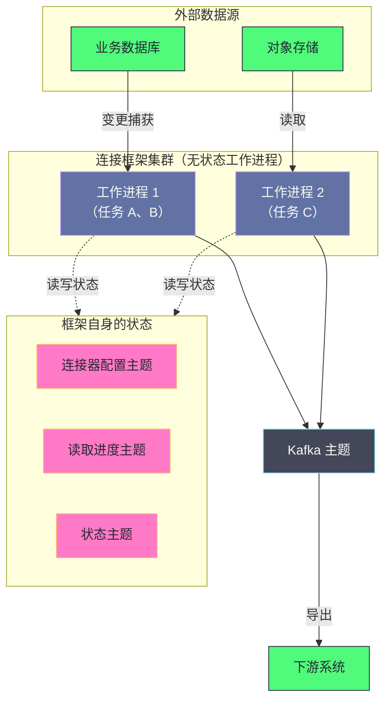

# 09 Kafka Connect 与 Kafka Streams

**摘要：**

Kafka 作为数据流平台，它的价值不只在"传递消息"，还在回答两个更具体的问题：**数据怎么进出**，以及**数据怎么加工**。前者是数据集成的范畴，后者是流计算的范畴。Kafka 生态对这两个问题分别给出了标准化方案：**连接框架**用插件化的连接器把外部系统的数据导入或导出，从而避免"每接一个数据源就写一套代码"；**流处理库**以普通 Java 库的形式嵌入应用，提供"流"与"表"两种抽象与本地状态存储，适合规模中等、逻辑不太复杂的场景。本文按"两类问题的分工 → 各自的机制 → 如何选型"展开。先讲数据集成痛在哪、标准化解决了什么又没解决什么；再拆解连接框架的四个概念、两种运行模式与状态存储位置；然后讲变更数据捕获这个最重要的连接器类别及其一致性边界。之后讲流处理的两个核心抽象（流与表）、它们之间的转换、以及本地状态如何备份与恢复。最后是与独立流处理框架的对比、选型依据与边界。

---

## 第 1 章 两类问题的分工

### 1.1 数据怎么进出

第一类问题是**数据的进出**：外部系统的数据如何进入 Kafka，Kafka 的数据如何输出到外部系统。

这类问题的特征是"**模式高度相似、细节各不相同**"：无论数据来自数据库、对象存储还是搜索索引，流程都是"连接、读取、序列化、发送、处理错误、记录进度"——**但每个数据源的连接方式、数据格式、进度记录方式都不同。**

### 1.2 数据怎么加工

第二类问题是**数据的加工**：进入 Kafka 的数据如何被过滤、转换、聚合、关联，再输出到下游。

这类问题的特征是"**逻辑可表达为算子链**"：从输入到输出经过一系列变换，每一步都是对数据的某种处理。**而"状态"（如累计计数、关联的维表）是这类处理的必然需求。**

### 1.3 为什么这两件事值得标准化

两类问题都有"标准化"的价值，但标准化的内容不同。

**数据进出的标准化是"接口的标准化"**：定义一套插件接口，让每个数据源的适配逻辑变成"实现这个接口"——**收益是"新增数据源不需要重新设计框架"。**

**数据加工的标准化是"抽象的标准化"**：定义"流"与"表"这两种数据视图，以及它们之上的算子——**收益是"业务逻辑可以只用算子表达，而不必关心底层的并发与状态管理"。**

**两种标准化的共同特征是"把重复的部分固化下来，把差异的部分留给使用者"**——这是所有框架的核心价值，也是判断"该不该用框架"的依据：**如果差异部分占主导，框架带来的约束可能超过它的便利。**

### 1.4 两类问题在本专栏中的位置

把这两类问题放回整个专栏，可以看出它们的层次。

**前面几篇讲的是"Kafka 自身怎么工作"**：存储、副本、集群管理、语义保证。**它们是"平台层"。**

**这一篇讲的是"如何在平台之上解决问题"**：数据的进出与加工。**它们是"应用层"。**

**两层的依赖方向是单向的**：应用层的方案建立在对平台层机制的理解之上。**例如"连接框架把状态存在内部主题里"这个设计，只有在理解"内部主题与普通主题一样有高可用"之后才能理解它的价值。**

**这个层次关系也解释了"为什么有些框架用法看起来奇怪"**：它们往往是在迁就平台层的约束。**例如"流处理的并行度受分区数限制"——这不是框架的设计缺陷，而是"分区是并行单位"这条平台层约束的必然结果**（第 1 篇已展开）。

### 1.5 为什么"平台层理解"决定了"框架用法"

最后强调一点：**框架的很多"使用约束"，根源都在平台层。**

**例如"流处理的并行度上限是分区数"**——根源是"一个分区只能被一个消费者消费"（第 4 篇）。
**例如"状态需要备份到主题"**——根源是"本地磁盘不可靠，而日志是可靠的"（第 1 篇）。
**例如"端到端精确一次需要两端配合"**——根源是"事务只覆盖 Kafka 内部"（第 7 篇）。

**因此"先理解平台，再用框架"这个顺序不能颠倒**——**否则使用者会把平台层的约束误认为是框架的缺陷**，进而尝试用"绕过框架"的方式解决，而这通常会让问题更严重。

**这条判断的实用价值在于"排查时的方向选择"**：当框架的行为"看起来不合理"时，**先问"这是不是平台层约束的体现"**——**而答案往往能在前几篇里找到。**

---

## 第 2 章 数据集成的痛点

### 2.1 重复实现的代价

在没有标准化框架之前，接入一个数据源需要手写一套代码：连接数据源、读取数据、序列化为消息、发送到 Kafka、处理失败重试、记录"读到哪了"。

**这套逻辑在"第二个数据源"出现时会被再写一遍**——因为它是"高度相似但无法直接复用"的：连接方式不同、数据格式不同、进度记录方式不同。**因此成本不是"写一次"，而是"每个数据源写一次"。**

**更麻烦的是"运维能力的缺失"**：手写的代码通常没有统一的监控、没有统一的错误处理策略、没有统一的部署方式——**因此每个数据源都是一套独立的运维对象。**

### 2.2 标准化解决了什么

标准化框架解决了三件事。

**其一是"接口的复用"**：新增数据源只需实现标准接口，**框架层面的能力（分布式部署、故障转移、进度管理、监控）自动获得。**

**其二是"运维的统一"**：所有数据源以同一种方式部署与监控——**运维对象从"N 套"变成"一套框架加 N 个配置"。**

**其三是"能力的沉淀"**：社区实现的数据源适配可以被直接复用，**不需要每个团队都自己写一遍。**

### 2.3 标准化没有解决什么

标准化也有它不解决的问题，需要明确。

**其一是"数据语义的正确性"**：框架保证"数据被传输"，但不保证"传输的数据是正确的"——**例如变更事件里的删除语义、字段类型的映射、时间戳的时区处理，都需要使用方自己确认。**

**其二是"一致性边界"**：框架提供的是"至少一次"或"幂等"这类传输语义，**而"端到端精确一次"仍然需要目标系统的配合**（第 7 篇已展开）。

**其三是"性能特征"**：框架的统一实现意味着"面向通用场景"，**因此极端性能需求可能仍然需要定制。**

**三点共同说明：框架解决的是"工程效率"，而不是"正确性"与"极限性能"。** **因此使用框架时仍然需要自己回答"语义是否正确"与"性能是否够用"这两个问题**——**而这两个问题的答案不在框架的文档里，在业务需求里。**

### 2.4 什么时候不该用框架

反过来，也有几种情况"手写更合适"。

**情况一：只有一个数据源且不会增加。** 框架的价值随"数据源数量"放大——**只有一个源时，框架带来的抽象成本可能超过它的收益。**

**情况二：数据源的协议极其特殊。** 如果数据源不提供标准的连接方式（例如专有协议、需要复杂的握手），**那么"实现框架接口"的工作量可能不小于"直接写一套专用逻辑"。**

**情况三：对性能有极端要求。** 框架的统一实现面向通用场景，**如果某条链路需要极致的吞吐或极低的延迟，定制实现可能更合适。**

**三种情况的共同特征是"框架的收益（复用、统一运维）在这个场景下不成立或很弱"**——**这与"该不该用框架"的一般判断一致：框架的价值来自"重复"，没有重复就没有价值。**

### 2.5 手写与框架的中间态

除了"全用框架"与"全手写"，还有一种中间态值得知道：**"用框架的传输能力，但自定义转换逻辑"。**

**框架通常允许自定义"数据格式转换"**（即前面讲的转换器）——**因此"数据源的连接方式"复用框架实现，而"数据如何映射为消息"由使用者定义。** 这覆盖了"数据源标准但语义特殊"的场景。

**这个中间态的价值在于它把"重复的部分"与"差异的部分"分得更细**：连接、部署、容错这些"几乎完全重复"的部分用框架；**而格式映射这个"每个数据源都不同"的部分自己实现。** **这与第 1.3 节讲的"把重复的固化、把差异的留给使用者"是同一个原则，只是划分的粒度更细。**

**因此"用不用框架"不是二选一，而是"在哪一层划分边界"的问题**——**而划分的依据始终是"哪一层的重复度最高"。**

---

## 第 3 章 连接框架的架构

### 3.1 四个概念

连接框架由四个概念组成，理解它们的层次关系很重要。

**工作进程**是真正执行数据传输的进程，通常是多个组成集群。**它是"物理层"的概念**——负责运行任务、提供资源。

**连接器**是逻辑概念，描述"连接什么、用什么配置"。**它本身不做传输，而是把工作拆分成任务。**

**任务**是实际执行传输的工作单元。**一个连接器可以创建多个任务以实现并行**（例如按表拆分、按分区拆分）。**它是"并行度的单位"。**

**转换器**负责数据的序列化与反序列化——**它定义了"外部数据格式"与"消息格式"之间的映射。** 常用的是 JSON 与 Avro（后者需要模式注册中心配合）。

**四者的层次关系是"逻辑—并行—物理"**：连接器（逻辑）拆出任务（并行），任务跑在工作进程（物理）上，而转换器贯穿在数据流经的每一处。

### 3.2 两种运行模式

框架有两种运行模式，差异很大。

**单机模式**：一个工作进程，配置写在文件里。**它适合开发调试**，因为配置简单、启动快；**但不适合生产**——它是单点，没有故障转移。

**分布式模式**：多个工作进程组成集群，配置通过接口动态管理，**连接器与任务自动在进程间分配与负载均衡。** **生产环境必须用这一种。**

**两种模式的差异不只是"高可用"**：分布式模式还带来了"配置的集中管理"（不需要改每个节点的文件）与"任务的自动再平衡"（进程增减时自动调整）。**因此它同时解决了"可靠性"与"运维便利"两个问题。**

### 3.3 状态存在哪里

连接框架自身也需要存储状态——**连接器的配置、任务的分配、以及数据源上的读取进度。**

**这些状态被存放在几个内部主题里**（而不是放在某个节点本地）。**这个选择与第 4 篇讲的"消费进度也存在内部主题里"是同一个思路：把元数据当作数据来存储，从而复用 Kafka 自身的高可用与持久化机制。**

**它带来一个实际后果：连接框架的集群是无状态的**——任何工作进程都可以被替换，因为它需要的信息都在 Kafka 里。**因此"工作进程的增减"不会造成状态丢失**，只是触发一次任务再分配。

### 3.4 架构图示

**图中最值得注意的是"工作进程是虚线连到状态"**：它说明工作进程本身不持有状态，状态都在 Kafka 里。**因此"替换一个工作进程"只是"换一个执行者"，而不是"迁移一份状态"。**

**这个设计的意义与第 6 篇讲的"元数据常驻副本"类似但方向相反**：那里是"让每个节点都持有全量状态以便快速接管"，这里是"让节点完全不持有状态以便随时替换"。**两种做法的取舍点是"接管的延迟"与"节点的自由度"**——**而它们都通过"把状态集中到一处"来简化协调。**

### 3.5 任务再平衡

分布式模式下的一个关键机制是"**任务的自动再平衡**"——当工作进程增减时，任务会自动重新分配。

**这个机制与第 4 篇讲的"消费者组再平衡"高度相似**：都是"成员变化时重新分配工作"，都有"检测失效—重新分配—恢复"三个阶段。

**它们的代价也相似**：再平衡期间任务会暂停，**因此"频繁的进程增减"会造成"频繁的任务中断"。** 因此"工作进程的稳定性"与"消费者的稳定性"同样重要。

**这条相似性提示了一个跨系统的观察**：**任何"多实例分担一组工作"的系统，都要面对"成员管理"这个问题**——而它们的解法往往收敛到相似的模式（检测、分配、再平衡）。**因此理解一个系统的成员管理机制，就能快速理解另一个系统的同类机制**（第 4 篇已把这条经验展开）。

### 3.6 连接框架的监控要点

连接框架的运维重点在三处，它们与"任务是否在正常工作"直接相关。

**其一是任务的状态与分布**：有多少任务在运行、是否均衡分布在各个工作进程上。**如果任务集中在少数进程上，说明再平衡有问题。**

**其二是每个连接器的进度**：源连接器读到数据源的哪个位置、目标连接器写到哪个位置。**进度停滞是"连接器卡住"的直接信号。**

**其三是错误与重试的速率**：框架会重试失败的记录，**而重试速率上升说明数据源或目标系统有问题。**

**三处要点的共同特征是"它们都反映'搬运是否顺畅'"**——**而不是"数据是否正确"。** 后者需要业务侧的对账（第 4.5 节已展开）。**因此连接框架的监控与业务数据校验是两件必须同时做的事**，**缺前者会不知道"管道是否通"，缺后者会不知道"运的东西对不对"。**

**这条"管道与内容分开看"的原则与第 5 篇讲的"副本同步与数据正确性分开看"是同一类判断**：**监控能回答的永远是"过程是否正常"，而"结果是否正确"必须由业务侧的对账来回答**——**因为只有业务知道"什么算对"。**

---

## 第 4 章 变更数据捕获

### 4.1 为什么这类连接器最重要

在所有连接器中，**从数据库捕获变更**这一类最为重要——因为它解决的是"**如何让数据库里的实时变化流向整个数据生态**"。

**它的价值可以用一个对比说明**：如果没有它，那么"把数据库的变更同步到搜索索引、缓存、数据仓库"这件事，通常的做法是"在应用代码里同时写多处"（双写）或"定期批量导出"。**前者侵入应用且容易不一致，后者延迟高。**

**变更捕获提供第三条路**：从数据库自身的变更日志里读取变更——**不侵入应用、延迟低、且"变更的顺序与数据库内部一致"。**

### 4.2 实现原理

它的实现原理因数据库而异，但**共同点都是"读取数据库自身的日志，而不是查询表"**。

**关系型数据库通常有"预写日志"**（用于崩溃恢复），其中记录了每一次数据变更。**变更捕获就是解析这份日志**——把"物理的页变更"翻译成"逻辑的行变更"（哪一行、哪些字段、变成什么）。

**有些数据库提供"逻辑复制"能力**（把变更以逻辑形式输出），此时变更捕获直接使用这个能力，**不需要自己解析物理日志。**

**两种方式的差异在于"耦合度"**：解析物理日志更通用（适用于不提供逻辑复制的数据库），但**对数据库版本的兼容性要求更高**（日志格式可能随版本变化）。

### 4.3 不侵入的价值

"不侵入"这一点值得单独强调，因为它决定了这类方案的可行性。

**双写方案的根本问题是"两个写入点无法原子化"**：应用先写数据库、再写消息队列，如果第二步失败，两者就不一致——**而这类不一致是"数据层面的"，很难事后发现。**

**变更捕获把这个顺序倒过来**：数据库是唯一写入点，**变更从数据库的日志里"长出来"**——因此不存在"两个写入点"这个问题。**这与第 7 篇讲的"把外部写入转化为可重放的操作"是同一个思路：减少需要保持一致的写入点。**

**不侵入的另一个价值是"覆盖存量代码"**：不需要修改已有的业务逻辑，就能让它的变更流出去——**对历史系统改造而言，这一点往往是决定性的。**

### 4.4 一致性边界

变更捕获也有它的一致性边界，需要明确。

**其一是"快照与增量的衔接"**：初次接入时通常需要"先做一次全量快照，再从某个位置开始增量"。**这两段的衔接点必须精确**——否则会出现"重复"或"遗漏"。

**其二是"事务的边界"**：数据库的一个事务可能改动多行，**而变更事件是否按事务分组、下游能否看到"事务的原子性"，取决于实现与配置。**

**其三是"删除语义的表达"**：删除在变更日志里是一条"删除事件"，**而它能否被下游正确处理取决于下游**——例如写入一个不支持删除的目标（如某些分析表），就需要额外处理（第 5 篇讲的"内置转换无法表达删除"就是这个问题）。

**三条边界的共同特征是"它们不是框架的问题，而是'数据语义如何跨系统传递'的问题"**——**因此使用变更捕获时，必须逐条确认"下游能否正确处理这些语义"。**

### 4.5 变更捕获与端到端一致性

变更捕获的"一致性"这个话题值得再展开一层，因为它与第 7 篇讲的端到端语义直接相关。

**变更捕获本身提供的是"至少一次"**：如果读取进度提交失败，重启后会重复推送一批变更。**因此下游必须能处理"同一条变更被推送两次"的情况**——通常用变更事件里的"唯一标识"（如数据库的日志位置）做去重。

**而"变更的顺序"是另一个维度**：同一个键的变更顺序必须被保持（否则"先增后删"变成"先删后增"就错了）。**这个保证依赖"同一个键的变更落在同一个分区"**——而分区路由由变更捕获实现决定（通常按主键）。

**两处性质共同说明"变更捕获不是'配一下就有正确语义'"**：**它提供的是"变更的搬运"，而"变更的正确应用"需要下游配合。** **这与第 2.3 节讲的"框架不解决语义正确性"是同一件事**——**只是变更捕获这个场景里，语义问题特别集中。**

---

## 第 5 章 流处理的两个抽象

### 5.1 流与表

流处理库的核心抽象只有两个，但它们的区别决定了整个编程模型。

**流**代表"**无限的事件序列**"——每条记录是一个独立发生的事件。**相同键的多条记录互不覆盖，各自独立存在。** 它适合表达"发生了什么"。

**表**代表"**持续更新的状态视图**"——每条记录是对某个键的当前状态的**覆盖更新**。**相同键的新记录会覆盖旧记录。** 它适合表达"某物当前是什么状态"。

**两者的区别可以类比成"流水账"与"余额"**：流水账记录每一笔发生的事（流），余额只反映当前有多少（表）。**同一个业务事实可以用两种方式表达，而选择哪种取决于"下游关心过程还是状态"。**

### 5.2 两者的转换

两种抽象之间可以互相转换，这是这个模型最有力的地方。

**流到表**：对按相同键的事件做聚合，就得到了状态。**例如"对点击事件按用户计数"，得到的是"每个用户的累计点击次数"——一个表。**

**表到流**：表的每一次更新可以输出为一条变更事件——**这正是"日志压实"主题的语义**（第 2 篇讲的：对每个键保留最新值）。

**两种转换的存在意味着"过程与状态是同一份数据的两种视角"**——**因此系统可以在内部按需要切换视角**，而使用者只需要声明"我关心哪个视角"。

### 5.3 为什么这个区分重要

这个区分的重要性在于**它决定了"结果何时产生"**。

**对流做处理，每条事件都会产生输出**——**因此输出是"事件驱动"的。**

**对表做处理，输出是"状态变化驱动"的**——只有当某个键的状态真的改变时才有输出。**因此"重复的相同值"不会产生重复输出**（这被称为"去重"或"幂等更新"）。

**这个差异在实践中影响很大**：例如"统计每个用户的下单总额"，如果按流处理，那么每一笔订单都会产生一条"当前总额"输出（下游需要处理大量中间状态）；**而按表处理，只在总额真正变化时输出**——**输出量小得多，且天然是"最终状态"。**

**因此"该用流还是表"这个选择，本质上是在选"下游关心过程还是只关心结果"。** 而这个选择会直接影响"输出量"与"下游的处理负担"。

### 5.4 流表连接的语义

"流与表连接"是流处理里最常见的操作之一，它的语义值得说清楚。

**它的含义是"用表的最新状态来丰富流里的每条事件"**——例如"给每条订单事件补上该用户的当前等级"。**因为表是"持续更新"的，所以同一个用户在前后两条订单上可能匹配到不同的等级值。**

**这与传统数据库的连接有一个关键差异**：数据库的连接是"两个静态快照之间的匹配"，而这里的连接是"**动态的流与变化中的状态之间的匹配**"。**因此"同一条流事件用哪个版本的表值"取决于"事件到达时表的版本"。**

**这条语义带来一个必须接受的后果：表值的更新有延迟时，流事件可能匹配到"旧值"。** **因此"关联维表"这类需求需要考虑"维表更新的时效性"**——**而这是"流表连接"与传统连接最容易被误解的差异。**

### 5.5 窗口：在无限数据上做有限计算

除了"流与表"，流处理还有一个重要概念：**窗口**——**它把"无限的数据"切成"有限的片段"来做计算。**

**为什么需要它**：像"每分钟的订单量"这样的需求，**必须先把数据按时间切片，才能得到"有限区间上的聚合结果"。** 而"无限流"本身无法直接聚合。

**窗口的类型通常有三类**：**滚动窗口**（不重叠的固定区间）、**滑动窗口**（重叠的固定区间）、**会话窗口**（按活动间隔动态划分）。

**窗口带来的新问题**：**数据可能"迟到"**——一个属于某个时间窗口的事件，可能在该窗口"已经结束"之后才到达。**而"如何处理迟到数据"（丢弃、还是更新已输出的结果）是流处理里最难的一类语义问题。**

**因此"是否需要处理迟到数据"是选型时的一个重要判据**（第 8.2 节把它列为独立的问题）：**如果业务对"迟到数据的处理"要求严格，那么独立流处理框架的支持更完善。**

### 5.6 语义与实现的分层

最后说明"流处理库提供了什么、没提供什么"，这有助于避免误用。

**它提供的是"算子与状态管理"**：过滤、映射、聚合、连接、窗口这些算子，以及它们背后的并发、状态、容错。

**它不提供的是"业务语义"**：什么算"一个订单"、什么算"同一用户"、什么算"迟到"——**这些定义完全由使用者给出。**

**因此"流处理"这件事的难点通常不在算子，而在"语义定义"**：**如何切分事件、如何选择键、如何处理边界情况**——**而这些工作无法被框架替代。**

**这与第 2.3 节讲的"框架不解决语义正确性"是同一条判断，只是这里的"语义"更具体**：**它指的是"如何把业务事实映射为流与表上的操作"。** **而这一步的产物是"拓扑设计"，它的质量决定了整个应用的正确性与可维护性**——**这也是为什么"选框架"远不如"设计好拓扑"重要。**

---

## 第 6 章 状态存储

### 6.1 为什么需要本地状态

流处理中的聚合与连接都需要"记住一些东西"——**累计值、维表内容、以及"某个键上次处理到哪"。**

**把这些状态放在本地磁盘上（而不是每次访问都去读远程）有两个收益**：**延迟低**（本地读写）与**吞吐高**（不依赖网络）。**代价是"本地状态与进程绑定"**——进程重启或迁移，状态就可能丢失。

**因此"本地状态"与"可恢复性"是一对需要同时解决的问题。**

### 6.2 备份与恢复

解决方式是**把状态的变更同时写入一个备份主题**——**每次状态更新，除了写本地，还写一条变更事件到 Kafka。**

**这样本地状态就是"可重建的"**：进程重启后，从备份主题重放历史变更，就能恢复出相同的状态。**而"重放"这个动作之所以可行，正是因为"日志是真相的来源"**（第 1 篇讲的核心定位）。

**这个设计与第 2 篇讲的"日志 + 快照"是同一类思路的变体**：那里用"快照"缩短重放时间，这里用"备份主题"保证状态不丢。**两者都在回答"如何让'从日志重建状态'的成本可控"。**

### 6.3 状态规模的约束

状态规模是一个需要管理的约束，理由有两处。

**其一是恢复时间**：恢复时间与状态大小成正比——**状态越大，实例重启后需要的重建时间越长**，而在这段时间里它负责的分区无法被处理（第 7 篇已展开）。

**其二是本地磁盘**：状态存在本地磁盘上，**因此每个实例需要为状态预留磁盘空间**——而"状态可能增长"这件事让容量规划变得不确定。

**两处约束的应对方向是一致的：控制状态规模。** 具体手段包括"只保留必要的信息"（而不是把原始数据都存下来）、"定期清理过期状态"、以及"用热备实例减少恢复时间"。

**"控制状态规模"这条建议与本专栏其他篇讲的"控制元数据规模"（第 6 篇）、"控制分区数"（第 1 篇）是同一条规律**：**在分布式系统里，凡是"需要被完整加载或重建"的东西，它的规模都会成为约束**——而这类约束往往比"数据总量"更容易被忽略。

### 6.4 状态与并行的耦合

状态与并行度之间存在一层耦合，值得单独说明。

**因为状态是"按任务（即按分区）"维护的，所以"任务迁移"必然意味着"状态迁移"。** 而状态迁移的方式是"从备份主题重建"——**因此迁移的耗时取决于状态规模。**

**这条耦合带来一个设计上的取舍**：**分区数多**意味着单个任务的状态小（重建快），但任务数多（总开销大）；**分区数少**意味着单任务状态大（重建慢），但任务数少。**因此"分区数"的选择同时影响了"并行度"与"故障恢复速度"两个目标。**

**这与第 7.3 节讲的是同一件事，只是从"恢复速度"这个角度看**——**它说明"分区数"这个参数的每一个取值都在多个目标之间做了权衡**，而这也解释了为什么它的规划需要"多方共同确认"（第 8 篇已展开）。

---

## 第 7 章 拓扑与并行度

### 7.1 拓扑的构成

流处理应用的核心是"拓扑"——**描述数据从输入到输出经过哪些处理节点。**

**它由三类节点构成**：**源节点**（从输入主题读取）、**处理节点**（做过滤、转换、聚合、连接）、**汇节点**（写入输出主题）。

**拓扑的构建方式通常是"声明式"的**：用一系列算子调用描述"数据怎么流"，**而不是手工编排线程与队列**。**框架负责把这份声明翻译成"任务与线程的分配"。**

**这个"声明式"的性质是这个模型的核心价值**：使用者只需要表达"要做什么"，**而"怎么做"（并发、状态、容错）由框架负责。** 这与第 3 篇讲的"优化器负责'怎么做'"是同一类分工。

### 7.2 任务与分区

拓扑会被拆分成"任务"来并行执行，而**任务的划分依据是"输入分区"。**

**每个输入分区对应一个任务**——因此"任务数等于输入分区数"。**这意味着"并行度的上限由输入主题的分区数决定"**（与第 4 篇讲的消费者并行度上限是同一个约束）。

**因此"流处理应用能否扩展"取决于"输入主题的分区数是否足够"**——**而分区数不可减少（第 1 篇），所以它需要在数据建模阶段就规划好。**

### 7.3 并行度的上限与它的影响

这个上限带来两处实际影响。

**其一是"扩容无效"**：如果输入主题只有 4 个分区，那么把流处理实例从 4 个加到 8 个**不会提升处理能力**（多余的实例分不到任务）。**此时唯一的办法是扩分区。**

**其二是"状态与任务的绑定"**：因为状态是按任务（即按分区）维护的，**所以"任务迁移"意味着"状态也要迁移"**——而状态的迁移（从备份主题重建）是耗时的。**这就是"状态规模"与"并行度"之间的耦合**：并行度越高，单个任务的状态越小（恢复越快），但任务数越多（总开销越大）。

**两处影响共同说明"分区数"这个参数的三重身份**（第 8 篇已指出）：它约束生产端的分布、消费端的并行度、集群管理的规模——**而这里又加上了"流处理的并行度与状态划分"。** 因此它是本专栏出现频率最高的参数，**而它的"不可减少"性质让它的规划显得格外重要。**

### 7.4 拓扑的运维含义

拓扑不只是"编程模型"，它还有运维含义——**因为"拓扑变化"意味着"应用需要重启"。**

**流处理应用的代码逻辑就是拓扑**（用算子链描述）。**因此"修改处理逻辑"就是"修改拓扑"，而修改拓扑需要重启应用**——在重启期间，该实例负责的分区停止处理，**而状态需要从备份重建（如果拓扑变化导致状态结构改变，甚至可能无法复用旧状态）。**

**这条性质带来一个实践要点**：**流处理应用的升级不是"无感的"**——它会造成处理中断，且中断时长与状态规模相关。**因此"状态设计"再一次成为可用性的一部分**（第 6.3 节已展开）。

**这与第 4 篇讲的"消费者重启会触发再平衡"是同一类代价**：**"处理逻辑的部署单元"越大（状态越多），"部署变更"的代价越高。** **因此把状态做小、把逻辑做简单，不只是"代码整洁"，而是直接降低了变更成本。**

### 7.5 拓扑的可观测性

流处理应用的可观测性有一个特殊之处：**它的"处理逻辑"是代码，而"处理结果"是数据**——因此排查问题时需要同时看两侧。

**代码侧的观测**包括：拓扑的结构（有哪些算子、如何分区）、任务的分布（哪个任务在哪个实例上）、以及算子的处理速率。**它回答"逻辑是否按预期执行"。**

**数据侧的观测**包括：输入主题与输出主题的滞后、以及中间状态的规模变化。**它回答"数据是否在流动"。**

**两侧的结合方式**：**如果"输入滞后增长而输出滞后正常"，说明处理逻辑在正常工作但跟不上输入；如果"输入正常而输出滞后增长"，说明处理环节有问题**（可能是某个算子变慢、或下游写入受阻）。

**这个"两侧对照"的方法与第 3 篇讲的"执行计划与 Profile 的预期-实际对照"是同一种思路**：**一边看"应该发生什么"，一边看"实际发生了什么"，差异处就是问题所在。** **这也是排查所有"数据流系统"问题的通用方法。**

---

## 第 8 章 与独立流处理框架的对比

### 8.1 差异维度

把嵌入式流处理库与独立流处理框架放在一起对比，差异集中在六处。

| 维度 | 嵌入式库 | 独立框架 |
|---|---|---|
| 部署方式 | 嵌入应用进程，无独立集群 | 独立集群（管理节点加工作节点） |
| 数据源 | 主要面向 Kafka | 支持多种数据源 |
| 状态管理 | 本地存储加备份主题 | 更丰富的状态后端与快照机制 |
| 窗口语义 | 支持常见窗口 | 更复杂的时间与事件处理 |
| 运维复杂度 | 低（就是普通应用） | 高（需要维护集群） |
| 扩展性 | 受输入分区数限制 | 横向扩展能力更强 |

**这张表里最关键的两行是"部署方式"与"数据源"**：它们决定了"要不要引入一个独立集群"，而这通常是选型的首要考虑。

### 8.2 选型建议

选择依据可以归结为三个问题。

**问题一：数据源是否只有 Kafka？** 是则嵌入式库更简单；需要多源则独立框架更合适。

**问题二：是否需要复杂的时间语义？** 如果需要处理"迟到事件"、"事件时间与处理时间对齐"这类问题，独立框架的支持更完善。

**问题三：团队是否愿意承担集群运维？** 嵌入式库的最大优势是"它就是普通应用"——**如果团队已经有很多应用要运维，那么"不再引入一个集群"的价值很大。**

**三个问题的答案通常是一致的**：数据源单一、逻辑不复杂、团队规模小的场景，三者都指向嵌入式库；反之指向独立框架。

### 8.3 两者的边界

需要说明的是，两者的边界不是"能力高低"，而是"**优化目标不同**"。

**嵌入式库优化的是"运维简单与贴合 Kafka"**——它的代价是"数据源受限"与"扩展性受分区数限制"。

**独立框架优化的是"能力全面与扩展性强"**——它的代价是"需要运维一个集群"与"端到端一致性需要自己协调"（第 7 篇已展开）。

**因此"选哪个"取决于"当前的主要矛盾是什么"**——这与第 6 篇讲的"架构演进取决于约束条件"是同一个判断：**没有一个方案在所有条件下最优，选择的依据始终是"当前最需要解决什么"。**

### 8.4 从"嵌入式"到"独立"的演进路径

一个常见的情形是"先用了嵌入式库，后来发现需要独立框架"。这条演进路径值得说明。

**触发演进的条件通常是三处**：**数据源增加**（需要接入 Kafka 之外的数据）、**状态规模增长**（超出嵌入式方案的可控范围）、或**处理逻辑复杂化**（需要更复杂的时间语义）。

**演进的方式通常不是"迁移"而是"并存"**：把需要独立框架能力的部分拆出去，**而把"Kafka 到 Kafka 的简单转换"留在嵌入式方案里。** 这样做的理由是**"迁移一个有状态的应用"成本很高**（涉及状态重建与一致性保证），**而"并存"只要求"两部分之间的数据通过 Kafka 交换"。**

**"并存而非迁移"这个策略在本专栏里也有先例**：第 7 篇讲的"按链路重要性分级使用精确一次"是同一个思路——**当一项能力只在部分场景需要时，把它限制在需要的范围内，而不是全量替换。** **这样既获得了新能力，又避免了全量改造的风险。**

### 8.5 选型的第三个维度：团队能力

除了"数据源"与"处理逻辑"，还有一个容易被忽略的维度：**团队是否有能力运维独立集群。**

**独立框架的运维对象包括**：集群本身的部署与升级、资源的规划与调度、作业的提交与管理、以及故障的定位。**这些都需要专门的经验积累。**

**而嵌入式库的运维对象就是"普通应用"**——**它复用了团队已有的应用运维能力（发布、监控、扩缩容）。**

**因此"团队能力"这个维度常常是决定性的**：**一个"技术上更合适"的方案，如果团队没有能力运维它，最终会变成一个"没人敢动"的系统**——而这类系统的长期成本远高于"选一个能力匹配的方案"。

**这条判断与第 6 篇讲的"迁移到新架构取决于团队规模"是同一类考虑**：**技术方案的可行性不只看技术指标，还看"谁来运行它"。** **这也是为什么本专栏反复强调"选择依据是当前约束条件"——而"团队能力"往往是最硬的约束之一。**

---

## 第 9 章 边界与反例

### 9.1 反例一：把连接框架当作"配置一下就能用"

框架解决"传输"，不解决"语义"。**变更事件的删除语义、字段类型映射、时间戳时区都需要逐条确认**——把它们当作"框架会处理"的问题，会在下游产生难以排查的数据错误。

### 9.2 反例二：忽略快照与增量的衔接

初次接入时的"全量快照加增量"必须精确衔接。**衔接点不对会造成"重复"或"遗漏"**——而这两类问题都不会报错。

### 9.3 反例三：把"流表连接"当作传统连接

流表连接是"动态流与变化状态"的匹配，**因此可能匹配到"旧版本的维表值"。** 需要关联维表时，必须确认"维表更新的时效性是否满足业务要求"。

### 9.4 反例四：忽略状态规模对恢复时间的影响

状态越大，重启后重建越慢。**因此"状态设计"不只是"功能问题"，也是"可用性问题"**——只保留必要信息是必要的纪律。

### 9.5 反例五：用"加实例"解决流处理吞吐不足

并行度上限由输入分区数决定。**分区数不足时加实例无效**——正确的动作是先扩分区（而扩分区需要评估它对其他方面的影响，见第 7.3 节）。

### 9.6 反例六：把"流"与"表"混用

两者的输出语义不同（每条事件都输出 vs 只在状态变化时输出）。**混用会导致输出量远超预期**，进而给下游带来不必要的负担。

### 9.7 反例七：把连接框架的工作进程当作"有状态的节点"

工作进程是无状态的（状态都在 Kafka 里）。**因此"替换一个进程"不需要"迁移状态"**——把它当作有状态节点来谨慎对待（例如避免重启），是没有必要的保守。

### 9.8 反例八：忽略迟到数据

属于某个时间窗口的事件可能在窗口结束后才到达。**如果不处理迟到数据（直接丢弃），会造成统计口径的缺失**——而这类缺失不会报错。因此需要明确"迟到数据如何处理"。

### 9.9 反例九：把流处理应用的升级当作"无感部署"

修改处理逻辑等于修改拓扑，**而拓扑变化需要重启并可能重建状态。** 把它当作"普通应用的滚动更新"，会造成意外的处理中断——**因此流处理应用的发布需要把"状态恢复时间"纳入发布窗口的估算。**

---

## 第 10 章 落点

回到开头的两类问题：**数据怎么进出**与**数据怎么加工**。

Kafka 生态对前者的答案是"**把接口标准化**"——用插件化的连接器把"每个数据源写一套代码"变成"实现一个接口"，同时把分布式部署、故障转移、进度管理这些能力固化在框架里。对后者的答案是"**把抽象标准化**"——用"流"与"表"两种视图把数据处理表达为算子链，同时把并发、状态、容错这些复杂性交给框架。

**两种标准化共享同一个思路：把"重复的部分"固化，把"差异的部分"留给使用者。** 而这个思路的边界也很清晰：**如果"差异"占主导（例如数据源的语义差异极大、或处理逻辑高度定制），那么框架的约束可能超过它的便利。**

**这一篇也是本专栏里"承上启下"的一篇**：它用到的机制（内部主题存状态、日志是真相的来源、分区数决定并行度、端到端一致性的边界）全部来自前面几篇。**理解这些机制，才能理解"为什么框架能这样做"以及"框架做不到什么"。**

**再提炼一层：这一篇的两类问题（进出与加工）都是"在平台之上搭应用"，而它们的共同约束是"平台层提供的语义边界"。** 框架能替使用者处理的，是"并发、状态、容错、部署"这些工程细节；**而框架不能替使用者回答的，是"数据语义是否正确"与"一致性是否达标"**——**因为这两个问题的答案取决于业务，而不取决于框架。**

**这条分工与第 7 篇讲的"端到端语义需要两端配合"、第 3 篇讲的"可靠性配置组合生效"是同一个判断**：**框架、平台、应用三层各承担一部分责任，而任何一层都不能替代另一层。** **识别"哪些责任在自己这一层"，是使用任何框架时的首要问题。**

**最后回到"标准化的边界"这个主题**：这一篇讲的两类标准化，都遵循"把重复的固化、把差异的留给使用者"。**而这个原则的适用范围远不止 Kafka 生态**——**任何"用框架替代手写"的决策，都可以用同一个问题来判断：这项工作的"重复部分"是否足够大？** 如果足够大，框架的收益就成立；如果差异占主导，手写反而更清晰。

**这也是本专栏一条贯穿性的判断方式的又一次应用**：**先识别"问题的结构"（哪里重复、哪里不同、约束在哪里），再选择方案**——**而不是先选方案，再想办法把它套上去。**

**这一篇的实践意义还在于它揭示了"框架使用者的两类常见失败"**：**其一是"把框架当作黑盒"**（出问题时缺乏排查手段，因为不理解底层机制）；**其二是"把框架当作万能"**（期待它解决语义与一致性问题，而这些问题本质上取决于业务）。**两类失败都源于同一个误判：把"框架能做的事"与"必须自己做的事"混在一起。** 而避免这个误判的方法只有一个——**先理解平台层的机制，再决定框架用在哪些环节。**

下一篇是专栏的收尾，转向生产运维——看前面这些机制如何转化为"该监控什么、故障时怎么定位、容量怎么规划"这三件具体的事。

---

## 专栏导航

- 上一篇：[[08 Kafka 性能优化——吞吐量调优与延迟分析]]。
- 下一篇：[[10 Kafka 生产运维——监控指标、常见故障与容量规划]]。
- 全局架构：[[01 Kafka 全局架构——Broker、Topic、Partition 与消息流转]]。
- 消费语义：[[07 消费语义——Exactly-Once 的实现路径]]。
- 返回专栏首页：[[00 专栏导览]]。

---

## 参考资料

1. Apache Kafka. 官方文档：Kafka Connect（Connector、Task、Worker 与内部主题）. https://kafka.apache.org/documentation/#connect
2. Apache Kafka. 官方文档：Kafka Streams（KStream、KTable、状态存储与容错）. https://kafka.apache.org/documentation/#streams
3. Debezium. 官方文档：变更数据捕获的原理与各数据库支持. https://debezium.io/documentation/
4. Confluent. Kafka Streams vs Apache Flink 的对比分析. https://www.confluent.io/blog/
5. Apache Kafka. 官方文档：Kafka Streams 的状态存储与待机副本（standby replicas）. https://kafka.apache.org/documentation/#streamsconfigs
6. Narkhede N, Shapira G, Palino T. Kafka: The Definitive Guide, Chapter 7 与 Chapter 11. O'Reilly.
7. Bejeck B. Kafka Streams in Action. Manning.

---

> [!note] 思考题
> 1. 两类问题的标准化内容不同（接口标准化 vs 抽象标准化）。这个差异如何影响"该不该用框架"的判断？
> 2. 连接框架把状态存在内部主题里，因此工作进程是无状态的。这个设计与第 4 篇讲的"消费进度存储"有什么共性？
> 3. 变更捕获的"不侵入"为什么重要？它避免的是哪一类难以排查的问题？
> 4. "流"与"表"的区分如何决定"结果何时产生"？这个差异对下游意味着什么？
> 5. 为什么"状态规模"既是功能问题也是可用性问题？这与本专栏其他篇讲的哪些规模约束同类？
