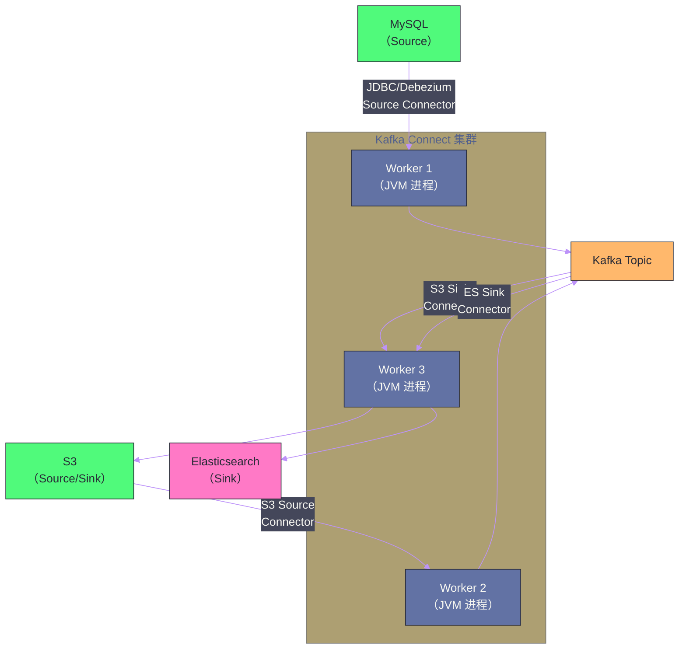

# Kafka Connect 与 Kafka Streams

## 摘要

Kafka 作为数据流平台，其核心价值不只是"传递消息"，而是连接各类数据系统并支持流式计算。**Kafka Connect** 解决的是数据集成问题——用标准化的 Connector 插件将外部系统（数据库、对象存储、搜索引擎）的数据导入 Kafka（Source）或从 Kafka 导出到外部系统（Sink），无需手写 Producer/Consumer 代码。**Kafka Streams** 解决的是轻量流计算问题——直接在 JVM 进程内对 Kafka Topic 的数据进行实时转换、聚合、Join，适合逻辑不太复杂但需要低运维负担的场景。理解两者的定位与边界，是在"Kafka Connect + Kafka Streams"、"Flink"、"Spark Streaming"之间做合理技术选型的前提。

---

## 第 1 章 Kafka Connect：标准化的数据集成框架

### 1.1 数据集成的痛点

在 Kafka Connect 出现之前，将外部数据接入 Kafka 需要为每个数据源手写 Producer 代码：MySQL 的 CDC 要写一个 Producer、S3 的数据要写另一个、Elasticsearch 的数据又是另一个。这些代码高度相似（连接数据源、序列化数据、发送到 Kafka、处理错误重试），却需要反复实现，且缺乏统一的运维和监控框架。

Kafka Connect 通过定义一套标准的 **Connector SPI（Service Provider Interface）** 解决这个问题：任何数据源/目标只需实现标准接口，就能以插件形式加载到 Connect 框架中，获得开箱即用的分布式部署、错误处理、Offset 管理和监控能力。

### 1.2 Connect 的架构组成



**Worker**：Connect 的工作进程，是真正执行数据传输的 JVM 进程。生产环境通常部署多个 Worker 组成集群（Distributed Mode），形成高可用部署——某个 Worker 宕机时，其上的 Task 自动迁移到其他 Worker 继续运行。

**Connector**：Connector 是逻辑层面的概念，描述"连接什么数据源/目标、用什么配置"。Connector 本身不做数据传输，而是负责将工作拆分成多个 **Task**。

**Task**：Task 是实际执行数据传输的工作单元。一个 Connector 可以创建多个 Task 实现并行传输（如 MySQL 有 10 张表，每个 Task 负责 2-3 张表）。Task 在 Worker 上运行。

**Converter**：负责数据的序列化/反序列化——Kafka 中的消息是字节流，Converter 定义如何将外部数据格式（JSON、Avro、Protobuf）与 Kafka 消息格式互转。常用的是 `JsonConverter` 和 `AvroConverter`（需要 Schema Registry）。

### 1.3 两种运行模式

**Standalone 模式**：单个 Worker 进程，配置写在文件中。适合开发调试，不适合生产（单点故障，无高可用）。

**Distributed 模式**：多个 Worker 组成集群，配置通过 REST API 动态管理，Connector 和 Task 自动在 Worker 间负载均衡。生产环境必须使用 Distributed 模式。

Connect 集群的内部状态（Connector 配置、Task 分配、Offset）存储在三个内部 Kafka Topic 中：
- `connect-configs`：Connector 配置；
- `connect-offsets`：Source Connector 的 Offset（已读到数据源的哪个位置）；
- `connect-status`：Connector 和 Task 的状态（运行中/暂停/失败）。

### 1.4 Debezium：CDC 的事实标准

**Debezium** 是最流行的 Kafka Source Connector，专门用于 **Change Data Capture（CDC，变更数据捕获）**——实时捕获数据库的行级变更（INSERT/UPDATE/DELETE）并以结构化事件的形式发送到 Kafka。

Debezium 的实现原理因数据库而异：
- **MySQL**：读取 Binary Log（Binlog），解析行格式的变更事件；
- **PostgreSQL**：使用 Logical Replication，通过 Logical Decoding 插件（pgoutput/decoderbufs）输出变更；
- **MongoDB**：读取 Oplog（操作日志）。

Debezium 的核心价值是**不侵入应用层**——不需要修改业务代码，纯数据库层面捕获变更，对应用透明。这使得数据库的实时数据可以流向 Kafka，再分发给下游的数仓、搜索引擎、缓存等多个系统，实现"一份数据，多系统消费"。

---

## 第 2 章 Kafka Streams：嵌入式流处理引擎

### 2.1 Kafka Streams 的定位

**Kafka Streams** 是一个**轻量级流处理库**，直接嵌入在应用 JVM 中运行——不需要独立的集群（对比 Flink 需要 JobManager + TaskManager 集群），不需要额外的基础设施（对比 Spark Streaming 需要 Spark 集群）。它以普通 Java 库的形式引入（`kafka-streams` jar），Kafka Streams 应用就是一个普通的 Java 进程，可以像任何微服务一样部署。

**Kafka Streams 的适用场景**：
- 实时 ETL：从原始 Topic 读取数据，过滤/转换/聚合后写入下游 Topic；
- 实时告警：监控某个指标流，超过阈值时发出告警消息；
- 事件驱动的微服务：接收来自 Kafka 的命令，处理后将结果写回 Kafka；
- 与 Flink 相比，Kafka Streams 更适合**规模中等、逻辑不太复杂、追求低运维成本**的场景。

### 2.2 Stream 与 Table：两种基本抽象

Kafka Streams 有两种核心数据抽象，理解它们的区别是理解 Kafka Streams 的关键：

**KStream（流）**：代表一个**无限、无界的事件序列**，每条记录都是独立的一个事件。适合表示"发生了什么"——订单创建、点击事件、日志条目。KStream 中相同 Key 的多条记录**互不干扰**，各自独立存在。

**KTable（表）**：代表一个**持续更新的状态视图**，每条记录是对某个 Key 的当前状态的**覆盖更新**。相同 Key 的新记录会**覆盖**旧记录，只保留最新值。适合表示"某物当前的状态"——用户档案、账户余额、商品库存。

两者的关系：
- **Stream → Table（流转表）**：对 KStream 按 Key 聚合，得到 KTable（如：对点击流按用户 ID 计数，得到每个用户的点击总数 KTable）；
- **Table → Stream（表转流）**：KTable 的每次更新变化，可以输出为 KStream（变更日志流，Changelog Stream）——这正是 Log Compacted Topic 的语义。

### 2.3 状态存储：RocksDB 的角色

Kafka Streams 中的聚合（Count、Sum、Reduce、Join）都需要维护**状态**（如"用户 A 当前点击次数是多少"）。这些状态存储在哪里？

Kafka Streams 使用 **[[Leveldb|RocksDB]]** 作为本地状态存储后端。RocksDB 是嵌入式键值数据库（不需要独立进程，直接在 JVM 进程内运行），基于 LSM-Tree，写入性能极高，适合流处理中频繁的状态更新。

**状态的持久化与容错**：本地 RocksDB 的数据是"临时"的——如果应用进程崩溃重启，RocksDB 数据可能丢失。Kafka Streams 通过**Changelog Topic**解决这个问题：每次状态更新（写入 RocksDB）同时将变更写入一个对应的 Kafka Topic（Changelog）。进程重启时，从 Changelog Topic 中重放所有历史变更，重建本地状态，实现状态的容错恢复。

这个设计与 Kafka 本身的设计哲学一脉相承：**日志（Log）是真相的来源，任何状态都可以从日志重建**。

### 2.4 Topology：流处理拓扑的构建

Kafka Streams 应用的核心是**处理拓扑（Topology）**——描述数据如何从 Source（输入 Topic）流经一系列处理节点（Processor）到达 Sink（输出 Topic）。

```java
StreamsBuilder builder = new StreamsBuilder();

// 从 "orders" Topic 创建 KStream
KStream<String, Order> orders = builder.stream("orders",
    Consumed.with(Serdes.String(), orderSerde));

// 过滤：只保留金额 > 1000 的订单
KStream<String, Order> highValueOrders = orders
    .filter((key, order) -> order.getAmount() > 1000);

// 按用户 ID（key）统计高价值订单数量
KTable<String, Long> orderCounts = highValueOrders
    .groupByKey()
    .count(Materialized.as("order-counts-store")); // 状态存储名称

// 将 KTable 转为 KStream 并写入输出 Topic
orderCounts.toStream()
    .to("high-value-order-counts", 
        Produced.with(Serdes.String(), Serdes.Long()));

KafkaStreams streams = new KafkaStreams(builder.build(), config);
streams.start();
```

上述代码构建了一个完整的流处理管道：`orders` Topic → 过滤 → 按 Key 分组 → 计数聚合（状态存储在 RocksDB）→ 写入 `high-value-order-counts` Topic。

---

## 第 3 章 Kafka Streams vs Flink：选型指南

### 3.1 核心差异对比

| 维度 | Kafka Streams | Apache Flink |
| --- | --- | --- |
| 部署方式 | 嵌入应用 JVM，无独立集群 | 独立集群（JobManager + TaskManager）|
| 数据源 | 仅支持 Kafka | 支持 Kafka、文件、数据库、Socket 等 |
| 状态管理 | RocksDB（本地）+ Changelog Topic | RocksDB 或 HashMapState，支持 Savepoint |
| 窗口操作 | 支持滚动/滑动/会话窗口 | 更强大的窗口语义，支持复杂 CEP |
| 精确一次 | 支持（Kafka → Kafka 链路）| 支持（更广泛的 Source/Sink）|
| 运维复杂度 | 低（普通 Java 应用）| 高（需要维护 Flink 集群）|
| 扩展性 | 受限于 Kafka Partition 数量 | 横向扩展能力更强 |
| 适用规模 | 中小规模（< 1000 QPS 聚合）| 大规模（百万级 QPS）|

### 3.2 选型建议

**选择 Kafka Streams 的场景**：
- 数据源和目标都是 Kafka，不涉及外部存储的复杂 Join；
- 团队规模小，不希望引入独立 Flink 集群的运维负担；
- 流处理逻辑相对简单（过滤、转换、简单聚合、Kafka-Kafka Join）；
- 服务是微服务架构，流处理是服务功能的一部分（而非独立系统）。

**选择 Flink 的场景**：
- 需要消费多种数据源（Kafka + MySQL CDC + HDFS 文件）；
- 需要复杂的时间窗口语义（Late Event 处理、Event Time 对齐）；
- 状态规模极大（TB 级别的状态），需要精细的 State Backend 管理；
- 需要复杂事件处理（CEP）；
- 团队有 Flink 运维经验，或已有 Flink 基础设施。

---

## 总结

本篇介绍了 Kafka 生态的两个重要扩展：

**Kafka Connect**：标准化数据集成框架。Source Connector（外部系统 → Kafka）+ Sink Connector（Kafka → 外部系统），通过 Connector SPI 插件化实现不同数据源的接入。Debezium 是 CDC 场景的事实标准，实现数据库变更的实时流化。Distributed 模式提供高可用和动态扩展能力。

**Kafka Streams**：嵌入式轻量流处理库。KStream（事件流）和 KTable（状态表）是两大核心抽象，RocksDB 提供本地状态存储，Changelog Topic 保证状态容错恢复。适合 Kafka→Kafka 链路的中等规模流处理场景，运维成本远低于独立的 Flink/Spark 集群。

下一篇深入 Kafka 生产运维的关键指标与故障处理：[[10 Kafka 生产运维——监控指标、常见故障与容量规划]]。

---

> [!note] 参考资料
> - Apache Kafka 文档,《Kafka Connect》《Kafka Streams Developer Guide》
> - Debezium 官方文档: https://debezium.io/documentation/
> - Confluent Blog,《Kafka Streams vs Apache Flink》
> - 《Kafka Streams in Action》, O'Reilly

---

> [!note] 思考题
> 1. Kafka 集群最关键的监控指标包括：`UnderReplicatedPartitions`（副本落后的 Partition 数）、`ActiveControllerCount`（活跃 Controller 数）、`OfflinePartitionsCount`（离线 Partition 数）。`UnderReplicatedPartitions > 0` 持续出现意味着什么？可能的原因有哪些（磁盘慢、网络问题、Broker 过载）？
> 2. Consumer Lag（消费延迟 = 最新 Offset - 消费 Offset）是衡量消费者健康度的关键指标。Lag 持续增大意味着消费速度跟不上生产速度。除了增加 Consumer 实例数，还有什么手段降低 Lag（如增大 `max.poll.records`、优化消息处理逻辑、并行处理）？
> 3. Kafka 的分区重分配（`kafka-reassign-partitions`）用于平衡各 Broker 的负载或迁移数据到新 Broker。重分配过程中数据需要在 Broker 之间复制——产生大量网络和磁盘 IO。如何通过限流（`--throttle`）控制重分配的速度以避免影响生产消费？
