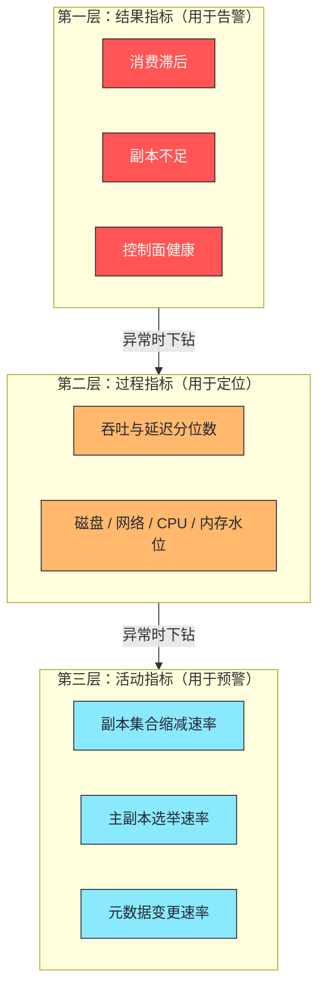

# 10 Kafka 生产运维——监控指标、常见故障与容量规划

**摘要：**

生产运维可以归结为三个能力：**看得见**（该监控什么）、**判得准**（故障时怎么定位）、**算得对**（容量怎么规划）。本文按这三个能力展开。先讲"看得见"——Kafka 暴露的指标很多，但真正需要盯住的核心指标很少：**消费滞后**反映业务健康度、**副本不足**反映数据安全余量、**控制面健康**反映集群能否响应变化；其余指标大多服务于"定位这三类问题的根因"。再讲"判得准"——把常见故障归纳成五类（消费滞后增长、副本不足持续、磁盘写满、写入被拒、集群管理异常），并提炼出一条共同的处置结构：**先确认方向、再区分类型、最后针对性处置**。然后是"算得对"——分区数、磁盘容量、网络与内存各自的估算方法，以及三条规划原则。之后是跨集群复制的两种拓扑与消费进度映射的边界，以及变更管理的纪律。最后是边界与常见误判，以及整个专栏的收束。

---

## 第 1 章 运维的三个能力

### 1.1 看得见、判得准、算得对

Kafka 的生产运维可以归结为三个能力，它们的顺序不能颠倒。

**看得见**是"知道现在发生了什么"——**依赖监控指标与告警。** 没有它，问题只能在业务侧暴露（那时已经晚了）。

**判得准**是"知道问题出在哪一环"——**依赖排查路径与故障经验。** 没有它，处置会变成"试各种办法"。

**算得对**是"知道还能撑多久"——**依赖容量规划。** 没有它，扩容会变成"出问题才加机器"。

**三者的关系是递进的**：**看得见是前提**（不知道有问题就无从判断），**判得准决定恢复速度**，**算得对决定能否避免重复出问题。**

### 1.2 为什么这三件事缺一不可

三件事各缺一件的后果都值得说明。

**只有监控没有排查路径**：告警响了但不知道从哪查起——**表现为"告警很多但问题解决很慢"。**

**只有排查路径没有监控**：能解决已知问题，但**问题总是"被业务先发现"**——表现为"总是在救火"。

**两者都有但没有容量规划**：每次问题都能解决，但**同样的问题会周期性重现**——因为根因是"容量不足"，而每次只是临时缓解。

**因此这三件事构成了一个闭环**：监控发现 → 排查定位 → 规划根治。**而它们分别对应了"发现能力""定位能力""预测能力"。**

### 1.3 指标很多但核心很少

Kafka 暴露的指标数量很大，但**真正需要"盯着看"的核心指标只有几个**——其余大多服务于"定位根因"。

**这个区分很重要**，因为它决定了告警的设计：**核心指标用于"发现"，其余指标用于"排查"。** 把后者也设成高优先级告警，会造成告警泛滥（第 4 篇讲的"告警疲劳"）。

**判断一个指标属于哪一类，可以问一个问题**：**"它变差时，业务是否立即受影响？"** 是则属于"发现类"（应当告警）；否则属于"排查类"（应当可查但不告警）。

**这条判断与第 4 篇讲的"只监控组件不监控业务感知"是同一件事的另一面**：**告警应当挂在"业务感知"上，而"组件指标"用于定位。**

### 1.4 监控分层的图示

把指标按用途分层画出来，能看清"哪一层用于什么"。

**图中最值得注意的是"箭头方向"**：**排查是从第一层向第三层下钻的**——**先看到"业务受影响"（第一层），再定位"是哪类过程出了问题"（第二层），最后发现"有什么异常活动"（第三层）。**

**这个下钻方向与"因果方向"相反**：**因果上，第三层的异常活动导致了第二层的过程变化，进而导致第一层的结果异常。** **而排查是沿着因果链反着走的**——**这正是"从现象到根因"的一般方法。**

**理解这个方向差异有实际价值**：它说明"排查的起点永远是结果指标，而不是活动指标"——**从活动指标出发排查，会在"没有结果异常时"白费力气**（因为集群本来就可能有正常的活动）。

---

## 第 2 章 三个核心指标

### 2.1 消费滞后：业务健康度

**消费滞后**是"分区最新消息位置"与"消费者已提交位置"的差值——**它直接回答"还有多少消息没被处理"。**

它的三种形态（稳定小滞后、持续增长、突增后回落）在第 4 篇已展开。这里补充它的**告警设计**：

**告警应当基于"滞后量"与"滞后增速"两个维度**——只设阈值会漏掉"缓慢但持续的增长"（因为单点看它可能还没到阈值）；只设增速会漏掉"已经积压很多但增速为零"（因为消费者可能已经停止）。

**另一个要点是"按分区观察"**：滞后必须按分区看，**因为"某个分区严重滞后"会被总和的平均值掩盖**（第 4 篇已展开）。**因此告警应当基于"分区级滞后的最大值"，而不是"总和"。**

### 2.2 副本不足：数据安全余量

**副本不足分区数**是"同步副本集合少于期望副本数"的分区数量——**它回答"当前能容忍多少节点故障"。**

**为什么它比"节点是否存活"更重要**：节点存活只说明"它在线"，**而副本不足说明"数据安全余量已经下降"**——例如三个副本中有一个掉队，此时系统只能再容忍零个节点故障（否则副本不足两个）。

**它的持续存在是一个明确的信号**：说明"有副本长期跟不上"——**而根因通常在"那个节点所在的资源"上**（磁盘 IO、垃圾回收、网络）。

**因此它的处置方向不是"处理这个指标"，而是"排查那个掉队的节点"**——**这与第 5 篇讲的"副本不足是防线生效而非故障本身"是同一件事。**

### 2.3 控制面健康：集群能否响应变化

第三个核心指标是**控制面健康**——具体表现为"活动控制器数量是否恰好为一"与"离线分区数是否为零"。

**活动控制器数量不等于一**说明两种异常：**为零**意味着"没有控制器，集群无法响应节点变化"；**大于一**意味着"出现脑裂，多个节点都认为自己是控制器"——**而后者的后果更严重**（可能产生冲突的元数据变更）。

**离线分区数大于零**意味着"有分区没有主副本"——**这些分区既不能读也不能写**，而它们对应的业务立即受影响。

**两个指标的共同特征是"它们一旦异常，业务立即受影响"**——**因此它们属于典型的"发现类"指标（第 1.3 节的判断标准）。**

### 2.4 三个指标的分工

三个核心指标分别对应三个不同的关注面，缺一个就会有盲区。

| 指标 | 关注面 | 异常的含义 |
|---|---|---|
| 消费滞后 | 业务健康度 | 下游处理跟不上 |
| 副本不足 | 数据安全余量 | 容忍故障的能力下降 |
| 控制面健康 | 集群响应能力 | 集群无法处理节点变化 |

**三者的关系是"互补而非重叠"**：**消费滞后关注"数据流"，副本不足关注"数据安全"，控制面关注"集群能力"。** **一个指标正常不代表其他两个正常**——例如"滞后为零、副本充足"但"控制面异常"时，集群看起来一切正常，**直到有节点故障才会暴露问题。**

**这也是"核心指标要少但必须覆盖不同维度"这条原则的具体体现**：**不是"越少越好"，而是"覆盖所有维度且每个维度只留最关键的"。**

### 2.5 三个指标的观察节奏

三个指标虽然都是"发现类"，但它们的观察节奏不同，这一点影响告警的配置。

**消费滞后需要"高频观察"**：它的变化很快（一次消费停滞就能让它在几分钟内显著上升），**因此它的采集与告警周期应当较短。**

**副本不足需要"持续观察"**：它的单次波动可能只是"某个副本暂时落后"（正常现象），**而"持续存在"才是问题**——**因此它应当基于"持续时间"告警，而不是"瞬时值"。**

**控制面健康需要"即时告警"**：它一旦异常，业务立即受影响，**因此不应当设置任何"容忍时间"**——**只要不是正常值就立刻告警。**

**三种节奏的差异说明"告警策略不能统一"**：**同样是核心指标，"多快响应"取决于"它变化的快慢"与"它异常时的严重程度"。** **而这也解释了为什么"照搬一套阈值"往往不合适**——**因为不同指标的"正常波动范围"与"恶化速度"本来就不同。**

### 2.6 指标背后的机制

最后说明一个容易被忽略的点：**这三个指标之所以"核心"，是因为它们各自对应一个前面讲过的机制。**

**消费滞后对应"消费进度与日志末端"这组量**（第 4 篇）——它是"消费链路的健康度"的直接投影。

**副本不足对应"同步副本集合"**（第 5 篇）——它是"数据安全余量"的直接投影。

**控制面健康对应"控制器与元数据传播"**（第 6 篇）——它是"集群响应能力"的直接投影。

**这个对应关系的价值在于"它让指标可以被解释"**：**当指标异常时，知道它背后是哪个机制，就能立刻想到"该从哪个方向排查"。** **而"知道指标背后的机制"与"记住指标的阈值"，是两种完全不同层次的掌握**——**前者可以应对没见过的情况，后者只能应对见过的情况。**

---

## 第 3 章 其他重要指标

### 3.1 吞吐与延迟类

**吞吐类**指标（每秒写入与读取的字节数）回答"集群在承载多少流量"——**它们用于容量规划与异常检测**（例如"流量突然暴涨"）。

**延迟类**指标（各类请求的处理耗时，应当看分位数）回答"客户端感知到多慢"——**它们与"消费滞后"配合使用**：**滞后回答"积压多少"，延迟回答"为什么慢"。**

**两类指标的使用方式不同**：吞吐用于"看趋势"（是否有异常增长），延迟用于"定位"（哪一类请求变慢）。**而它们的告警优先级低于三个核心指标**——因为它们是"过程指标"，而核心指标是"结果指标"。

### 3.2 资源水位类

资源类指标包括**磁盘使用率、磁盘 IO 利用率、网络带宽利用率、CPU 与内存**。

**它们的用途是"提前发现瓶颈"**：磁盘使用率接近上限、网络带宽接近饱和，都意味着"很快会出现问题"。**因此它们属于"预警类"——应当设较低的告警级别，但必须可见。**

**其中"磁盘使用率"最值得单独关注**，因为它有硬上限：**磁盘写满会直接导致写入失败**（第 4.3 节展开）。**而它的增长速度往往可以被预测**（由写入速率与保留策略决定），因此它是最适合做"趋势预测"的指标。

### 3.3 变更类指标

还有一类容易被忽略的指标：**反映"集群正在变化"的指标**。

**包括**：同步副本集合的缩减速率、主副本选举的速率、以及元数据变更的速率。

**它们的用途是"发现异常的活动"**：**一个稳定的集群，这些指标应当接近零。** 如果它们持续非零，说明"有节点反复失活"或"有频繁的元数据变更"——**而这类活动往往是其他问题的前兆。**

**这与第 4 篇讲的"再平衡频率"、第 6 篇讲的"元数据变更速率"是同一类指标**：**它们反映的是"系统有多动荡"，而不是"系统有多忙"。** **而"动荡"往往比"忙"更危险**——因为它意味着"有不稳定的东西存在"。

### 3.4 指标的分层

把上述指标按"用途"分层，可以得到一个清晰的监控结构。

**第一层：结果指标**（三个核心指标）——**回答"业务是否正常"，用于告警。**

**第二层：过程指标**（吞吐、延迟、资源水位）——**回答"为什么"，用于定位。**

**第三层：活动指标**（副本缩减、选举、元数据变更）——**回答"是否有异常活动"，用于预警。**

**三层的使用方式不同**：第一层"盯着看"，第二层"出事时查"，第三层"定期看趋势"。**而它们的告警级别也应当依次降低。**

**这个分层与第 3 篇讲的"监控三视图"、第 6 篇讲的"集群管理四类指标"是同一个结构**：**结果层用于发现，过程层用于定位，活动层用于预警。** **而"发现—定位—预警"恰好对应第 1 章讲的三个能力中的前两个（以及容量规划的一部分）。**

### 3.5 指标采集的两种方式

最后说明指标采集的两种方式，因为它们决定了"能拿到什么粒度"。

**其一是从服务端采集**（通过管理接口暴露的指标）：它能拿到"服务端视角"的信息（请求延迟、资源占用、副本状态）。**它的优点是覆盖面广、开销可控。**

**其二是从客户端采集**（由生产端与消费端自行上报）：它能拿到"客户端视角"的信息（发送延迟、处理耗时、滞后）。**它的优点是能看到"服务端看不到的部分"**——例如"消费者的处理逻辑有多慢"。

**两者必须结合**：**只有服务端指标，就无法区分"消费慢"与"生产快"**（因为滞后是两者的差值）；**只有客户端指标，就无法知道"服务端是否过载"。**

**这个"两侧结合"的原则与第 9 篇讲的"拓扑的可观测性需要同时看代码侧与数据侧"是同一类判断**：**当问题可能出在链路的任一端时，观测必须覆盖两端**——**否则会在"只看一侧"时得出错误结论。**

### 3.6 告警的设计原则

最后把告警的设计收敛成三条原则。

**原则一：告警挂在"结果指标"上。** **因为告警的目的是"让人采取行动"，而只有"业务受影响"才值得打断别人。** 把"排查类指标"也设成告警，会让真正重要的告警被淹没。

**原则二：告警必须可行动。** 如果一条告警对应的动作是"再看看"，那么它不是告警，而是"提示"——**应当放进看板而不是告警通道。**

**原则三：告警的阈值要有依据。** 阈值的来源应当是"业务可接受的延迟"或"容量的安全余量"，**而不是"上次出事时的数值"。** 后者会让阈值随历史事故漂移，**最终失去意义。**

**三条原则的共同特征是"它们都在回答'这条告警是否值得存在'"**——**而判断标准是"它是否能触发一个明确的动作"。** **这与第 1.3 节讲的"发现类与排查类"的区分是同一件事，只是从"设计告警"的角度重新表述。**

---

## 第 4 章 常见故障与处置

### 4.1 故障一：消费滞后持续增长

**症状**：滞后单向增长且不回落。

**处置的第一步是判断方向**：对比"写入速率的增速"与"消费速率的增速"——**如果写入在加速，那么滞后增长是"上游变化"导致的；如果写入稳定而消费变慢，那么问题在消费侧。**

**如果是消费侧，按四类原因排查**（第 8 篇已展开）：分区数不足、单条处理耗时过长、拉取参数保守、下游系统瓶颈。

**处置的注意事项**：**增加消费者实例前先确认"实例数是否已超过分区数"**——如果已经超过，加实例无效（第 4 篇已展开）。**而"临时降低处理逻辑复杂度"这类手段应当谨慎使用**——它可能破坏数据正确性。

### 4.2 故障二：副本不足持续存在

**症状**：副本不足分区数大于零且持续。

**处置的第一步是定位"哪些分区、哪个副本"**——因为"副本不足"是聚合指标，**需要下钻到具体的分区与节点。**

**根因通常是三类**：**节点资源不足**（磁盘 IO 饱和、CPU 争抢、垃圾回收暂停）、**网络问题**（带宽不足或抖动）、**节点本身异常**（进程不健康）。

**处置方向**：如果是资源问题，可以"把部分分区迁移到其他节点"（缓解当前压力）或"扩容"（根本解决）；如果是节点异常，应当先确认该节点是否应该被替换。

**一处需要避免的误判**：**不要"为了消除这个指标"而调大"落后判定阈值"**——那只是让指标好看，而实际的同步问题仍然存在（第 5 篇已展开）。

### 4.3 故障三：磁盘写满

**症状**：某个节点的磁盘使用率接近上限，其上的分区写入失败。

**根因通常是三类**：**保留策略过长**（历史数据未及时清理）、**写入量突增**（可能是上游异常导致的"消息洪水"）、**容量规划不足**。

**处置的顺序是"先止血、再治本"**：**先临时缩短保留时间**（触发清理，释放空间），**再确认根因**（是保留策略问题、还是写入异常、还是容量不足）。

**一处重要的注意事项**：**缩短保留时间是"有代价的止血手段"**——它会删除历史数据，**因此必须确认"这些数据是否还有下游需要"**（例如正在补数据的消费者）。**这与第 5 篇讲的"截断未提交消息"一样，属于"看起来像数据丢失、但实际是必要动作"的操作**——**因此需要明确告知相关方。**

### 4.4 故障四：写入被拒

**症状**：生产者收到"副本不足"类的错误。

**这不是故障，而是"防线生效"**（第 3 篇与第 5 篇已展开）：**它说明同步副本集合低于最小要求，系统选择了"拒绝写入"而不是"降级"。**

**因此处置的方向不是"让写入成功"，而是"恢复副本集合"**——**即排查"为什么副本掉队"**（与第 4.2 节是同一个根因）。

**一处需要避免的误判**：**不要为了"让业务先跑起来"而调低最小副本数**——**那等于放弃可靠性保证**。**如果确实需要临时放宽，必须明确记录这是一个"已知的可靠性降级"，并在恢复后立刻改回。**

### 4.5 故障五：集群管理异常

**症状**：节点故障后其分区长期无主副本；或有节点的元数据视图与其他节点不一致。

**根因通常是三类**（第 6 篇已展开）：**控制器不可用**、**控制器过载**、**传播受阻**。

**处置顺序**：先确认控制器是否可用（不可用则先恢复），再确认是否过载（看元数据变更速率），最后确认是否有节点未同步到最新元数据。

**这类故障的特征是"它不表现为数据错误，而表现为集群行为异常"**——**因此排查入口是"集群状态"而不是"业务数据"。**

### 4.6 五类故障的对照

把五类故障的症状、根因方向与处置方向列成一张对照表，便于快速定位。

| 故障 | 症状 | 根因方向 | 处置方向 |
|---|---|---|---|
| 消费滞后增长 | 滞后单向上升 | 上游加速或下游变慢 | 先定方向，再按四类原因排查 |
| 副本不足持续 | 副本不足数大于零且持续 | 节点资源或网络 | 排查掉队节点，必要时迁移分区 |
| 磁盘写满 | 写入失败 | 保留策略或写入突增 | 先临时止血，再治本 |
| 写入被拒 | 生产者收到副本不足错误 | 与"副本不足"同源 | 恢复副本集合，而非放宽阈值 |
| 集群管理异常 | 分区长期无主或视图不一致 | 控制器不可用、过载、传播受阻 | 按顺序排查控制器与传播 |

**这张表最值得注意的是"写入被拒"与"副本不足"同源**——**它们看起来是两个不同的故障（一个报错、一个是指标异常），但根因是同一个。** **识别"不同症状同源"能避免重复排查**——**这也是"故障分类"的价值：把表面不同的现象归到同一类根因上。**

**另一处值得留意的是"磁盘写满"的处置方向是"先止血再治本"**——**它是五类中唯一一个"必须立即释放资源"的故障**（因为磁盘满了之后写入会直接失败，没有缓冲时间）。**因此它的处置顺序与其他四类不同。**

### 4.7 五类故障的优先级

五类故障的"紧急程度"不同，这决定了处置的优先级。

**最紧急的是"磁盘写满"与"写入被拒"**：**它们直接影响写入**（前者让写入失败、后者让生产者报错），**因此需要立即处置。**

**其次是"控制面健康异常"**：它本身不直接影响读写，**但它让集群失去响应变化的能力**——**如果此时恰好有节点故障，影响会被放大。**

**再次是"副本不足持续"**：它不直接影响业务，**但它让"容忍故障的能力"下降**——**因此它是"定时炸弹"，需要在它变成故障之前处理。**

**最后是"消费滞后增长"**：它影响的是"数据的时效性"，**而数据的时效性通常是渐变的**（除非业务有硬性的时效要求）。

**这个优先级排序的判据是"它是否立刻影响读写"**——**这与会话层的"发现类指标"判断标准（第 1.3 节）是同一个依据**：**影响越直接，优先级越高。** **而"副本不足"这类"不影响当前但影响未来"的问题，最容易被"往后放"**——**这也是它需要被单独强调的原因。**

---

## 第 5 章 故障处置的共同结构

### 5.1 先确认方向

把五类故障的处置放在一起看，会发现它们共享同一个结构：**先确认方向、再区分类型、最后针对性处置。**

**"确认方向"回答的是"问题在哪一侧"**：消费滞后要判断"上游还是下游"；副本不足要判断"是资源还是节点"；集群管理异常要判断"是控制器还是传播"。

**这一步的价值在于"砍掉一半的可能性"**——**而它依赖的正是监控提供的"可区分特征"。** 因此监控设计的一个核心要求是"**让不同方向的问题有不同的指标表现**"。

### 5.2 再区分类型

**"区分类型"回答的是"具体是哪一类原因"**——例如消费侧的四类原因、副本不足的三类根因。

**这一步的产物是一个"候选清单"**，而清单的每一项都有对应的验证方法。**因此这一步不需要试错，只需要按清单逐项验证。**

**这也是"排查路径"相比"凭经验"的价值所在**：**它把"猜"变成了"验证"。**

### 5.3 最后针对性处置

**"针对性处置"回答的是"怎么做"**——而它的前提是前两步已经确定了根因。

**这一步有两类常见错误**：**其一是"用缓解代替根治"**（例如"临时降保留"而不解决容量不足）——**这会导致问题周期性重现**；**其二是"用降级代替修复"**（例如"调低最小副本数"）——**这会静默地降低可靠性**。

**两类错误的共同特征是"它们能让指标立刻变好"**——**而这正是它们危险的原因**：**指标变好让人以为问题解决了，而实际问题被掩盖了。**

**因此处置完成后应当回答一个问题**：**"这个动作是解决了问题，还是只是让问题不再显现？"** **如果答案是后者，那么它是一个临时措施，必须有后续的根治动作。**

### 5.4 处置结构的复用性

这个"三步结构"不只适用于本专栏的五类故障，**它是一种通用的排查方式。**

**在别的系统里也能套用**：例如"查询变慢"先确认方向（是数据量增长还是计划变化）、再区分类型（缺索引、统计过期、还是资源争抢）、最后针对性处置。**结构相同，只是"方向"与"类型"的具体内容不同。**

**这条复用性来自"因果链"这个共同结构**：**任何故障都是"某个根因经过若干中间环节，最终表现为一个现象"。** **而"确认方向"是在中间环节上做切分，"区分类型"是在根因层做分类**——**因此这个结构对任何"有因果链的故障"都成立。**

**这也是本专栏反复强调"理解机制"的原因**：**"方向"与"类型"的具体内容，只能从"机制"里推导出来**——**理解了"滞后是生产与消费的差值"，才能知道"确认方向"要比较两者的速率；理解了"副本不足来自节点资源"，才能知道"区分类型"要查哪几类资源。**

---

## 第 6 章 容量规划

### 6.1 分区数

**分区数的估算依据是"目标吞吐与并行度"**：分别按"目标写入吞吐除以单分区可承载吞吐"与"目标消费吞吐除以单分区可消费吞吐"计算，取较大值。

**但分区数的约束不止吞吐**（第 1、4、6、8 篇已从四个角度展开）：它还受**消费并行度上限**、**集群管理能力**（元数据规模）、以及**流处理并行度**的约束。**因此最终取值是这些约束的交集。**

**一条必须记住的性质是"分区数只能增加不能减少"**——因此它需要按"预期峰值"而不是"当前负载"规划。**而增加分区会打破原有的键到分区的映射**（因为哈希取模的分母变了），**因此"何时扩分区"需要与业务方协调**（涉及"同一键的历史消息与新消息落在不同分区"这个问题）。

### 6.2 磁盘容量

磁盘容量的估算方式是"**写入速率乘以保留时间乘以副本数**"，再留出余量。

**三个变量的取值依据**：**写入速率**取峰值（而不是平均）；**保留时间**由业务对"数据可回溯多久"的要求决定；**副本数**由可用性要求决定。

**一处需要留意的修正**：**如果开启了压缩，实际占用会明显小于按原始体积估算的值**（第 8 篇已展开）。**因此估算时应当用"压缩后的体积"，或先按原始体积算再乘以一个经验系数。**

**另一处容易低估的是"非数据占用"**：索引文件、以及"已删除但尚未回收"的部分都会占用空间。**因此"留出余量"不只是为了应对增长，也是为了容纳这些额外占用。**

### 6.3 网络与内存

**网络容量**的估算要同时考虑"业务流量"与"副本同步流量"——**因为副本同步占用同一批网卡**（第 5 篇已展开）。**一个三副本集群的网络流量大约是"业务写入量的三倍量级"**（一份来自生产端、两份用于副本同步）。

**内存容量**的估算依据是"页缓存需要覆盖的数据量"——**它等于"峰值写入速率乘以可接受的消费滞后时间"**（第 2 篇已展开）。**因此"消费滞后越大，需要的页缓存越多"**——而"滞后很大"本身就意味着"需要优化消费能力"，**而不是"加内存"。**

**两处估算的共同特征是"它们都不能只按业务流量算"**：网络要加上副本同步，内存要按"热数据范围"算。**而这两个修正项都容易被忽略**——**因为它们不是"业务产生"的流量或数据。**

### 6.4 规划的三条原则

把容量规划的方法收敛成三条原则。

**原则一：按峰值而不是平均规划。** 平均负载下"够用"的配置，在峰值时会成为瓶颈——**而峰值正是"出问题"的时刻。**

**原则二：留出可解释的余量。** 余量的作用不是"应对意外"，而是"容纳已知的额外占用"（压缩、索引、未回收数据、副本同步）。**因此余量应当能被解释，而不是一个凭感觉的比例。**

**原则三：让增长可预测。** 规划不只是"算出当前需要多少"，还要"知道它何时会不够"——**因此需要监控"增长趋势"而不只是"当前水位"**（第 3.2 节已展开）。

**三条原则的共同特征是"它们都指向'可预测'"**——**而"可预测"正是运维工作的核心目标**（第 8 篇也提到这一点）。**一个"不可预测"的系统即使当前性能很好，也无法被放心地运营。**

### 6.5 容量规划与变更的关系

容量规划与变更管理之间有一层关系值得说明：**规划的结果会触发变更，而变更本身也要消耗容量。**

**例如"分区数需要增加"**：扩分区这个动作本身是元数据变更，**而它会影响"键到分区的映射"**——因此它需要与业务方协调（第 6.1 节已展开）。

**例如"磁盘需要扩容"**：扩容往往意味着"新增节点"，**而新增节点会触发数据搬迁**——**而搬迁会占用网络与磁盘带宽**（第 2 篇已展开）。**因此"扩容"这个动作在完成之前，反而会加剧资源紧张。**

**例如"需要迁移分区以均衡负载"**：迁移同样是"读出来再写过去"，**因此它会与业务争抢资源。**

**三处关系的共同特征是"规划的结果不是'加资源'，而是'一次消耗资源的变更'"**——**因此规划需要把"变更本身的成本"算进去。** **这与第 6 篇讲的"扩容时会加剧资源紧张"是同一件事**——**而它的实践含义是"扩容要提前做，不能等到临界点"。**

---

## 第 7 章 跨集群复制

### 7.1 两种拓扑

跨集群复制有两种典型拓扑，它们的取舍点不同。

**主动备用**：生产集群向备用集群单向复制，**备用集群平时不承载写入**。它的优点是简单（不存在"双向冲突"），**缺点是备用集群的资源在平时处于闲置状态。**

**主动主动**：两个集群互相复制，**都可以接受写入**。它的优点是资源利用率高、且两边都能服务就近的客户端；**缺点是引入了"冲突"这个问题**（同一个键在两个集群被同时修改时，谁赢？）。

**取舍的关键是"是否接受冲突"**：**如果能接受（例如写入天然按区域划分，同一键只在一个集群被写），那么主动主动更划算；如果不能接受，那么主动备用是唯一选择。**

**这一点与第 5 篇讲的"不干净选举"是同一类判断**：**都是在"可用性/效率"与"一致性"之间选择**——**而选择的依据都是"业务能否接受冲突的后果"。**

### 7.2 消费进度的映射

跨集群复制有一处容易被低估的复杂性：**消费进度的映射。**

**问题的形态是**：源集群的"位置"与目标集群的"位置"不是同一个值——**因为目标集群可能包含额外的消息，或者消息在复制时被重新编号。**

**因此"切换集群"不是"把消费者指过去"就行**——**而是需要把"源集群的消费进度"翻译成"目标集群的对应进度"。** 复制工具通常会维护一份映射表来支持这个翻译。

**这个映射的边界在于"它不完美"**：在极端情况下（例如部分消息未被复制），**映射可能产生轻微的重复或遗漏**——**因此业务侧的幂等处理仍然是必需的兜底**（第 7 篇已展开）。

**这条边界与本专栏反复出现的一条判断一致**：**跨系统的一致性保证总有边界，而边界之外必须由应用层补上保护。**

### 7.3 复制的运维要点

跨集群复制的运维有三处要点。

**其一是"复制的滞后"**：复制本身是一个消费-生产链路，**因此它的滞后需要被监控**——而它比普通的消费滞后更危险，因为"复制滞后"意味着"备用集群的数据不完整"，**而这一点在切换时才会暴露。**

**其二是"复制的容量"**：跨集群链路通常跨区域，**因此带宽成本高**——**压缩在这里的收益最明显**（第 8 篇已展开），因为它是典型的"带宽受限"场景。

**其三是"切换的演练"**：切换涉及"消费者指向、进度映射、生产端切换"多个动作，**因此必须演练过才可靠**——**没有演练过的切换方案，不能算作方案**（这与第 5、6 篇讲的"备份与迁移必须验证"是同一条纪律）。

### 7.4 跨集群复制的成本

跨集群复制有一项容易被低估的成本：**它是"双份的资源占用"。**

**在源集群侧**，复制相当于"多了一个消费者组"——**它会占用读取带宽与节点资源。**

**在目标集群侧**，复制相当于"多了一个生产者"——**它会产生与源集群等量的写入**（因此目标集群的容量规划要按"自身写入加复制写入"计算）。

**在网络侧**，跨区域链路通常是最贵的资源——**而复制会持续占用它。**

**三处成本共同说明"跨集群复制的容量规划需要按'两倍业务量'估算"**——**而这与第 6.3 节讲的"网络要加上副本同步"是同一类修正**：**跨集群复制的开销同样不是"业务产生"的，因此容易被忽略。**

**这条规律在本专栏里已经出现多次**：**副本同步、状态备份、跨集群复制——它们都是"为了可靠性或可用性而产生的额外流量"**——**而容量规划中"被忽略的部分"，往往就是这些额外流量。**

### 6.6 容量规划的输出

容量规划应当产出什么？这个问题容易被忽略，但它决定了规划是否有用。

**它的第一项输出是"当前水位与增长趋势"**——回答"现在用了多少、增长多快"。

**它的第二项输出是"预计的临界点"**——回答"按当前趋势，什么时候会不够"。**这一项比第一项更有价值**，因为**它把"容量问题"从一个"突然发生的事"变成了"可以提前安排的事"。**

**它的第三项输出是"扩容的触发条件"**——回答"达到什么水位就该扩容"。**这一项把规划变成了"可执行的规则"**——**而不是"一份需要有人记得去看的报告"。**

**三项输出的递进关系值得留意**：**从"现状"到"预测"再到"触发条件"，每一步都在把"信息"变成"行动"。** **而这也是本专栏反复强调的一条原则——"可预测"之所以重要，是因为它让行动可以提前安排。**

---

## 第 8 章 变更管理

### 8.1 变更的分类

集群的变更可以按"影响面"分三类。

**其一是"局部变更"**：影响单个主题或单个消费者组（例如调整保留策略、扩分区）。**它的影响面可控，可以独立执行。**

**其二是"节点级变更"**：影响单个节点（例如重启、升级该节点的软件、替换硬件）。**它会影响该节点上承载的分区**，因此需要评估"该节点上是否有其他副本可接管"。

**其三是"集群级变更"**：影响整个集群（例如升级所有节点、变更控制器配置、调整全局参数）。**它需要完整的变更流程与回滚预案。**

**三类的共同特征是"影响面越大，准备的充分度要求越高"**——**而"准备"的核心是三件事：影响面评估、回滚方案、验证方式。**

### 8.2 变更的三条纪律

**纪律一：避开业务高峰。** 变更会消耗资源（重启、数据搬迁），**与业务争抢会导致"变更慢、业务也慢"。**

**纪律二：一次只做一类变更。** **多项同时做会让"出问题时无法归因"**——这与第 8 篇讲的"一次只改一项参数"是同一条纪律。

**纪律三：变更前让集群回到稳态。** 如果集群本身已有副本不足、或有大量待处理的事务，**那么变更会把两类问题混在一起。** **因此"确认集群处于健康状态"是变更的前置条件。**

**三条纪律的共同指向是"保留可归因性"**——**因为变更的风险不在于"做错"，而在于"做错了却不知道是哪一步"。**

### 8.3 升级的顺序

节点升级有明确的顺序要求：**先升级数据面（业务节点），再升级控制面（管理节点）。**

**理由是"先让数据面就绪，再让控制面使用新能力"**——**如果反过来，新版控制节点可能依赖新版数据面的能力，导致升级期间功能异常。**

**这条顺序与第 2 篇讲的"存储层升级顺序"、第 6 篇讲的"集群升级顺序"是一致的**——**它们是同一条原则在不同层面的体现：先让"被依赖的一方"就绪，再让"依赖的一方"使用新能力。**

**而"升级"与"架构迁移"是两件不同的事**（第 6 篇已展开）：**前者是"换版本"，后者是"换架构"**——**两者应当分开做，而不是合并成一次变更。**

### 8.4 变更的验证方式

变更之后需要验证，而"验证什么"取决于变更的类型。

**局部变更（如调保留策略）**：验证"目标指标是否变化"——例如磁盘占用是否下降。**这类验证是直接的。**

**节点级变更（如重启、升级节点）**：验证"该节点的分区是否恢复、副本是否回到同步集合"。**这类验证需要等到"副本追上"才算完成**——**因此验证的时长取决于数据量。**

**集群级变更（如整体升级）**：验证"三个核心指标是否正常、以及是否有未预期的异常活动"。**这类验证需要一个观察窗口**（而不是"变更完成后立刻判定成功"）。

**三种验证的共同特征是"验证的时长与变更的影响面成正比"**——**因为"恢复同步"这类动作本身需要时间。** **因此"变更完成"与"变更成功"不是同一个时刻**——**前者是"动作执行完"，后者是"系统回到稳态"。** **把它们混为一谈，会导致"变更后立刻判成功、问题在几小时后才暴露"。**

---

## 第 9 章 边界与反例

### 9.1 反例一：把"指标变好"当作"问题解决"

调整阈值、缩短保留时间、调低最小副本数都能让指标立刻变好，**但它们不解决根因。** 判断标准是"这个动作是解决问题，还是让问题不再显现"（第 5.3 节）。

### 9.2 反例二：只监控组件不监控业务感知

组件指标回答"资源是否紧张"，业务指标回答"用户是否受影响"。**把告警挂在组件指标上，会得到"该响的不响、不该响的天天响"。**

### 9.3 反例三：按平均值观察分区级指标

消费滞后、副本状态都是分区级概念。**用平均值观察会掩盖"个别分区严重异常"。**

### 9.4 反例四：按平均负载做容量规划

平均负载下够用的配置，在峰值时会成为瓶颈——**而峰值正是出问题的时刻。**

### 9.5 反例五：扩容时不考虑"实例数是否超过分区数"

分区数不足时，加消费者实例或流处理实例都无效（第 4、8 篇已展开）。**这是"扩容无效"最常见的形态。**

### 9.6 反例六：把跨集群切换当作"指过去就行"

消费进度的映射是必须处理的环节，**而它本身也有边界（可能产生轻微重复或遗漏）。** 业务侧的幂等兜底不能省。

### 9.7 反例七：变更前不确认集群是否处于稳态

在亚健康状态下执行变更，会把两类问题混在一起。**"先回到稳态，再变更"是基本前提。**

### 9.8 反例八：把"变更完成"当作"变更成功"

节点级与集群级变更需要"等到系统回到稳态"才算成功（第 8.4 节）。**变更后立刻判成功，会让"几小时后才暴露的问题"无法归因到这次变更。**

### 9.9 反例九：把"跨集群复制"当作"不占资源"

复制在源集群占读取资源、在目标集群占写入资源、在网络占带宽。**因此目标集群的容量规划要按"自身写入加复制写入"估算**——**忽略这一点会导致"切换后目标集群立刻过载"。**

### 9.10 反例十：把"副本不足"排在处置列表的最后

它不影响当前读写，**但它让"容忍故障的能力"下降**——**因此它是"定时炸弹"**（第 4.7 节）。**把它往后放，会让"下一次节点故障"从"可控"变成"不可控"。**

---

## 第 10 章 落点

这一篇是专栏的收尾，它把前面九篇的机制收束到三件具体的事上：**该监控什么、故障时怎么定位、容量怎么规划。**

**而这三件事恰好对应了前面所有机制的"用途"**：三个核心指标分别对应"消费链路的健康"（第 4 篇）、"数据安全的余量"（第 5 篇）、"集群响应的能力"（第 6 篇）；故障处置的五类根因分布在存储（第 2 篇）、副本（第 5 篇）、导入（第 3 篇）、集群管理（第 6 篇）各处；容量规划的四个约束（分区数、磁盘、网络、内存）也分别来自前几篇的分析。

**换句话说：运维不是一套独立的知识，而是"对机制的理解"在具体问题上的应用。** 理解了"页缓存与堆共享内存"，就能理解"为什么加堆可能降低性能"；理解了"分区是并行单位"，就能理解"为什么扩分区才能解决并行度不足"；理解了"日志是真相的来源"，就能理解"为什么状态可以从备份主题重建"。

**而这正是本专栏从架构讲起、逐层深入、最后落到运维的原因**——**如果直接讲"该监控什么"，读者只会记住一份清单；而从机制讲起，读者能自己推导出"为什么是这些、而不是别的"。**

**最后回到一条贯穿全专栏的判断方式：任何机制、配置、方案都有它的"边界与代价"，而工程的核心工作是"识别边界、评估代价、并决定接受哪一个"。** 从"有序性边界在分区"到"一致性边界在 Kafka 到 Kafka"，从"页缓存依赖环境"到"精确一次需要两端配合"——**本专栏讲的每一个"边界"，都在提示同一件事：系统的保证总是有条件的，而理解条件比记住结论更重要。**

**如果要用一句话概括这十篇的内容，那可以是：Kafka 把"消息系统"重新定义成了"可持久化的日志"，而它后续的每一个机制——分区、副本、事务、集群管理——都是在这个定义之下，为回答"一致性、可用性、性能"这三者的取舍而长出来的。** **因此理解这些机制的最好方式，不是记住它们的名字，而是追问"它在解决哪个取舍"**——**而这也是本专栏从第一篇的"范式转移"讲起的原因。**

**运维的意义也正在于此**：**它不是"记住该看哪些指标"，而是"理解每个指标背后的机制，从而在它异常时知道该往哪个方向查"。** 一份指标清单会过时，**而"从机制推导出观测点"的能力不会。**

**这十篇从"范式转移"讲到"运维收尾"，走的正是一条"从定位到机制、再从机制回到实践"的路径**——**而这条路径的落点是：任何实践问题的解法，都可以从机制里推导出来；而任何机制的细节，也都能在实践问题里找到它的用途。** 这也解释了为什么本专栏每一篇都会在结尾处"回指"前面几篇——**因为机制之间本来就是相互支撑的一张网，而不是十个孤立的知识点。** 而这张网的收束之处，正是运维。

---

## 专栏导航

- 上一篇：[[09 Kafka Connect 与 Kafka Streams]]。
- 全局架构：[[01 Kafka 全局架构——Broker、Topic、Partition 与消息流转]]。
- 副本机制：[[05 副本机制——ISR、HW 与 Leader Epoch]]。
- 集群管理：[[06 Controller 与集群管理——从 ZooKeeper 到 KRaft]]。
- 返回专栏首页：[[00 专栏导览]]。

---

## 参考资料

1. Apache Kafka. 官方文档：Monitoring（核心 JMX 指标清单）. https://kafka.apache.org/documentation/#monitoring
2. Apache Kafka. 官方文档：Operations（扩缩容、分区重分配与限流）. https://kafka.apache.org/documentation/#basic_ops
3. KIP-382: MirrorMaker 2.0. https://cwiki.apache.org/confluence/display/KAFKA/KIP-382
4. Confluent Platform. 监控与告警指南. https://docs.confluent.io/platform/current/kafka/monitoring.html
5. LinkedIn Engineering. Kafka at Scale 相关工程实践文章. https://engineering.linkedin.com/blog
6. Narkhede N, Shapira G, Palino T. Kafka: The Definitive Guide, Chapter 9 与 Chapter 10. O'Reilly.
7. Beyer B, Jones C, Petoff J, Murphy N R. Site Reliability Engineering. O'Reilly, 2016.
8. Apache Kafka. 官方文档：分区重分配与限流（kafka-reassign-partitions、--throttle）. https://kafka.apache.org/documentation/#basic_ops_cluster_expansion
9. Apache Kafka. 官方文档：Topic 级配置的动态调整（kafka-configs）. https://kafka.apache.org/documentation/#topicconfigs
10. Apache Kafka. 官方文档：跨集群复制的消费进度映射说明. https://kafka.apache.org/documentation/#georeplication
11. Apache Kafka. 官方文档：集群容量规划与分区数建议（partitions and capacity planning）. https://kafka.apache.org/documentation/#partitioning

---

> [!note] 思考题
> 1. 三个核心指标分别对应哪个关注面？为什么"一个正常"不代表"其他两个正常"？
> 2. "发现类"指标与"排查类"指标如何区分？为什么把后者也设为高优先级告警会造成问题？
> 3. 五类故障的处置共享"先确认方向、再区分类型、最后针对性处置"这个结构。这个结构为什么能提高处置效率？
> 4. 容量规划的三条原则为什么都指向"可预测"？
> 5. "任何机制都有它的边界与代价"——请用本专栏的三个具体例子说明这句话。
