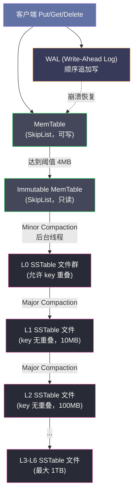
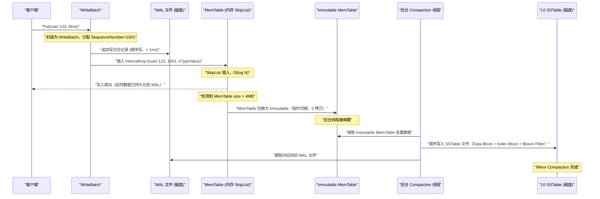

# LevelDB 全局架构——LSM-Tree 的写优化设计

## 摘要

LevelDB 是由 Google 的 Jeff Dean 和 Sanjay Ghemawat 于 2011 年开源的嵌入式键值存储引擎，其核心是 **LSM-Tree（Log-Structured Merge-Tree）** 架构。与传统 B+ 树引擎将随机写转化为磁盘随机 IO 不同，LSM-Tree 通过将所有写入先记录到内存缓冲区（MemTable），再批量顺序写入磁盘（SSTable），将随机写转化为顺序写，从而在写密集型场景下获得数量级的性能提升。本文从 LSM-Tree 的设计动机出发，深度剖析写放大、读放大、空间放大三角权衡的本质，以及 MemTable → Immutable MemTable → SSTable 的完整写入流程，并分析 WAL（Write-Ahead Log）的持久化保证机制，为后续理解 MemTable、SSTable、Compaction 等核心模块奠定认知基础。

---

## 第 1 章 为什么需要 LSM-Tree——存储引擎的根本矛盾

### 1.1 磁盘物理特性的根本约束

在理解 LevelDB 的设计之前，必须先理解存储引擎面临的最根本约束：**磁盘的随机 IO 性能远低于顺序 IO**。

对于传统机械硬盘（HDD），一次随机读写需要经历三个物理动作：磁头寻道（Seek，3~10ms）、盘片旋转等待（Rotational Latency，平均约 4ms）、数据传输。其中寻道和旋转等待占据了绝大部分时间。而顺序 IO 由于磁头不需要大幅移动，可以持续以 100~200MB/s 的速率读写，是随机 IO 吞吐量（约 0.1~1MB/s）的 100 倍以上。

即使是 SSD，情况也类似——尽管 SSD 没有物理寻道，但由于 NAND Flash 的擦写特性，随机小写会导致写放大（Write Amplification）和频繁的垃圾回收，顺序写的吞吐量仍然显著优于随机小写。

这个物理约束决定了：**一个好的存储引擎，必须尽可能将磁盘操作转化为顺序 IO**。

### 1.2 B+ 树的写入困境

传统关系型数据库和早期键值存储（如 [[Berkeley DB]]）普遍使用 [[B+ 树]]作为核心数据结构。B+ 树在读取场景下表现优异——其 O(log N) 的查找复杂度配合磁盘页对齐的节点设计，使得范围查询和点查询都非常高效。

然而 B+ 树的写入模式存在天然缺陷：

**写入放大问题**：每次写入一条键值对，B+ 树需要从根节点遍历到叶节点，找到目标位置，然后将整个 4KB 或 8KB 的磁盘页读入内存，修改后再整页写回。即使只修改了页中一个字节的数据，也需要写回完整的磁盘页。更糟糕的是，当节点发生分裂时，需要更新多个相关节点，引发连锁写入。

**随机 IO 密集**：B+ 树的每次写入都可能触及不同磁盘位置的节点，对于大规模写入工作负载，磁盘寻道成为瓶颈。一个典型 B+ 树引擎在 HDD 上的随机写性能通常只有几千次每秒（IOPS）。

**WAL 的双写代价**：为了保证崩溃安全，B+ 树引擎通常也需要 WAL。这意味着每次写入实际上触发了两次磁盘写：一次顺序写 WAL，一次随机写 B+ 树节点。这被称为"双写问题"（Double Write Problem）。

以一个具体场景来量化这个问题：假设需要写入 100 万条键值对，每条 1KB，数据总量约 1GB。在 HDD 上，若 B+ 树引擎的随机写 IOPS 为 200，每次写入平均需要修改 2 个节点（各 4KB），则完成所有写入需要约 2000 秒。而若能将这 1GB 数据转化为一次顺序写，以 100MB/s 的顺序写速度，只需约 10 秒，性能差距高达 200 倍。

这就是 LSM-Tree 的设计动机——**用顺序写换取随机写的性能**。

### 1.3 LSM-Tree 的核心思想

[[LSM-Tree]] 的思想最早由 Patrick O'Neil 等人在 1996 年的论文《The Log-Structured Merge-Tree》中提出，其核心思想极其朴素：

> **永远不修改磁盘上已有的数据，只追加写入新数据，周期性地将多个有序文件合并成更大的有序文件。**

具体来说，LSM-Tree 将写入分为两个阶段：

1. **内存写入阶段**：所有写入（包括更新和删除）首先写入内存中的有序数据结构（MemTable），并同时追加写到磁盘上的 WAL 以保证持久性。内存写入速度极快，接近内存操作的上限。

2. **批量落盘阶段**：当 MemTable 达到一定大小（LevelDB 默认 4MB）时，将其冻结（转为 Immutable MemTable），并在后台将其顺序写入磁盘，形成一个不可变的有序文件（SSTable，Sorted String Table）。

3. **后台合并阶段**：随着 SSTable 文件不断累积，后台的 Compaction 进程将多个小的 SSTable 文件合并成更大的有序文件，同时清除过期版本和已删除的数据。

这样，**所有的磁盘写入都是顺序追加（Append-Only）的**，完全规避了随机写。代价是读取时可能需要查询多个层级的 SSTable，带来读放大。这就是 LSM-Tree 的核心权衡。

> [!note] 设计哲学
> LSM-Tree 本质上是用"空间"换"写性能"——用更多的磁盘空间（存储多个版本）和更多的读代价（查多个层级）来换取极致的写入性能。这种权衡在写密集型的大数据场景（日志收集、时序数据、用户行为埋点）中往往是值得的。

---

## 第 2 章 三角权衡——写放大、读放大与空间放大

### 2.1 存储引擎的三个核心指标

衡量一个存储引擎性能的核心指标有三个，它们之间存在天然的 **三角权衡（Trilemma）**，无法同时最优：

| 指标 | 定义 | 计算方式 |
|------|------|----------|
| **写放大（Write Amplification，WA）** | 实际写入磁盘的数据量 / 用户写入的数据量 | 磁盘实际写字节数 ÷ 用户写字节数 |
| **读放大（Read Amplification，RA）** | 完成一次读取所需的磁盘 IO 次数 | 查询一个 key 所需读取的磁盘块数量 |
| **空间放大（Space Amplification，SA）** | 存储引擎占用的磁盘空间 / 数据实际大小 | 磁盘占用字节数 ÷ 数据实际字节数 |

这三个指标的权衡不是一个工程实现问题，而是信息论层面的根本约束——任何存储引擎都必须在这三者之间做出取舍。理解这个三角约束，才能理解 LSM-Tree 和 B+ 树的根本差异，以及 LevelDB 各种设计决策的来源。

### 2.2 B+ 树的权衡位置

**写放大**：B+ 树的写放大较高。每次更新一个 key，即使数据本身只有几十字节，也需要修改并刷回 4KB 的磁盘页。若存在节点分裂，写放大进一步增大。典型 B+ 树的写放大在 5~10 倍甚至更高。

**读放大**：B+ 树的读放大较低。对于一个高度为 H 的 B+ 树，点查询最多需要 H 次磁盘 IO（通常 3~4 次）。由于 B+ 树的叶节点是有序链表，范围查询也非常高效。

**空间放大**：B+ 树的空间放大较低。每个 key 在 B+ 树中只存在一个版本，不存在冗余。但节点内部的碎片（不满节点）会带来一定的空间浪费，通常空间放大约 1.3~2 倍。

### 2.3 LSM-Tree 的权衡位置

**写放大**：LSM-Tree 原始写入（写 MemTable + WAL）的写放大接近 1 倍，但 Compaction 会带来额外的写放大。每次 Compaction 将 Level-N 的文件与 Level-(N+1) 中有重叠的文件合并后重新写入，这个过程中数据会被多次读取和写入。LevelDB 的典型写放大在 10~30 倍之间（Compaction 的级联效应）。

**读放大**：LSM-Tree 的读放大较高。对于一次点查询，最坏情况需要检查 L0 层的所有 SSTable、以及 L1 到 LMax 每层各一个 SSTable。LevelDB 有 7 层，读放大最坏可达 L0 文件数 + 6 次。Bloom Filter 的引入可以大幅减少无效 IO，但理论上的读放大仍然高于 B+ 树。

**空间放大**：LSM-Tree 的空间放大是三者中最高的。由于旧版本数据在 Compaction 之前不会被清除，磁盘上同时存在同一 key 的多个版本。空间放大通常在 1.1~2 倍，但若 Compaction 触发不及时，可能临时出现更高的空间放大。

```
              写放大低
               /\
              /  \
             /    \
            /      \
           /  B+树  \
          /    (低WA)\
         /-----------\
        /             \
       /    最优点     \
      /   （不可达）    \
     /___________________\
  读放大低              空间放大低
                 ^
                 |
               LSM-Tree
              (低WA，高RA/SA)
```

> [!info] 核心概念
> **写放大** 是衡量写密集型工作负载存储引擎效率的核心指标。写放大 = 10 意味着用户写入 1GB 数据，磁盘实际写入了 10GB，这不仅消耗了更多 IO 带宽，还加速了 SSD 的磨损（SSD 的 P/E 次数有限）。对于 SSD 而言，降低写放大的意义尤为重要。

### 2.4 LevelDB 的权衡策略

LevelDB 选择了**将写放大控制在可接受范围内，同时通过 Bloom Filter 和多层索引来缓解读放大**的策略：

1. **降低读放大**：每个 SSTable 文件携带 Bloom Filter，读取时首先查询 Bloom Filter，若判定 key 不存在则跳过该文件（无需 IO），大幅减少无效读取。

2. **控制写放大**：通过分层（Leveled）Compaction 策略，将 L0→L1 的合并频率和数据量控制在较小范围，避免整体 Compaction 开销过大。

3. **接受空间放大**：LevelDB 允许临时的空间放大，通过 Compaction 周期性清理过期版本，将长期空间放大控制在约 1.1~1.5 倍。

---

## 第 3 章 LevelDB 全局架构与组件解析

### 3.1 整体架构总览

LevelDB 的整体架构由以下几个核心组件构成：



各组件职责如下：

| 组件 | 类型 | 职责 |
|------|------|------|
| **MemTable** | 内存（可写） | 接收所有写入，基于 SkipList 实现有序性，支持快速写入和读取 |
| **Immutable MemTable** | 内存（只读） | MemTable 满后转换而来，等待后台线程将其刷盘 |
| **WAL（Write-Ahead Log）** | 磁盘（顺序写） | 记录所有写操作，保证崩溃后可从 WAL 恢复 MemTable 数据 |
| **L0 SSTable** | 磁盘（不可变） | Immutable MemTable 刷盘后生成，同层文件间 key 可能重叠 |
| **L1~L6 SSTable** | 磁盘（不可变） | 经 Major Compaction 生成，同层文件间 key 无重叠，按层递增 |

### 3.2 读写路径的全链路分析

#### 3.2.1 写入路径（Write Path）

一次完整的 `Put(key, value)` 操作经历以下步骤：

**步骤 1：WAL 追加写**
将本次写操作序列化为一条日志记录，追加写入磁盘上的 WAL 文件（`*.log`）。WAL 是纯顺序追加写，磁盘 IO 开销极小。日志记录的格式为：`[checksum(4B)][length(2B)][type(1B)][data]`，其中 type 标记这是一次单条写还是批量写。

**步骤 2：MemTable 写入**
将键值对编码为 `InternalKey`（UserKey + SequenceNumber + ValueType）格式后，插入 MemTable 中的 SkipList。SkipList 维护 key 的有序性，插入操作的平均时间复杂度为 O(log N)，N 为 MemTable 中的条目数。

**步骤 3：触发 Minor Compaction（如有必要）**
写入后检查 MemTable 大小，若超过阈值（默认 4MB），则：
1. 将当前 MemTable 切换为 Immutable MemTable（将指针切换，无数据拷贝）
2. 创建新的空 MemTable 接收后续写入
3. 触发后台线程将 Immutable MemTable 顺序写入 L0 层 SSTable 文件

整个写入路径的关键特征：**用户线程只涉及内存操作（MemTable 插入）和一次顺序磁盘写（WAL），延迟极低**。Immutable MemTable → SSTable 的刷盘操作发生在后台线程，不阻塞写入路径（除非 L0 文件数过多，触发写入限速）。

#### 3.2.2 读取路径（Read Path）

一次 `Get(key)` 操作按以下优先级顺序查找：

```
1. MemTable（最新数据，内存查找，O(log N)）
         ↓ 未找到
2. Immutable MemTable（次新数据，内存查找，O(log N)）
         ↓ 未找到
3. L0 层所有 SSTable 文件（从最新到最旧，逐个查找）
         ↓ 未找到
4. L1 层 SSTable（二分定位到唯一可能包含该 key 的文件）
         ↓ 未找到
5. L2, L3, ... L6 层 SSTable（同 L1，逐层查找）
```

**L0 层的特殊性**：L0 层的 SSTable 文件之间 key 可能存在重叠（因为每个 L0 文件直接由一个 Immutable MemTable 刷盘而来，不同时间的 MemTable 可能包含相同的 key 的不同版本）。因此读取 L0 时必须按文件从新到旧逐个检查，不能使用二分定位。

**L1+ 层的有序性**：L1 及以上层的文件之间 key 没有重叠，每层内所有文件的 key 范围是全局有序且不重叠的。对于一次查找，每层最多只需读取一个 SSTable 文件，因此可以通过 VersionSet 中记录的每个文件的 [smallest_key, largest_key] 元数据，快速定位到目标文件。

**Bloom Filter 加速**：在实际读取 SSTable 文件内容之前，先查询该文件的 Bloom Filter——如果 Bloom Filter 判定 key 不在该文件中（100% 准确的"不存在"判断），则直接跳过，无需任何磁盘 IO。Bloom Filter 的存在使得大多数"读取不存在的 key"的操作几乎不消耗磁盘 IO。

> [!warning] 生产避坑
> 读取路径的最坏情况是：查询一个不存在的 key，且 Bloom Filter 对每个 SSTable 都返回"可能存在"（即 Bloom Filter 的假阳性）。此时需要读取所有层的 SSTable 文件，IO 开销最大。因此，**Bloom Filter 的参数配置（误判率）直接影响读性能**。LevelDB 默认使用 10 bits per key，对应约 1% 的误判率。

### 3.3 数据分层与容量规划

LevelDB 采用分层（Leveled）存储策略，每层的总容量有上限：

| 层级 | 容量上限 | 文件间 key 重叠 | 触发 Compaction 条件 |
|------|----------|-----------------|---------------------|
| **L0** | 4 个文件（默认） | **允许重叠** | 文件数 ≥ 4 触发 Compaction |
| **L1** | 10 MB | 无重叠 | 总大小超过 10MB |
| **L2** | 100 MB | 无重叠 | 总大小超过 100MB |
| **L3** | 1 GB | 无重叠 | 总大小超过 1GB |
| **L4** | 10 GB | 无重叠 | 总大小超过 10GB |
| **L5** | 100 GB | 无重叠 | 总大小超过 100GB |
| **L6** | 1 TB（逻辑无上限） | 无重叠 | 通常是最终存储层 |

每层容量是上一层的 10 倍，这个 10 倍的放大系数（`kLevelMaxBytesForLevel`）是控制写放大的关键参数。直觉上，L(N) 层的数据量越接近 L(N+1) 层，Compaction 时重写的比例就越小，写放大就越低；但如果放大系数太小，层数会增多，读放大反而增大。LevelDB 选择 10 倍作为默认值，是写放大和读放大之间的经验权衡。

---

## 第 4 章 WAL——持久化的最后一道防线

### 4.1 为什么需要 WAL

MemTable 存在于内存中，进程崩溃后内存数据全部丢失。若没有 WAL，所有已 `Put()` 但尚未刷盘的数据将永久丢失，存储引擎无法提供持久性（Durability）保证，即 [[ACID]] 中的 D。

WAL（Write-Ahead Log，预写日志）的核心思想是：**在修改内存状态之前，先将操作记录持久化到磁盘**。这样，即使进程崩溃，重启后也可以通过重放 WAL 来恢复 MemTable 的内容，保证已确认的写入不会丢失。

"Write-Ahead" 的含义正是"先写日志，再修改数据结构"——保证日志总是比实际数据更早持久化。这一原则在所有需要崩溃恢复的系统中普遍适用，从数据库 [[MySQL InnoDB]] 的 redo log，到消息队列 [[Kafka]] 的 log segment，再到分布式共识算法 [[Raft]] 的日志复制，都遵循同样的思想。

### 4.2 WAL 的文件结构

LevelDB 的 WAL 文件（扩展名 `.log`）采用定长块（Block）的组织方式：

```
WAL 文件结构：
┌─────────────────────────────────────────────────────────┐
│  Block 0 (32KB)                                         │
│  ┌────────────┬────────────┬────────────┬────────────┐  │
│  │  Record 1  │  Record 2  │  Record 3  │  Padding   │  │
│  └────────────┴────────────┴────────────┴────────────┘  │
├─────────────────────────────────────────────────────────┤
│  Block 1 (32KB)                                         │
│  ┌────────────┬─────────────────────────────────────┐   │
│  │  Record 3  │  Record 4                           │   │
│  │  (续)      │                                     │   │
│  └────────────┴─────────────────────────────────────┘   │
└─────────────────────────────────────────────────────────┘
```

每条 Record 的格式：
```
[CRC32 校验和 (4字节)] [数据长度 (2字节)] [记录类型 (1字节)] [数据]
```

记录类型（RecordType）有四种：
- `kFullType`：完整记录，一条日志记录完整放在一个 Block 内
- `kFirstType`：分片记录的第一片
- `kMiddleType`：分片记录的中间片
- `kLastType`：分片记录的最后一片

**为什么使用 32KB 的固定块大小？** 固定块大小简化了崩溃恢复的逻辑——恢复时只需从最后一个完整 Block 的末尾开始扫描，不需要解析可变长度的记录头来定位下一条记录的起始位置。同时，32KB 与 Linux 文件系统的 IO 单位对齐，减少了 IO 放大。

### 4.3 WAL 与 MemTable 的生命周期绑定

WAL 和 MemTable 存在严格的生命周期绑定关系：

```
WAL 文件 001.log  ←绑定→  MemTable-1
WAL 文件 002.log  ←绑定→  MemTable-2（当前活跃）
```

当 MemTable-1 被成功刷盘为 L0 SSTable 后，其对应的 WAL 文件 `001.log` 即可安全删除——因为数据已经持久化到了 SSTable，WAL 的恢复作用不再需要。这个删除动作在 LevelDB 内部通过 `VersionEdit` 记录下来，保证元数据的一致性。

这个绑定关系的意义在于：**WAL 的保留范围刚好覆盖了"已写入但尚未刷盘"的数据**，不多也不少。过度保留 WAL 会浪费磁盘空间，过早删除则会在崩溃后丢失数据。

### 4.4 崩溃恢复流程

LevelDB 启动时，若发现存在未被删除的 WAL 文件，说明上次运行可能异常终止，需要执行恢复流程：

1. **扫描 WAL 目录**：找到所有 `.log` 文件，按文件编号（LogNumber）从小到大排序
2. **逐块读取 WAL**：对每个 Block，校验 CRC32 checksum，过滤损坏的 Record
3. **重建 MemTable**：将有效的 Record 按顺序重放到 MemTable
4. **刷盘 MemTable**：将恢复得到的 MemTable 写入 L0 SSTable
5. **恢复 VersionSet**：从 MANIFEST 文件恢复 SSTable 文件列表和版本信息

> [!info] 核心概念
> **MANIFEST 文件**是 LevelDB 中另一个关键的持久化文件，记录了当前的 SSTable 文件集合、每个文件所在的 Level、key range 等元数据。可以将 MANIFEST 理解为 LevelDB 的"目录"——每次 Compaction 完成后，LevelDB 会将新产生的 SSTable 和删除的旧 SSTable 的变更追加写到 MANIFEST，保证元数据与磁盘文件集合的一致性。

---

## 第 5 章 写入流程的完整链路

### 5.1 从 Put() 到 SSTable 的全链路

下面以一次 `Put("user:123", "Alice")` 为例，完整追踪数据从客户端写入到持久化到 SSTable 的全过程：



### 5.2 WriteBatch——原子性的保证

LevelDB 的写入并非逐条处理，而是通过 `WriteBatch` 实现批量原子写。`WriteBatch` 的核心作用是：

1. **原子性**：一个 WriteBatch 中的所有写操作要么全部写入，要么全部不写入（通过单次 WAL 追加实现）

2. **组提交（Group Commit）**：当有多个线程同时发起写请求时，LevelDB 会将多个 WriteBatch 合并为一个更大的批次，一次性写入 WAL，减少 fsync 次数，大幅提升并发写入吞吐量

`WriteBatch` 的内部格式：
```
[起始 SequenceNumber (8字节)] [记录条数 (4字节)] [记录1类型+key+value] [记录2...] ...
```

**组提交的实现细节**：LevelDB 使用一个全局写锁（`mutex_`）和写队列（`writers_`）。第一个抢到锁的线程成为"leader writer"，它负责将队列中所有等待的 WriteBatch 合并，一次性写入 WAL，然后将合并后的数据写入 MemTable。其他等待的线程在 leader 完成后直接返回成功，无需再次竞争锁。这种设计将多线程并发写入转化为高效的单线程批量写入。

### 5.3 SequenceNumber——MVCC 的版本标记

LevelDB 中每一条写入记录都携带一个单调递增的 `SequenceNumber`，这是 LevelDB 实现 [[MVCC]]（多版本并发控制）的基础。

`InternalKey = UserKey + SequenceNumber + ValueType`

- **UserKey**：用户提供的原始 key
- **SequenceNumber**：全局单调递增，每次 WriteBatch 消耗一个或多个 SequenceNumber
- **ValueType**：`kTypeValue`（正常写入）或 `kTypeDeletion`（删除标记，又称 Tombstone）

SequenceNumber 的作用：

1. **版本排序**：同一个 UserKey 的多个版本通过 SequenceNumber 区分新旧，SequenceNumber 越大越新

2. **快照读（Snapshot Read）**：客户端可以获取当前的 SequenceNumber 作为快照点，后续读取时只看该快照点之前的数据，实现一致性读

3. **Compaction 清理**：Compaction 时，对同一个 UserKey 的多个版本，只保留最新的（最大 SequenceNumber 的）版本；Deletion Tombstone 在确认没有更旧版本存在时也可以被清理

> [!note] 设计哲学
> LevelDB 对"删除"操作的处理非常优雅：`Delete(key)` 并不会立即从任何数据结构中移除数据，而是写入一条 `kTypeDeletion` 类型的记录（Tombstone）。这个 Tombstone 在读取时屏蔽掉所有旧版本的数据，而真正的磁盘空间回收则发生在后续的 Compaction 中——当 Compaction 发现一个 Tombstone 且确认更低 Level 不存在该 key 的旧版本时，才将 Tombstone 和所有旧版本一并删除。这种"延迟删除"策略保证了删除操作本身的写入路径和普通 Put 一样高效。

---

## 第 6 章 LevelDB 的边界与适用场景

### 6.1 LevelDB 的优势场景

LevelDB 在以下场景中表现出色：

**写密集型工作负载**：时序数据库（如 [[InfluxDB]] 早期版本）、日志存储、用户行为埋点、消息队列的 offset 存储等场景，数据以时间顺序持续写入，LSM-Tree 的顺序写特性带来极高吞吐量。

**SSD 存储**：SSD 对写放大敏感，LSM-Tree 通过 Compaction 将随机小写合并为大块顺序写，减少 SSD 的随机写次数，延长 SSD 寿命。

**嵌入式场景**：LevelDB 是一个纯 C++ 库，没有网络层，没有服务进程，直接嵌入应用程序进程中，适合 Chrome（IndexedDB 的底层）、Android 等需要本地存储的场景。

**有序遍历**：LevelDB 的 SSTable 中 key 是有序存储的，基于迭代器（Iterator）的范围扫描性能优异，适合需要按 key 前缀扫描的场景。

### 6.2 LevelDB 的局限性

**不适合写后立即读**：写入后立即读取同一个 key，如果该 key 尚在 MemTable 中还好（内存读取），但若触发了 Compaction，后台 IO 可能影响读取延迟，产生不可预测的 P99 毛刺。

**不适合大 Value 存储**：LSM-Tree 的 Compaction 会反复读取和重写数据，若 Value 很大（如图片、视频），Compaction 的写放大代价极高。针对这个问题，[[WiscKey]] 论文提出了 Key-Value 分离存储的方案（大 Value 存储在单独的 Value Log 中，SSTable 中只存 Key 和 Value 的位置指针），[[Badger]]（Go 语言实现）采用了这一思路。

**不适合大规模并发点查询**：Bloom Filter 虽然能过滤大多数不存在 key 的查询，但对于大量并发的随机点查询（如根据主键查询用户信息），读放大依然比 B+ 树高。

**单机嵌入式限制**：LevelDB 没有网络层、没有复制、没有事务（除了单批次的原子写），不支持 SQL。这些高级特性需要在 LevelDB 之上构建，如 [[RocksDB]] 在 LevelDB 基础上增加了 Column Family、事务等特性。

### 6.3 LevelDB 在工程实践中的影响力

LevelDB 的设计影响了一代存储引擎：

| 系统 | 关系 | 核心改进点 |
|------|------|-----------|
| **[[RocksDB]]** | 基于 LevelDB 的工程增强 | Column Family、多线程 Compaction、Rate Limiter、Universal Compaction 等 |
| **[[TiKV]]** | 使用 RocksDB 作为存储引擎 | 在 RocksDB 之上构建 Multi-Raft、MVCC 事务 |
| **[[Cassandra]]** | 独立实现的 LSM-Tree | 基于 LSM-Tree 思想，与 LevelDB 架构类似 |
| **[[HBase]]** | LSM-Tree 变种 | 类似的 MemStore + HFile（SSTable）架构 |
| **[[ClickHouse]] MergeTree** | LSM-Tree 思想的变种 | 列存 + 合并树，用于 OLAP 分析场景 |

这些系统无一不继承了 LevelDB 的核心洞察：**将随机写转化为顺序写，是处理高吞吐写入场景的正确方向**。

---

## 第 7 章 小结与展望

### 7.1 本文要点回顾

本文从磁盘 IO 的物理约束出发，推导出 LSM-Tree 的设计动机，分析了写放大、读放大、空间放大三角权衡的本质，并详细解析了 LevelDB 的全局架构和核心组件：

- **LSM-Tree 的本质**：用顺序写代替随机写，以读放大和空间放大换取写放大的降低
- **核心写入路径**：WAL 顺序写 → MemTable 内存写 → Minor Compaction → L0 SSTable → Major Compaction → L1+ SSTable
- **WAL 的角色**：持久化保证的最后防线，与 MemTable 生命周期绑定，Immutable MemTable 刷盘后即可删除
- **SequenceNumber 的意义**：MVCC 版本管理的基础，支持快照读和延迟删除

### 7.2 后续章节导引

- **[[02 MemTable 与 SkipList]]**：深入 MemTable 的 SkipList 实现，解析 Arena 内存分配器和 InternalKey 编码
- **[[03 SSTable 的文件格式与 Block 结构]]**：解析 SSTable 的文件布局，理解 Bloom Filter 和前缀压缩的实现
- **[[04 Compaction——分层合并与版本管理]]**：深入 Compaction 的触发策略、合并算法和 Version/VersionEdit/VersionSet 的 MVCC 机制
- **[[05 从 LevelDB 到 RocksDB——优化与演进]]**：分析 RocksDB 在 LevelDB 基础上的关键改进，以及其在 TiKV、Flink、Kafka Streams 中的应用

---

> [!note] 思考题
> 1. LSM-Tree 的核心思想是'将随机写转化为顺序写'——数据先写入内存（MemTable），满后刷写到磁盘（SSTable）。这种设计在写密集场景中性能优异，但读取需要查找多层 SSTable——存在读放大。LevelDB 通过 Bloom Filter 减少无效磁盘读取——Bloom Filter 的误判率（默认约 1%）对读性能的影响有多大？在什么场景下你需要调大 Bloom Filter 的位数来降低误判率？
> 2. LevelDB 的 Compaction 将多个 SSTable 文件合并排序——减少层数和重叠。Level 0 的 SSTable 之间 Key 范围可能重叠（因为直接从 MemTable flush），Level 1+ 的 SSTable Key 范围不重叠。Level 0 到 Level 1 的 Compaction 开销最大——为什么？这种'读放大、写放大、空间放大'的三角权衡如何影响 LevelDB 的设计选择？
> 3. LevelDB 不支持并发写入——写操作通过 Mutex 串行化。RocksDB（LevelDB 的 Fork）通过 Group Commit 和并发 MemTable 写入大幅提升了写吞吐。LevelDB 的单线程写入在什么规模的应用中成为瓶颈？如果只是嵌入式 KV 存储（如浏览器本地存储），单线程写入是否足够？
