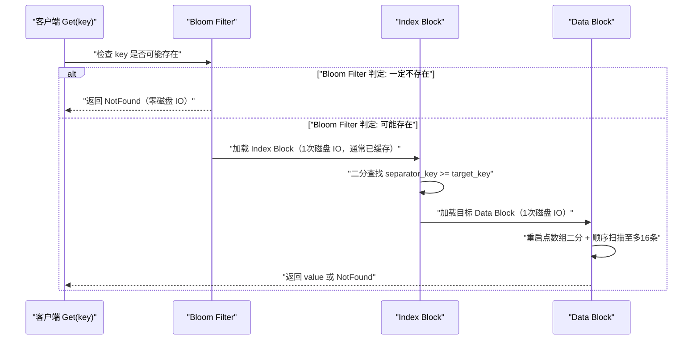

# SSTable 的文件格式与 Block 结构

## 摘要

SSTable（Sorted String Table）是 LevelDB 磁盘存储的核心单元，是 Immutable MemTable 刷盘后的不可变有序文件。理解 SSTable 的文件格式，是理解 LevelDB 读取性能来源的关键。本文从 SSTable 的整体文件布局出发，深度解析 **Data Block 的前缀压缩与重启点机制**（在节省空间的同时保留随机访问能力）、**Meta Block 中 Bloom Filter 的快速判否原理**（大幅减少不必要的磁盘 IO）、**Index Block 的稀疏索引设计**（以极小的内存代价定位任意 key 所在的 Data Block），以及 Footer 的固定锚点作用。每一个设计决策背后都是写入效率、读取效率与存储开销三者之间的精确权衡。

---

## 第 1 章 SSTable 的地位与生命周期

### 1.1 SSTable 是什么，为什么设计成这样

SSTable 这个名字来自 Google 的 Bigtable 论文（2006 年），原意是"Sorted String Table"——一个按 key 有序排列的、不可变的键值对文件。"不可变"（Immutable）是 LSM-Tree 架构的核心约束：一旦 SSTable 写入磁盘，就永远不会被修改，只会在 Compaction 时被整体删除并由新文件替代。

**为什么选择不可变设计？** 如果允许就地修改 SSTable，那么：
1. 修改一条记录需要先读取整个 Block（4KB），在内存中修改，再写回，变成随机读写，与 LSM-Tree 追求顺序写的目标背道而驰
2. 并发读取时需要加读写锁，大幅降低并发性能
3. 文件内容可能处于中间状态（修改了一半的 Block），增加崩溃恢复的复杂度

不可变性带来的好处是：SSTable 可以被多个线程、多个 Version 同时持有引用，零成本共享（无需加锁），文件内容的 CRC 校验也更容易维护。

### 1.2 SSTable 的产生时机

SSTable 通过两种方式产生：

1. **Minor Compaction（Minor 合并）**：Immutable MemTable 达到大小阈值后，后台线程将其顺序写出为一个 L0 层的 SSTable 文件。这个过程是纯顺序写，速度取决于磁盘顺序写吞吐量。

2. **Major Compaction（Major 合并）**：将 L(N) 层的一个或多个 SSTable 与 L(N+1) 层中 key range 有重叠的 SSTable 合并，读取所有输入文件的数据，进行有序合并（多路归并），写出新的 SSTable 到 L(N+1) 层，并删除所有输入文件。

每个 SSTable 文件都有全局唯一的文件编号（FileNumber），文件名格式为 `{FileNumber}.ldb`（旧版本为 `.sst`）。

### 1.3 SSTable 文件的总体布局

一个 SSTable 文件从逻辑上分为以下几个区域：

```
SSTable 文件结构（从文件头到文件尾）：
┌──────────────────────────────────────────────────────────┐
│  Data Block 0       (变长，默认约 4KB)                     │  ← 存储实际键值对
├──────────────────────────────────────────────────────────┤
│  Data Block 1       (变长)                                │
├──────────────────────────────────────────────────────────┤
│  ...                                                     │
├──────────────────────────────────────────────────────────┤
│  Data Block N       (变长)                                │
├──────────────────────────────────────────────────────────┤
│  Meta Block         (变长，存储 Bloom Filter 等元数据)     │  ← 快速过滤
├──────────────────────────────────────────────────────────┤
│  MetaIndex Block    (固定格式，指向各 Meta Block 的偏移量)  │  ← 元数据索引
├──────────────────────────────────────────────────────────┤
│  Index Block        (变长，每个 Data Block 对应一条索引)   │  ← 二分定位 Block
├──────────────────────────────────────────────────────────┤
│  Footer             (固定 48 字节，文件的"锚点")           │  ← 解析入口
└──────────────────────────────────────────────────────────┘
```

读取一个 SSTable 的第一步永远是**从文件末尾读取 Footer**——因为 Footer 是固定大小（48 字节）且位于文件末尾，可以用 `seek(-48, SEEK_END)` 精确定位，无需扫描文件。Footer 中存储了 Index Block 和 MetaIndex Block 的文件偏移量，是解析整个文件的"锚点"。

---

## 第 2 章 Footer——文件解析的入口

### 2.1 Footer 的结构

Footer 是 SSTable 文件的最后 48 字节，结构如下：

```
Footer 格式（48 字节）：
┌───────────────────────────────────────────────────────┐
│  MetaIndex Block 的 BlockHandle (变长，最多 20 字节)   │
│  Index Block 的 BlockHandle     (变长，最多 20 字节)   │
│  填充至 40 字节                                        │
│  Magic Number (8 字节固定值: 0xdb4775248b80fb57)       │
└───────────────────────────────────────────────────────┘
```

**BlockHandle** 是一个用于定位文件中某个 Block 的指针，包含两个字段：
- `offset`：Block 在文件中的字节偏移量（变长编码的 uint64）
- `size`：Block 的字节大小（变长编码的 uint64，不包含 Block Trailer）

**Magic Number** 的作用是防止将非 SSTable 文件误读为 SSTable。`0xdb4775248b80fb57` 是 Google 选择的一个随机幻数，在解析 Footer 时首先校验这个值，不匹配则立即返回错误。

**变长编码（Varint）** 是 LevelDB（和 Protocol Buffers）中广泛使用的整数编码方式：小整数用 1 字节表示，大整数用更多字节表示。例如偏移量 300（十六进制 0x12C）用 2 字节表示：`0xAC 0x02`（每个字节的最高位标识是否还有后续字节）。这比固定 8 字节编码节省空间，对于 SSTable 内的小偏移量尤其有效。

### 2.2 Block Trailer——完整性保证

每个 Block（包括 Data Block、Meta Block、Index Block）的末尾都跟随一个 **5 字节的 Block Trailer**：

```
Block Trailer（5 字节）：
┌─────────────────────┬──────────────────────────────────┐
│  压缩类型 (1 字节)   │  CRC32 校验和 (4 字节，小端序)   │
└─────────────────────┴──────────────────────────────────┘
```

- **压缩类型**：`kNoCompression=0`（无压缩）或 `kSnappyCompression=1`（使用 Snappy 压缩）。LevelDB 默认对 Data Block 使用 Snappy 压缩（通常压缩率 40%~70%），Index Block 和 Meta Block 不压缩（本身较小）。

- **CRC32 校验和**：覆盖 Block 内容 + 压缩类型字段，用于检测文件损坏。LevelDB 使用 masked CRC（异或旋转变换后的 CRC），避免全零数据和全零 CRC 的歧义。

在 `BlockHandle` 的 `size` 字段中记录的大小**不包含**这 5 字节 Trailer，因此读取一个 Block 时需要读取 `size + 5` 字节。

---

## 第 3 章 Data Block——键值对的存储核心

### 3.1 Data Block 的整体设计目标

Data Block 是 SSTable 中存储实际键值数据的基本单元，默认大小约为 4KB（`block_size` 参数）。每个 Data Block 存储一批有序的 InternalKey → Value 对。

设计 Data Block 面临两个矛盾的需求：
1. **压缩存储**：key 之间通常有大量公共前缀（如大量 `user:` 开头的 key），存储每个 key 的完整内容会浪费大量空间
2. **支持随机访问**：读取时需要能快速定位 Block 内的某个 key，如果所有 key 都只存储增量（差值），就必须从头顺序扫描，读取任意位置的代价为 O(N)

LevelDB 通过**前缀压缩 + 重启点（Restart Point）**机制，在空间压缩和随机访问之间找到平衡。

### 3.2 前缀压缩——相邻 key 的差量编码

由于 Data Block 内的 key 是有序的，相邻 key 之间往往有共同前缀。前缀压缩（Prefix Compression）利用这一规律，每条记录只存储相对于前一条记录的增量：

```
未压缩存储（原始）：
  [key: "user:001", value: "Alice"]   → 占用 17 字节
  [key: "user:002", value: "Bob"]     → 占用 16 字节
  [key: "user:003", value: "Carol"]   → 占用 18 字节

前缀压缩存储：
  [shared=0, non_shared=8, key_delta="user:001", value="Alice"]   → 首条记录，没有前缀复用
  [shared=7, non_shared=1, key_delta="2",       value="Bob"]      → 前7字节("user:00")与前一条相同
  [shared=7, non_shared=1, key_delta="3",       value="Carol"]    → 前7字节("user:00")与前一条相同
```

每条记录的编码格式：
```
记录编码格式：
┌──────────────────────────┬──────────────────────────┬──────────────────────────┬───────────────┬───────┐
│ shared_key_len (varint)  │ non_shared_key_len(varint)│ value_len (varint)       │ key_delta(非  │ value │
│ (与前一条 key 的共享前缀  │ (独有部分的长度)           │ (value 的字节长度)        │ 共享部分的字节)│       │
│  字节数)                 │                           │                          │               │       │
└──────────────────────────┴──────────────────────────┴──────────────────────────┴───────────────┴───────┘
```

前缀压缩可以大幅减少存储空间，对于 key 前缀重复度高的场景，压缩率可达 50% 以上。但问题是：若要查找 Block 中间某个 key，必须从 Block 开头逐条解码（因为每条记录的完整 key 需要结合前面的记录才能还原）。这就是**前缀压缩破坏随机访问能力**的问题。

### 3.3 重启点（Restart Point）——恢复随机访问能力

LevelDB 的解决方案是引入**重启点（Restart Point）**机制：

- 每隔固定数量的记录（默认 16 条，由 `block_restart_interval` 参数控制），强制将当前记录视为"重启点"——该记录不使用前缀压缩，存储完整的 key（即 `shared_key_len = 0`）
- Block 末尾维护一个**重启点数组**，记录每个重启点在 Block 内的字节偏移量

```
Data Block 内部结构：

┌──────────────────────────────────────────────────────────┐
│  记录 0 (重启点，shared=0，存完整 key)                   │
│  记录 1 (shared=N，前缀压缩)                             │
│  记录 2 (shared=N，前缀压缩)                             │
│  ...（共 block_restart_interval 条）                     │
├──────────────────────────────────────────────────────────┤
│  记录 16 (重启点，shared=0，存完整 key)                  │
│  记录 17 (shared=N，前缀压缩)                            │
│  ...                                                     │
├──────────────────────────────────────────────────────────┤
│  ...更多记录组...                                        │
├──────────────────────────────────────────────────────────┤
│  重启点数组 [offset_0, offset_16, offset_32, ...]        │  ← 每个重启点的文件偏移
│  重启点数量 (4 字节，uint32)                             │
└──────────────────────────────────────────────────────────┘
```

**查找一个 key 的过程**：
1. 对**重启点数组**进行**二分查找**，找到最后一个重启点 key ≤ 目标 key 的位置
2. 从该重启点开始，顺序解码后续记录（最多 `block_restart_interval - 1 = 15` 条），直到找到目标 key 或超过目标 key

最坏情况下只需顺序扫描 15 条记录（`block_restart_interval` 的默认值），使得随机访问的代价从 O(N)（N 为 Block 内记录数）降低到 O(block_restart_interval)，是一个固定的小常数。

> [!info] 核心概念
> **block_restart_interval 的取值权衡**：值越小，重启点越密集，随机访问越快，但压缩率越低（更多记录存完整 key）；值越大，随机访问越慢，但压缩率越高。LevelDB 默认值 16 是经验权衡。对于 key 相似度极高的场景（如时序数据的时间戳 key），可以适当增大此值以获得更好的压缩率。

### 3.4 Block 内的比较器（Comparator）

Data Block 内 key 的排序依赖**比较器（Comparator）**，LevelDB 的默认比较器是 `BytewiseComparatorImpl`——按字节序（字典序）比较 key。

LevelDB 允许用户自定义比较器（通过 `Options.comparator`），例如：
- 按时间戳数值排序（不是字典序）
- 忽略 key 中的某个前缀字段（如版本号）后再比较

自定义比较器还需要实现 `FindShortestSeparator` 和 `FindShortSuccessor` 方法，这两个方法用于生成 Index Block 中的分隔 key（详见第 5 章）——可以生成比 Data Block 最大 key 更短但同样有效的分隔 key，减少 Index Block 的空间占用。

---

## 第 4 章 Meta Block 与 Bloom Filter

### 4.1 Bloom Filter 要解决的问题

考虑这样一个读取场景：查询 `Get("nonexistent_key_12345")`，该 key 根本不存在于数据库中。

在没有 Bloom Filter 的情况下，读取路径必须：
1. 检查 MemTable（内存，快）
2. 检查 Immutable MemTable（内存，快）
3. 逐个检查 L0 层每个 SSTable：读取 Index Block（1 次磁盘 IO），定位到候选 Data Block（1 次磁盘 IO），确认 key 不存在——每个文件 2 次磁盘 IO
4. L1、L2...每层也需要类似操作

对于一个有 10 个 L0 文件 + 6 层的 LevelDB，查询不存在的 key 最坏需要约 20+ 次磁盘 IO，每次 IO 约 1ms，总延迟可达 20ms。对于大量"读取不存在 key"的场景（如缓存穿透），这是不可接受的。

**Bloom Filter** 正是为此而生：以极小的内存代价（每个 key 约 10 bits），在读取任何磁盘文件之前，**以 O(1) 时间、零磁盘 IO 的代价判断一个 key 是否"一定不在"某个 SSTable 中**。

### 4.2 Bloom Filter 的工作原理

Bloom Filter 的数学基础：一个 m 位的 bit 数组，k 个独立哈希函数。

**插入一个 key**：用 k 个哈希函数分别计算 key 的哈希值，将 bit 数组中对应的 k 个位设为 1。

**查询一个 key**：用同样的 k 个哈希函数计算 key 的哈希值，检查 bit 数组中对应的 k 个位：
- 若所有 k 个位都为 1：key **可能存在**（存在假阳性）
- 若有任意一个位为 0：key **一定不存在**（零假阴性）

```
Bloom Filter 示意（m=10, k=2, 已插入 "alice" 和 "bob"）：

bit 数组：  [ 0, 1, 0, 1, 0, 0, 1, 0, 1, 0 ]
索引：         0  1  2  3  4  5  6  7  8  9

插入 "alice"：hash1("alice")=1, hash2("alice")=6  → 位 1 和位 6 设为 1
插入 "bob"：  hash1("bob")=3,   hash2("bob")=8   → 位 3 和位 8 设为 1

查询 "carol"：hash1("carol")=1, hash2("carol")=5
  → 位 1=1（OK），位 5=0（失败！）
  → 结论："carol" 一定不在这个 SSTable 中，跳过
  
查询 "alice"：hash1("alice")=1, hash2("alice")=6
  → 位 1=1（OK），位 6=1（OK）
  → 结论："alice" 可能在这个 SSTable 中，继续读取 Index Block
```

**假阳性率的数学公式**：
$$P_{fp} = \left(1 - e^{-kn/m}\right)^k$$

其中 n 为已插入元素数量。对于固定的 m/n（bits per key），最优 k 值为 `k = (m/n) × ln(2) ≈ 0.693 × (m/n)`。

LevelDB 使用 10 bits per key（默认），此时最优 k ≈ 7，假阳性率约 **1%**。这意味着：100 次查询不存在的 key，只有约 1 次会因为 Bloom Filter 假阳性而触发额外的磁盘 IO，其余 99 次都会被 Bloom Filter 直接过滤。

### 4.3 LevelDB 的 Bloom Filter 实现细节

LevelDB 使用了一个简洁但高效的 Bloom Filter 实现技巧——**双哈希模拟多哈希**：

```cpp
// LevelDB Bloom Filter 的核心哈希计算（简化版）
// 只需要两个真正的哈希函数 h1 和 h2，即可模拟 k 个独立哈希函数
// 公式：hash_i(key) = h1(key) + i * h2(key)  （i = 0, 1, ..., k-1）

uint32_t h = Hash(key.data(), key.size(), 0xbc9f1d34);  // h1，种子固定
const uint32_t delta = (h >> 17) | (h << 15);           // h2 = h1 的循环位移

for (size_t j = 0; j < k_; j++) {
    const uint32_t bitpos = h % bits;  // 第 j 个哈希函数的 bit 位置
    array[bitpos / 8] |= (1 << (bitpos % 8));  // 设置对应位
    h += delta;  // h += h2，模拟下一个哈希函数
}
```

这个技巧（称为 Kirsch-Mitzenmacher optimization）被广泛引用：用位移和加法代替多次哈希计算，速度提升显著，且理论上假阳性率与使用 k 个独立哈希函数几乎相同。

**Bloom Filter 在 SSTable 中的存储位置**：Meta Block 区域。每个 SSTable 只有一个 Bloom Filter Meta Block，过滤整个文件中所有 key。LevelDB 也支持 "per-block" 模式（每个 Data Block 一个 Bloom Filter），但 "per-file" 模式是默认，因为过滤粒度到文件级别已经足够，且占用空间更少。

### 4.4 Bloom Filter 的内存占用分析

对于一个 LevelDB 数据库，Bloom Filter 的总内存占用为：

```
内存占用 = 总 key 数量 × bits_per_key / 8（字节）

例：1000 万个 key，bits_per_key=10：
  = 10,000,000 × 10 / 8 = 12.5 MB
```

LevelDB 默认将 Bloom Filter 存储在 SSTable 文件中（不加载到内存），读取时按需从磁盘加载到 Block Cache。若开启了 Table Cache（`Options.max_open_files` 控制缓存的文件句柄数），频繁访问的 SSTable 的 Bloom Filter 会常驻内存，读取时无需磁盘 IO。

> [!warning] 生产避坑
> Bloom Filter 只对"点查询一个不存在的 key"有加速效果。对于范围扫描（`NewIterator()` + `SeekToFirst()` + `Next()`），Bloom Filter 无法使用，因为无法预判 key 范围内有哪些 key。如果业务以范围扫描为主，应重点关注 Block Cache 和 Index Block 的内存配置，而非 Bloom Filter 的 bits_per_key。

---

## 第 5 章 Index Block——二分定位的核心

### 5.1 Index Block 的职责

Index Block 是 SSTable 的"目录"，为每个 Data Block 维护一条索引记录。读取一个 key 时，先在 Index Block 中**二分查找**定位到目标 key 可能所在的 Data Block，再加载该 Data Block 进行精确查找，避免扫描所有 Data Block。

### 5.2 Index Block 的记录格式

Index Block 的结构与 Data Block 相同（同样使用前缀压缩和重启点），但每条记录的含义不同：

```
Index Block 中的每条记录：
  key:   该 Data Block 的"最大分隔 key"（separator key）
  value: 该 Data Block 的 BlockHandle（offset + size）
```

**separator key 的设计**：Index Block 中记录的 key 不是 Data Block 中实际存在的 key，而是一个**分隔 key**——满足条件"该 Data Block 中所有 key ≤ separator key，且 separator key < 下一个 Data Block 中所有 key"的最短字符串。

例如，若 Data Block 0 的最大 key 是 `"user:100"`，Data Block 1 的最小 key 是 `"user:200"`，那么分隔 key 可以是 `"user:101"`（而不是完整的 `"user:100"`）。通过 `Comparator::FindShortestSeparator` 方法找到最短的合法分隔 key，可以减少 Index Block 的空间占用。

**查找过程**：在 Index Block 中执行 `Seek(target_key)`，找到第一条 `separator_key >= target_key` 的记录，其 value（BlockHandle）即为目标 Data Block 的位置。

### 5.3 Index Block 与整体查找流程的结合



**缓存策略的重要性**：Index Block 通常只有几 KB（每个 Data Block 一条记录，约 20~30 字节/条，一个 4MB SSTable 有约 1000 个 Data Block，Index Block 约 20~30KB），完全可以常驻 [[Block Cache]]。如果 Index Block 常驻缓存，读取一个已知存在的 key 只需**一次磁盘 IO**（加载 Data Block）。

---

## 第 6 章 MetaIndex Block——元数据的索引

### 6.1 MetaIndex Block 的结构

MetaIndex Block 是一个简单的 KV 映射，记录 SSTable 中所有 Meta Block 的名称和位置：

```
MetaIndex Block 内容示例：
  key: "filter.leveldb.BuiltinBloomFilter2"
  value: Bloom Filter Meta Block 的 BlockHandle（offset + size）
```

目前 LevelDB 只有 Bloom Filter 这一种 Meta Block，但 MetaIndex Block 的设计为未来扩展其他元数据类型（如统计信息、压缩字典等）预留了空间。这是**开闭原则**在文件格式设计中的体现——对扩展开放（新增 Meta Block 类型），对修改关闭（现有解析代码无需变更）。

---

## 第 7 章 SSTable 的构建过程

### 7.1 TableBuilder——SSTable 的写入器

LevelDB 通过 `TableBuilder` 类将有序的键值对流式写入 SSTable 文件。构建过程遵循严格的顺序性：

```
TableBuilder 工作流程：

1. 创建新 SSTable 文件，初始化 TableBuilder
2. 循环调用 Add(key, value)：
   a. 将 InternalKey + value 编码后追加到当前 Data Block
   b. 更新 Bloom Filter 过滤器状态（将 key 加入 Bloom Filter）
   c. 若当前 Data Block 达到 block_size（默认 4KB）：
      - 将 Data Block 刷写到文件（可选 Snappy 压缩）
      - 写入 Block Trailer（压缩类型 + CRC32）
      - 在 Index Block 中添加一条该 Data Block 的索引记录
      - 重置 Data Block 缓冲区，开始新的 Data Block
3. 调用 Finish()：
   a. 写出最后一个（不完整的）Data Block
   b. 写出 Bloom Filter Meta Block
   c. 写出 MetaIndex Block
   d. 写出 Index Block
   e. 写出 Footer（包含 Index Block 和 MetaIndex Block 的 BlockHandle + Magic Number）
4. 调用 Sync() 确保数据落盘
```

**为什么 Index Block 在 Data Block 之后才写出？** 因为每个 Data Block 的 offset 和 size（BlockHandle）只有在该 Block 写完后才能确定，必须按顺序确定每个 Data Block 的位置，才能构建 Index Block。这要求整个 SSTable 在构建时必须**从头到尾按序写出**，与 LSM-Tree 的顺序写原则完美契合。

### 7.2 SSTable 构建的性能特征

SSTable 的构建是纯顺序写操作，没有任何随机 IO。构建速度主要受以下因素影响：

| 因素 | 典型值 | 影响 |
|------|--------|------|
| 磁盘顺序写带宽 | HDD: ~100MB/s，SSD: ~500MB/s | 决定最大构建速度 |
| Snappy 压缩 CPU | ~250MB/s per core | 压缩速度通常高于磁盘带宽，非瓶颈 |
| Key 排序（已在 MemTable 完成） | 无额外开销 | MemTable 的 SkipList 已保证有序性 |
| Bloom Filter 计算 | ~100ns per key | 约 1000 万 key/s，几乎不影响 |

---

## 第 8 章 SSTable 的读取优化

### 8.1 Block Cache——热点数据的内存缓冲

LevelDB 通过 `Options.block_cache` 参数配置一个 LRU 缓存（默认 8MB），缓存最近访问的 Data Block。缓存的 key 为 `{cache_id, block_offset}`，value 为解压缩后的 Block 内容。

Block Cache 的命中率对读取性能影响巨大：
- **命中**：直接从内存读取，延迟约 100ns~1μs
- **未命中**：需要磁盘 IO，延迟约 1~10ms（HDD）或 100μs~1ms（SSD）

**Block Cache 大小规划**：一般建议将 Block Cache 设置为热点数据集大小的 10%~20%。对于 [[LRU（最近最少使用）]] 缓存，若热点数据分布符合 80/20 法则（80% 的访问集中在 20% 的数据），则 20% 大小的 Block Cache 可以获得约 80% 的命中率。

### 8.2 mmap 与直接 IO

LevelDB 支持两种文件读取方式，由 `Options.use_mmap_reads`（64位系统默认 true）控制：

**mmap 方式**：将 SSTable 文件直接映射到进程的虚拟地址空间。优点是读取时不需要额外的内存拷贝（直接从 [[Page Cache]] 读取），OS 负责管理缓存；缺点是如果打开的文件过多，会耗尽虚拟地址空间（在 32 位系统上尤为严重）。

**pread 方式**：通过 `pread(fd, buf, size, offset)` 系统调用读取文件。优点是精确控制读取范围，不消耗虚拟地址空间；缺点是需要一次用户态到内核态的拷贝。

在 64 位系统上，LevelDB 默认使用 mmap，充分利用 OS 的 Page Cache 作为额外的文件缓存层（在 Block Cache 之外）。

### 8.3 Table Cache——文件句柄缓存

除了 Block Cache（缓存 Block 内容），LevelDB 还维护一个 **Table Cache**（`Options.max_open_files`，默认 1000），缓存打开的 SSTable 文件句柄（包括 Bloom Filter、Index Block 等已解析的元数据）。

若一个 SSTable 在 Table Cache 中，读取时：
- **Bloom Filter**：直接从内存检查（零磁盘 IO）
- **Index Block**：直接从内存二分查找（零磁盘 IO）
- **Data Block**：根据 Block Cache 命中情况决定是否需要磁盘 IO

若不在 Table Cache 中，需要额外的磁盘 IO 来读取 Footer 和 Index Block，然后才能开始查找。

> [!info] 核心概念
> **缓存层次结构**：LevelDB 有三层缓存：OS Page Cache（全局，由 OS 管理）→ Table Cache（文件句柄和元数据，LevelDB 管理）→ Block Cache（Data Block 内容，LevelDB 管理）。理解这个层次结构，对于调优 LevelDB 的内存使用非常重要。`block_cache` 和 `max_open_files` 是最关键的两个内存相关参数。

---

## 第 9 章 文件格式的演进与扩展性设计

### 9.1 格式的向后兼容性

LevelDB 的 SSTable 格式在设计上考虑了向后兼容性：

1. **Footer 的 Magic Number**：不同格式版本可以使用不同的 Magic Number，加载时根据 Magic Number 选择对应的解析逻辑
2. **MetaIndex Block**：新类型的 Meta Block 只需在 MetaIndex Block 中注册，旧版本代码读取时遇到未知的 Meta Block 名称会直接忽略，不影响核心功能
3. **Block Trailer 的压缩类型**：新增压缩算法只需分配一个新的压缩类型编号，旧版本遇到未知压缩类型会返回错误（而不是静默损坏数据）

### 9.2 RocksDB 对 SSTable 格式的扩展

[[RocksDB]] 在 LevelDB 的 SSTable 格式基础上做了若干扩展（兼容旧格式的同时引入新特性）：

- **BlockBasedTable v2**：新增 Full Filter（整个文件一个 Bloom Filter）和 Partitioned Index（将大 Index Block 分片，减少内存占用）
- **压缩字典（Dictionary Compression）**：对于大量相似 Block，使用共享的 Zstd 压缩字典，显著提升压缩率
- **校验和算法扩展**：新增 xxHash64 等更高效的校验算法作为 CRC32 的替代

---

## 第 10 章 小结

### 10.1 设计决策全景回顾

SSTable 的文件格式体现了在多个约束条件下的精确权衡：

| 设计决策 | 解决的问题 | 带来的代价 |
|----------|-----------|-----------|
| **不可变文件** | 避免随机写，支持并发读 | 数据修改必须通过新文件 + Compaction 实现 |
| **前缀压缩** | 减少 key 存储空间（30%~70%） | 随机访问需要从重启点顺序扫描 |
| **重启点机制** | 恢复 O(1) 的 Block 内随机访问 | 每 N 条记录存一次完整 key（空间换时间） |
| **Bloom Filter** | 快速过滤不存在的 key（99% 命中） | 每 key 约 10 bits 的额外空间 |
| **Index Block** | 文件级别 O(log N) 定位 Data Block | Index Block 需要常驻内存（几十 KB/文件） |
| **Footer 固定位置** | 文件解析入口，零扫描定位元数据 | 格式固定，扩展时需要兼容设计 |

### 10.2 后续章节导引

- **[[04 Compaction——分层合并与版本管理]]**：理解多个 SSTable 如何通过 Compaction 进行有序合并，以及 VersionEdit/VersionSet 如何管理 SSTable 文件集合的 MVCC 版本
- **[[05 从 LevelDB 到 RocksDB——优化与演进]]**：分析 RocksDB 在 SSTable 格式、索引结构、压缩算法上的改进，以及这些改进背后的工程动机

---

> [!note] 思考题
> 1. LevelDB 使用 Leveled Compaction——每一层的总大小是上一层的 10 倍（默认）。Level 0 最多 4 个 SSTable 文件，Level 1 最大 10MB，Level 2 最大 100MB...。Compaction 选择一个 Level L 的 SSTable 与 Level L+1 中 Key 范围重叠的 SSTable 合并。在什么场景下 Compaction 的写放大最严重（如大量更新已有 Key）？
> 2. RocksDB 提供了多种 Compaction 策略：Leveled（LevelDB 默认）、Universal（类似 Size-Tiered）和 FIFO。Universal Compaction 将相似大小的 SSTable 合并——写放大更小但空间放大更大。在时序数据（TTL 删除旧数据）场景中，FIFO Compaction 直接删除过期的 SSTable——几乎没有写放大。你如何根据工作负载选择 Compaction 策略？
> 3. Compaction 消耗 CPU 和磁盘 IO——可能影响前台的读写性能。LevelDB 在后台单线程执行 Compaction。RocksDB 支持多线程并发 Compaction（`max_background_compactions`）。在 NVMe SSD 上，单线程 Compaction 是否会成为瓶颈？如何判断 Compaction 是否跟不上写入速度（Compaction 积压）？
